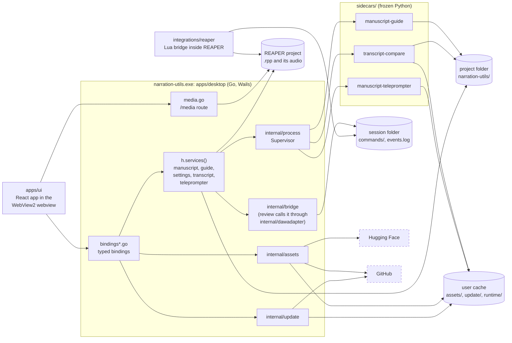

# Codebase map

Narration Utils names every top-level folder for the role of what is in it, and keeps its stable launch
and integration paths while organizing implementation around the product domain that owns its behavior.
The decision and the old-to-new path map are in
[ADR 0040](../adr/0040-the-repository-is-laid-out-by-role-and-each-project-is-an-nx-project.md).

## Repository layout

```
apps/
  desktop/        Go/Wails desktop host (app.go, bindings*.go, internal/, cmd/, build/: icons and the Windows setup program definition)
  ui/             React + Tailwind app; its tests/ hold the Playwright visual and atlas suites
sidecars/         Python programs frozen into the app and run on demand
  manuscript-guide/  manuscript-teleprompter/  transcript-compare/   (each: core/ CLI backend, tests/)
libs/
  python/         narration_common, the cross-tool Python contracts
integrations/
  reaper/         REAPER launcher and Lua bridge
  audacity/       placeholder notes for a future Audacity driver
config/           shipped JSON: defaults, asset catalogs, roadmap
tests/
  fixtures/       manuscripts and other data used by tests across projects
tools/
  ui-atlas-kit/   the reusable UI-atlas plugin (development tooling only)
  docs-site/      the public docs site: MkDocs config, include list and link hooks; reads docs/ in place
scripts/          repo automation, release and CI tooling
docs/             documentation, ADRs and PRDs
```

Only these entries may exist at the repository root. `scripts/ci/layout.test.mjs` runs in `pnpm check` and fails
on any other top-level entry, or on a tracked file that still names a retired path; the allowlist and the
old-to-new path map live in `scripts/ci/layout.json`.

### Where tests go

Tests follow the toolchain. Colocate them where the toolchain wants that: Go `_test.go` beside the package,
Vitest `*.test.tsx` beside the component, Storybook stories beside the primitive, `node:test` files beside
the script. Otherwise a project has one `tests/` folder at its root (`libs/python/tests`,
`sidecars/<name>/tests`, `scripts/release/tests`). The Playwright visual and atlas suites stay in
`apps/ui/tests`, because the atlas kit scaffolds them into the project it serves. Data shared by several
projects lives in `tests/fixtures`. Go code and tests name repo-relative locations through
`apps/desktop/internal/layout`, and `scripts/release/prepare-resources.py` keeps its own constants, so the
next move is a one-line change in each.

### Projects

Every folder above except `docs/` is an Nx project with a `project.json`; `pnpm check` and CI run their
`lint`, `format`, `test` and `build` targets, and CI runs only the projects a change affects. See
[Nx projects and the quality gate](../operations/ci-and-releases.md#nx-projects-and-the-quality-gate).

## Stable boundaries

- `apps/desktop/` is the Go/Wails desktop host. It exposes generated, typed Wails
  bindings and native events only; it has no loopback HTTP surface, port, or
  browser fallback. Its Go module path is still
  `github.com/countrymanprime/narration-utils/shell`; nothing imports it.
- `apps/ui/` is the React application. It communicates only through the
  typed API facade; feature components do not import HTTP transport code.
- `sidecars/*/core/` remain stable Python CLI entrypoints for DAW integrations.
- `integrations/reaper/` is the REAPER-only bridge. Its field order and protocol are
  compatibility contracts. A checkout finds the sidecars, catalogs and launcher relative to
  `integrations/reaper` (two levels up is the repo root); packaged builds use `resources/`.
  `integrations/reaper/tests/` is the Lua bridge harness (see [the REAPER bridge](reaper-bridge.md)).
- `libs/python/narration_common/` contains only cross-tool contracts such
  as canonical manuscript access, settings, logging, progress, and bridge
  encoding. Feature-specific analysis stays with its tool.

## How the parts connect

Everything runs on the narrator's machine. The only things that leave it are the three boxes at the bottom, and each is a request the narrator can see and switch off, except the fonts, which are a known finding ([#238](https://github.com/countrymanprime/narration-utils/issues/238)). The diagram is a container view: one box per running thing or store, one arrow per call that crosses a boundary; the table under it says what each arrow is. The [threat model](threat-model.md) walks the same boundaries one by one, and the flows that need a sequence are drawn beside the doc that owns them.



| Arrow | What it is | Read more |
| --- | --- | --- |
| `apps/ui` to `bindings*.go` | One Wails binding call per action, a JSON string back; events (`teleprompter:event`, `teleprompter:state`, `transcript:state`, `coverage:state`, `job:ended`, `update:status`, `system:*`) go the other way | [wire contracts](wire-contracts.md) |
| `apps/ui` to `media.go` | The webview asks `/media` for a track's audio (Range requests); the route serves only a source file that the current project's `.rpp` names | [ADR 0012](../adr/0012-media-route-for-track-playback.md) |
| `services` and `media.go` to the project file | The host reads the `.rpp` (tracks, items, source files) and never writes it; REAPER's own Lua bridge changes the project (markers, regions, item data), one undo block per command | [Tracks](../utilities/tracks.md) |
| `services` to `internal/process` to a sidecar | `exec.CommandContext` with an argv slice, no shell, inside a Windows Job Object; results come back on stdout (NDJSON for the teleprompter) and in files | [ADR 0022](../adr/0022-live-sidecar-events-over-wails-and-stop-file.md) |
| sidecars to the stores | Read the manuscript and write results in the project folder; load a model with `--model-dir` from the user cache, local files only | [first-use provisioning](first-use-dependency-provisioning.md) |
| `internal/bridge` and `integrations/reaper` to the session folder | The host writes `commands/NNNNNNNN.cmd` atomically; the Lua bridge appends `events.log`; nothing listens on a socket | [the REAPER bridge](reaper-bridge.md) |
| `internal/assets` to Hugging Face and GitHub | Pinned URLs, size and SHA-256, staging then rename, only after the narrator confirms | [first-use provisioning](first-use-dependency-provisioning.md) |
| `internal/update` to GitHub | The release list once a day at most; a download only after two clicks; the program is replaced on Windows | [in-app update](in-app-update.md) |

The settings, the recents list and the host log live in `%APPDATA%/narration-utils`, beside the user cache (`%LOCALAPPDATA%/narration-utils`); `services` reads and writes them and no arrow is drawn for it. *Verified 2026-09-21 against `apps/desktop/app.go` (`configureLocked`, `packagedResources`), `bindings.go`, `bindings_assets.go`, `media.go`, `internal/process/`, `internal/bridge/`, `internal/assets/`, `internal/update/`, `integrations/reaper/NarrationUtils_Launcher.lua` and `apps/ui/index.html` (the fonts are bundled since #238, so the webview asks no other host). A box names the folder or file that owns it, a dashed arrow or box is a request the narrator did not ask for or a host that is not ours, and a label names the mechanism, not the intent.*

## Go host ownership

`apps/desktop/bindings.go` is the auditable generated-Wails binding index. The native app does not expose HTTP routes.

Every binding reads the project-scoped services (manuscript, Story Bible, settings, transcript, teleprompter) through `h.services()` in `apps/desktop/services.go`, never off the `Host` directly, because a project switch replaces them; `hostguard_test.go` fails `go test` otherwise. The asset registry (voices, Whisper and spaCy models) is not project-scoped: it is built once at start and never replaced, so the asset bindings read it without a snapshot. See [host binding concurrency](host-binding-concurrency.md).

- `system` owns health, bootstrap, settings, diagnostics, and shutdown.
- `manuscript` owns canonical text, reader state, notes, and import jobs.
- `story_bible` owns guide entities, relationships, audio preview, and build jobs.
- `transcript` owns comparison lifecycle, review results, and marker export.
- `tts` owns the approved voice catalog (`config/tts-assets.json`) and the Piper preview voices; `whisper` owns the transcription model catalog (`config/whisper-assets.json`) and `spacy` the Story Bible language model catalog (`config/spacy-assets.json`). None of them downloads anything itself: each is a catalog on top of the asset manager below.
- `assets` (`internal/assets`) is the one lifecycle every downloadable asset shares: install into a staging folder, verify size and SHA-256, rename into place, resume, repair, verify and remove, with a manifest in each install folder, the free-space check, archive unpacking and the cache location. See [first-use dependency provisioning](first-use-dependency-provisioning.md) and [ADR 0078](../adr/0078-asset-state-comes-from-the-manifest-an-asset-is-read-in-full-once-per-session-and-a-failed-download-resumes.md).
- The host files that put the asset manager in front of the UI: `assetcache.go` (the per-user cache location, stale-staging cleanup, and the registry built once at start), `assetregistry.go` and `assetproviders.go` (one provider per kind of asset: voices, Whisper models, spaCy models; [ADR 0079](../adr/0079-every-downloadable-asset-is-listed-installed-verified-and-removed-through-one-registry-of-providers.md)), `bindings_assets.go` (`AssetsList`, `AssetsInstall`, `AssetsInstallState`, `AssetsInstallCancel`, `AssetsVerify`, `AssetsRemove`), `installjobs.go` (the one install job every asset uses, with real bytes; a second start joins the running job; [ADR 0077](../adr/0077-every-asset-install-is-one-job-with-real-bytes-a-second-start-joins-it-and-one-hook-follows-it.md)) and `jobs.go` (the `job:ended` event every host job finishes with). `guidegate.go` is the Story Bible first-use gate: it decides whether a build gets an installed spaCy model, must ask first (`asset_required`) or runs rules-only this once ([ADR 0080](../adr/0080-the-story-bible-language-model-is-a-catalog-asset-unpacked-at-install-and-the-build-asks-before-it-downloads.md)).
- `update` (`internal/update`, with `update.go`, `update_job.go`, `update_install.go` and `bindings_update.go` in the host) checks GitHub for a newer release of this repository at most once a day (two hours after a failed check), downloads and stages one only after a click, and on Windows replaces the running program ([in-app update](in-app-update.md)). `version.go` holds the stamped version.
- `smoke.go` is the packaged-app smoke test, `narration-utils --smoke`: it runs before the window exists, checks what a release carries and exits non-zero on a failure ([CI and releases](../operations/ci-and-releases.md#the-packaged-app-smoke-test)).
- `apps/desktop/cmd/seed-assets` is the developer-only seeding command behind `pnpm run assets:seed`; it installs approved catalog assets into the same per-user cache through the same managers. `cmd/manuscript-import` is the standalone importer entry point, and `cmd/narration-utils/` holds only the embedded UI bundle and sidecar resources that the release build fills in.
- `apps/desktop/build/windows/installer/project.nsi` is the Windows setup program definition (NSIS, per user; [ADR 0082](../adr/0082-windows-installs-per-user-from-an-nsis-setup-program-that-wails-builds-and-the-release-carries-beside-the-update-zip.md)). Wails regenerates the rest of `build/windows/` on every build.
- `tracks` owns reading a project's `.rpp` file (discovery, selection, track/item metadata). `apps/desktop/media.go` serves those tracks' audio to the webview through the asset server's `/media` route (see [ADR 0012](../adr/0012-media-route-for-track-playback.md)); it is the only non-frontend content the asset server serves.
- `findings` implements the [findings contract](findings-contract.md) record (validation, stable IDs, review state); analyzers emit it without importing REAPER APIs. The `Findings*` bindings (`apps/desktop/bindings_findings.go`) serve the Review page, `apps/ui/src/components/review/`, which lists, filters and decides them.
- `stages` holds the chapter stage recommendations contract: the tri-state `Signal`, the `Provider` interface signal owners implement, and the pure engine that turns a chapter's required signals into a suggestion the narrator confirms (see [stage recommendations](stage-recommendations.md) and [ADR 0160](../adr/0160-stage-recommendations-are-computed-from-tri-state-signals-by-a-pure-engine.md)). Nothing calls it yet.
- `measure` reads WAV files (whole, or a source-time `Range` of one) directly and computes loudness, RMS, peaks, noise floor and clipping, plus `Evaluate` against a caller-supplied profile (see [ADR 0025](../adr/0025-delivery-measurements-in-go-profiles-deferred.md)). `MeasureTake` turns one take of a `tracks.Item` into per-category take evidence (clipping, noise, level consistency, duration, pause profile), each measured or unavailable with a reason, and no combined score ([ADR 0140](../adr/0140-take-metrics-are-per-category-evidence-over-a-takes-source-range.md)). Not yet exposed through the Wails binding surface.

- `teleprompter` owns one live listening session: it runs the `manuscript-teleprompter` sidecar, relays its events as `teleprompter:event`, publishes phase changes as `teleprompter:state`, and keeps the last `script` and `position` so a page opened mid-session can catch up (see [ADR 0022](../adr/0022-live-sidecar-events-over-wails-and-stop-file.md)). The Teleprompter page lives in `apps/ui/src/components/teleprompter/` (see [ADR 0024](../adr/0024-teleprompter-highlight-follows-the-sidecars-spans.md)).

`apps/desktop/internal/` holds domain services and infrastructure. The Wails binding
surface is operation-specific; it does not accept arbitrary route names.

- `hostlog` is the host's local log (`SystemReportDiagnostic` writes to it); `persist` reads the files the host keeps without failing silently; `contractfile` pins the payloads the host sends for the UI's contract tests. How data is checked where it crosses a boundary is in [wire contracts](wire-contracts.md).

## UI ownership

Every payload the UI receives is validated by a Zod schema in `apps/ui/src/api/schemas/` through `parseWire` (`apps/ui/src/api/wire/`); a new binding, event or persisted file adds its schema and golden payload in the same pull request ([wire contracts](wire-contracts.md)).

Every call the UI makes to the host has a row in a catalog with a verdict against the interaction feedback standard (`apps/ui/src/interactionFeedback.catalog.ts`, checked by `interactionFeedback.test.ts`), so a new call adds its row in the same pull request; a control that starts something slow takes `pending`, and a host job that ends emits `job:ended` ([interaction feedback](interaction-feedback.md)).

The asset UI is `apps/ui/src/components/assets/` (`AssetInstallPrompt` is the first-use dialog every gated feature shows, `AssetFacts` the version, size, publisher, licence and destination it lists, `LocalAssets` and `LocalAssetRow` the Settings > Local assets page) on the `useAssetInstall` hook (`apps/ui/src/hooks/`), which follows one install job to its end for every kind of asset; `api/assetInstallMock.ts` scripts install steps for the mock host ([ADR 0077](../adr/0077-every-asset-install-is-one-job-with-real-bytes-a-second-start-joins-it-and-one-hook-follows-it.md), [ADR 0081](../adr/0081-local-assets-is-a-settings-list-built-from-the-registry-whose-rows-own-their-download-verify-and-remove.md)).

`apps/ui/src/api/contracts/` contains the TypeScript wire contracts by
domain. `types.ts` is a compatibility barrel during migration. New feature
work should import from its owning contract module and keep component-local
state or hooks beside the feature. For example, Story Bible pronunciation
playback lives in `components/storybible/usePreviewAudio.ts`, while editing and
rendering remain in `GuideDetail.tsx`.

## Sidecar boundary

The Python sidecars retain their stable `core` CLI contracts and are frozen
as immutable packaged sidecars. Go supervises them; feature code must not add
a Python server or a browser transport.
