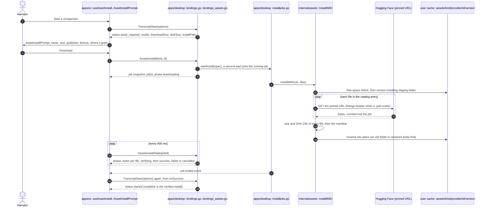

# First-Use Dependency Provisioning

**Status: Implemented** for every kind of optional asset the app ships: Piper preview voices, Whisper transcription models,
Story Bible spaCy language models and, as of `teleprompter-engines-and-input-devices.prd.md` phase 5, the Moonshine live-engine
models' catalog and provisioning (installable through Settings > Local assets like every other kind; since phase 7 the Teleprompter launches it when the narrator
chooses it, asking before downloading like any first use; since phase 6 the Windows sidecar runs Moonshine from such an install and never downloads a
model itself, [ADR 0107](../adr/0107-moonshine-ships-inside-the-windows-teleprompter-sidecar-and-runs-only-from-a-verified-catalog-install.md)). This document holds the rules
that code, other docs and `SECURITY.md` are checked against; the sections from "The asset manager" on describe what implements them.

What is delivered, and what is deliberately not:

- **Delivered.** One catalog per kind (`config/{tts,whisper,spacy,moonshine}-assets.json`) with pinned URLs, sizes and SHA-256; the
  asset manager and its manifest, resume, repair and free-space check; the registry and the `Assets*` bindings (a later kind is a
  catalog file, a provider and a row on the page, with no new binding - exactly how Moonshine's own provider was added); the
  first-use dialog for Piper, Whisper and Story Bible (with the rules-only choice); Settings > Local assets; no download and no
  request at startup other than the switch-off-able update check (tests in `apps/desktop/startup_offline_test.go`); the
  legacy-cache policy; the developer seeding command; and the packaged smoke test, `narration-utils --smoke`, which CI runs on the
  Windows build. Each shipped artifact's record (publisher, version, URL, SHA-256, licences, install location, update policy) is in
  [local dependency evaluation](../research/local-dependency-evaluation.md#shipped-assets).
- **Not bundled.** No model, voice or dictionary is inside the release; a narrator downloads each one, once, after confirming.
- **No automatic updates of assets.** The catalog is pinned per release and there is no "update available" state; an asset is
  replaced only by the narrator's own Remove and Download, or Repair.
- **Windows first.** The setup program and the in-app update are Windows features ([CI and releases](../operations/ci-and-releases.md#the-windows-setup-program));
  macOS and Linux builds are previews without an installer, and their first-use behaviour is the same code but is not smoke-tested.
  The setup program is built in CI and has not yet been run on a clean machine by the owner (release-readiness phase 14 and the first
  stable rehearsal). Work still open is tracked in [release-readiness-provisioning-and-docs-site.prd.md](../prds/release-readiness-provisioning-and-docs-site.prd.md).

## Problem

`pnpm run bootstrap` is a developer-checkout bootstrapper. It creates the local
environment and installs locked Python/UI/build dependencies, but it downloads
neither spaCy models nor Piper voices. That is unsuitable for a GitHub
release consumer: a compiled application must launch without a source checkout,
Node, Go, a Python bootstrap installer, or a developer bootstrap command.

The application should also avoid consuming network bandwidth and disk space
for an analyzer or voice that the narrator never elects to use.

## Intended experience

The GitHub release contains all executable code and runtime libraries required
to start the application and its local backend. On its first application launch,
the app creates only its settings and asset-cache directories, validates its
bundled runtime, and shows which optional assets are installed. It does not
download a model merely because the application opened.

When a narrator first invokes a capability that needs an optional asset, the
app checks the selected compatible asset:

1. If it is installed and valid, the capability runs immediately.
2. If it is absent, the app identifies the required model/voice, its publisher,
   version, download size, local disk requirement, license/provenance link, and
   destination. The narrator must choose **Download** before any transfer
   starts.
3. The app downloads, verifies, and installs the asset locally, then resumes
   the requested operation. **Cancel** leaves the asset uninstalled and leaves
   the rest of the app usable.

Selecting a model in Settings must not itself download it. A user can choose a
compatible model first and download it only when they use that feature (or
explicitly choose the Download action of Settings > Local assets).

For example, opening the app or working only with Transcript Compare must not
install spaCy. Building a Story Bible with `en_core_web_sm` offers that
model for download if it is absent (Download, build with rules-only this once, or Cancel). The same flow must permit every approved,
compatible spaCy model—not just models already present on the machine—and must
apply to Piper voices, Whisper models, and later optional tools/model packs.

## Product and implementation rules

- Treat optional model weights, voices, dictionaries, and external tool packs
  as assets, not as ordinary application-startup dependencies. The base release
  remains responsible only for code needed to start the app and display this
  flow.
- Maintain a versioned asset catalog in the release. Each supported asset needs
  a stable identifier, capability compatibility, exact version, immutable URL,
  SHA-256 (or stronger) hash, expected size, publisher, license/notice, model
  card/provenance link when applicable, and install layout. Do not use moving
  `latest` aliases or unrestricted `pip install`/tool downloads at runtime.
- The Settings and capability UI must obtain their choices from the compatible
  catalog and expose install state separately (`installed`, `not installed`,
  `downloading`, `verification failed`, or `update available`; the last is not
  implemented, see above). Do not hide a
  compatible choice solely because it has not been downloaded yet.
- Put downloaded assets in a per-user application-data cache outside the
  installed release and outside a project folder. The Windows location is
  `%LOCALAPPDATA%\narration-utils\assets`, nothing ever deletes an asset except the
  narrator's Remove, and there is one per-user folder, which every version and install of that user
  reuses, and no second store (owner decision Q3); asset paths must never be stored as checkout-relative paths.
- Download to a temporary file, verify its hash and expected content before
  atomically making it available, and remove incomplete temporary files on
  cancellation or failure. A corrupt or partial asset must never be selected.
- Show progress, allow cancellation when the upstream format permits it, and
  give an actionable offline/error state. The app may retry only after an
  explicit user action; it must not silently fall back to a different model.
- Preserve the exact installed version and provenance in the cache manifest so
  diagnostics can report it and a user can repair or remove it. Removal must
  not remove user settings, project sidecars, or the base application.
- Updates are opt-in. An available upstream version may be displayed only when
  it has been added to a reviewed release catalog; it may not replace an
  installed model automatically.
- The application's own update follows the same rule and adds one thing. Once a
  day at most, in the background and unless the narrator turned it off
  (Settings > About and updates), the app asks GitHub which releases exist. That
  request is metadata only: it downloads no asset and sends nothing about the
  narrator, their projects or their machine. Nothing is downloaded and nothing
  is replaced without an explicit, confirmed click ([ADR 0072](../adr/0072-the-app-updates-itself-from-this-repositorys-releases-and-never-installs-without-a-click.md)).

This work follows the artifact-level license and provenance requirements in
the [local dependency evaluation and license plan](../research/local-dependency-evaluation.md),
which records every shipped artifact and describes first-use provisioning (there is no
setup-time download).

## What the release and the developer bootstrap each provide

The release build must package the compiled shell, UI assets, local backend,
and its base runtime into the GitHub release artifact. It must not call
`pnpm run bootstrap` or require developer build tooling after installation.

The developer bootstrap does not preload optional assets. Development exercises the same
catalog and first-use installer as the released application. The one explicit way to have
assets without the first-use download is the developer-only seeding command,
`pnpm run assets:seed` (`apps/desktop/cmd/seed-assets`): it installs approved catalog assets by
`kind` or `kind/id` (`tts`, `whisper`, `spacy`, or `all`) into the same per-user cache through
the same managers, catalogs and hash verification the app uses, so the app recognises what it
installed. `--list` shows every approved asset and its state; `--cache-dir` installs somewhere
else (the app only reads the per-user cache). It reads the catalogs of the checkout it runs in (or
`--repo-root`), which are trusted input: run it only in a checkout you trust. It is for offline tests and packaging checks;
bootstrap never calls it and a release never contains it.

### Migration from the retired bootstrap

Owner decision (release-readiness Open Question 7): **legacy caches are deliberately ignored,
never adopted.** The retired Windows bootstrap kept voices and models in `.piper`, `.runtime`
and `.bootstrap` folders; they were gitignored developer artifacts, and nothing recorded a
version or hash for what they hold. The app therefore never reads them, never treats a file in
one as an installed asset (even one that is byte for byte a catalog file), never moves or
deletes them, and downloads its own verified copy on first use. There is no import flow. A
narrator or developer who wants the disk back removes the folders by hand; a real user with an
old cache who would rather reuse it is the trigger to design an explicit import that verifies
each file against the catalog (revisit then, not before). The tests
`TestAFileInARetiredBootstrapFolderIsNeverAnInstalledAsset` and
`TestARetiredBootstrapFolderNextToTheRealCacheIsIgnoredAtLaunch` in
`apps/desktop/startup_offline_test.go` hold the policy.

## The asset manager (implemented)

`apps/desktop/internal/assets` owns the lifecycle for every asset kind ([ADR 0078](../adr/0078-asset-state-comes-from-the-manifest-an-asset-is-read-in-full-once-per-session-and-a-failed-download-resumes.md)):

- **Layout.** `<per-user cache>/narration-utils/assets/<kind>/<provider>/<id>/<version>/`. The cache folder is `os.UserCacheDir()`; when the operating system cannot name it there is no fallback to the temporary folder, the catalog is unavailable and the host log says why. Nothing ever deletes an installed asset except the narrator's Remove.
- **Manifest.** `manifest.json` in the install folder records provider, id, exact version, every file with its size, SHA-256, source URL and modification time, when it was installed and last verified, and whether the last Verify found it damaged.
- **State is cheap.** A listing trusts the manifest: an asset whose manifest names the catalog's files, sizes and hashes and whose files still have the recorded size and modification time is `installed` without reading a byte (all five Whisper models, 5.3 GB, list in 0.6 ms; reading them was 3.2 s). Anything else is hashed. The first use of an asset in a session (`assets.Ready`, called by `Paths` and `Dir`) reads it in full once, so damage since the install is found before the model loads. `Verify` always reads it in full and records the result; a failed one marks the asset `verification_failed` until `Repair`.
- **Install and repair.** Files download to `<version>.installing`, each is checked against its size and SHA-256, and the folder is renamed into place; a folder that is already there is renamed aside first and removed only when the new one is in, and put back if that fails. A file the catalog does not name never lands in an install. `Repair` reads the asset, downloads it again only if it is damaged, and leaves a good one alone.
- **Resume.** What arrived before a network or disk failure stays as `<file>.part` and the next attempt continues it with an HTTP Range request (Hugging Face answers `206 Partial Content`; a host that ignores the range is started from the top, and a refused range starts over). A cancel, or a file that fails its hash, removes it. A staging folder older than a week (and the aside copy of a repair older than an hour) is removed at start.
- **Disk.** Before anything is written the free space on the cache disk is checked against what is still to be downloaded plus 64 MB, and a refusal names both sizes. A disk that fills mid-download keeps what arrived.
- **Archives.** A catalog file with `extract` is unpacked into the install folder after it is downloaded and checked, and the archive is deleted; the manifest records every unpacked file and the unpack refuses paths that leave the install, links, device names, duplicates and more data than the catalog says (a spaCy model wheel is the first).
- **Failures the narrator reads** are sentences (checksum mismatch, no room, a host that no longer has the file or is busy, no connection); the cause is in the host log as `install_failed`.

### The install, step by step

The gated call, the prompt, the download and the retry, for a Whisper model that Transcript Compare needs. Every kind of asset takes the same path; only the binding that hits the gate differs.

*Verified 2026-09-21 against `bindings.go` (`TranscriptStart`, `modelAssetRequired`), `bindings_assets.go`, `installjobs.go` (`startInstall`, `runInstall`), `internal/assets/store.go` (`InstallWith`, `swapIn`), `internal/assets/download.go` and `apps/ui/src/hooks/useAssetInstall.ts` (`POLL_MS = 400`). Nothing before step 5 downloads anything: steps 1 to 4 are a gate that answers with what would be downloaded. A failure at any step leaves the staging folder or its `.part` files and never a half-installed asset; Cancel ends the job and keeps what arrived for the next attempt. The threats at each step are rows 1a to 1d of the [threat model](threat-model.md#1-first-use-downloads-securitymd-bullet-2).*

## The asset registry (implemented)

Every kind of asset is one provider in a registry that is built once at start and never replaced ([ADR 0079](../adr/0079-every-downloadable-asset-is-listed-installed-verified-and-removed-through-one-registry-of-providers.md)). Six generic bindings serve all of them: `AssetsList` (state, size, publisher, licence and provenance links, install path, installed and verified times, and the download running for each asset; it reads no file contents), `AssetsInstall(kind, id)` (installs, or repairs a damaged asset; a second call for a running download joins it), `AssetsInstallState`, `AssetsInstallCancel`, `AssetsVerify` and `AssetsRemove` (refused while the asset downloads; it removes only that asset). The install is the one job of [ADR 0077](../adr/0077-every-asset-install-is-one-job-with-real-bytes-a-second-start-joins-it-and-one-hook-follows-it.md). The third kind, the Story Bible language models (spaCy, [ADR 0080](../adr/0080-the-story-bible-language-model-is-a-catalog-asset-unpacked-at-install-and-the-build-asks-before-it-downloads.md)), was exactly that: a catalog file, a provider and a row on the page. The fourth kind, the Moonshine live-engine models (`teleprompter-engines-and-input-devices.prd.md` phase 5), was the same again - no new `Assets*` binding, no `hostAPIVersion` bump. Its ids (`tiny`, `small`) are the same words the Whisper catalog uses; they never collide because the install directory is built from each catalog entry's own `provider` field (`moonshine`, `faster-whisper`), not the kind alone. A later kind (dictionaries) is the same. The voice and Whisper bindings that predate the registry (`TtsInstall`, `WhisperRemove`, ...) are wrappers over the same functions until the pages that use them move over.

## The local assets page (implemented)

Settings > Local assets (Global scope) is the one place to see, verify, repair and remove what the app keeps on this computer. `apps/ui/src/components/assets/LocalAssets.tsx` lists `AssetsList`, so a new kind of asset appears there with no page work. Each row shows the kind, name, exact version, publisher, licence, model card and provenance links, the download and disk sizes and one of five states: not installed, downloading (real bytes and percent from the install job, with Cancel while bytes arrive), verifying, installed and needs repair (`verification_failed`). The row owns its download through `useAssetInstall`, and a download that was already running when the page opened is followed through the list's `activeJobId`, so leaving the page never loses one. Not installed offers Download, installed offers Verify (a busy button, because it reads every byte) and Remove, and needs repair offers Repair (the install call, which repairs) and Remove. Remove is a danger confirm that says what it frees and what will ask to download it again. A failed download, verification or removal is written in the row, never silent. The page also shows the total the installed assets use and the cache folder; the folder is shown and never changed or emptied from here (owner decision Q3), and only the narrator's Remove deletes an asset. The mock seeds `?mockAssets=installing|checking|damaged` reach every state without a host, and the visual suite captures each one at every viewport including the 390 px reflow width.

## The packaged smoke test (implemented)

`narration-utils --smoke` proves what "the release contains everything needed to start" claims, on the executable that ships: it
unpacks the bundled resources, starts every frozen sidecar, checks that the frozen Story Bible sidecar can load its dictionary and
start its speech phonemizer (the data a freeze silently loses), loads the four approved catalogs, writes the asset cache and checks
the REAPER package, prints a JSON report and exits non-zero on any failure, with no window and no download. CI runs it on the
Windows build before the asset is packaged; details, the checks and the decision not to download the voice in CI are in
[CI and releases](../operations/ci-and-releases.md#the-packaged-app-smoke-test).

## Acceptance criteria

- A clean machine can install a GitHub release and open the app without a
  repository checkout, Node, Go, an external Python installer, or
  `pnpm run bootstrap`.
- First application launch performs no optional asset download and makes no
  request other than the once-a-day update check, which asks GitHub for release
  metadata only, downloads no asset and can be switched off (see the update rule
  above and [ADR 0072](../adr/0072-the-app-updates-itself-from-this-repositorys-releases-and-never-installs-without-a-click.md)).
  Selecting a model in Settings makes no request at all. Both are tests in
  `apps/desktop/startup_offline_test.go`: a `http.DefaultTransport` that fails and
  records every request, run over `NewHost`, `Startup`, the first `Bootstrap`,
  the settings, catalogs and asset list, and over saving each approved
  spaCy, Whisper and Piper choice.
- A narrator who never builds a Story Bible does not download spaCy; a narrator
  who never requests a Piper preview does not download a Piper voice.
- Every catalog-approved compatible spaCy model is selectable before it is
  installed and can be downloaded only after explicit confirmation.
- Invoking a feature with a missing selected asset clearly identifies it,
  supports download/cancel, verifies the completed asset, and then completes
  the originally requested operation without changing the selected model.
- Offline, cancelled, interrupted, hash-mismatched, and disk-full downloads
  leave no usable partial asset and provide a retry/repair path without
  blocking unrelated tools.
- Reopening the app recognizes a verified installed asset without downloading
  it again. Removing an asset makes only dependent capabilities unavailable.
- Automated tests cover catalog compatibility, first-use gating, no-download
  startup, verification failure, cancellation/resume behavior, and a packaged
  release smoke test.

## Out of scope

This does not authorize new models or change the product's local-first,
narrator-review boundaries. It does not require bundling optional model weights
in the GitHub release, cloud processing, background downloads, or automatic
model updates.
