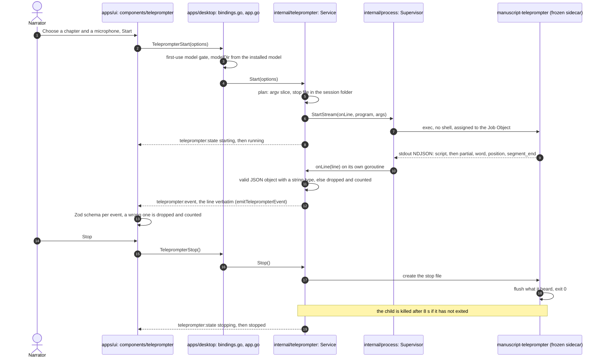

# Manuscript Teleprompter

**Status: Shipped (first cut).** The ASR sidecar, its Go host relay and the Teleprompter page exist. This document is the design record; open and planned work is specified in [teleprompter-engines-and-input-devices.prd.md](../prds/teleprompter-engines-and-input-devices.prd.md) and [teleprompter-manuscript-integration.prd.md](../prds/teleprompter-manuscript-integration.prd.md).

## Problem

The roadmap's deferred-work line names the feature in one sentence: local live
microphone listening with karaoke-style manuscript highlighting and
reviewable suspected word-level substitutions, skips, or misreads; it never
edits text or audio automatically. Everything else — how position tracking
behaves, which ASR approach is realistic in real time, how flags surface for
review, and how the UI renders — was undefined. This document records how
those questions were resolved for the shipped first cut; the flag and review
questions are now specified in the PRDs linked above.

## Intended experience

A narrator opens the teleprompter view for a chapter already recording in
REAPER. The current paragraph's background is tinted; within it, the current
word is highlighted karaoke-style as the narrator reads. The view listens
continuously and needs no manual scrolling:

- While speech matches the upcoming script, the highlight advances
  word-by-word.
- If the narrator pauses, ad-libs, or drops off-script, the highlight stops
  advancing and a status indicator switches from "Listening" to "Waiting for
  you to return to the script." Nothing is blocked and nothing rewinds.
- The moment recognized speech matches the script again — whether that's the
  next word, a restart a sentence back, or a skip ahead — the highlight jumps
  to that point and resumes. The skipped or repeated span is not silently
  discarded; it becomes a flagged item.
Flagged words (hover to see what was heard, click for review actions) are not
built; they are specified in
[teleprompter-manuscript-integration.prd.md](../prds/teleprompter-manuscript-integration.prd.md).

Nothing about this view edits the manuscript or the audio. It only tracks
position and produces reviewable flags, same as every other analyzer in this
product.

## Position-tracking behavior (resolves decisions #2 and #3 from initial planning)

Neither a hard gate ("don't advance until you say it exactly right") nor a
blind expected-pace clock with rewind. Both were considered and rejected:

- A hard gate fights natural reading rhythm and turns every filler word or
  ad-lib into a stall.
- A pace-based clock has no grounding in what was actually said — it would
  drift for slow readers, dense/technical passages, or any pause, and
  "rewinding" implies the system is scoring against a timeline rather than
  against the narrator's actual speech.

Instead, use continuous alignment with pause/resume, the same shape as
PromptSmart's VoiceTrack (the closest shipped analog — a commercial
voice-following teleprompter; no public implementation, but its documented
behavior validates this shape): keep a sliding window of upcoming manuscript
words (current paragraph plus the next), fuzzy-match incoming recognized
words against that window using the same word-diff primitive already used
offline in `InlineDiffRow.tsx` / `compare.py`, and:

1. Match nearby in the window → advance the cursor, extend the window.
2. No match for a short debounce → pause (status → "Waiting…"), hold the last
   confirmed word, do not advance.
3. Match resumes anywhere in the window (forward = skip, backward = restart)
   → jump to it, resume advancing, and record the skipped/repeated span as a
   flagged item via the shared findings contract.

Timing is entirely driven by recognized speech — there is no assumed pace.

## ASR approach (resolves decisions #2 continued)

**Port, do not depend on, WhisperLive's streaming core.**
[WhisperLive](https://github.com/collabora/WhisperLive) (MIT) already solves
the live-chunking problem: VAD-gated audio windows, rolling `faster-whisper`
decode, and real per-word timestamps (`word_timestamps=True`). That directly
answers the alignment-timing question better than fuzzy text-only matching.

Do not add it as a runtime dependency or run its WebSocket client/server:

- [daw-integration.md](daw-integration.md) explicitly rules out a loopback
  server, REST endpoint, or port for this app's Wails workspace — running
  WhisperLive's server component would reintroduce exactly that.
- It manages its own model cache, bypassing the existing versioned/hashed
  asset catalog in `apps/desktop/internal/whisper/catalog.go` and the
  [first-use dependency provisioning](first-use-dependency-provisioning.md)
  flow.
- Its own audio-capture client is redundant — mic capture and inference are
  both local here; no network client/server split is needed.

Instead, port its VAD-chunking + rolling-decode + word-timestamp loop into a
new Python sidecar module that captures the mic directly (consistent with
how `compare.py` already owns its own audio I/O via PyAV) and resolves its
model through the existing whisper asset catalog, not WhisperLive's
auto-download cache. See the license note below for the attribution this
requires.

**Vosk's grammar-constrained recognition was considered and rejected** for
the live matching signal specifically. Vosk (Kaldi-based, MIT, offline,
small models, true zero-latency streaming) can restrict decoding to a fixed
vocabulary — tempting since the upcoming script words are known in advance.
But a closed grammar force-fits whatever is said into the nearest allowed
word, which would mask genuine misreads — the opposite of what a review tool
needs. The existing `faster-whisper` `hotwords` mechanism `compare.py`
already uses is the right level of biasing (nudge probability, never
restrict vocabulary), and it carries over to the live case unchanged.

Karaoke-scoring games (UltraStar, SingStar-style pitch matching against a
fixed song score) were considered and ruled out — they score pitch against a
known melody, not free ASR against prose, and don't transfer.

Offline audiobook read-along prior art — Amazon Whispersync/Immersion
Reading, and open equivalents
[open-whispersync](https://github.com/jstriblet/open-whispersync),
[Storyteller](https://tildes.net/~books/1d3i/i_made_an_open_source_self_hostable_synced_narration_platform_for_ebooks),
[syncabook](https://github.com/r4victor/syncabook) — all do Whisper
transcription plus Levenshtein/DTW alignment against known text, which
validates the diff-based approach `compare.py` already takes, but all of it
is offline/post-hoc on a complete recording. It informs the existing
take-review side of the roadmap, not this live path.
[book-karaoke](https://github.com/liorwn/book-karaoke) (MIT) is the one
project doing live word-by-word karaoke rendering, but its alignment is
offline and Apple-MLX-specific — irrelevant here — though it confirms the
UI-rendering piece only needs a `{word, time}` event stream, decoupled from
whatever produces it.

## Prototype findings and live-engine direction

*Added 2026-09-19 after measuring the prototype on a real mic; supersedes the
"Port, do not depend on, WhisperLive" plan above wherever they disagree.*

**What was measured.** The first prototype decoded only after a confirmed
pause, which delivered a whole utterance at once and could not drive a live
highlight. It was replaced by a rolling re-decode of the open segment every
0.5s that emits a word only once two consecutive decodes agree on it
(LocalAgreement-2). On a real mic with `faster-whisper` `tiny` on CPU: word
lag behind the speaker had a median of about 1.2s (typically 0.5–1.5s, peaks
about 2.1s), and each decode took about 0.15–0.2s, so decoding keeps up.
Waiting for agreement puts a floor of roughly 1s on lag regardless of model
size, which is too slow to follow mid-sentence reading reliably.

**How comparable projects avoid the delay** (surveyed 2026-09-19; their
claims are unverified by us):

- [Autocue](https://github.com/EdNutting/autocue) (MIT): a streaming Vosk or
  Sherpa-ONNX engine plus a fuzzy script matcher that runs on every *partial*
  hypothesis as a speculative "what if" from the last committed position. The
  display advances but never moves backward on partials, and final results
  re-anchor it. The author claims sub-250ms.
- [whisper_streaming](https://github.com/ufal/whisper_streaming)
  (LocalAgreement): what the prototype adopted; its paper reports about 3.3s
  latency on long-form speech.
- [SimulStreaming](https://github.com/ufal/SimulStreaming) (AlignAtt): lower
  latency, but built on PyTorch and aimed at GPUs (its README calls CPU "too
  slow for real-time"). Not a fit for this stack.
- [Moonshine](https://github.com/moonshine-ai/moonshine) (MIT, English
  streaming models): caches encoder state instead of re-decoding, supports
  word timestamps in streaming mode and `set_context()` biasing toward the
  current script text, and ships a Windows wheel. Its accuracy and latency
  figures are the vendor's own.
- Browser Web Speech API teleprompters: cloud speech, excluded by the
  local-first boundary.

The earlier rejection of Vosk above applies only to grammar-constrained
decoding, which still masks misreads. Unconstrained streaming partials plus
fuzzy matching against the script is the ordinary open-source pattern.

**Direction, in order.**

1. **Speculative advance.** The cursor advances from the latest unconfirmed
   hypothesis (never backward on partials) and is corrected by confirmed
   words. This works with any engine and needs the sidecar to emit partial
   events in addition to confirmed words. Expected lag with Whisper: about
   0.5–0.8s.
2. **Two selectable live engines (decided 2026-09-19).** Support both
   `faster-whisper` and Moonshine behind one event contract, let the narrator
   choose in settings, and evaluate both against real manuscript scrolling
   and animation before picking a default. Engines only produce partial
   hypotheses (words with timestamps, replaced as the segment grows) and a
   segment-end signal; one shared layer applies the LocalAgreement rule to
   turn consecutive partials into append-only confirmed words, and one shared
   script tracker consumes both. Neither engine is baked into the tracker or
   the UI. The contract is implemented in `live_asr.py` as three NDJSON event
   types: `partial` (the whole current reading of the open segment, replaced
   each time), `word` (confirmed, append-only, never retracted) and
   `segment_end`. Both engines are implemented behind it
   (`--engine whisper|moonshine`). Two things the Moonshine adapter taught us:
   its line text is authoritative (its timing list can omit a word the text
   contains, so timings are aligned onto the text's words), and its word
   timestamps are noisy, especially in partials (on a synthetic clip, 6 of 23
   partials had out-of-order or inverted word times). The event contract
   therefore treats word times as advisory: only `end >= start` is
   guaranteed, and the script tracker must rely on word order and arrival
   time, not engine timestamps. Karaoke-style word animation should pace
   itself instead of trusting per-word times.

   The script tracker is implemented (`script_tracker.py`, enabled with
   `live_asr.py --script FILE`, which adds `position` events to the stream:
   `read` = index of the next script word, `committed`, `status` of
   listening / waiting / done, and `jump` restart / skip with the skipped
   span). It keeps a forward-only speculative cursor driven by partials and a
   committed position driven by confirmed words, ignores heard words that fit
   nothing nearby, and jumps elsewhere in the script only when 3 or more words
   match and beat the nearby alignment by 2. `replay.py` runs recorded
   Moonshine spike output through the real adapter, event layer and tracker
   offline. Replaying three real mic readings of a 55-word script (Small with
   context, Small without, Tiny): the cursor reached the end every time, with
   no false restarts or skips, 0 or 1 backward moves, and the speculative
   cursor reached each word a median of about 0.5s (p90 0.5 to 1.1s) before
   confirmed words alone would have. The one backward move was a real
   one-word correction (a partial heard a word that Moonshine's final line
   dropped), so the UI should not animate a one-word backward step. Pause
   status appeared 0 to 2 times per reading, detected at the next record
   after the pause.
3. **Spike results that shaped this** (Moonshine Small and Tiny Streaming, real
   mic and one synthetic recording, Windows CPU, 16–25 s of reading per run;
   small samples):
   processing cost about 0.26x real time (Small) and 0.17x (Tiny); word
   timestamps present on nearly every partial; partial updates every 0.5s by
   default; roughly 1 in 7 shown words later revised, worst in the first one
   or two words of a line; the final line was identical to the last partial in
   all 27 lines, so **Moonshine's own final result does not correct earlier
   mistakes**; word error rate 2–6% against the read script; download about
   215 MB (Small, including the 78 MB attention decoder that timestamps need)
   or 74 MB (Tiny). Estimated word lag is about 0.3–0.8s, but the probe's own
   lag metric was unreliable (it matched words by position) and needs fixing
   before comparing engines. Whisper with speculative partials is expected to
   land in the same range; Moonshine's expected edge is flat cost as a
   segment grows, cheaper short update intervals, and `set_context()`.
4. **Default engine.** Evaluating both engines in the real UI and recording
   the default and its rationale in an ADR is planned in
   [teleprompter-engines-and-input-devices.prd.md](../prds/teleprompter-engines-and-input-devices.prd.md).
   `faster-whisper` stays for offline Transcript Compare either way.

## Flags, confirmation and review (planned, not built)

Suspected misreads, how a live flag is confirmed later (recheck on click, a
trailing confirmation pass) and how live flags become findings under the
[shared finding contract](findings-contract.md) are specified in
[teleprompter-manuscript-integration.prd.md](../prds/teleprompter-manuscript-integration.prd.md).
No flags are emitted today.

## Streaming subprocess support (resolves decision #5)

`apps/desktop/internal/process.Supervisor.Start` drains stdout/stderr to `io.Discard`
for the two batch sidecars (Manuscript Guide, Transcript Compare) — see
`supervisor.go`. A live sidecar needs a second, additive code path, so
`stream.go` adds `Supervisor.StartStream`: it hands each stdout line to a
callback, keeps the tail of stderr for diagnostics, reads with `ReadString`
rather than a `Scanner` (the one-off `script` event describes a whole chapter
and can be very long), and returns a `StreamChild` with `Done`, `Kill` and
`StderrTail`. The batch path is untouched.

**Implemented in the desktop host (2026-09-19).**
`apps/desktop/internal/teleprompter.Service` owns one session: it builds the sidecar
arguments (`--engine`, `--model`, `--model-dir`, `--manuscript`, `--chapter`,
`--mic` or a developer `--wav`, `--stop-file`), relays every valid JSON line
verbatim as the Wails event `teleprompter:event`, publishes phase changes as
`teleprompter:state`, and keeps the last `script` and `position` events in its
snapshot so a view that opens mid-session catches up. The `Host` exposes
`TeleprompterStart`, `TeleprompterStop` and `TeleprompterState` (added in
host API version 5). `TeleprompterStart` uses the same first-use model gate as
Transcript Compare and defaults to the `tiny` model, because live
transcription has to keep up with speech. It launches the engine the request
names (Whisper by default; Moonshine on Windows only, from its verified catalog
install, teleprompter-engines-and-input-devices PRD phase 7), and its gate answer names the engine.

**Stopping.** Go cannot send Ctrl+C to the sidecar, and the other sidecars use
`.cancel` sentinel files, so the sidecar accepts `--stop-file`: once that file
exists the audio stream ends, the engine flushes what it heard, and the
process exits 0. `Stop` creates the file and kills the process if it has not
exited after a grace period. A live session also counts as busy, so the host
will not switch REAPER projects underneath it, and `Shutdown` stops it before
closing the supervisor (without holding the host lock, because the service's
state callback needs it).

**Auto-stop at Done ([ADR 0106](../adr/0106-a-teleprompter-session-stops-itself-five-seconds-after-the-tracker-reports-done.md)).**
The service reads the `status` of each `position` event it relays. The first
`done` position of a running session arms a 5 second timer (`autostop.go`,
longer than the tracker's 1.5 s `WAIT_SECONDS`) and says so in the state
message; any later position that is not `done` (the narrator re-read the last
line) cancels it, and repeated `done` positions do not restart it. When it
fires, the service stops the session through the same stop file and grace kill
as Stop, and the final message is "Stopped at the end of the chapter." A
sidecar that exits non-zero is still an error. The session's script and last
position stay in the snapshot after the stop.

**One session, step by step.**

*Verified 2026-09-21 against `bindings.go` (`TeleprompterStart`), `app.go` (`emitTeleprompterEvent`, `emitTeleprompterState`, `Shutdown`), `internal/teleprompter/service.go` (`plan`, `Start`, `onLine`, `Stop`, `watch`, `defaultGrace`), `internal/process/stream.go` (`StartStream`), `sidecars/manuscript-teleprompter/core/live_asr.py` (`--stop-file`) and `apps/ui/src/api/wailsClient.ts`. `Shutdown` stops a live session first and waits up to 12 s. A page opened mid-session catches up from the last `script` and `position` events the service keeps. The threats at each step are rows 4a to 4d of the [threat model](threat-model.md#4-the-go-host-to-the-sidecars-securitymd-bullet-4) ([ADR 0022](../adr/0022-live-sidecar-events-over-wails-and-stop-file.md)).*

**Packaging.** The sidecar is frozen as `manuscript-teleprompter` by
`scripts/release/prepare-resources.py` and required by
`scripts/release/verify-installable.mjs`. On Windows it carries the Moonshine
engine too ([ADR 0107](../adr/0107-moonshine-ships-inside-the-windows-teleprompter-sidecar-and-runs-only-from-a-verified-catalog-install.md)): `moonshine-voice` is pinned for Windows only, its
`ctypes`-loaded `moonshine.dll` and `onnxruntime.dll` are collected by hand and
required by `verify-installable.mjs`, and `narration-utils --smoke` runs
`manuscript-teleprompter --check-moonshine` to prove they load. The frozen
sidecar runs Moonshine only from a `--model-dir` holding every file of
`config/moonshine-assets.json` (`core/moonshine_engine.py`); it never uses the
library's downloader. Freezing it in cost 24.1 MB (+9.4%).

## Where listening runs (resolves decision #1)

Inside the native Wails host, consistent with
[daw-integration.md](daw-integration.md)'s "no loopback server" rule. The
Python sidecar owns mic capture and inference (same ownership pattern as
Transcript Compare owning audio decode); Go owns process lifecycle, device
selection plumbing, and relaying streamed events to the React frontend.
REAPER Lua is not involved in the live loop at all — same boundary the DAW
integration doc already draws for take/marker mutation.

## Device enumeration (teleprompter-engines-and-input-devices PRD, Phase 1)

The PRD's "Where device enumeration runs" open question asked whether PyAV can
list `dshow` devices without shelling out to ffmpeg directly (option (a)); the
spike confirmed it can. `sidecars/manuscript-teleprompter/core/devices.py`
adds `--list-devices` to `live_asr.py`: it opens `dshow` with the
`list_devices` option (which always raises - that mode is a listing, not a
real capture) inside `av.logging.Capture`, which receives ffmpeg's own device
listing as the log text it would otherwise print to stderr, and parses that
into a device list. No ffmpeg subprocess, no log-file scraping.

Verified on the development machine (2026-09-22, real hardware): `ffmpeg
-list_devices true -f dshow -i dummy` and the PyAV spike agreed on the same
four devices (two audio, one video, one virtual "none" device); the sidecar
keeps only the "audio" ones. Both audio devices then opened successfully
through the exact `av.open(file=f"audio={name}", format="dshow")` call
`iter_microphone_chunks` uses (open, confirm the stream, close cleanly) - the
name that is listed is the name that opens, so no separate device-id mapping
is needed for Start.

**Duplicate device names.** ffmpeg disambiguates same-named devices with an
"Alternative name" line (a stable `@device_...` path); `devices.py` records
it (`Device.alternative_name`) but nothing opens a device by that path
instead of its friendly name yet, and no duplicate audio device names existed
on the development machine to test the collision case against. Left for the
phase that builds the picker (Phase 2): if it needs to disambiguate, the
alternative name is already captured, just not exposed over the wire yet
(`Device.to_json()` returns only `name` today).

The Go binding (`apps/desktop/internal/teleprompter/service.go`'s `Devices`,
exposed as the `TeleprompterDevices` host binding, `hostAPIVersion` 14) runs
the sidecar in `--list-devices` mode with a caller-supplied timeout and caches
nothing; a failure at any layer (bad exit code, unparseable output, a timeout)
comes back as an empty list plus a message, never a rejected call, so the UI
always gets a result to react to. Phase 1 stops at the binding: no UI calls it
yet, and the existing typed microphone field is unchanged behavior, only
relocated to `apps/ui/src/components/teleprompter/MicrophoneField.tsx` as the
shared seam this PRD and `teleprompter-manuscript-integration.prd.md` agreed
on. The device picker itself (consuming `TeleprompterDevices`, replacing the
typed field entirely with a dropdown-only picker, the "not found" state, and a
blocking message on an empty or failed listing - the PRD's "Microphone is
never typed" decision) is Phase 2.

## UI: what shipped and what is still open

**Shipped (Teleprompter page, `apps/ui/src/components/teleprompter/`).** Pick a
narration chapter, type the microphone's name, choose Tiny or Small, and Start.
The setup fields collapse to a sticky status bar (Listening, Waiting for you to
return to the script, Done) with Stop, and the chapter text below highlights the
current word as you read: read words dim, the current word is a solid accent
fill (the `Cursor` kind of `Highlight`), words the tracker says you skipped get
a dotted underline, and the page scrolls to keep the current word near the
middle. It does not reuse `ParagraphView` (that renders character-offset
annotations, not words). The design choices are recorded in
[ADR 0024](../adr/0024-teleprompter-highlight-follows-the-sidecars-spans.md).
Leaving the page and coming back mid-session picks up where it was. A missing
model triggers the same first-use download prompt as Transcript Compare. In
browser mock mode Start replays a position stream recorded from the real tracker
(`spikes/record_mock_stream.py`), and `?mockTeleprompter=listening|waiting|done`
boots part-way through a chapter for the visual suite (`ended` boots a session
that already stopped itself at the end of the chapter).

**Still open:** a microphone picker, an engine choice and letting the narrator
scroll by hand without being pulled back are specified in
[teleprompter-engines-and-input-devices.prd.md](../prds/teleprompter-engines-and-input-devices.prd.md).
Flagged words and turning this page into a reading mode of the Manuscript (modal,
story bible and notes, misread marks, seek to a word, DAW resume and
punch-and-roll) are specified in
[teleprompter-manuscript-integration.prd.md](../prds/teleprompter-manuscript-integration.prd.md).

## Third-party license note

Porting WhisperLive's streaming-inference logic is permitted: WhisperLive
is MIT-licensed, and MIT code may be included in this AGPL-3.0-or-later
repository ([ADR 0039](../adr/0039-the-project-is-licensed-agpl-3-or-later.md)).
The only condition is preserving attribution: the ported module needs a header
citing the source and copyright holder (`Copyright (c) 2023 Vineet Suryan,
Collabora Ltd.`), and this is the first entry of its kind (ported logic, not
a downloaded dependency) in
[local-dependency-evaluation.md](../research/local-dependency-evaluation.md).
This is engineering guidance, not legal advice — recheck upstream terms at
the exact commit ported from. The LocalAgreement policy added later comes from
[whisper_streaming](https://github.com/ufal/whisper_streaming) (MIT,
`Copyright (c) 2023 ÚFAL`) and is attributed the same way.

## Tracker placement and limits

The remaining open items (engine choice and default, Moonshine provisioning and
packaging, microphone selection, and the audio source for reviewing a flag) are
specified in
[teleprompter-engines-and-input-devices.prd.md](../prds/teleprompter-engines-and-input-devices.prd.md)
and
[teleprompter-manuscript-integration.prd.md](../prds/teleprompter-manuscript-integration.prd.md).

- Script tracker placement and source: decided. The sidecar hosts it and reads
  the script from a chapter of the project's canonical `manuscript.json`
  (`--manuscript FILE --chapter ID_OR_TITLE`, narration chapters only): the
  chapter title, then each paragraph, split on whitespace. A one-off `script`
  event first carries the token count and each paragraph's span, and with
  Moonshine the chapter text is also used as biasing context. `--script FILE`
  remains for plain text. The frontend maps `read` onto words by tokenizing each
  paragraph exactly as `chapter_script.py` does and checking itself against the
  `script` event's spans (a paragraph that disagrees is shown untracked), and
  the chapter is chosen from a picker that starts on the reader's active chapter
  ([ADR 0024](../adr/0024-teleprompter-highlight-follows-the-sidecars-spans.md)).
  Still open: choosing the chapter from the REAPER track name, as Transcript
  Compare does.
- Tracker limits to revisit with real use: word matching is normalization plus
  a close-spelling check, without Transcript Compare's homophone, number-word
  and hyphenation handling; invented names and spoken numbers are the likely
  misses. No flags are emitted yet (skipped or misread words feed the findings
  contract in a later step).
