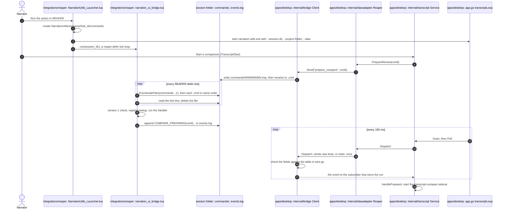

# The REAPER bridge and its test harness

**Status: implemented.** The Lua under `integrations/reaper` is tested without REAPER by a harness; what only a running REAPER can show is checked in scripted REAPER runs (the line identity checklist and the bridge commands passed 37 checks in REAPER 7.80; the fake is pinned to what that run observed). Decisions: [ADR 0031](../adr/0031-reaper-integration-is-a-lua-file-bridge-verified-by-hand.md) (a Lua file bridge, no loopback server) and [ADR 0066](../adr/0066-the-lua-bridge-is-tested-by-a-harness-under-lua-5-4-and-reaper-api-behaviour-is-checked-in-reaper.md) (the harness). The boundary rules for what lives in Lua are in [DAW integration](daw-integration.md).

## What is in `integrations/reaper`

| File | Role |
| --- | --- |
| `NarrationUtils_Launcher.lua` | The one REAPER action. Finds the app executable, starts it with the session directory, project and DAW arguments, then runs the bridge loop. Its name and path are stable: the narrator imports it into REAPER's action list. |
| `narration_ui_bridge.lua` | The command loop and the registry it dispatches through: polls `commands/` from a `reaper.defer` loop, looks each command up, appends results to `events.log`. Lists the feature files in `FEATURE_FILES` and loads them next to itself. |
| `narration_bridge_core.lua` | Shared by the bridge and every feature file: the percent-encoding and field-splitting helpers, `event`, file and path helpers, and `new_registry()`. |
| `narration_cleanup.lua`, `narration_compare.lua`, `narration_line_identity.lua`, `narration_pickups.lua`, `narration_render.lua`, `narration_project_state.lua`, `narration_retake_lanes.lua`, `narration_take_review.lua`, `narration_navigation.lua` | The commands, one file per feature (the cleanup launchers; Transcript Compare; manuscript line identity and chapter regions; the pickup list; per-chapter render configuration; the live project-change indicator; the retake-lane pick; take creation; going to and looping a finding, and adding its approved marker). |
| `reaper_common_core.lua`, `reaper_common_process.lua` | Small helpers the launcher loads: files and paths, hidden process launch, pipe splitting. |
| `tests/` | The harness (below). Not shipped: `scripts/release/prepare-resources.py` leaves `tests/`, `spikes/` and `project.json` out of the app's embedded REAPER package. |
| `spikes/` | Scripts that run inside a real REAPER, isolated in a temp resource directory, to find out what a fake cannot ([README](../../integrations/reaper/spikes/README.md); the S0 result is [reaper-spike-s0-item-extension-data.md](../research/reaper-spike-s0-item-extension-data.md)). Research tools, not product code. |

## The file protocol

The Go host (`apps/desktop/internal/bridge`) and the Lua bridge share one session directory, `<REAPER resource path>/NarrationUtils/sessions/hub_<id>/`, created by the launcher.

- **Commands** go one way. `Client.Send` writes `commands/NNNNNNNN.cmd` atomically (a `.tmp` file, then a rename) holding one line of percent-encoded, `|`-separated fields: protocol version `1`, the command name, then its arguments. The bridge reads the first line of each `.cmd` file in name order, deletes it, and dispatches. It splits at most eight fields; a payload that needs more travels as a file whose path is an argument.
- **Events** come back through the append-only `events.log`, one percent-encoded, `|`-separated line per event with the tag first. **The first argument of every event is the run ID of the command that caused it** (the command's own first argument), so a consumer can tell its events from another's. On Windows Lua writes CRLF in text mode, so a reader trims a trailing carriage return (the Go client does).
- **Errors** are `ERROR|<run_id>|<message>` events. The run ID is the failing command's first argument, or empty when there is none: an unsupported protocol version is `ERROR||Unsupported hub protocol`, an unknown command is `ERROR|<its first argument>|Unsupported workspace command`. An empty run ID marks a session-level problem, delivered to every consumer that handles errors.

The bridge polls the commands folder with `reaper.EnumerateFiles`, which **caches a directory's listing** (REAPER 7.80: a file created after the first call stays invisible and a removed one stays listed, for seconds, until the listing is cleared with index `-1`). Every listing therefore starts with `EnumerateFiles(dir, -1)`, and a listed file that cannot be opened is skipped without an event. Before this, each command left a ghost in the stale listing that was reported as `ERROR|Unsupported hub protocol`, and a new command could wait for the cache to expire; both were only visible in a real REAPER (found by the scripted run recorded in [docs/research](../research/)), and the harness's fake now caches the listing the same way.

Every command that writes to the project is one undo block, writes nothing when there is nothing to change, and is safe to send twice.

### One command, step by step

Starting the bridge, and one Transcript Compare command travelling through it and back.



*Verified 2026-09-21 against `NarrationUtils_Launcher.lua`, `narration_ui_bridge.lua` (`M.run`, the `tick` loop), `narration_bridge_core.lua`, `apps/desktop/internal/bridge/{bridge,events,wire}.go`, `apps/desktop/internal/dawadapter/reaper.go`, `apps/desktop/internal/transcript/service.go` (`Start`, `Drain`, `Handle`) and `apps/desktop/app.go` (`transcriptLoop`, `pollTranscript`), and by the harness, which drives the same protocol ([ADR 0031](../adr/0031-reaper-integration-is-a-lua-file-bridge-verified-by-hand.md), [ADR 0066](../adr/0066-the-lua-bridge-is-tested-by-a-harness-under-lua-5-4-and-reaper-api-behaviour-is-checked-in-reaper.md)). The command names here are generic on purpose: every command travels this way, so the diagram does not change when one is added ([ADR 0067](../adr/0067-bridge-commands-are-registered-by-name-and-each-feature-lives-in-its-own-lua-file.md)). The threats at steps 6 to 11 are rows 5a to 5c of the [threat model](threat-model.md#5-the-reaper-file-bridge-not-in-securitymd-see-the-note-under-the-table).*

## Reading events in the host: the fan-out

`bridge.Client` (`apps/desktop/internal/bridge/events.go`) is the one reader of `events.log` and feeds every consumer, so two features can use one session without stealing each other's events (the old single `ReadEvents` cursor could not).

```go
client.Subscribe(bridge.Subscription{
	Tags:   []string{"COMPARE_*", "ERROR"}, // exact tags, or a prefix ending in "*"
	Owns:   func(runID string) bool { ... }, // does this consumer track that run?
	Handle: func(event bridge.Event) { ... }, // event.Tag, event.RunID, event.Fields (tag first)
})
```

- **Routing.** An event goes to each consumer whose `Tags` match it and, when it carries a run ID, whose `Owns` is nil or true for that run. An event with an empty run ID goes to every consumer whose tags match. An event nobody accepts (an unowned run, an unwanted tag) is dropped and counted (`Undelivered()`); a line that does not decode is skipped and counted (`Malformed()`).
- **Delivery.** `Dispatch()` reads the lines appended since the last call and delivers them in log order, once, on the calling goroutine, serialised across callers; the host's 150 ms loop already calls it through `transcript.Service.Drain`, so a second consumer only subscribes. Only whole lines are consumed: a line REAPER is still writing waits for the next call.
- **Consumers today:** the Transcript Compare service subscribes to `COMPARE_*`/`ERROR`, `apps/desktop/internal/lineidentity` to `LINES_*`/`ERROR`, `apps/desktop/internal/pickups` to the pickup tags (`PICKUPS_IMPORTED`, `PICKUPS_EXPORTED`, `PICKUPS_COUNTED`, `PICKUP_NEXT`, `PICKUP_RESOLVED`) and `ERROR`, `apps/desktop/internal/renderconfig` to `RENDER_CONFIGURED`/`ERROR`, `apps/desktop/internal/cleanuptools` to `CLEANUP_LAUNCHED`/`ERROR`, and `apps/desktop/internal/retakelanes` to `RETAKE_LANE_PICKED`/`ERROR`, each for its own run; `bridge.Navigator` subscribes to the navigation answers (`NAVIGATED`, `LOOP_STARTED`, `LOOP_STOPPED`, `PONG`, `FINDING_MARKER`, `FINDING_STALE`, `ERROR`) of the requests it has in flight ([going to and looping a finding](reaper-navigation.md); `configureLocked` constructs it on the same client for the Review page's bindings). The teleprompter integration subscribes the same way when it lands.

### Checking events before they are delivered

`Client.Dispatch` checks each decoded line against a table (`apps/desktop/internal/bridge/wire.go`, [wire contracts](wire-contracts.md#reaper-events-appsdesktopinternalbridgewirego)): the fields after the tag, which are required, which are numbers. The Lua script is imported into REAPER by the narrator and can be older or newer than the app, so a line that is too short or whose number is not a number is **not delivered**: it is counted (`Invalid()`), logged (`reaper_event_invalid`) and handed to the consumers of its tag and run through `Subscription.Invalid`. Transcript Compare ends its run with a message naming the event and field. A tag that is not in the table passes through (a newer script's event), and the optional tail of `COMPARE_MARKER` may be absent (an older script). **Adding an event to a feature file means adding it to the table**, and `wire_test.go` fails when a tag is in one and not the other; it uses the same lines the harness pins.

## Reachability heartbeat

`narration_ui_bridge.lua`'s tick loop also appends a `PROJECT_STATUS` event every `HEARTBEAT_INTERVAL_SECONDS` (1.5s), independent of any command: `PROJECT_STATUS||<rpp>|<unsaved>`, with an empty run ID and `<rpp>` exactly what `EnumProjects(-1, '')` returns (the empty string, never `nil`, for an unsaved project - confirmed on a real REAPER 7.80, [spike S6](../research/reaper-spike-s6-daw-reachability.md)). The empty run ID is deliberate: `events.go`'s fan-out already delivers a run-less event to every subscriber regardless of `Owns` ("Routing" above), so this is a broadcast with no new delivery mechanism. `apps/desktop/internal/daw.Reachability` subscribes to it on the same `bridge.Client` `transcript.Service` uses (`configureLocked`), tracks the freshness of the last heartbeat (5s timeout) and exposes `Reachable()` and `Matches(linkedPath)` (case-insensitive, path-normalized); `dawfacts.go`'s `dawLinkFacts` uses both to compute Bootstrap's `dawReachable`/`dawProjectMatches` facts ([ADR 0092](../adr/0092-reaper-executable-discovery-heartbeat-mechanism-and-script-plus-project-launch-are-resolved.md), project-workspace-and-daw-link PRD Phase 7, W10). The Lua harness's `Session:events()` filters `PROJECT_STATUS` out for every other test file's sake (it would otherwise be a stray trailing event in every exact event-list assertion); `Session:all_events()` includes it, used only by `reachability_test.lua`.

## The command registry

A command is a handler `function(ctx, args)` registered under its name. `ctx.session_dir` is the session directory, `ctx.event(tag, ...)` appends an event, `ctx.stop()` ends the loop (the `close` command is just that). `args` are the command's fields after its name, already percent-decoded. A name may be registered once: registering it twice is an error, so two features cannot shadow each other. An unknown name is answered with `ERROR|Unsupported workspace command`, an unsupported protocol version with `ERROR|Unsupported hub protocol`.

To add a command:

1. Write the harness tests first (see below), and watch them fail.
2. Put the command in `integrations/reaper/narration_<feature>.lua`. The file starts with `local core = ...` (the shared helpers arrive as the chunk argument) and returns `function(registry)`, which creates the feature's state (a `runs` table, say) and calls `registry.register(name, handler)`.
3. List the file in `FEATURE_FILES` in `narration_ui_bridge.lua`, in `scripts/release/reaper-files.mjs` and in `smokeReaperFiles` in `apps/desktop/smoke.go` (the installer check requires every file listed there, and `smoke_test.go` holds the two lists to the folder; `reaper-files.test.mjs` fails when the list and the folder disagree, and a registry test fails when a feature file exists that the bridge does not load).
4. Add the command to the table below and to the registry test that pins the list of registered names.

The feature files are `loadfile`d when the bridge module loads, so a missing or broken one fails the launcher's `dofile` and the narrator sees "Could not load Narration Utils shared libraries" before the app starts. The bridge finds its own folder from `debug.getinfo` and falls back to the running action's path.

## Commands

| Command | Arguments after the name | Events |
| --- | --- | --- |
| `prepare_compare` | `run_id` | `COMPARE_PREPARED\|run\|manifest\|manuscript\|track\|diff\|items`, or `ERROR` |
| `inspect_compare_results` | `run_id`, `results_path` | `COMPARE_MARKER\|...` per row, then `COMPARE_INSPECTED\|run\|summary\|total\|already-marked` |
| `export_compare_markers` | `run_id`, `results_path`, three `RRGGBB` colours | `COMPARE_EXPORT_MARKER\|run\|row\|state\|existing-name` per row, then `COMPARE_EXPORTED\|run\|added\|skipped` |
| `jump_to_compare_marker` | `run_id`, `row_id` | none, or `ERROR` |
| `stamp_item_lines`, `read_line_ids`, `create_chapter_regions` | see [manuscript line identity](manuscript-line-identity.md) | `LINES_*`, `REGIONS_CREATED` |
| `import_pickups` | `run_id`, `payload_path` (`start\|tag\|note` rows) | `PICKUPS_IMPORTED\|run\|added\|already-there\|invalid`, or `ERROR` |
| `export_pickups` | `run_id`, `output_path` | `PICKUPS_EXPORTED\|run\|path\|count`, or `ERROR` |
| `next_pickup` | `run_id` | `PICKUP_NEXT\|run\|pos\|tag\|note`, or `ERROR` when none remain |
| `resolve_pickup` | `run_id`, `position` | `PICKUP_RESOLVED\|run\|pos\|tag\|note`, or `ERROR` |
| `count_pickups` | `run_id` | `PICKUPS_COUNTED\|run\|remaining\|total` |
| `configure_chapter_render` | `run_id`, `output_folder` | `RENDER_CONFIGURED\|run\|folder\|count\|targets`, or `ERROR` |
| `project_state` | `run_id` | `PROJECT_STATE\|run\|change_count\|project_path`, or `ERROR` |
| `launch_cleanup_tool` | `run_id`, `tool` (`repair_pops_clicks` or `magnolius_declick`, nothing else) | `CLEANUP_LAUNCHED\|run\|tool\|action-name`, or `ERROR` |
| `pick_retake_lane` | `run_id`, `line_id`, `item_guid` | `RETAKE_LANE_PICKED\|run\|line-id\|item-guid\|lane` (0-based), or `ERROR` |
| `create_take` | `run_id`, `payload_path` (one row: `target_item_guid\|candidate_item_guid\|source_start\|source_end\|finding_id\|source_file`) | `TAKE_CREATED\|run\|target-item-guid\|new-take-guid`, `TAKE_STALE\|run\|guid`, or `ERROR` |
| `navigate_item`, `loop_context`, `stop_loop`, `ping` | see [going to and looping a finding](reaper-navigation.md) | `NAVIGATED`, `LOOP_STARTED`, `LOOP_STOPPED`, `PONG`, `FINDING_STALE`, or `ERROR` |
| `add_finding_marker` | see [adding the approved marker](reaper-navigation.md#adding-the-approved-marker) | `FINDING_MARKER`, `FINDING_STALE`, or `ERROR` |
| `close` | none | none; the loop stops |

### Pickups (`narration_pickups.lua`)

A pickup is a project marker named `PICKUP: <body>` while open, renamed to `PICKUP_DONE: <body>` once resolved (`resolve_pickup`), reusing the `PREFIX:` naming convention `narration_compare.lua` already uses for take markers ([Open Question 6](../prds/reaper-automation-follow-through.prd.md) of the follow-through PRD: this PRD owns the convention, the take-review PRD only consumes it). `<body>` is the note, or `[tag] note` when the payload row carried a tag, so `export_pickups` can round-trip a pickup through one marker name (generic CSV first, Open Question 5; the Go side parses and validates the narrator's CSV and writes the pipe-delimited payload file the Lua command reads). Duplicate detection uses the same 0.15 s window as the compare export's take markers; `import_pickups` treats a pickup already present (open or resolved) at that time and body as existing, so re-importing a proofer's list is always safe. `next_pickup` jumps to the nearest open pickup after the edit cursor, wrapping to the earliest one once the cursor is past all of them.

### Per-chapter render configuration (`narration_render.lua`)

`configure_chapter_render` (Phase 11, [reaper-automation-follow-through PRD](../prds/reaper-automation-follow-through.prd.md) Open Question 7, answered (a): configure only) sets `RENDER_BOUNDSFLAG` to 3 ("all regions"), `RENDER_PATTERN` to `$region` and `RENDER_FILE` to the narrator's chosen folder, then reads `RENDER_TARGETS` back and reports the predicted file names on `RENDER_CONFIGURED` - confirmed against a real REAPER 7.80 to match the actual render exactly ([S5 spike](../research/reaper-spike-s5-render-details.md)). `RENDER_FORMAT` is never touched (the narrator's last-used sink format stands). **This file must never call `Main_OnCommand`, and must never read `RENDER_STATS`/`RENDER_STATS_SUMMARY`**: the S5 spike found that passing a real, file-writing render action's ID to that getter re-invokes the render, producing a real "Files already exist" dialog. The narrator presses Render themselves (Ctrl+Alt+R or File > Render); nothing in the bridge, the Go service or the UI does it for them. The harness's `render_test.lua` includes a test that inspects every fake-REAPER call this command makes and fails if any of them is `Main_OnCommand` or a `RENDER_STATS`/`RENDER_STATS_SUMMARY` read.

`COMPARE_MARKER` carries 19 fields (see `inspect_results` in the bridge and the transcript service that reads it); the last three, appended by the review dashboard's Phase 6, are the item, take and track GUIDs read when the comparison was prepared. The harness pins them.

### Retakes on fixed lanes (`narration_retake_lanes.lua`)

`pick_retake_lane` (Phase 25, [ADR 0147](../adr/0147-retakes-on-fixed-lanes-are-chosen-by-lane-play-state-and-the-app-never-converts-takes-and-lanes.md), [spike S7](../research/reaper-spike-s7-fixed-lanes.md)) makes the narrator's chosen retake the only lane playing on its track. **It changes one value, the track's `C_LANEPLAYS:<lane>`, to 1, in one undo block**, so one Undo in REAPER restores the previous play state. A retake is named by line id plus item GUID, since every retake of a line on a lane track carries the same line id: the item is found by GUID, must still carry the line id, and its track must already be in fixed-lane mode (`I_FREEMODE` 2); the lane is the item's `I_FIXEDLANE` as REAPER has it now, never one the host sends. It never sets `I_FREEMODE`, `I_NUMFIXEDLANES`, `I_FIXEDLANE` or the item-level `C_LANEPLAYS`, and runs no convert, explode or comp action: S7 found each of those changes what plays or copies line ids onto new items. The host (`apps/desktop/internal/retakelanes`) sends it only for a retake it lists from the saved project. What REAPER does with it is read back by S7, not yet by a scripted run of this command or by ear ([pending](../research/reaper-retake-lanes.md)).

### Cleanup launchers (`narration_cleanup.lua`)

`launch_cleanup_tool` (Phase 23, [ADR 0146](../adr/0146-cleanup-launchers-open-an-allow-listed-reaper-action-found-by-its-name-and-change-nothing-themselves.md)) opens REAPER's own Repair Pops/Clicks dialog (REAPER 7.80) or the narrator's installed Magnolius DeClick script on the selected items. **It is the one command that calls `Main_OnCommand`, and only on an allow-listed tool**: the host sends a tool key, never an action ID or name, and a key that is not in the file's `TOOLS` table is refused before the action list is read. The action is found by its action-list name (`kbd_enumerateActions` over `SectionFromUniqueID(0)`, the Main section), never by a numeric ID: REAPER does not publish native IDs and a script's ID depends on where it was installed. A native tool's name matches with any category prefix but never under `Script:` or `Custom:` (the narrator's own names); no match reports the tool as missing, and two matches launch nothing rather than guess. It needs at least one selected item. It opens no undo block and changes no item, marker, cursor or project setting: whatever the dialog then does is the narrator's own edit. The exact action-list names and the two API return shapes are taken from the ReaScript docs and REAPER 7.80's own strings, not yet from a scripted REAPER run ([pending](../research/reaper-cleanup-launchers.md)).

### Live project-change indicator (`narration_project_state.lua`)

`project_state` (Phase 13, [reaper-automation-follow-through PRD](../prds/reaper-automation-follow-through.prd.md), "Change-driven re-compare indicator"; [analysis-evidence-ledger PRD](../prds/analysis-evidence-ledger.prd.md) Open Question 12, answered (B)) is a Could-tier, on-demand check: it reads `GetProjectStateChangeCount(0)`, REAPER's own coarse edit counter, and the current project's saved-file path (the same `EnumProjects(-1, '')` call `prepare_compare` already makes). It never mutates the project (no undo block, nothing selected or moved) and reads nothing but those two values. The host (`apps/desktop/internal/projectstate`) stats the reported path itself for the saved `.rpp`'s modification time - Lua has no portable file-stat call - and exposes a pure `ChangedSince(current, baseline)` comparison so any feature that already has a saved-file-mtime-based staleness basis can add this as one more, optional live hint on top of it, never a replacement: nothing here decides what "stale" means for another feature, and nothing re-runs an analysis automatically.

## The harness

`integrations/reaper/tests/` runs the bridge and the launcher under **Lua 5.4** with a **fake `reaper` table**, through the same file protocol the host uses. Run it with `pnpm exec nx run reaper:test` (it is also part of `pnpm check` and the `quality / lua` CI job on Linux and Windows).

| Piece | What it does |
| --- | --- |
| `run_lua_tests.py` | The runner. Gives each `*_test.lua` its own Lua state (the `lupa` wheel, Lua 5.4), injects the few things Lua's standard library lacks (a temp directory, listing and creating directories), and exits non-zero on a failure. `--mutations` adds the mutation checks. |
| `fake_reaper.lua` | The fake API and an in-memory project: tracks, items, takes and their markers, item extension data (a missing `P_EXT` key reads as `false, ''`), markers and regions (`EnumProjectMarkers3` returns index plus one), render-config project-info keys (`GetSetProjectInfo`/`GetSetProjectInfo_String`, with `RENDER_TARGETS` computed from the current bounds/pattern/regions the way a real REAPER predicts them), the Main section of the action list (`kbd_enumerateActions`, `SectionFromUniqueID`; `add_action` adds one), fixed item lanes (`set_fixed_lanes`, an item's `lane`, and `C_LANEPLAYS` with the exclusive/with-others/silent semantics S7 saw; every lane setter call lands in `fake.calls`), an undo log, a `defer` queue that `pump()` runs one frame at a time, the time selection, loop points (optionally linked, as REAPER links them by default), repeat, play state and `atexit` handlers (`exit()` runs them), and `fake.calls` (every `Main_OnCommand`, project-info call and transport button, in order, so a test can assert a render action was never invoked). `remove_api(name)` makes `APIExists` answer false, the way an older REAPER lacks a function. |
| `harness.lua` | Tests, assertions, and `session()`: builds a fake REAPER, loads the bridge from `host.reaper_dir`, and offers `send(command, ...)` (writes a `.cmd` file and runs one tick) and `events()` (the new events, decoded). |
| `*_test.lua` | Characterization tests: `protocol_test` (the loop), `registry_test` (the registry and the feature-file convention), `compare_test`, `line_identity_test`, `pickups_test`, `render_test` (`configure_chapter_render`, including the never-calls-`Main_OnCommand`/`RENDER_STATS` check), `cleanup_test` (`launch_cleanup_tool`: the allow-list, lookup by name, and that a launch is one `Main_OnCommand` and no edit), `retake_lanes_test` (`pick_retake_lane`: one lane value in one undo block and nothing else, and the refusals), `navigation_test` (`navigate_item`, `loop_context`, `stop_loop`, `ping`), `finding_marker_test` (`add_finding_marker`), `launcher_test` (the launcher from an installed-bundle layout), `common_test` (the helpers). |
| `mutations.json`, `mutations.py` | Each entry breaks one guard in the Lua source (a stale GUID resolving to another item, an overwrite without asking, a spurious undo point, a widened duplicate window) and the suite must fail. A mutation that survives, or whose text is no longer in the source, fails the run. |

### Writing a test

```lua
local H = require('harness')

H.test('stamp_item_lines reports a GUID that no longer resolves', function()
  local s = H.session({ project_path = H.join(host.tmpdir(), 'Book.rpp') })
  local item = s.fake:add_item(s.fake:add_track('Narrator'), { guid = '{AAAAAAAA-0000-4000-8000-000000000001}' })
  s:send('stamp_item_lines', 't1', payload_path, '0')
  H.eq(s:events(), { { 'LINES_STALE', 't1', '{FFFFFFFF-0000-4000-8000-00000000FFFF}' }, { 'LINES_STAMPED', 't1', '0', '0', '1', '0' } })
  H.eq(item.ext, {})
end)
```

Write the test first for a new or changed command, watch it fail, then change the Lua. Assert what the narrator would notice: the events, the item extension data, the undo labels and count, and that a second send changes nothing. When a guard exists to protect data (a stale GUID, an overwrite, a duplicate marker), add an entry to `mutations.json` that removes it.

### What the harness does not prove

A fake proves the bridge's logic, not REAPER. Whether REAPER returns what the fake returns, what item extension data does on save, split and copy, and how a render setting behaves are only known from a running REAPER. Those are checked in a scripted run on a copy of a project with an isolated resource directory and recorded in [docs/research](../research/), and the fake is corrected to match. The harness cannot show the app's UI, or anything that needs audio hardware.

Lua 5.4 comes from the `lupa` wheel (pinned in the `lua` dependency group of `pyproject.toml`, hashed in `uv.lock`). It is not REAPER's own build, so the scripts keep to the Lua the two share.
