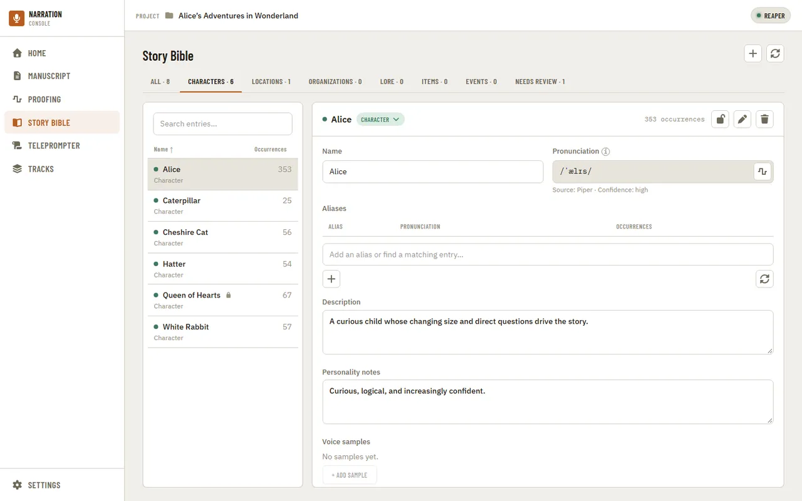
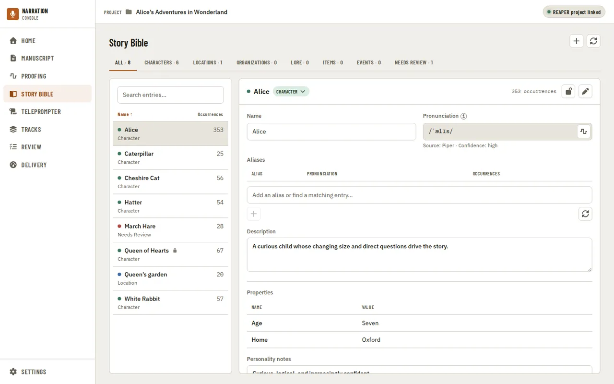
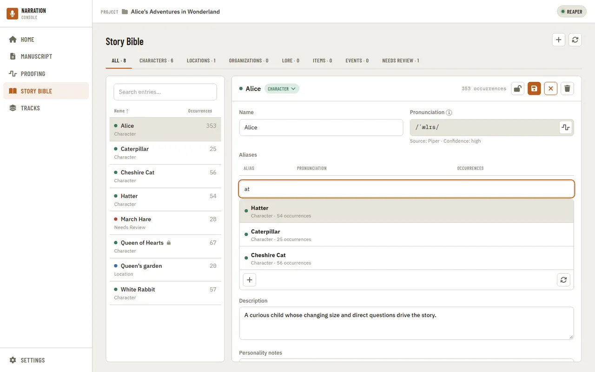

# Using the app

A screenshot walkthrough of the narration workspace, page by page. The screenshots on this
page are generated from the same mock data used by the app's Playwright visual test suite
(`shared/ui/tests/visual/`) — see [`doc-screenshot-sync`](../../.claude/skills/doc-screenshot-sync/SKILL.md)
for how they're kept current when the UI changes.

## Navigation

Home, Manuscript, Proofing, and Story Bible are reachable from a sidebar on the left. At
desktop widths it stays open with labels; narrower windows switch it to icon-only, then hide
it behind a hamburger menu that opens it as a slide-in drawer. Settings lives at the bottom
of the sidebar in every layout.

## Home

The landing page after opening a project: manuscript status, audiobook time estimates,
recording progress, and shortcuts into the latest Proofing comparison and Story Bible review.

The estimate card's per-chapter breakdown is collapsed by default; expanding it lists every
chapter with its word count, estimated and actual recorded length, and status.

## Manuscript

The manuscript reader shows the imported chapter text with characters, places, and other
entities highlighted inline. Text size is adjustable independently of the rest of the app.

Chapters default to fully expanded inline; collapsing them switches to a compact list for
jumping between chapters without scrolling through the full text.

## Proofing

Proofing transcribes a recorded chapter and compares it against the manuscript. The Setup
step picks the transcription model, chunk length, and any vocabulary hints before starting
a comparison.

Model, chunk length, and worker count are independent selections — picking a slower, more
accurate model can force other settings to adjust (here, workers dropped to 1 because the
Large model doesn't support Auto).

Once a comparison finishes, the Results step lists every discrepancy between what was written
and what was heard, expandable for the full context around each one.

## Story Bible

Story Bible tracks every character, place, and organization extracted from the manuscript,
with pronunciation, aliases, and narration notes. Category tabs filter the list.

Selecting an entry opens its detail panel for editing pronunciation, aliases, and notes.

Typing into the alias field opens a dropdown of existing entries whose name or alias matches,
so a name mentioned under a different spelling can be merged into the entry it already
belongs to instead of creating a duplicate.

## Settings

Settings are split into Global (defaults for every project) and This Project (overrides for
the current one), organized by category.

Appearance controls the light/dark theme.

