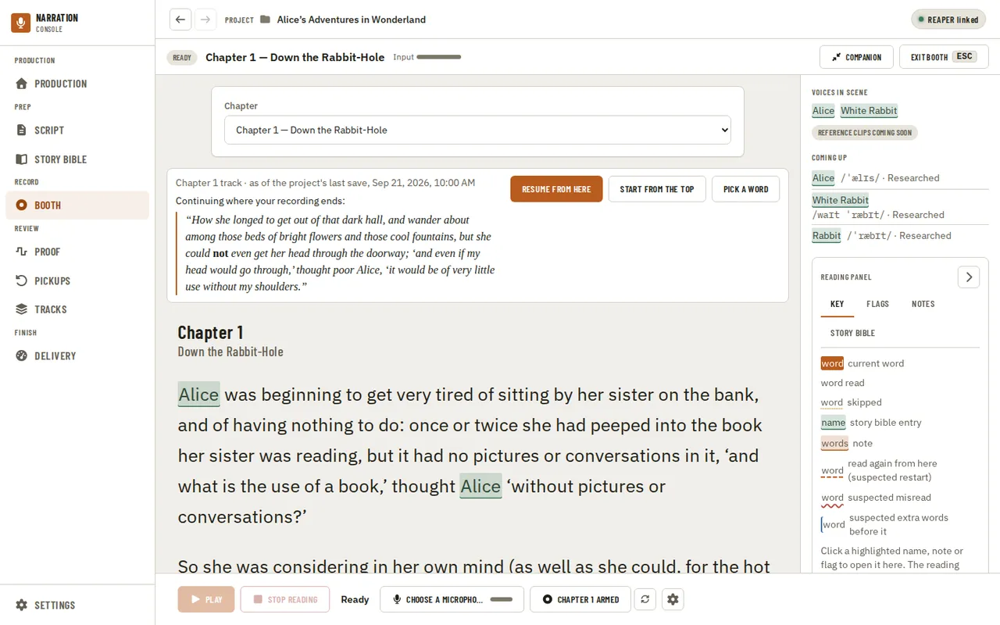
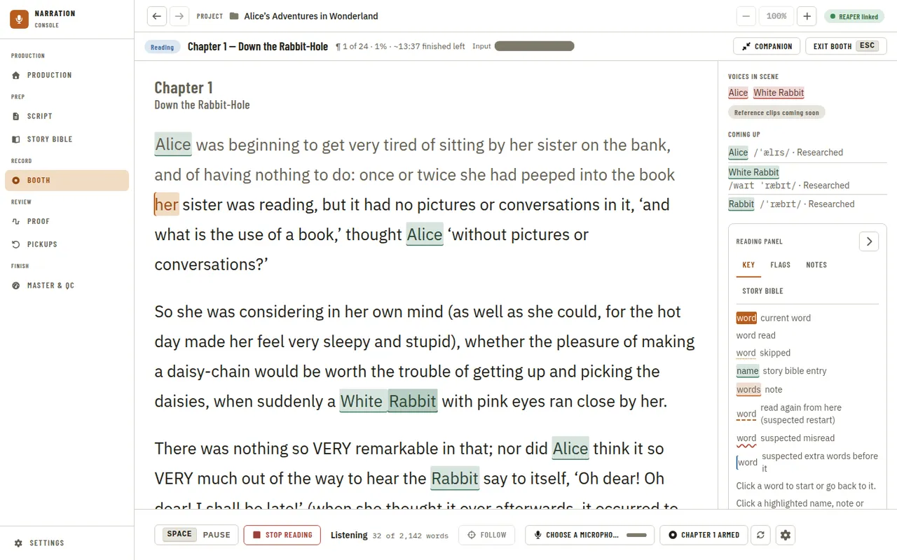
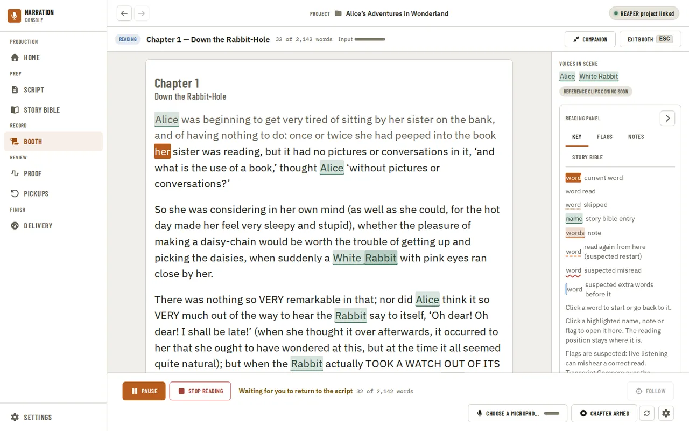
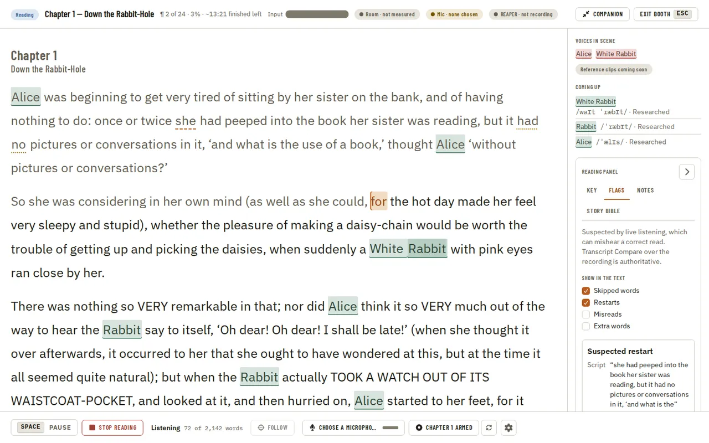
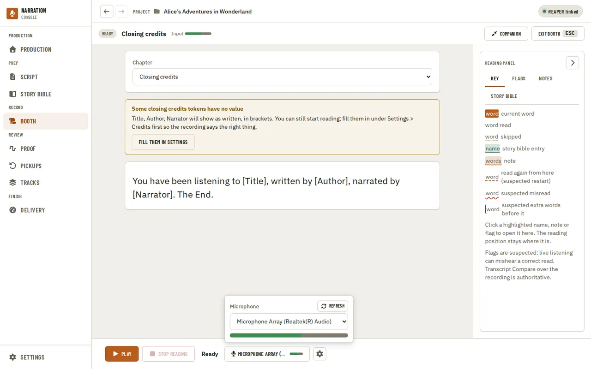

[Using the app](README.md) › Booth

# Booth

The Booth is where you record: it follows you as you read a chapter aloud, listening through your microphone
with a local speech engine and highlighting the word you are on. It needs an [imported manuscript](production.md#importing-the-manuscript),
and nothing you say is edited, saved, or sent anywhere. Open it from **Booth** in the navigation, or from
**Record in Booth** on a chapter or credits card on [Script](script.md), which opens it on that
chapter. What the Booth is reading is part of its address (`/booth?chapter=…`), so Back and a bookmark land
on the same chapter. The Booth follows the app's theme, light or dark, like every other page.

## Before you start

The Booth fills the page: a status line across the top (Ready, Reading or Paused, the chapter, the word
count and a small input-level meter), the chapter's text in the middle, a rail on the right and the reading
controls along the bottom. Before a session starts, a **Chapter** picker sits above the text; it folds away
once you start.

Set up the reading controls at the bottom, which stay in view while you scroll: the microphone button
opens a popover with your device list (Refresh if you just plugged one in) and a live level meter, and
the Settings (gear) button opens a popover with the engine and model. There are two engines, Whisper (the
default) and Moonshine; both highlight the same way, so try each and keep the one that follows your voice
more smoothly. Tiny is the fastest model and keeps up on most computers; Small is more accurate but needs a
faster one. Choosing an engine or a model never downloads anything: the first time you start with one
whose model is not on this computer, the app asks first, naming the engine, the download size, the
publisher and the licence, and downloads only if you say so. Your microphone, engine and model are
remembered for next time (they are the same choices as in [Settings](settings.md) › Booth); a microphone
that is no longer connected shows as "(not found)" until you pick it again or choose another. A microphone
can only be picked from the list, never typed: with none listed, the microphone popover says "No
microphone found" and Play stays disabled until you connect one and press Refresh.

If the project has a REAPER project, the chapter can come from it. The app reads the project as it was
last saved and looks at the track you have armed for recording (or, with none armed, the selected track).
When that track is linked to a chapter on the [audio engine panel](navigation.md#linking-chapters-to-tracks), or its name clearly matches one
("Chapter 2" for Chapter 2, never Chapter 12), the Booth opens on that chapter, with a line beneath the
picker saying so. When the name is only a near match, or armed tracks point at different chapters,
nothing is chosen for you: the likely chapters are offered as buttons under the picker. Save the REAPER
project after arming a track for the app to see it. Otherwise the Booth opens on the chapter you last read.

### Where you stopped

Above the text, a compact **Where you stopped** notice looks for the chapter's track in the project's
REAPER file and listens to the last 30 seconds recorded on it (with the same local Whisper model, which it
asks to download first if it is missing). When REAPER is open on that project and **Read track arm state**
is on in Settings (an experimental REAPER action), it asks REAPER where the track is now: the edit cursor
when it sits on the track's recording, otherwise the end of the recording, including a take you have not
saved yet, and labels it "in REAPER now". Otherwise it reads the saved project and says it is as of the
project's last save. While REAPER is recording on the chapter's track it offers nothing and reading starts
from the top. It shows the track, where it read it, and the sentence it matched.

**Resume from here** makes Play begin at that word, shown as a clearable chip in the reading controls
("Starts at '…'") until you start or clear it; **Start from the top** and **Pick a word** (start reading,
then click the word you want) are the other choices, and nothing starts until you press Play. Choosing any
of the three clears the notice at once for the rest of your visit to this chapter: it does not ask again
after a session ends, so the next Play begins at the top with nothing to clear. Starting playback or
recording in REAPER clears it too, without choosing anything. With **Read track arm state** on, moving
REAPER's edit cursor onto the recording while the notice shows makes it look again from there. A chapter
already recorded to its last word says so instead of offering to resume past the end. When the match is
uncertain or a confirmed track has a problem (renamed, missing, or linked to more than one chapter), the
notice says so with a link to the [audio engine panel](navigation.md#linking-chapters-to-tracks) instead of asking you to pick a track here; when the
recording cannot be read or does not match the chapter it says why and reading starts from the top.

### Recording in REAPER

With **Record in REAPER** on in the reading controls, Play asks REAPER to start recording first and only
starts listening once REAPER confirms; if REAPER refuses, the status says why and nothing starts. Stop
stops listening, then stops a recording this app started. The button also shows whether the chapter's
linked track is the one armed in REAPER, and **Arm only** fixes that with one click. Record in REAPER is
an experimental DAW action, off until you turn it on in Settings.

## Reading

Press Play (or Space, when focus is not in a field, button or other control) to begin at the top of the
chapter, title first; the status and word count update as you go, and Follow appears once a session runs,
so you can bring the highlight back into view. Words you have read dim, the word you are on is filled in,
and the text scrolls to keep it near the middle of the screen. The highlight follows what it hears, not a
timer, so it waits when you do. Pause holds your place without ending the session; Stop reading ends it.

While it is listening you can click any word: a word ahead starts reading from there, and a word you have
already read takes you back to it.

You can scroll the text yourself while it listens, with the mouse wheel, a touch drag, the scroll bar or
the Page Up, Page Down and arrow keys. The Booth then stops following, says "Following paused" under the
status and leaves the text where you put it. It follows again on its own once the word you are on is back
near the middle of the screen, whether you scroll back to it or read on until it arrives there. To jump
straight back, press Follow beside Stop.

You do not have to read perfectly. If you skip a word or two it carries on and underlines the words you
missed; if you go back and re-read a sentence it goes back with you. If you stop for a moment the status
says it is waiting for you to return to the script, and it picks up again as soon as it hears you.

When you reach the end of the chapter the status says Done, and the session stops by itself a few seconds
later: the status then says "Stopped at the end of the chapter." If you go back and re-read the last line
before then, it keeps listening instead. You can still press Stop at any time.

## The rail

The Booth marks Story Bible names and your notes in the text, in the same colours as the Script
reader. The rail on the right starts with **Voices in scene**, the chapter's characters (click one to open
its Story Bible entry; reference clips of each voice are coming later), then a reading panel with four
tabs: **Key** (what each mark means), **Flags** (see below), **Notes** (the chapter's notes) and **Story
bible** (the entries the chapter mentions). Clicking a marked name, note or flag opens it in the panel,
read-only; it never moves the highlight, the listening position or the scroll. The panel's arrow button
hides it to widen the text, and the Booth remembers on this computer whether the panel is shown and which
tab was last open. In a narrow window the rail follows the text instead of standing beside it.

### Flags

While you read, the Booth marks places where listening suspects something went differently from the
script: skipped words (a dotted underline) and a restart, where you went back and read again (a dashed
underline on the word you went back to). Misreads (a wavy underline) and extra words (a bar before the word
they came before) can also be shown; they are off at first because live listening mishears correct reads
too often to trust them yet. Turn each kind on or off in the **Flags** tab; the Booth remembers your
choice on this computer. Hovering or focusing a flag says what was heard. Clicking it opens it in the Flags
tab with the script's words and what was heard, and **Dismiss** removes it from the text. **Punch from
here** moves REAPER to that point with a pre-roll, once the experimental punch action is on in Settings.
Every flag is only suspected: Transcript Compare over the recording is the authority. When reading stops,
or you leave the Booth, the session's flags are kept in the project as unreviewed findings (a dismissed flag
is kept as dismissed), so they can be reviewed later; reading the chapter again does not add the same flag
twice.

## The credits

The Chapter picker also offers **Opening credits** first and **Closing credits** last, when your credit
template library ([Settings, Credits](settings.md#credits)) has an opening or a closing template. The text
is the first template of each kind filled in with the project's values, exactly as Settings previews it,
and the highlight follows it like a chapter. There is no **Where you stopped** notice (the credits are not
on a REAPER track). If a value is missing, for example no narrator name yet, a warning names what is
missing in its place, the placeholder shows in brackets (such as [Narrator]), and **Fill them in
Settings** opens the Credits settings. You can still start reading. Flags are shown as you read, but the
Flags tab says "Flags on the credits are not kept": nothing about the credits is written to the project's
findings.

## Companion mode

**Companion** in the Booth's status line turns the app into a narrow panel pinned beside your DAW: the
same session, with REAPER's playhead in its header, the script in its own scroll box, the reading
controls and the hotkeys that work while the panel has focus. **Full app** (or Escape twice) brings the
Booth back with the session still running. **Pickups** in the panel shows the [Pickups](pickups.md) list:
how many are left and the one you last jumped to. The note at the playhead has its place in the panel
and is coming later.

## Leaving the Booth

**Exit booth** in the status line (or Escape, when nothing is open on top of the Booth) takes you back to
where you came from. If a session is still listening it asks first ("Stop reading?"): leaving stops it,
and stops REAPER's recording too if this app started it. Leaving through the navigation does not stop a
session; coming back shows where you were.

The old Teleprompter page and the Manuscript's Read aloud dialog are now this page: a link to the
Teleprompter opens the Booth.

---

[← Story Bible](story-bible.md) · [Index](README.md) · [Proof →](proof.md)
