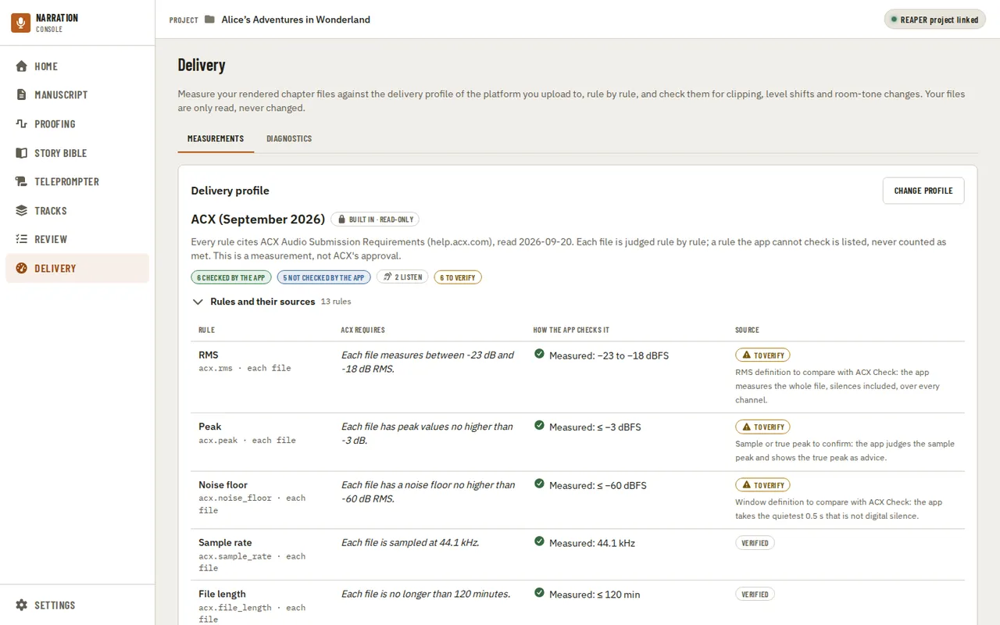
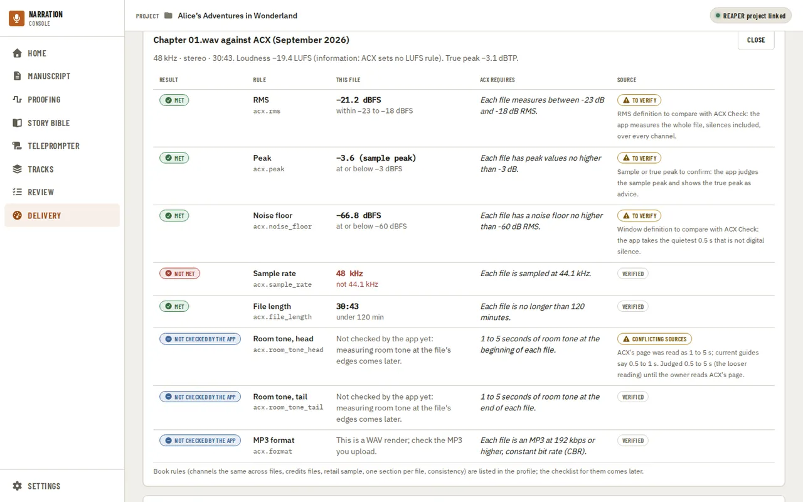
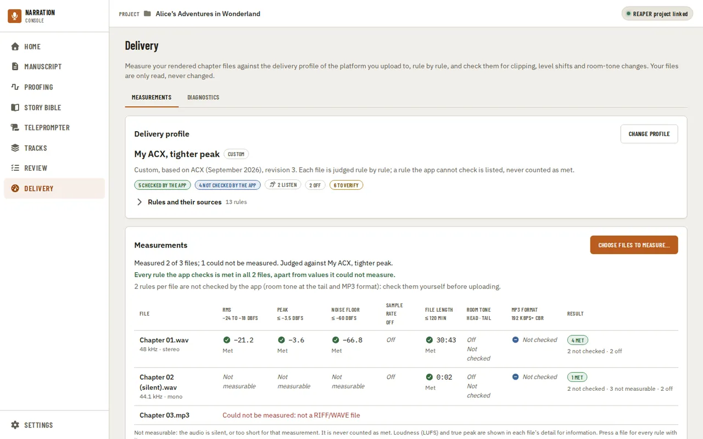
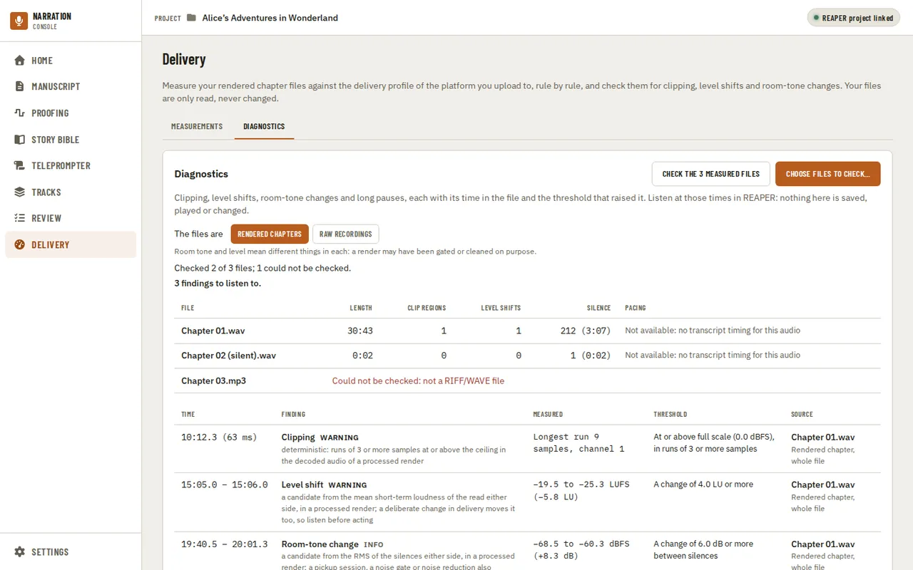
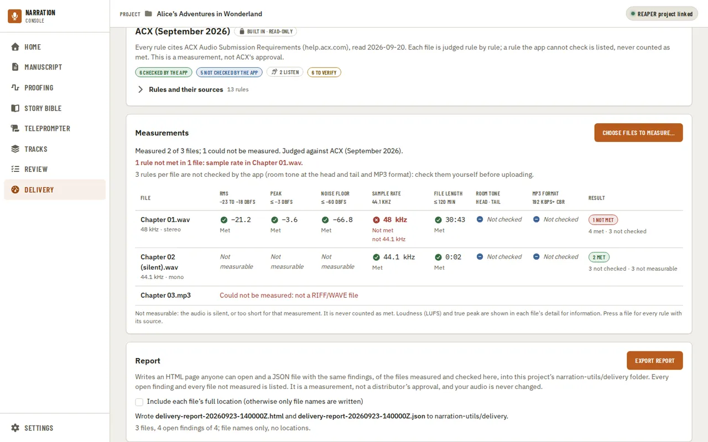

[Using the app](README.md) › Delivery

# Delivery

Delivery measures your rendered chapter files against the delivery profile of the platform you upload
to, rule by rule, so you can check them before uploading without another tool. Out of the box every
project is judged against **ACX (September 2026)**, ACX's audio submission requirements as the app
recorded them; you can [choose another profile](#the-delivery-profile) or make your own. Your files are
only read, never changed, and Delivery is always in the navigation: it needs neither a manuscript nor a
REAPER project.

## The delivery profile

The **Delivery profile** panel names the profile the project is judged against and how many of its
rules the app checks, how many it cannot check yet, how many are for you to listen for, and how many
are still to verify. **Rules and their sources** lists every rule with what the platform requires, how
the app checks it, and whether that requirement was read on the platform's own page (**Verified**), is
still **To verify**, or has **Conflicting sources** (room tone at the head of a file: ACX's page was
read as 1 to 5 s, current guides say 0.5 to 1 s, so the app judges the looser 0.5 to 5 s). A rule the
app cannot check, such as the MP3 you upload when it measured the WAV render, is listed as **Not checked
by the app** and never counted as met. The profile is a measurement, not ACX's approval.

**Change profile** opens [Settings, Delivery](settings.md), where you choose this project's profile.

## Measuring files

Press **Choose files to measure…** and pick one or more rendered chapter files. Only WAV files are
measured for now; a file in another format, or one that cannot be read, is listed with the reason and
does not stop the others. The bar shows how much of the audio has been read so far, and **Cancel**
stops the measurement: files already measured keep their results. You can leave the page while it
runs; the app says when it ends, and Delivery shows the last measurement when you come back.

The table has a column for each rule of the profile, with its bound under the name. Each value says
**Met** or **Not met** (with the bound it missed, "not 44.1 kHz", "below −23"), in words as well as
colour, and the last column counts each file's results. Above the table, the page says which rules each
file missed, or that every rule the app checks is met, and which rules it did not check for you to check
yourself before uploading. Choosing another profile judges the values on screen again, without measuring
the files again.

A value that could not be measured says **Not measurable**, never a number: a silent render has no
loudness or noise floor to measure, and a very short file has too little audio for some of them. It is
never counted as met.

Press a file's row for every rule with this file's value, what the platform requires and how it was
verified. Integrated loudness (LUFS) and the true peak are shown there for information: ACX's page, as
recorded, sets no LUFS rule, and a true peak above −3 dBTP is shown as advice because it may clip after
MP3 encoding.

## Custom profiles

To judge against other numbers, duplicate ACX in [Settings, Delivery](settings.md) and change
its numbers or turn a rule off; the page then names your profile and what it is based on. If you had set
your own limits before delivery profiles, they were moved into a custom profile named **Your limits**
(or ACX, when they were ACX's numbers), so your files are judged the same way as before.

## Diagnostics

The **Diagnostics** tab checks the same kind of files for clipping, level shifts, room-tone changes
and long pauses. Press **Check the measured files** to check what you just measured, or **Choose
files to check…** to pick others. First say what the files are, **Rendered chapters** or **Raw
recordings**: room tone and level mean different things in each, because a render may have been gated
or cleaned on purpose, so a room-tone change in a render is only information. The bar shows the audio
read so far, and **Cancel** keeps what was already checked.

Each file gets a line with its length, how many clip regions and level shifts it has and how much of it
is silence. Pacing and the speaking rate need the transcript's word timing, so a file checked here says
**Not available** with the reason, and no long pause is guessed from silence alone.

Under it, each finding gives its time in the file, what it is and why it was raised, what was measured
(for example the loudness before and after a level shift), the threshold that raised it, and the file
and the kind of source it was measured in. Listen at those times in REAPER: the tab plays nothing,
changes nothing and saves nothing, so every finding is a candidate to listen to, not a verdict, and
stays unreviewed. **Thresholds** lists every threshold the check uses, even before you check anything.
They are starting values, not a delivery specification, and cannot be changed yet. When nothing reaches
a threshold, the tab says so without calling the file a pass.

## Exporting a report

**Export report**, under the tabs, writes the last measurement and the last diagnostics check to two
files in your project's `narration-utils/delivery` folder: an HTML page a reviewer can open in any
browser without the app, and a JSON file with the same findings for tools. Each export gets its own
name from the time it was made (`delivery-report-20260923-140000Z.html`), so an earlier report is never
overwritten, and nothing is ever written next to your audio.

The report lists every file you measured or checked, and says for each one whether it was measured
and checked, and if not, why. Every value has its unit, and the report says how RMS and the noise floor
are measured. The report names the profile and its version, and lists every rule with what the platform
requires, how the app checked it, how it was verified and how many files met it. Each finding has an ID, its
file, its time in the file, what was measured against which threshold, and its review state. The HTML
and the JSON use the same IDs, and the Measurements tab's rules not met are those same findings. A finding is **open** unless it has been dismissed, and every open finding is listed. The
review state comes from the project's review decisions; Delivery's findings are not on the Review page
yet, so for now they are all open and unreviewed. The report also names the app's and the analyzers' versions, and each
installed voice and model with its version. It is a measurement, not a distributor's approval.

Files are named only by their file name unless you tick **Include each file's full location**: no
folder, user name or other path is written, and a path inside a message is replaced. No audio and no
manuscript text is ever written into the report. Export needs a project open (the report is kept with
it), and waits until a measurement or check has finished.

---

[← Review](review.md) · [Index](README.md) · [Settings →](settings.md)
