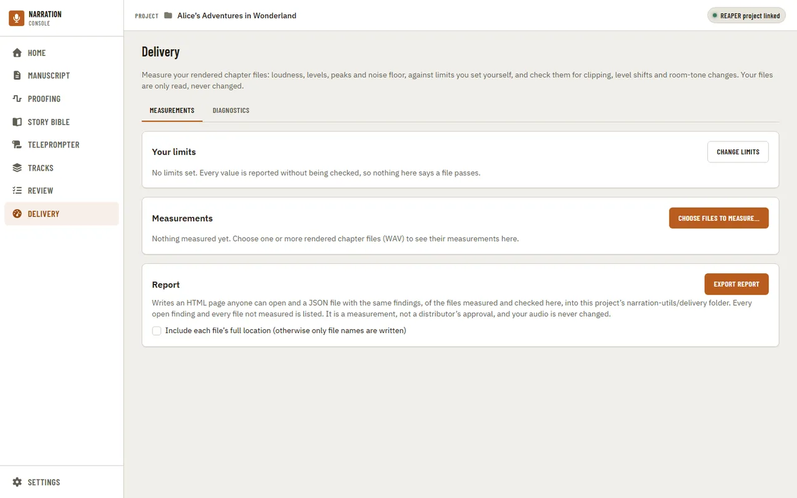
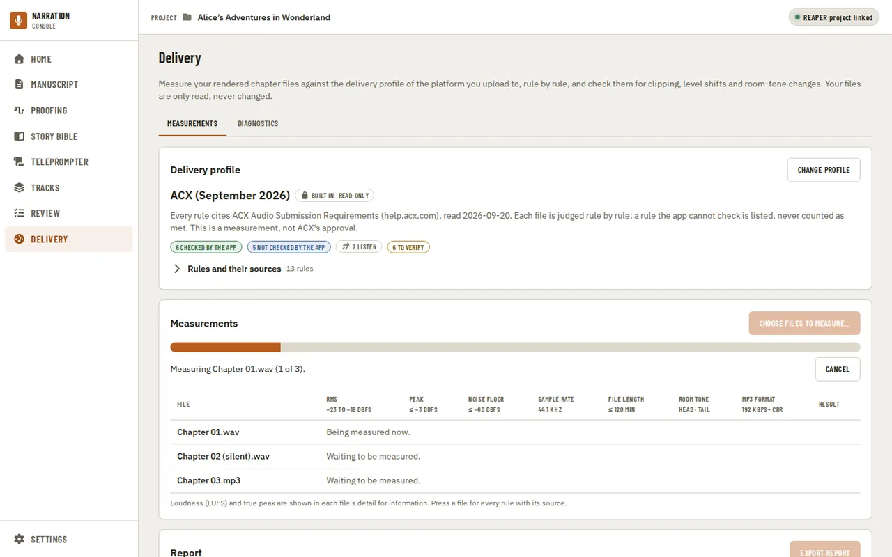
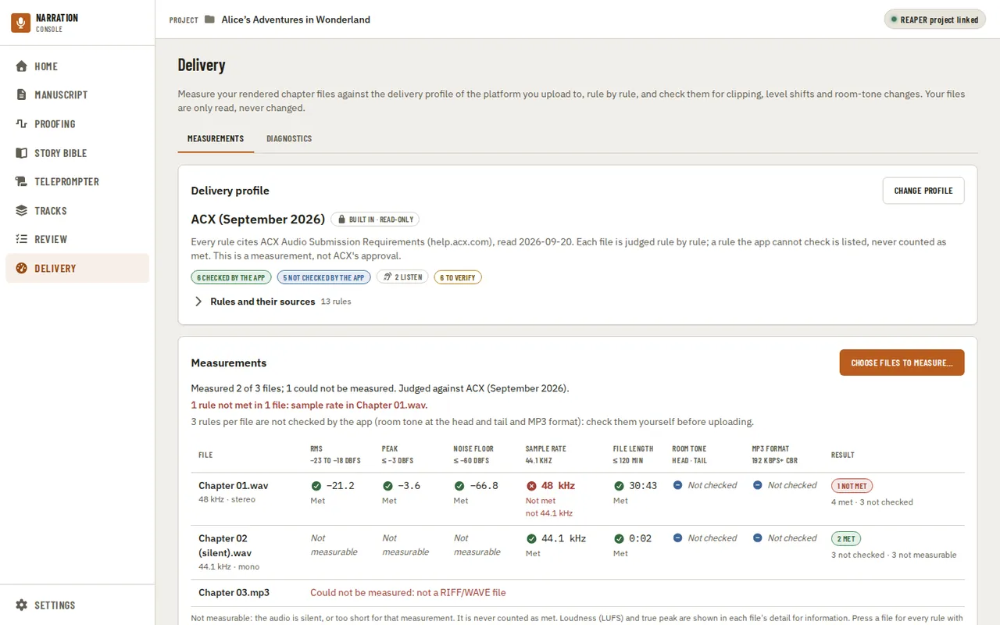
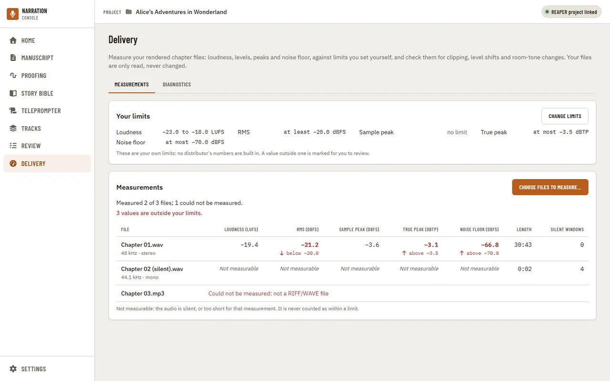

[Using the app](README.md) › Delivery

# Delivery

Delivery measures your rendered chapter files, so you can check them before handing them to a
reviewer or a distributor without another tool. For each file it shows the integrated loudness (LUFS),
the RMS level, the sample and true peaks, the noise floor, the length and how many windows were
digital silence, each with its unit. Your files are only read, never changed, and Delivery is always in
the navigation: it needs neither a manuscript nor a REAPER project.

## Measuring files

Press **Choose files to measure…** and pick one or more rendered chapter files. Only WAV files are
measured for now; a file in another format, or one that cannot be read, is listed with the reason and
does not stop the others. The bar shows how much of the audio has been read so far, and **Cancel**
stops the measurement: files already measured keep their results. You can leave the page while it
runs; the app says when it ends, and Delivery shows the last measurement when you come back.

A value that could not be measured says **Not measurable**, never a number: a silent render has no
loudness or noise floor to measure, and a very short file has too little audio for some of them. It is
never counted as within a limit.

## Your limits

The limits are your own, set in [Settings, Delivery](settings.md): no distributor's
numbers are built in. Until you set one, **Your limits** says **No limits set**, and every value is
reported without being checked, so nothing on the page reads as a pass. **Change limits** opens that
Settings category.

With limits set, the page lists them, marks each value outside one in red with the limit it broke
("above −3.5", "below −20.0"), and counts them under the measurement's result. Changing a limit
in Settings judges the values on screen again, without measuring the files again.

---

[← Review](review.md) · [Index](README.md) · [Settings →](settings.md)
