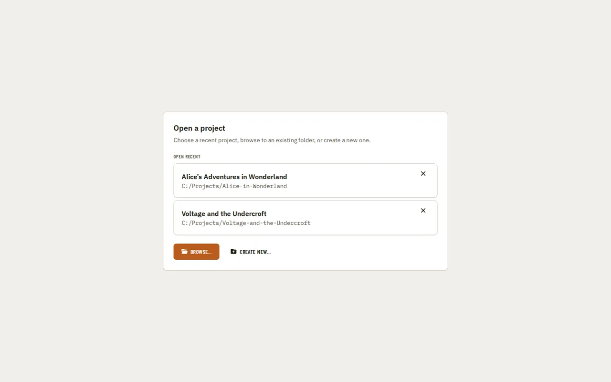

[Using the app](README.md) › Getting started

# Getting started

Launching the app without a project folder attached shows a picker instead of the workspace:
recent projects to reopen, or actions to browse to an existing folder or create a new one.

Once a project is open, the [sidebar](navigation.md) takes you to each page, and
[Home](home.md) is where you import the manuscript that most other pages depend on.

---

[Index](README.md) · [Navigation →](navigation.md)
