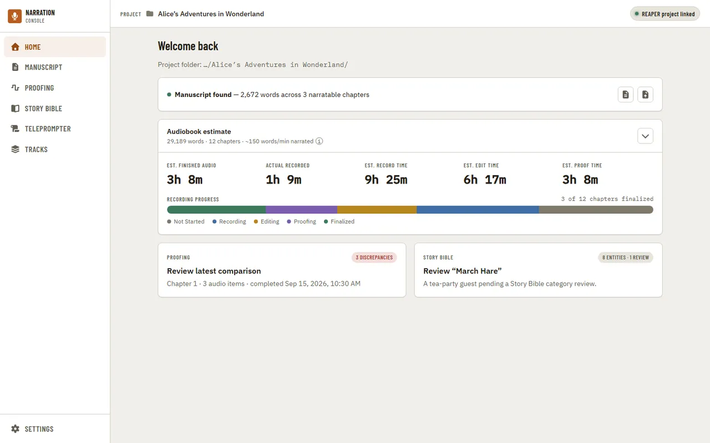
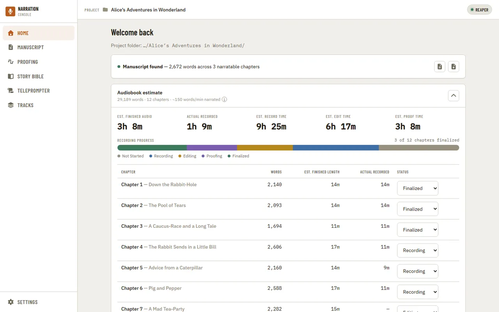
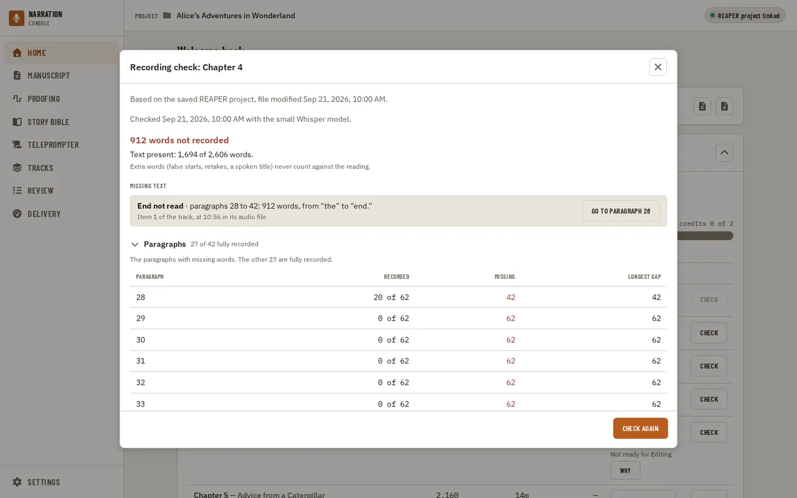
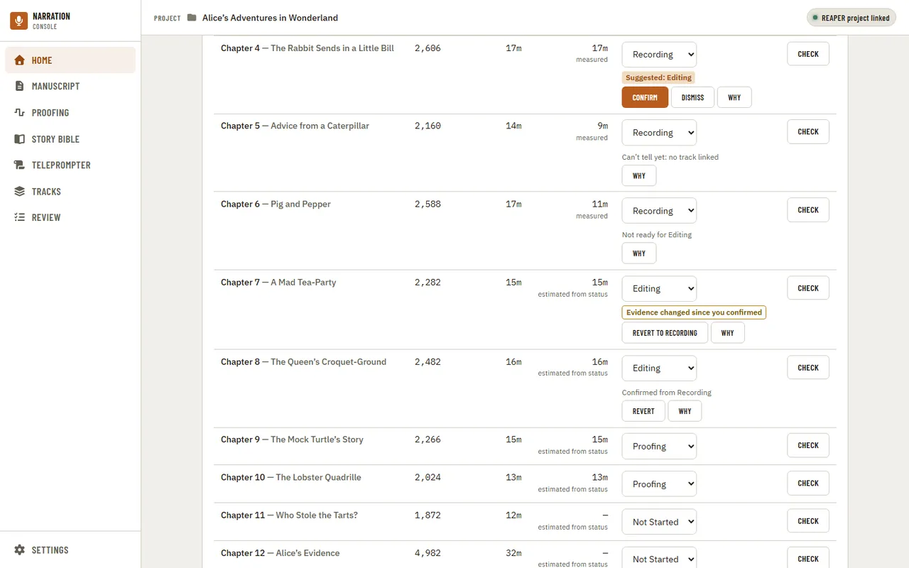
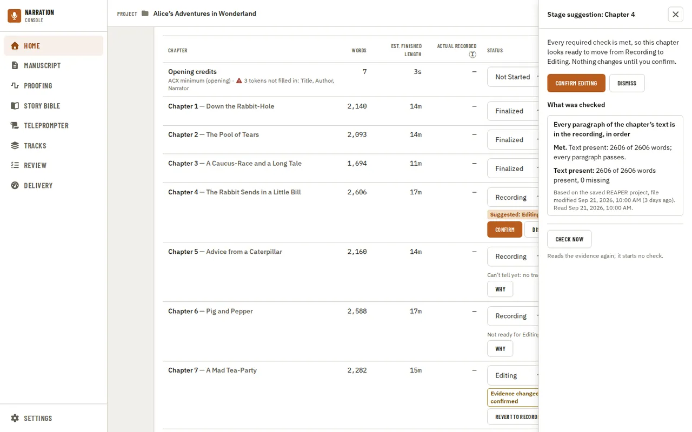
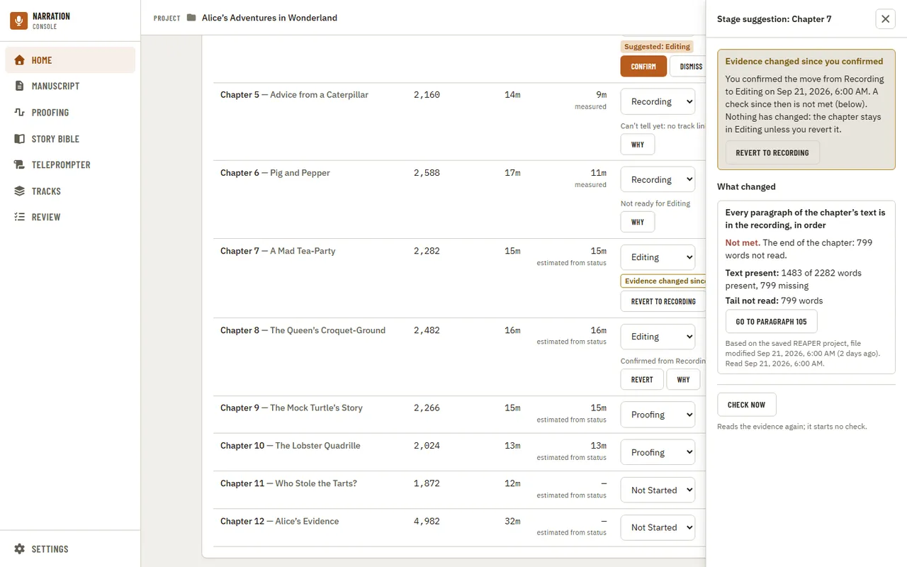
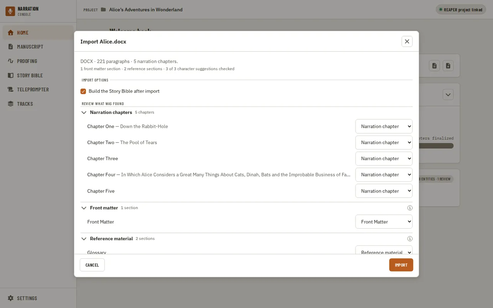
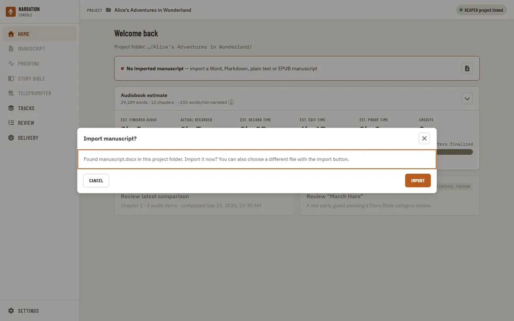
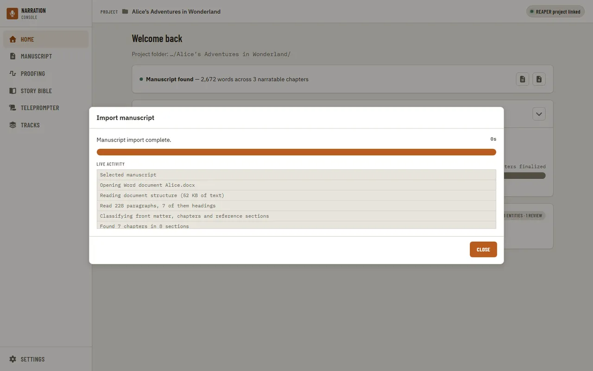

[Using the app](README.md) › Home

# Home

The landing page after opening a project: manuscript status, audiobook time estimates,
recording progress, and shortcuts into the latest [Proofing](proofing.md) comparison and
[Story Bible](story-bible.md) review.

Next to the narration estimates, **Credits** is the estimated reading time of the opening and closing
credits (the first of each in [Settings, Credits](settings.md#credits)), each with the room tone set in
Settings, General, plus the first chapter announcement read once for every chapter, shown in seconds under
a minute. It is kept apart from the narration totals, and it is left out when there is no credit template.
The [retail sample](settings.md#retail-sample) adds nothing: it is part of a chapter already counted.

The pill at the top right of every page says whether a REAPER project is linked; see
[Navigation](navigation.md) for its states.

The estimate card's per-chapter breakdown is collapsed by default; expanding it lists every
chapter with its word count, estimated and actual recorded length, and status.

**Actual recorded** shows how much audio a chapter's linked REAPER track holds, as of the last
save: the union of its unmuted items, overlaps counted once. A chapter with no confirmed link, a
link to more than one track, a linked track no longer in the saved project, or no project at all
shows a dash instead, with the reason in a tooltip and its accessible name. It never guesses from
the chapter's status or from a recording check's word share, so changing the status leaves the
column unchanged. The headline **Actual recorded** stat above the table sums the real times of
linked chapters only, and its tooltip says how many of the book's chapters that covers.

The table's first row is **Opening credits** and its last row is **Closing credits**: not
chapters, but the same first opening and first closing template the Credits stat and the
Manuscript page use, each with its own status, word count and estimated length (including room
tone). The row's title links to the matching entry on the Manuscript page. A template with an
unresolved token (`[Author]` never filled in) shows a warning next to its name without blocking
anything; a missing template reads "Not set up" with a link to [Settings, Credits](settings.md#credits).
Their **Check** is disabled for now (a recording check reads manuscript chapters only), and their
**Actual recorded** is always a dash until a later phase can measure them. The progress line adds
"· credits N of 2" once a credits row is finalized; the header count, **Est. finished audio**, the
progress bar and the rest of the row totals stay narration-only, as before.

### Checking a chapter's recording

**Check** at the end of a row opens the chapter's recording check. Nothing runs until you ask:
the dialog first shows the last result, or says the chapter was never checked, and names the
saved project file it reads ("Based on the saved REAPER project, file modified ..."). Save the
project in REAPER before checking, because the check reads the saved file, not the open session.

**Check recording** (or **Check again**) transcribes the audio items on the chapter's REAPER
track with the Whisper model chosen in Settings, then compares the words with the chapter's text
in order. The progress is real, from the transcription itself; **Cancel** stops it and keeps the
items already transcribed, so the next check is quicker, and **Continue in background** closes
the dialog while the row keeps its percent. The app tells you when it ends, wherever you are.
If the Whisper model is not installed yet, the app asks before downloading it, as Proofing does.

The result reads "Text present: N of M words", then lists the missing text: where it is (the
start or the end not read, a skipped block, a short read, or different text read), which
paragraphs, how many words, the first and last missing words, and where the gap sits in the
audio (the item on the track and the time in its audio file). **Go to paragraph** opens the
manuscript there. The paragraph list shows how many words of each short paragraph were
recorded. Misreads, false starts, retakes and a spoken chapter title never count against you.
The check changes nothing: it never edits the project or moves a chapter's status.

A result goes **out of date** when the saved project changes under it (an item added, removed,
trimmed, moved, muted or switched to another take, an audio file changed) or the chapter's text
changes. The dialog says which, keeps the old counts labelled as from then, and offers
**Check again**; only the changed items are transcribed again.

When a chapter cannot be checked, the dialog says why in plain words and where to fix it: a
chapter that is not linked to its REAPER track gets the track picker right there (the same link
as on the [Tracks](tracks.md) page), a missing project file points to Tracks, and a missing
Transcript Compare tool points to [Settings](settings.md).

### Stage suggestions

Home suggests when a chapter looks ready for its next stage, from evidence the app already has,
and never changes a status on its own. For now the only rule is the recording one: a chapter in
Recording is suggested for Editing when its current recording check finds every paragraph of its
text in the recording, in order (misreads allowed). Editing and Proofing have no check yet, so
chapters there get no suggestion. Missing evidence never counts as done: a chapter nobody has
checked reads "Can't tell yet", not ready.

While the breakdown is collapsed, chips under the estimate's title say how many chapters have a
suggestion and how many have evidence that changed since you confirmed them; either chip opens
the breakdown. There, under each chapter's status:

- **Suggested: Editing** with **Confirm**, **Dismiss** and **Why**. Confirm moves the chapter to
  the suggested stage and records what the evidence was; the row then reads "Confirmed from
  Recording" with **Revert**, which moves it back. Dismiss hides the suggestion until the
  evidence changes.
- **Not ready for Editing**: a check found text missing. **Why** shows where.
- **Can't tell yet** with the cause: not checked yet, changed since the last check, no track
  linked, the project file not readable, and so on.
- **Evidence changed since you confirmed**, with **Revert to Recording**: a check after you
  confirmed found text missing. Nothing moves until you revert; an edit alone (which changes the
  audio, as editing does) never raises it.
- **Couldn't check**: the suggestions could not be read at all. The reason is above the table.

**Why** opens the evidence at the side of the page: the verdict in a sentence, each check with
its state and reason, the facts behind it (the text present, each missing region with **Go to
paragraph**), and the saved REAPER project it was read from with how old that file is. For a
check that cannot tell, it says what to do and offers the way there, usually **Open recording
check**, where you can run the check or link the chapter's track. Confirm, Dismiss and Revert are
there too.

The suggestions are read again when Home opens, when a recording check ends, and when you change a
status yourself, so nothing above the table asks you to press anything. If a read fails, the
reason appears above the table with **Try again**, which only reads the evidence again; it never
starts a check. The evidence view keeps its own **Check now** for the same purpose. If the
evidence changed while you were looking, Confirm and Dismiss refuse and say so, and the
suggestions are read again. The status select stays as it was: you can always set a status by
hand.

Importing (or replacing) the manuscript opens a confirm dialog previewing the detected format,
paragraph count, and proposed chapters before anything changes. Each section is listed with its
subtitle after the title ("Chapter One — Down the Rabbit-Hole") when the heading had one, so you can
check that the importer split the title from the subtitle where you meant it to; a long one is cut
short in the row, and hovering it shows the whole line. If a heading's second line is not really a
subtitle, clear that row's **Subtitle** box: a title that was wrapped onto two lines is joined back
together ("The Girl Who Fell Through the Ice"), and in a plain-text file a line such as an epigraph
goes back into the chapter's text so it is narrated (the row says it "is read as text"). The
**Read a heading's second line as its subtitle** option in Import options does the same for every
row at once; a row you changed by hand keeps your choice.

The message at the top says what was found: the format, the number of paragraphs and of narration
chapters, then how many front matter and reference sections, character suggestions and repairs the
importer made. Below it the sections are grouped by what each will be: **Narration chapters**,
**Front matter** and **Reference material**. Change a row's kind and it moves to its new group at
once, and the counts follow. The small "i" next to Front matter and Reference material says what
that kind is left out of (the audiobook totals and Proofing, and for reference material the chapter
list too) and that it stays readable in the manuscript. Groups that need a decision start open, and
long lists of chapters the importer got right start closed; open or close any group with its
heading. The character suggestions have Select all and Select none. If the importer had to
repair a heading (a title and a subtitle that were run together), the repairs are listed at the
end. The **Import options** group holds the subtitle option, the choice to build the Story Bible
after import, and, for a Markdown file, the chapter heading level.

Every dialog in the app can be used from the keyboard. Focus starts inside the dialog (on its
message, outlined when you opened it with the keyboard), Tab and Shift+Tab stay inside it, and the
page behind is hidden from a screen reader until it closes. Escape declines a confirm, and focus
returns to the button that opened it. Clicking the dimmed background never dismisses a dialog,
so a stray click cannot discard a decision, and a running job (such as an import) ignores Escape
until it has finished. The red confirm button marks an action that destroys data. A step that
cannot be cancelled (rebuilding the Story Bible, or an import while it writes to the project) says
so at the top of its dialog, offers no button while it runs, and shows Close when it finishes.

If the project folder contains a file named `manuscript.docx` or `manuscript.md` and nothing has
been imported yet, Home asks whether to import it. It is only ever an offer — nothing is
imported until you agree, and declining keeps it quiet for the rest of the session. The import
button on Home is always available to pick a different file.

Once you confirm, importing runs in the background and reports what it is actually doing — copying
the source into the project, writing the manuscript, adding checked characters to the Story Bible —
in a live activity log, so the progress bar and log always match the real work.

Once a manuscript is imported you can read it on the [Manuscript](manuscript.md) page.

---

[← Navigation](navigation.md) · [Index](README.md) · [Manuscript →](manuscript.md)
