[Using the app](README.md) › Manuscript

# Manuscript

The manuscript reader shows the imported chapter text with characters, places, and other
entities highlighted inline, with alternating row shading and any italics, bold or underline
from the original document. Clicking a highlighted name or note opens its details in a side
panel. "Go to line" from the [Story Bible](story-bible.md) keeps the destination line highlighted for 30 seconds.
Text size is adjustable independently of the rest of the app.

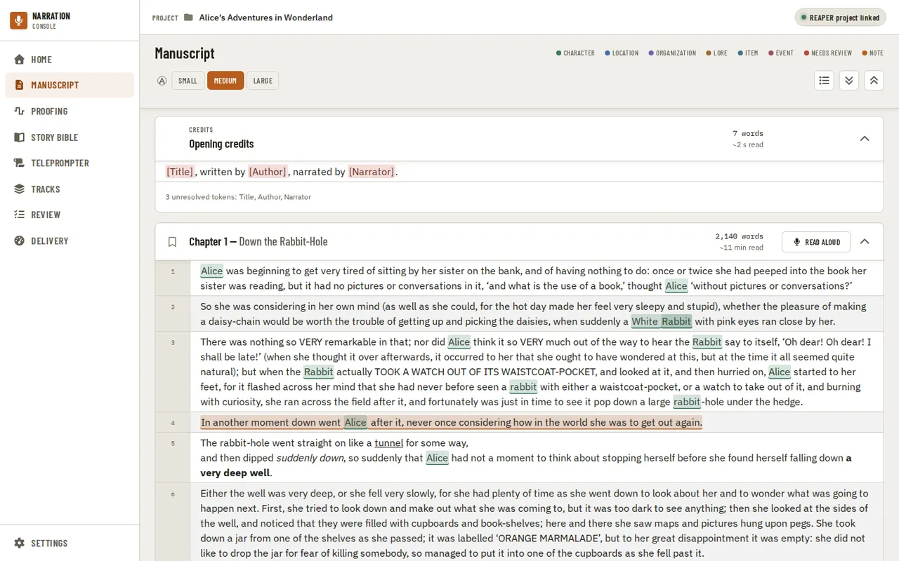

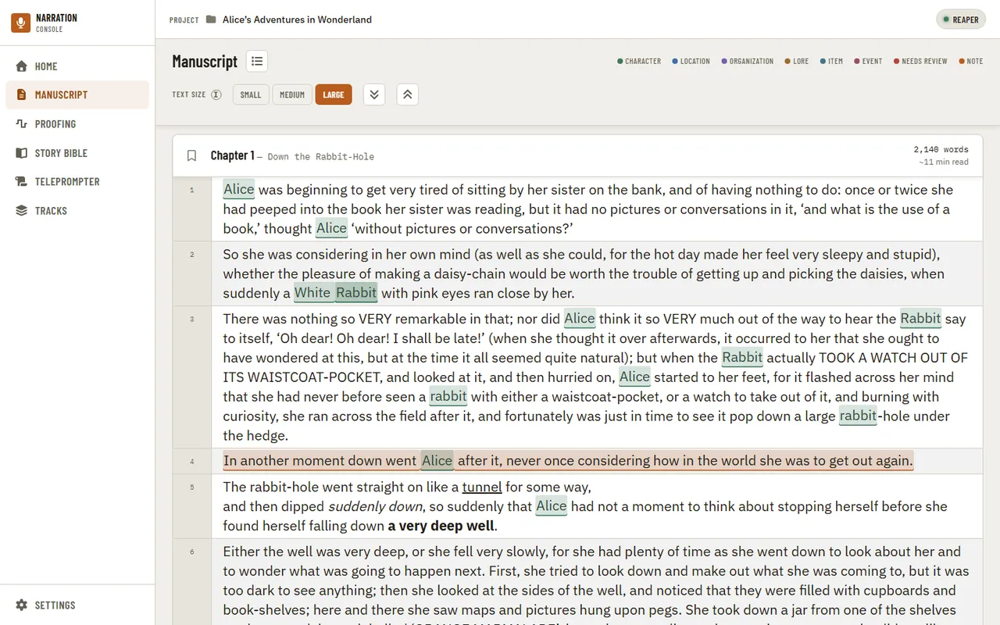

Importing keeps the storytelling formatting from a Word, Markdown, plain-text or EPUB manuscript —
italics, bold and underline — and line breaks inside a paragraph (verse, addresses), so the reader
matches the original. Chapter titles and subtitles that Word (or an EPUB's own table of contents)
stores separately are shown as a title with its subtitle. An EPUB's front matter, table of
contents and back matter (endnotes, glossary, and the like) are recognized from the book's own
markup and kept out of the narration chapters, the same as a Word document's front matter. A
plain-text file with no chapter markings, or an EPUB with no table of contents or headings,
still imports as one narration chapter rather than failing or importing nothing narratable — the
import log says so. Re-import a manuscript (Replace manuscript on [Home](home.md)) to pick this up in an older project.

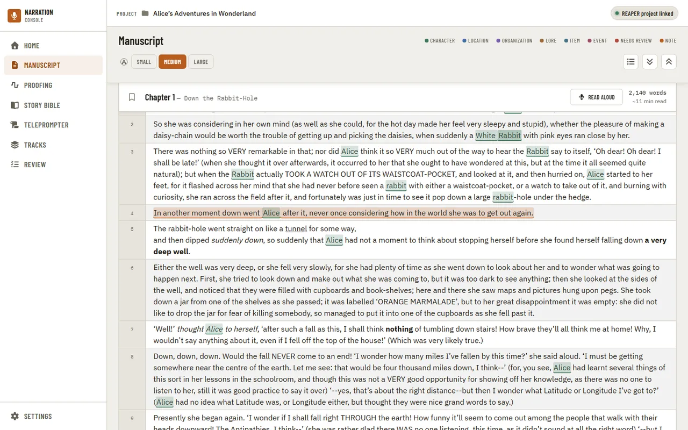

Bookmark a chapter with the icon at the left of its header; bookmarks show in blue. Chapter
headers stay opaque as you scroll so the text never shows through them.

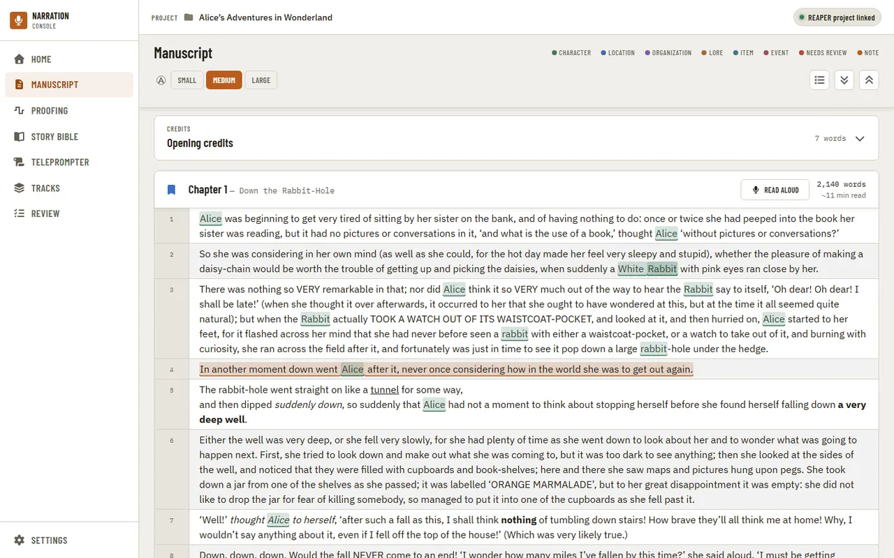

The reader follows the Light, Dark or System theme, with readable controls in both.

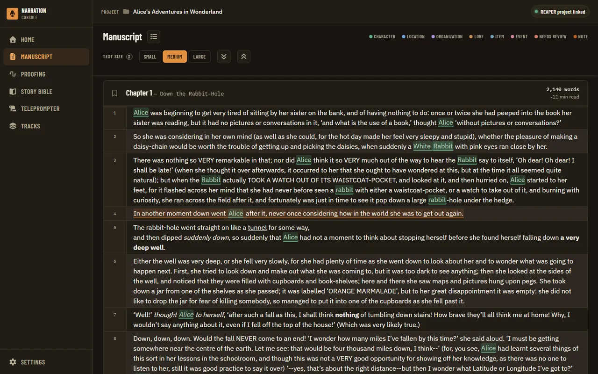

Chapters default to fully expanded inline; collapsing them switches to a compact list for
jumping between chapters without scrolling through the full text.

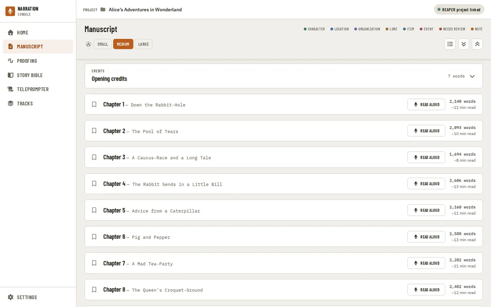

**Opening credits** sits before the first chapter and **Closing credits** after the last, when the
credit template library (Settings, This Project, [Credits](settings.md#credits)) has an opening or a
closing template. Each shows its word count and a read time, and opens and closes the same way a
chapter card does — press anywhere on its header, not just the title — with a chevron showing which
way it is set. Both are open by default and stay open or closed the way you leave them for as long as
you keep the project open. Open one to read the credits with the project's values filled in. A token
with no value yet stays in brackets, highlighted, and a line below lists the unresolved tokens, with a
**Fill in** next to it that opens the same "Set up the credits" dialog Home offers — see
[Home](home.md) for what it asks and when. A banner above Opening credits does the same while any
token stays unresolved and setup has not been dismissed for the project. These
entries are read-only and are not chapters: they are not in the chapter list or search. Record the
credits as their own files, as ACX expects, not inside a chapter file: Proofing compares a chapter file
with that chapter's text only, so credits recorded inside it are reported as extra words. Each credits
card also has a **Read aloud** button once it has anything to read, opening the same full-screen dialog
described below, titled "Read aloud — Opening credits" or "Read aloud — Closing credits" — see the note
at the end of that section for how it differs from reading a chapter.

The [retail sample](settings.md#retail-sample), once picked, is marked where it is: the chapter header shows
a **Retail sample** tag, and in the open chapter its lines have a rule down their left edge, with "Retail
sample starts" and its length above the first line and "Last line of the retail sample" above the last.

A heading that isn't really a chapter (a part title, an epigraph, or front matter your source read in
as one) is removed from recording from its track panel on [Home](home.md), not from here: choosing
**Not a chapter** takes it out of this chapter list and search too, and **Front matter** keeps it in the
list without recording it. Either way its text is untouched and **Restore** on Home brings it back as a
narration chapter.

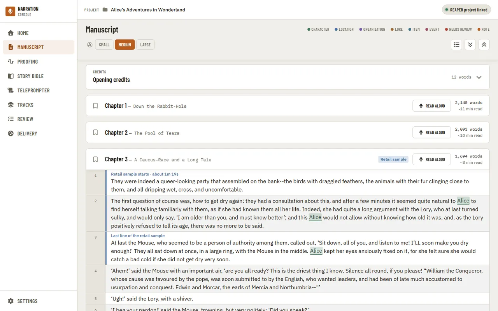

Each narration chapter's header, and the Opening credits and Closing credits cards once they have
something to read, has a **Record in Booth** button. It opens the [Booth](booth.md) on that chapter or those
credits: the read-along that listens as you narrate, with the Where you stopped notice, the Story Bible and
note marks, suspected flags and companion mode beside your DAW.

Selecting a stretch of text offers actions for it — adding a reader note or sending it to the
Story Bible as a new entry. When the selection is one word, it also offers **Look up**.

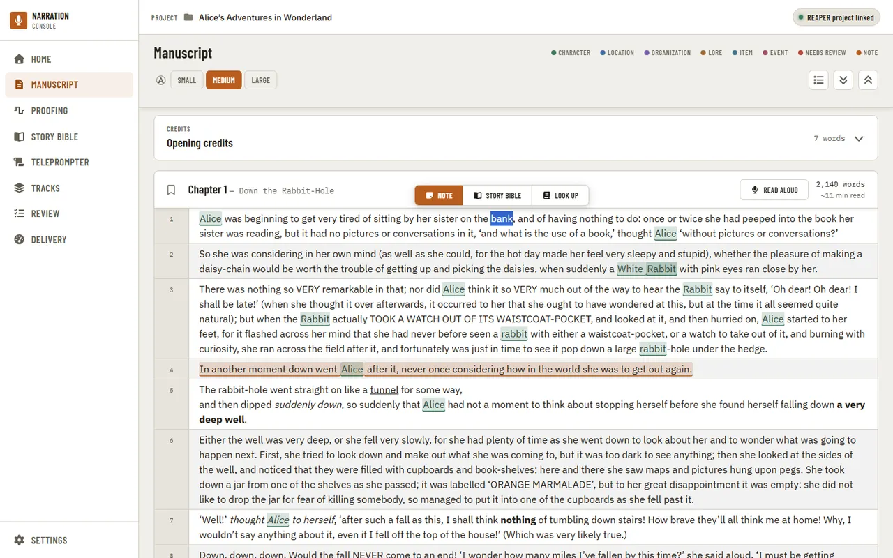

Choosing "+ Note" opens a dialog to write the note against that selection.

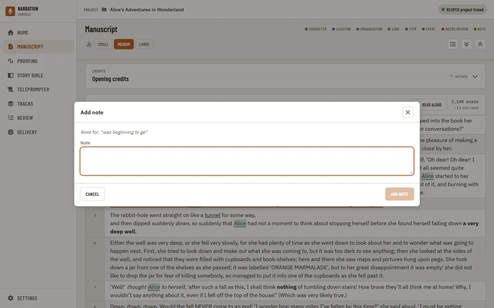

Clicking an existing note or a highlighted entity opens a detail sidebar on the right —
the note's anchored text and content for a note, or pronunciation, description, and evidence
for an entity.

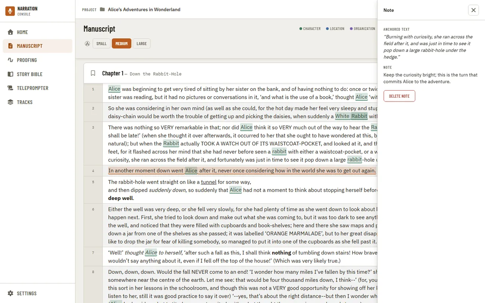

Choosing "Go to line" on a [Story Bible](story-bible.md) entry's evidence opens the Manuscript at that line and
keeps it highlighted for 30 seconds, so you can see where you landed after the scroll.

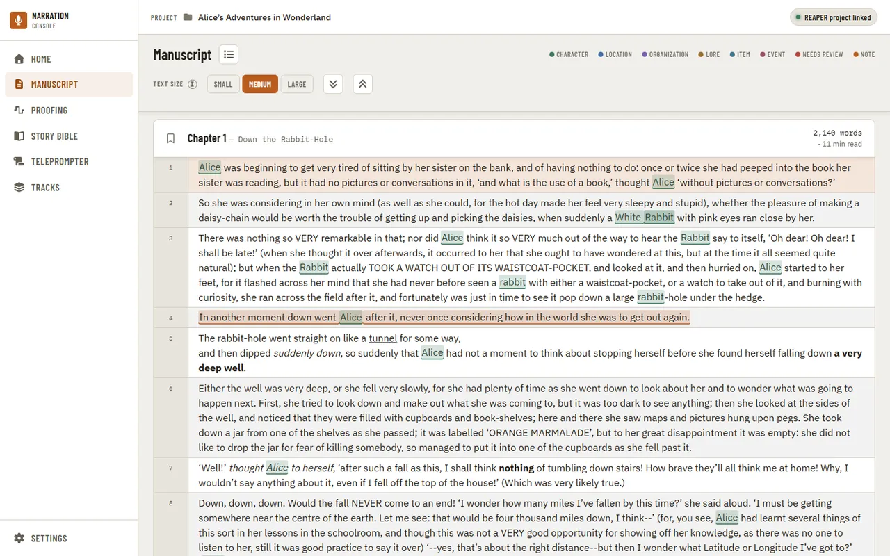

The Chapters & Search icon opens a panel with the chapter list and a search box. Typing filters
matching chapter titles and subtitles right away; matching lines appear about two seconds after you
stop typing (or immediately on Enter), so a fast typist never sees a flash of "No matches" for a
query that was never finished. Each line result shows the surrounding text with the match
highlighted; choosing one clears the search box, closes the panel, and jumps to that line. The
clear (×) icon empties the box and returns focus to it; Escape clears the box first, then closes
the panel on a second press.

A chapter with a live "Suggested: Editing/Proofing/Finalized" recommendation ([Home](home.md)'s
per-chapter stage suggestions) shows that same wording under its title here too, so it is visible
while browsing chapters without opening the estimate breakdown. It is read-only in this list -
Confirm, Dismiss and the evidence view stay on Home and, for a chapter in Proofing, on the
[Proofing](proofing.md) panel.

The reader shows only the manuscript's narratable chapters. A table of contents or a Characters
section the importer recognized stays in the project's data (the Story Bible has the readable form
of Characters) but is never a page you page through in the reader, and a saved or shared link into
one tells you so instead of landing there.

## Mark up the script

While prepping, select words on one line and choose **Mark up** to note how to read them: **Stress** (a dotted
underline), **Breath** (one slash after them), **Pause** (two slashes) or **Speaker** (a name chip before them; the
Story Bible's characters are one press away, or type any name). The marks are kept in the project's
`narration-utils/prep/markup.json`, separate from the manuscript, so a re-import keeps them. To take a mark off,
select the same words and choose **Mark up** again: the dialog lists the marks already there, each with **Remove**.

The marks never change the text you select or search. When the words under a mark change (an edited manuscript
re-imported, say), the mark is not moved to a guess: the line says **Text changed here** and names the mark and the
words it was on, with a **Remove**; a mark whose line is gone is listed above the chapter. Extra spaces or line breaks
alone never count as a change.

## Look up a word

Select one word (a double-click does it) and choose **Look up**. A panel opens on the right with
what an offline English dictionary says about it: each part of speech (noun, verb, adjective,
adverb) with its numbered meanings, most common first, the dictionary's own examples, and the
synonyms and antonyms it lists. A word with an ending, such as "curiouser" or "ran", is looked up
under the word it comes from, and the panel names that word. Punctuation and quotes around the
word are ignored.

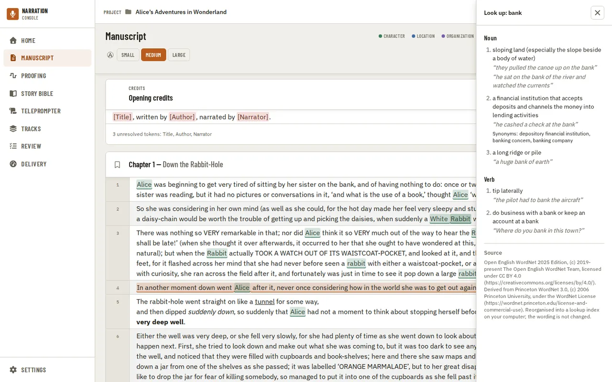

The dictionary is the [Open English WordNet](https://en-word.net/) 2025 Edition, used under
CC BY 4.0; its credit is at the foot of every answer. It is kept on your own computer and every
lookup works without an internet connection: nothing you select is sent anywhere. It has single
English words (US English), not phrases, and most names and invented words are not in it; the
panel says so plainly when a word is not there.

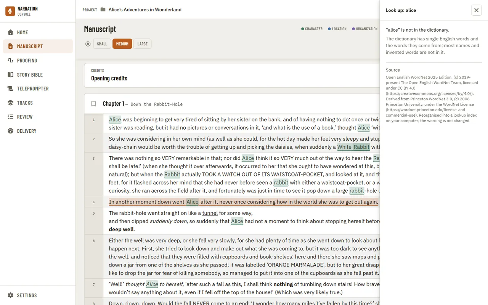

The dictionary is not bundled with the app. The first time you look a word up, the app asks
before downloading it (about 10 MB, 16 MB on disk once installed), and shows its version,
publisher, licence and where it will be kept. Nothing downloads until you choose **Download
dictionary**; once it is installed, the word you asked about is looked up. If the copy on your
computer is ever damaged, Look up asks to download it again ("Repair the dictionary?") instead of
showing a garbled answer. You can check, repair or remove the dictionary any time in
[Settings, Local assets](settings.md#local-assets).

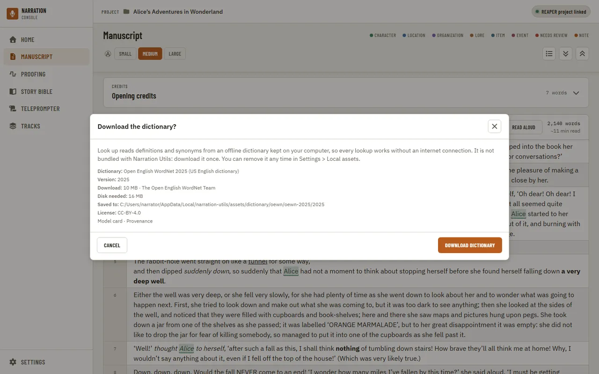

---

[← Production](production.md) · [Index](README.md) · [Proofing →](proofing.md)
