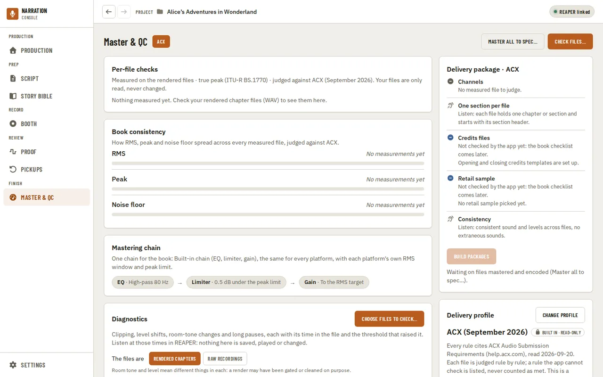
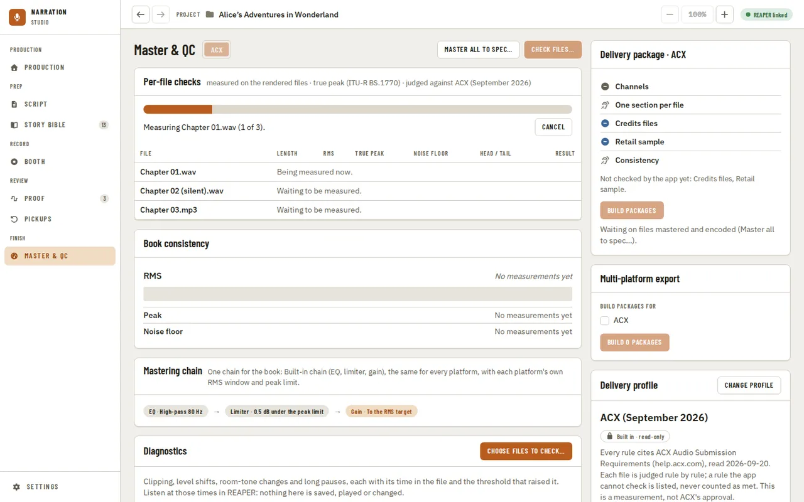
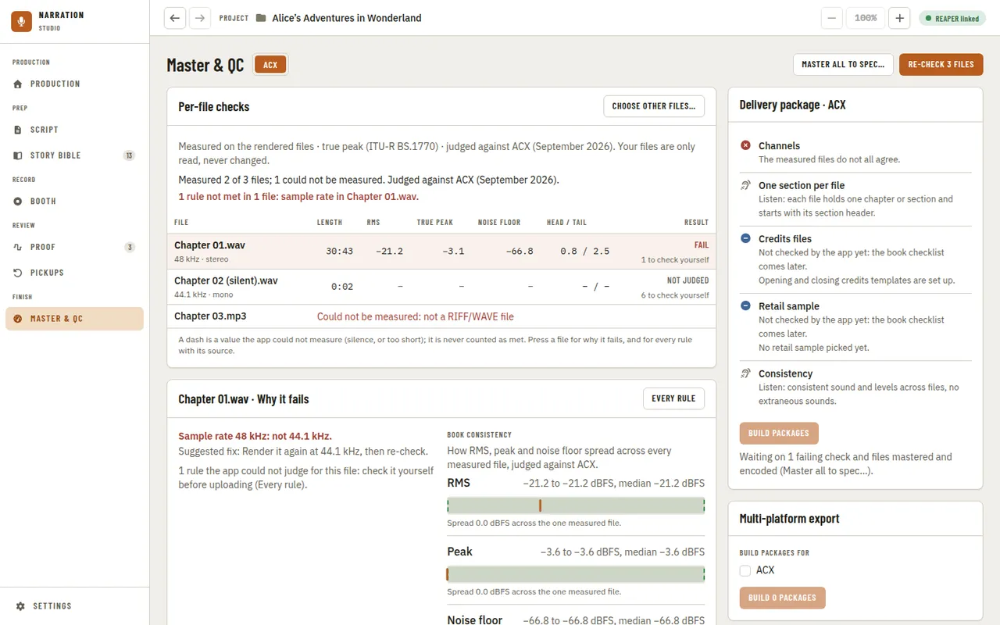
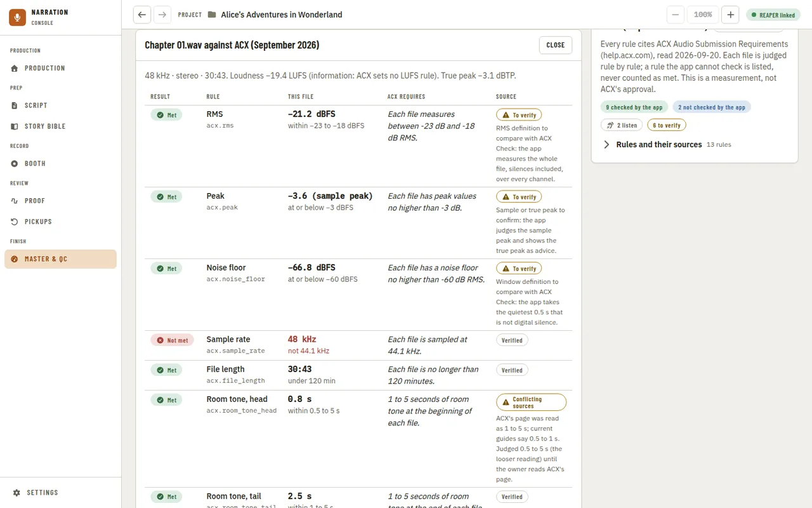
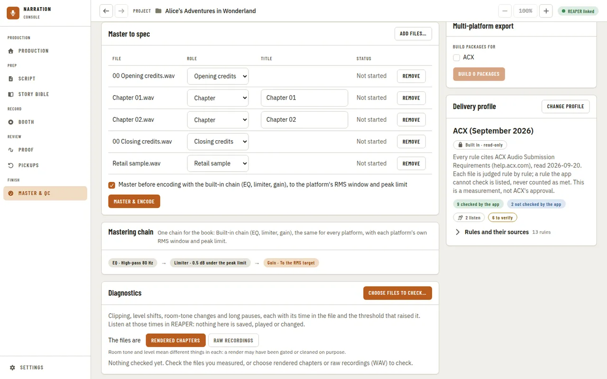
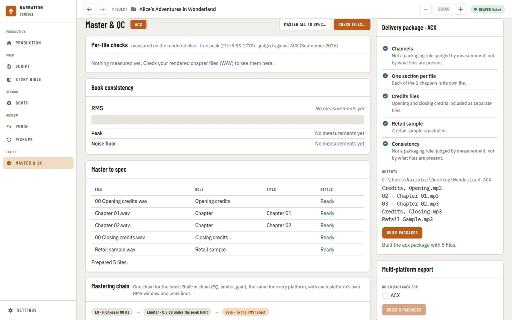
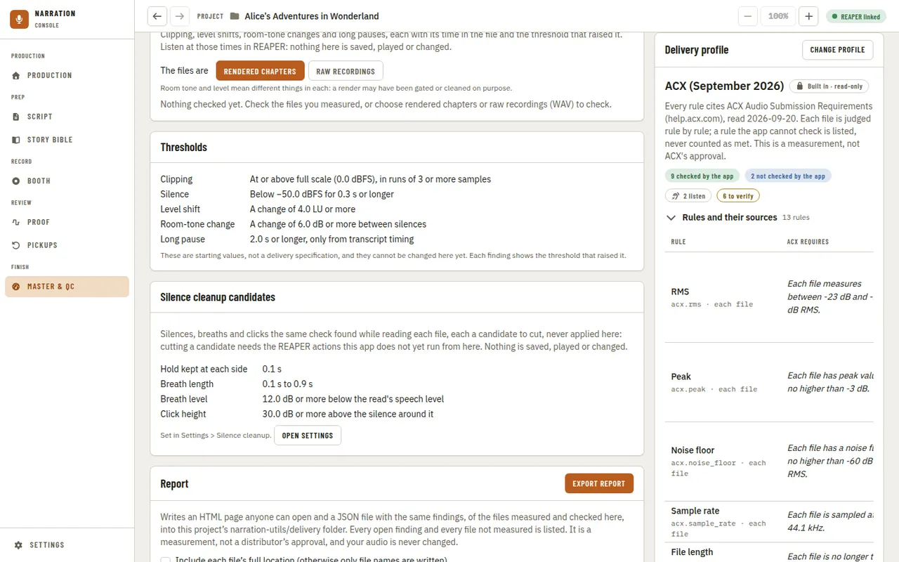
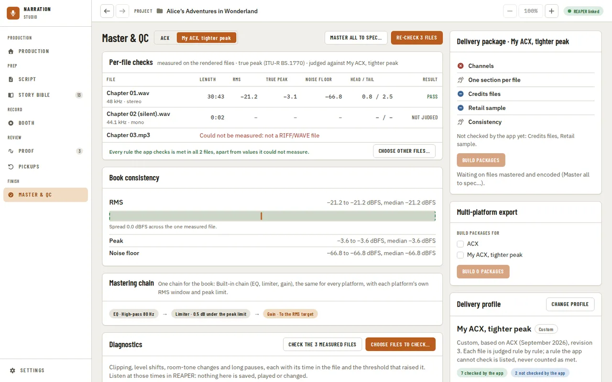
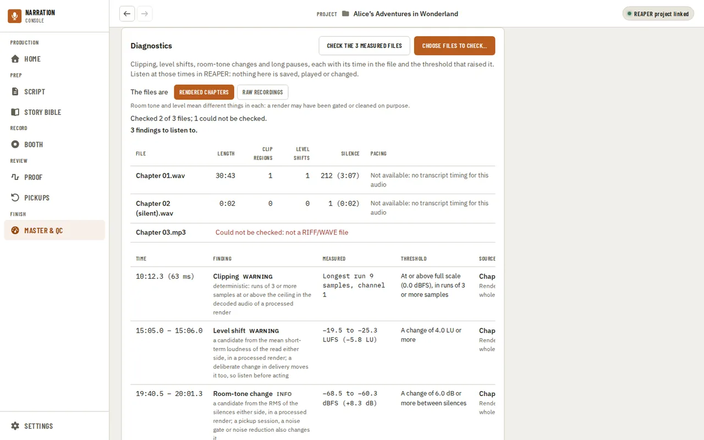
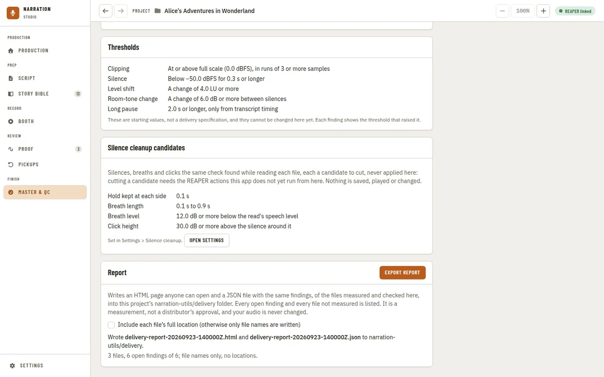

[Using the app](README.md) › Master & QC

# Master & QC

Master & QC is where a book is finished: it checks your rendered chapter files against the delivery
profile of the platform you upload to, rule by rule, says why a file fails and how to fix it, masters and
encodes the files to spec, and builds the platform's delivery package. Out of the box every project is
judged against **ACX (September 2026)**, ACX's audio submission requirements as the app recorded them.
Your files are only read, never changed: mastering, encoding and packaging each write new files. Master &
QC is always in the navigation, under **Finish**: it needs neither a manuscript nor a REAPER project. It
replaced the Delivery page, and an old link to `/delivery` lands here.

## Platforms

The row of tabs beside the title is one per delivery profile: the built-in **ACX**, and each custom
profile you made, by its name. Pressing one makes it this project's profile, the same choice as in
[Settings, Delivery](settings.md), and the files already checked are judged against it again without
measuring them again. The delivery package on the right is named after it. The app has one built-in
profile today; other platforms appear as tabs once their profiles exist.

## Checking files

Press **Check files…** and pick one or more rendered chapter files. Only WAV files are measured for now;
a file in another format, or one that cannot be read, is listed with the reason and does not stop the
others. The bar shows how much of the audio has been read so far, and **Cancel** stops the check: files
already measured keep their results. You can leave the page while it runs; the app says when it ends, and
Master & QC shows the last check when you come back. Once files are checked the button reads **Re-check
3 files** and measures the same files again (after a new render, say); **Choose other files…** picks
others.

**Per-file checks** has a row per file: its **Length**, **RMS**, **True peak**, **Noise floor** and the
room tone at its **Head / Tail** in seconds, then its **Result**. A value that misses the profile's rule is
red, and a true peak above ACX's advice is amber; a value the app could not measure (a silent render, or a
file too short) is a dash, never a number, and never counted as met. The result is **Fail** when any rule
is not met, **Pass** when every rule the app checks is met, and **Not judged** when a value could not be
measured. Below the table, the page says which rules each file missed, or that every rule the app checks
is met, and which rules to check yourself before uploading (the MP3 you upload, when it measured the WAV).
A screen reader also hears how many rules each file leaves to you.

### Why it fails

Below the table, the first failing file (or the one you press) says **why it fails**: each rule it missed,
by how much, and a suggested fix. The fix only promises what the app can do: mastering sets RMS and holds
peaks, so an RMS or peak miss says "Master it to spec"; it never lowers a noise floor or changes a sample
rate, so those say to clean up or render again in your DAW. A file that passes says so, with the rules
left for you to check.

**Every rule** opens the file rule by rule: this file's value, what the platform requires, and how that
requirement was verified. Integrated loudness (LUFS) and the true peak are shown there for information:
ACX's page, as recorded, sets no LUFS rule.

### Book consistency

Beside why a file fails (or on its own when nothing fails), **Book consistency** shows RMS, peak and noise
floor: the book's minimum, median and maximum for each. RMS is drawn as a strip with a tick for every
measured file; peak and noise floor are one line each. A rule reads only the files it has actually judged,
so a rule with nothing to show yet says **No measurements yet** rather than a zero.

## The mastering chain

**Mastering chain** shows the chain the book masters with, as its steps in order: the built-in chain's
**EQ** (a high-pass at 80 Hz), **Limiter** (peaks held 0.5 dB under the platform's peak limit) and **Gain**
(toward the platform's RMS target). It is one chain for the book, the same for every platform, with each
platform's own numbers. It is fixed and cannot be edited. The app does not yet play a file raw and mastered
side by side.

## Mastering to spec

**Master all to spec…** picks the rendered files to master and encode. Give each its role in the package
(a chapter, opening or closing credits, or the retail sample) and each chapter its title, then press
**Master & encode**: with **Master before encoding** on (the default) each file is mastered by the chain
above to the chosen platform's numbers, then encoded; turn it off to encode only. The bar shows the files'
progress, and each row says whether it waits, is mastering, is encoding, is ready or failed and why. Every
stage writes a new file next to the app's own output: your renders are never changed.

## The delivery package

**Delivery package** on the right lists the book checklist for the chosen platform: the credits files, the
retail sample, one section per file, consistency, and the channels being the same in every file, one line
each. A rule the app cannot check yet is named under the list and is never counted as met; credits and the
retail sample's own facts, and each rule's description, are read out by a screen reader. Until the files are ready, the panel says what the package is
waiting on: files that fail a check, and files not mastered and encoded yet.

**Build packages** asks for a folder and assembles the platform's package from the files mastered and
encoded on this page. The checklist then becomes the packager's own (each rule **Included** or **Missing**
with why), and **Outputs** lists the folder and every file it wrote.

## Building packages for several platforms at once

If you deliver to more than one platform, **Multi-platform export** (below Delivery package) lets you build
all of them from the one source you already mastered and encoded, without re-encoding unless a platform
needs a different file format. Check the box for each platform you want a package for, then **Build N
packages**. This does not change which platform the page's checks and the delivery package above are judged
against - that is still the platform tab; the checkboxes only choose what to build packages for.

You are asked for one folder once, and each platform's package goes into its own correctly named subfolder
of it. Two platforms that both take the same file format (most do: MP3 at the same bitrate) share the one
set of already-encoded files; a platform that needs a different format (an M4B audiobook file, say) is
encoded for just that once, however many platforms need it, not once per platform. Cancel stops the build
before its next platform starts; platforms already built keep their packages, and one not yet reached is
left waiting.

Once it finishes, each platform gets its own row: built, with its folder and how many files it wrote, or why
it could not be built (the same reasons Delivery package's own checklist would show, such as a required file
being missing for that platform).

## The delivery profile

Below the package, **Delivery profile** names the profile the project is judged against and how many of its
rules the app checks, how many it cannot check yet, how many are for you to listen for, and how many are
still to verify. **Rules and their sources** lists every rule with what the platform requires, how the app
checks it, and whether that requirement was read on the platform's own page (**Verified**), is still **To
verify**, or has **Conflicting sources** (room tone at the head of a file: ACX's page was read as 1 to 5 s,
current guides say 0.5 to 1 s, so the app judges the looser 0.5 to 5 s). The profile is a measurement, not
ACX's approval.

**Change profile** opens [Settings, Delivery](settings.md). To judge against other numbers, duplicate ACX
there and change its numbers or turn a rule off; your profile then appears as a platform tab of its own. If
you had set your own limits before delivery profiles, they were moved into a custom profile named **Your
limits** (or ACX, when they were ACX's numbers), so your files are judged the same way as before.

## Diagnostics

**Diagnostics**, below the chain, checks the same kind of files for clipping, level shifts, room-tone
changes and long pauses. Press **Check the measured files** to check what you just checked, or **Choose
files to check…** to pick others. First say what the files are, **Rendered chapters** or **Raw
recordings**: room tone and level mean different things in each, because a render may have been gated or
cleaned on purpose, so a room-tone change in a render is only information. The bar shows the audio read so
far, and **Cancel** keeps what was already checked.

Each file gets a line with its length, how many clip regions and level shifts it has and how much of it is
silence. Pacing and the speaking rate need the transcript's word timing, so a file checked here says **Not
available** with the reason, and no long pause is guessed from silence alone.

Under it, each finding gives its time in the file, what it is and why it was raised, what was measured, the
threshold that raised it, and the file and the kind of source it was measured in. Listen at those times in
REAPER: the section plays nothing, changes nothing and saves nothing, so every finding is a candidate to
listen to, not a verdict. **Thresholds** lists every threshold the check uses, even before you check
anything. When nothing reaches a threshold, the section says so without calling the file a pass.

## Exporting a report

**Export report**, at the bottom of the page, writes the last check and the last diagnostics to two files
in your project's `narration-utils/delivery` folder: an HTML page a reviewer can open in any browser without
the app, and a JSON file with the same findings for tools. Each export gets its own name from the time it
was made (`delivery-report-20260923-140000Z.html`), so an earlier report is never overwritten, and nothing
is ever written next to your audio.

The report lists every file you checked, and says for each one whether it was measured and checked, and if
not, why. It names the profile and its version, and lists every rule with what the platform requires, how
the app checked it, how it was verified and how many files met it. Each finding has an ID, its file, its
time in the file, what was measured against which threshold, and its review state. The HTML and the JSON
use the same IDs, and the rules not met in **Per-file checks** are those same findings: they are on
[Proof](proof.md#delivery-checks) too, so a decision you make there is the report's decision. It is a
measurement, not a distributor's approval.

Files are named only by their file name unless you tick **Include each file's full location**. No audio and
no manuscript text is ever written into the report. Export needs a project open, and waits until a check or
diagnostics run has finished.

---

[← Pickups](pickups.md) · [Index](README.md) · [Settings →](settings.md)
