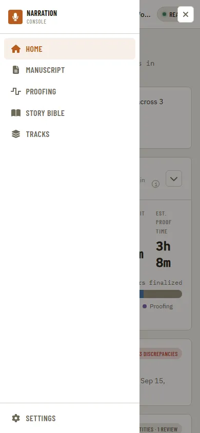
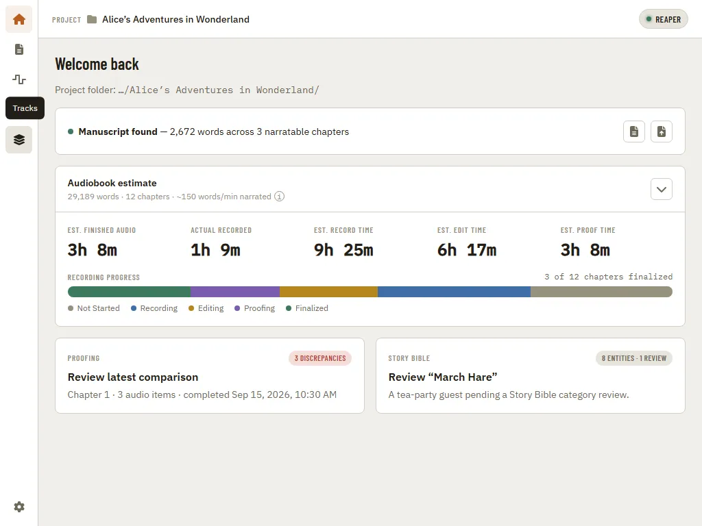

[Using the app](README.md) › Navigation

# Navigation

[Home](home.md), [Manuscript](manuscript.md), [Proofing](proofing.md), [Story Bible](story-bible.md),
[Teleprompter](teleprompter.md), and [Tracks](tracks.md) are reachable from a sidebar on the left. At
desktop widths it stays open with labels; narrower windows switch it to icon-only, then hide
it behind a hamburger menu that opens it as a slide-in drawer. [Settings](settings.md) lives at the
bottom of the sidebar in every layout.

In the icon-only layout, hover an icon (or tab to it) to see the page's name.

Manuscript, Proofing, Story Bible, and Teleprompter stay locked until a manuscript has been
[imported on Home](home.md); hovering a locked entry says why. Home and Tracks are always available.

---

[← Getting started](getting-started.md) · [Index](README.md) · [Home →](home.md)
