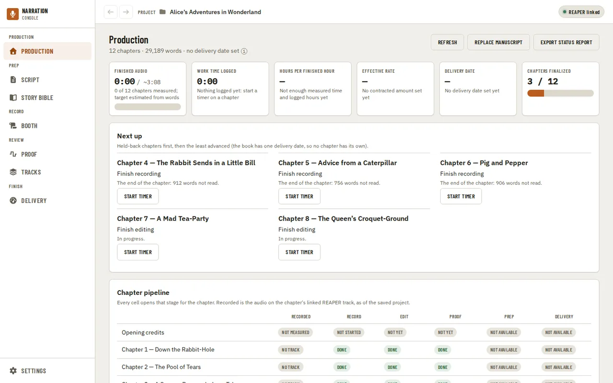
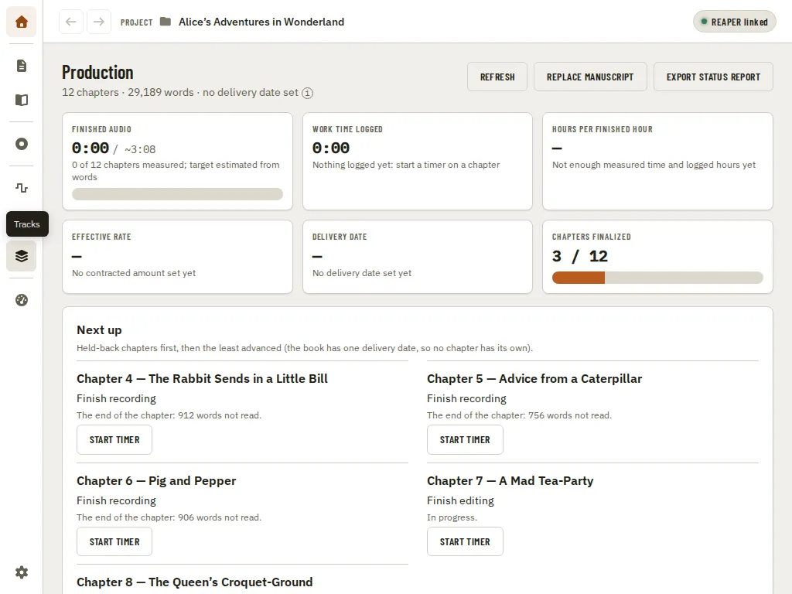
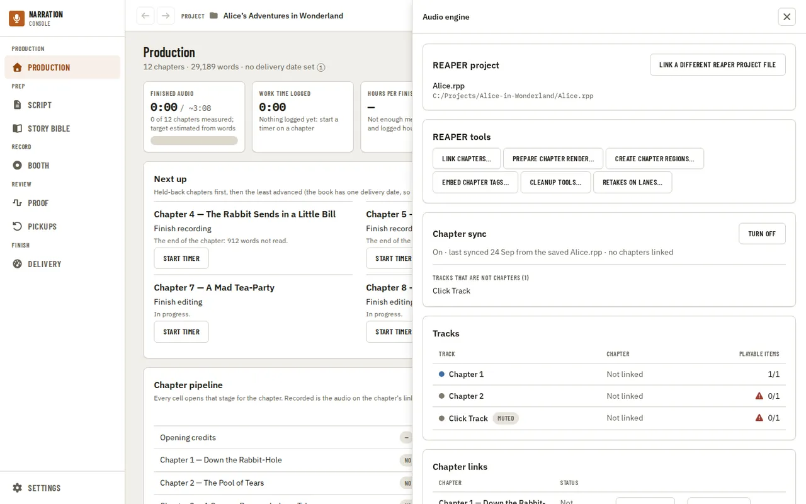
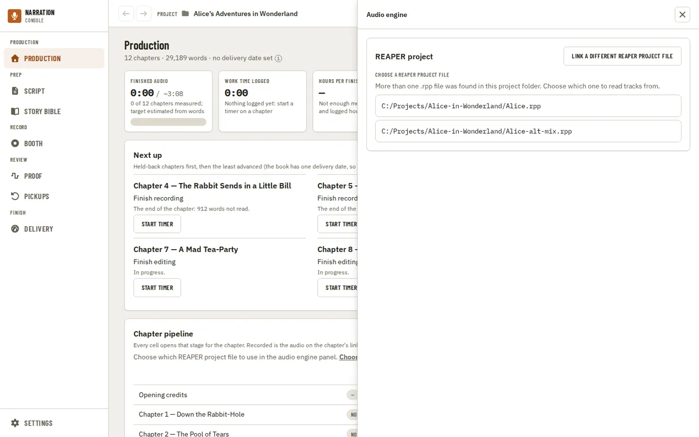
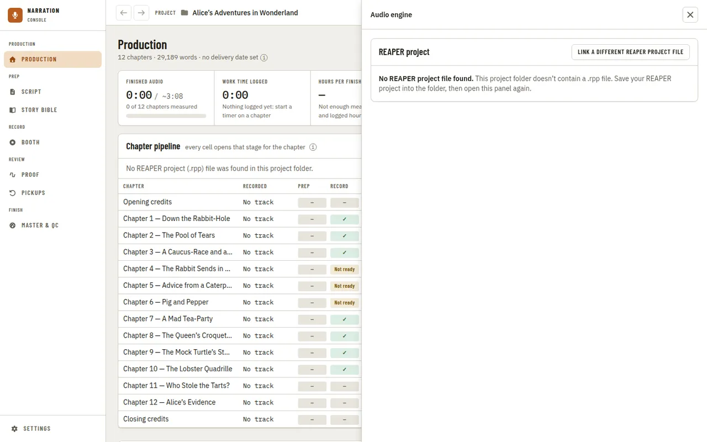
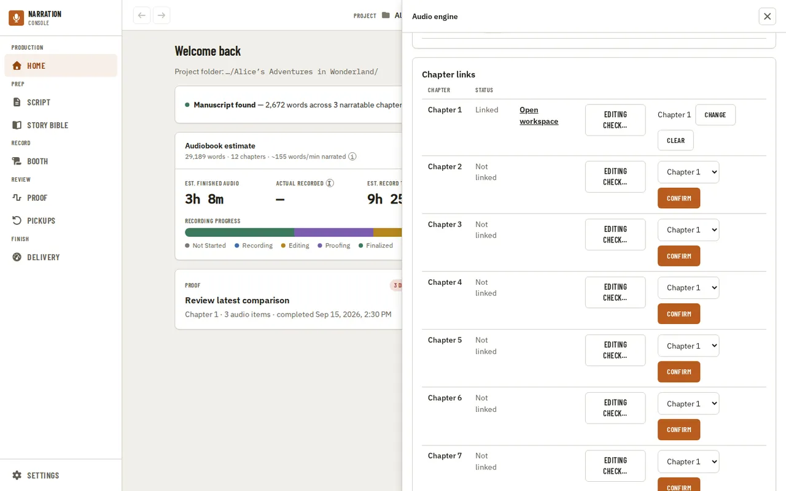
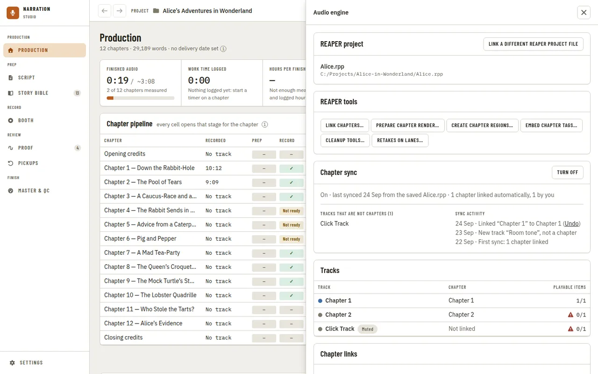

[Using the app](README.md) › Navigation

# Navigation

The sidebar on the left is grouped by production stage, the way a narrator's week runs: **Production** ([Production](production.md)),
**Prep** ([Script](script.md), [Story Bible](story-bible.md)), **Record** ([Booth](booth.md)),
**Review** ([Proof](proof.md), [Pickups](pickups.md)) and **Finish** ([Master & QC](master-and-qc.md)).
At desktop widths each group shows as a heading over its pages; narrower windows switch it to icon-only groups
divided by a thin line, then hide it behind a hamburger menu that opens it as a slide-in drawer with the headings
back. [Settings](settings.md) lives at the bottom of the sidebar, in every layout, below every group.

In the icon-only layout, hover an icon (or tab to it) to see the page's name.

Script, Story Bible, and Booth stay locked until a manuscript has been
[imported on Production](production.md#importing-the-manuscript). Hovering a locked entry says what is missing. Production, Proof, Pickups, and Master & QC
are always available.

The header runs, left to right: Back and Forward (below), the project's name, and at the right the timer, the
[zoom controls](#zoom) and the engine chip. While a [production stage timer](production.md#the-stage-timer) runs,
the timer chip counts its time and names the chapter ("0:42:07 · timer on Chapter 6") on every page; below the
tablet width it keeps the clock only. With no timer running it is not there.

The engine chip at the right of the header shows the linked audio engine, and clicking it opens the
[audio engine panel](#the-audio-engine-panel), where the project's `.rpp` file is linked or changed:

- **REAPER linked**: a `.rpp` file is linked to this project.
- **No REAPER project linked**: nothing is linked yet.
- **Wrong REAPER project open**: REAPER is running with a different project open than the linked one. Link
  the open project instead, or switch REAPER to the linked file.
- **Built-in recorder**: the project records through the app's own recorder instead of REAPER. Nothing chooses
  this yet; it appears once a future update adds a built-in recorder.

## Moving around: Back and Forward

Two buttons at the left of the header walk the pages you have visited in this project, the way a browser's Back
and Forward do: **Back** (`Alt+Left`, or your mouse's back button) returns to the page you came from; **Forward**
(`Alt+Right`, or your mouse's forward button) goes there again after a Back. Each is disabled — with a tooltip
saying why — when there is nowhere to go: Back on the first page you opened in this project, Forward until you
have gone Back at least once. Switching to a different project starts a fresh history; Back does not cross into
the project you left.

Back and Forward respect the same checks the nav does: leaving unsaved changes in [Settings](settings.md) asks
first, and leaving a chapter's [Proof view](proof.md#the-chapter-view) while a comparison is under way or
showing results resets it the same way. They only move between pages — closing a slide-over, the previous
chapter, or the previous Story Bible entry are not Back steps.

## Zoom

Three controls at the right of the header, before the audio engine chip, make the whole app bigger or smaller:
`[−] [100%] [+]`. The middle button is a readout of the current level and also resets it: click it, or press
`Ctrl+0` (`Cmd+0` on macOS), to return to 100% from any level; it is itself disabled at 100%, since there is
nothing to reset. **Zoom out** (`Ctrl+-`, disabled at 100%) and **Zoom in** (`Ctrl+=`, disabled at 200%) step
through 100%, 110%, 125%, 150%, 175% and 200%. The numpad's `+`, `-` and `0` keys do the same as their main-row
equivalents.

This is the app's real zoom — the same one a Ctrl+scroll or a touchpad pinch already does — not a text-size
setting, so it reflows the whole layout through the sidebar, icon rail and drawer breakpoints exactly as a
narrower window would. Ctrl+scroll and pinch keep working at any level, including below 100%; the readout
follows them and stays the reset button. A level pushed above 200% by Ctrl+scroll or pinch is brought back to
200% automatically, since layouts below the app's minimum window width get cramped past that point. A change is
announced once, for a screen reader, after the level settles — not on every wheel notch.

Zoom is one setting for the whole app, not a page or a project. It is not [Script](script.md)'s own Text size,
which stays independent and multiplies with app zoom.

The level is remembered across launches: quit at 125% and the app opens at 125% next time, with no flash at
100% first. It is a machine-wide setting like the [Booth](settings.md)'s microphone, not a project one, so it
follows you between projects rather than resetting when you switch.

## The audio engine panel

Click the chip at the right of the header to open the audio engine panel over whatever page you are on.
It holds everything about the REAPER project itself rather than one stage of the work: the linked project
file, the REAPER tools, chapter sync, the project's tracks and each chapter's link to its track. Close it
with its close button, Escape or a click beside it. (It replaced the Tracks page; an old link to that page
opens [Proof](proof.md) with this panel open over it.)

### The REAPER project

The panel reads the project's REAPER project file (`.rpp`) directly, so it needs neither REAPER running
nor an imported manuscript; its [REAPER tools](#reaper-tools) are the exception. It shows the file it read
and, beside the heading, **Link a REAPER project file** (or **Link a different REAPER project file** once
one is linked): the link a chapter's [Proof view](proof.md#comparing-the-recording-with-the-script) needs,
and the same one [Settings](settings.md#daw-integration) makes. The file must be saved inside the project
folder; one from another folder is refused with a message saying so. When REAPER has a different project
open than the linked one, the panel says so: link the open project, or switch REAPER to the linked file.

If the project folder holds more than one `.rpp` file, the panel asks which one to read. Backup copies
(`.rpp-bak`, or files inside a subfolder such as Backups) aren't offered. The choice is remembered for the
project.

If the folder has no `.rpp` file at all, the panel says so. Save the REAPER project into the project folder
and open the panel again.

### Tracks

The Tracks list shows each track of the project with its colour, a Muted badge when it's muted, the chapter
it is linked to (or Not linked), and how many of its items have playable audio (for example `1/1`). A
warning triangle marks a track with an item whose audio file can't be found on disk, or that isn't audio at
all (such as a MIDI item). To hear a chapter, open its [Proof view](proof.md#the-chapter-view).

### REAPER tools

When the project has tracks, the REAPER tools sit in a row under the project. **Link chapters…** and
**Prepare chapter render…** change the project open in REAPER, through the Narration Utils script
the launcher runs there; nothing is written until you press the dialog's action button.

**Link chapters…** (shown once a manuscript is imported) stamps each chapter's identity onto the REAPER
items that hold its recording. Choose the track for each chapter; **Items to stamp** shows how many of
that track's items will carry it, and **Stamp N items** writes it. An item already stamped with a
different chapter is left alone unless you tick **Overwrite items already stamped with a different
chapter**, and items REAPER no longer has are listed as stale. **Read current stamps** lists what the
project carries now, with each item's status (OK, Text changed since stamping, Manuscript re-imported
since stamping, Chapter no longer in the manuscript, and so on). This is not the same as the
[Chapter links](#linking-chapters-to-tracks) list below: that list is kept by the app and changes
nothing in REAPER, and the dialog starts with every chapter Not linked whatever the list says.

A proofer's pickup list has its own page, [Pickups](pickups.md).

**Prepare chapter render…** sets REAPER's render to every chapter region, names each file after its
region, and saves into the **Output folder** (a `renders` folder in the project to start with). Press
**Configure render** and it lists the files the render will create. It never renders anything itself:
press Render in REAPER (Ctrl+Alt+R or File > Render) to create the files. If the project has no chapter
regions yet, it says so.

**Create chapter regions…** plans one REAPER region per chapter with a confirmed track link, plus an
**Opening credits track** and **Closing credits track** you choose in the dialog, and shows the plan
before writing anything: each row's title, track, start, end and status (New region, Already exists,
Moves an existing region, or Several regions share this title). A chapter or credits track with nothing
to plan is listed under **Not planned**, with why (for example, no track is linked to that chapter).
Tick **Move an existing region that shares a chapter's title, instead of adding a second one** to move a
same-titled region instead of adding another; left unticked, a region that would move or is ambiguous
still gets a new one alongside it. **Create N regions** writes the plan in one step and reports what
happened ("Sent 3: 2 created, 1 already existed, 0 moved, 0 ambiguous, 0 failed."). Creating chapter
regions is an experimental REAPER action ([Settings](settings.md)), off by default: until you turn it
on, **Create N regions** stays disabled and says why.

**Embed chapter tags…** adds ID3 chapter markers to an MP3 of the whole book that you have already
rendered, timed from the chapter files of your last chapter render. It lists those chapters and marks
any that are "not rendered yet"; every one must exist first. Enter the path of the combined book MP3 and
tick the confirmation: the file you name is never changed, and a new, tagged copy is written beside it.
This one does not talk to REAPER.

**Cleanup tools…** opens a repair tool in REAPER on the items you have selected there. Select the items
in REAPER first, then press **Open** beside the tool. **Repair Pops/Clicks** is REAPER's own dialog
(REAPER 7.80 or later); **Magnolius DeClick** is a free third-party script for mouth clicks, and works only
if you installed it in REAPER yourself (ReaPack, or Actions > Load ReaScript). Narration Utils never
installs it. Opening a tool changes nothing: you apply or cancel the repair in its own window, and REAPER's
Undo takes it back. If nothing is selected, the tool is missing, or your REAPER is too old, the dialog says so.

**Retakes on lanes…** is for retakes recorded into REAPER's fixed item lanes. It lists every line of
the manuscript (linked with **Link chapters…**) that has retakes on more than one lane of a track, with
each retake's lane, its item name and whether that lane plays in the saved project. Press **Play this
lane** beside the retake you want: that lane becomes the only one playing on its track. A lane plays
across the whole track, so every other lane of that track goes silent, not only for this line.
Nothing else changes, and one Undo in REAPER puts the previous lanes back. Narration Utils never turns
lanes on, converts takes to lanes or builds a comp: if a track is not in fixed-lane mode, or the retake
has changed since you last saved, the dialog says so and changes nothing.

### Linking chapters to tracks

Below the track list, Chapter links shows every narration chapter with the track it's confirmed
to, so checks that need to know "which audio is this chapter" (the [editing check](#editing-check)
below, an evidence view) don't guess by name. A chapter starts **Not linked**; choose a track and press Confirm to
link it. A confirmed chapter shows **Linked** with the track's name, and Change or Clear. Change
replaces the chapter's link, so a chapter is never left linked to two tracks; a track already
linked to another chapter moves to this one. Clear removes every link the chapter has. If the
confirmed track is deleted, or the project points somewhere else, the chapter shows **Track
missing** until it's relinked or cleared. These links are kept in the app's own project data and never
change the REAPER project.

A linked chapter's row also has **Open workspace**, into the chapter's [Proof view](proof.md#the-chapter-view): one
screen to listen to the chapter against its script and see where the recording check found a problem.

When one or more chapters have a [Production](production.md#stage-suggestions) stage suggestion that can't be
computed because its track link is missing or not yet confirmed, a line above Chapter links says so
("N chapters can't get a stage suggestion until their track links are confirmed below") and points
at this same list - link or confirm the chapter there to let its suggestion be computed on the next
read.

### Editing check

Each chapter's row also has **Editing check…**, opening its own panel over this one: whether
empty space, clicks and breaths still need trimming out. The same panel opens from
a chapter's [stage suggestion](production.md#stage-suggestions) on Production when the editing signal
names it as the way to resolve what's unknown.

The panel never starts a check on its own: opening it only reads what the last check already
found. **Check editing** (**Check again** once one has run) runs the scan with real progress and
**Cancel**; items already checked are cached, so re-checking after a small edit is fast. Every
result carries the caveat "Analysis of source audio; take FX, item gain and fades are not
applied", since REAPER's own processing isn't part of what's analyzed.

Each of the three classes — Empty space, Click, Breath — has its own state: **Met** (checked, no
open candidate remains), **Not met** (one or more open candidates), or **Can't tell yet** with why
(not checked yet, changed since the last check, no track linked, a maximum gap not set in
[Settings](settings.md), an item this build can't analyze, or the check running). Click and
breath read "Not yet validated on the corpus" until their detectors are validated on a labeled
corpus — a class this build cannot vouch for is never shown as done.

An open candidate lists its time range, class, confidence and reason, with **Hear** to play its
own source audio (a short lead-in included) without touching REAPER, and **Accept**, **Dismiss**
or **Defer** to record your decision — the same review [Proof](proof.md) uses, so a
decision here also shows up there. **Go to in REAPER** and **Loop in REAPER** move REAPER's
cursor or loop the candidate's spot when REAPER is connected; without a connection the buttons
are off and say why, and the rest of the panel works the same either way.

If the chapter isn't linked to a track yet, the panel offers the same track picker the recording
check does, right in place.

### Chapter sync

The first time a REAPER project is linked with a manuscript already imported, a dialog asks **Sync
chapters to tracks?**. It shows what would happen without changing anything yet: which chapters will
be linked by a confident, matching track name, which need you (two tracks look alike, or the closest
one isn't a confident match), which have no track yet, and which tracks name no chapter. **Sync**
turns chapter sync on and links the confident matches; **Not now** leaves every chapter as it was and
asks again only if you unlink and relink the project. The same question can come up from any of the
ways to link a project (this panel's link button, choosing a project here, an import, or reopening a linked
project).

Once on, the Chapter sync section says when it last synced, from which saved project file, and how
many chapters it linked on its own and how many you linked ("On · last synced 10:42 from the saved
Alice.rpp · 8 chapters linked automatically, 1 by you"). **Turn off** stops it (chapter links you
already made are kept); **Turn on** asks again from a project that had it off. Its own Needs you list
says why each chapter wasn't linked ("Two tracks match: … A chapter is checked from one track.", or
"Closest track … is not a confident match, so it was not linked on its own.") and lets you pick the
right track and press **Link**, the same link Chapter links below records. A track sync doesn't
recognize as any chapter's is listed under "Tracks that are not chapters" so it isn't mistaken for a
missing link. When REAPER has changes you haven't saved yet, a line says so: sync reads the saved
project, so it picks them up when you save.

**Sync activity** lists what each sync did, newest first: the first sync, each chapter a later sync
linked when you saved in REAPER, and each new track that isn't a chapter. A link sync made has
**Undo** beside it while the chapter still holds it; Undo removes that link and sync never makes the
same one again. Chapter sync only reads the saved project: nothing in REAPER changes, and a chapter
you link yourself is never overwritten.

---

[← Getting started](getting-started.md) · [Index](README.md) · [Production →](production.md)
