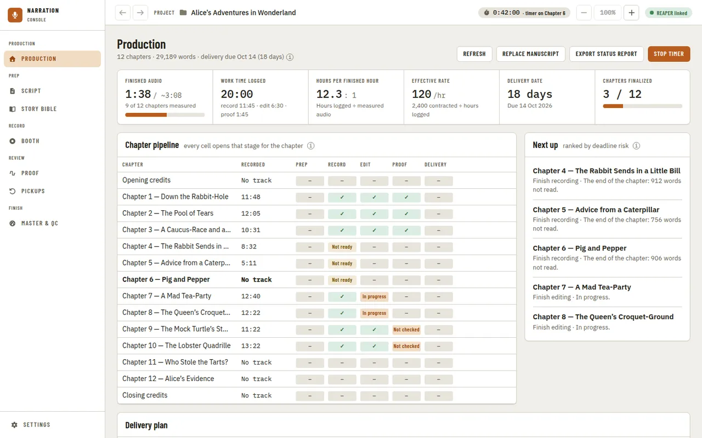
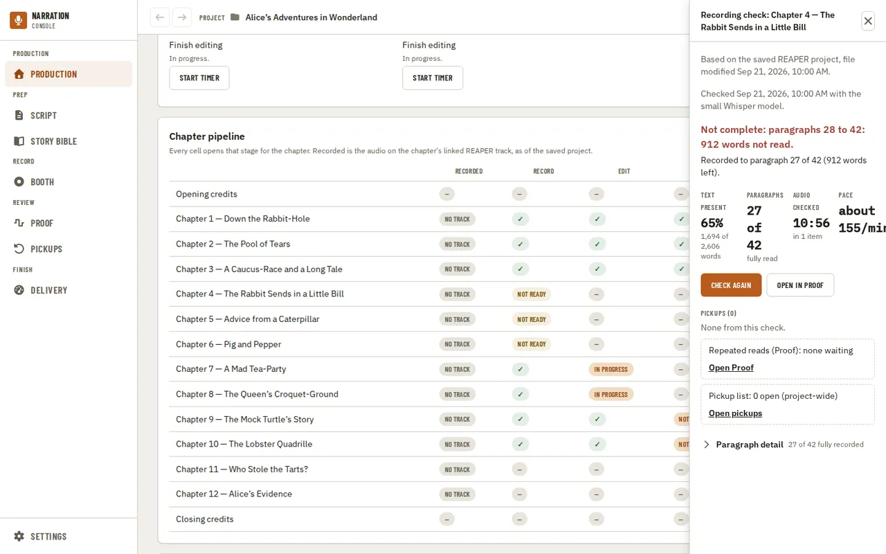
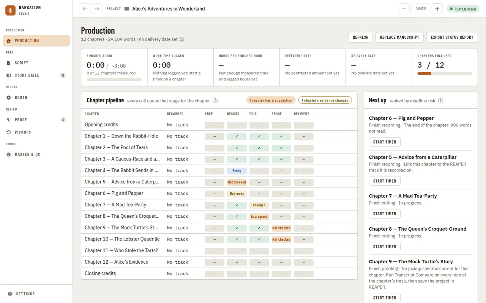
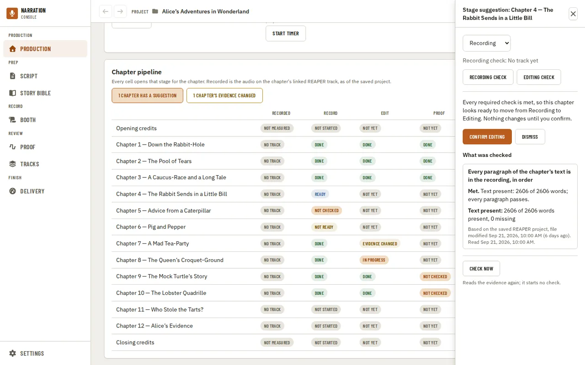
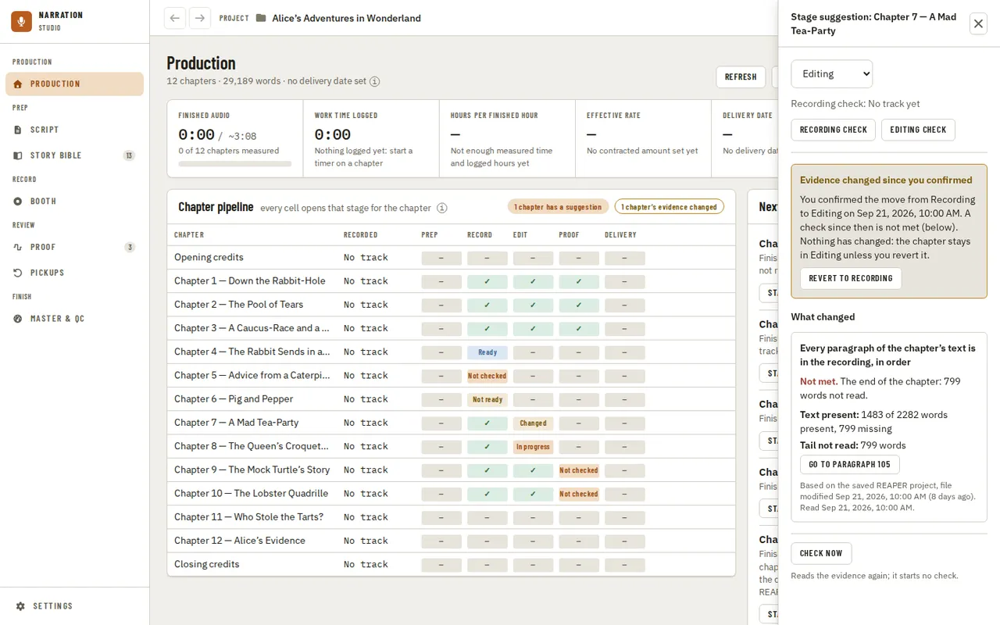
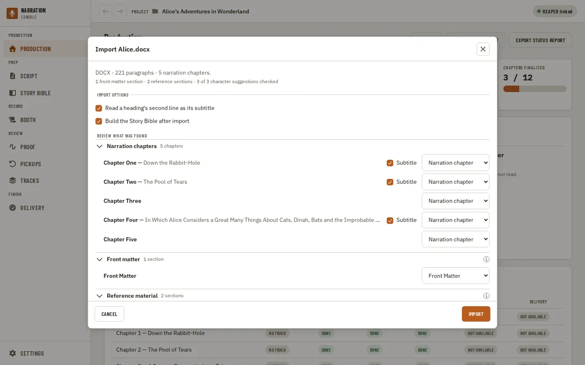
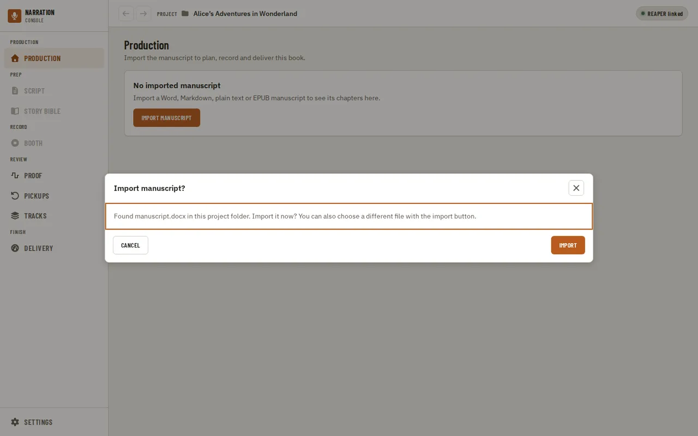
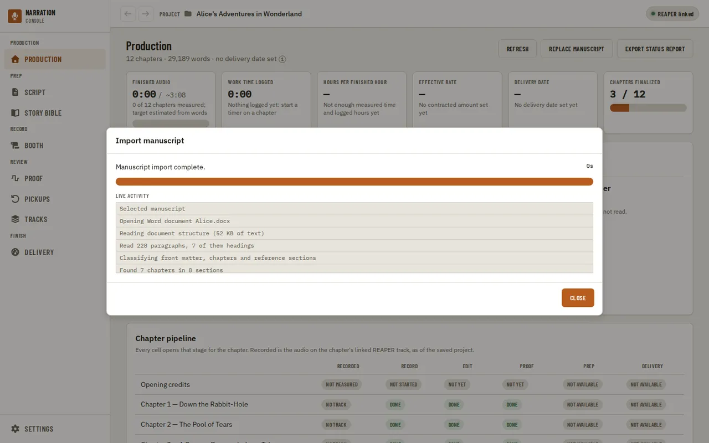

[Using the app](README.md) › Production

# Production

Production is the page a project opens on, the first item in the navigation. It answers "am I on
pace?" for the book you have open: how much audio is finished, how many hours you have worked and on
which stages, your hours per finished hour (PFH), your effective hourly rate, how far away the
delivery date is, and which chapters to work on next. Its **Chapter pipeline** has one row per
chapter and one column per stage, and every cell opens that stage for the chapter: its track, its
recording check, its stage suggestion, its editing check or its Proof view.

The subtitle names the book's chapters, words and delivery date ("12 chapters · 29,189 words ·
delivery due Oct 14 (18 days)"). Every figure comes from two things only: hours you logged with the
stage timer, and audio the app measured on each chapter's confirmed REAPER track. Nothing is
estimated from the word count except the target runtime beside **Finished audio**, which says it
is one. A figure with nothing honest to work from shows a dash (—) and says why, rather than 0. The
"i" beside the subtitle says the same.

With no manuscript imported yet, the page is the import: **Import manuscript** opens the file
picker (see [Importing the manuscript](#importing-the-manuscript)). Once there is one, **Replace
manuscript** sits in the page header with **Refresh**, which reads the figures again, and **Export
status report**.

## The figures

- **Finished audio**: the measured length of every chapter with a confirmed track, against a target
  estimated from the word count.
- **Work time logged**: every stopped timer added up, and split by stage (record, edit, proof).
- **Hours per finished hour**: hours logged divided by measured audio. It stays a dash until both exist.
- **Effective rate**: the contracted amount for the book divided by the hours logged, in your own
  currency. It stays a dash until a contracted amount is set.
- **Delivery date**: the days left until the book is due. It turns to a warning in the last week while
  chapters are unfinished, and to red once the date has passed. It stays a dash until a date is set.
- **Chapters finalized**: how many chapters are marked Finalized.

Set the delivery date and the contracted amount under [Delivery plan](#delivery-plan).

## The stage timer

Each chapter under **Next up** has **Start timer**, which starts timing the chapter's current stage. While
a timer runs, a chip in the header of every page counts its time and names the chapter ("0:42:07 ·
timer on Chapter 6"), and **Stop timer** is in this page's header. Only one timer runs at a time:
stop it before you start another. Time is logged only while you run a timer, never from REAPER
activity, and starting or stopping a timer never changes a chapter's status.

## Next up

**Next up** lists up to five chapters, in the order they most threaten the delivery date: first the
chapters whose current stage is held back by something a check found (for example, the end of a chapter
not read), then the other chapters in progress, least advanced first, then those that look ready to move
on (confirm them from their cell on the board), then the chapters not started. It sits above the board
in a narrower window and beside it in a wide one.

## Chapter pipeline

The board has one row per narration chapter, between **Opening credits** and **Closing credits**.
Its cells:

- **Recorded**: how much audio the chapter's linked REAPER track holds, as of the last save (the
  union of its unmuted items, overlaps counted once). A chapter with none says why: **No track**,
  **2+ tracks**, **Track missing** or **No project**. It never guesses from a status or a recording
  check. The cell opens the chapter's [track](#a-chapters-track).
- **Record**, **Edit** and **Proof**: **Done** for a stage the chapter has passed, **Not yet** for one
  ahead of it, and for its current stage what the [stage suggestion](#stage-suggestions) says:
  **Ready**, **Not ready**, **Not checked**, **In progress** or **Evidence changed**. A chapter not
  started yet reads **Not started** under Record, and a recording check running on it reads
  **Checking 42%**.
- **Prep** and **Delivery**: **Not available**, since no check reports them per chapter yet. Prep
  opens the chapter on [Script](script.md).

The chapter's current-stage cell opens its [stage suggestion](#stage-suggestions). The other Record,
Edit and Proof cells open that stage: the [recording check](#checking-a-chapters-recording), the
[editing check](tracks.md#editing-check), or the chapter's view on [Proof](proof.md). The board
scrolls sideways in a narrow window; use the arrow keys to move from cell to cell, and Enter or
Space to open one.

The pill at the top right of every page says whether a REAPER project is linked; see
[Navigation](navigation.md) for its states. With no REAPER project found, a line above the board
says so, with a link to [Tracks](tracks.md) when more than one project file was found.

### A chapter's track

A chapter's **Recorded** cell opens its track: what the saved project knows about the track (its
items, span, recorded length, how the link was found and when, and whether you or chapter sync
made it), and **Another track…** and **Unlink**, the same link as on the [Tracks](tracks.md) page.
A suggested track says it is not linked yet; a chapter two tracks look like says so and lists
them; a linked track no longer in the saved project says it may have been deleted or the project
saved elsewhere.

When the panel knows the chapter's track, it can play that track's recorded audio right there -
Play/Pause and skip 30 seconds back or forward - and **Select in REAPER** brings the track into
view in REAPER itself. Selecting is an experimental REAPER action ([Settings](settings.md)) and
changes nothing else: no undo point, and REAPER's own selection is all it touches.

**Remove from recording…**, under **Chapter**, takes a mis-imported heading (a part title, an
epigraph, or front matter that was read in as a chapter) out of the board, the totals, the reader
and the Booth. Choose **Not a chapter** to hide it from navigation too, or **Front matter** to keep
it in the manuscript's navigation without recording it. Nothing is deleted - its text stays in the
manuscript and its track link is cleared - and the last narration chapter can't be removed. A
removed chapter is listed under **Removed from recording**, below the board, with **Restore** to
bring it back with its status and any notes intact.

### The credits rows

**Opening credits** and **Closing credits** are not chapters, but the first opening and first
closing template in [Settings, Credits](settings.md#credits), each with its own status. A credits
cell opens its row: the template's name, words and estimated length (including room tone), a
warning for an unresolved token (`[Author]` never filled in), **Open in Script**, and its status. A
missing template reads "Not set up" with a link to [Settings, Credits](settings.md#credits). The
recording check reads manuscript chapters only, so credits are not checked yet.

## Checking a chapter's recording

A chapter's Record cell opens its recording check (for a chapter still recording, its stage
suggestion opens instead, with a **Recording check** button). Nothing runs until you ask: the panel
first shows the last result, or says the chapter was never checked, and names the saved project
file it reads ("Based on the saved REAPER project, file modified ..."). Save the project in REAPER
before checking, because the check reads the saved file, not the open session.

**Check recording** (or **Check again**) transcribes the audio items on the chapter's REAPER
track with the Whisper model chosen in Settings, then compares the words with the chapter's text
in order. The progress is real, from the transcription itself; **Cancel** stops it and keeps the
items already transcribed, so the next check is quicker, and **Continue in background** closes
the work dialog while the Record cell keeps its percent ("Checking 42%"). The app tells you when
it ends, wherever you are. If the Whisper model is not installed yet, the app asks before
downloading it, as a chapter's Proof view does. A changed chapter can also be re-checked on its
own, in the background, once REAPER has been quiet for a few minutes and the app is not otherwise
busy (Settings' **Check changed chapters in the background**); pressing **Check recording**
yourself always pre-empts it.

With Settings' **Two-pass check** turned on ([Settings](settings.md)), a check instead runs a fast
first pass, then re-checks only whatever it reports missing with a stronger model: the progress
names each pass ("First pass (tiny)", then "Re-checking 3 passages (large-v3-turbo)"), and the
finished result reads "Checked ... with the tiny Whisper model; 3 passages re-checked with the
large-v3-turbo Whisper model", with each re-checked pickup marked "Confirmed missing by ...". If
the re-check model is not installed yet, the app offers the download or **Check with tiny only**,
which finishes the check with the fast pass alone rather than blocking on the download.

The result reads as a **chapter summary first**: "Passes the check", or "Not complete" naming the
one thing that fails first ("Not complete: paragraph 14: 9 words not read"), then an unread start
or end stated in plain words ("Recorded to paragraph N of M"), then the chapter's own figures
(text present, paragraphs fully read, audio checked, pace). Under that, **Pickups** lists only the
check's own interior gaps worth reading again on their own — a skipped block, a short read or
different text read — each with its paragraphs, word count, first and last missing words, where
the gap sits in the audio, and **Go to paragraph** to open the manuscript there. An unread start or
end is unfinished recording, not a pickup, so it never appears in that list. Below the check's own
gaps, **Repeated reads (Proof)** always shows the chapter's unreviewed take-review pickups —
repeated reads already recorded, waiting to be compared and kept or discarded — as a count with
**Open Proof**, or "none waiting" when there are none. Under that, **Pickup list** always shows
the proofer's REAPER pickup markers as one project-wide open count with **Open pickups**, not
scoped to this chapter, since attributing markers to one chapter's track span is ambiguous when
chapter tracks share the timeline. It reads "open REAPER to count" instead of a number when REAPER
is not running. **Paragraph detail** stays folded by default. **Open in Proof** opens the
chapter's view on [Proof](proof.md). Misreads, false starts, retakes and a spoken chapter title
never count against you. The check changes nothing: it never edits the project or moves a
chapter's status.

A result goes **out of date** when the saved project changes under it (an item added, removed,
trimmed, moved, muted or switched to another take, an audio file changed) or the chapter's text
changes. The panel says which, keeps the old counts labelled as from then, and offers
**Check again**; only the changed items are transcribed again.

When a chapter cannot be checked, the panel says why in plain words and where to fix it: a
chapter that is not linked to its REAPER track gets the track picker right there, a missing
project file points to [Tracks](tracks.md), and a missing Transcript Compare tool points to
[Settings](settings.md).

## Stage suggestions

The board suggests when a chapter looks ready for its next stage, from evidence the app already
has, and never changes a status on its own. A chapter in Recording is suggested for Editing when
its current recording check finds every paragraph of its text in the recording, in order (misreads
allowed). A chapter in Editing is checked against its [editing check](tracks.md#editing-check):
empty space, clicks and breaths still to trim. Every one of a stage's checks must be met before a
suggestion appears — until clicks and breaths are validated on a labeled corpus, an Editing
chapter reads "Can't tell yet" rather than suggested, even with no empty space left to trim.
Proofing has no check yet, so chapters there get no suggestion. Missing evidence never counts as
done: a chapter nobody has checked reads **Not checked**, not ready.

Chips above the board say how many chapters have a suggestion and how many have evidence that
changed since you confirmed them; a chip opens the first of those chapters. On the board, the
chapter's current-stage cell reads **Ready**, **Not ready**, **Not checked** or **Evidence
changed**.

The current-stage cell opens the chapter's stage at the side of the page. At the top is its
**status**, which you can always set by hand, the state of its recording check, and **Recording
check** and **Editing check**. Under that is the suggestion: the verdict in a sentence, each check
with its state and reason, the facts behind it (the text present, each missing region with **Go to
paragraph**), and the saved REAPER project it was read from with how old that file is. For a
check that cannot tell, it says what to do and offers the way there.

- **Confirm** moves the chapter to the suggested stage and records what the evidence was; it then
  reads "Confirmed" with **Revert**, which moves it back. **Dismiss** hides the suggestion until
  the evidence changes.
- **Evidence changed since you confirmed**, with **Revert to Recording**: a check after you
  confirmed found text missing. Nothing moves until you revert; an edit alone (which changes the
  audio, as editing does) never raises it.

The suggestions are read again when the page opens, when a recording check ends, when you change a
status yourself, and when you switch back to the app after saving in REAPER (throttled, so
switching back and forth does not read every time), so nothing asks you to press anything. If a
read fails, the reason appears above the board with **Try again**, which only reads the evidence
again; it never starts a check. The stage's own **Check now** does the same. If the evidence
changed while you were looking, Confirm and Dismiss refuse and say so, and the suggestions are read
again.

## Delivery plan

**Delivery plan**, at the bottom of the page, holds the book's delivery date (written `YYYY-MM-DD`) and the
contracted amount (a number in your own currency). Leave either empty for none. **Save date and amount**
saves both and updates the figures above; an impossible date or an amount that is not a number is refused
and nothing is saved.

**Milestones** are dated checkpoints with an optional note. **Add milestone** adds an empty one, and **Add
the ACX 15-minute checkpoint** adds ACX's checkpoint as an ordinary milestone for you to date, edit or
remove. The app names the checkpoint but does not check ACX's approval process. **Save milestones** saves
the whole list; one with no name or no real date is refused, and nothing is saved.

## Status report

**Export status report**, in the page header, opens the status report. Its own **Export status report**
writes an HTML page anyone can open and a JSON file with the same figures shown on the page: hours by
stage, hours per finished hour, the delivery date and milestone status, and how many chapters fall into
each readiness. Both files go into this project's `narration-utils/production/reports` folder, under a
name built from when you exported it, and an export never overwrites an earlier one.

The contracted amount and effective rate are left out unless you tick **Include the contracted amount and
effective rate**: a status report is often the one thing you hand to someone else — a publisher, a
collaborator, a rights holder checking on progress — who has no need to know what the book pays.

## Importing the manuscript

Importing (or replacing) the manuscript opens a confirm dialog previewing the detected format,
paragraph count, and proposed chapters before anything changes. Each section is listed with its
subtitle after the title ("Chapter One — Down the Rabbit-Hole") when the heading had one, so you can
check that the importer split the title from the subtitle where you meant it to; a long one is cut
short in the row, and hovering it shows the whole line. If a heading's second line is not really a
subtitle, clear that row's **Subtitle** box: a title that was wrapped onto two lines is joined back
together ("The Girl Who Fell Through the Ice"), and in a plain-text file a line such as an epigraph
goes back into the chapter's text so it is narrated (the row says it "is read as text"). The
**Read a heading's second line as its subtitle** option in Import options does the same for every
row at once; a row you changed by hand keeps your choice.

The message at the top says what was found: the format, the number of paragraphs and of narration
chapters, then how many front matter and reference sections, character suggestions and repairs the
importer made. Below it the sections are grouped by what each will be: **Narration chapters**,
**Front matter** and **Reference material**. Change a row's kind and it moves to its new group at
once, and the counts follow. The small "i" next to Front matter and Reference material says what
that kind is left out of (the audiobook totals and Proof, and for reference material the chapter
list too) and that it stays readable in the manuscript. Groups that need a decision start open, and
long lists of chapters the importer got right start closed; open or close any group with its
heading. The character suggestions have Select all and Select none. If the importer had to
repair a heading (a title and a subtitle that were run together), the repairs are listed at the
end. The **Import options** group holds the subtitle option, the choice to build the Story Bible
after import, and, for a Markdown file, the chapter heading level.

Every dialog in the app can be used from the keyboard. Focus starts inside the dialog (on its
message, outlined when you opened it with the keyboard), Tab and Shift+Tab stay inside it, and the
page behind is hidden from a screen reader until it closes. Escape declines a confirm, and focus
returns to the button that opened it. Clicking the dimmed background never dismisses a dialog,
so a stray click cannot discard a decision, and a running job (such as an import) ignores Escape
until it has finished. The red confirm button marks an action that destroys data. A step that
cannot be cancelled (rebuilding the Story Bible, or an import while it writes to the project) says
so at the top of its dialog, offers no button while it runs, and shows Close when it finishes.

If the project folder contains a file named `manuscript.docx` or `manuscript.md` and nothing has
been imported yet, the page asks whether to import it. It is only ever an offer — nothing is
imported until you agree, and declining keeps it quiet for the rest of the session. **Import
manuscript** is always available to pick a different file.

Once you confirm, importing runs in the background and reports what it is actually doing — copying
the source into the project, writing the manuscript, adding checked characters to the Story Bible —
in a live activity log, so the progress bar and log always match the real work.

Once a manuscript is imported you can read it on the [Script](script.md) page.

The first time a project with an imported manuscript loads, and again right after an import
finishes, the page asks you to **Set up the credits** if the opening and closing credits still have
unresolved tokens. The dialog is prefilled from whatever the manuscript's own title page and
copyright line already say, with the source of each guess shown underneath; a field with nothing
detected starts empty. Save only writes the fields you confirm — nothing already set in
[Settings, Credits](settings.md#credits) is changed. **Not now** leaves it for this session;
**Don't ask for this project** stops it until you replace the manuscript. Either way, a banner
stays above the figures — and above the [Script](script.md) page's own Opening credits
card — with **Fill in** to reopen the same dialog for as long as a token stays unresolved.

---

[← Navigation](navigation.md) · [Index](README.md) · [Script →](script.md)
