[Using the app](README.md) › Proof

# Proof

Proof gathers what the app's checks found into one list, so you can work through them in one place:
the differences a comparison heard between the script and the recording (see
[Comparing the recording with the script](#comparing-the-recording-with-the-script)), the
[Story Bible](story-bible.md) entries and pronunciations that need a look, the lines you recorded
more than once ([pickups and duplicates](#pickups-and-duplicates)), and the delivery rules your
measured files did not meet ([delivery checks](#delivery-checks)). Each finding waits in
the list until you accept, dismiss or defer it, and your decision is kept with the project. Running a
check again keeps your decision on a finding whose evidence did not change.

The line under the title counts the latest run's findings by status: to review, accepted, dismissed
and deferred.

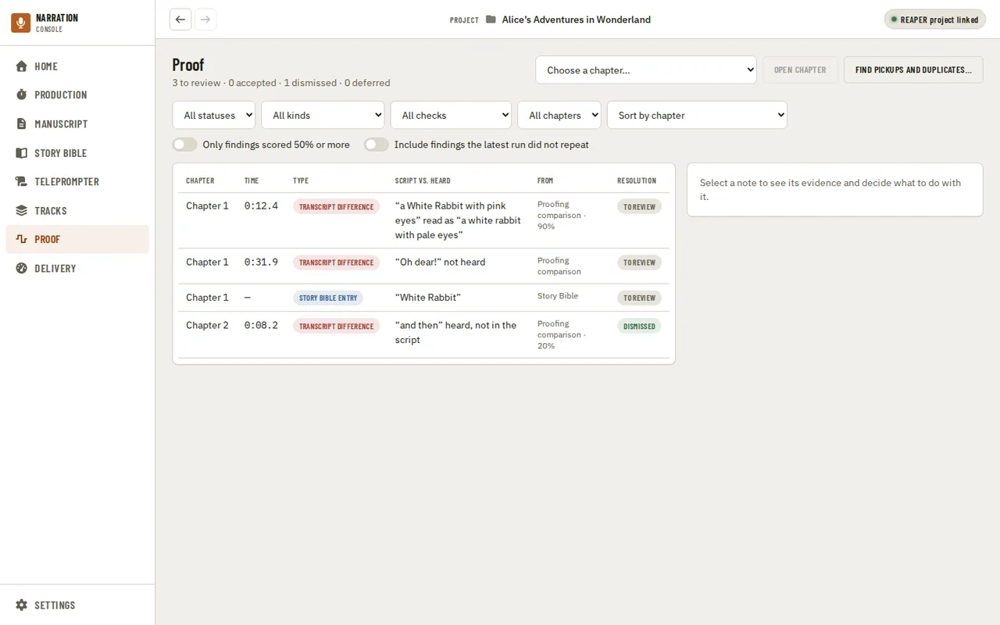

Proof is always in the navigation, even before a manuscript is imported. Until a check has found
something, it says **No notes yet** and where findings come from.

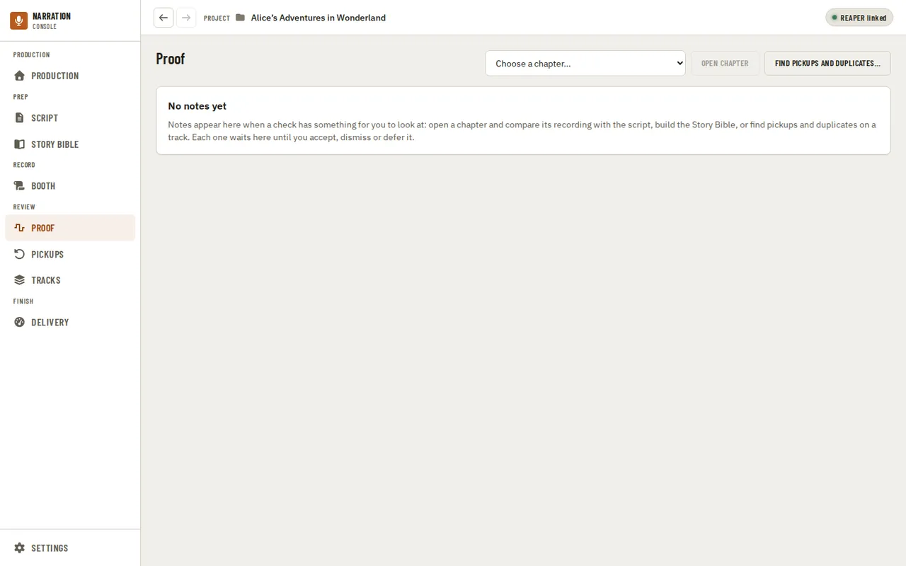

Under the page title, **Chapter to open** picks a narration chapter and **Open chapter** opens its
[chapter view](#the-chapter-view) directly, without going by way of a note — useful when you want to
listen to a chapter that has nothing to review yet.

## Filtering and sorting

The row of lists above the findings narrows them by status, by kind of finding, by the check that
found it, and by chapter, and chooses the order: by chapter, by project time, by confidence (lowest
first, so the least certain come up first) or by severity (most serious first). Only the kinds,
checks and chapters that have findings are offered.

- **Only findings scored 50% or more** hides the findings a check was less sure of. A finding with no
  score at all (the check had nothing to measure) is hidden too.
- **Include findings the latest run did not repeat** brings back findings from an earlier run that
  the latest one no longer produced. They are kept, marked "not in the latest run", so a decision you
  made on one is never lost.

**Clear filters** puts every filter back to showing everything, and keeps the order. A long list shows
its first 100 findings; **Show more** adds the next 100.

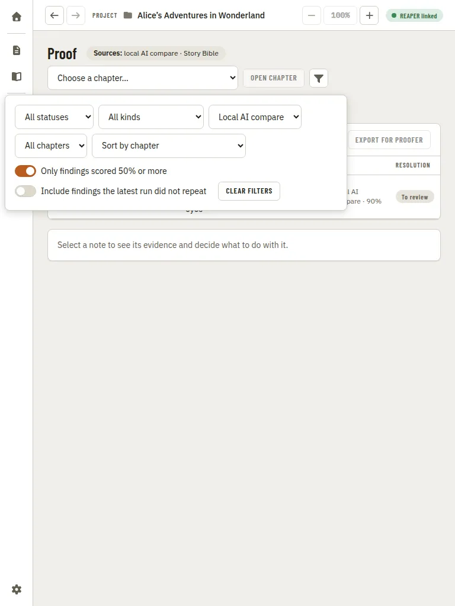

## A finding and your decision

The notes table lists Chapter, Time, Type, Script vs. heard, From (the check that found it) and
Resolution for every note. Select one to see it in full beside the list (under it on a narrower
window):

- what the script says and, for a script-versus-recording difference, what the recording has;
- the chapter, the time in the REAPER project, which check found it, and how serious it is;
- the evidence: the kind of difference (misread, skipped, extra words), the script and recording
  around it, the pause measured at its boundary, a REAPER marker already there, or, for a Story Bible
  finding, why the entry needs a look;
- its confidence, and the check's reason for it.

**Show in manuscript** opens the [Script](script.md) at the finding's line (it needs an
imported manuscript), and a Story Bible finding also has **Open in Story Bible**. A delivery check has
**Open in Delivery** instead (see [Delivery checks](#delivery-checks)). **Open chapter view** opens
the finding's [chapter view](#the-chapter-view) beside it, to listen against the script.

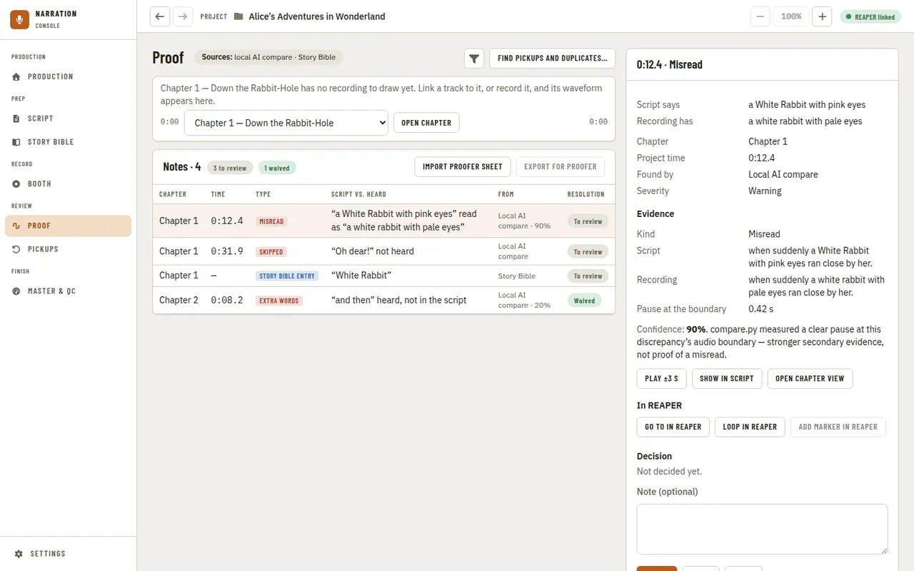

**Accept**, **Dismiss** or **Defer** records your decision at once, with the note if you wrote one (up
to 2,000 characters). The page says it was saved, and the list and the counts update. **Reopen** puts a
decided finding back in the list to review.

A decision is always made on the evidence you are looking at. If the check ran again after you opened
the finding and the evidence changed, the decision is not saved: the page says so, shows the latest
version, and keeps your note, so you can look again and decide.

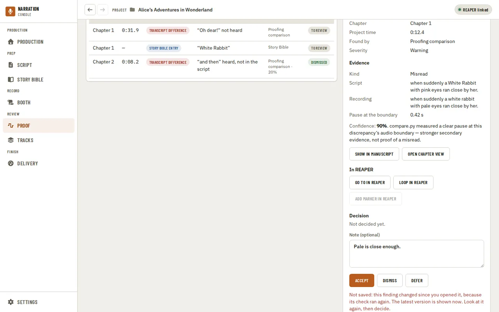

## Going to a finding in REAPER

A finding from a script-versus-recording comparison has an **In REAPER** row. It works when you
opened the app from the Narration Utils action in REAPER and REAPER is still running; the app checks
every few seconds and sends REAPER nothing until you press a button.

- **Go to in REAPER** selects the finding's item, and only that item, and puts the edit cursor on the
  spot. The page says where the cursor went.
- **Loop in REAPER** plays the finding with two seconds either side, over and over: it sets the time
  selection and the loop points to that window, turns repeat on and presses Play. Loop on another
  finding moves the loop there.
- **Stop loop** appears while a loop is playing, on every finding. It stops playback and puts back
  your own time selection, loop points and repeat. Anything you changed yourself while the loop
  played is kept.

None of these edits your project or adds an undo step. A finding is found by its REAPER item, never by
its old project time, so it is still found after you move the item.

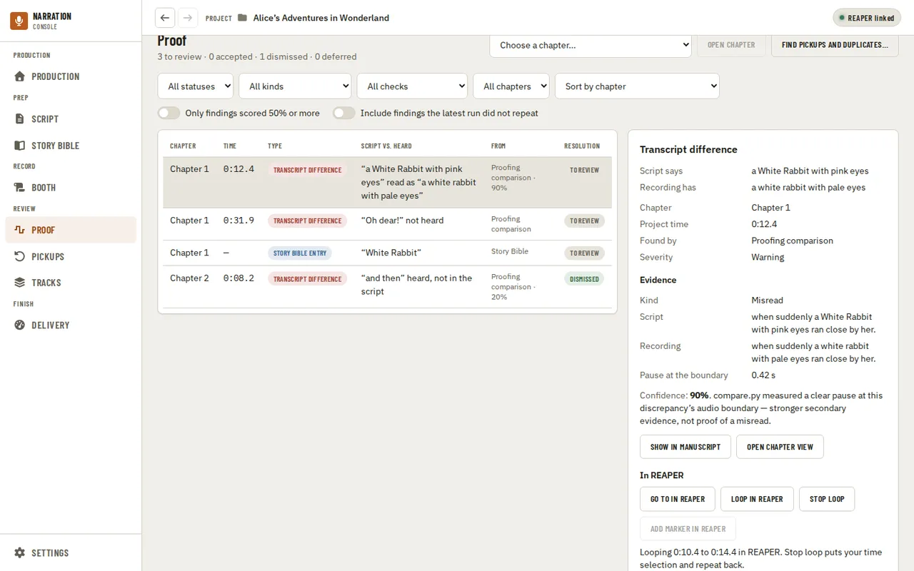

- **Add marker in REAPER** puts one take marker on the finding's spot, after you confirm. It is off
  until you accept the finding. The marker is named like the ones a chapter's [comparison
  export](#comparing-the-recording-with-the-script) adds, for example
  `MISREAD: 'pink eyes' as 'pale eyes'`, so Export markers does not add it a second time. If the take
  already has a marker of the same kind there, nothing is added and the page says so. This is the only
  button here that changes your project, and one Undo in REAPER removes the marker.

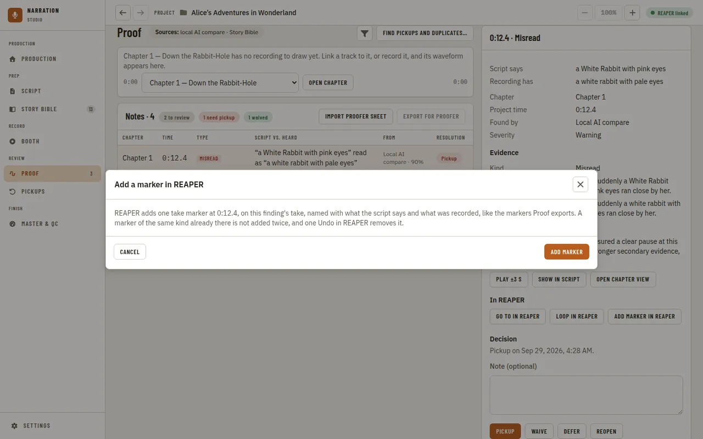

When REAPER cannot do it, nothing in REAPER changes and the page says why:

- **the finding's audio changed.** The item was deleted, lost the take the check heard, or was
  trimmed so the spot is no longer in it. Run the check again to find it where it is now.
- **REAPER is recording.** Stop recording first.
- **the script in REAPER is older than the app.** Import it again from the app's REAPER folder.
- **the finding came from an older check** that did not record its REAPER item. The buttons are off;
  run the check again.

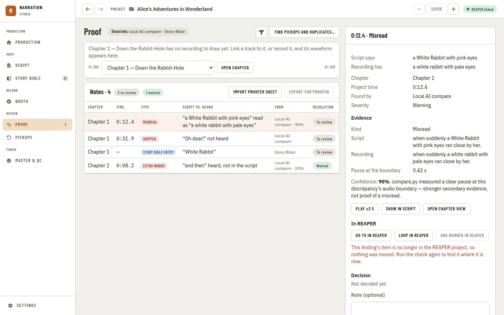

When REAPER is not connected, Go to, Loop and Add marker are off and the reason is under them. If you opened the
app on its own, open it from the Narration Utils action in REAPER instead. If REAPER was closed or the
action stopped, start it again; the buttons turn back on by themselves. A Story Bible finding has no
audio, so it has no REAPER row.

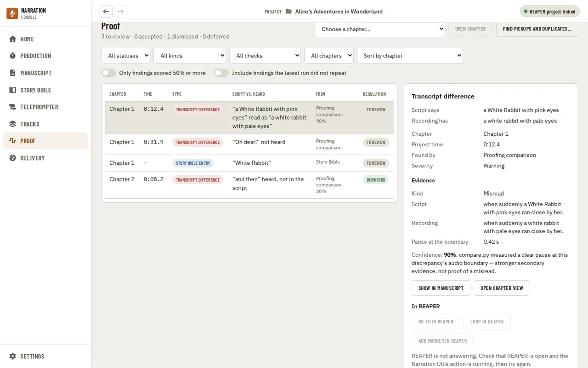

## Pickups and duplicates

**Find pickups and duplicates…** beside the page title looks for lines you recorded more than once on
a track: a restart after a stumble, a pickup of part of a line, an exact copy, or a near-identical
re-read. Choose the **Track to scan**. To include pickups recorded somewhere else, choose **Also look
for pickups on** a pickup track, or on a stretch of the timeline (type the times as `30:00` or in
seconds). If the project's settings name a pickup track or stretch, the dialog starts with it chosen.
Nothing in REAPER changes while it scans.

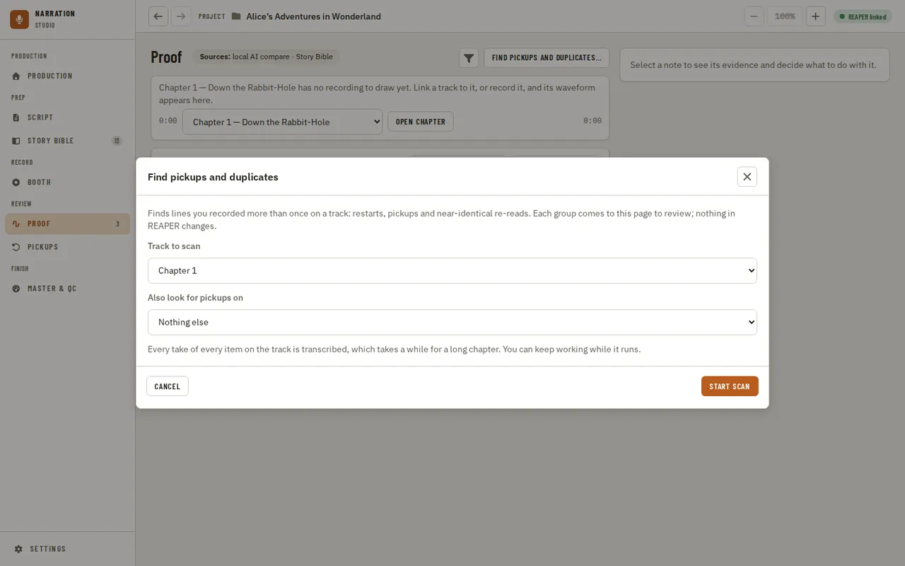

**Start scan** transcribes every take of every item in scope, which takes a while for a long chapter.
The bar and the stage under it are the scan's own. **Cancel** stops it and keeps nothing it found;
**Continue in background** closes the window and the scan goes on, and the app says when it has
finished. Opening the dialog again while it runs shows its progress.

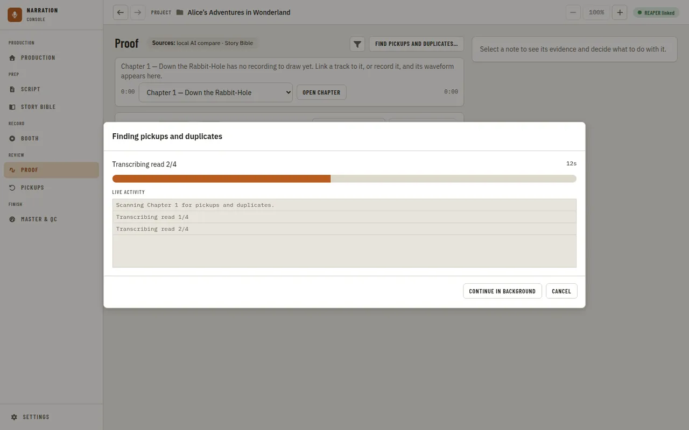

When it finishes, the list shows what it found, filtered to **Take review** (**Clear filters** brings
everything back). Each group is one part of the script you read more than once: the list says what kind
it is and how many reads it has, for example "Partial pickup: 2 reads of sentences 4–8".

Select a group to see its **Reads**: each read's audio file and where in it the read is, whether it
covers the whole part of the script or only some of it, and how many of its words match the script.
Nothing ranks one read over another; listen and choose.

- **Go to** and **Loop** on a read work like the [REAPER buttons](#going-to-a-finding-in-reaper) above,
  for that read's own item. REAPER plays the item's active take, so to hear a read that is another take
  of its item, use Audition.
- **Audition reads** plays two reads side by side (Read A and Read B, each with Play and Loop), with a
  little audio before and after. It plays each read straight from its file, so REAPER's FX, gain and
  edits are not applied and it can sound different from the project. Nothing in REAPER changes.
- **Add as take…** is on once you accept the group. Choose the **Target item** (the item the take is
  added to) and the **Candidate read** (the read that becomes the new take); nothing is chosen for you.
  **Create take** adds it in REAPER: the item's active take and length stay as they were, and one Undo
  in REAPER removes the new take. You choose which take plays in REAPER yourself.

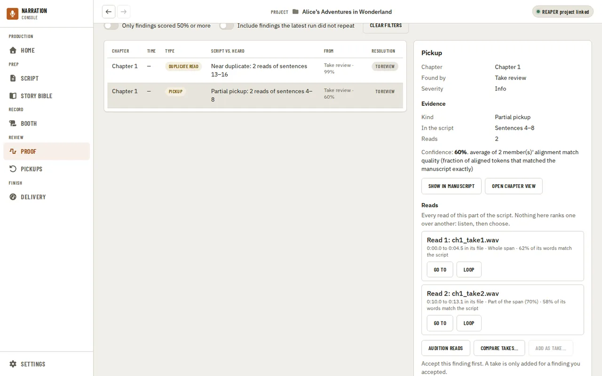

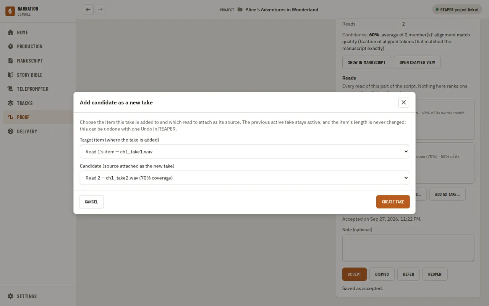

Dismiss a group that is a line repeated on purpose. Scanning the track again keeps your decision on a
group whose reads did not change.

### Comparing takes

**Compare takes…** under a group's reads sets the reads side by side over the same part of the script.
It transcribes each read again and measures its audio, so it takes a while; like the scan, it shows its
own progress, **Cancel** keeps nothing, and **Continue in background** lets you keep working. Before it
starts, each read is checked against the saved REAPER project: a read whose item was moved, trimmed or
removed since the scan, or whose file is missing, is listed with the reason and left out. Save the
project in REAPER first if you changed it.

When it finishes, the comparison opens, and the list is filtered to **Take comparison**. It has two
parts:

- **How each read reads the script.** Every word of that part of the script, as each read said it. A
  word read as something else is underlined with a wave, a word left out is struck through, and a word
  the read never reached (it started late or stopped early) is dotted. Under the words, each place the
  read departs is listed with what was heard and when, for example "Misread “very” as “remarkably” at
  0:10.8". A read that none of these words were heard in is not compared.
- **The audio of each read.** One row per kind of evidence, one column per read: clipping, room noise
  (the quietest half-second, lower is quieter), level against the items either side of it, length and
  speaking rate, and the pauses between its words. Each is measured from the read's own file, before
  REAPER's FX and edits. A figure that cannot be measured says why (for example, a pickup on a track of
  its own has no neighbours to compare its level with, and only WAV files are measured).

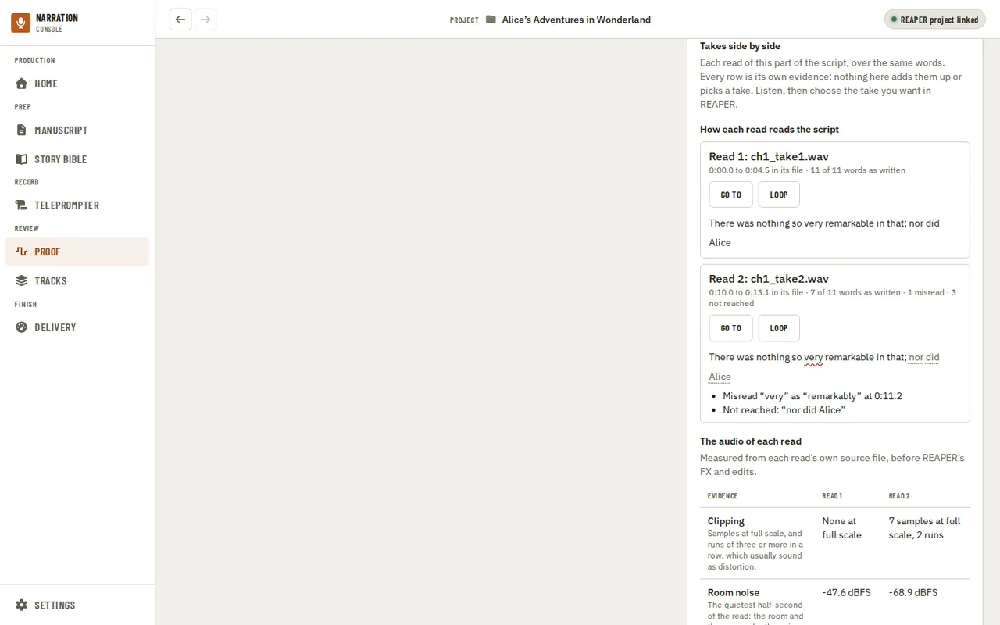

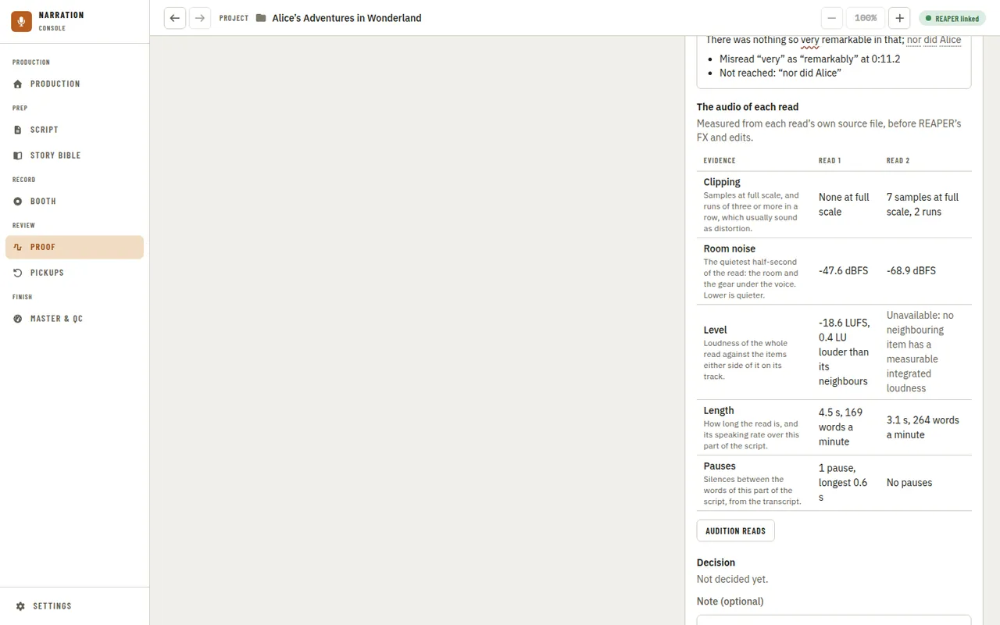

Nothing adds the rows up or picks a take: a read can be word for word but noisy, another clean but with
a misread, and which matters is your call. **Go to**, **Loop** and **Audition reads** work as they do on
the group. When you have chosen, make that take active in REAPER yourself; the app never changes which
take plays. Accept, dismiss or defer the comparison like any other finding; comparing the same group
again replaces it, and keeps your decision only if the measurements did not change.

## Delivery checks

When you check rendered files on [Master & QC](master-and-qc.md), each rule a file did not meet, and
each value the app could not measure, becomes a **Delivery check** here: one per rule per file, found by
**Delivery measurement**. The list names the file where other findings name a chapter, and says the
rule, the value and how it missed ("RMS −24.1 dBFS, below the minimum of −23"). Selected, it shows the
rule, what the profile requires, what was measured and which profile judged it. A rule's advice (a true
peak above ACX's advice, for example) stays on Master & QC.

A delivery check has no line in the manuscript and no item in REAPER, so **Open in Master & QC** takes its
place: it opens Master & QC on that file, rule by rule. If the file is not in the last measurement
(the app keeps the last measurement until it closes), the page says so; measure it again to see it.

Accept, Dismiss and Defer work as for every other finding, and change nothing but your decision: not
the profile and not the measurement. Your decision holds while the same audio is judged against the same
rule. After a new render, or if you change that rule's numbers in a custom profile, the check comes back
to review with your note kept. When a file meets the rule again, its check is no longer in the latest
run. Choosing another delivery profile judges the last measurement again, and the list follows it.

## The chapter view

A chapter's Proof view, at `/proof/:chapterId`, is one screen to listen to a chapter's recording
against its script, see where the recording check found a problem, and click a word to hear it again.
It has no nav item of its own; open it from a linked chapter's **Open workspace** link in the
[audio engine panel](navigation.md#linking-chapters-to-tracks) or on [Home](home.md), from the Manuscript chapter header,
from a note's **Open chapter view** above, or from [Proof's own chapter picker](#proof) at the top of
this page. A chapter has to be linked to a REAPER track first (see [Linking chapters to
tracks](navigation.md#linking-chapters-to-tracks)).

If the chapter hasn't been checked yet, the chapter view says so and offers **Check recording** — the
same check [Home](home.md) runs. There's no script or player until a check exists.

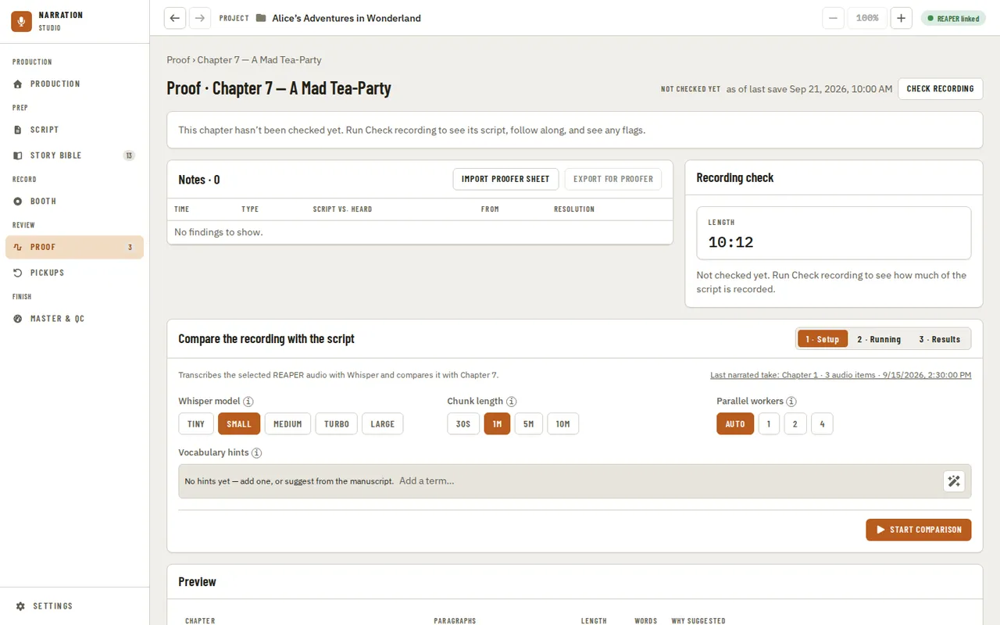

Once a current check exists, the chapter view shows the chapter's script, a transport, and the check's
flags, under the heading "Proof · <chapter name>" and a breadcrumb "Proof › <chapter>". The header names
the check's state (current, or stale if an item changed since), and **as of last save** — the chapter
view always reads the REAPER project as it was last saved, not whatever is open live in REAPER right
now.

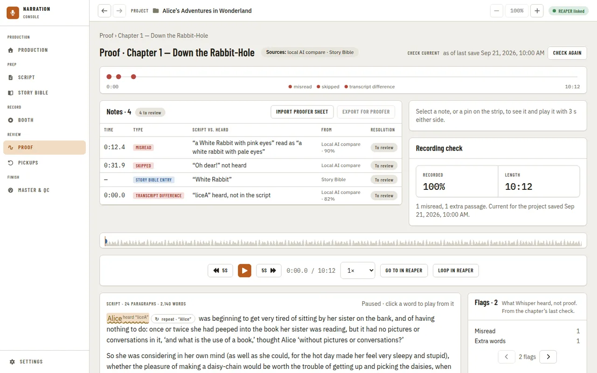

The transport plays the chapter's recorded audio in the app itself, honouring each item's trims (the
same played range REAPER uses), so it works with REAPER closed. It has play/pause, skip back and
forward 5 seconds, and a playback speed from 0.75× to 2× that keeps pitch. Space bar toggles play and
pause; the left/right arrow keys move by word and up/down by paragraph; `[` and `]` move to the
previous and next flag. **Go to in REAPER** and **Loop in REAPER** on the transport bar work as they do
on a note (see [Going to a finding in REAPER](#going-to-a-finding-in-reaper)); without a connection
they are disabled and say why, and the rest of the page works the same either way.

As the chapter plays, the word being spoken is highlighted and the script scrolls to keep up. Scroll
the script yourself and it stops following until you scroll back to the highlighted word or press
**Resume following**.

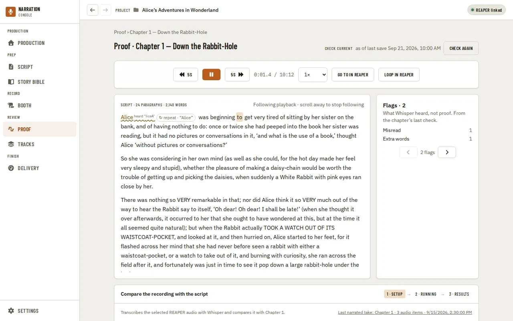

Flags mark what the last check found, in place in the text: a skipped word is struck through, a word
read short or differently is underlined, and a misread word shows what was actually heard beneath it.
A run of words the check couldn't match to anything in the script shows as a small "repeat" chip
between the words it followed. The Flags panel on the right counts each kind and steps through them
one at a time — clicking Next or Previous plays the app from that flag's word, if it has one (a
skipped word was never recorded, so there's nothing to play).

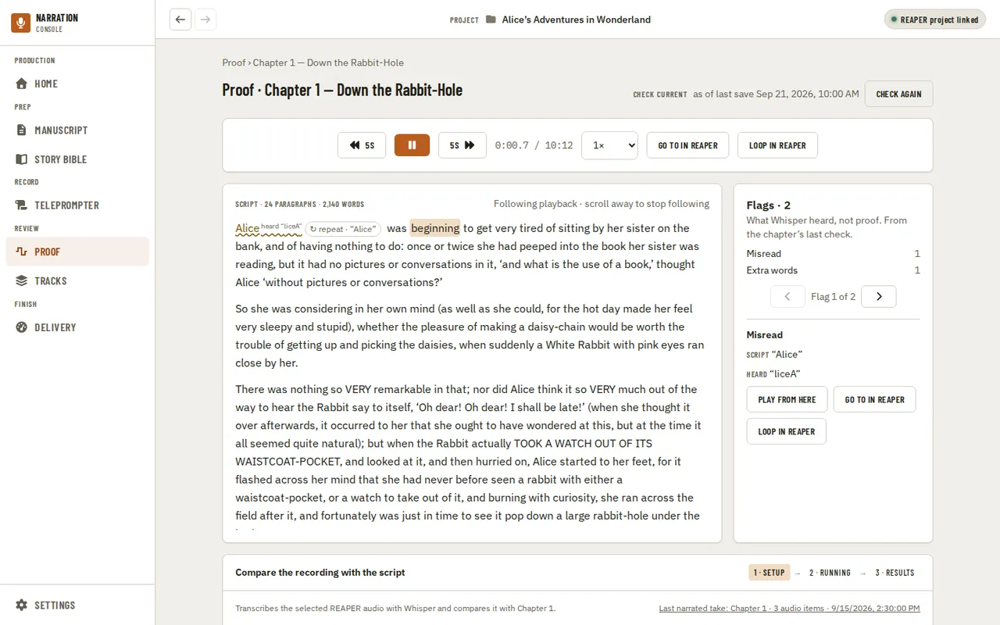

Clicking any word with a recorded time seeks the app's own player there (starting about a second
before it, so you hear it in context). A flag backed by a finding shows which check found it, and the
same **Accept**, **Dismiss**, **Defer** and note controls as on [Proof's notes](#a-finding-and-your-decision) — a
decision made here is the same decision Proof shows.

## Comparing the recording with the script

**Compare the recording with the script**, below the flags, transcribes the chapter's recording and
compares it against this chapter's text. The Setup step picks the transcription model, chunk length,
and number of parallel workers before starting a comparison.

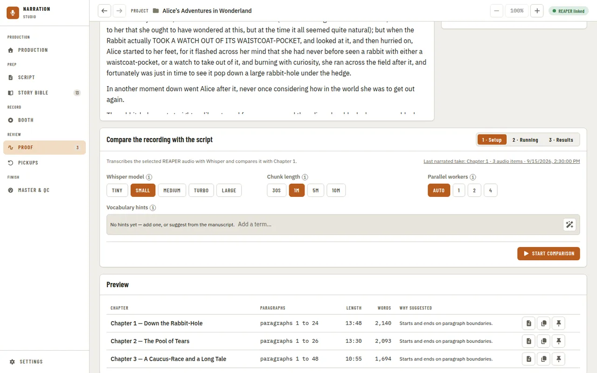

Model, chunk length, and worker count are independent selections — picking a slower, more
accurate model can force other settings to adjust (here, workers dropped to 1 because the
Large model doesn't support Auto).

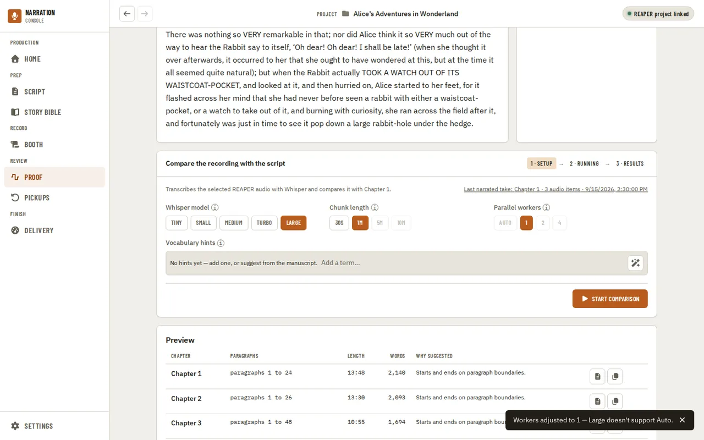

Vocabulary hints teach the transcription model unusual names it's likely to mis-hear. The pills box is
the input: type a name and press Enter or a comma to add it, click elsewhere to commit whatever you were
typing, or press Backspace in an empty box to remove the most recently added term. Pasting a list with
commas or line breaks adds every name in it at once. A name already there in any case is not added twice,
and a term over 64 characters is capped. The sparkle icon inside the box, "Suggest from manuscript",
proposes candidates from the [Story Bible](story-bible.md); accepted hints render as solid pills,
suggested-but-not-yet-accepted candidates as dashed outlines you click to accept. Names you locked or
added by hand are always offered; names the build was unsure about (Needs Review) are not, so review or
lock one to make it suggestible. The message after each click says what happened: no names found (build
the Story Bible or add entries), everything found is already accepted, the suggestions are already shown,
or how many new ones were found. If the saved hints cannot be loaded, a message says so and the page
stays usable.

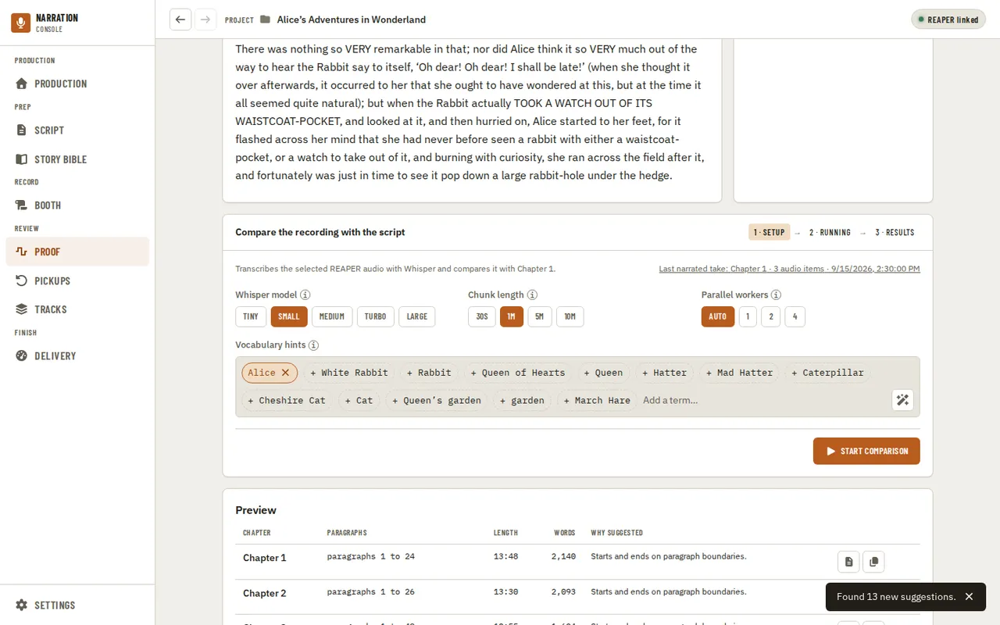

**Start comparison** needs a linked REAPER project and a connected REAPER; without either it is off,
with the reason in its place. Once it's running, its progress is real, from the transcription itself,
with **Cancel** to stop it.

Each discrepancy the run finds becomes a flag in the [Flags panel](#the-chapter-view) above — Misread,
Skipped or Extra words — instead of a table: select one to see the script and heard text side by side
inline, its marker state (**Ready to export**, **Exported**, or **Already marked**), **Show in
manuscript**, **Play recorded audio** and, for a single-word misread, **Add pronunciation
equivalence**.

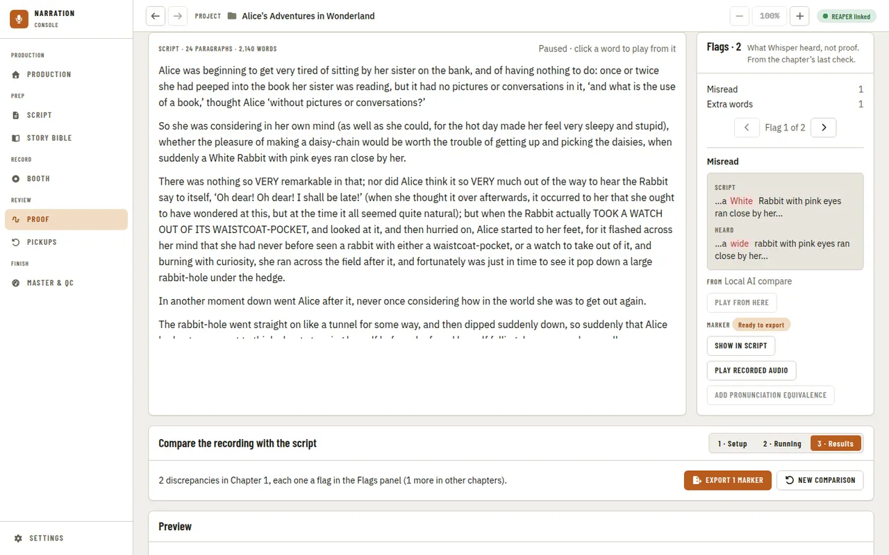

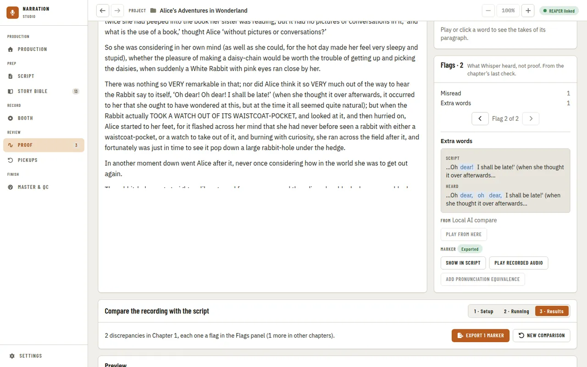

When it finishes, a summary reads "N discrepancies in \<chapter>, each one a flag in the Flags panel".
**Export N markers** adds a take marker in REAPER for each discrepancy not already marked, the same
marker [Add marker in REAPER](#going-to-a-finding-in-reaper) adds for one accepted note, so the two never
mark a spot twice. **New comparison** starts over. Without a connected REAPER, **Last narrated take:
…** reviews the last completed comparison instead, with Play recorded audio and Export off.

Leaving the chapter view while a run is under way or showing results resets the run, the same way
leaving used to reset the Proofing page's own run.

Above the compare run, the Preview panel suggests up to three five-minute excerpts from the manuscript
— one per chapter — so you don't have to scan the whole book to find a stretch worth listening to or
sharing. Each candidate lists its chapter, paragraph range, estimated length and word count, alongside
the reasons it was chosen (a mix of narration and dialogue, the Story Bible characters it touches, hard
words, starting and ending on a paragraph boundary). A candidate that falls short of the target length
even using the whole chapter says so, in words and an icon rather than colour alone. Open a candidate
in the manuscript reader, or copy its range and length to paste elsewhere; neither changes anything — a
suggestion is recomputed fresh every time you visit the page, never applied, exported or stored.

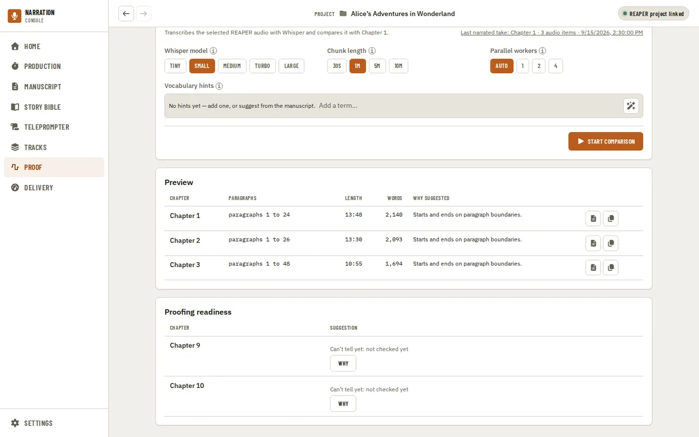

Pin a candidate to settle on it: the pin icon on a row keeps that window, shown in its own "Pinned
preview" section below the table with the same evidence, and the pin button on its row turns into
"Unpin". Move its edges by one paragraph at a time with the Start and End + and − controls — extending
or shrinking is disabled, not hidden, once an edge already reaches the chapter's own boundary or the
range is down to one paragraph. There is one pin per book: pinning another candidate replaces it. If the
manuscript text under a pinned paragraph changes since it was pinned or last adjusted, the section says
so in words and an icon, alongside its still-recomputed length and evidence; if a re-import drops the
paragraph entirely, the section names that instead and offers only to clear it. Clearing the pin (the ✕)
removes it; like everything else here, nothing is applied, exported, or ever changes the manuscript,
project, or audio.

Above the Preview panel, the stage recommendations panel lists every chapter currently in the Proofing
stage with its suggestion for Finalized: a badge if the evidence says it's ready, "Not ready" if a
pickup is still open, or "Can't tell yet" with what to check next. Confirm, Dismiss, and Revert work the
same way they do on [Home](home.md#stage-suggestions); Why opens the same evidence view, listing what
was checked (pickups from every tracked analyzer, and any delivery check the narrator turned on) and
linking a pickup straight to [Proof](#proof) or an unmapped chapter to the [audio engine panel](navigation.md#the-audio-engine-panel). A
chapter with nothing to report ("No chapter is in Proofing right now") shows that instead of an empty
table.

---

[← Booth](booth.md) · [Index](README.md) · [Pickups →](pickups.md)
