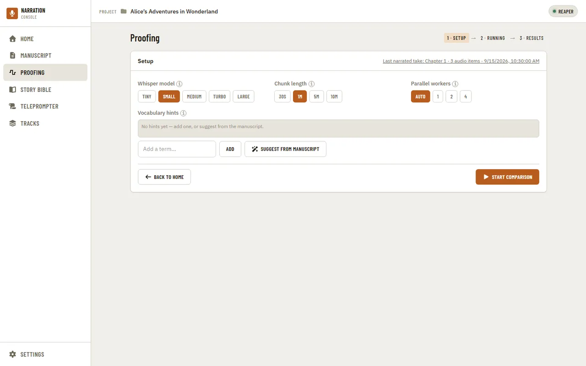
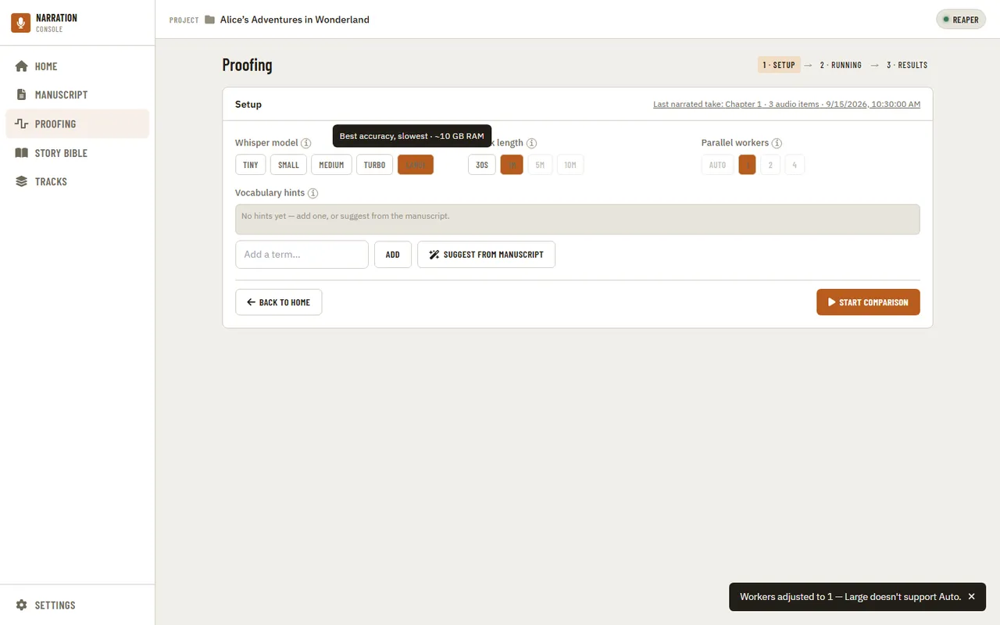
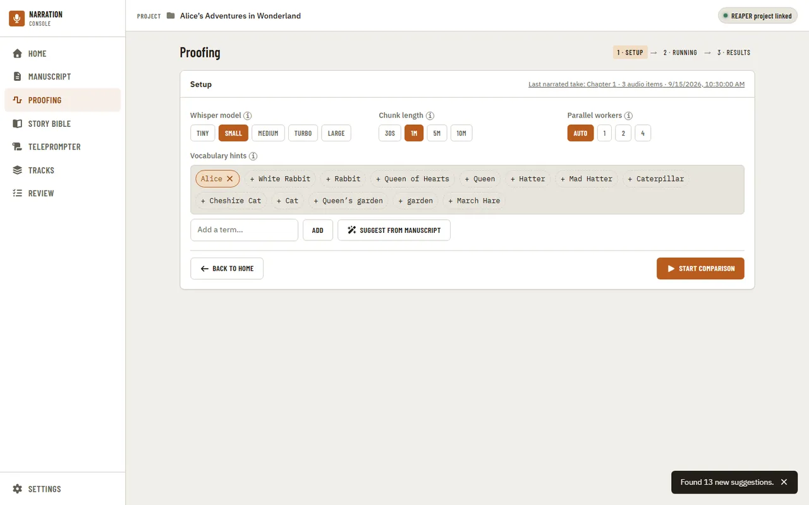
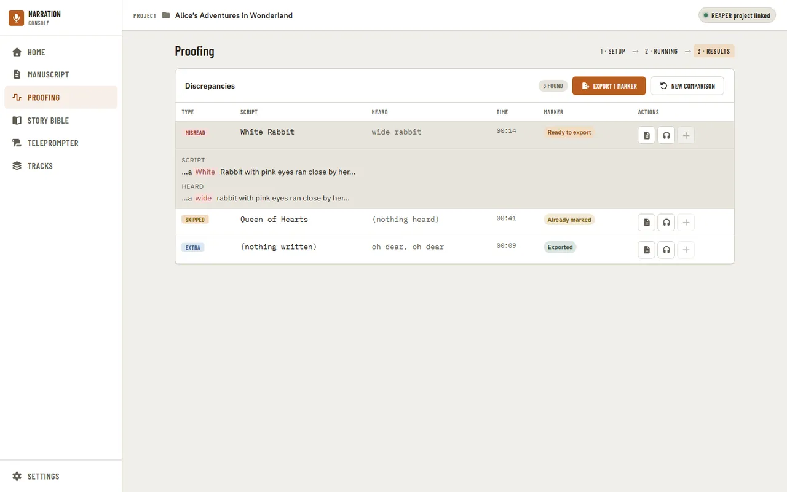
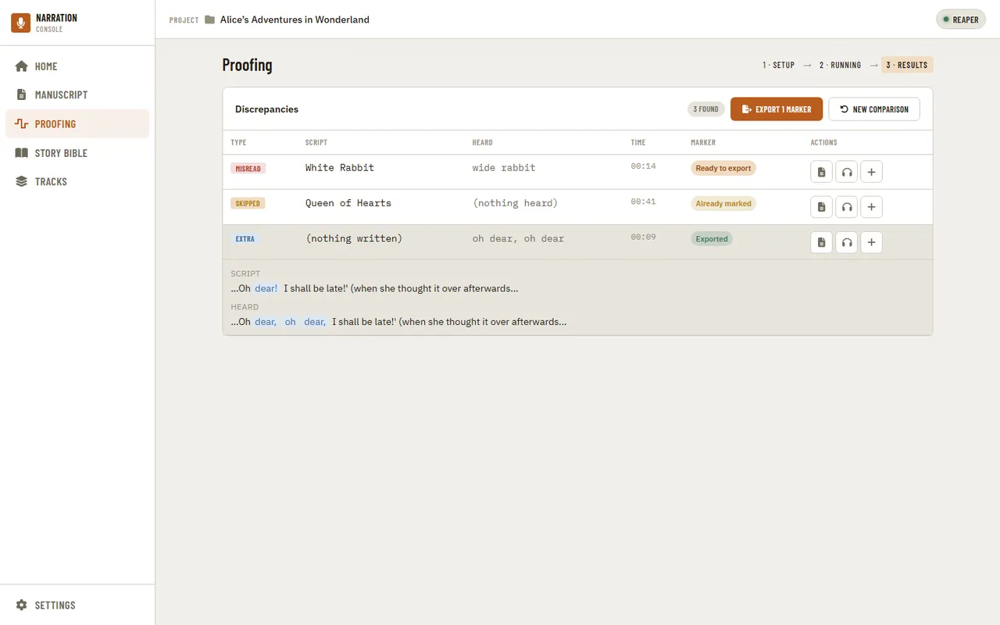

[Using the app](README.md) › Proofing

# Proofing

Proofing transcribes a recorded chapter and compares it against the [manuscript](manuscript.md). The Setup
step picks the transcription model, chunk length, and any vocabulary hints before starting
a comparison.

Model, chunk length, and worker count are independent selections — picking a slower, more
accurate model can force other settings to adjust (here, workers dropped to 1 because the
Large model doesn't support Auto).

Vocabulary hints teach the transcription model unusual names it's likely to mis-hear.
"Suggest from manuscript" proposes candidates from the [Story Bible](story-bible.md); accepted hints render as
solid pills, suggested-but-not-yet-accepted candidates as dashed outlines you click to accept.

Once a comparison finishes, the Results step lists every discrepancy between what was written
and what was heard, expandable for the full context around each one. Each row is typed —
a misread word, a skipped one, or words heard that weren't written at all (EXTRA).

---

[← Manuscript](manuscript.md) · [Index](README.md) · [Story Bible →](story-bible.md)
