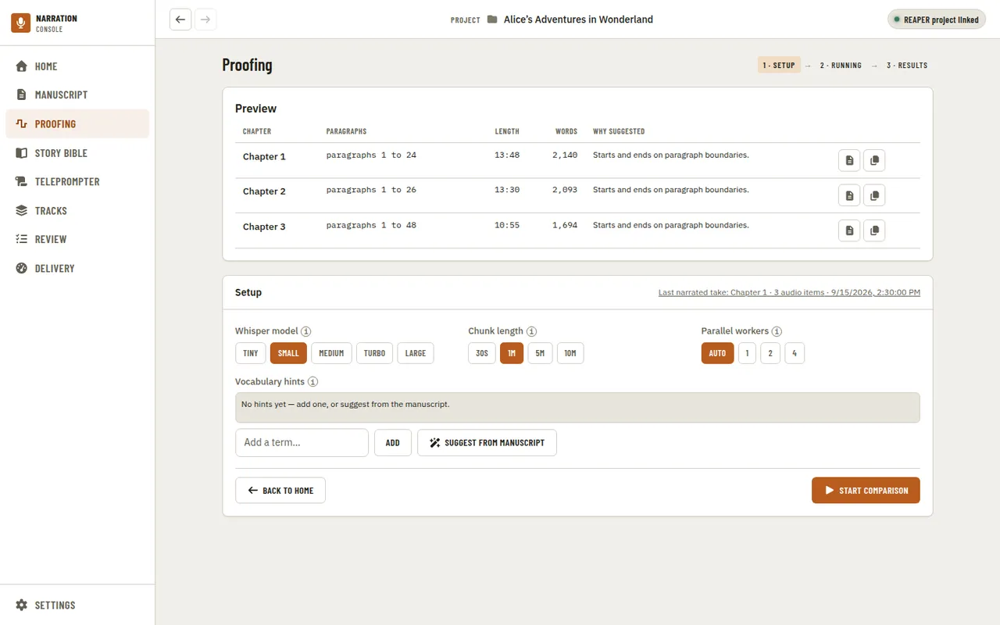
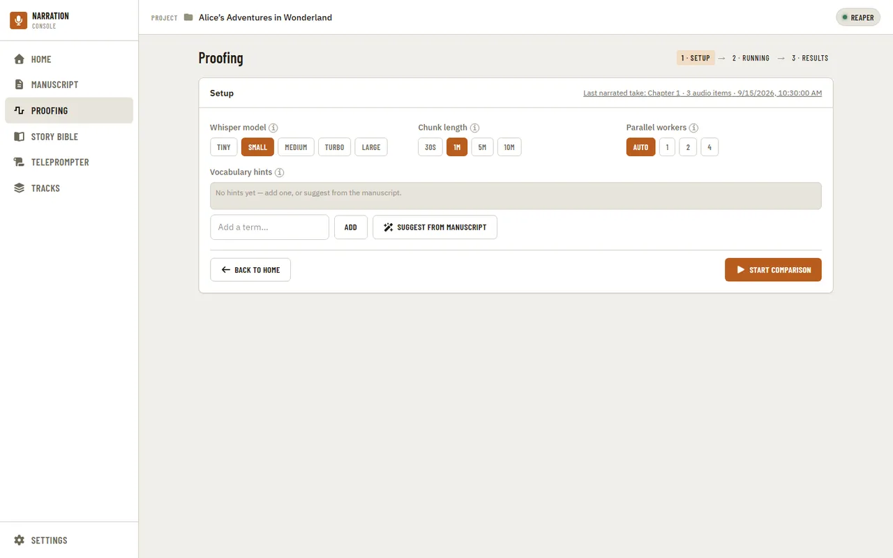
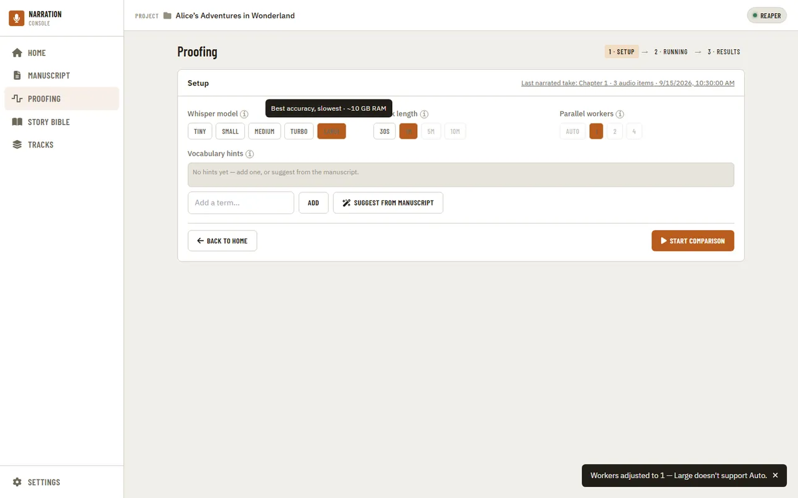
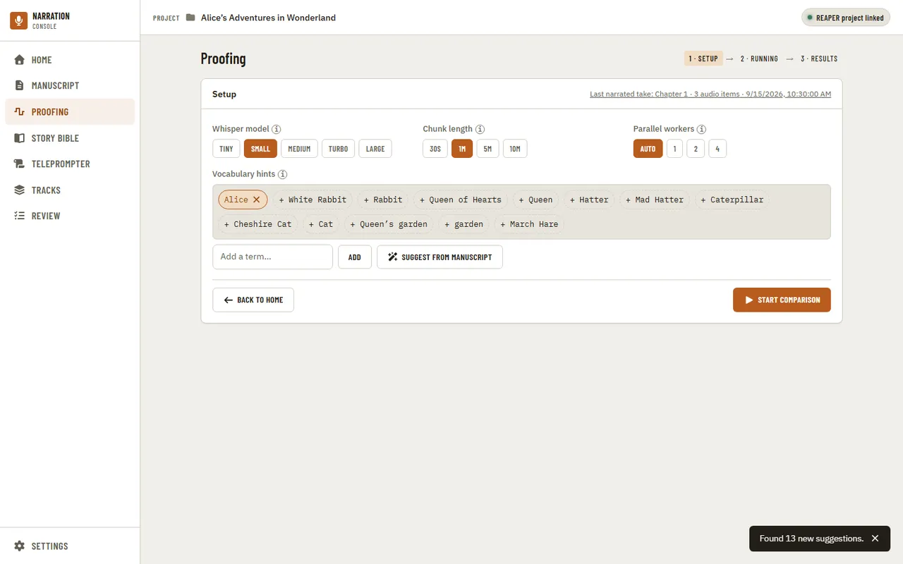
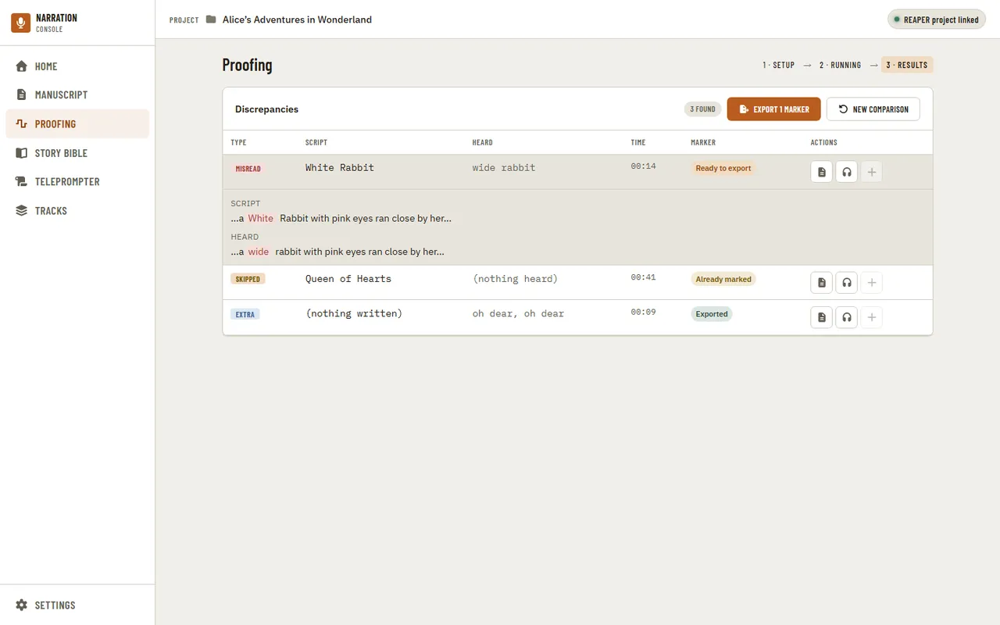
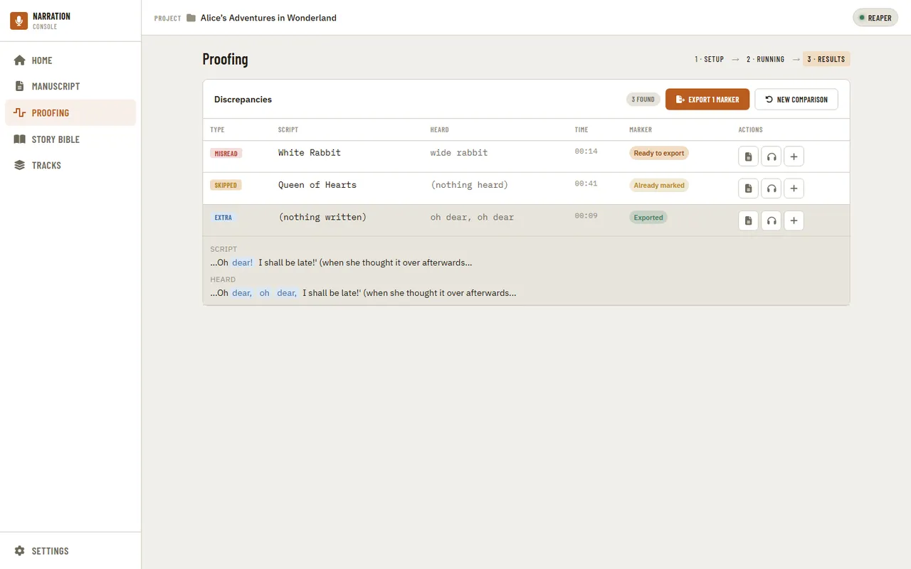

[Using the app](README.md) › Proofing

# Proofing

Proofing transcribes a recorded chapter and compares it against the [manuscript](manuscript.md). The Setup
step picks the transcription model, chunk length, and any vocabulary hints before starting
a comparison.

Above Setup, the Preview panel suggests up to three five-minute excerpts from the manuscript — one per
chapter — so you don't have to scan the whole book to find a stretch worth listening to or sharing. Each
candidate lists its chapter, paragraph range, estimated length and word count, alongside the reasons it
was chosen (a mix of narration and dialogue, the Story Bible characters it touches, hard words, starting and
ending on a paragraph boundary). A candidate that falls short of the target length even using the whole
chapter says so, in words and an icon rather than colour alone. Open a candidate in the manuscript reader,
or copy its range and length to paste elsewhere; neither changes anything — a suggestion is recomputed fresh
every time you visit the page, never applied, exported or stored.

Model, chunk length, and worker count are independent selections — picking a slower, more
accurate model can force other settings to adjust (here, workers dropped to 1 because the
Large model doesn't support Auto).

Vocabulary hints teach the transcription model unusual names it's likely to mis-hear. The pills box is
the input: type a name and press Enter or a comma to add it, click elsewhere to commit whatever you were
typing, or press Backspace in an empty box to remove the most recently added term. Pasting a list with
commas or line breaks adds every name in it at once. A name already there in any case is not added twice,
and a term over 64 characters is capped. The sparkle icon inside the box, "Suggest from manuscript",
proposes candidates from the [Story Bible](story-bible.md); accepted hints render as solid pills,
suggested-but-not-yet-accepted candidates as dashed outlines you click to accept. Names you locked or
added by hand are always offered; names the build was unsure about (Needs Review) are not, so review or
lock one to make it suggestible. The message after each click says what happened: no names found (build
the Story Bible or add entries), everything found is already accepted, the suggestions are already shown,
or how many new ones were found. If the saved hints cannot be loaded, a message says so and the page
stays usable.

Once a comparison finishes, the Results step lists every discrepancy between what was written
and what was heard, expandable for the full context around each one. Each row is typed —
a misread word, a skipped one, or words heard that weren't written at all (EXTRA).

---

[← Manuscript](manuscript.md) · [Index](README.md) · [Story Bible →](story-bible.md)
