[Using the app](README.md) › Review

# Review

Review gathers what the app's checks found into one list, so you can work through them in one place:
the differences a [Proofing](proofing.md) comparison heard between the script and the recording, the
[Story Bible](story-bible.md) entries and pronunciations that need a look, and the lines you recorded
more than once ([pickups and duplicates](#pickups-and-duplicates)). Each finding waits in
the list until you accept, dismiss or defer it, and your decision is kept with the project. Running a
check again keeps your decision on a finding whose evidence did not change.

The line under the title counts the latest run's findings by status: to review, accepted, dismissed
and deferred.

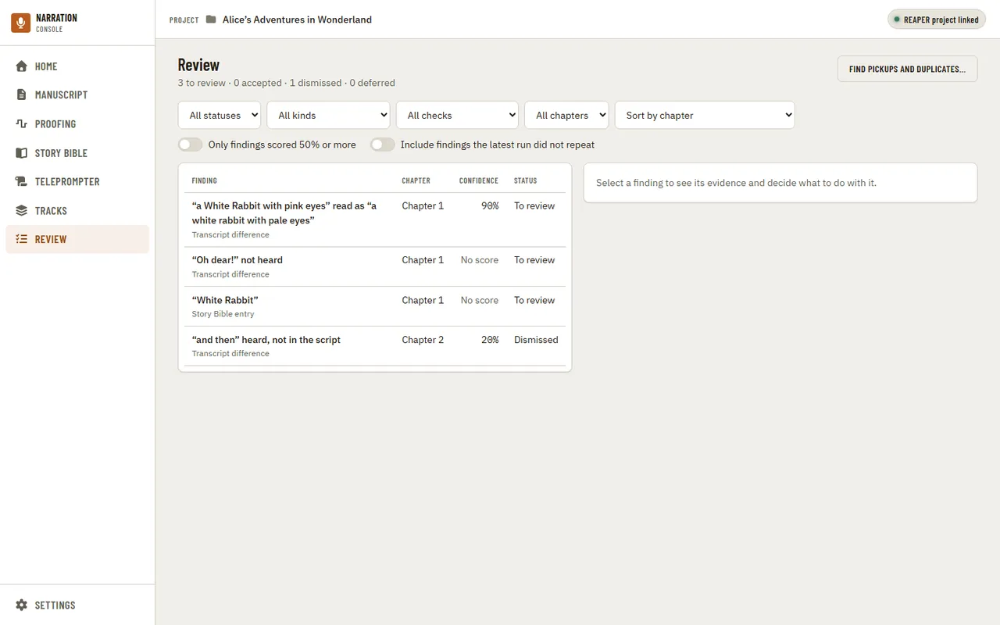

Review is always in the navigation, even before a manuscript is imported. Until a check has found
something, it says there is nothing to review yet and where findings come from.

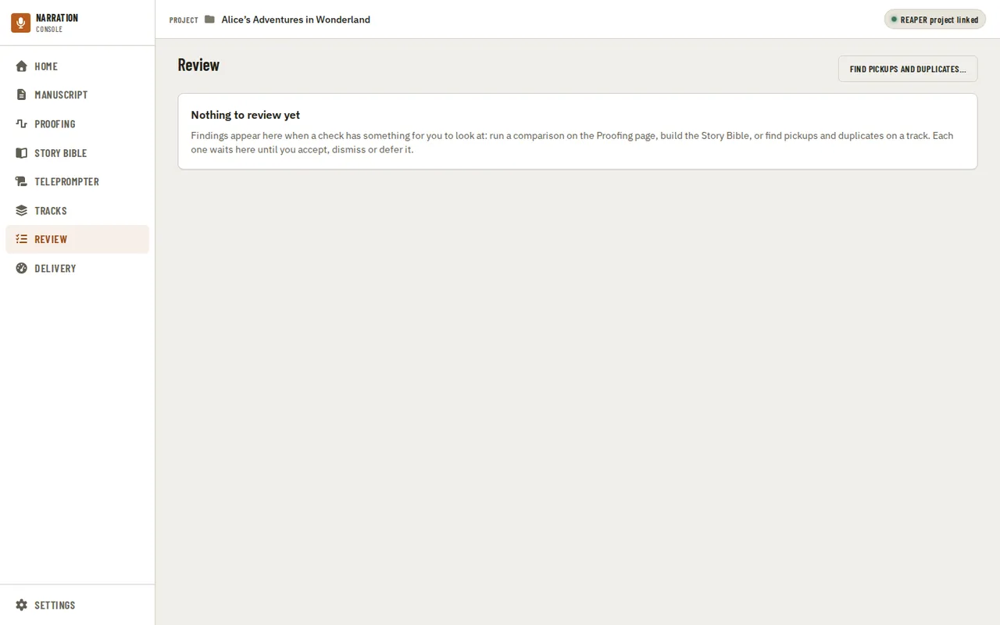

## Filtering and sorting

The row of lists above the findings narrows them by status, by kind of finding, by the check that
found it, and by chapter, and chooses the order: by chapter, by project time, by confidence (lowest
first, so the least certain come up first) or by severity (most serious first). Only the kinds,
checks and chapters that have findings are offered.

- **Only findings scored 50% or more** hides the findings a check was less sure of. A finding with no
  score at all (the check had nothing to measure) is hidden too.
- **Include findings the latest run did not repeat** brings back findings from an earlier run that
  the latest one no longer produced. They are kept, marked "not in the latest run", so a decision you
  made on one is never lost.

**Clear filters** puts every filter back to showing everything, and keeps the order. A long list shows
its first 100 findings; **Show more** adds the next 100.

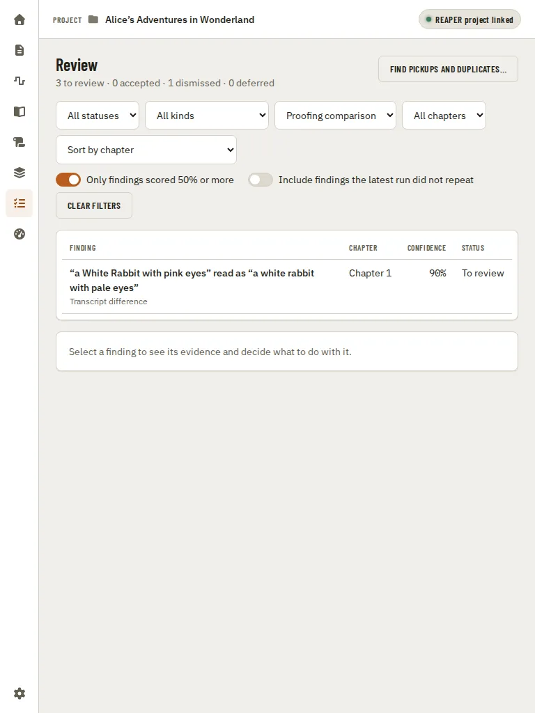

## A finding and your decision

Select a finding to see it in full beside the list (under it on a narrower window):

- what the script says and, for a Proofing difference, what the recording has;
- the chapter, the time in the REAPER project, which check found it, and how serious it is;
- the evidence: the kind of difference (misread, skipped, extra words), the script and recording
  around it, the pause measured at its boundary, a REAPER marker already there, or, for a Story Bible
  finding, why the entry needs a look;
- its confidence, and the check's reason for it.

**Show in manuscript** opens the [Manuscript](manuscript.md) at the finding's line (it needs an
imported manuscript), and a Story Bible finding also has **Open in Story Bible**.

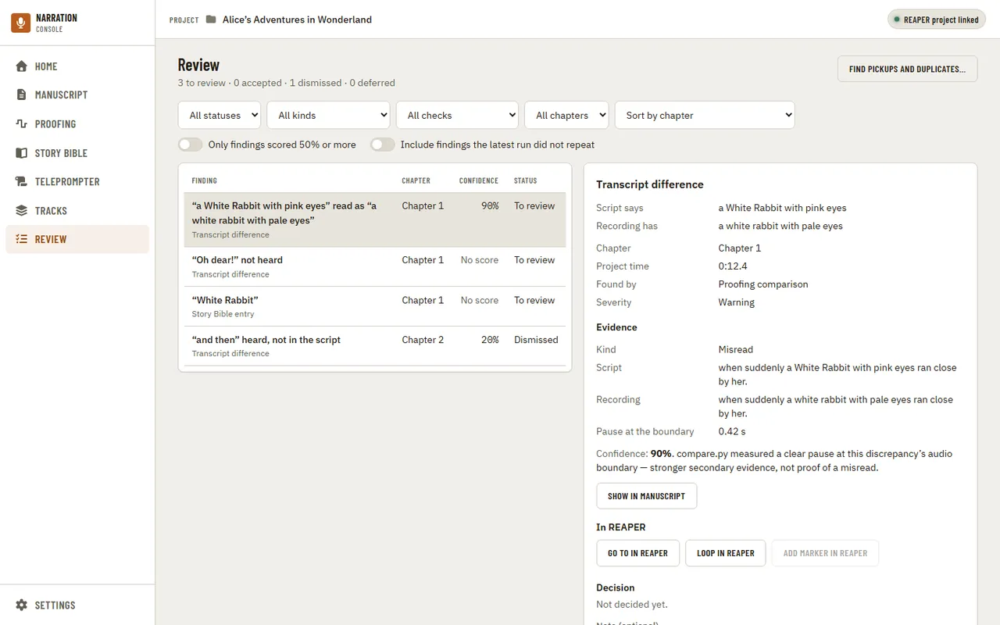

**Accept**, **Dismiss** or **Defer** records your decision at once, with the note if you wrote one (up
to 2,000 characters). The page says it was saved, and the list and the counts update. **Reopen** puts a
decided finding back in the list to review.

A decision is always made on the evidence you are looking at. If the check ran again after you opened
the finding and the evidence changed, the decision is not saved: the page says so, shows the latest
version, and keeps your note, so you can look again and decide.

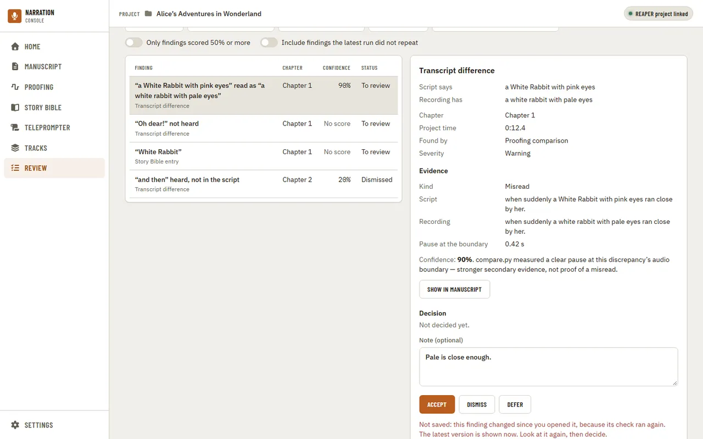

## Going to a finding in REAPER

A finding from a Proofing comparison has an **In REAPER** row. It works when you opened the app from
the Narration Utils action in REAPER and REAPER is still running; the app checks every few seconds
and sends REAPER nothing until you press a button.

- **Go to in REAPER** selects the finding's item, and only that item, and puts the edit cursor on the
  spot. The page says where the cursor went.
- **Loop in REAPER** plays the finding with two seconds either side, over and over: it sets the time
  selection and the loop points to that window, turns repeat on and presses Play. Loop on another
  finding moves the loop there.
- **Stop loop** appears while a loop is playing, on every finding. It stops playback and puts back
  your own time selection, loop points and repeat. Anything you changed yourself while the loop
  played is kept.

None of these edits your project or adds an undo step. A finding is found by its REAPER item, never by
its old project time, so it is still found after you move the item.

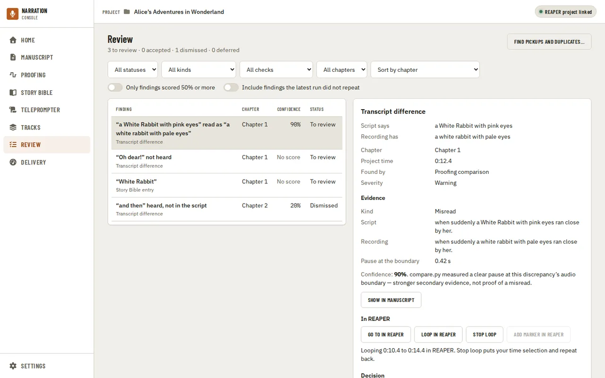

- **Add marker in REAPER** puts one take marker on the finding's spot, after you confirm. It is off
  until you accept the finding. The marker is named like the ones **Export markers** on the Proofing
  page adds, for example `MISREAD: 'pink eyes' as 'pale eyes'`, so Export does not add it a second
  time. If the take already has a marker of the same kind there, nothing is added and the page says
  so. This is the only button here that changes your project, and one Undo in REAPER removes the
  marker.

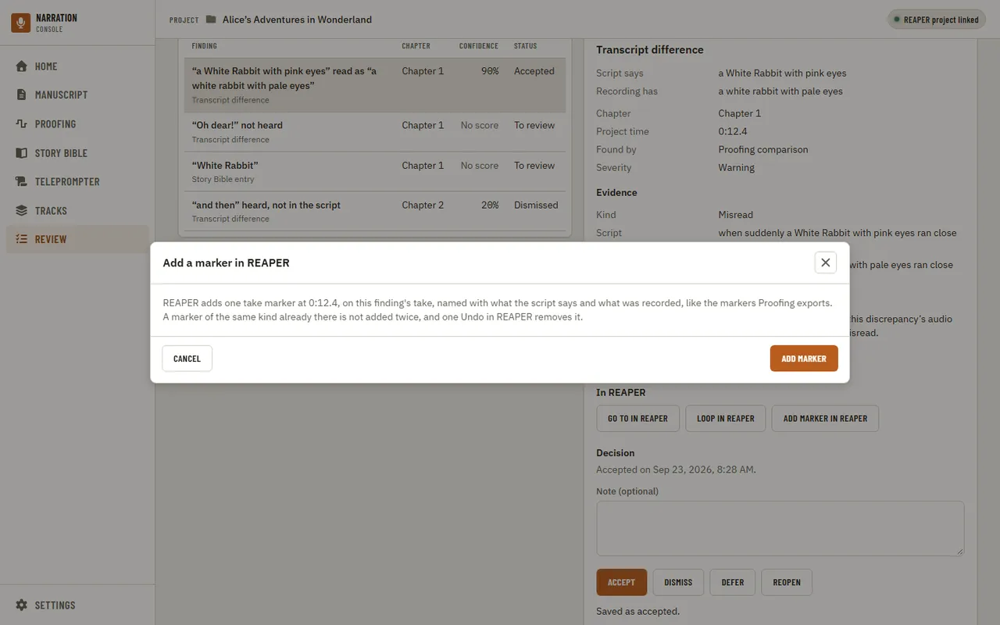

When REAPER cannot do it, nothing in REAPER changes and the page says why:

- **the finding's audio changed.** The item was deleted, lost the take the check heard, or was
  trimmed so the spot is no longer in it. Run the check again to find it where it is now.
- **REAPER is recording.** Stop recording first.
- **the script in REAPER is older than the app.** Import it again from the app's REAPER folder.
- **the finding came from an older check** that did not record its REAPER item. The buttons are off;
  run the check again.

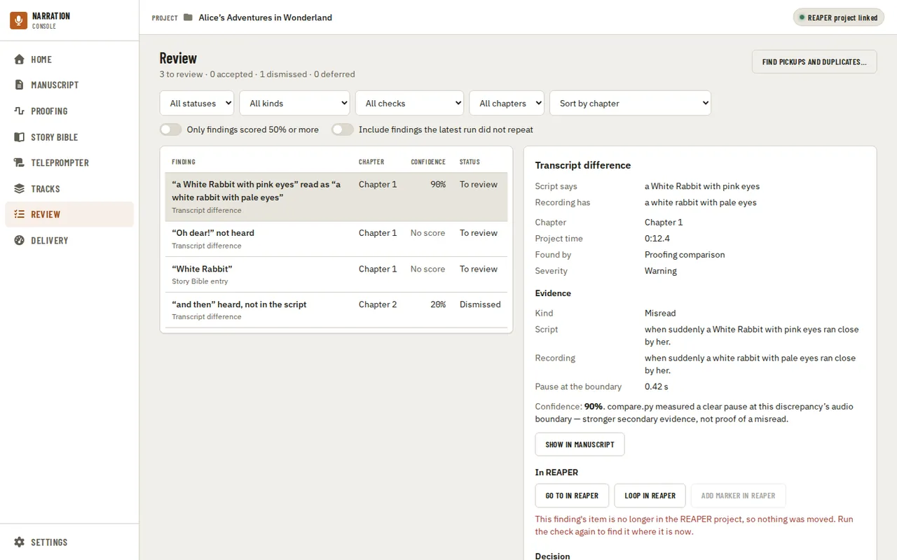

When REAPER is not connected, Go to, Loop and Add marker are off and the reason is under them. If you opened the
app on its own, open it from the Narration Utils action in REAPER instead. If REAPER was closed or the
action stopped, start it again; the buttons turn back on by themselves. A Story Bible finding has no
audio, so it has no REAPER row.

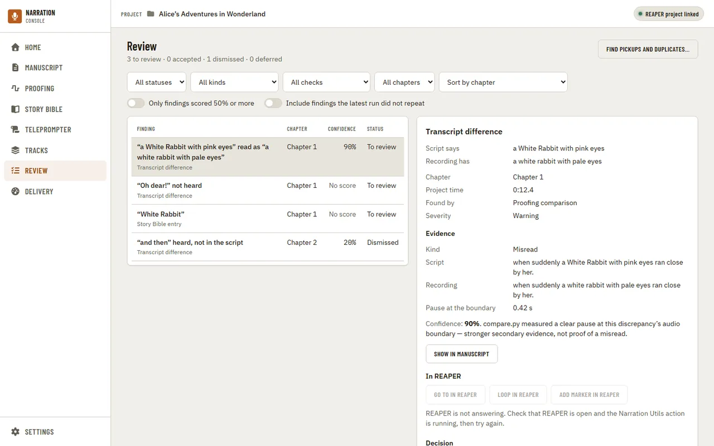

## Pickups and duplicates

**Find pickups and duplicates…** beside the page title looks for lines you recorded more than once on
a track: a restart after a stumble, a pickup of part of a line, an exact copy, or a near-identical
re-read. Choose the **Track to scan**. To include pickups recorded somewhere else, choose **Also look
for pickups on** a pickup track, or on a stretch of the timeline (type the times as `30:00` or in
seconds). If the project's settings name a pickup track or stretch, the dialog starts with it chosen.
Nothing in REAPER changes while it scans.

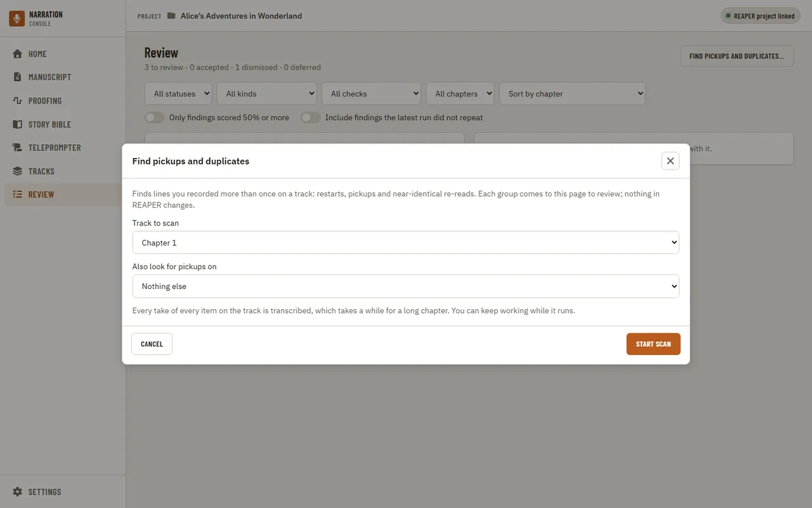

**Start scan** transcribes every take of every item in scope, which takes a while for a long chapter.
The bar and the stage under it are the scan's own. **Cancel** stops it and keeps nothing it found;
**Continue in background** closes the window and the scan goes on, and the app says when it has
finished. Opening the dialog again while it runs shows its progress.

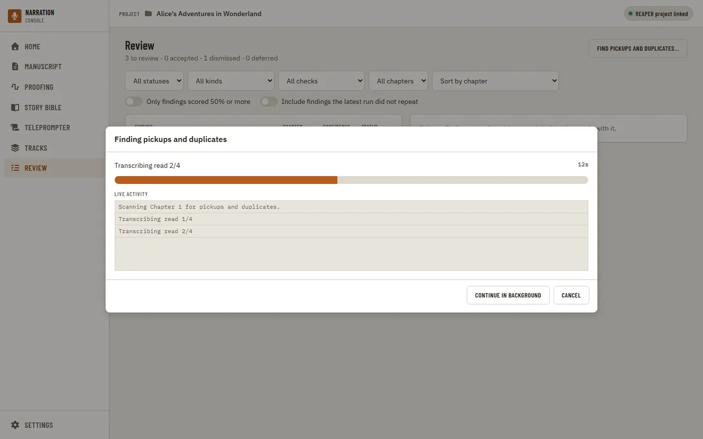

When it finishes, the list shows what it found, filtered to **Take review** (**Clear filters** brings
everything back). Each group is one part of the script you read more than once: the list says what kind
it is and how many reads it has, for example "Partial pickup: 2 reads of sentences 4–8".

Select a group to see its **Reads**: each read's audio file and where in it the read is, whether it
covers the whole part of the script or only some of it, and how many of its words match the script.
Nothing ranks one read over another; listen and choose.

- **Go to** and **Loop** on a read work like the [REAPER buttons](#going-to-a-finding-in-reaper) above,
  for that read's own item. REAPER plays the item's active take, so to hear a read that is another take
  of its item, use Audition.
- **Audition reads** plays two reads side by side (Read A and Read B, each with Play and Loop), with a
  little audio before and after. It plays each read straight from its file, so REAPER's FX, gain and
  edits are not applied and it can sound different from the project. Nothing in REAPER changes.
- **Add as take…** is on once you accept the group. Choose the **Target item** (the item the take is
  added to) and the **Candidate read** (the read that becomes the new take); nothing is chosen for you.
  **Create take** adds it in REAPER: the item's active take and length stay as they were, and one Undo
  in REAPER removes the new take. You choose which take plays in REAPER yourself.

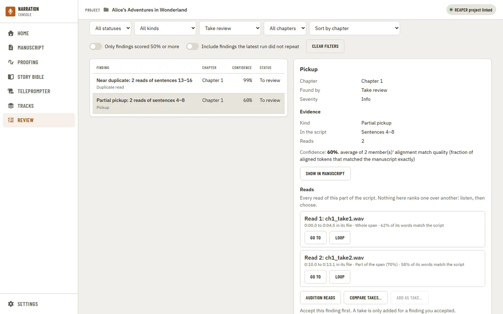

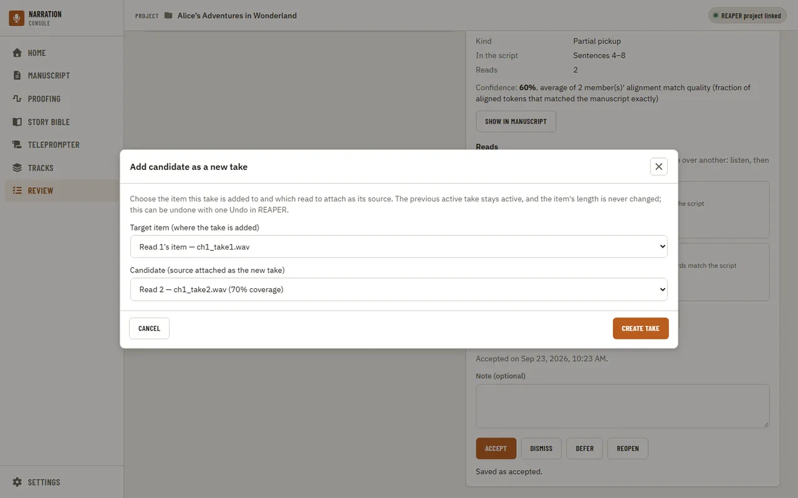

Dismiss a group that is a line repeated on purpose. Scanning the track again keeps your decision on a
group whose reads did not change.

### Comparing takes

**Compare takes…** under a group's reads sets the reads side by side over the same part of the script.
It transcribes each read again and measures its audio, so it takes a while; like the scan, it shows its
own progress, **Cancel** keeps nothing, and **Continue in background** lets you keep working. Before it
starts, each read is checked against the saved REAPER project: a read whose item was moved, trimmed or
removed since the scan, or whose file is missing, is listed with the reason and left out. Save the
project in REAPER first if you changed it.

When it finishes, the comparison opens, and the list is filtered to **Take comparison**. It has two
parts:

- **How each read reads the script.** Every word of that part of the script, as each read said it. A
  word read as something else is underlined with a wave, a word left out is struck through, and a word
  the read never reached (it started late or stopped early) is dotted. Under the words, each place the
  read departs is listed with what was heard and when, for example "Misread “very” as “remarkably” at
  0:10.8". A read that none of these words were heard in is not compared.
- **The audio of each read.** One row per kind of evidence, one column per read: clipping, room noise
  (the quietest half-second, lower is quieter), level against the items either side of it, length and
  speaking rate, and the pauses between its words. Each is measured from the read's own file, before
  REAPER's FX and edits. A figure that cannot be measured says why (for example, a pickup on a track of
  its own has no neighbours to compare its level with, and only WAV files are measured).

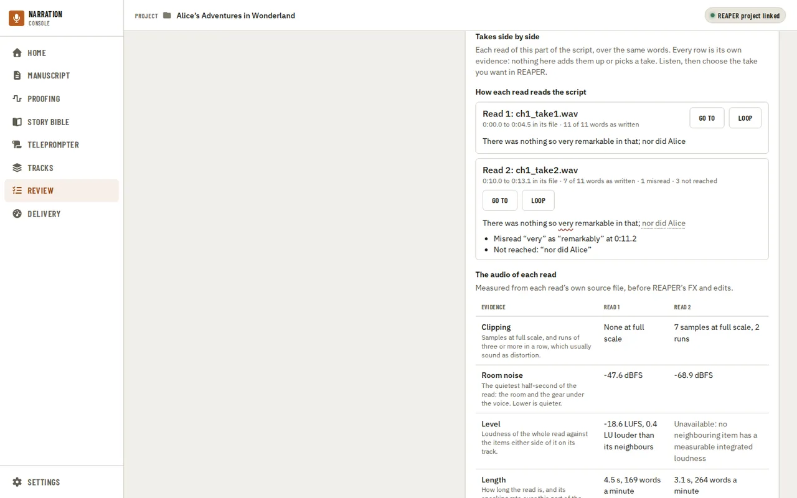

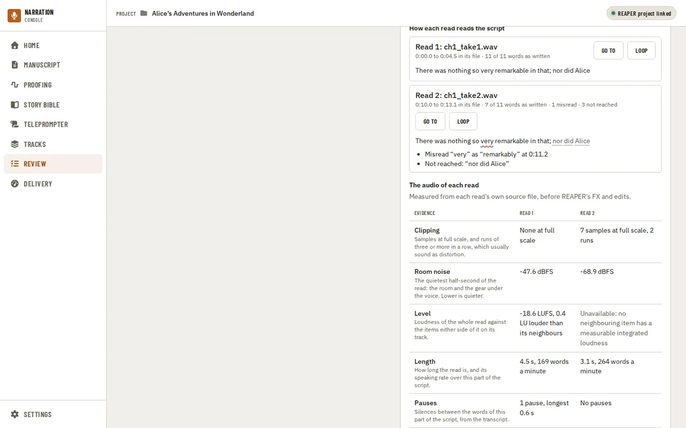

Nothing adds the rows up or picks a take: a read can be word for word but noisy, another clean but with
a misread, and which matters is your call. **Go to**, **Loop** and **Audition reads** work as they do on
the group. When you have chosen, make that take active in REAPER yourself; the app never changes which
take plays. Accept, dismiss or defer the comparison like any other finding; comparing the same group
again replaces it, and keeps your decision only if the measurements did not change.

---

[← Chapter workspace](workspace.md) · [Index](README.md) · [Delivery →](delivery.md)
