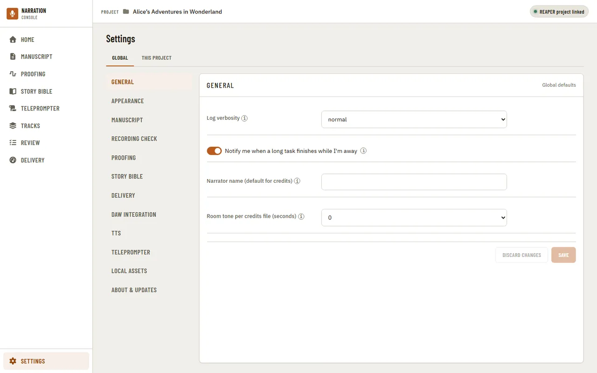
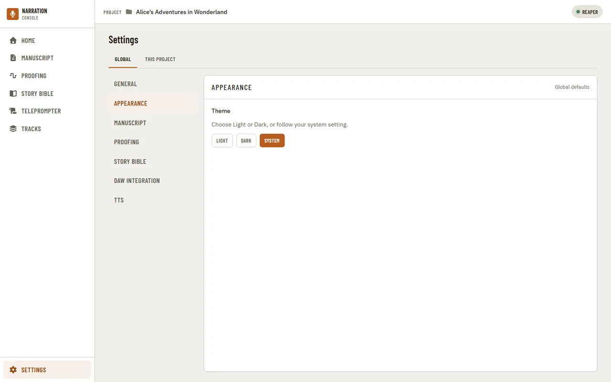
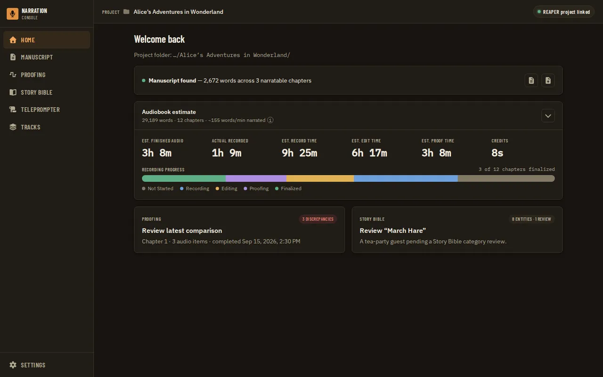
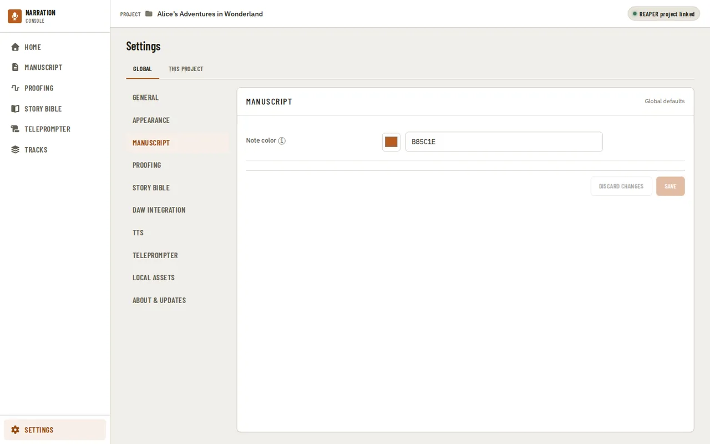
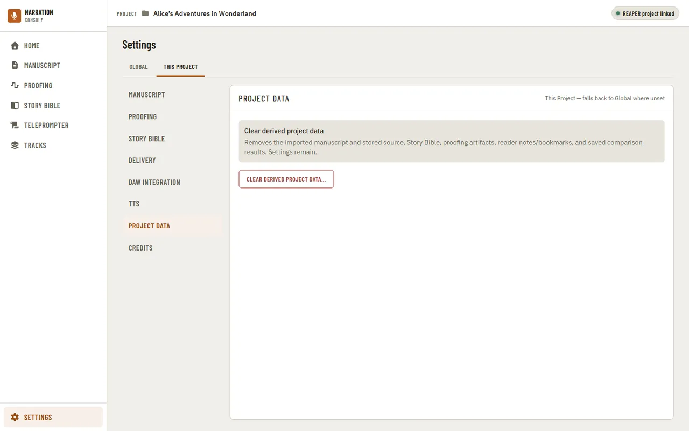
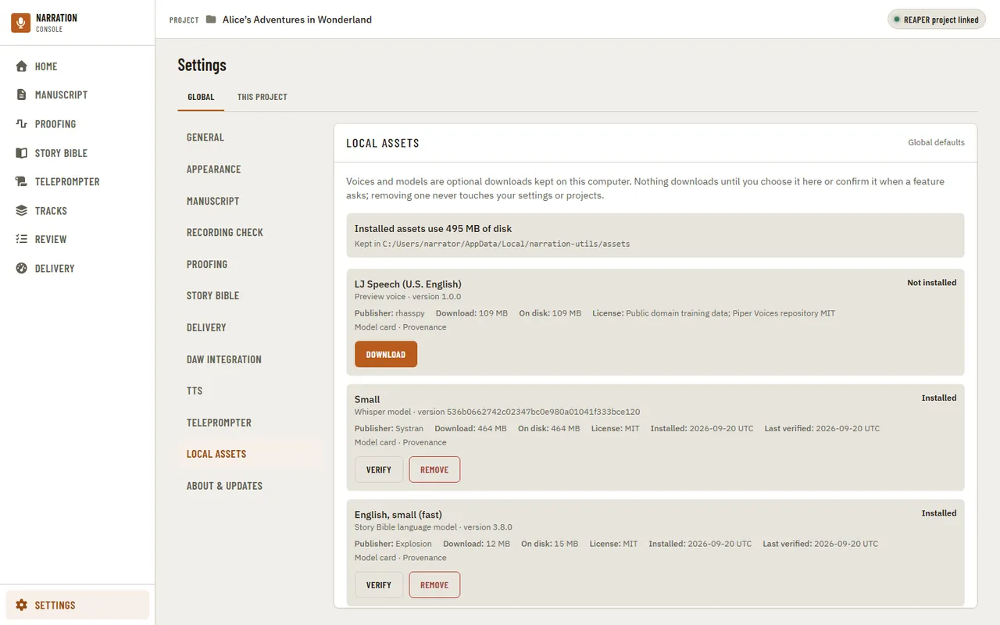
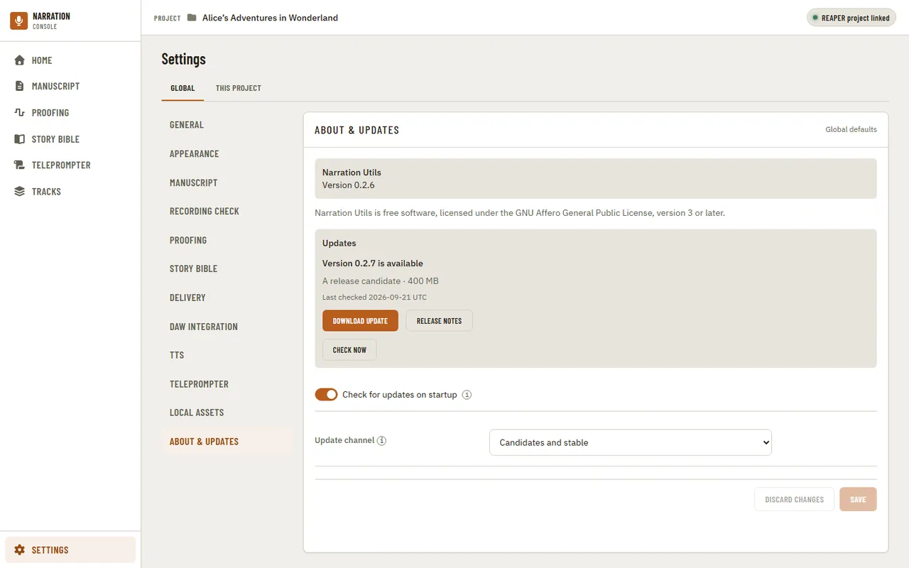

[Using the app](README.md) › Settings

# Settings

Settings are split into Global (defaults for every project) and This Project (overrides for
the current one), organized by category.

Appearance controls the light/dark theme.

Other categories mix dropdowns and color pickers — Manuscript's own category, for example,
controls the color used to mark reader notes in the text. **General** (Global only) also holds the
**Narrator name (default for credits)**. In both scopes:

- **Recording check** holds the four numbers the [recording check](home.md) uses: the **Share of
  each paragraph that must be read** (0.8) and the **Longest run of missing words allowed** (3)
  decide when a chapter counts as recorded, and the **Longest misread still counted as read** (8)
  and the **Shortest match that counts as read** (3) decide which words count as read at all. The
  category states the rule they make and labels them **Proposed values, not yet calibrated**: they
  were chosen on synthetic test recordings and have not been checked against real recordings yet
  ([how they were chosen](../../utilities/recording-coverage.md#settings)). A skipped phrase of 3
  words or fewer can pass, because a transcriber drops single words too. Changing either of the first two only changes
  how a stored check is judged. Changing either of the last two makes earlier checks out of date, so
  those chapters need checking again. In This Project, a blank box uses the Global value.
- **Proofing** picks the default Whisper model and chunk length for a comparison and the marker colors
  for misread, skipped and extra words. It shows whether the chosen model is installed, with
  **Remove local model…** once it is.
- **Story Bible** picks the spaCy model and whether to **Build the Story Bible after import**.
- **Delivery** holds your own limits for measured chapter audio: the lowest and highest integrated
  loudness (LUFS) and RMS level (dBFS), and the highest sample peak (dBFS), true peak (dBTP) and noise
  floor (dBFS). None is set until you type one, and no distributor's numbers are built in, so the
  category says **No limits set** until you do; a measurement with no limit is reported without being
  checked. Each box shows its unit and allowed range, says what is wrong with a value it cannot save,
  and refuses a lowest limit above its highest. Empty a box to remove a limit; in This Project, a
  blank box uses the Global limit.
- **TTS** picks the provider and the preview voice used to [hear a name](story-bible.md#hearing-a-name),
  with **Remove local voice…** once the voice is installed.

Choosing a model or a voice here never downloads it; the app asks when a feature first needs it.

The **Teleprompter** category (Global scope only — the microphone, engine and model are machine facts, not a
per-project preference) remembers the microphone, live engine and model you last chose on the
[Teleprompter](teleprompter.md) page, and changing them here changes what the page starts with. The engine is Whisper
(the default) or, on Windows only, Moonshine; the model is Tiny or Small for either. Choosing Moonshine does not download
its model: the Teleprompter asks the first time you start reading with it.

This Project's "Project data" category is a project-only danger zone: it clears the imported
manuscript, Story Bible, proofing artifacts, and reader notes for the current project, while
leaving its settings in place.

## DAW Integration

In the **Global** scope, **DAW Integration** says whether REAPER is installed on this computer (**Check
again** looks again; the app never downloads or installs it for you) and whether it is reachable: a
running REAPER has been heard from recently, and its open project does or does not match the linked one.
**Launch REAPER** starts REAPER on the linked project and needs a linked `.rpp` first. Two settings go
with it: **REAPER executable (override)**, for a REAPER the app does not find by itself, and **Start the
launcher script automatically** (off by default), which has REAPER run the Narration Utils launcher when
the app starts it. Where the app knows the launcher's path, it is shown with **Copy path**, to import
once in REAPER as an action.

In **This Project**, the same category shows whether a REAPER project is linked, with **Link a REAPER
project file** or **Change linked project file**: the same link as the pill in the
[header](navigation.md).

## Credits

**Credits** (This Project only) holds the audiobook's opening and closing credits.

- **Templates**: pick a template to edit its **Name**, **Kind** (Opening or Closing) and **Body**, then
  **Save template**. **New** starts a blank one, **Duplicate** copies the selected one and **Delete**
  removes it.
- **Tokens**: bracketed tokens in the body, such as `[Title]`, `[Author]` and `[Narrator]`, are filled
  from the project values.
- **Preview** shows the body with the values filled in, its word count, and any token that has no value
  yet, highlighted and listed as unresolved.
- **Project values**: Title, Subtitle, Author, Series, Book number, Copyright, Year, Copyright holder,
  Publisher, and a Narrator that overrides the global default from General for this project only. A value
  is saved as you type. Where the manuscript suggests a title or author, **Use suggestion** fills it in.

The first opening and closing templates appear in the [Manuscript](manuscript.md) reader and in the
Credits time on [Home](home.md).

## Local assets

The **Local assets** category of the Global scope lists every optional download Narration Utils can keep on this computer: preview
voices, Whisper models for proofing comparisons and the language model the Story Bible uses. Nothing here downloads by itself, and
removing one never touches your settings or projects. The page also shows how much disk the installed ones use and the folder they
are kept in.

Each entry says what it is, its exact version, who publishes it, its download and disk sizes, and links to its license, model
card and provenance. Its state is one of:

- **Not installed**: **Download** starts the download. A bar shows the real bytes so far and **Cancel** stops it while bytes are
  arriving; the checks after the last byte cannot be cancelled. A download that is already running when you open the page
  (started by a Story Bible build, a preview or a comparison) is shown here too, and leaving the page does not stop it.
- **Downloading** and **Verifying**: the download itself, then the check of every file against its approved size and checksum.
- **Installed**: **Verify** reads every file again and checks it (it can take a few seconds for a large model, and the button shows it
  is working), and **Remove** deletes that one asset after you confirm. The confirm says how much space it frees and what will ask
  to download it again.
- **Needs repair**: some files are missing or no longer match the approved ones, so the app will not use the asset. **Repair**
  downloads it again and checks it; **Remove** deletes it instead.

If a download, a check or a removal fails, the reason is written in that entry, and the entry keeps its buttons so you can try
again.

## About and updates

The last category of the Global scope, **About & updates**, shows which version of Narration Utils you are running and looks
after updates.

- **Check for updates on startup** (on by default): once a day, when the app starts, it asks GitHub which releases exist. That
  request sends nothing about you, your projects or your computer, and it never downloads anything by itself. Switch it off
  if you would rather look yourself with **Check now**.
- **Update channel**: *Candidates and stable* (the default; every release so far is a release candidate) or *Stable only*.
- **Download update** asks first, then downloads the new version with a progress bar and checks it against the release's
  checksum. You can cancel while it downloads.
- **Install and restart** asks again, then closes Narration Utils and starts it again on the new version with the same
  project. It will not install while an import, a Story Bible build, a download, a comparison or a teleprompter session is
  running: finish or stop it and try again. If the new version does not start, the previous one comes back by itself.
- If Narration Utils is installed somewhere it is not allowed to change (for example under Program Files) it says so and
  offers **Show the downloaded file**, so you can replace the program yourself.
- **Release notes** opens the release page in your browser.

Updates apply to Windows. On macOS and Linux (preview builds) the app tells you a newer version exists and links to it.
Releases are not yet signed, so Windows SmartScreen or your antivirus may ask about a new version the first time.

If Narration Utils will not start after an update and the program file is missing from its folder, rename
`narration-utils.exe.old` back to `narration-utils.exe`.

---

[← Tracks](tracks.md) · [Index](README.md)
