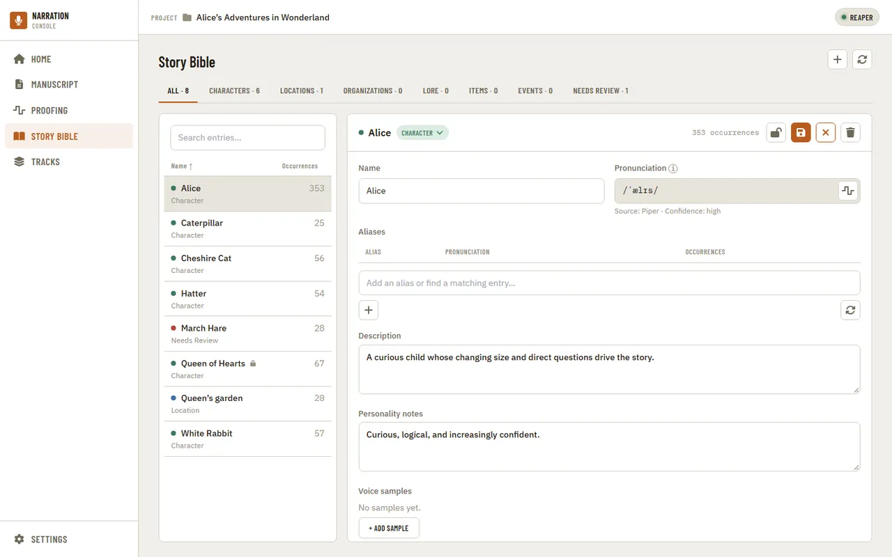
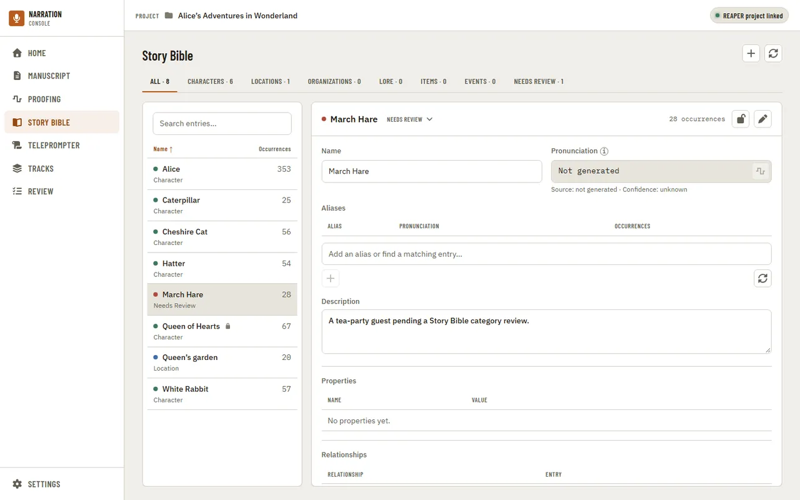

[Using the app](README.md) › Story Bible

# Story Bible

Story Bible tracks every character, place, and organization extracted from the manuscript,
with pronunciation, aliases, and narration notes. Category tabs filter the list.

Selecting an entry opens its detail panel, read-only at first. Press Edit to change
pronunciation, aliases, and notes, then Save (or Cancel). Locked entries can't be edited until
unlocked. Rebuilding is deliberately strict: it favors missing a name over listing ordinary
words, so add unusual names by hand with the + button.

Pressing Edit switches the entry to edit mode, where Save and Cancel appear. Locked entries show
neither Edit nor Save.

Entries the build isn't sure about are filed under Needs Review, and their evidence is
highlighted in the review color so it is clear which entries still need a decision. "Go to line"
on an entry's evidence jumps to that spot in the [Manuscript](manuscript.md).

Typing into the alias field opens a dropdown of existing entries whose name or alias matches,
so a name mentioned under a different spelling can be merged into the entry it already
belongs to instead of creating a duplicate.

## Hearing a name

The play button beside a name, or beside one of its aliases, speaks it with the local preview
voice. The first time, the app asks before it downloads the voice. If the preview fails, the
message says why, and pressing play again tries again; a failed run never leaves a broken
recording behind.

| Message | What it means | What to do |
| --- | --- | --- |
| "... could not be spoken: the voice produced no audio for it" | The name is only punctuation or symbols, so the voice has nothing to say. | Preview an alias that has letters in it, or ignore the preview for this name. |
| "The preview voice could not be loaded" | The downloaded voice is damaged or missing files. | In Settings, under TTS, choose "Remove local voice", then press play to download it again. |
| "The preview took longer than 2m0s and was stopped" | The helper that speaks the name did not finish. | Try again. If it keeps happening, restart the app. |
| "configure the Manuscript Guide executable" | The helper that builds the Story Bible was not found. | Reinstall the app. A build run from source needs its Manuscript Guide sidecar built first. |

---

[← Proofing](proofing.md) · [Index](README.md) · [Teleprompter →](teleprompter.md)
