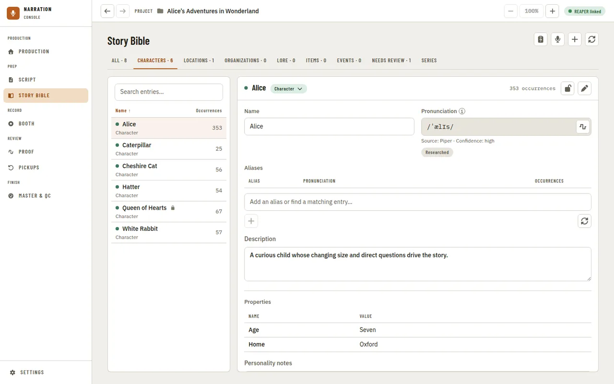
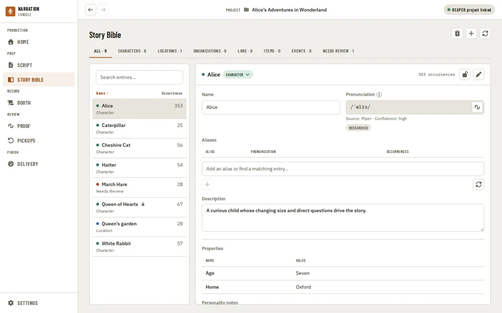
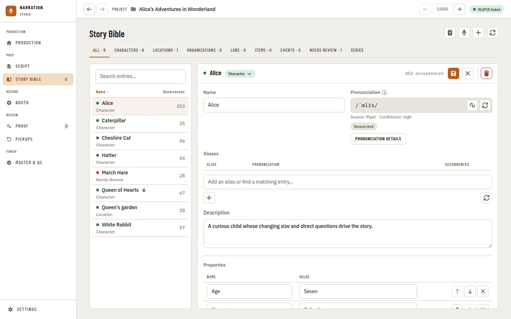
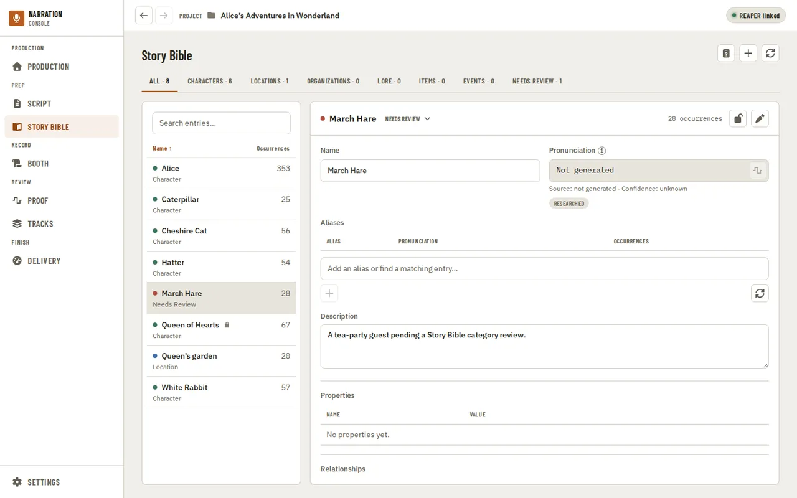
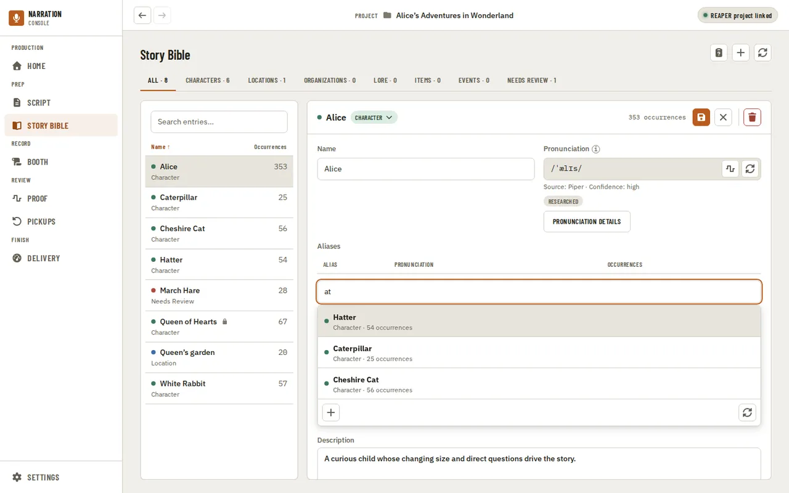

[Using the app](README.md) › Story Bible

# Story Bible

Story Bible tracks every character, place, and organization extracted from the manuscript,
with pronunciation, aliases, and narration notes. Category tabs filter the list.

Selecting an entry opens its detail panel, read-only at first. Press Edit to change
pronunciation, aliases, and notes, then Save (or Cancel). Locked entries can't be edited until
unlocked. Rebuilding is deliberately strict: it favors missing a name over listing ordinary
words, so add unusual names by hand with the + button.

Pressing Edit switches the entry to edit mode, where Save, Cancel and a red Delete appear on the far
side of the header, set apart from Save so it can't be mis-clicked. Lock only appears in the read
view: an entry can never be locked while it is being edited, so unlocking always returns you to a
read-only entry, never back into an edit in progress. Locked entries show only Unlock; a brand-new
entry starts unlocked and can be locked once it has been saved.

Each entry also has **Properties**: a list of labelled facts, such as "Codename: Wren" or "Abilities: flight",
that you keep in the order you give them. In edit mode each property is a row with a name and a value, buttons to
move it up or down or remove it, and an Add button below. A value needs a name, and no two properties may share
one (capital letters do not make a name different); Save says which row to fix. A row you add and leave blank is
dropped. Properties are kept when you rebuild the Story Bible, and the summary of an entry that opens from the
Manuscript lists them too.

Entries the build isn't sure about are filed under Needs Review, and their evidence is
highlighted in the review color so it is clear which entries still need a decision. "Go to line"
on an entry's evidence jumps to that spot in the [Manuscript](manuscript.md).

Typing into the alias field opens a dropdown of existing entries whose name or alias matches,
so a name mentioned under a different spelling can be merged into the entry it already
belongs to instead of creating a duplicate.

## Building with a language model

The first time you press Build / refresh, the app asks before it downloads anything. The Story Bible finds
people, places and organizations best with a language model (a small English model by default, chosen under
Settings, Story Bible). The question says what it is, its version and publisher, how much is downloaded and how
much disk it needs, where it will be kept, and its licence. You choose one of three:

- **Download model** downloads it with a progress bar you can cancel, checks it, and then builds. The next build
  does not ask again.
- **Build with rules-only** builds this once without a model. The result is lower quality (it finds fewer names
  and mistakes more ordinary words for names) and the build says so when it finishes. The model stays not
  downloaded, and the next build asks again.
- **Cancel** changes nothing: no build and no download.

If a download fails, the message says why (no connection, not enough disk space, or a file that did not match
the approved one) and you can try again. A download that was cut off carries on from where it stopped. Choosing a
model in Settings never downloads it, and Settings lists every approved model whether or not it is installed.

## Hearing a name

The play button beside a name, or beside one of its aliases, speaks it with the local preview
voice. It only works once a pronunciation exists: with none, the button is dimmed and a hint
(reachable by keyboard, not just the mouse) says so. The first time you press play, the app asks
before it downloads the voice. If the preview fails, the message says why, and pressing play
again tries again; a failed run never leaves a broken recording behind.

## Generating and replacing a pronunciation

In edit mode, a name with no pronunciation shows a **+** button beside it; press it and choose the
CMU dictionary or eSpeak NG to generate one. Once a pronunciation exists, the same spot shows a
refresh button instead, so you can replace it with the other source. Either engine can have
nothing for an unusual name (most fantasy names aren't in the CMU dictionary, and the eSpeak
fallback needs a system component many machines don't have) - the message says which, and you can
try the other source or try again. A pronunciation you set this way is kept the next time you
rebuild the Story Bible; an automatically generated one can still change on a rebuild.

## Your own pronunciation, and what the author said

Under each pronunciation is its status: **Researched** (looked up, the default), **Query sent** (you
asked the author) or **Author confirmed**, with your note beside it if you wrote one.

In edit mode you can type **Your pronunciation** and press **Use mine**. The dictionary's answer is
not thrown away: it shows as "Also kept", and **Use ... instead** switches back to it (and keeps
yours, so you can switch again). Neither step looks anything up. Set the **Status** and a
**Pronunciation note** (who you asked, and when) and press **Save status**. If you change a
pronunciation the author confirmed, it goes back to Researched, because the author has not heard the
new one. A rebuild keeps all of this.

## Pronunciation queries for the author

The **Pronunciation queries** button at the top of the Story Bible opens a panel that lists every
name the author has not confirmed yet, in the order the book first uses them, with the pronunciation,
its status, your note and the sentence it first appears in. **Show** narrows it to the ones you have
sent or the ones you have only looked up.

**Export CSV** saves `pronunciation-queries.csv`, one row per name, for you to email or share with
the author however you usually do. It opens in any spreadsheet. The last two columns (`entry_id`,
`alias_index`) tell the app which entry each row is about, so ask the author to leave them as they
are. **Mark sent** records that you asked. **Mark answered** records that the author confirmed it,
and the name leaves the list.

Once the author sends the file back with a `status` filled in for each row (`researched`, `query
sent` or `author confirmed`, spelled either way), press **Import answers…** and pick that file
instead of marking every row by hand. The panel says how many rows it applied; a row it could not
use (the entry or alias it named is no longer there, or its status column is not one of the three)
is listed underneath with the reason, and nothing else in the Story Bible is touched by that row. A
row whose `note` column is left blank does not erase a note you already had for that name - only
fill in a note if you want it changed.

| Message | What it means | What to do |
| --- | --- | --- |
| "... could not be spoken: the voice produced no audio for it" | The name is only punctuation or symbols, so the voice has nothing to say. | Preview an alias that has letters in it, or ignore the preview for this name. |
| "The preview voice could not be loaded" | The downloaded voice is damaged or missing files. | In Settings, under TTS, choose "Remove local voice", then press play to download it again. |
| "The preview took longer than 2m0s and was stopped" | The helper that speaks the name did not finish. | Try again. If it keeps happening, restart the app. |
| "configure the Manuscript Guide executable" | The helper that builds the Story Bible was not found. | Reinstall the app. A build run from source needs its Manuscript Guide sidecar built first. |

---

[← Manuscript](manuscript.md) · [Index](README.md) · [Booth →](booth.md)
