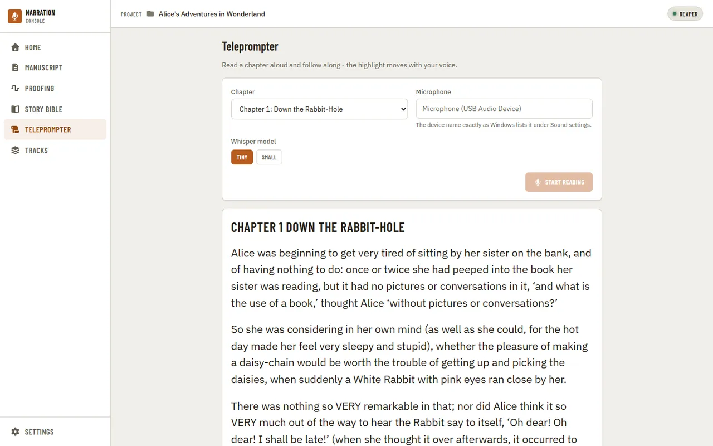
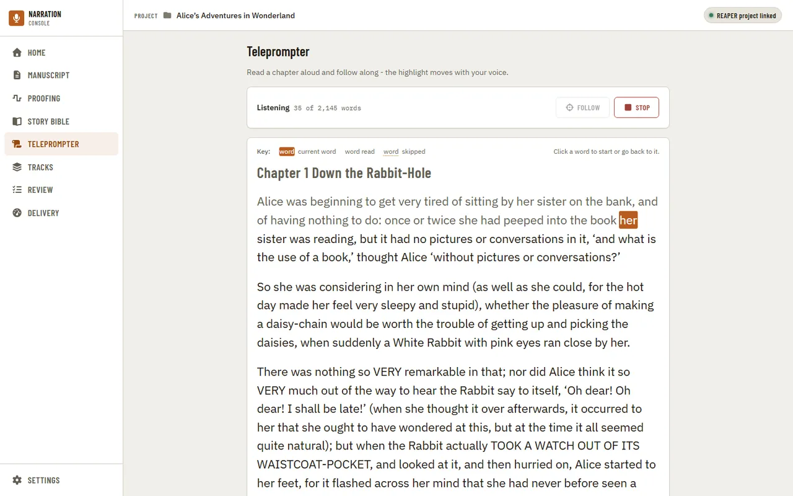
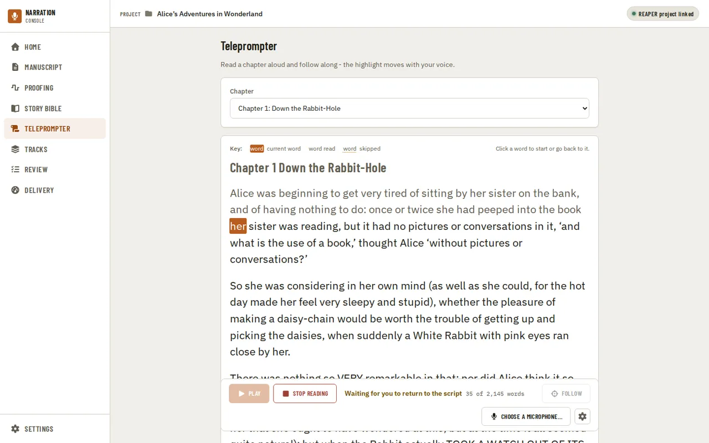

[Using the app](README.md) › Teleprompter

# Teleprompter

The Teleprompter follows you as you read a chapter aloud: it listens through your microphone
with a local speech engine and highlights the word you are on. It needs an [imported manuscript](home.md),
and nothing you say is edited, saved, or sent anywhere.

Choose the chapter, pick your microphone from the list (Refresh if you just plugged one in), and
pick an engine and a model. On Windows there are two engines, Whisper (the default) and Moonshine;
both highlight the same way, so try each and keep the one that follows your voice more smoothly.
Elsewhere only Whisper is offered, and the engine choice is not shown. Tiny is the fastest model and
keeps up on most computers; Small is more accurate but needs a faster one. Choosing an engine or a
model never downloads anything: the first time you start with one whose model is not on this computer,
the app asks first, naming the engine, the download size, the publisher and the licence, and downloads
only if you say so. Your microphone, engine and model are remembered for next time (they are the same
choices as in [Settings](settings.md) › Teleprompter); a microphone that is no longer connected shows as
"(not found)" until you pick it again or choose another. A microphone can only be picked from the list, never typed: with none listed,
the page says "No microphone found" and Start reading stays disabled until you connect one and press
Refresh.

If the project has a REAPER project, the chapter can come from it. The app reads the project as it was
last saved and looks at the track you have armed for recording (or, with none armed, the selected
track). When that track is linked to a chapter on the [Tracks page](tracks.md), or its name clearly
matches one ("Chapter 2" for Chapter 2, never Chapter 12), the chapter opens chosen, with a line
beneath saying so. When the name is only a near match, or armed tracks point at different chapters,
nothing is chosen for you: the likely chapters are offered as buttons under the picker. Save the
REAPER project after arming a track for the app to see it.

Press Start reading and begin at the top of the chapter, title first. The setup fields fold away
into a bar that stays at the top with the status, a Follow button and a Stop button. Words you have read dim, the
word you are on is filled in, and the page scrolls to keep it near the middle of the screen.
The highlight follows what it hears, not a timer, so it waits when you do. The key above the text
shows the three looks: current word, word read, and skipped (a dotted underline).

While it is listening you can click any word: a word ahead starts reading from there, and a word you
have already read takes you back to it.

You can scroll the text yourself while it listens, with the mouse wheel, a touch drag, the scroll
bar or the Page Up, Page Down and arrow keys. The page then stops following, says "Following paused"
under the status and leaves the text where you put it. It follows again on its own once the word you
are on is back near the middle of the screen, whether you scroll back to it or read on until it
arrives there. To jump straight back, press Follow beside Stop.

You do not have to read perfectly. If you skip a word or two it carries on and underlines the
words you missed; if you go back and re-read a sentence it goes back with you. If you stop for
a moment the status says it is waiting for you to return to the script, and it picks up again
as soon as it hears you.

When you reach the end of the chapter the status says Done, and the session stops by itself a few
seconds later: the status then says "Stopped at the end of the chapter." If you go back and re-read
the last line before then, it keeps listening instead. You can still press Stop at any time. You
can leave the page while it runs; coming back shows where you were.

---

[← Story Bible](story-bible.md) · [Index](README.md) · [Tracks →](tracks.md)
