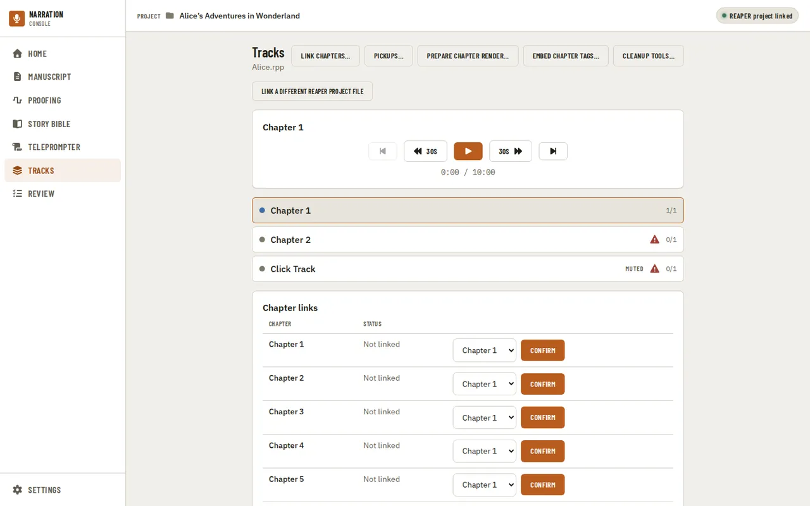
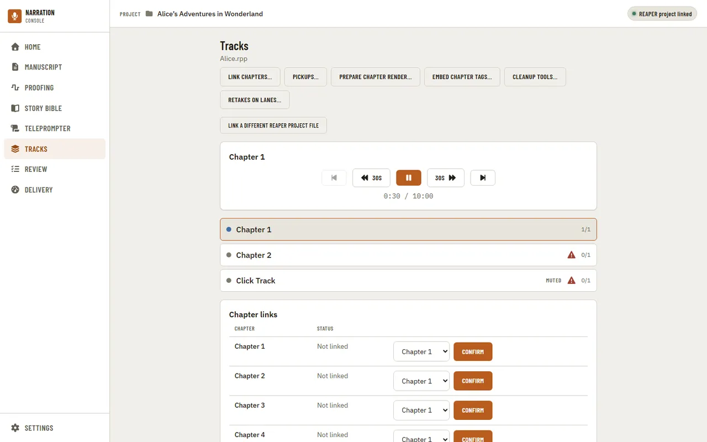
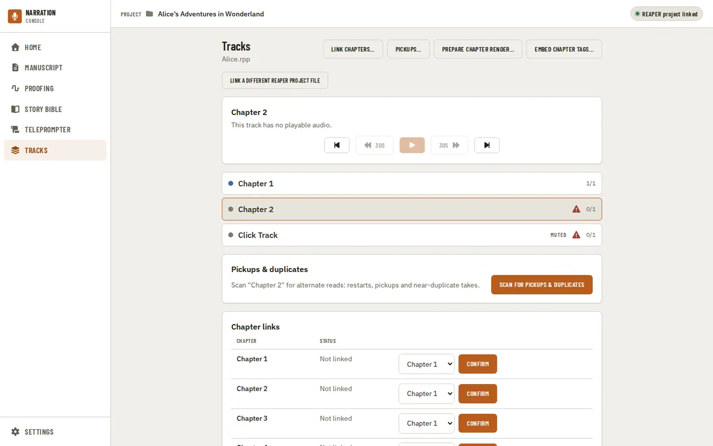
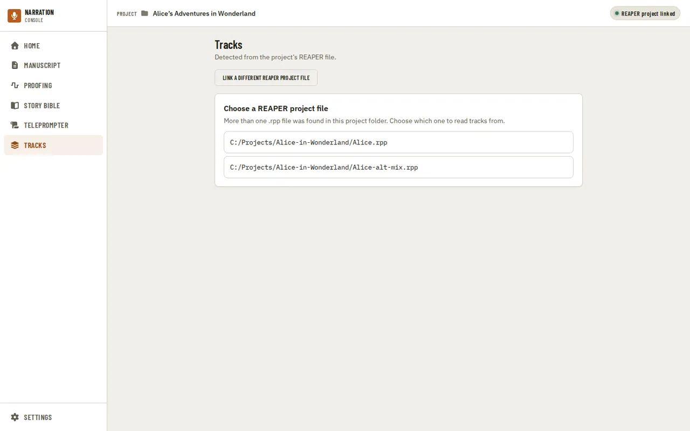
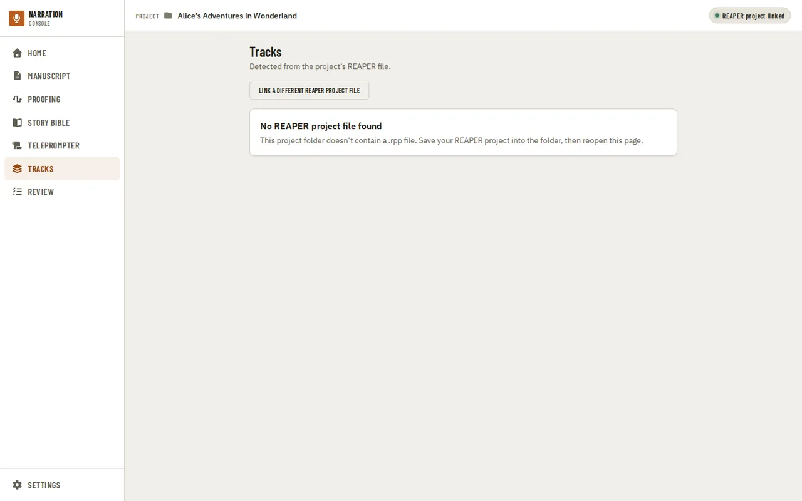
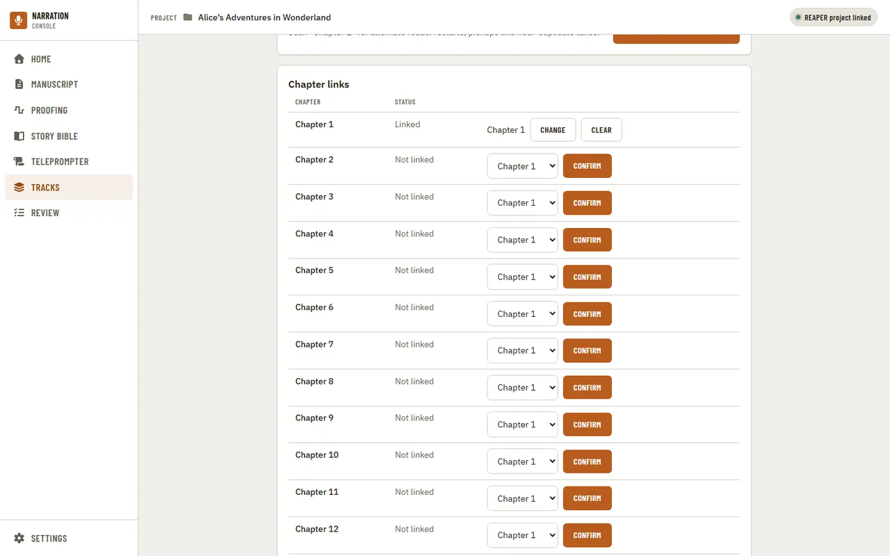

[Using the app](README.md) › Tracks

# Tracks

Tracks reads the project's REAPER project file (`.rpp`) directly, so listing and playing tracks doesn't
need REAPER to be running or an imported manuscript. Its [REAPER tools](#reaper-tools) are the exception. Each track shows its color, a Muted badge
when it's muted, and how many of its items have playable audio (for example `1/1`). A warning
triangle marks a track with an item whose audio file can't be found on disk, or that isn't
audio at all (such as a MIDI item).

The transport plays the selected track's audio items back to back. It has play/pause, skip back
and forward 30 seconds, and previous/next track — those two move between tracks, not between
items within one.

While a track plays, the readout beside the controls shows the position and length of the item
currently playing. Skipping stays within that item, and playback stops at the end of the
track's last item.

If a file that was present when the page loaded can't be played (for example, it was moved or
deleted since), playback stops and a message says so.

Selecting a track with no playable audio says so and disables the playback controls (previous
and next track still work).

If the project folder holds more than one `.rpp` file, Tracks asks which one to read. Backup
copies (`.rpp-bak`, or files inside a subfolder such as Backups) aren't offered. The choice is
remembered for the project.

If the folder has no `.rpp` file at all, Tracks says so. Save the REAPER project into the
project folder and reopen the page.

Under the page title, **Link a REAPER project file** (or **Link a different REAPER project file**
once one is linked) is the same link as the pill in the [header](navigation.md). Tracks finds its
`.rpp` on its own either way; the link is what [Proofing](proofing.md) needs.

## Pickups & duplicates

Below the track list, the Pickups & duplicates panel scans the selected track for alternate reads:
restarts, pickups and near-duplicate takes. Press **Scan for pickups & duplicates**. Each finding is a
row with its **Category** (Pickup or Duplicate read), its **Evidence** (Exact copy, Restart, Partial
pickup or Near duplicate), its **Manuscript location** (chapter and sentences), its **Coverage**, and
how many **Reads** were found. A scan that finds nothing says "No repeated reads found on this track."

- **Audition** plays two of the reads side by side (Read A and Read B, each with Play and Loop), with a
  little audio before and after the matched words. It plays each read straight from its source file,
  so REAPER's FX, gain and edits are not applied and it can sound different from the project. Nothing
  in REAPER changes.
- **Add as take** asks you to choose the target item (where the take is added) and the candidate read
  (the source attached as the new take), then **Create take** adds it in REAPER. The item's active take
  and length stay as they were, and one Undo in REAPER removes it. The row then shows "Take added".
  Only findings the scan suggests a take for offer it.

## REAPER tools

When the project has tracks, four buttons sit beside the page title. **Link chapters…**, **Pickups…**
and **Prepare chapter render…** change the project open in REAPER, through the Narration Utils script
the launcher runs there; nothing is written until you press the dialog's action button.

**Link chapters…** (shown once a manuscript is imported) stamps each chapter's identity onto the REAPER
items that hold its recording. Choose the track for each chapter; **Items to stamp** shows how many of
that track's items will carry it, and **Stamp N items** writes it. An item already stamped with a
different chapter is left alone unless you tick **Overwrite items already stamped with a different
chapter**, and items REAPER no longer has are listed as stale. **Read current stamps** lists what the
project carries now, with each item's status (OK, Text changed since stamping, Manuscript re-imported
since stamping, Chapter no longer in the manuscript, and so on). This is not the same as the
[Chapter links](#linking-chapters-to-tracks) list below: that list is kept by the app and changes
nothing in REAPER, and the dialog starts with every chapter Not linked whatever the list says.

**Pickups…** works with a proofer's pickup list. **Import CSV…** reads a CSV with a start time in
seconds, a note and an optional tag on each row (a first row starting with `start` is skipped as a
header) and adds a pickup marker in REAPER for each; rows that cannot be used are listed with the
reason. The dialog shows how many pickups remain. **Next pickup** moves REAPER's edit cursor to the next
open pickup and shows its note, and **Mark this pickup done** marks it resolved. **Export CSV** saves the
pickups still open as `pickups.csv`.

**Prepare chapter render…** sets REAPER's render to every chapter region, names each file after its
region, and saves into the **Output folder** (a `renders` folder in the project to start with). Press
**Configure render** and it lists the files the render will create. It never renders anything itself:
press Render in REAPER (Ctrl+Alt+R or File > Render) to create the files. If the project has no chapter
regions yet, it says so.

**Embed chapter tags…** adds ID3 chapter markers to an MP3 of the whole book that you have already
rendered, timed from the chapter files of your last chapter render. It lists those chapters and marks
any that are "not rendered yet"; every one must exist first. Enter the path of the combined book MP3 and
tick the confirmation: the file you name is never changed, and a new, tagged copy is written beside it.
This one does not talk to REAPER.

## Linking chapters to tracks

Below the track list, Chapter links shows every narration chapter with the track it's confirmed
to, so checks that need to know "which audio is this chapter" (a future Home row, an evidence
view) don't guess by name. A chapter starts **Not linked**; choose a track and press Confirm to
link it. A confirmed chapter shows **Linked** with the track's name, and Change or Clear. If the
confirmed track is deleted, or the project points somewhere else, the chapter shows **Track
missing** until it's relinked or cleared. These links are kept in the app's own project data and never
change the REAPER project.

---

[← Teleprompter](teleprompter.md) · [Index](README.md) · [Review →](review.md)
