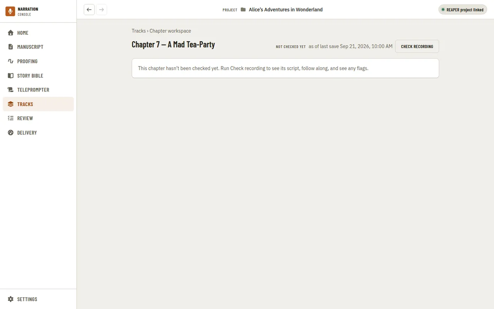
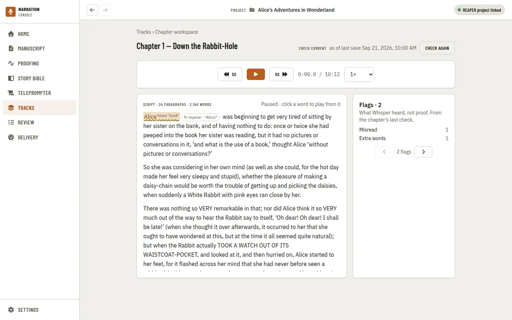
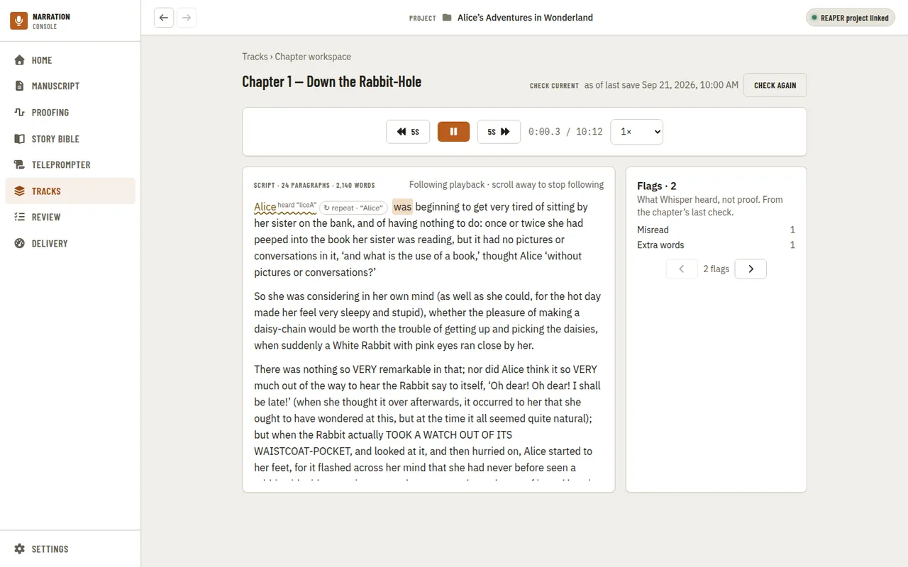
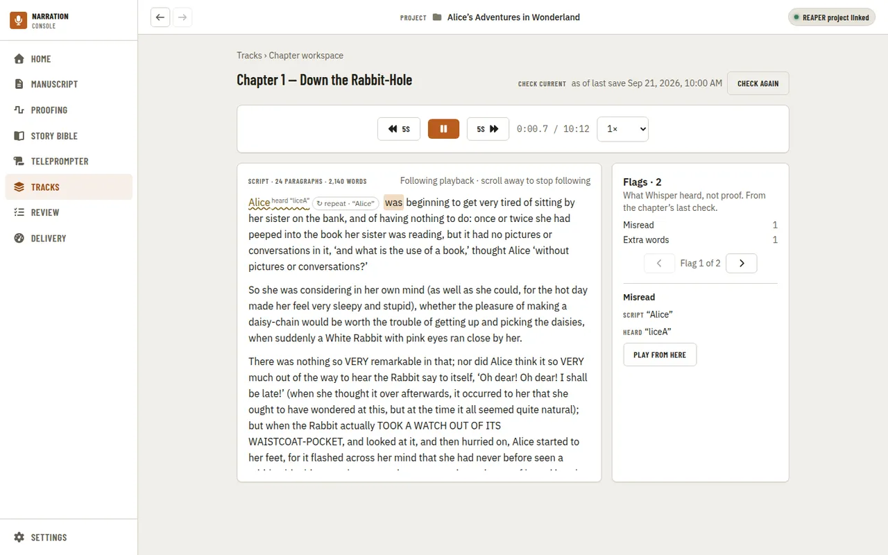

[Using the app](README.md) › Chapter workspace

# Chapter workspace

The chapter workspace is one screen to listen to a chapter's recording against its script, see where
the recording check found a problem, and click a word to hear it again. It has no nav item of its own
yet — open it from a linked chapter's **Open workspace** link, on [Tracks](tracks.md#linking-chapters-to-tracks)'
Chapter links table or [Home](home.md)'s chapter table. A chapter has to be linked to a REAPER track
first (see [Linking chapters to tracks](tracks.md#linking-chapters-to-tracks)).

If the chapter hasn't been checked yet, the workspace says so and offers **Check recording** — the
same check [Home](home.md) runs. There's no script or player until a check exists.

Once a current check exists, the workspace shows the chapter's script, a transport, and the check's
flags. The header names the check's state (current, or stale if an item changed since), and **as of
last save** — the workspace always reads the REAPER project as it was last saved, not whatever is
open live in REAPER right now.

The transport plays the chapter's recorded audio in the app itself, honouring each item's trims (the
same played range REAPER uses), so it works with REAPER closed. It has play/pause, skip back and
forward 5 seconds, and a playback speed from 0.75× to 2× that keeps pitch. Space bar toggles play and
pause; the left/right arrow keys move by word and up/down by paragraph; `[` and `]` move to the
previous and next flag.

As the chapter plays, the word being spoken is highlighted and the script scrolls to keep up. Scroll
the script yourself and it stops following until you scroll back to the highlighted word or press
**Resume following**.

Flags mark what the last check found, in place in the text: a skipped word is struck through, a word
read short or differently is underlined, and a misread word shows what was actually heard beneath it.
A run of words the check couldn't match to anything in the script shows as a small "repeat" chip
between the words it followed. The Flags panel on the right counts each kind and steps through them
one at a time — clicking Next or Previous plays the app from that flag's word, if it has one (a
skipped word was never recorded, so there's nothing to play).

Clicking any word with a recorded time seeks the app's own player there (starting about a second
before it, so you hear it in context). Reviewing a flag (accept, dismiss, defer, note) and sending
REAPER's own edit cursor to a word are later additions to this screen; for now the workspace only
plays what's already here in the app.

---

[← Tracks](tracks.md) · [Index](README.md) · [Review →](review.md)
