# App Navigation and Zoom Controls: Back, Forward and Zoom in the Header

**Source:** owner request of 2026-09-24: "Since the app is just a wrapper for a web page, I am able to zoom in and out. As such, I should also have the ability to reset my zoom. I should also have a way to go back and forward. Basically, it is probably a good idea to implement some browser controls in or above the top nav — specific ones that we know we want." Citations are `file:line` at `f49e241`; Wails source is `github.com/wailsapp/wails/v2@v2.16.0` (the version in `apps/desktop/go.mod:7`). Nothing here is built yet. The desktop behaviour described as "today" is read from the code and the Wails and WebView2 sources, not run in the packaged Windows app; the four things that need that run are listed in Research Summary and checked in Phase 0.

## Problem Statement

- **Zoom has no way back.** The narrator can make the whole app larger or smaller (by Ctrl+mouse wheel or a touchpad pinch, the only zoom gestures WebView2 leaves on in this app; see Evidence), but nothing shows the current level and nothing returns it to 100%. The only way back is to wheel until it looks right.
- **There is no back or forward.** The app is a set of pages the narrator moves between all day (Review → Manuscript at a line → Story Bible entry → back to Review). Each move is recorded in the webview's history, but nothing in the app lets the narrator walk that history: no button, and the keyboard and mouse shortcuts a browser would honour are switched off or unverified in this webview.
- **Browser behaviour leaks in half-way.** Because some browser gestures work (wheel zoom) and some do not (Ctrl+0, Alt+Left, F5, Ctrl+F), the app feels like a browser with parts missing. The owner asks for a deliberate set: the controls that are wanted, and no others.

## Evidence

**The desktop shell (Windows is the release gate, [ADR 0027](../adr/0027-windows-gates-and-creates-the-release.md); macOS and Linux are optional builds).**

- The window is created by `wails.Run` with no `Windows` options and no `Menu` (`apps/desktop/main.go:41-52`): only title, size, `MinWidth: 960` (`:45`), `MinHeight`, the asset server, the host binding and the single-instance lock. So no native menu bar exists, and every WebView2 setting is Wails' default.
- **Wails turns WebView2's browser shortcuts off.** Wails' Windows frontend calls `settings.PutAreBrowserAcceleratorKeysEnabled(false)` unconditionally (`internal/frontend/desktop/windows/frontend.go:596`). WebView2 documents that this disables the browser's own accelerator keys: find (Ctrl+F, F3), print (Ctrl+P), reload (Ctrl+R, F5), keyboard zoom (Ctrl+Plus, Ctrl+Minus and, by the same rule, Ctrl+0), DevTools, and the browser keys for Back, Forward and Search. So **Ctrl+0 does not reset zoom today, and Ctrl+=/Ctrl+- do not zoom** (to confirm in Phase 0). The keys are delivered to the page as ordinary `keydown` events instead, so the page can handle them itself.
- **Wheel and pinch zoom stay on because `Windows` is nil.** Zoom control and pinch zoom are only set when `opts.Windows != nil` (`frontend.go:578-589`: `PutZoomFactor` if `ZoomFactor > 0`, `PutIsZoomControlEnabled(opts.IsZoomControlEnabled)`, `PutIsPinchZoomEnabled(!opts.DisablePinchZoom)`). With nil options WebView2's defaults apply, which have zoom control (Ctrl+wheel) and pinch zoom on. This is what the owner uses. **A trap for this work:** the moment `main.go` passes any `windows.Options` (for example to set a startup `ZoomFactor`), `IsZoomControlEnabled` defaults to `false` and Ctrl+wheel zoom silently stops, unless it is set to `true` explicitly.
- **Wails v2 has no runtime zoom API.** `pkg/runtime/window.go` has size, position, fullscreen, theme, reload, `WindowExecJS` and print, but nothing for zoom; the only zoom knob is the startup `windows.Options.ZoomFactor` (`pkg/options/windows/windows.go:90-93`). The `edge.Chromium` object that could call `PutZoomFactor` at runtime is private to Wails' internal frontend. (Wails v3 has window zoom methods; moving to v3 is not in scope.) On macOS, `mac.Options.DisableZoom` is the window's green zoom button, not page zoom (`internal/frontend/desktop/darwin/window.go:125`).
- **Swipe navigation is off** (`frontend.go:557-563`, `EnableSwipeGestures` unset), so a touchpad two-finger swipe does not go back.
- **Zoom persistence is unknown.** Nothing in the app stores a zoom level. Whether WebView2 itself restores the last Ctrl+wheel level after a relaunch (from its user data folder, `%APPDATA%\narration-utils.exe` by Wails' default, `windows.go:99-101`) is not established from the sources; Phase 0 checks it. The working assumption is that it does not.
- **The mouse's back and forward buttons are unverified.** WebView2 may still navigate history on mouse buttons 4 and 5 even with accelerator keys off; nothing in the app handles them (a grep of `apps/ui/src` for `auxclick`, `popstate` and mouse `button` checks finds only a left-click filter at `AudiobookEstimatePanel.tsx:222`). If WebView2 does act on them, it moves history without the app's guards (below). Phase 0 checks it.
- **Reflow at high zoom is real and recorded.** Browser zoom divides the CSS pixel width: a 1280 px window at 400% is 320 CSS px, which is why Settings is also captured at 390 px (`apps/ui/tests/visual/viewports.ts:18-23`, [ADR 0061](../adr/0061-settings-states-are-also-captured-at-a-390px-reflow-width.md)); three layouts outside Settings are known cramped there (#148, #149, #150, `docs/design/design-system.md:99`).

**The UI's routing and history.**

- React Router 7 (`apps/ui/package.json:38`) with `BrowserRouter` (history API, not hash routing; `apps/ui/src/App.tsx:2,40`). A non-data router, so React Router's `useBlocker` is not available. React Router's browser history writes an `idx` into `window.history.state`, which is the cheapest way to know whether there is an in-app entry behind or ahead.
- **Every page move pushes one entry**: the nav calls `guardedNavigate` (`App.tsx:258-272`), which ends in `navigate(next)` (`:271`). Redirects replace: no manuscript → `navigate('/', { replace: true })` (`:262-264`) and each gated route's `<Navigate to="/" replace />` (`:294-321`).
- **`guardedNavigate` holds two guards that browser history would bypass:** leaving Settings with unsaved changes asks first (`:266-268`, the confirm at `:352-376`), and leaving Proofing resets the transcript run (`:270`). A `popstate` (the browser's back) goes around both.
- **In-page anchors do not add entries.** Deep links are anchors on the page path (`App.tsx:245-256`): `/manuscript#p123`, `#c<chapter>`, `/story-bible#<entity>`. Manuscript opens the target and then replaces the URL with plain `/manuscript` (`components/manuscript/Manuscript.tsx:310-336`, the replace at `:335`); Story Bible does the same (`components/storybible/Guide.tsx:136-139`). So Back from a deep-linked line goes to the page that linked it, and Forward returns to `/manuscript` without the anchor (the reader's own saved state, not the line). Settings keeps its anchor (`#credits`, `#delivery`, `App.tsx:29,345`), so Back to it reopens that category.
- **Not in history:** slide-overs and the navigation drawer (modal Base UI drawers, [ADR 0051](../adr/0051-the-slide-over-and-the-navigation-drawer-are-modal-base-ui-drawers.md)), every dialog ([ADR 0048](../adr/0048-every-dialog-is-one-modal-shell-and-confirms-are-alert-dialogs.md)), including the full-size Read aloud (reading mode) dialog, Manuscript chapter and search state, Story Bible selection, Review selection, Settings category clicks and tabs.
- **Project switches keep history.** Attaching another project only refreshes the bootstrap (`App.tsx:197-203`); entries from the previous project remain behind the current one. Without a project the app renders `ProjectPicker` with no shell at all (`App.tsx:250`), so header controls would not be there.
- **Nothing navigates the main frame off the app's origin.** External links open with `target="_blank"` (`components/assets/LocalAssetRow.tsx:184,203,207`, `AssetFacts.tsx:72-83`, `DemoBanner.tsx:24`) or through the host's `runtime.BrowserOpenURL` (`apps/desktop/dawcatalog.go:88`, `update.go:163`). Wails v2's Windows frontend registers no new-window handler, so `_blank` opens a separate WebView2 popup, not the main frame. So history holds only in-app entries, and Back stops at the first.
- **Existing key handling does not collide with Alt or Ctrl chords.** The teleprompter's follow cursor ignores any key with Ctrl, Alt or Meta (`components/teleprompter/useFollowCursor.ts:60`); the only other document listeners are Escape handlers (`primitives/Tooltip.tsx:81`, `manuscript/SelectionMenu.tsx:46`) and input-modality tracking (`primitives/inputModality.ts:8`).

**The header ("top nav") and the navigation.**

- `AppShell` (`components/layout/AppShell.tsx`) has the page list in a 224 px sidebar at ≥1400 px (`:130`), an icon rail from `md` to 1399 px (`:131-153`) and a modal drawer below `md` (`:154-156`). The top bar is a 56 px `<header>` inside `<main>` (`:159-181`): the "Open navigation" button below `md` (`:160-162`), the project name that truncates (`:163-167`), and the REAPER link pill on the right (`:168-180`). The header is not a `banner` landmark (it sits inside `main`).
- The aria suite pins the sidebar (`complementary`), the rail and the open drawer (`apps/ui/tests/aria/navigation.spec.ts:7-22`, [ADR 0065](../adr/0065-aria-snapshots-pin-the-role-trees-of-the-dialogs-the-slide-over-and-the-navigation.md)); none of them includes the header today, and the drawer snapshot shows `main` holding only the two toast regions while the drawer is open (`snapshots/navigation-drawer.aria.yml`).
- Every visual state and every guide screenshot shows the header, so a change there regenerates all of them, like adding a nav item (`docs/prds/README.md`, "Adding a nav item").
- **A related, separate control:** the Manuscript reader has its own Text size (`Manuscript.tsx:84,448-460`; "Text size is adjustable independently of the rest of the app", `docs/guides/using-the-app/manuscript.md:9`). App zoom multiplies with it.
- **Persistence precedent:** the theme is remembered in `localStorage` (`apps/ui/src/theme/theme.ts:31`, catalog `interactionFeedback.catalog.ts:543`); app-wide settings the host must read live in `%APPDATA%\narration-utils\global-settings.json` (`apps/desktop/internal/settings/store.go:184-192`), and some tools are global-only (`apps/desktop/app.go:1207-1212`). Settings already has a global **Appearance** category (`components/settings/Settings.tsx:26`).
- `hostAPIVersion` is 47 (`apps/desktop/app.go:52`, `apps/ui/src/hostApi.ts:2`). The highest ADR is 0170, so the next free is 0171 at this commit (sibling PRDs may claim it first; check at merge).

## Proposed Solution

Add a small, fixed set of controls to the existing header, and the shortcuts that go with them:

1. **Back and Forward** buttons at the left of the header (after the menu button below `md`), each disabled when there is no in-app page to go to. They walk page-level history only, through the same guards as the nav (unsaved Settings asks; leaving Proofing resets its run). Shortcuts: Alt+Left and Alt+Right, the mouse's back and forward buttons, and the keyboard's Browser Back and Forward keys (Cmd+[ and Cmd+] on macOS).
2. **Zoom out, a zoom level readout that resets, and Zoom in** at the right of the header, before the REAPER pill: `[−] 110% [+]`. The readout shows the current level and is itself the reset button ("Reset zoom to 100%"). Shortcuts: Ctrl+= / Ctrl++ / Ctrl+numpad +, Ctrl+- / Ctrl+numpad −, Ctrl+0 / Ctrl+numpad 0 (Cmd on macOS); Ctrl+wheel and pinch keep working and move the same level.
3. **Zoom is remembered** across launches (Q4), app-wide, not per project.
4. **Nothing else.** No reload, no find-in-page, no address bar, no copy link, no print, no native menu bar on Windows (Q2, Q7).

Zoom should be the webview's real page zoom, not a CSS imitation, because only real zoom reflows the layout through the app's breakpoints (the rail and the drawer), which the design and the visual suite already assume ([ADR 0061](../adr/0061-settings-states-are-also-captured-at-a-390px-reflow-width.md)). Wails v2 cannot change it at runtime, so Phase 0 settles the mechanism (Q3).

## Key Hypothesis

We believe a Back/Forward pair and a zoom group with a visible, resettable level in the header will let the narrator move between pages the way they already expect from a browser and recover from an accidental Ctrl+wheel in one click, without losing unsaved work. We'll know we're right when the owner uses Back after following a link (Review → Manuscript line) instead of the nav, resets zoom with one click or Ctrl+0, the level survives a relaunch, and no guarded state (unsaved Settings, a Proofing run) is lost by a Back.

## What We're NOT Building

- **No reload.** It throws away in-memory state (unsaved Settings, a running dialog's view, a teleprompter session) and fixes nothing a narrator can diagnose; Wails already turns F5 and Ctrl+R off. The error boundary and "reopen the page" messages cover the recovery case (`App.tsx:31`).
- **No find-in-page.** Ctrl+F stays off; the Manuscript has its own search (delivered, [the manuscript guide](../guides/using-the-app/manuscript.md)), and a browser find bar would not reach virtualised or collapsed text.
- **No address bar, copy link, print, home button (the nav has Home) or DevTools entry.**
- **No history for in-page state:** closing a slide-over, the previous chapter, the previous Story Bible entry or the previous Settings category are not Back steps (Q5 asks whether the owner wants any of them).
- **No per-page or per-project zoom**; one level for the app (Q4).
- **No change to the Manuscript's Text size** or its range; it stays independent and multiplies with app zoom.
- **No native menu bar on Windows**, and no macOS/Linux work beyond keeping those builds compiling (Q7).
- **No migration to Wails v3.**
- **No fix for the known 390 px layouts** (#148, #149, #150); they stay their own issues, but this PRD makes them easier to reach, so Q6 caps the zoom range accordingly.

## Success Metrics

| Metric | Target | How measured |
| --- | --- | --- |
| Back and Forward work and know their limits | Back is disabled on the first in-app page and after a project switch (Q8); Forward is disabled until a Back; both move exactly one page | `useAppHistory` unit tests; an `App.test.tsx` flow; visual states for the enabled and disabled pair |
| Guards hold | Back from dirty Settings shows the existing "Unsaved settings" confirm; Back from Proofing resets the run; the mouse's back button does the same | `App.test.tsx`; the Phase 0/1 scripted desktop run for the mouse button |
| Shortcuts | Alt+Left/Right, mouse buttons 4/5, Ctrl+=/-/0 (and numpad) do what the buttons do, and nothing while a modal dialog or drawer is open or while typing where the chord means something else | unit tests on the key handler; scripted desktop run |
| Zoom is visible and resettable | The level shows in the header at every width; one click or Ctrl+0 returns to 100% | unit tests; visual states at every viewport and the reflow width |
| Zoom is the real page zoom | At 175% on a 1280 px window the shell switches to the drawer layout, as it does under Ctrl+wheel today | scripted desktop run (Phase 2) |
| Zoom persists (if Q4 A) | Quit at 125%, relaunch, the app opens at 125% with no flash at 100% | scripted desktop run on Windows |
| No regression of wheel zoom | Ctrl+wheel and pinch still zoom after the change, and update the readout | scripted desktop run |
| Gate | `pnpm check`, the visual suite (axe included) and the aria suite green | `full-verification-gate` |

## Open Questions

- [ ] **Q1. Placement.** Options: (A) in the existing header: Back/Forward at its left, the zoom group at its right before the REAPER pill; (B) a thin browser-style strip above the header holding all of them; (C) Back/Forward in the header, zoom only in Settings > Appearance and the shortcuts. Recommendation: A. B costs 32 to 40 px of height on every page, which the Manuscript and the teleprompter reader need most; C hides the level, which is the thing the owner asked to see.
- [ ] **Q2. Which controls.** Recommended set: Back, Forward, Zoom out, zoom level (reset), Zoom in. Rejected: reload, find, print, copy link, address bar (see What We're NOT Building). Does the owner want any other? A fullscreen toggle (F11) for the teleprompter is the one plausible addition; recommendation: not here (its own request if wanted).
- [ ] **Q3. How zoom is applied (decided by the Phase 0 spike, owner approves the dependency choice).** Options: (A) **the webview's own zoom, through a small patch to Wails**: a pinned fork of `wailsapp/wails/v2` (a `replace` in `apps/desktop/go.mod`) that adds a runtime zoom get/set and a zoom-changed callback on Windows, offered upstream; real zoom, the same steps and reflow as Ctrl+wheel, but the app carries a fork until upstream takes it; (B) **the webview's own zoom without a fork**: the startup `ZoomFactor` option for persistence, plus Win32 from the host to drive WebView2's own zoom at runtime (for example sending it Ctrl+wheel input); no fork, but fragile and the steps are WebView2's; (C) **CSS zoom on the page root**, applied by the UI: no Go change and works in the browser demo, but the breakpoints do not move (the sidebar would stay at 224 px scaled up at 200% instead of giving way to the rail and drawer), it stacks with any Ctrl+wheel zoom unless native zoom is turned off, and pop-up positioning under CSS zoom needs checking. Recommendation: A, if the spike shows the patch is small (it should be: the `chromium` object already has `PutZoomFactor`); B only if the owner refuses a fork; C last, because it gives a different layout from the zoom the owner uses today.
- [ ] **Q4. Persist zoom across launches?** Options: (A) yes, one app-wide level stored in global settings (the host needs it before the window opens, so it is not `localStorage`); (B) no, every launch starts at 100%; (C) remember it, and add a "Default zoom" row in Settings > Appearance as well. Recommendation: A; C only if the owner wants to set it there.
- [ ] **Q5. What does Back step through?** Options: (A) pages only (the history the app already records: every nav move and every "go to" link); (B) pages, plus closing an open slide-over or drawer first (phone-style); (C) pages plus in-page positions (previous chapter, previous Story Bible entry). Recommendation: A. B conflicts with modal drawers owning Escape and focus (ADR 0051); C needs every page to write its selection into the URL, a much bigger change.
- [ ] **Q6. Zoom range and steps.** Options: (A) WebView2's own steps clamped to 50% to 200% (50, 67, 75, 80, 90, 100, 110, 125, 150, 175, 200); (B) the full browser range, 25% to 500%; (C) 67% to 300%. Recommendation: A: 200% meets WCAG 1.4.4 (resize text) and on the 960 px minimum window is 480 CSS px, above the 390 px reflow width the app is checked at; beyond that the known cramped layouts (#148 to #150) are reachable by a stray wheel. Ctrl+wheel is clamped to the same range (with Q3 A the host resets a level outside it).
- [ ] **Q7. Native menu entries.** Options: (A) none on any platform; the header and shortcuts are the whole surface; (B) on macOS only, the standard app menu with View > Zoom In / Zoom Out / Actual Size and History > Back / Forward (Wails `options.App.Menu`), which macOS users expect; (C) also a Windows menu bar (File/View/History strip above the webview). Recommendation: A now, B later if a macOS build is ever promoted; C adds window chrome for three commands that are already in the header.
- [ ] **Q8. Back across a project switch.** Options: (A) Back is disabled at the first page of the current project (earlier entries belong to another project and would open its pages with this project's data); (B) Back crosses the switch like a browser. Recommendation: A.
- [ ] **Q9. Is the reset always visible?** Options: (A) the level readout is always shown and is the reset button (disabled, reading 100%, at 100%); (B) the readout and reset appear only when zoom is not 100%; (C) always show `−`/`+`, show the level and reset only when not 100%. Recommendation: A: a control that appears and disappears moves the header's layout and is harder to find; a disabled "100%" also tells the narrator zoom exists.
- [ ] **Q10. Narrow widths.** At about 167% zoom on a 1280 px window, or 125% on the 960 px minimum, the shell drops below `md` and the header already holds the menu button, the project name and the pill. Options: (A) keep everything, let the project name truncate further, and shorten the pill to its dot plus an accessible name below `md`; (B) below `md`, fold the zoom group into one "Zoom 150%" menu button (a `Menu` with Zoom in, Zoom out, Reset); (C) below `md`, hide Forward. Recommendation: A if the 390 px capture fits, else B.

## Users & Context

The narrator at a desktop or laptop, usually with REAPER beside the app on one screen, sometimes with the app on a second monitor or a large TV where they zoom it up to read from a distance. They move between pages many times per session, often by a "go to" link (a finding to its manuscript line, an entity to its Story Bible entry), and expect a browser's Back to return them. They zoom with Ctrl+wheel today, sometimes by accident, and have no readout to tell them why everything looks too big.

## Solution Detail

| Priority | Capability | Phase |
| --- | --- | --- |
| Must | Verify today's behaviour on Windows (keys, mouse buttons, persistence) and settle the zoom mechanism (Q3) | 0 |
| Must | Back and Forward buttons in the header, disabled when there is nowhere to go (Q8) | 1 |
| Must | Back and Forward run the nav's guards (unsaved Settings, Proofing reset) | 1 |
| Must | Alt+Left/Right and mouse buttons 4/5 do the same; ignored while a modal is open | 1 |
| Must | Zoom out, level readout that resets, Zoom in in the header (Q1, Q9) | 2 |
| Must | Ctrl+= / Ctrl+- / Ctrl+0 (and numpad) handled by the app; Ctrl+wheel and pinch keep working and update the readout | 2 |
| Must | Zoom range and steps (Q6), clamped for every input | 2 |
| Should | Zoom remembered across launches, app-wide (Q4) | 3 |
| Should | Browser Back/Forward keyboard keys; Cmd+[ / Cmd+] and Cmd+=/-/0 on macOS | 1, 2 |
| Could | "Default zoom" row in Settings > Appearance (Q4 C) | 3 |
| Could | macOS app menu with View and History entries (Q7 B) | 4 |
| Won't | Reload, find-in-page, print, copy link, address bar, Windows menu bar, per-project zoom, in-page history | - |

**MVP scope:** Phases 0 to 2 (Back/Forward and zoom with a reset). Phase 3 if Q4 is A or C.

**User flow (recommended answers).** On Review the narrator presses "Go to line" on a finding; the Manuscript opens at the line. They press Back (or Alt+Left, or the mouse's back button) and are on Review again with the same finding selected as before (Review's own state; if Review does not keep it today, that is noted and not fixed here). Forward returns to the Manuscript, at the reader's saved position. They move to Settings, change a value, and press Back: the "Unsaved settings" confirm appears as it does for the nav. They Ctrl+wheel by accident; the header now reads `125%`; one click on it (or Ctrl+0) returns to `100%`, and the button turns disabled. They quit at 110% on purpose; the next launch opens at 110%.

**Header, left to right (≥ `md`):** `[←] [→]` · Project name · (flex space) · `[−] [110%] [+]` · REAPER pill. Below `md`: `[☰] [←] [→]` · Project name · zoom group (per Q10) · pill.

**Labels and names.** "Back" / "Forward" with a tooltip naming the shortcut ("Back (Alt+Left)"); the disabled state keeps its tooltip (`IconButton`'s focusable disabled state, [ADR 0053](../adr/0053-icon-buttons-text-fields-and-selects-wrap-the-native-controls.md)). "Zoom out", "Zoom in", and the readout button named "Reset zoom to 100% (now 125%)". A change of level is announced once, politely ("Zoom 125%"), not on every wheel notch (debounced).

## Technical Approach

**Feasibility.** Back/Forward is UI only. Zoom depends on Q3: with A or B it adds host bindings and one event; with C it is UI only. Keys arrive in the page because Wails disables WebView2's browser accelerators (`frontend.go:596`), so the page must implement Ctrl+0 and Alt+Left itself; this is the reason the shortcuts are in scope at all.

**History (Phase 1).**
- A `useAppHistory` hook in `apps/ui/src/hooks/` owns `canGoBack`, `canGoForward`, `back()` and `forward()`. It reads React Router's `idx` from `window.history.state` on every location change, keeps the highest `idx` seen (a push resets it to the current one, discarding forward entries) and a floor `idx` set when a project attaches (Q8). It does not use the Navigation API (`navigation.canGoBack`), which WebView2 has but the browser demo's other engines may not.
- `guardedNavigate` (`App.tsx:258-272`) grows a delta form: `back()` checks the same two guards before `navigate(-1)`: dirty Settings sets a pending move (the confirm at `App.tsx:352-376` then calls `navigate(-1)` or `navigate(1)` instead of a path), and leaving `/proofing` calls `transcriptReset`. Redirect targets need no guard: a gated route already replaces itself with `/` (`App.tsx:294-321`).
- One document-level listener, mounted in `AppRoutes`: `keydown` for Alt+Left/Right, `BrowserBack`/`BrowserForward`, and Cmd+[ / Cmd+] on macOS; `mouseup` (and `mousedown`, to stop WebView2 acting first) for buttons 3 and 4 with `preventDefault`. It does nothing when `event.defaultPrevented`, when a modal dialog or drawer is open (the page is `inert` behind it), or with Alt+Left inside a text field only if Phase 0 finds Windows gives it a meaning there.
- A `popstate` that the app did not start (the case Phase 0 may find for WebView2's own mouse-button handling, if `preventDefault` does not stop it) is detected by comparing `idx`; if it leaves dirty Settings, the hook pushes Settings back and shows the confirm, so no change is lost silently.

**Zoom (Phases 2 and 3), for Q3 A.**
- The Wails fork adds, on Windows, a runtime `WindowSetZoomFactor(ctx, f)`, `WindowGetZoomFactor(ctx)` and a zoom-changed callback (WebView2's `ZoomFactorChanged`). The host binding `WindowZoom` / `WindowSetZoom(factor)` clamps to the Q6 range and snaps to the step list; the callback emits a `window:zoom` event with `{ factor }` so a Ctrl+wheel change updates the readout. Non-Windows builds return "unsupported" and the UI hides the zoom group.
- `main.go` passes `Windows: &windows.Options{ZoomFactor: saved, IsZoomControlEnabled: true}` (the trap in Evidence) and leaves pinch on. The level is written to global settings under a global-only tool (for example `Appearance.zoom`, refused at project scope like `Updates`, `app.go:1207-1212`), debounced, and read before `wails.Run` so the first paint is at the saved level.
- **Wire contracts** (`CLAUDE.md`, `docs/architecture/wire-contracts.md`): a Zod schema for the binding result and the event in `apps/ui/src/api/schemas/`, a golden payload from a Go test in `tests/fixtures/contracts/` (`UPDATE_CONTRACTS=1`), a row in `wireContracts.test.ts`, a mock in `mockApi.ts` (with `?mockZoom=125` for the visual suite), and the event in the table the host's events use. `hostAPIVersion` 47 → 48 (a serialization point). The host binding reads no project services, but still goes on the accessor pattern and into `stressReaders` if it touches `h.services()` for settings.
- **For Q3 C** instead: a `useZoom` hook sets `document.documentElement.style.zoom`, stores the level in `localStorage` (like the theme), handles Ctrl+wheel itself with `preventDefault`, and `main.go` sets `IsZoomControlEnabled: false` and `DisablePinchZoom: true` so the two zooms never stack. No binding, no wire contract, no `hostAPIVersion` bump; the visual suite can then render real zoomed states in Playwright.

**UI pieces.** Built from existing primitives: `IconButton` for Back, Forward, `−`, `+`; `Button` (ghost, compact) for the readout; `TooltipTarget` for shortcut hints. No new primitive and no `styles.css` change are expected, so `design-spec-guard` and the atlas are not triggered; if a `ZoomControl` primitive turns out to be wanted (it would be used once), it brings its story and `design-spec-guard`. No raw `<button>` (the ceilings in `rawNatives.test.ts`). New interaction catalog rows (`interactionFeedback.catalog.ts`): Back, Forward (instant, no feedback beyond the page change), the three zoom buttons (instant, the readout is the feedback), and the zoom binding and its persistence.

**Visual and aria suites.**
- The header changes on every state, so every capture and every guide screenshot (`docs/images/ui/`, `doc-screenshots.json`) regenerates; land Phase 1 and Phase 2 each as its own screenshot-regenerating PR, not alongside a nav change.
- New catalog rows (in `state-catalog.ts`, driven in `app.drivers.ts`): `shell/history-enabled` (after one navigation, Back enabled, Forward disabled), `shell/history-forward` (after a Back, both enabled) and `shell/zoom-level` (`?mockZoom=125`, the readout enabled). The default states already show both history buttons disabled and the readout at 100%, so they need no row of their own. Each new row takes `extraViewports: [REFLOW_VIEWPORT]`, because the header at 390 px is exactly what the narrator sees at high zoom, and today no Home or shell state is captured there ([ADR 0037](../adr/0037-visual-suite-captures-no-phone-viewport.md), ADR 0061); this is a declared, reasoned extension of the reflow rows, recorded in the ADR. Collapsed-control and overflow checks then gate the header at every width.
- The zoomed layouts themselves need no new matrix: with real zoom (Q3 A or B), the app at zoom Z in a window W wide is the app at W/Z CSS px, which the matrix already covers: 1280 px at 125% is `small-desktop` (1024), the 960 px minimum at 125% is `tablet` (768), and 400% is `reflow` (320 to 390). With Q3 C this equivalence does not hold and the rows must be captured with the CSS zoom applied.
- Aria: add `navigation-header.aria.yml` in `tests/aria/navigation.spec.ts` pinning the header's controls (a `toolbar` or `group` named "Page history" with Back and Forward, and one named "Zoom" with its three buttons) at the desktop width, because Back and Forward are navigation and ADR 0065 pins the navigation's role trees. Check that the drawer snapshot (`navigation-drawer.aria.yml`) is unchanged: the header is behind the modal drawer and hidden from the tree.

**Security and trust boundaries.** Back and Forward only call the history API inside the app's own origin; the main frame never leaves it (Evidence), and `idx` stops Back at the first entry. Record that in the threat model's webview section (row 3, `docs/architecture/threat-model.md:78-84`) as the reason in-app history needs no allow-list. A Wails fork (Q3 A) is a dependency change: pin it to a commit, record it in the threat model and say in `SECURITY.md` that the webview host is a patched Wails (its "third-party dependency" paragraph, `SECURITY.md:46`), and keep the patch minimal and upstreamable.

**Risks.**
1. Passing `windows.Options` turns Ctrl+wheel zoom off unless `IsZoomControlEnabled` is set (Evidence). A desktop check in Phase 2 covers it.
2. A fork of Wails must be rebased on each Wails update; the patch is small, and the upstream PR is the exit.
3. WebView2's own mouse-button navigation, if it exists and cannot be prevented, can bypass the Settings guard; the `popstate` recovery above covers it, and Phase 0 tells us whether it is needed.
4. High zoom exposes the three known 390 px layouts (#148 to #150); Q6 A keeps the in-app range above them on every window size the shell allows.
5. Every screenshot changes twice (once per phase), colliding with any PRD that re-captures at the same time.

## Implementation Phases

| # | Phase | Description | Status | Parallel | Depends | PRP Plan |
| --- | --- | --- | --- | --- | --- | --- |
| 0 | Verify today and choose the zoom mechanism | Scripted Windows run: which zoom gestures work, whether zoom persists, whether mouse buttons 4/5 and Alt+Left navigate; prototype Q3 A (a Wails patch) and measure its size; record the result and the choice | pending | 1 | - | - |
| 1 | Back and Forward | `useAppHistory`, header buttons, guarded back/forward, Alt+Left/Right, mouse buttons, project floor; tests, visual rows (with reflow), aria header snapshot, catalog rows, guide, threat-model note | pending | 0 | Q1, Q5, Q8 | - |
| 2 | Zoom controls | The mechanism from Phase 0, bindings and event (Q3 A/B) or `useZoom` (C), header group, Ctrl shortcuts, clamping (Q6), announcements, wire contracts, visual rows, aria, catalog, guide | pending | - | 0, 1, Q1, Q3, Q6, Q9, Q10 | - |
| 3 | Remember zoom | Global-only setting written on change, read before `wails.Run` (Q3 A/B) or `localStorage` (C); optional Settings > Appearance row (Q4 C) | pending | - | 2, Q4 | - |
| 4 | macOS app menu (only if Q7 B) | Wails `Menu` with View (Zoom In, Zoom Out, Actual Size) and History (Back, Forward), calling the same UI actions through an event | pending | - | 2, Q7 | - |

### Phase Details

**Phase 0 - Verify today and choose the zoom mechanism**
- **Scope:** on a copy of a project with an isolated app data folder, run the packaged Windows build and record: Ctrl+wheel, pinch, Ctrl+=, Ctrl+-, Ctrl+0 (expected: first two only); quit at 150% and relaunch (does it come back?); mouse buttons 4/5 and Alt+Left/Right after two page moves (do they navigate, and do they bypass the Settings confirm?); whether `preventDefault` on the mouse buttons stops WebView2. Prototype Q3 A in a scratch branch (a Wails patch exposing `PutZoomFactor` and `ZoomFactorChanged`) and note its line count; if refused, try B. Anything needing the owner's hardware (a touchpad pinch, a mouse with side buttons) is marked pending for the owner.
- **Output:** a short note in `docs/research/` with the observations, and the owner's answer to Q3 recorded in the Decisions Log. No product code.

**Phase 1 - Back and Forward**
- **Scope:** new `apps/ui/src/hooks/useAppHistory.ts` and its tests (push, back, forward, redirect-replace, project floor, forward cleared by a push); `App.tsx` (guarded delta moves, the pending confirm taking a delta, the global key and mouse listener, the floor reset on attach); `AppShell.tsx` header (two `IconButton`s and their tooltips; new props `history`); `AppShell.test.tsx`, `App.test.tsx` (dirty Settings then Back shows the confirm; Proofing then Back resets); `state-catalog.ts`/`app.drivers.ts` rows; `tests/aria/navigation.spec.ts` and the new snapshot; `interactionFeedback.catalog.ts`; `docs/guides/using-the-app/` (a short "Moving around" note, and the shortcuts); the threat model note; all doc screenshots.
- **Success signal:** metrics rows 1 to 3; the visual rows green at every viewport and at reflow with the PNGs looked at.
- **Verification:** TDD on the hook first; `pnpm check`; `npx playwright test tests/visual/app.spec.ts -g "shell.*history"` and every PNG under `apps/ui/screenshots/app/shell/`; `pnpm --dir apps/ui run aria`; a scripted desktop run for the mouse buttons (owner-pending if it needs their mouse).

**Phase 2 - Zoom controls**
- **Scope (Q3 A):** `apps/desktop/go.mod` `replace` to the pinned fork; a new `apps/desktop/bindings_window.go` with `WindowZoom`/`WindowSetZoom` and the event, their Go tests and contract golden; `main.go` `windows.Options` with `IsZoomControlEnabled: true`; `hostAPIVersion` bump in its three places and `Host.{js,d.ts}`; `apps/ui/src/api/` contract, schema, `wailsClient.ts`, `mockApi.ts` (`?mockZoom`), `wireContracts.test.ts`; a `useZoom` hook (level, step up and down, reset, debounced announcement); the header group; Ctrl key handling in the Phase 1 listener; catalog rows; visual row `shell/zoom-level` with reflow; the aria header snapshot updated; the guide; `SECURITY.md` and threat model for the fork. **(Q3 C):** only the UI half, plus `main.go` turning native zoom off.
- **Success signal:** metrics rows 3 to 5 and 7.
- **Verification:** as Phase 1, plus a scripted Windows run: Ctrl+wheel moves the readout, the readout resets, 175% on a 1280 px window shows the drawer layout, and the range is clamped.

**Phase 3 - Remember zoom**
- **Scope:** the global-only setting (a `fieldSchemas` entry only if Q4 C), its store write and the read before `wails.Run`; a Go test that a project-scope save is refused and that an out-of-range stored value is clamped; the Settings Appearance row if Q4 C (visual row `settings/global-appearance` re-captured); guide.
- **Success signal:** metrics row 6.

**Phase 4 - macOS app menu (only if Q7 B)**
- **Scope:** `main.go` `Menu` for darwin builds only, whose items emit an event the UI's history and zoom hooks already handle; no Windows change. Verified on the optional macOS build, owner-pending.

### Parallelism Notes

Phase 0 (a desktop run and a scratch prototype) and Phase 1 (UI only) can run in parallel. Phase 2 edits the same header and listener as Phase 1 and needs Phase 0's answer, so it follows both. Phases 3 and 4 follow Phase 2. Phases 1 and 2 each regenerate every screenshot, so each should land alone, not in the same window as a nav change or another PRD's re-capture.

**Parallel-session compatibility**

| Phase | Files and areas touched | Collision risk |
| --- | --- | --- |
| 0 | `docs/research/` (new note), a scratch branch of the Wails fork | None |
| 1 | `apps/ui/src/App.tsx`, `App.test.tsx`, `components/layout/AppShell.tsx`, `AppShell.test.tsx`, new `hooks/useAppHistory.ts`, `interactionFeedback.catalog.ts`, `tests/visual/{state-catalog.ts,app.drivers.ts}`, `tests/aria/navigation.spec.ts` and `snapshots/`, every `docs/images/ui/*` screenshot, `docs/guides/using-the-app/`, `docs/architecture/threat-model.md` | High: any PRD adding or removing a nav item or editing the header ([Teleprompter Manuscript Integration](teleprompter-manuscript-integration.prd.md) Phase 13, [Project Workspace](project-workspace-and-daw-link.prd.md) phases 4 and 8, [Review Dashboard](review-dashboard-and-findings-adoption.prd.md), [REAPER Automation](reaper-automation-follow-through.prd.md) Phase 7, [DAW Chapter-Track Auto-Sync](daw-chapter-track-auto-sync.prd.md) if it changes the pill); any PRD editing `App.tsx` routes or `guardedNavigate`; every PRD that re-captures screenshots |
| 2 | Phase 1's UI files again, `apps/desktop/{main.go,go.mod,go.sum,app.go,app_test.go}`, new `bindings_window.go` and tests, `hostrace_test.go` (if it reads services), `apps/ui/src/{hostApi.ts,api/*,wailsClient.ts,mockApi.ts}`, `api/wireContracts.test.ts`, `tests/fixtures/contracts/`, `Host.{js,d.ts}`, `SECURITY.md`, threat model | `hostAPIVersion` (every PRD adding a binding); `go.mod` (any dependency bump, and every PRD if a Wails fork lands); `main.go` (release-readiness installer work); the same UI and screenshot collisions as Phase 1 |
| 3 | `apps/desktop/main.go`, `internal/settings/` or `app.go` settings rules, `components/settings/Settings.tsx` (only if Q4 C), guide | Any PRD editing `settingsSchemas`/`fieldSchemas` or the Settings Appearance category |
| 4 | `apps/desktop/main.go` (darwin menu) | Low; the optional macOS build only |

Cross-cutting: each phase follows `CLAUDE.md`: an issue and `Closes #<n>`; `change-impact-scan` on `AppShell.tsx`, `App.tsx` and (Phase 2) the host bindings and `go.mod`; TDD; `full-verification-gate` (`pnpm check`, the visual suite with PNGs looked at for every viewport and the reflow width, `pnpm --dir apps/ui run aria` since the navigation changes); `design-spec-guard` only if a primitive or `styles.css` changes; `feature-cleanup` including the trust-boundary check (the webview and, with a fork, the dependency).

## Decisions Log

| Decision | Choice | Alternatives | Rationale |
| --- | --- | --- | --- |
| Which controls (proposed, Q2) | Back, Forward, zoom out, level/reset, zoom in | Reload, find, print, copy link, address bar | Each rejected control either loses state (reload) or duplicates an app feature (find) or has no use in a single-origin app |
| Where (proposed, Q1 A) | In the existing header | A strip above it; Settings only | No height cost; the level stays visible |
| History scope (proposed, Q5 A) | Pages only, through the nav's guards | Drawers and in-page positions as steps | Matches what the app already records; keeps ADR 0051's modal behaviour |
| Zoom mechanism (proposed, Q3 A; decided in Phase 0) | The webview's own zoom via a minimal Wails patch | Win32 input; CSS `zoom` | Only real zoom reflows through the breakpoints the design and ADR 0061 assume |
| Persistence (proposed, Q4 A) | One app-wide level in global settings | `localStorage`; none | The host must apply it before first paint |
| ADRs expected | One ADR at Phase 2 (next free number at merge, 0171 at this commit): "The app has page-level Back and Forward and real webview zoom in the header, its shortcuts are handled by the page because WebView2's browser keys are off, and the header is captured at the reflow width". A second only if the Wails fork is adopted (a dependency decision) | Fold the fork into the same ADR | ADRs are immutable; a fork is a decision someone will want to find by itself |

## Research Summary

- **Read:** `apps/desktop/main.go`, `wails.json`, `go.mod`, `app.go` (`hostAPIVersion`, settings scopes), `internal/settings/store.go`, `dawcatalog.go`, `update.go`; Wails v2.16.0 `internal/frontend/desktop/windows/frontend.go` (accelerators, zoom, swipe, new windows), `pkg/options/windows/windows.go`, `pkg/runtime/window.go`, the darwin window options; `apps/ui/src/App.tsx`, `main.tsx`, `components/layout/AppShell.tsx`, `components/manuscript/Manuscript.tsx`, `components/storybible/Guide.tsx`, `components/settings/Settings.tsx`, `components/teleprompter/useFollowCursor.ts`, `theme/theme.ts`, the external-link call sites; `tests/visual/viewports.ts`, `state-catalog.ts`, `tests/aria/navigation.spec.ts` and its snapshots, `helpers.ts`; ADRs 0027, 0037, 0048, 0051, 0053, 0061, 0065; `docs/design/design-system.md`, `docs/architecture/threat-model.md`, `docs/prds/README.md`.
- **Not done (Phase 0 does them):** the packaged Windows app was not run, so four things are inferred, not observed: (1) Ctrl+=/-/0 do nothing today (inferred from `PutAreBrowserAcceleratorKeysEnabled(false)` and WebView2's documentation); (2) whether a Ctrl+wheel level survives a relaunch; (3) whether mouse buttons 4/5 navigate, and whether `preventDefault` stops them; (4) Alt+Left/Right (expected: nothing). The owner can answer (2) and (3) in a minute: zoom with Ctrl+wheel, quit and reopen; and press the mouse's back button after moving from Home to Settings.

## Visual Spec

Mockups approved by the owner on 2026-09-24. They were rendered from the real app (dark theme, the app's own fonts and components) with throwaway edits and invented sample data, so names, numbers and body text are placeholders; the layout, controls, states and wording are the spec. Each shows the recommended answer to the open questions unless its caption says it is an alternative. Where a mockup and the text above disagree, raise it before building rather than silently following either.

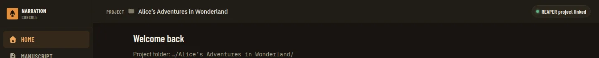

*Before header desktop* (`00-before-header-desktop.webp`)

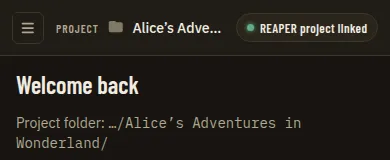

*Before header reflow* (`00-before-header-reflow.webp`)

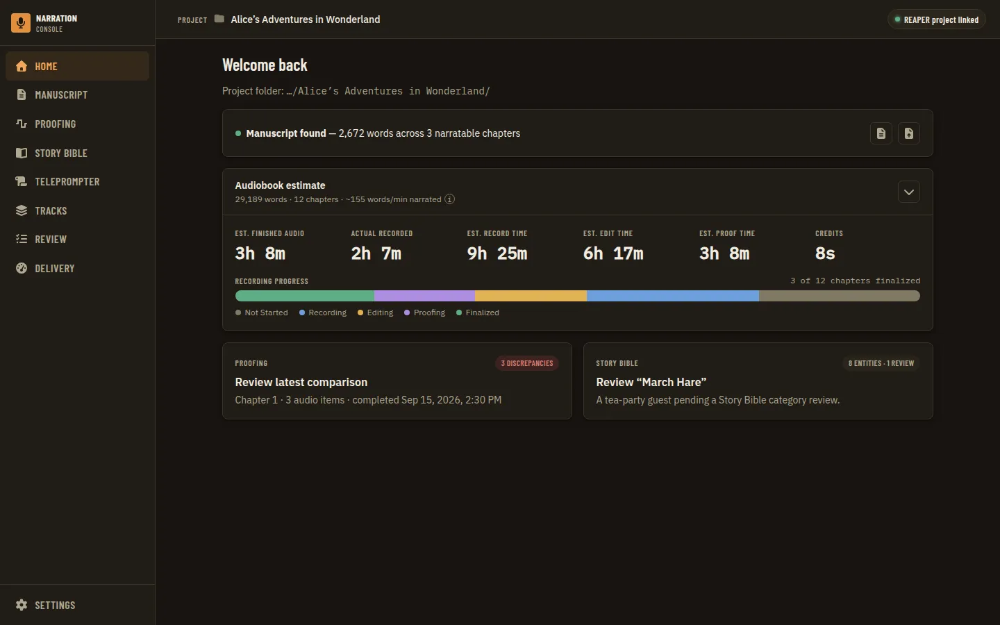

*Before* (`00-before.webp`)

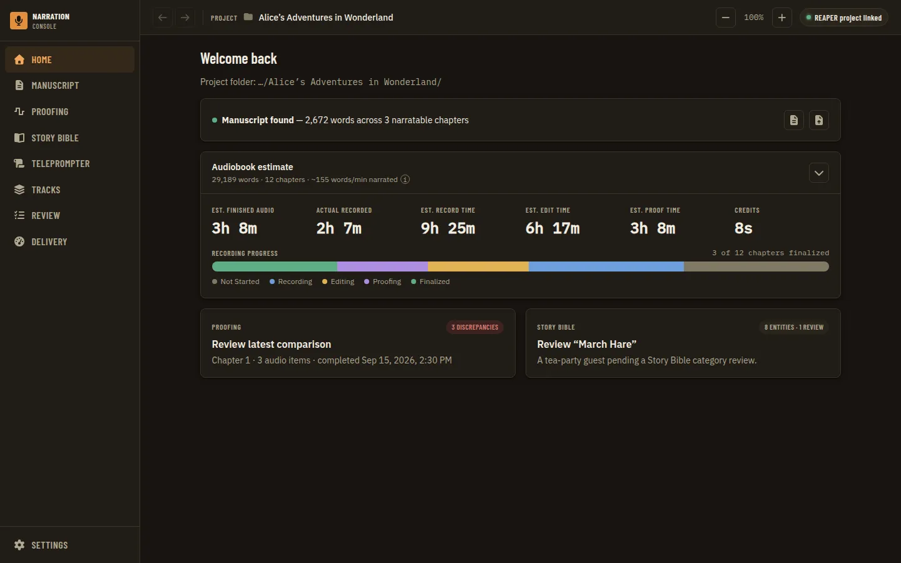

*Desktop default first page 100* (`01-desktop-default-first-page-100.webp`)

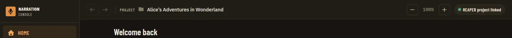

*Header crop default* (`01a-header-crop-default.webp`)

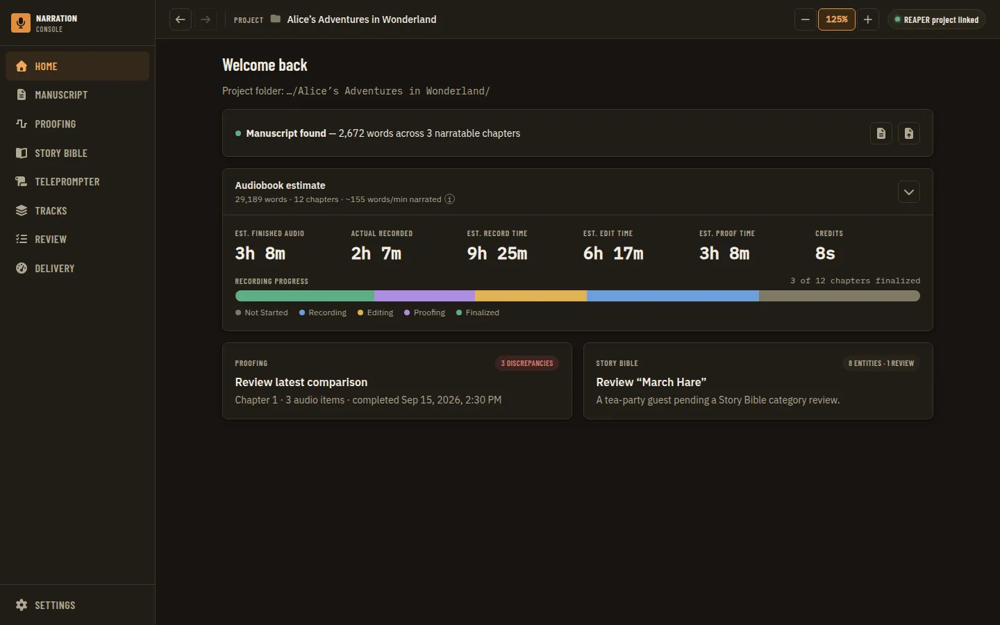

*Desktop back enabled zoom 125* (`02-desktop-back-enabled-zoom-125.webp`)

*Header crop back enabled zoom 125* (`02a-header-crop-back-enabled-zoom-125.webp`)

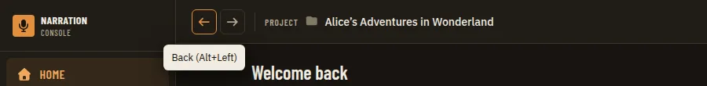

*Tooltip back shortcut* (`03-tooltip-back-shortcut.webp`)

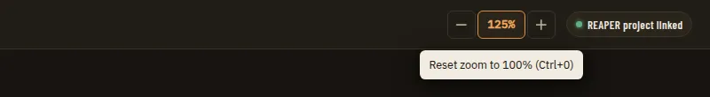

*Tooltip reset zoom* (`04-tooltip-reset-zoom.webp`)

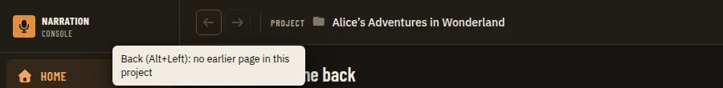

*Tooltip back disabled* (`05-tooltip-back-disabled.webp`)

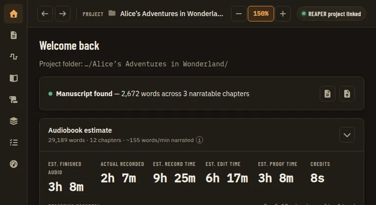

*Tablet 768 both enabled zoom 150* (`06-tablet-768-both-enabled-zoom-150.webp`)

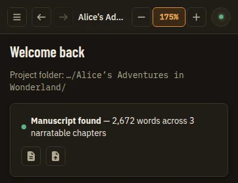

*Reflow 390 header optionA* (`07-reflow-390-header-optionA.webp`)

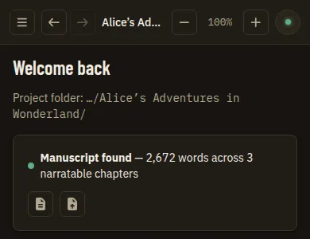

*Reflow 390 header optionA 100* (`07a-reflow-390-header-optionA-100.webp`)

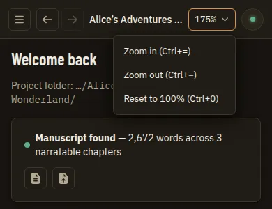

*Alternative (not the recommendation): Reflow 390 zoom menu optionB* (`07b-alt-reflow-390-zoom-menu-optionB.webp`)

*Header crop max 200* (`08-header-crop-max-200.webp`)

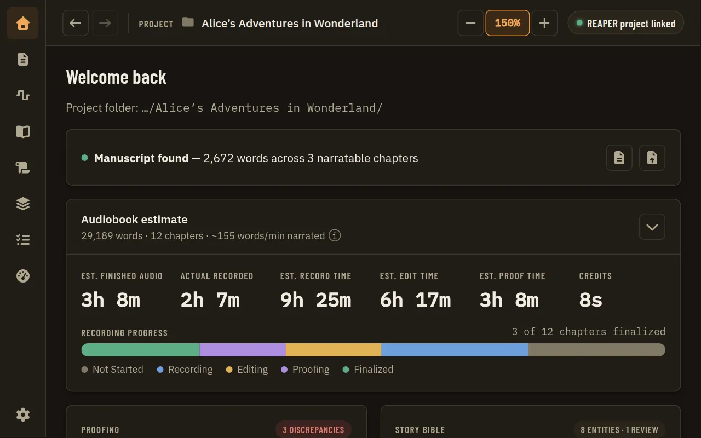

*Window 1280 at 150 real zoom* (`09-window-1280-at-150-real-zoom.webp`)
