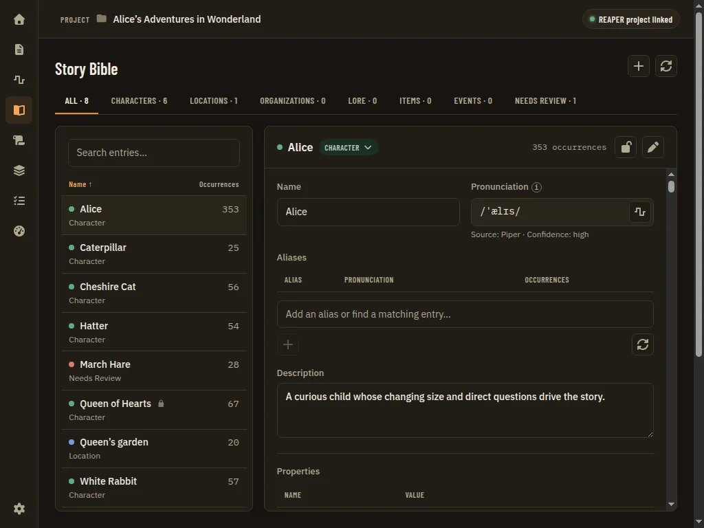
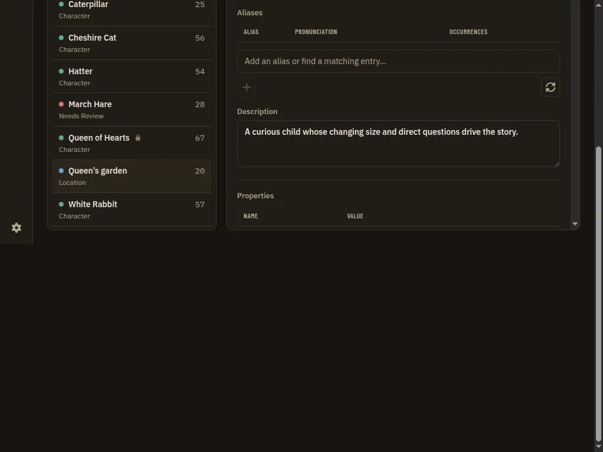
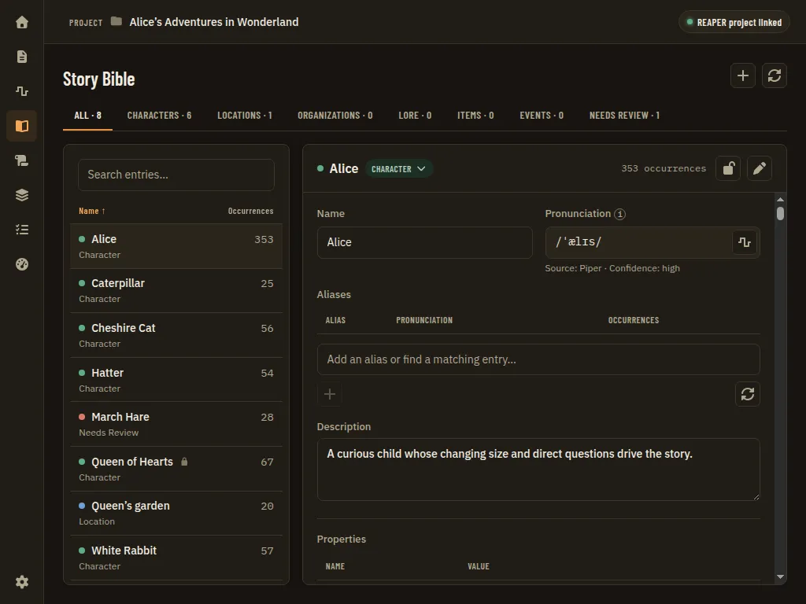

# App Shell Vertical Overflow: One Scroll Container, No Document Scrollbar

**Source:** owner report of 2026-09-24: "I see a scrollbar on the right on some pages that allows me to scroll past the bounds of the app." The owner's screenshot of the Read aloud dialog shows a full-height browser scrollbar at the far right edge of the window, outside the app's own layout. The owner also zooms the WebView with Ctrl+wheel. Citations are `file:line` at `87b497f`. Base UI is `@base-ui/react` 1.8.0 with `@base-ui/utils` 0.4.0 (the lockfile's versions). Nothing here is built yet.

## Problem Statement

- The app is meant to have one scroll container: the page area under the header (`AppShell.tsx:182`). The window itself, the document, should never scroll.
- On 63 of the 249 captured states the document is taller than the window, by 23 to 1,000 px. Where that happens:
  - Windows' WebView2 draws a classic 15-17 px scrollbar at the right edge of the window, outside the app's layout.
  - Scrolling that scrollbar, or wheeling after the page area has reached its end, moves the whole app up (header, nav rail and all) and shows blank page below it. That is the owner's "scroll past the bounds of the app".
- When a dialog or slide-over opens over such a page, Base UI's scroll lock keeps the scrollbar's space as an empty, full-height gutter at the right edge for as long as the dialog is open. That matches the owner's Read aloud screenshot.
- Whether a page overflows depends on the window height and the zoom level, which is why the owner sees it on "some pages", and more often when zoomed in.

## Evidence

**The shell is locked to the viewport, so the shell itself does not cause the overflow.**
- `App.tsx:275` is `h-screen overflow-hidden`. `AppShell.tsx:127` is `flex h-full flex-col overflow-hidden`. Its row (`:129`) and `<main>` (`:158`) are `overflow-hidden` too. The page area is `scroll-chrome-hidden flex-1 overflow-y-auto` (`:182`), and it hides its own scrollbar (`styles.css`, `.scroll-chrome-hidden`).
- `html`, `body` and `#root` set no height and no `overflow` (`styles.css:140-145`, `index.html:28`).
- Rounding under a fractional zoom does not cause it either. At device scale factors of 1.1 to 2.2 with odd window sizes, the visual viewport was fractional (845.45 px) but `scrollHeight` always equalled `clientHeight` on Home (scratch probe, headless Chromium).

**Root cause: absolutely positioned elements escape the shell.**
- Nothing between the page content and `<html>` is positioned: `App.tsx:275`, `AppShell.tsx:127/129/158/182` and `#root` (`isolate` only) are all `position: static`. So an element with `position: absolute` inside a page takes the initial containing block as its containing block.
- `overflow: hidden` or `auto` clips only descendants whose containing block is inside the clipping box. So these elements are not clipped by the shell or scrolled by the page area. They sit at their first layout position in document coordinates and extend the document's scrollable area.
- Measured: with the page area scrolled, the escaped span stayed where it was while the rest of the content moved.
- The escaping elements found are all Tailwind `sr-only` spans (`position: absolute`, 1 px):
  - **`TableHeader`'s `hiddenLabel`** (`primitives/Table.tsx:117`), the name of a column with no visible header. Used by Story Bible relationships ("Remove", `GuideDetail.tsx:730`), Tracks ("Link", `ChapterLinksTable.tsx:84`), the Home audiobook estimate ("Recording check", `AudiobookEstimatePanel.tsx:202`) and three other tables.
  - **Take comparison** misread words (`review/TakeComparisonView.tsx:36`).
  - The same risk applies to `ImportReview.tsx:165` and to every Base UI hidden form input: Checkbox, Switch, Radio and Select render `visuallyHiddenInput`, which is `position: absolute` (`@base-ui/utils/visuallyHidden.mjs:17-20`). These can escape wherever they are not inside a positioned box.
- A scratch probe (`.scroll-chrome-hidden{position:relative}`, or `position: relative` on the `App.tsx:275` root) took the overflow to 0 on Story Bible (353 px before, 1024×768) and on Home at 125% zoom (35 px before). Making the one `th` relative fixed the table case alone.

**Why a dialog leaves a full-height gutter.**
- Base UI's modal scroll lock checks whether the document shows an inset scrollbar (`innerWidth - clientWidth > 0`, `useScrollLock.mjs:22-29`). If it does, the lock sets `scrollbar-gutter: stable` on `<html>` and `overflow: hidden` on the scroller (`:125-136`).
- Measured on Home at 1024×768 and 125% zoom with the stage slide-over open: `<html style="scrollbar-gutter: stable">`, `<body style="overflow: hidden">`, and the document still 35 px taller than the window.
- When the document does not overflow, the lock only sets `overflow: hidden` and leaves no gutter. So the gutter is a symptom of the overflow underneath, and the fix below removes both.
- Read aloud is a full-size `Dialog` (`ReadAloudDialog.tsx:118`, `Dialog.tsx:94-105`, ADR 0094). It opens only from the Manuscript page. No mock Manuscript state overflowed in the sweep, so the owner's instance must come from content the mock does not have. That is not reproduced (see Research Summary), and Phase 1 checks it on the owner's project.

**Measured reproduction.**
- Method: a scratch Playwright sweep over every driven row of `tests/visual/state-catalog.ts` (249 states), using the row's own driver.
- Sizes: the three suite viewports at 100%, plus desktop (1440×900) at 90%, 110%, 125% and 150%, plus small-desktop (1024×768) at 125%. Zoom was emulated as a device scale factor, with the CSS viewport divided by the zoom, which is what WebView2's Ctrl+wheel does. Scrollbars were visible (not hidden).
- Measure: `documentElement.scrollHeight - clientHeight` after the driver. 1,992 captures, 0 errors.

| Page / states | Overflow (px) | Where | Escaping element |
| --- | --- | --- | --- |
| `storybible/*`: 20 states (`category-*`, `entity-selected`, `entry-*`, `alias-typeahead`, `delete-confirm`, `rebuild-running`, `language-model-*`, `voice-download-*`), and `global/confirm-dialog` (drawn over Story Bible) | 121-996 | Every viewport and zoom (`entry-needs-review` and `entry-pronunciation-missing` only from small-desktop 100% and desktop 110% up) | Relationships `hiddenLabel` "Remove" |
| `review/take-comparison`, `take-comparison-measurements` | 23-505 | Every viewport and zoom | Take comparison `sr-only` |
| `tracks/*`: 33 states | 51-69 | Desktop 150%, small-desktop 125% | Chapter links `hiddenLabel` "Link" |
| `home/stage-suggestions`, `stage-dismissed`, `stage-evidence-{recommended,not-ready,unknown,changed}` | 35 | Small-desktop 125% (819×614 CSS px) | Audiobook estimate `hiddenLabel` "Recording check" |

By size: small-desktop 125% 63 states, desktop 150% 57, desktop 100% 22, the other sizes 22-24 each. The other 186 states, including every `manuscript/read-aloud-*` and `settings/*` state, stayed at 0 px at every size measured.

**The visual suite cannot see this.**
- `lib/capture.ts:44-46` measures only `scrollWidth - clientWidth`, and fails over `OVERFLOW_TOLERANCE_PX = 1` (`validators.ts:105`, `capture.ts:196`).
- Playwright's headless Chromium hides scrollbars by default, so the screenshots never show the document scrollbar. The picture looks right while the page scrolls.
- Both files are vendored from `tools/ui-atlas-kit` ("do not edit here", `capture.ts:1`). The kit's `fullPage` rows (`lib/types.ts`) assume a document that scrolls, so a vertical gate has to be opt-in per app.

**`overflow: hidden` on the document is not enough on its own.**
- With `html, body { overflow: hidden }` injected, Home at 125% still reported `scrollHeight` 632 against 614. A programmatic `scrollTo` still moved the whole shell up 18 px.
- `scrollIntoView` does the same. It scrolls every scrollable ancestor, including an `overflow: hidden` document, and the app calls it for the teleprompter's follow cursor (`useFollowCursor.ts:55`) and for Manuscript jumps (`Manuscript.tsx:286`).
- So the containing block has to be fixed first. Hiding the document's overflow is a second guard, not the fix.

**Pages that scroll the document on purpose.**
- `StartupScreen.tsx:39` and `ProjectPicker.tsx:112` are `min-h-screen` under the `DemoBanner`. Their content, for example a long recents list at a short window, scrolls the document by design, and the demo banner adds its own height above `min-h-screen`.
- They have to get a scroll container of their own before the document can be locked.

**Sensitivity to CSS zoom** (relevant to the sibling [App Navigation and Zoom Controls](app-navigation-and-zoom-controls.prd.md), Q3 option C).
- `h-screen` is `100vh`, and `100vh` inside a CSS-zoomed `<html>` is scaled by the zoom. With `document.documentElement.style.zoom` set on Home at 1440×900:
  - 110%: the document overflowed by 90 px.
  - 125%: by 225 px.
  - 150%: by 450 px.
  - 90%: the shell stopped 90 px short of the window bottom.
- `100dvh` behaved the same. A `height: 100%` chain (`html, body, #root` and the shell) stayed at exactly the window height at both zoom levels.
- WebView2's real zoom (the device scale factor emulation above) does not have this problem.

## Proposed Solution

1. **Give the shell a containing block, and make the document never scroll.**
   - The shell root (`App.tsx:275`) and the page area (`AppShell.tsx:182`) become `position: relative`. Absolutely positioned descendants are then laid out, clipped and scrolled inside the page area, not against the window. The page area is the one that matters, because it makes an `sr-only` label scroll with its row.
   - Size the shell with a `height: 100%` chain from `html`/`body`/`#root` instead of `100vh` (Q2). This holds under any zoom mechanism the sibling PRD picks.
2. **Fix the known offenders at their source too.** `TableHeader`'s `th` becomes `relative` so its hidden label is anchored to its cell. That covers a table inside a nested scroller that is not positioned. `TakeComparisonView` gets the same treatment on its nearest box.
3. **One scroll container everywhere.** `StartupScreen` and `ProjectPicker` scroll in their own full-height container (`h-full overflow-y-auto`) instead of the document. `SlideOver`'s `h-screen` (`SlideOver.tsx:52`) becomes `h-full` of its fixed viewport.
4. **Then lock the document.** `html, body { height: 100%; overflow: hidden; }` in `styles.css`'s base layer, once nothing needs document scroll. Base UI then finds the page already locked (`useScrollLock.mjs:227-246`) and adds no gutter.
5. **A gate so it cannot come back.** The visual suite fails a capture whose document is taller than the viewport, `scrollHeight - clientHeight > 1`, at every viewport. It also fails an escaped element: one that is `position: absolute` inside `#root` whose containing block is the initial containing block. That structural check catches an escape at any window height or zoom, not only the three captured sizes. The kit ships the gate opt-in (Q3), and this app turns it on.

## Key Hypothesis

We believe anchoring absolutely positioned content inside the shell's scroll container, and then locking the document, will remove the stray right-edge scrollbar and the "scroll past the app" on every page, at every window size and zoom. We'll know we're right when the sweep above reads 0 px on all 249 states at all 8 sizes, the new gate is green, and the owner no longer sees a scrollbar or gutter at the window edge in WebView2 at 100%, 125% and 150% zoom, with and without a dialog open.

## What We're NOT Building

- No change to how any page scrolls inside the page area, and no visible page area scrollbar (ADR 0009's `.scroll-chrome-hidden` stays).
- No zoom controls, and no change to how zoom is applied: that is [App Navigation and Zoom Controls](app-navigation-and-zoom-controls.prd.md).
- No change to the Read aloud dialog's layout, footer or sticky controls: that is [Read Aloud Control Bar](read-aloud-control-bar.prd.md).
- No change to the `Dialog` full size (ADR 0094). Its `calc(100dvh - 2rem)` is fine under WebView2 zoom and is clipped by a fixed viewport, which does not affect document overflow.
- No pixel-baseline comparison (#153).

## Success Metrics

| Metric | Target | How measured |
| --- | --- | --- |
| No document overflow | `scrollHeight - clientHeight ≤ 1` on every captured state and viewport | The new gate in the visual suite (`full-verification-gate`) |
| No escaped absolute elements | 0 absolutely positioned elements in `#root` resolving to the initial containing block | The gate's structural check |
| Zoom-proof | 0 px at 90%, 110%, 125% and 150% on the 63 states listed in Evidence | A one-off re-run of the scratch sweep (Research Summary), recorded in the PR |
| No gutter behind dialogs | `<html>` has no inline `scrollbar-gutter` while a dialog is open | A driver assertion on one dialog row |
| Owner confirms | No right-edge scrollbar or gutter in WebView2 at 100/125/150% on Story Bible, Tracks, Home (breakdown open) and Read aloud | Scripted desktop check, pending the owner |

## Open Questions

- [ ] **Q1. Where is the containing block?** (A) **The page area** (`AppShell.tsx:182`) and the shell root both `relative` (recommended). Escaped labels then scroll with their content, and anything a page area does not contain is still clipped by the root. (B) Only the shell root: this clips the overflow, but a hidden label stays fixed while its row scrolls, which is harmless to sight but moves a screen reader's focus ring off the row. (C) Only the offenders (`th`, take comparison): the smallest diff, but the next `sr-only` or Base UI input reintroduces the bug; the gate would catch it.
- [ ] **Q2. Height by `vh` or by a `100%` chain?** (A) **`html, body, #root { height: 100% }`, shell `h-full`** (recommended: exact under WebView2 zoom and under CSS zoom, measured). (B) Keep `h-screen` (100vh). That is correct today but breaks if the sibling PRD chooses CSS zoom (its Q3 C). (C) `h-dvh`, which behaves the same as B.
- [ ] **Q3. How strict is the gate?** (A) **Opt-in in the kit** (for example `export const documentScroll = 'locked'` from `app.drivers.ts`, the same seam as `axeDebt`), turned on here. It fails both on overflow and on an escaped absolute element, with no per-row escape hatch (recommended). (B) Also allow a row to declare `documentScroll: 'allowed'` with a reason. No row needs it once Phase 1 lands, because the picker and startup screen get their own scroller. (C) Measure overflow only, without the structural check. That misses zoom-only cases like Home, which overflows only at 125% on small-desktop.
- [ ] **Q4. Lock the document with `overflow: hidden`?** (A) **Yes, once the picker and startup screen scroll on their own** (recommended). It is a second guard and removes Base UI's gutter path. (B) No: rely on the containing-block fix and the gate. The document would then still be scrollable by a future escape in production until CI catches it.

## Users & Context

The narrator at a desk, often with the window at less than full screen height beside REAPER, and zoomed with Ctrl+wheel to read comfortably. Every extra 15 px scrollbar or blank strip at the window edge reads as the app being broken. Dragging it moves the header and navigation out of view.

## Solution Detail

| Priority | Capability | Phase |
| --- | --- | --- |
| Must | Shell root and page area `relative`; `height: 100%` chain (Q1, Q2) | 1 |
| Must | `TableHeader` `th` `relative`; take comparison label anchored | 1 |
| Must | Visual-suite gate: vertical document overflow and escaped absolute elements, opt-in in the kit, on here (Q3) | 1 |
| Must | `StartupScreen` and `ProjectPicker` scroll in their own container; `SlideOver` `h-full` | 2 |
| Should | `html, body { overflow: hidden }` in `styles.css` (Q4) | 2 |
| Should | A driver assertion that no dialog leaves `scrollbar-gutter` on `<html>` | 2 |
| Won't | A zoomed viewport in the capture matrix: the structural check covers zoom-only escapes without extra captures | - |

**MVP scope:** Phase 1. It removes every measured overflow and adds the gate.

**User flow:** the narrator opens Story Bible at a 1024×768 window: no scrollbar at the window edge, and the wheel scrolls only the entry list. They zoom to 125% and open Home's per-chapter breakdown: still none. They open Read aloud from a chapter: the dialog fills the window with its 1 rem margin and no gutter at the right.

## Technical Approach

- **Feasibility:** UI only. No Go, Python or Lua change, no binding, no wire contract, and no `hostAPIVersion` bump.
  - `App.tsx:275`: `h-screen` becomes `relative h-full`.
  - `AppShell.tsx:182`: add `relative`.
  - `styles.css` base layer: `html, body, #root { height: 100% }`, and in Phase 2 `overflow: hidden` on `html, body`.
  - `primitives/Table.tsx:101`: `relative` on the `th`.
  - `TakeComparisonView.tsx`: `relative` on the word's wrapper.
  - `StartupScreen.tsx:39`, `ProjectPicker.tsx:112`: `h-full overflow-y-auto` in place of `min-h-screen`, with the `DemoBanner` inside a flex column so the banner no longer adds to the height.
- **Sticky and fixed content still works.** `position: relative` on the scroller does not change sticky headers (the sticky `thead`, `Table.tsx:19`, the Manuscript chapter headers, the teleprompter's sticky panel). Portalled popups (dialogs, tooltips, menus, slide-overs) are outside `#root`'s shell, and fixed ones are unaffected. A Base UI positioner uses `position: absolute` against `<body>`: Phase 1 checks that a tooltip near the bottom edge still flips instead of extending the document (the gate covers it on `*-tooltip` rows).
- **The gate** goes in `tools/ui-atlas-kit/plugin/templates/core/tests/visual/lib/capture.ts` and `validators.ts`:
  - A `measureVerticalOverflow` beside `measureHorizontalOverflow`.
  - A `findEscapedAbsolutes` that lists, with a selector and its bottom edge, the elements under the app root whose computed `position` is `absolute` and whose `offsetParent` is `<body>` or null while rendered. This is the check that found the culprits above.
  - Both recorded in `CaptureRecord`, and both failing when the app opts in.
  - Then a kit version bump (0.3.5 to 0.3.6), a `CHANGELOG.md` entry and `ui-atlas sync` into `apps/ui`. That is a serialization point with any other kit change (README, "Kit release").
  - The kit's own tests (`tools/ui-atlas-kit/test`) get a fixture page with an escaped `sr-only` span.
- **Design-spec-guard:** `styles.css` and `primitives/Table.tsx` change, so run `design-spec-guard`. No ADR records the shell's height or document scrolling; ADR 0009 (hidden scroll chrome) and ADR 0094 (full dialog) stay true. Run `pnpm --dir apps/ui atlas` for the `Table` story.
- **Aria snapshots:** unchanged. `sr-only` text stays in the tree.
- **Risks:**
  1. `overflow: hidden` on `<html>` hides content if some page still relies on document scroll that the sweep did not reach. The gate runs first, in Phase 1, to find any such page before Phase 2 locks the document.
  2. The follow band is measured against `window.innerHeight` (`useFollowCursor.ts:47,54`; ADR 0119). With the document locked, `innerHeight` equals the viewport, which is what the band already assumes.
  3. Base UI's lock, seeing a page that is already locked, watches `<html>` and `<body>` with a `MutationObserver` and never takes over (`useScrollLock.mjs:227-246`). That is intended, but a dialog-open test should confirm there is no console noise and no scroll jump.

## Implementation Phases

| # | Phase | Description | Status | Parallel | Depends | PRP Plan |
| --- | --- | --- | --- | --- | --- | --- |
| 1 | Anchor escaped content and gate it | Shell root and page area `relative`, `height: 100%` chain, `TableHeader` and take comparison anchored; the kit's vertical-overflow and escaped-absolute checks (0.3.6, opt-in, on here) | partial — pending owner: the WebView2 scrollbar/gutter itself was not seen (no Windows run available); the kit's own fixture-page unit test and the 8-size zoom re-sweep were not added/run this pass (verified instead with a headless before/after Playwright run of the affected states, see PR) | - | Q1, Q2, Q3 | - |
| 2 | One scroll container, document locked | Picker and startup screen scroll in their own container, `SlideOver` `h-full`, `html, body { overflow: hidden }`, a dialog-gutter assertion; the owner's WebView2 check at 100/125/150% | pending | - | 1, Q4 | - |

### Phase Details

**Phase 1: Anchor escaped content and gate it**
- **Scope:** `apps/ui/src/App.tsx`, `components/layout/AppShell.tsx`, `styles.css` (height chain only), `components/primitives/Table.tsx` and its test and story, `components/review/TakeComparisonView.tsx`; `tools/ui-atlas-kit/plugin/templates/core/tests/visual/lib/{capture.ts,validators.ts,types.ts}`, the kit's tests, `CHANGELOG.md` and `plugin.json` version, then `ui-atlas sync` into `apps/ui/tests/visual/lib/`; `apps/ui/tests/visual/app.drivers.ts` (the opt-in export).
- **TDD:**
  - The kit test's fixture with an escaped span fails first.
  - A Vitest in `Table.test.tsx` that the header cell is positioned.
  - Then turn the gate on. It should fail the 63 states listed in Evidence before the shell change, and pass after it.
- **Verification:**
  - `pnpm check` (the full gate).
  - The visual suite in full. The gate touches every state; re-verify at least `storybible/*`, `review/take-comparison*`, `tracks/*`, `home/stage-*`, `home/chapter-table-expanded`, `global/confirm-dialog`, `manuscript/read-aloud-*`, `settings/*` (with `reflow.png`), and every `*-tooltip` row.
  - Look at the PNGs under `apps/ui/screenshots/app/<page>/<state>/` for each viewport.
  - `pnpm --dir apps/ui atlas`; `pnpm --dir apps/ui run aria` (expected unchanged); `design-spec-guard`.

**Phase 2: One scroll container, document locked**
- **Scope:** `components/layout/StartupScreen.tsx`, `components/project/ProjectPicker.tsx`, `components/layout/DemoBanner.tsx` placement, `components/primitives/SlideOver.tsx` and its story, `styles.css` (`overflow: hidden`), one dialog driver assertion in `app.drivers.ts`, and a line in `docs/design/design-system.md` ("the document never scrolls; pages scroll in the shell's page area").
- **Verification:**
  - The Phase 1 checks, plus `project/picker-empty`, `startup/*` and every slide-over and dialog row.
  - A scripted run of the desktop build on Windows with an isolated profile at 100/125/150% zoom on Story Bible, Tracks, Home (breakdown open) and Manuscript with Read aloud open. This is pending the owner (WebView2 scrollbars cannot be shown headless).

### Parallelism Notes

Phase 2 depends on Phase 1. Both are small, but they re-capture every state (the shell changes), so land each as its own PR and not alongside another shell or header change.

**Parallel-session compatibility**

| Phase | Files and areas touched | Collision risk |
| --- | --- | --- |
| 1 | `App.tsx`, `AppShell.tsx`, `styles.css`, `primitives/Table.tsx`, `TakeComparisonView.tsx`, `tools/ui-atlas-kit` core, `tests/visual/lib/*`, `app.drivers.ts` | **High with [App Navigation and Zoom Controls](app-navigation-and-zoom-controls.prd.md)** (committed): its Phases 1-2 edit the `AppShell` header (`:159-181`, next to `:182`) and `App.tsx`'s routing, and re-capture every state. Its Q3 C (CSS zoom on `<html>`) breaks every `vh`/`dvh` height in the app (measured: 225 px overflow at 125%). This PRD's Q2 A removes that for the shell, but `Dialog.tsx:104-105`, `Settings.tsx:227`, `Guide.tsx:186` and `ReaderRail.tsx:63` would still need it. Land this PR first, or agree the height chain there. **Medium with [Read Aloud Control Bar](read-aloud-control-bar.prd.md)**: its Phases 2-3 edit `primitives/Dialog.tsx` (footer slot) and re-capture every `read-aloud-*` state. No shared lines, but its sticky and full-height rail work should be verified under the new gate. Medium with any other kit change (the kit version is a serialization point). `Table.tsx` is touched by the table-using PRDs (credits in the chapter table, chapter track link control): one class, merge-time only. |
| 2 | `StartupScreen.tsx`, `ProjectPicker.tsx`, `DemoBanner.tsx`, `SlideOver.tsx`, `styles.css`, `design-system.md` | Medium with [Project Workspace](project-workspace-and-daw-link.prd.md) (edits `ProjectPicker`) and [Public App Demo](public-app-demo.prd.md) (`DemoBanner`). Low otherwise. |

Cross-cutting: follows `CLAUDE.md`: an issue and `Closes #<n>`; `change-impact-scan` (`Table` has 6 `hiddenLabel` consumers and every table; the shell touches every page); TDD; `full-verification-gate`; `design-spec-guard` (`styles.css`, a primitive); `feature-cleanup`.

## Decisions Log

| Decision | Choice | Alternatives | Rationale |
| --- | --- | --- | --- |
| Root-cause fix (proposed) | A containing block in the shell | `overflow: hidden` on the document only | Measured: the document still reported overflow, and a programmatic scroll (and so `scrollIntoView`) still moved the shell |
| Shell height (proposed, Q2 A) | `height: 100%` chain | `100vh` / `100dvh` | Exact under both WebView2 zoom and CSS zoom (measured) |
| Gate (proposed, Q3 A) | Overflow plus an escaped-absolute check, opt-in in the kit | Overflow only | Zoom-only escapes (Home at 125%) appear at no captured size; the structural check sees them anyway |
| ADR | Likely one: "the document never scrolls; the shell's page area is the only page scroller, and the suite fails an escape" | A `design-system.md` line only | It is a rule every future page must follow and the suite enforces; `adr-author` decides at merge |

## Research Summary

- **Read:**
  - App code: `index.html`, `main.tsx`, `App.tsx`, `AppShell.tsx`, `styles.css`.
  - Primitives: `Dialog.tsx`, `SlideOver.tsx`, `NavDrawer.tsx`, `Toast.tsx`, `Table.tsx`.
  - Screens: `StartupScreen.tsx`, `ProjectPicker.tsx`, `DemoBanner.tsx`, `ReadAloudDialog.tsx`, `useFollowCursor.ts`.
  - Base UI: `useScrollLock.mjs`, `visuallyHidden.mjs`.
  - Visual suite: `tests/visual/{app.spec.ts,lib/capture.ts,lib/validators.ts,lib/types.ts,viewports.ts,state-catalog.ts}`, `playwright.config.ts`.
  - Desktop: `apps/desktop/main.go` (window 1280×860, min 960×640, no `windows.Options`, so WebView2's default zoom applies).
  - Docs: ADRs 0009, 0094 and 0119; the sibling PRDs.
- **Measured** (scratch Playwright scripts against a mock production build, headless Chromium 1194 with scrollbars shown):
  - The 249-state sweep at 8 sizes (table in Evidence).
  - Containing-block probes on Home, Story Bible and Tracks.
  - Base UI lock styles with a slide-over open.
  - Fractional device scale factor probes (no overflow from rounding).
  - CSS zoom versus `vh`, `dvh` and `100%` heights.
- **Not done:**
  - No run inside WebView2 on Windows, so the classic scrollbar and gutter are inferred from Base UI's code and Chromium with scrollbars shown, not seen.
  - The owner's Read aloud instance was not reproduced. No mock Manuscript state overflows, so the page under the owner's dialog must have held content the mock lacks (a table header label, a Base UI input or similar). Phase 2's desktop check covers it.
  - The visual suite and `pnpm check` were not run.

## Visual Spec

Mockups approved by the owner on 2026-09-24. They were rendered from the real app (dark theme, the app's own fonts and components) with throwaway edits and invented sample data, so names, numbers and body text are placeholders; the layout, controls, states and wording are the spec. Each shows the recommended answer to the open questions unless its caption says it is an alternative. Where a mockup and the text above disagree, raise it before building rather than silently following either.

*Before* (`00-before.webp`)

*Before scrolled past app* (`00b-before-scrolled-past-app.webp`)

*After* (`01-after.webp`)
