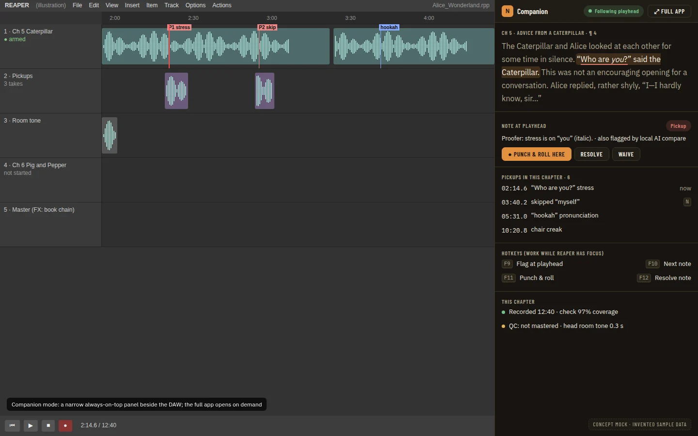

# Booth Mode and Companion Panel: a Full-Screen Reader for the Booth, and a Narrow Always-On-Top Companion Beside the DAW

**Source:** [Audiobook studio benchmark](../research/audiobook-studio-benchmark.md) recommendation 2 and its [Booth UX](../research/audiobook-studio-benchmark.md#booth-ux) section, and the benchmark train plan ([agent train](../operations/agent-train.md), wave 0). **Depends on:** [Studio UI Primitives](studio-ui-primitives.prd.md) (`FocusShell`, `CompactShell`, `LevelMeter`, `StatusBadge`, `Toolbar`, `Kbd`, `CapabilityGate`), [Input Commands and Pedals](input-commands-and-pedals.prd.md) (the `booth` scope, the command registry, `noisy` suppression), [DAW Port and Capabilities](daw-port-and-capabilities.prd.md) (`record`, `punch`, `heartbeat`, and its Should live-transport-state Phase 9), and the booth actions enablement PRD (benchmark recommendation 1, previous PRD in this wave), whose Record-in-REAPER and Punch-from-here controls this PRD composes rather than rebuilds. **Decision record:** ADR 0401 (Proposed, this PRD).

## Problem Statement

The teleprompter already follows the narrator's voice, but nothing in the app looks or behaves like a booth. Reading happens inside a dialog shaped like every other dialog, sharing the app's normal-sized text, its normal notification behaviour, and no dedicated layout for the things a narrator checks before and during a take: the microphone, the room, who is speaking, and what REAPER is doing. The benchmark rates every one of these Missing: "Alt+←/→ and Space are the only shortcuts. There is no shortcut map and no pedal or MIDI input" and "the noise floor is measured only afterwards, on the Delivery page" (scorecard, Recording section). Its Booth UX section is explicit about what professionals expect and this app does not offer: "Keyboard-first... Nothing makes a sound or shows a notification while recording," "a high-contrast, large-text script," and "everything works from a screen reader" (REAPER with OSARA is the bar). Separately, narrators who record with REAPER as the primary window want the app's controls without switching away from REAPER, which the benchmark's landscape section notes no competitor gives except a marker export (Pozotron) or a full DAW replacement (Punch Track): "A narrow, always-on-top panel beside the DAW... keeps the narrator in the DAW, the way most professionals already work."

## Evidence

- `apps/desktop/wailsapp.go:29-45`: the app is deliberately one window. `bringWindowForward` already calls `window.SetAlwaysOnTop(true)` then `false` in the same call, only as a one-shot "come to the front" nudge on a second launch, never a persisted state. [Wails v3 Migration](wails-v3-migration.prd.md) records "no new native menu... no system tray, no second window" as a decision (`:34`). This PRD's companion mode must live inside that decision, not reopen it: it resizes and pins the **one existing window**, it does not open a second one.
- The teleprompter dialog is `Dialog size="full"` (`ReadAloudDialog.tsx:118`, [ADR 0094](../adr/0094-dialog-gains-a-full-size-variant-that-fills-the-viewport-with-a-margin.md)), themed like every other dialog. There is no `[data-surface='booth']` block or any high-contrast mode; [Studio UI Primitives](studio-ui-primitives.prd.md) Phase 1 adds the token block this PRD's `FocusShell` needs but has not landed it yet.
- **Notifications while recording.** The interaction-feedback standard ([ADR 0075](../adr/0075-every-action-that-leaves-the-interface-acknowledges-within-100-ms-cannot-be-fired-twice-and-tells-the-narrator-when-it-ends.md), [ADR 0076](../adr/0076-a-host-job-ends-with-one-job-ended-event-the-app-announces-it-and-the-story-bible-rebuild-may-continue-in-the-background.md)) fires a toast on every job's end, with no rule that suppresses it during a recording. A background job (a story bible rebuild, a delivery check) finishing while the narrator reads would still toast.
- **Speaker tags and reference clips.** `Highlight` already renders Story Bible entity colours in the manuscript reader (studio-ui-primitives evidence: "Speaker tags stay the Story Bible entity colours via `Highlight`; not a new primitive"). A **per-character voice reference clip**, which the booth mock's rail shows for "voices in scene," is [Character Continuity Review](character-continuity-review.prd.md)'s work (all 8 phases pending, a sibling wave-0 stream); no clip exists to play yet.
- **Room tone and session match.** The scorecard lists "Room-tone capture, live noise floor, session match" as Missing outright, with no measurement path today outside the after-the-fact Delivery page (`internal/measure`). A live room meter can reuse [Studio UI Primitives](studio-ui-primitives.prd.md)'s `LevelMeter` fed by a second, decorative meter channel, but "matches the last session" needs a stored per-chapter baseline that nothing computes today.
- **Global hotkeys while REAPER has focus.** [Input Commands and Pedals](input-commands-and-pedals.prd.md) scopes this as a Could with its own Phase 12 spike ("Can Wails v3 or the OS register a hotkey that fires while REAPER has focus"), not yet run. Until it lands, every command in this PRD's booth and companion surfaces only fires while the app's window itself has focus.
- **The mocks.** [`03-booth.webp`](mockups/booth-mode-and-companion-panel/03-booth-concept.webp) and [`07-daw-companion.webp`](mockups/booth-mode-and-companion-panel/07-daw-companion-concept.webp), copied here from `docs/research/mockups/audiobook-studio-benchmark/` as **concept mocks**, not yet owner-approved. They show which primitive each part needs; [Studio UI Primitives](studio-ui-primitives.prd.md)'s own Visual Spec section maps most of them already (`FocusShell`, `LevelMeter`, `StatusBadge`, `Toolbar`, `Kbd`, `CapabilityGate`, `CompactShell`).

## Proposed Solution

Two screens, composed almost entirely from primitives and controls other PRDs already build:

1. **Booth mode**: a full-screen reading surface reached from the chapter header (beside today's "Read aloud" entry, or replacing it — Open Question 1), built on `FocusShell`. The status bar, rail and command bar are the same session, controls and state the read-aloud dialog already tracks; this PRD does not fork the teleprompter session, it re-skins it. Punch and Record use the exact controls booth actions enablement wires (`CapabilityGate('punch')`, `CapabilityGate('record')`), unchanged. New here: the `FocusShell` layout itself, a room `LevelMeter`, speaker-tag and voices-in-scene rail sections (with an honest "not available yet" placeholder where [Character Continuity Review](character-continuity-review.prd.md) has not landed reference clips), and the no-sound/no-notification rule while recording.
2. **Companion mode**: the same main window, resized to a narrow width (320-480 px) and pinned always-on-top, showing `CompactShell` with the script, the note at the playhead (a placeholder section until the closed-loop proofing PRD, benchmark recommendation 3 and next in this wave, fills it with real pickups actions), the chapter's pickups count, and the booth's hotkeys. "Full app" undoes the resize and the pin in one click.

Both surfaces read commands from the `booth` scope [Input Commands and Pedals](input-commands-and-pedals.prd.md) defines, so a footswitch already bound to `reading.toggle` or a punch command works identically in the normal dialog, booth mode and companion mode.

## Key Hypothesis

We believe a dedicated, high-contrast, keyboard-first surface with a room meter and no notifications will let a narrator run an entire recording session without touching the mouse or being interrupted, and that pinning the same window narrow beside REAPER will keep them in the DAW the way they already work. We will know it holds when the owner reads a chapter start to finish in booth mode using only the keyboard and a footswitch, and confirms no toast or sound interrupts a take; and when the owner runs a session with the companion panel pinned beside REAPER and never switches away from REAPER's window to punch or resolve a note.

## What We're NOT Building

| Item | Why |
| --- | --- |
| A second, native always-on-top window | [Wails v3 Migration](wails-v3-migration.prd.md) records one window as a decision. Companion mode resizes and pins the existing window; see ADR 0401 |
| The command registry, keymap, MIDI/HID input sources | [Input Commands and Pedals](input-commands-and-pedals.prd.md). This PRD registers `booth`-scope commands and consumes the registry, it does not build it |
| `FocusShell`, `CompactShell`, `LevelMeter`, `StatusBadge`, `Toolbar`, `Kbd`, `CapabilityGate`, `useCapability` themselves | [Studio UI Primitives](studio-ui-primitives.prd.md). This PRD is a consumer |
| Punch-from-here's and Record-in-REAPER's underlying behaviour, confirms and guard rules | The booth actions enablement PRD (benchmark recommendation 1). This PRD places those controls in a new layout; it does not change what they do |
| Per-character voice reference clips | [Character Continuity Review](character-continuity-review.prd.md). This PRD reserves the rail slot with an honest placeholder |
| Room-tone-matches-last-session comparison | Needs a stored per-chapter baseline nothing computes today; scoped out as Open Question 4 with a recommendation to defer to a follow-up PRD once a baseline exists |
| The proof timeline, note resolution, pickup session planning shown in the companion panel's mock | The closed-loop proofing PRD (benchmark recommendation 3, next in this wave). This PRD reserves the `CompactShell` section with a placeholder; that PRD fills it |
| OS-level global hotkeys that fire while REAPER has focus | [Input Commands and Pedals](input-commands-and-pedals.prd.md) Phase 12's spike, not yet run. Booth and companion commands work only while the app window has focus until then |
| A tablet or second-screen remote | Benchmark differentiator, not a must-have; no PRD schedules it yet |
| Silencing OS-level system notifications outside this app | Out of the app's control; this PRD only suppresses the app's own toasts (ADR 0075/0076) while its own booth surface is active and recording |

## Success Metrics

| Metric | Target | How measured |
| --- | --- | --- |
| A full session with no mouse | The owner reads a chapter in booth mode using only the keyboard (or a bound footswitch) for every command shown in the bar | Owner-pending check, tracked on [#510](https://github.com/countrymanprime/narration-utils/issues/510) |
| No interruption while recording | 0 toasts, sounds or animated notifications fire while `daw_transport_changed` (or the click-refreshed state, if that Should phase has not landed) reports recording and booth mode is active | A unit test with a fake job-end event firing during a mocked recording state; an integration test asserts no toast call |
| Booth is readable at a glance | Status (armed, recording, punch point) readable in the booth's high-contrast surface, per the benchmark's Booth UX requirement | Visual suite screenshots reviewed at desktop and small-desktop; a contrast check via `paletteContrast.test.ts`'s booth block (studio-ui-primitives Phase 1) |
| Companion mode keeps the narrator in REAPER | The owner completes a punch-and-resolve cycle from the companion panel without switching to the app's full window | Owner-pending check, tracked on #510 |
| No new native window | 0 calls to open a second `application.Window`; companion mode is the one window's own resize and pin | Grep of `apps/desktop` in review; a Go test that companion mode toggles the same window's bounds and `AlwaysOnTop` |
| Screen-reader parity | Every booth and companion control has the same accessible name and role it has in the normal dialog | `pnpm --dir apps/ui run aria`; new snapshots for the booth and companion surfaces |
| Gate | `pnpm check`; the visual suite for both new surfaces at every viewport (with `extraViewports` for the companion's narrow width); the atlas for any primitive change | `full-verification-gate` |

## Open Questions

Every question is answered with a recommendation, adopted if the owner does not say otherwise (D22 of the [implementation plan](implementation-plan.md)).

1. **How is booth mode reached?** Options: (A) a new "Booth" button beside "Read aloud" on the chapter header, opening the same session in the `FocusShell` layout instead of the dialog; (B) a mode switch inside the existing Read Aloud dialog. *Recommendation:* A. It keeps the normal dialog's layout (and the sibling PRDs that still edit it) untouched, and lets a narrator who prefers the normal dialog keep using it.
2. **Is booth mode a route, or `Dialog size="full"` with the booth surface applied inside it?** [Studio UI Primitives](studio-ui-primitives.prd.md) explicitly leaves this to the feature: "the feature decides whether it is a route or sits in `Dialog size="full"`." *Recommendation:* `Dialog size="full"` with `FocusShell` as its content, reusing `ReadAloudDialog`'s Escape-confirms-while-listening behaviour instead of rebuilding routing and confirms for a new page.
3. **Companion mode's resize target.** Options: a fixed 360 px width; a narrower/wider choice remembered per viewer; matching REAPER's own docked-panel width if it can be read. *Recommendation:* a fixed 380 px (matching the atlas's narrow-width convention, ADR 0061) with the window's prior size and position remembered in `localStorage` (per-viewer convenience) so "Full app" restores exactly where the narrator left it.
4. **Room-tone-matches-last-session.** *Recommendation:* defer. Ship the live room `LevelMeter` (a second, decorative meter fed by the same sidecar meter-mode channel [Read Aloud Control Bar](read-aloud-control-bar.prd.md) Phase 4 built), but not a comparison against a baseline; propose a follow-up PRD once a per-chapter noise-floor baseline is stored somewhere (today it exists only as a post-hoc Delivery-page measurement, not a session record).
5. **Should companion mode keep the app pinned always-on-top even when the narrator alt-tabs to something other than REAPER?** *Recommendation:* yes, for as long as companion mode is on; the narrator turns it off with "Full app" or by pressing Escape twice (once to confirm, matching the existing dialog-close pattern). Pinning is a window property, not a focus trap: other windows can still be brought forward and clicked.
6. **Voices-in-scene placeholder wording.** *Recommendation:* "Reference clips coming soon" with a link to the Story Bible entity, following the "visible UI in full, an honest 'not available yet' state where the data is not built yet" precedent ([Read Aloud Control Bar](read-aloud-control-bar.prd.md) D24).
7. **Does the booth's Toolbar need its own command ids, or does it reuse the existing `reading.toggle` etc.?** *Recommendation:* reuse. Booth mode is the same session as the normal dialog; its Toolbar buttons call the same handlers `ReadingControlBar` already calls, wrapped in the `booth` scope's `CommandScope` boundary so the same gestures apply.

## Users & Context

- **The narrator recording solo, hands on the script and mouth at the microphone**, sometimes with a screen reader (REAPER with OSARA is the frame of reference, per the benchmark's Booth UX note).
- **The narrator who keeps REAPER as the primary window**, glancing at the companion panel for the next note or to punch, and switching to the full app only when needed.
- **A blind or low-vision producer**, for whom booth mode's controls must be as fully named and operable as the normal dialog's, never a visual-only affordance.

## Solution Detail

### Core capabilities (MoSCoW)

| Priority | Capability |
| --- | --- |
| Must | Booth mode: `FocusShell` layout wrapping the existing teleprompter session, with the existing Punch/Record controls composed in, not rebuilt |
| Must | Booth `Toolbar` of `Kbd`-labelled commands reusing existing command handlers, in the `booth` scope |
| Must | No app-toast rule while booth mode is active and the DAW reports recording |
| Must | Companion mode: same-window resize and pin, `CompactShell` layout, "Full app" to undo |
| Should | Room `LevelMeter` (decorative, fed by the existing meter-mode channel) |
| Should | Speaker-tag rail section (existing `Highlight` colours) with an honest placeholder for reference clips |
| Should | Companion panel's note-at-playhead and pickups sections as reserved, placeholder slots |
| Could | Remembering the companion window's size and position per viewer |
| Won't | A second native window, reference clip playback, room-tone baseline comparison, OS-level global hotkeys, a tablet remote |

### MVP scope

Phases 1 to 5: booth mode's layout and silence rule, and companion mode's resize-and-pin with its placeholder sections. Phases 6 and 7 (the room meter and the speaker rail) round out the benchmark's booth requirements once the primitives they need (`LevelMeter`) have landed.

### User flow

1. On Chapter 3's header, the narrator presses **Booth**. The screen fills with a high-contrast surface: the script fills the centre, a status bar across the top shows "Ready" and the microphone, a rail on the right lists "Coming up" pronunciations and a placeholder "Reference clips coming soon," and a `Toolbar` of labelled keys sits at the bottom.
2. They press **R** (or their bound footswitch) to arm and start recording, exactly as the normal Read Aloud bar's Record-in-REAPER toggle would. A `StatusBadge` reads "REC · P&R." No toast interrupts them even though a background story-bible rebuild finishes mid-take.
3. After the session, they press **Esc** twice to leave booth mode, back to the chapter view.
4. Later, working with REAPER as the main window, they press **Companion** from the chapter header. The app's window shrinks to a narrow column, pins itself in front, and shows the script, "Following playhead," a placeholder "Pickups (0)" section, and a hotkey list. They punch from a flub without leaving REAPER's window focus for anything but the click. When done, "Full app" restores the window to its prior size and position.

## Technical Approach

**Feasibility: high** for booth mode (a new layout composed from finished session logic and primitives). **Medium** for companion mode's window mechanics, which touch Wails v3's window API directly for the first time outside `bringWindowForward`'s one-shot nudge.

**Architecture:**

- **Booth mode** is a new `components/teleprompter/BoothView.tsx` that renders `FocusShell` with four regions: `status` (the existing status line, microphone button, `StatusBadge`s), `rail` (the existing `ReaderRail` content plus the new speaker/voices section), `commands` (a `Toolbar` wrapping the existing `ReadingControlBar` handlers with `Kbd` labels), and the main region (the existing `ScriptView`/read-along text). It receives the same `useTeleprompterSession` instance `ReadAloudDialog` uses; opening Booth from the chapter header is a second entry point into the same session, not a second session.
- **The silence rule (Phase 4)** adds one check to the interaction-feedback toast dispatcher (ADR 0076): before firing a job-end toast, check a small `useBoothRecording()` hook (booth mode mounted **and** the DAW reports recording, from `daw_transport_changed` if [DAW Port and Capabilities](daw-port-and-capabilities.prd.md) Phase 9 has landed, else the click-refreshed `ReadAloudReaperState.recording`). If true, the toast queues silently and appears once the condition clears, so nothing is lost, only delayed. This is one guarded call site, not a global notification rewrite.
- **Companion mode (Phase 5)** is a new Go binding pair, `CompanionModeEnter()`/`CompanionModeExit()`, on the existing `mainWindow()` helper in `wailsapp.go`: `Enter` records the window's current `Size()`/`Position()`, calls `SetSize(380, currentHeight)`, `SetPosition` to keep it on-screen, and `SetAlwaysOnTop(true)`; `Exit` restores the saved bounds and calls `SetAlwaysOnTop(false)`. This is the same API `bringWindowForward` already calls, held rather than toggled back immediately. No second `application.Window` is created, so [Wails v3 Migration](wails-v3-migration.prd.md)'s "no second window" decision is not touched, only extended by ADR 0401. `hostAPIVersion` bump; the UI's `CompanionShell.tsx` renders `CompactShell` and calls these bindings from "Companion"/"Full app" buttons.
- **Command scopes.** Both surfaces wrap their content in the `booth` `CommandScope` boundary [Input Commands and Pedals](input-commands-and-pedals.prd.md) Phase 1 defines, so a footswitch bound to a booth command fires identically in the dialog, booth mode and companion mode; no new command ids are registered here beyond what already exists (Open Question 7).
- **Placeholders.** The reference-clip rail section and the companion's note-at-playhead/pickups sections render a fixed, honest "not available yet" state (a `StatusBadge` tone `neutral` plus the text from Open Question 6) rather than an empty gap, so the layout does not shift once the dependent PRDs land their real content.

**Risks:**

| Risk | Likelihood | Mitigation |
| --- | --- | --- |
| Resizing the only window while a dialog is open elsewhere in the app confuses layout assumptions | Medium | Companion mode is only reachable from the chapter header when no other dialog is open; entering it closes any open dialog first, the same rule the existing single-dialog-at-a-time invariant already enforces |
| Suppressing toasts loses a narrator's ability to see an urgent error during a take | Low | Only job-end success/info toasts queue; an error toast is not suppressed, since silence is a comfort rule, not a safety one |
| The booth's high-contrast surface fails contrast in a pair nobody tested | Medium | Depends on [Studio UI Primitives](studio-ui-primitives.prd.md) Phase 1's booth token block and its `paletteContrast.test.ts` guard; this PRD adds no new colour of its own |
| A narrator loses track of an always-on-top companion window that covers something they need | Low | "Full app" and the double-Escape both undo the pin in one action; the window can still be moved and covers only 380 px |
| Reusing the same `useTeleprompterSession` instance across the dialog and `BoothView` double-mounts a listener | Medium | Booth mode replaces the dialog's rendering, it does not mount alongside it; a test asserts only one active session subscription at a time |

## Implementation Phases

| # | Phase | Description | Status | Parallel | Depends | Ports used | PRP Plan |
| --- | --- | --- | --- | --- | --- | --- | --- |
| 1 | Booth entry point and `FocusShell` layout | Chapter header "Booth" button; `BoothView.tsx` on `FocusShell`, reusing the existing session, status, rail and text; visual states, aria snapshot | pending | no | studio-ui-primitives P1, P9; booth actions enablement P2, P3 (for the controls it composes) | UI: `FocusShell`; DAW port: `heartbeat`, `record`, `punch` (via the composed controls) | - |
| 2 | Booth `Toolbar` and commands | `Toolbar` of `Kbd`-labelled existing command handlers inside the `booth` `CommandScope`; visual row | pending | with 1 | studio-ui-primitives P2, P6; input-commands-and-pedals P1, P4 | UI: `Toolbar`, `Kbd`; input: `booth` scope | - |
| 3 | Speaker rail and reference-clip placeholder | Speaker-tag section using existing `Highlight` colours; honest placeholder for voices-in-scene clips | pending | with 4 | 1 | none new | - |
| 4 | Room level meter | A second, decorative `LevelMeter` fed by the existing meter-mode channel | pending | with 3 | studio-ui-primitives P5; Read Aloud Control Bar Phase 4 | UI: `LevelMeter` | - |
| 5 | No-sound, no-notification rule | `useBoothRecording()`; the toast dispatcher's guarded queue-while-recording check; unit tests with a fake job-end event | pending | with 6, 7 | DAW port P9 (Should) or the click-refreshed state as a fallback | DAW port: `heartbeat`/live transport (Should) | - |
| 6 | Companion mode: window mechanics | `CompanionModeEnter`/`CompanionModeExit` bindings on `wailsapp.go`'s `mainWindow()`; `hostAPIVersion` bump; Go tests of size/position save-and-restore | pending | with 5, 7 | none | none | - |
| 7 | Companion mode: `CompactShell` layout | `CompanionShell.tsx`: script, "Following playhead" status, placeholder note-at-playhead and pickups sections, hotkey list, "Full app"; visual states at the narrow width | pending | with 5, 6 | studio-ui-primitives P10; 6 | UI: `CompactShell`, `StatusBadge` | - |
| 8 | Steady state | Update `docs/guides/using-the-app/manuscript.md` and `teleprompter.md` with the two new modes; threat-model row for the window-resize binding (a narrow trust surface: no new data crosses it); ADR 0401 to Accepted; delete this PRD | pending | no | 1-7 | none | - |

### Phase details

- **P1, P2 (lane C, Sonnet).** File-disjoint from each other in practice (`BoothView.tsx` vs. the `Toolbar` wiring inside it), but sequenced because P2 edits P1's new file; treat as one stream if a single worker takes both.
- **P3, P4 (lane C, Sonnet).** Independent rail sections; run in parallel.
- **P5 (lane C, Sonnet).** Touches `interactionFeedback`'s dispatch path, a hot-ish file other PRDs also read from; the change is additive (one guard), not a rewrite.
- **P6 (lane A, Sonnet).** The only Go/host phase; independent of every UI phase, so it can run first or in parallel with P1-P4.
- **P7 (lane C, Sonnet).** Depends on P6's bindings existing (even as a mock payload before P6 lands, following the same mock-then-wire pattern booth actions enablement uses).
- **P8 (lane D, Haiku or Sonnet).** Last.

### Parallelism notes

- P6 (host) and P1-P4 (UI) are independent and can run at once.
- P2 depends on P1 (same new file). P7 depends on P6 for the real binding, but can start against a mock.
- P5 depends on nothing here but the DAW port's Should live-transport phase; if that has not landed, P5 ships against the click-refreshed fallback and is revisited once it does.
- P8 is last.

### Parallel-session compatibility

| Phase | Files it touches | Collides with |
| --- | --- | --- |
| 1 | New `components/teleprompter/BoothView.tsx`, chapter header component, `tests/visual/{state-catalog.ts,app.drivers.ts}`, `tests/aria/dialogs.spec.ts` | Any other PRD adding a chapter-header button |
| 2 | `BoothView.tsx` (from 1) | None beyond 1 |
| 3 | `BoothView.tsx`'s rail section | [Character Continuity Review](character-continuity-review.prd.md) (fills the placeholder later; coordinate, do not duplicate) |
| 4 | `BoothView.tsx`'s status section | [Read Aloud Control Bar](read-aloud-control-bar.prd.md) Phase 4 (shares the meter-mode channel) |
| 5 | `apps/ui/src/interactionFeedback*.ts` (the dispatch path, not the catalog) | Any PRD adding a job-end toast; the change is additive |
| 6 | `apps/desktop/wailsapp.go`, a new `bindings_companion.go`, `app.go`/`app_test.go` (`hostAPIVersion`), `hostApi.ts`, `Host.{js,d.ts}` | Any PRD bumping `hostAPIVersion` |
| 7 | New `components/teleprompter/CompanionShell.tsx`, chapter header component | The closed-loop proofing PRD (fills the placeholder sections later; coordinate, do not duplicate) |
| 8 | `docs/guides/using-the-app/{manuscript.md,teleprompter.md}`, `docs/architecture/threat-model.md`, `docs/adr/0401-*`, this PRD (deleted) | None |

## Decisions Log

| # | Decision | Date |
| --- | --- | --- |
| D1 | Companion mode resizes and pins the app's one existing window; it does not open a second native window | 2026-09-26 |
| D2 | Booth mode reuses the existing teleprompter session and its already-wired Punch/Record controls; it is a new layout, not a new session or a rebuild of those controls | 2026-09-26 |
| D3 | Reference clip playback and pickup/note actions are reserved as honest placeholders here and filled in by [Character Continuity Review](character-continuity-review.prd.md) and the closed-loop proofing PRD respectively, to avoid duplicate work across the three wave-0 streams | 2026-09-26 |
| D4 | Room-tone-matches-last-session is deferred until a per-chapter noise-floor baseline exists (Open Question 4) | 2026-09-26 |

## Research Summary

- **In the code (2026-09-26, `48a882d`):** one window, one `SetAlwaysOnTop` call site used as a one-shot nudge; `Dialog size="full"` is the only full-screen surface; no booth token block yet; `Highlight` already colours speaker entities.
- **In the sibling PRDs:** Wails v3 Migration's explicit "no second window" decision, which shapes this PRD's companion-mode design; Studio UI Primitives' explicit deferral of window flags and the command registry to this PRD and Input Commands and Pedals respectively; Input Commands and Pedals' `booth` scope, built for exactly this PRD to consume.
- **In the benchmark:** the Booth UX section's four requirements (keyboard-first and remappable pedals, no sound or notification while recording, a high-contrast large-text theme, full screen-reader support) and the companion panel's description as the widest gap against Hindenburg, Punch Track and TwistedWave.

## Visual Spec

The images below are the benchmark's **concept mocks, not owner-approved specs**, copied here from `docs/research/mockups/audiobook-studio-benchmark/`. A UI pull request for this PRD's phases compares its capture against these concept mocks and says so in its Mockup check table, until the owner approves them on [#510](https://github.com/countrymanprime/narration-utils/issues/510).

### Booth mode

- `FocusShell` regions: status (top), script (main), rail (voices in scene, coming up, this session), commands (bottom `Toolbar`).
- `LevelMeter` (`booth` size) for input, and a compact room meter (Phase 4).
- `StatusBadge`s: "REC · P&R," room level, mic-matches-session (deferred, Open Question 4), REAPER take, pedal/tablet chips (tablet out of scope).
- `CapabilityGate` on "Punch & roll," composed unchanged from the booth actions enablement PRD.

### DAW companion panel

- `CompactShell`: header with "Companion" title, "Following playhead" `StatusBadge`, "Full app" action; stacked sections for script, note at playhead (placeholder), pickups (placeholder), hotkeys, this chapter.
- `Toolbar` for "Punch & roll here" (composed from the booth actions enablement PRD); "Resolve"/"Waive" are the closed-loop proofing PRD's, reserved here as a placeholder.
- The always-on-top window itself is this PRD's Phase 6; the mock's floating panel corresponds to the app's own window, resized and pinned, not a second window.
