# Chapter Title Display Consistency: One Name, One Separator, One Style

**Source:** owner report of 2026-09-24: "We should be consistent how we show title and subtitle across the app. Some places we have `[Title]: [Subtitle]`. Some places we have `[TITLE] [SUBTITLE]` (all caps). Other places we have `[Title] — <i>[Subtitle]</i>`." Follow-up the same day: "casing, italics, bold, colors. should be similar." Examples seen: the Home chapter table ("PROLOGUE — The Last Good Applause", the title bold, the subtitle muted), the Manuscript chapter cards (the same text, the subtitle monospace and muted) and the Read aloud dialog ("A MESSAGE FROM THE AUTHOR" in capitals).

In this PRD, **title** is the chapter's `title` field, its label or number ("CHAPTER ONE", "Prologue", "A Message from the Author"), and **subtitle** is its `subtitle` field, its name ("Bad Ideas Look Great in Neon"). Together they are the chapter's **name**. The credits templates use different words for the same two fields: `[Chapter]` is the title and `[Chapter Title]` is the subtitle (ADR 0151). This PRD does not rename those tokens.

## Problem Statement

- The same chapter name is drawn at least five ways: `Title — Subtitle` with a muted subtitle (in three styles), `Title: Subtitle`, `TITLE SUBTITLE` in CSS capitals with no separator, a stacked title over a subtitle with no separator, and the title alone with the subtitle dropped. There is no shared formatter or component. Each of about 30 call sites builds the name inline.
- The styling differs as well as the separator. The subtitle is medium weight on Home, a smaller monospace face on Manuscript and regular weight in the import review. The title is Barlow Condensed on Manuscript and IBM Plex Sans on Home. One heading is forced into capitals by CSS, so "A Message from the Author" reads "A MESSAGE FROM THE AUTHOR" while "PROLOGUE" is in capitals because the author typed it that way. On screen the two cases look alike, but the DOM text, the accessible name and copied text all differ.
- The subtitle drops out in some places. In the Read aloud dialog the chapter heading shows title and subtitle before reading starts, but only the title once the session is live. The dialog's own title, the recording check, the stage suggestion and every Tracks table show the title only.
- A narrator cannot tell whether two differently drawn names are the same chapter. On Home they cannot tell whether "PROLOGUE" is their heading or the app's styling. On the Manuscript page the subtitle looks like code.

## Evidence

### How the name is stored

- **Two fields, split at import, source casing kept.** A chapter in `manuscript.json` has `title` and an optional `subtitle` (`apps/ui/src/api/schemas/manuscript.ts:28-31`; Go `importer.DraftSection.Title`/`Subtitle`, `apps/desktop/internal/importer/model.go:28-31`, and `Paragraph.ChapterSubtitle`, `:13`; the written chapter takes the first paragraph's subtitle, `apps/desktop/internal/manuscript/service.go:496`). The UI never has to split a string.
- **How the importers split.** `headingParts` treats the first line of a heading as the title and joins every later line (a Word soft break or tab, a Markdown ` `) into the subtitle. A heading glued as "CHAPTER ONEBad Ideas…" is split as a repair (`apps/desktop/internal/importer/headings.go:52-97`; ADR 0013). EPUB uses the same function on the nav/NCX label or the first block (`epub.go:275-305`). TXT reads the second line of a two-line heading block as the subtitle (`txt.go`, `classifyTxtHeading`; ADR 0095). The import review can turn a subtitle off, which joins it to the title or returns it to the body (ADR 0135, `subtitle_override.go`).
- **No importer changes case.** Nothing in `apps/desktop/internal/importer` or `internal/manuscript` calls `ToUpper`/`ToTitle` (grep). "PROLOGUE" is in capitals because the owner's manuscript has it that way. A one-line heading such as "Chapter 6: The Storm" keeps its colon inside `title` and has no subtitle.
- **The title is unique within a manuscript.** Chapters are grouped by exact title (`service.go:490-496`; a repeated heading becomes one section, ADR 0135), so the title alone identifies a chapter. The short form in Q6 relies on this.
- **Legacy newline titles.** Three helpers still assume a title can hold its subtitle after a `"\n"` and join the lines with `": "`: Python `display_title` in `sidecars/transcript-compare/core/compare.py:804-812` and `sidecars/manuscript-teleprompter/core/chapter_script.py:61-64`, and Go `displayTitle` in `apps/desktop/takecompare_job.go:260-268`. They are the only named formatters in the repository. None of them reads `subtitle`.

### Inventory: every place a chapter name is drawn

UI (`apps/ui/src/components`). Colour tokens are from `styles.css`: `--text` and `--text-muted`. Fonts are Barlow Condensed (display), IBM Plex Sans (the body default, `styles.css:144`) and IBM Plex Mono.

| # | Where | File:line | Shows | Separator | Casing | Title style | Subtitle style | Overflow |
| --- | --- | --- | --- | --- | --- | --- | --- | --- |
| 1 | Home chapter table, Chapter cell (a link) | `home/AudiobookEstimatePanel.tsx:217-234` | title + subtitle | ` — ` (em dash) | source | Plex Sans, medium (500), `--text` | same face, **medium (500)** (inherits the link), `--text-muted` | wraps |
| 2 | Home chapter table, link accessible name | `AudiobookEstimatePanel.tsx:220` | title + subtitle | ` — ` | source | - | - | - |
| 3 | Manuscript chapter card heading (`h2` in a toggle button) | `manuscript/Manuscript.tsx:534-539` | title + subtitle | ` — ` (inside the subtitle span) | source | **Barlow Condensed 1.2rem, semibold (600)**, `--text` | **IBM Plex Mono 0.8rem**, regular, `--text-muted` | wraps |
| 4 | Chapters & Search slide-over, chapter row | `manuscript/ChapterNav.tsx:82-89` | title over subtitle (**stacked**) | none (two blocks; the accessible name reads "Chapter 1 Down the…") | source | Plex Sans `text-sm`, medium, `--text` | `text-xs`, regular, `--text-muted` | each line truncates |
| 5 | Import review, section row | `home/ImportReview.tsx:145-153` (`reviewedHeading`, `importReviewModel.ts:49-58`) | title + subtitle, or joined title, or title `·` text line | ` — `; ` · ` for a line returned to the text | source | Plex Sans `text-sm`, regular | same, regular, `--text-muted` | one-line ellipsis, full name in `title=` |
| 6 | Import review, row `title=` and select name | `ImportReview.tsx:40-44`, `:170` | title + subtitle | ` — ` | source | - | - | - |
| 7 | Import review (PDF), detected chapters | `ImportReview.tsx:219` | titles only, joined | ` · ` between chapters | source | `text-xs` | - | wraps |
| 8 | Read aloud dialog, chapter heading in the text, before reading | `teleprompter/readerModel.ts:78-80` → `ReaderText.tsx:238` | title + subtitle | **a space** | **CSS `uppercase`** | Barlow Condensed 1.7rem, semibold | the same run | wraps |
| 9 | Read aloud dialog, chapter heading while reading | `readerModel.ts:52-57`: the sidecar's title span counts title tokens only (`chapter_script.py:88`), so the title-only candidate fits | **title only** | - | **CSS `uppercase`** | as 8 | **dropped** | wraps |
| 10 | Read aloud dialog title | `teleprompter/ReadAloudDialog.tsx:118` (`Dialog` title, `primitives/Dialog.tsx:112`) | "Read aloud — " + title | ` — ` used as a **context prefix** | source | Plex Sans semibold | **dropped** | - |
| 11 | Teleprompter page chapter select | `teleprompter/TeleprompterPage.tsx:132` | title + subtitle | **`: `** | source | select text | same | select |
| 12 | Manuscript Read aloud button name | `Manuscript.tsx:549` | "Read {title} aloud" | - | source | - | dropped | - |
| 13 | Chapters & Search, search-hit name | `ChapterNav.tsx:103` | "Search result in {title}, line n" | - | source | - | dropped | - |
| 14 | Home row controls: status select, Check button, stage suggestion | `AudiobookEstimatePanel.tsx:251`, `:272`, `:290`; `stages/StageSuggestion.tsx:44-87` | title in names ("{title} status", "Confirm {title} as …") | - | source | - | dropped | - |
| 15 | Recording check dialog titles | `home/RecordingCheck.tsx:187`, `:204` | "Checking {title}", "Recording check: {title}" | `: ` as context prefix | source | Dialog semibold | dropped | - |
| 16 | Stage evidence slide-over title | `stages/StageEvidence.tsx:36` | "Stage suggestion: {title}" | `: ` as context prefix | source | - | dropped | - |
| 17 | Stage decision toasts | `stages/useStageRecommendations.ts:24-26`, `:68` | "{title} moved to …" | - | source | - | dropped | - |
| 18 | Tracks, chapter links table | `tracks/ChapterLinksTable.tsx:90`; `mapping/MappingConfirm.tsx:63` ("Track for {title}") | title | - | source | medium | dropped | wraps |
| 19 | Tracks, link chapters dialog | `tracks/LinkChaptersDialog.tsx:186`, `:189`; stamp text `:47` (sent to REAPER as the item's line text) | title | - | source | regular | dropped | wraps |
| 20 | Read aloud chapter-track hint | `teleprompter/ChapterSuggestionHint.tsx:56`, `:59` | "for {title}", **"Use {title}" inside `Button`** | - | **CSS `uppercase`** from `Button` (`primitives/Button.tsx:29`) in the button; source in the sentence | Barlow semibold in the button | dropped | - |
| 21 | Retail sample chapter select | `settings/RetailSamplePanel.tsx:66` | title | - | source | select | dropped | - |
| 22 | Review page chapter filter | `review/ReviewFilters.tsx:44` | title (or id) | - | source | select | dropped | - |
| 23 | Story Bible evidence rows (Manuscript side panel and Story Bible detail) | `manuscript/EntitySummary.tsx:146`; `storybible/GuideDetail.tsx:803` (`paragraph.chapter`) | title | - | source | **IBM Plex Mono `text-xs`**, `--text-muted` | dropped | wraps |
| 24 | Credits settings preview scope | `settings/CreditsPanel.tsx:284` | "Shown for {title}" | - | source | - | dropped | - |

Host and sidecar text:

| # | Where | File:line | Shows | Separator | Casing | Reaches the narrator as |
| --- | --- | --- | --- | --- | --- | --- |
| 25 | Transcript Compare logs, markdown/diff heading, MATCH summary | `sidecars/transcript-compare/core/compare.py:804-812`, `:1311`, `:1630-1673` | title (newline lines joined) | **`: `** | source | the Proofing log, `.diff` / `.manuscript.txt` heading |
| 26 | Take divergence summary line | `sidecars/transcript-compare/core/take_divergence_mode.py:238` | title | `: ` (via 25) | source | take comparison log |
| 27 | Teleprompter "chapter not found" error | `sidecars/manuscript-teleprompter/core/chapter_script.py:61-77` | titles | `: ` | source | an error in the Read aloud dialog |
| 28 | Take comparison chapter lookup | `apps/desktop/takecompare_job.go:244-268` | title | `: ` (for matching only) | source | not shown |
| 29 | Delivery report HTML, finding row | `apps/desktop/internal/deliveryreport/report.html.tmpl:62` (`Chapter.Title` from `findings.Manuscript.ChapterTitle`) | "chapter {title}" | - | source | the delivery report file |
| 30 | REAPER chapter regions | `integrations/reaper/narration_line_identity.lua:214` (`create_chapter_regions`, row `title` supplied by the caller) | whatever the caller sends | - | - | region names, then render file names (`$region`, `internal/renderconfig`) and ID3 `CHAP` titles, which come from those file names (`bindings_chaptertags.go:70-85`). The command is registered and harness-tested, but nothing in Go or the UI calls it yet (grep), so this is a **planned** consumer. |
| 31 | Chapter announcement (credits) | `apps/desktop/internal/credits/announcements.go:22-34`; hint text `settings/CreditsPanel.tsx:21` | the narrator's template, for example `[Chapter]{: [Chapter Title]}` | the template's own (`: ` in the example) | source | **spoken** narration text, not display |

What the inventory shows:

- **31 places** in total: 24 in the UI and 7 in host or sidecar text. Only **6** of them draw the subtitle at all (rows 1-6, 8 and 11 across 5 components). Of those, **3** use ` — ` with a muted subtitle, each styled differently (rows 1, 3, 5). One uses `: ` (row 11). One uses a space under CSS capitals (row 8). One is stacked with no separator (row 4).
- **The owner's three formats map to code as follows.** `[Title]: [Subtitle]` is the Teleprompter page select (row 11) and every host helper (25-28). `[TITLE] [SUBTITLE]` is the Read aloud reading heading (row 8). `[Title] — <i>[Subtitle]</i>` is Home and Manuscript (rows 1 and 3). No subtitle is actually italic anywhere: grep finds no `italic` on a title or subtitle. The "italic" look is the Manuscript card's smaller monospace subtitle.
- **CSS capitals** reach a chapter name in two places: the reading heading (rows 8 and 9, `ReaderText.tsx:238`) and a `Button` label (row 20). The Home "PROLOGUE" is source text.
- **Context prefixes** use two separators: `: ` ("Recording check: …", "Stage suggestion: …") and ` — ` ("Read aloud — …"). If row 10 also showed the subtitle, the dialog title would read "Read aloud — PROLOGUE — The Last Good Applause".

### Rules and precedent already on record

- Nothing prescribes a chapter-name format. `docs/design/design-system.md` has no entry for it. Its "Manuscript reader" section covers rows, highlights, sticky headers and formatting only (`:103-108`). No ADR sets a separator or casing (grep of `docs/adr` for "subtitle": ADRs 0013, 0086, 0095, 0102, 0126, 0135 and 0151 decide how the split is made, stored, corrected, aligned and spoken, not how it is shown).
- **An informal convention exists.** The import review comment says it writes the heading "the way the reader writes them ("Chapter One — Down the Rabbit-Hole")" (`ImportReview.tsx:38-39`). `docs/architecture/import-review.md:26` and `docs/guides/using-the-app/home.md:111` describe "Chapter One — Down the Rabbit-Hole", the subtitle "in a fainter colour". The guide says the Manuscript page shows "a title with its subtitle" (`docs/guides/using-the-app/manuscript.md:17-18`).
- **Precedent for stacked text.** The `Heading` primitive is "the page title, with an optional muted line under it": the same face, and the muted line `text-sm` and `--text-muted` (ADR 0058, `primitives/Heading.tsx:5-16`).
- **Where the app uses capitals.** CSS `uppercase` is used for chrome only: `Button`, `Tabs`, `Pill`, `NavButton`, table headers (`Table.tsx:104`), section labels (`components.css:4-9`), all in Barlow Condensed. It is a label style. Content text, such as the manuscript and entity names, keeps source casing.
- **Precedent for a source-scan guard.** `apps/ui/src/rawNatives.test.ts` (a per-file ceiling that may only go down, ADR 0053) and `baseUiBoundary.test.ts` (ADR 0047) scan the TSX AST and fail on a pattern outside an allow-list.

### Test and capture coverage today

- The mock chapters are "Chapter 1"…"Chapter 12" with title-case subtitles (`apps/ui/src/api/mockFixtures.ts:30-70`, `aliceManuscript.ts`). **No mock title is in source capitals, none lacks a subtitle, and none carries a separator of its own**, so no captured state can show the owner's "PROLOGUE" versus "A Message from the Author" contrast.
- States that draw a chapter name: `home/chapter-table-*`, `home/import-review-*` (7, including `import-review-subtitles-off` and `import-review-text-subtitle`), most of the 45 `manuscript/*` states (cards, `chapters-overlay-*`, the `read-aloud-*` rows at `state-catalog.ts:296-409`), the 13 `teleprompter/*` states, and the recording check and stage evidence states.
- Aria snapshots that hold a chapter name: `slide-over-chapters.aria.yml` (`button /^Chapter 1 /`), `dialog-recording-check.aria.yml` ("Recording check: Chapter 4"), `slide-over-stage-evidence.aria.yml` ("Stage suggestion: Chapter 4") and `dialog-read-aloud-resume.aria.yml` (`dialog /Read aloud/`).

## Proposed Solution

Add **one rule, one formatter and one component**, and move every site in the inventory onto them.

1. **The rule** (written into `docs/design/design-system.md` and an ADR):
   - **Separator:** ` — ` (space, U+2014 em dash, space) between title and subtitle, and nowhere else. Context prefixes ("Recording check", "Read aloud") use `: ` ("Read aloud: PROLOGUE — The Last Good Applause"), so the em dash only ever means "subtitle follows" (Q4).
   - **Casing:** the source casing, always. No `text-transform` on a chapter name. The component sets `normal-case` so an uppercase context (a `Button`, a section label) cannot re-case it (Q2).
   - **Style**, by design token:
     - The title inherits the context's text colour (normally `--text`) and is semibold (600).
     - The subtitle is `--text-muted` and regular (400).
     - Both parts use the same font family, which is inherited from the context. The subtitle is never italic and never monospace.
     - Inline, both parts are the same size. Stacked, the subtitle is one step smaller (`--font-size-xs` under a `text-sm` title) (Q3).
   - **No subtitle:** the title alone, with no dangling separator. **No title** (it should not happen): the subtitle alone. A separator character the title already ends with (`:`, `—`, `–`, `-`) is dropped before the dash is added, so a name never reads "CHAPTER ONE: — …". A legacy title that still contains `"\n"` is read as title plus subtitle, the same way `headingParts` splits it.
2. **The formatter** (`apps/ui/src/chapterName.ts`, pure). `chapterName({ title, subtitle }, form)` returns plain text:
   - `full` gives "Title — Subtitle".
   - `short` gives the title only. It is for the names of controls inside a row that already shows the full name.
   - `context(prefix)` gives "Prefix: Title — Subtitle".

   Accessible names, dialog and slide-over titles, select options, `title=` attributes and toasts all come from here.
3. **The component**: a `TitleSubtitle` primitive in `apps/ui/src/components/primitives/`. It is generic, so book titles, import sections and credits cards can use it too (Q5). It has two layouts:
   - `inline` (the default): one text run. A non-breaking space before the dash keeps the dash on the title's line. It wraps by default. With `truncate` it clips from the end, so the subtitle goes first, and the full name is available in a tooltip.
   - `stacked`: the title over the subtitle. Each line wraps or truncates on its own. A visually hidden ` — ` between them keeps the accessible name identical to the inline one.

   Size and family come from the parent (a table cell, the Manuscript `h2`, the reading heading), so one component serves every density.
4. **The guard.** `apps/ui/src/chapterNameFormatting.test.ts` works like `rawNatives.test.ts`. It fails on any read of `.subtitle` in JSX or in a template literal under `src/components/**` outside an allow-list: the primitive, `chapterName.ts`, the import review model (it decides which subtitle is kept), `state.ts` search and `readerModel.ts` (token fitting). It starts as a per-file ceiling at today's counts and ends at zero. A unit test pins that `TitleSubtitle` renders the same accessible name in both layouts and stays `normal-case` inside an uppercase parent.
5. **Host parity** (later, Could). One helper each in Go and Python follows the same rule (`title` + `subtitle` in, `full`/`short` out). They replace the three `": "`-joining `display_title`/`displayTitle` copies. One shared fixture (`tests/fixtures/chapter-names.json`, generated by the Go test) pins all three languages to the same output. Plain-text outputs that become file or REAPER names follow Q7.

**The proposed winner** among the owner's three styles is **`Title — Subtitle`, the subtitle muted and regular, in source casing**:

- It is already the majority: 3 of the 5 components that show a subtitle, and every piece of documentation that describes the display.
- The em dash is the one separator that does not appear inside real titles. Colons are common in one-line headings ("Chapter 6: The Storm"), so `: ` can double up or be ambiguous.
- Muted rather than italic keeps the subtitle legible at small sizes and in Barlow Condensed, whose italic the app does not load.
- Source casing is the author's text. The same text reaches the eye, the screen reader and the clipboard. And "PROLOGUE" next to "A Message from the Author" shows what is actually in the book, which the narrator is about to read aloud.

## Key Hypothesis

We believe that one formatter and one component, with a single separator, casing rule and set of subtitle styles, will make a chapter's name read the same on every screen and in every accessible name. We'll know we're right when the owner, looking at Home, Manuscript, Chapters & Search, the import review and the Read aloud dialog for the same book, reports no difference in separator, casing, weight, colour or face, and the guard holds the ad-hoc count at zero.

## What We're NOT Building

- No change to how chapters are stored or split: `title`/`subtitle`, the importers, `headingParts`, ADR 0013 and ADR 0135 stay as they are. No case normalisation at import (Q2 C is rejected).
- No change to spoken text. The credits chapter announcement is the narrator's own template (ADR 0151), and the teleprompter still tracks the title tokens the sidecar sends. Recording coverage keeps title and subtitle as optional tokens (ADR 0126).
- No renaming of the `[Chapter]` / `[Chapter Title]` credits tokens.
- No change to what the chapter matchers compare (`chaptermatch`, Transcript Compare track matching). They match on the title and keep doing so. Only the text they show changes.
- No new wire payload. `title` and `subtitle` already cross in `chapterSchema`. If Q8 puts the subtitle into the delivery report, that becomes its own contract change under `docs/architecture/wire-contracts.md`.
- No redesign of the chapter card header or the Home table layout. Those belong to the sibling PRDs listed in the compatibility table.

## Success Metrics

| Metric | Target | How measured |
| --- | --- | --- |
| One formatter | 0 reads of `.subtitle` in JSX or template literals outside the allow-list; ceiling at 0 by the last UI phase | `chapterNameFormatting.test.ts` |
| One separator | Every visible and accessible chapter name with a subtitle contains ` — ` exactly once, and no chapter name contains `: ` between title and subtitle | Vitest on `chapterName`, and assertions in the drivers of the new states |
| Source casing | No chapter-name element has a computed `text-transform` other than `none` | A driver assertion in the new visual states (computed style) plus the `TitleSubtitle` unit test inside an uppercase parent |
| Same style | Title weight 600, subtitle weight 400 and colour `--text-muted`, same family as the title, never italic or mono, at every site | A driver assertion on computed styles; PNG review |
| Subtitle kept | The Read aloud heading shows the subtitle before and during reading; the dialog and slide-over titles carry the full name | `readerModel.test.ts`, `ReadAloudDialog.test.tsx`, visual states |
| Accessible names agree | Inline and stacked give the same name; Chapters & Search rows read "Chapter 1 — Down the Rabbit-Hole" | `TitleSubtitle.test.tsx`; `slide-over-chapters.aria.yml` updated on purpose |
| No regressions | Visual suite green at desktop, small-desktop and tablet (overflow, collapsed controls, axe); atlas green | `full-verification-gate`, `pnpm --dir apps/ui atlas` |

## Open Questions

- [ ] **Q1. Which style wins?** (A) `Title — Subtitle`, subtitle muted (recommended; see the rationale above). (B) `Title: Subtitle`: short and ASCII, but it collides with titles that already contain a colon, and it is the format of the legacy host helpers only. (C) Capitals for the title with the subtitle after it (`PROLOGUE — The Last Good Applause` for every chapter): see Q2. Recommendation: A.
- [ ] **Q2. Is the capitalised title display-only, or not used at all?** (A) Source casing everywhere, with no CSS capitals on a chapter name. This includes the Read aloud reading heading, which becomes "A Message from the Author" (recommended: what is read aloud is what is shown, the DOM, the clipboard and the screen reader agree, and a mixed-case book stays mixed-case). (B) Display capitals on the **title part only**, as a CSS treatment (`uppercase` in Barlow Condensed, the app's label style), with the subtitle in source casing. Every title then looks alike, but the accessible text and copied text differ from what is seen. Whether copied text keeps the CSS capitals varies by browser, and some screen readers spell out a word in capitals. (C) Normalise at import: rejected, because it changes the data the matchers, credits and teleprompter read. Recommendation: A.
- [ ] **Q3. The subtitle's weight, colour and size.** Owner choice within "similar":
  - Weight: regular (400, recommended) or the title's weight (Home today is 500 for both).
  - Colour: `--text-muted` (recommended; it meets AA, ADR 0059) or `--text`.
  - Size, inline: the same as the title (recommended), or one step smaller as on Manuscript today.

  The title's weight is also a choice: semibold 600 everywhere (recommended; it matches headings and the Manuscript card), or medium 500 in rows. And the family: inherited from the context, with both parts always sharing it (recommended: a Barlow card heading stays Barlow, a table row stays Plex Sans), or one family (Plex Sans) for every chapter name.
- [ ] **Q4. Context prefixes.** Should "Read aloud — {title}" become "Read aloud: {title} — {subtitle}", to match "Recording check: …" and "Stage suggestion: …"? Recommendation: yes, so the em dash means one thing. This changes the dialog name that [Manuscript Credits Card Parity](manuscript-credits-card-parity.prd.md) expects ("Read aloud — Opening credits"), so the two PRDs must agree.
- [ ] **Q5. A primitive, or a domain component?** (A) A generic `TitleSubtitle` in `primitives/`. It takes `title`/`subtitle` strings and can serve book titles, import sections and credits cards. It brings a story, the atlas and `design-spec-guard`. (B) A `ChapterName` component beside the pages (`components/manuscript/`), with no atlas. Recommendation: A, because the rule is visual and the atlas is where visual rules are checked.
- [ ] **Q6. Full or short name in control names and dialog titles?**
  - Recommendation: controls inside a row that already shows the full name use `short` (the title alone, which is unique): "Read PROLOGUE aloud", "PROLOGUE status", "Check recording of PROLOGUE".
  - Anything that stands alone uses `full`: dialog and slide-over titles, select options, toasts, the Tracks tables, Story Bible evidence and the delivery report.
  - Alternative: `full` everywhere, which is longer to hear on every row.
- [ ] **Q7. Do plain-text outputs follow the same rule?** These are REAPER region names (row 30, not yet wired), render file names (from regions), ID3 `CHAP` titles (from file names), the Transcript Compare logs and diff headings (rows 25-27), and item stamp text (row 19).
  - (A) The same ` — ` everywhere. Windows and REAPER both accept U+2014 in names and files, but it is awkward to type in a render pattern or a shell.
  - (B) The same rule with an ASCII variant for names that become files or REAPER objects: `Title - Subtitle`.
  - (C) Title only for REAPER and files, since the chapter-track matcher already scores title against track and region names, and an added subtitle only adds tokens.

  Recommendation: B for the Transcript Compare logs and headings (they are read by a person). C for region, track and file names until [DAW Chapter-Track Auto-Sync](daw-chapter-track-auto-sync.prd.md) decides what it writes into REAPER.
- [ ] **Q8. Book title and subtitle.** The book's `Title`/`Subtitle` are credits values (`apps/desktop/internal/credits/values.go:9-34`). Today they appear only as Settings fields and inside credits text, where they are spoken, and nothing in the UI draws them together. Recommendation: in scope for the rule and the component (the same separator and styles if the book's name is ever shown, for example on the project picker), with no current site to migrate. Spoken credits text is out of scope.
- [ ] **Q9. The Read aloud reading heading.** Recommendation: the `stacked` layout at the reading size (the title over a muted subtitle) in source casing. The subtitle stays on screen during a session as an untracked line: only the title's words are tracked, as the sidecar sends them today. Alternative: add the subtitle to the sidecar's title span, so it is tracked (a sidecar and harness change; recording coverage already treats it as optional). This also belongs to the concurrent `read-aloud-control-bar.prd.md` and [`read-aloud-resume-from-daw.prd.md`](read-aloud-resume-from-daw.prd.md): agree it with them.

## Users & Context

The narrator moves between Home (the chapter table), Manuscript (cards and the Chapters & Search slide-over), Tracks and the Read aloud dialog for the same chapter many times in a session. Real books mix headings in capitals ("PROLOGUE", "CHAPTER ONE") with title-case ones ("A Message from the Author"), headings with and without subtitles, and one-line headings that carry their own colon. A screen-reader user hears the accessible names, which today say the name three different ways.

## Solution Detail

| Priority | Capability | Phase |
| --- | --- | --- |
| Must | `chapterName()` (`full`, `short`, `context`) with the separator, casing, no-subtitle and trailing-separator rules | 1 |
| Must | `TitleSubtitle` primitive: `inline` and `stacked`, token styles, `normal-case`, `truncate`, identical accessible names; story and atlas | 1 |
| Must | Source-scan guard with a per-file ceiling that only goes down | 1 |
| Must | A mock heading set with a source-capitals title, a title with no subtitle, a long subtitle and a title ending in `:`, shared with the header alignment PRD's mixed-rows flag | 1 |
| Must | Home table, Manuscript card heading, Chapters & Search rows and import review rows on the component | 2 |
| Must | Read aloud reading heading: no CSS capitals, subtitle kept during reading (Q9); dialog title and Teleprompter page select through `chapterName` (Q4) | 3 |
| Should | Every title-only site (rows 12-24) on `chapterName` `short` or `full` per Q6; the `Button` "Use {title}" keeps source casing; ceiling 0 | 3 |
| Should | ADR and a design-system entry "Chapter names"; guides updated | 2 |
| Could | Go and Python helpers on the same rule with a shared fixture, replacing the three `": "` joiners; delivery report per Q8 | 4 |
| Won't | Case normalisation at import; renaming credits tokens; changing what the matchers compare | - |

**MVP scope:** Phases 1 and 2. They fix the three screens the owner named, except the Read aloud heading, which is Phase 3.

**User flow:** the narrator opens Home. The row reads **PROLOGUE** — The Last Good Applause, with the title semibold and the subtitle muted and regular. "A Message from the Author" sits above it with no dash. They follow the link to Manuscript and the card heading reads the same, in Barlow at card size, with no monospace. The Chapters & Search slide-over shows the title over the muted subtitle, and a screen reader says "PROLOGUE — The Last Good Applause". They press Read aloud. The dialog is titled "Read aloud: PROLOGUE — The Last Good Applause", and the heading in the text is PROLOGUE over The Last Good Applause, both still there after Start reading. "A Message from the Author" appears in its own casing, not in capitals.

## Technical Approach

- **Feasibility:** mostly UI, and small per site. The data is already split, so no binding changes, `hostAPIVersion` stays the same, and there is no Zod schema, golden file or `wireContracts.test.ts` row. Phase 4 touches Go and Python only for log and heading text, not payloads, unless Q8 adds the subtitle to findings.
- **Formatter** (`apps/ui/src/chapterName.ts`): a pure function with property tests (the repository's deterministic property-test setup, ADR 0044):
  - It never produces ` —  — `, a leading or trailing separator, or `: —`.
  - `full` always contains `short`.
  - Whitespace is collapsed.
- **Component** (`primitives/TitleSubtitle.tsx`):
  - Inline markup is `{title}{subtitle && &nbsp;— {subtitle}}`.
  - Stacked markup uses two block spans, with the visually hidden ` — ` inside the second.
  - `truncate` makes the inline layout one `truncate` run, with the full name in a `Tooltip`, since hints are Base UI tooltips (ADR 0049).
  - Stories: `Inline`, `InlineNoSubtitle`, `SourceCaps`, `Stacked`, `Truncated`, `InsideUppercaseButton`, `LongUnbrokenSubtitle` (the ADR 0058 overflow case).
  - It touches `primitives/`, so `design-spec-guard` checks it against ADR 0058 (the `Heading` muted-line precedent) and ADR 0059 (the colour tokens).
- **Sites:**
  - Phase 2: `AudiobookEstimatePanel.tsx:217-234`, `Manuscript.tsx:534-539` (the `h2` keeps Barlow and its size, and the subtitle loses Plex Mono and `0.8rem`), `ChapterNav.tsx:82-89` (`stacked truncate`), `ImportReview.tsx:145-153` (`inline truncate`; the joined title and the `·` text-line case stay in `reviewedHeading`, which is in the allow-list).
  - Phase 3: `readerModel.ts:52-57` and `:78-80`, which give the title row a `subtitle` so it renders separately instead of being joined; `ReaderText.tsx:238`, which drops `uppercase` and uses `stacked`; `ReadAloudDialog.tsx:118`; `TeleprompterPage.tsx:132`; and rows 12-24.
- **Mock:** extend the Manuscript mixed-rows flag proposed by [Manuscript Chapter Header Alignment](manuscript-chapter-header-alignment.prd.md) (`?mockManuscript=mixed`, `apps/ui/src/main.tsx`, `mockApi.ts`) with the heading cases, rather than adding a second flag. The default Alice mock and every existing screenshot stay as they are, apart from the style change itself.
- **Visual suite:** add a new state for each of the owner's screens, `home/chapter-names`, `manuscript/chapter-names` and `manuscript/read-aloud-chapter-name`, driven by the flag. Their drivers assert:
  - the separator
  - `text-transform: none`
  - the title and subtitle weights, the colour and the shared family, from computed style.

  Then re-capture and look at every viewport's PNG of the states listed under Evidence (`home/chapter-table-*`, `home/import-review-*`, the `manuscript/*` card, `chapters-overlay-*` and `read-aloud-*` states, `teleprompter/*`). Run with `npx playwright test tests/visual/app.spec.ts -g "home|manuscript|teleprompter"` from `apps/ui`.
- **Aria:** expect intended changes to `slide-over-chapters.aria.yml` (row names gain ` — `), and to `dialog-recording-check`, `slide-over-stage-evidence` and `dialog-read-aloud-resume` if Q4 and Q6 change their titles. Read each diff and update only the intended ones (ADR 0065).
- **Guard:** an AST scan in the style of `rawNatives.test.ts`. It flags `PropertyAccessExpression` `.subtitle` inside JSX expressions or template spans in `src/components/**`, excluding `primitives/TitleSubtitle.tsx`, `chapterName.ts`, `home/importReviewModel.ts`, `state.ts` and `teleprompter/readerModel.ts`. The ceiling starts at today's per-file counts: `AudiobookEstimatePanel.tsx`, `Manuscript.tsx`, `ChapterNav.tsx`, `ImportReview.tsx`, `TeleprompterPage.tsx`. It must reach zero by the end of Phase 3. Title-only sites cannot be scanned reliably, so Phase 3 moves them by hand, and code review holds the line after that.
- **Host parity (Phase 4):**
  - Go: `internal/manuscript` (or a small `chaptername` package) gains `DisplayName(title, subtitle string, form)`.
  - Python: `libs/python/narration_common` gains `chapter_display_name` there, per the `change-impact-scan` rule for shared libraries.
  - A Go test writes `tests/fixtures/chapter-names.json` (with `UPDATE_CONTRACTS=1`, never edited by hand), and the Vitest, Go and pytest suites each read it.
  - The three `display_title`/`displayTitle` copies call the helper.
  - `create_chapter_regions` needs no Lua change: it writes whatever name the caller sends, and the caller is the one that follows Q7.
- **Docs:** a "Chapter names" section in `docs/design/design-system.md` (the rule, the variants, the tokens, the guard); `docs/guides/using-the-app/home.md:111` and `manuscript.md:17` (their wording already fits, so only the screenshots change); `docs/architecture/import-review.md:26`; and the doc screenshots under `docs/images/ui/` that show chapter names (`apps/ui/tests/visual/doc-screenshots.json`).
- **ADR:** one new ADR, "A chapter's name is shown as title — subtitle in source casing through one formatter and one primitive". Check the next free number at merge time (the highest on disk is 0170, and open PRs may take numbers).
- **Risks:**
  - The Manuscript card heading and the Home table are being edited by several sibling PRDs at once (see below). The site edits are one-line swaps, but they conflict at merge time.
  - Dropping CSS capitals on the reading heading changes the Read aloud dialog's look, which two concurrent PRDs also change.
  - A semibold title in the Home table's dense rows takes more width at tablet. The overflow gate catches regressions, and issue #149 (the Home table at 390 px) is already known.
  - A subtitle kept on screen but not tracked must not confuse the cursor or the flag rows. `readerModel` tests pin that it has no word spans.

## Implementation Phases

| # | Phase | Description | Status | Parallel | Depends | PRP Plan |
| --- | --- | --- | --- | --- | --- | --- |
| 1 | Rule, formatter, primitive, guard | `chapterName.ts`, `TitleSubtitle` primitive and stories, the source-scan guard at today's ceiling, the heading cases in the mixed-rows mock | partial — pending: the `?mockManuscript=mixed` heading cases were not added (the flag itself belongs to [Manuscript Chapter Header Alignment](manuscript-chapter-header-alignment.prd.md), not yet built by any stream as of this PR; adding a second flag was rejected per this PRD's own guidance, so this waits on that flag existing) | - | Q1-Q3, Q5 | - |
| 2 | The owner's screens | Home table, Manuscript card heading, Chapters & Search, import review on the primitive; new visual states and driver assertions; aria update; design-system entry; ADR | pending | with 3 | 1 | - |
| 3 | Read aloud and every other site | Reading heading without CSS capitals and with the subtitle kept (Q9); dialog title and Teleprompter select (Q4); rows 12-24 on `chapterName` (Q6); guard ceiling 0 | pending | with 2 | 1, Q4, Q6, Q9 | - |
| 4 | Host and sidecar parity | Go and Python helpers on the same rule with a shared fixture; the three `": "` joiners replaced; delivery report and plain-text names per Q7/Q8 | pending | with 2, 3 | 1, Q7, Q8 | - |

### Phase Details

**Phase 1 - Rule, formatter, primitive, guard**
- **Scope:** `apps/ui/src/chapterName.ts` and its test; `apps/ui/src/components/primitives/TitleSubtitle.{tsx,test.tsx,stories.tsx}`; `apps/ui/src/chapterNameFormatting.test.ts`; `apps/ui/src/main.tsx` and `api/mockApi.ts` (the heading cases in the mixed flag); `docs/design/design-system.md` (the primitives table row).
- **Success signal:** the property and unit tests pass, the atlas is green in light and dark at both widths, and the guard lists exactly today's offenders.
- **Verification:** TDD first; `pnpm check`; `pnpm --dir apps/ui atlas`; `design-spec-guard` (primitives).

**Phase 2 - The owner's screens**
- **Scope:** `home/AudiobookEstimatePanel.tsx`, `manuscript/Manuscript.tsx` (or `ReaderCard.tsx`, see below), `manuscript/ChapterNav.tsx`, `home/ImportReview.tsx` and their tests; `tests/visual/state-catalog.ts`, `app.drivers.ts`; `tests/aria/snapshots/slide-over-chapters.aria.yml`; the ADR; the guides and doc screenshots.
- **Success signal:** the Success Metrics rows for these screens; the guard ceiling falls for the four files.
- **Verification:** `pnpm check`; the visual suite for `home` and `manuscript` at every viewport, opening each PNG; `pnpm --dir apps/ui run aria`.

**Phase 3 - Read aloud and every other site**
- **Scope:** `teleprompter/{readerModel.ts,ReaderText.tsx,ReadAloudDialog.tsx,TeleprompterPage.tsx,ChapterSuggestionHint.tsx}`, `home/RecordingCheck.tsx`, `stages/*`, `tracks/*`, `mapping/MappingConfirm.tsx`, `settings/{RetailSamplePanel,CreditsPanel}.tsx`, `review/ReviewFilters.tsx`, `manuscript/EntitySummary.tsx`, `storybible/GuideDetail.tsx`; the aria snapshots that change per Q4/Q6.
- **Success signal:** guard ceiling 0; the subtitle is visible during a read-aloud session; no chapter name under CSS capitals.
- **Verification:** `pnpm check`; the `read-aloud-*`, `teleprompter/*`, recording check, stage evidence and Tracks states at every viewport; `pnpm --dir apps/ui run aria`.

**Phase 4 - Host and sidecar parity**
- **Scope:** a Go helper and its test (which writes the fixture), `libs/python/narration_common` helper and pytest, `sidecars/transcript-compare/core/{compare.py,take_divergence_mode.py}`, `sidecars/manuscript-teleprompter/core/chapter_script.py`, `apps/desktop/takecompare_job.go`, and `internal/deliveryreport` if Q8 says so.
- **Success signal:** the three languages give identical output on the fixture; logs and diff headings use the rule; matching is unchanged (the existing matcher tests stay green untouched).
- **Verification:** `change-impact-scan` on `narration_common` (every sidecar that imports it); `pnpm check`. There is no REAPER change unless Q7 wires region names, which would then be a harness test first under ADR 0066.

### Parallelism Notes

Phase 1 comes first. Phases 2 and 3 touch different files and can run at the same time. Phase 4 is independent of both once the rule is fixed. The main risk is the sibling PRDs editing the same lines. Land Phase 2's Manuscript edit after the `ReaderCard` move of [Manuscript Credits Card Parity](manuscript-credits-card-parity.prd.md) if that move is ready: the heading then changes in one place, and the credits cards' "Opening credits" title can use the same primitive. Land Phase 3 after, or together with, the two Read aloud dialog PRDs, whichever is ready first. The later one rebases.

**Parallel-session compatibility**

| Phase | Files and areas touched | Collision risk |
| --- | --- | --- |
| 1 | `chapterName.ts`, `primitives/TitleSubtitle.*`, `chapterNameFormatting.test.ts`, `main.tsx`, `mockApi.ts`, `design-system.md` | **Medium** with [Manuscript Chapter Header Alignment](manuscript-chapter-header-alignment.prd.md): the same `?mockManuscript=mixed` flag, so extend it rather than fork it. Low elsewhere: `main.tsx` and `mockApi.ts` are appended to by many PRDs (merge-time only). |
| 2 | `AudiobookEstimatePanel.tsx:217-234` (the Chapter cell), `Manuscript.tsx:534-539` (the card `h2`), `ChapterNav.tsx:82-89`, `ImportReview.tsx:145-153`, `state-catalog.ts`, `app.drivers.ts`, `slide-over-chapters.aria.yml`, guides, doc screenshots | **High** with [Manuscript Credits Card Parity](manuscript-credits-card-parity.prd.md): it moves the card header into `ReaderCard.tsx` with an eyebrow and a title slot, and re-captures every `manuscript/*` PNG. The title slot should render `TitleSubtitle`. **High** with [Manuscript Chapter Header Alignment](manuscript-chapter-header-alignment.prd.md): the same header grid, the same screenshots. **High** with [Credits in the Chapter Table](credits-in-chapter-table.prd.md): it adds credits rows to the Home Chapter column with "the template name as the muted subtitle" (its CT6), which should use this component and rule. **Medium** with [Actual Recorded](actual-recorded-column.prd.md), [Home Stage Check Line](home-stage-check-line.prd.md), [Recording Check Summary](recording-check-summary.prd.md) and [Chapter Track Link Control](chapter-track-link-control.prd.md): other cells of the same `AudiobookEstimatePanel.tsx` table and the same `home/chapter-table-*` captures. Chapter Track Link Control also titles a slide-over "Track: <chapter title>", which should use `chapterName` `context`. **Low** with [Import Structure](import-structure-toc-and-characters.prd.md) (importer only; the data shape is unchanged). |
| 3 | `teleprompter/readerModel.ts`, `ReaderText.tsx`, `ReadAloudDialog.tsx`, `TeleprompterPage.tsx`, `ChapterSuggestionHint.tsx`, `RecordingCheck.tsx`, `stages/*`, `tracks/*`, settings, review and Story Bible sites; aria snapshots for the dialog and slide-over titles | **High** with `read-aloud-control-bar.prd.md` (being written concurrently) and [Read Aloud Resume from DAW](read-aloud-resume-from-daw.prd.md): both edit `ReadAloudDialog.tsx` and its states, and the control bar likely edits `ReaderText.tsx` and the dialog header. Agree Q4 (the dialog title) and Q9 (the heading) with them. **High** with [Manuscript Credits Card Parity](manuscript-credits-card-parity.prd.md) Phase 2, which makes `ReadAloudDialog` take a `source` and titles it "Read aloud — Opening credits" (conflicts with Q4). **Medium** with [Teleprompter Manuscript Integration](teleprompter-manuscript-integration.prd.md)'s remaining phases (retiring `TeleprompterPage.tsx`: if it is gone first, drop that site), [Chapter Stage Recommendations](chapter-stage-recommendations.prd.md) (`stages/*`), [Chapter Track Link Control](chapter-track-link-control.prd.md) and [DAW Chapter-Track Auto-Sync](daw-chapter-track-auto-sync.prd.md) (`tracks/*`, `MappingConfirm.tsx`). |
| 4 | Go helper, `narration_common`, `compare.py`, `take_divergence_mode.py`, `chapter_script.py`, `takecompare_job.go`, `deliveryreport` | **Medium** with [DAW Chapter-Track Auto-Sync](daw-chapter-track-auto-sync.prd.md): it owns the matcher and anything written into REAPER (region and track names, Q7). **Medium** with [Diagnostics, Delivery Reports and Cleanup Tools](diagnostics-delivery-and-cleanup-tools.prd.md) remaining phases if they edit `report.html.tmpl`. Low with [Recording Check Model Cascade](recording-check-model-cascade.prd.md) (`compare.py`, other functions). |

Cross-cutting: follow `CLAUDE.md`:
- a tracking issue, with `Closes #<n>` in the PR
- `change-impact-scan` before touching `narration_common` (Phase 4)
- TDD
- `full-verification-gate`, with the visual suite and PNG review at every viewport, the atlas (Phase 1) and `run aria` (Phases 2 and 3)
- `design-spec-guard` (the primitive, Phase 1)
- `feature-cleanup`, including the ADR (`adr-author`)

This work crosses no trust boundary: display text only, and file names are unchanged unless Q7 C is revisited. `hostAPIVersion` is unchanged.

## Decisions Log

| Decision | Choice | Alternatives | Rationale |
| --- | --- | --- | --- |
| Separator (proposed, Q1) | ` — ` between title and subtitle only | `: `; a space; none | The majority today and in the docs; not found inside real titles; `: ` stays for context prefixes |
| Casing (proposed, Q2) | Source casing, `normal-case` enforced | Display capitals on the title; normalise at import | One text for the eye, the screen reader and the clipboard; the author's heading is what gets narrated |
| Subtitle style (proposed, Q3) | `--text-muted`, 400, same family and size inline, never italic or mono | Italic; monospace; the title's weight | "Similar" everywhere; muted meets AA (ADR 0059); the app loads no Barlow italic |
| One formatter plus one primitive (proposed, Q5) | `chapterName()` for text, `TitleSubtitle` for markup | Per-page helpers | Accessible names and visible names cannot drift apart |
| Guard (proposed) | AST ratchet on `.subtitle` reads | ESLint rule; review only | Follows `rawNatives.test.ts` (ADR 0053); no new lint plugin |
| Spoken and matched text unchanged | Out of scope | Add the subtitle to the tracked title span | ADR 0126 and ADR 0151 already decide spoken headings; Q9 keeps the subtitle visible without changing tracking |

## Research Summary

- Read:
  - The storage and split code: `schemas/manuscript.ts`, `importer/{model.go,headings.go,subtitle_override.go,epub.go}`, `manuscript/service.go`.
  - Every UI site in the inventory, plus `primitives/{Heading,Button,Dialog,Table,Tabs,Pill}.tsx`, `components.css` and `styles.css`.
  - The host and sidecar text in the inventory: `compare.py`, `take_divergence_mode.py`, `chapter_script.py`, `takecompare_job.go`, `deliveryreport/report.html.tmpl`, `credits/announcements.go`, `narration_line_identity.lua`, `bindings_chaptertags.go`.
  - The mocks (`mockFixtures.ts`, `aliceManuscript.ts`), `state-catalog.ts` and the aria snapshots.
  - ADRs 0013, 0053, 0058, 0059, 0086, 0095, 0126, 0135 and 0151; `design-system.md`; `import-review.md`; the Home and Manuscript guides.
  - The sibling PRDs in the compatibility table.
- Greps: `subtitle`, `chapter.title`, `uppercase`/`text-transform`/`italic`, `ToUpper` in the importer, `display_title`/`displayTitle`, `create_chapter_regions` callers.
- Not done: the owner's project was not opened and no screenshot was taken. The owner's "PROLOGUE"/"A Message from the Author" book is not in the repository, and the diagnosis of which capitals are source and which are CSS comes from the code (no `uppercase` on the Home cell; `uppercase` on `ReaderText.tsx:238`). `read-aloud-control-bar.prd.md` was not on disk when this was written, so its exact overlap is inferred from its name and from its sibling's compatibility table.

## Visual Spec

Mockups approved by the owner on 2026-09-24. They were rendered from the real app (dark theme, the app's own fonts and components) with throwaway edits and invented sample data, so names, numbers and body text are placeholders; the layout, controls, states and wording are the spec. Each shows the recommended answer to the open questions unless its caption says it is an alternative. Where a mockup and the text above disagree, raise it before building rather than silently following either.

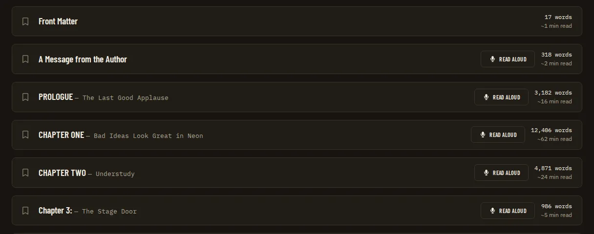

*Before* (`00-before.webp`)

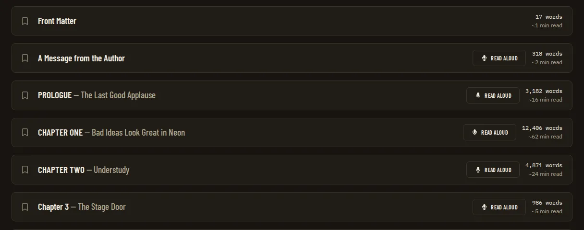

*Manuscript cards after* (`01-manuscript-cards-after.webp`)

*Manuscript cards before* (`01-manuscript-cards-before.webp`)

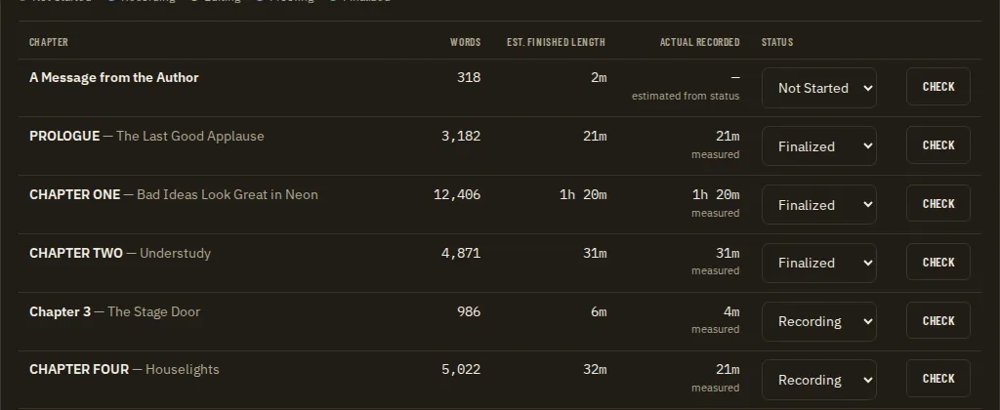

*Home table after* (`02-home-table-after.webp`)

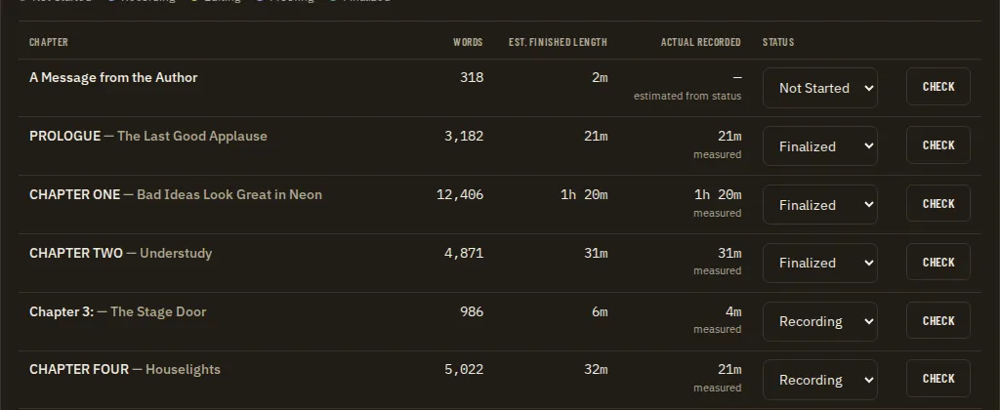

*Home table before* (`02-home-table-before.webp`)

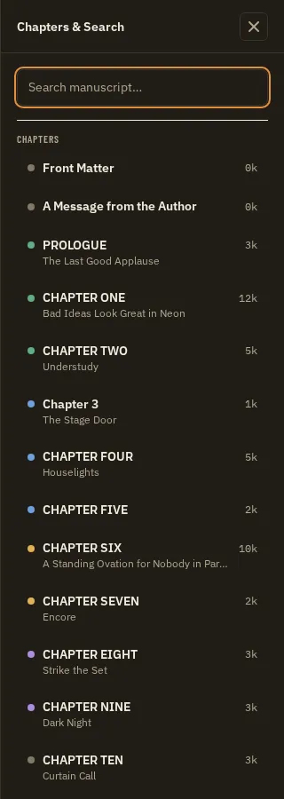

*Chapters search after* (`03-chapters-search-after.webp`)

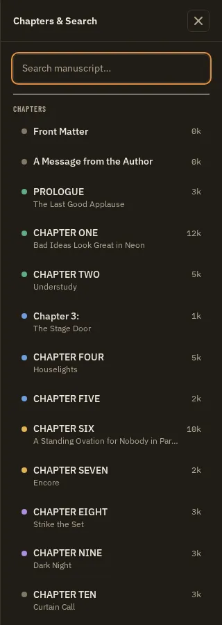

*Chapters search before* (`03-chapters-search-before.webp`)

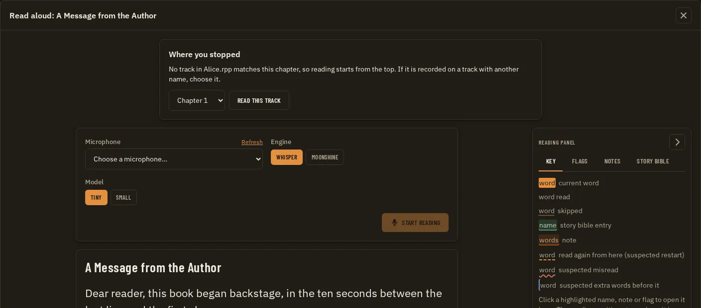

*Read aloud heading after* (`04-read-aloud-heading-after.webp`)

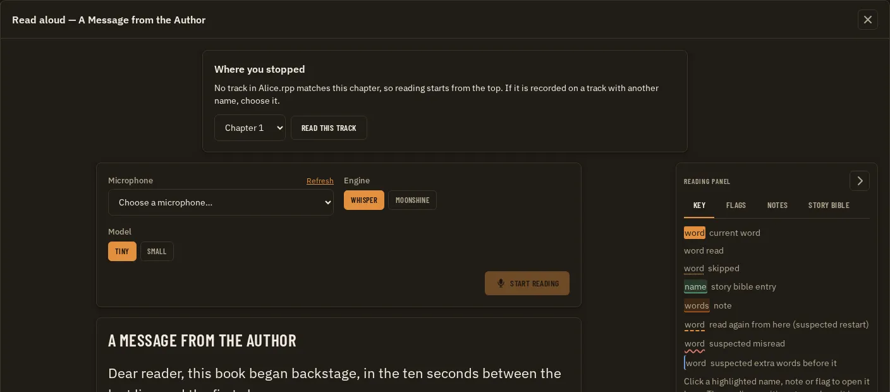

*Read aloud heading before* (`04-read-aloud-heading-before.webp`)

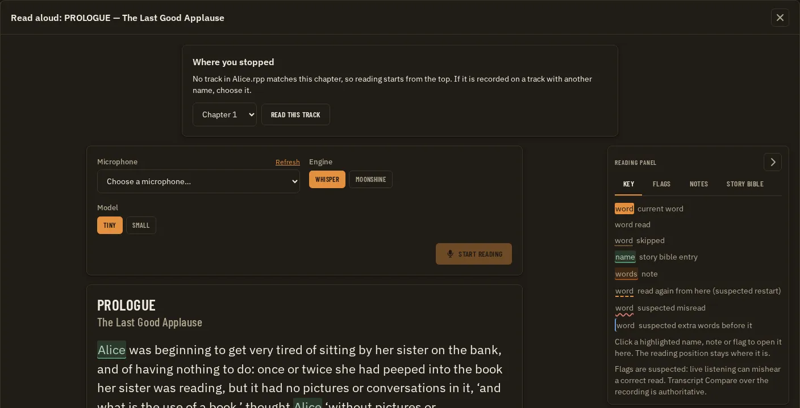

*Read aloud heading prologue after* (`05-read-aloud-heading-prologue-after.webp`)

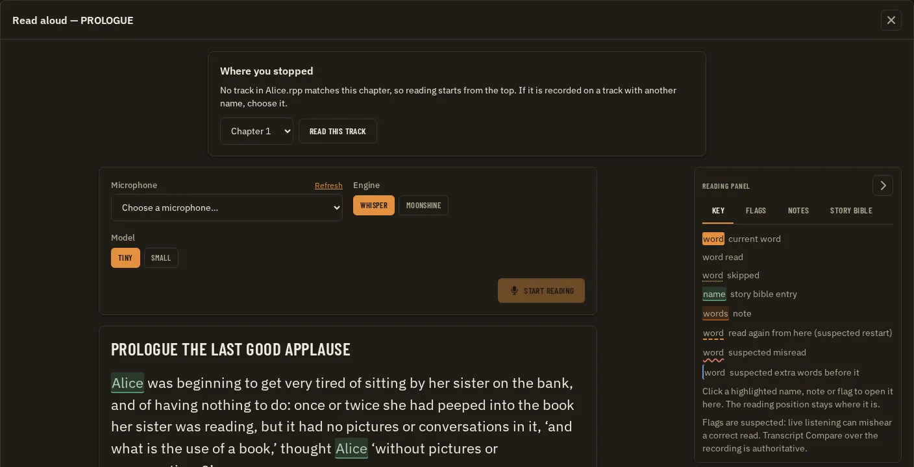

*Read aloud heading prologue before* (`05-read-aloud-heading-prologue-before.webp`)

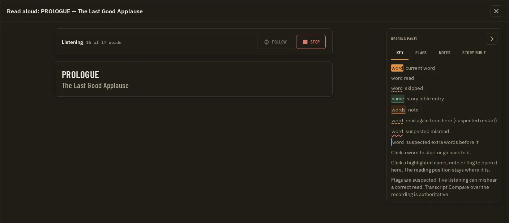

*Read aloud while reading after* (`06-read-aloud-while-reading-after.webp`)

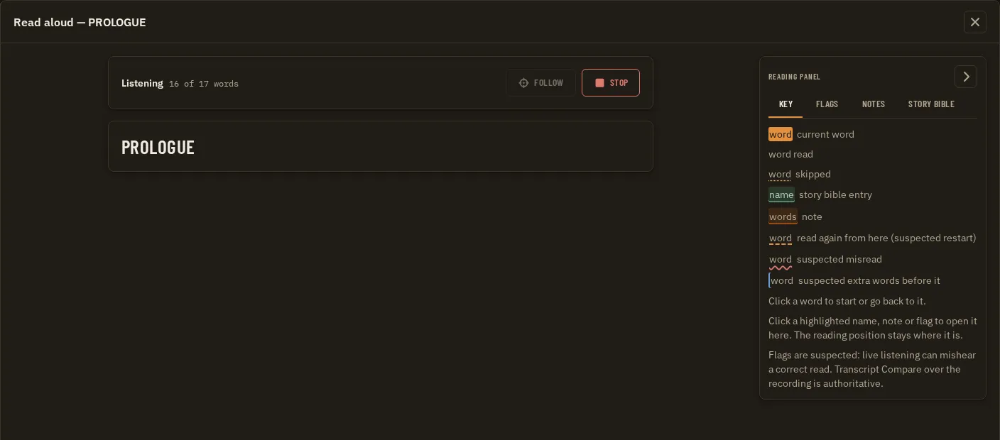

*Read aloud while reading before* (`06-read-aloud-while-reading-before.webp`)

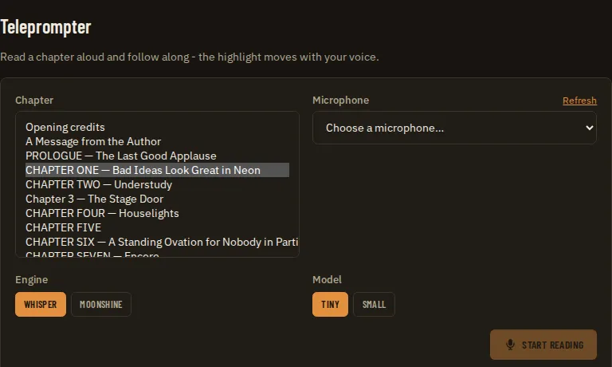

*Teleprompter select after* (`07-teleprompter-select-after.webp`)

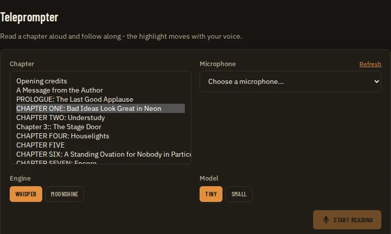

*Teleprompter select before* (`07-teleprompter-select-before.webp`)

### Together with the related PRDs

The same screen with every PRD that changes it applied at once.

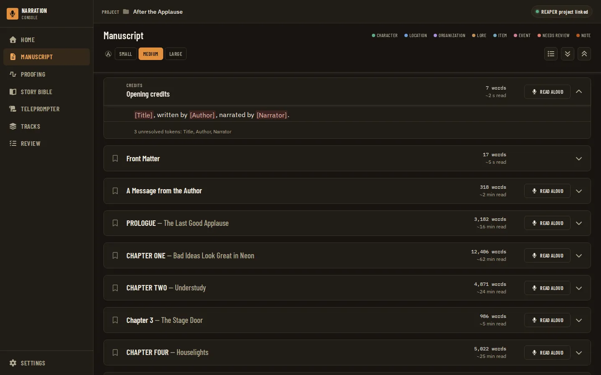

*Manuscript after* (`01-manuscript-after.webp`)
