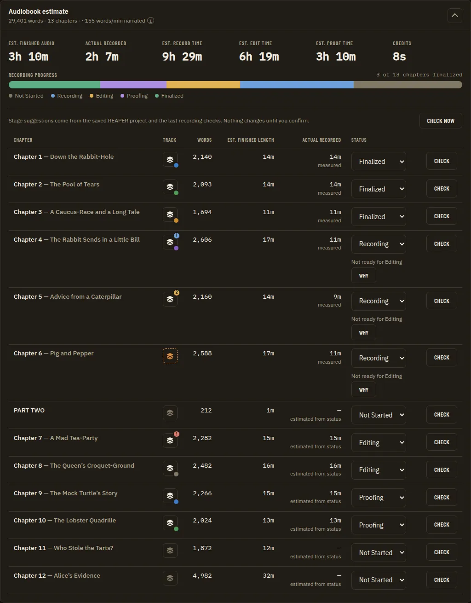
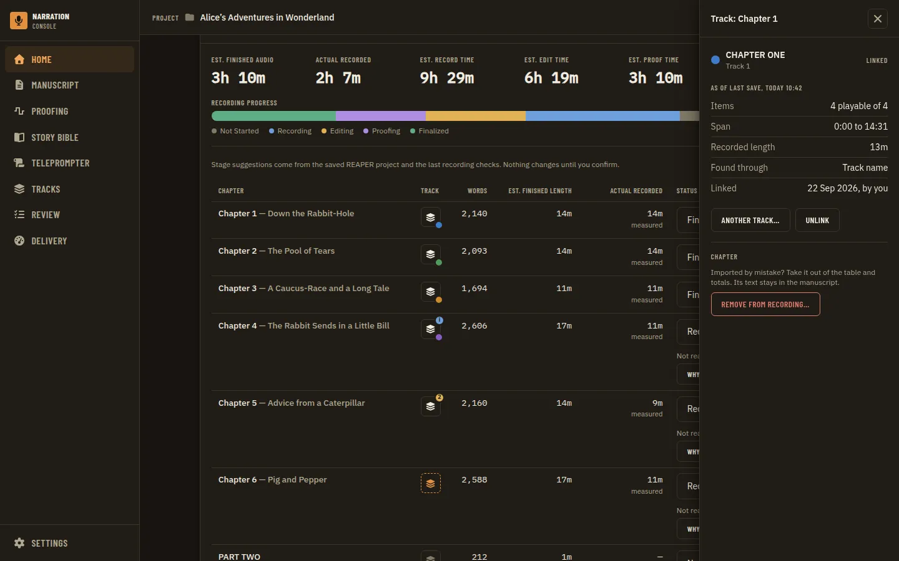
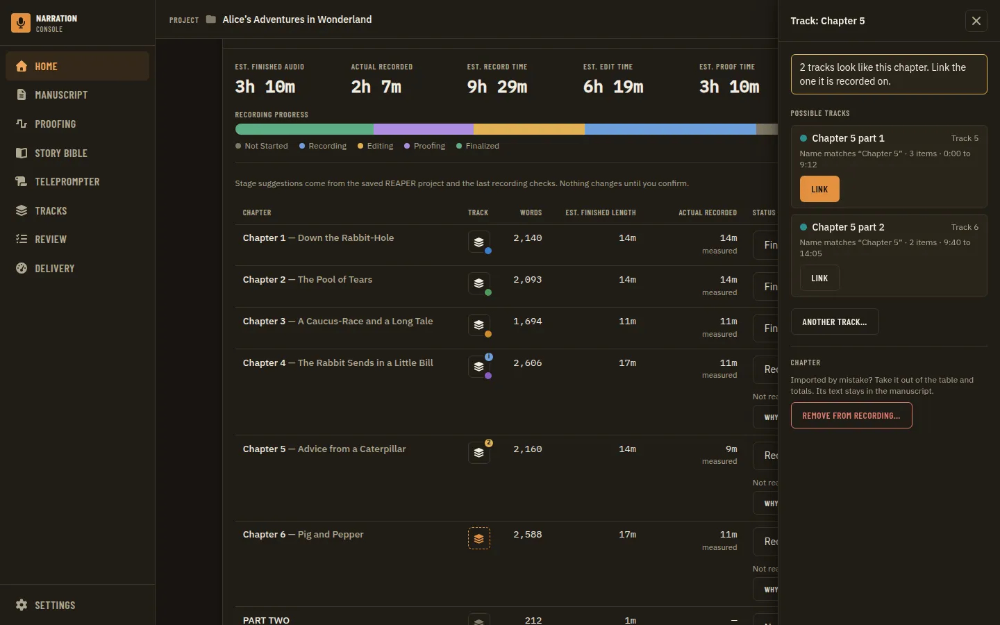
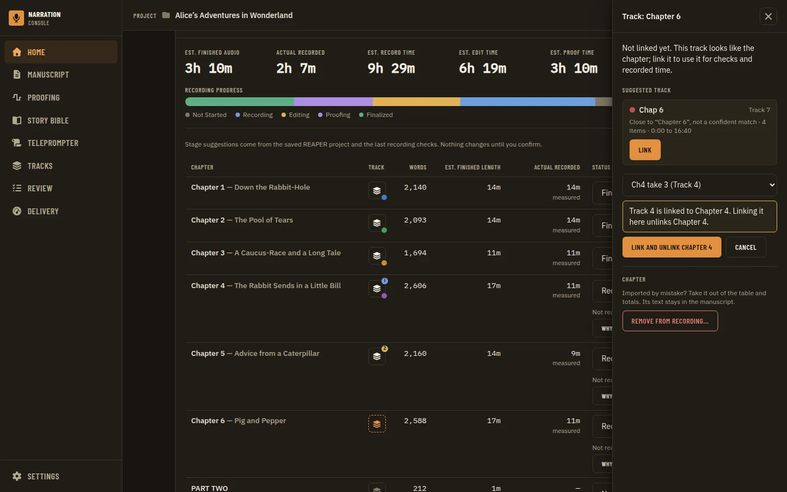
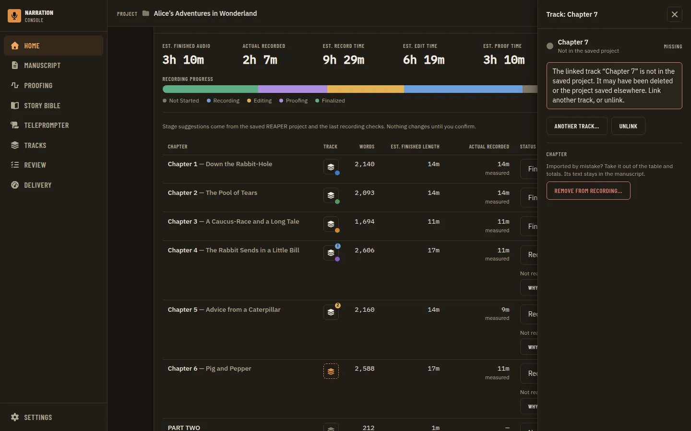
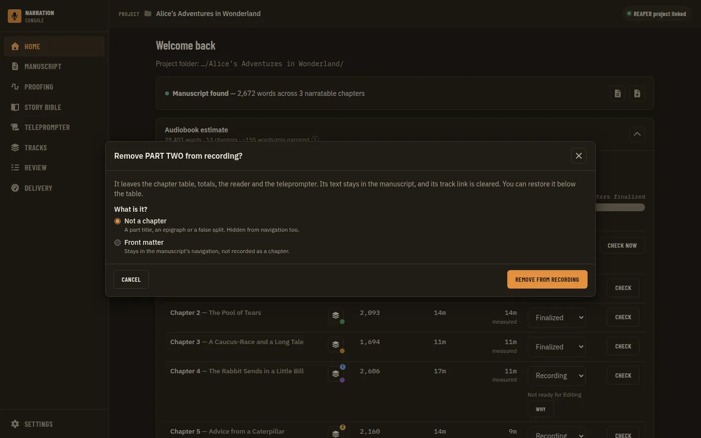
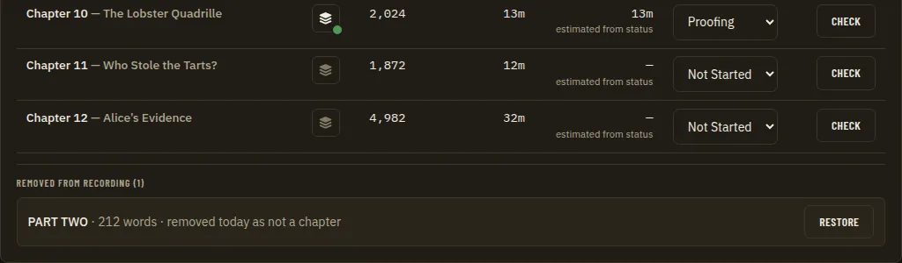
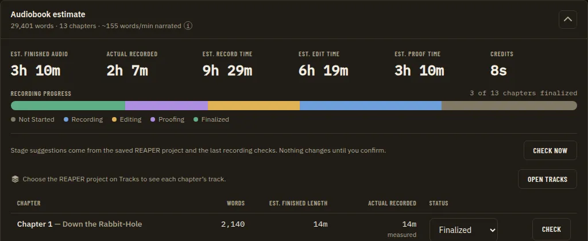
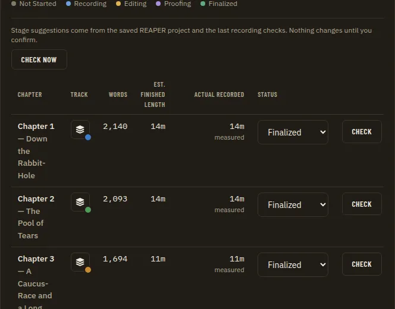
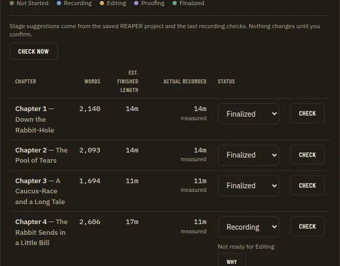

# Chapter Track Link Control: a Track Button per Row, Relinking and Removing a Mis-imported Chapter

**Source:** owner request of 2026-09-24 on Home's per-chapter breakdown (columns Chapter, Words, Est. finished length, Actual recorded, Status, and a Check button per row): "We should have a button with an icon that is easy to associate with a track visually. Clicking that button can give us track info and allow the user to change what track the chapter is tied to, in case there are multiple. Maybe even a button to remove a chapter in case the import was wrong." Citations are `file:line` at `accb3bc`. Builds on the delivered confirmed chapter-track mapping ([Analysis Evidence Ledger](analysis-evidence-ledger.prd.md) Phases 5 and 7, [ADR 0100](../adr/0100-analysis-evidence-is-two-hash-keys-one-ledger-record-per-run-and-a-narrator-confirmed-track-map.md)) and the shared matcher ([ADR 0110](../adr/0110-one-go-chapter-to-track-matcher-ported-from-transcript-compare-with-explicit-confidence-states.md)).

**Not covered here (sibling PRDs drafted the same day):** what the Actual recorded column shows (`actual-recorded-column.prd.md`); linking the chapters to tracks automatically, the consent prompt when REAPER is linked, normalised title matching and retiring the manual per-row Check (`daw-chapter-track-auto-sync.prd.md`); the recording check as a whole-chapter summary (`recording-check-summary.prd.md`); credits rows ([Credits in the Chapter Table](credits-in-chapter-table.prd.md)); the stage check line above the table ([Home Stage Check Line](home-stage-check-line.prd.md)). The sibling file names may differ slightly; check `docs/prds/` before planning a phase.

**Status (2026-09-24):** draft; open questions TL1 to TL10 wait for the owner. No tracking issue yet: open one (`docs/operations/github-workflow.md`) before Phase 1.

## Problem Statement

- **A chapter's track is not visible on Home.** The table has no column about the track. A narrator cannot see from Home whether a chapter is linked, which track it is linked to, or whether the link is broken. The only place to see this is the Chapter links list on the Tracks page. The only place to link a track from Home is inside the recording check dialog, and that prompt appears only after a check has been refused as `unmapped`.
- **A link cannot be changed from Home, and changing it on Tracks leaves the old link behind.** The Home prompt has no Clear. On the Tracks page, Change followed by Confirm adds a second link and does not replace the first. The chapter then has two tracks, and the recording check refuses it as linked to more than one track.
- **There is no way to fix a wrong import after the fact.** A heading imported as a chapter by mistake (a part title, a false split, an epigraph) sits in the table for the whole project. It adds to the word count, the finished-length estimate, the progress bar and "x of N chapters finalized". The only fix today is Replace manuscript, which clears every status, note, finding, link and check result.

## Evidence

- **What the table has today.** The columns are Chapter, Words, Est. finished length, Actual recorded, Status, and a Check column with a hidden header (`apps/ui/src/components/home/AudiobookEstimatePanel.tsx:194-203`). Each row has a ghost Check button that opens `RecordingCheck` (`:284-296`, `:304-317`). Rows are narration chapters only (`:110`). Nothing in the row reads the chapter-track mapping.
- **How links are stored.** `evidence.MappingStore` writes `narration-utils/chapter-track-map.json`, keyed by the manuscript's `documentId`, with `trackGuid`, `chapterId`, `chapterTitle` and `confirmedAt` (`apps/desktop/internal/evidence/mapping.go:54-59`, `:80-82`). A suggestion is never stored until the narrator confirms it (ADR 0100). `resetDerived` clears the file on Replace manuscript and Clear (`apps/desktop/internal/manuscript/service.go:527-536`).
- **The store keeps one chapter per track, not one track per chapter.** `Confirm` upserts by `trackGuid` (`mapping.go:103-108`, `:220-229`). So:
  - Linking chapter A to track Y while A is already linked to X keeps both links (X→A and Y→A).
  - Linking A to a track that is already linked to chapter B moves that track to A without saying so, and B loses its link.
  - The bindings are `ChapterTrackMapList`, `ChapterTrackMapConfirm(trackGUID, chapterID)` and `ChapterTrackMapClear(trackGUID)` (`apps/desktop/bindings.go:764-770`, `apps/desktop/mapping.go:37-89`). Clear works by track. Nothing clears by chapter.
- **The existing "Change" creates a conflict (latent defect).** The Tracks page's `ChapterLinksTable` calls `chapterTrackMapConfirm` for Change and never clears the old track first (`apps/ui/src/components/tracks/ChapterLinksTable.tsx:48-56`, `:93-101`). `MappingConfirm`'s Change only reopens the picker (`apps/ui/src/components/mapping/MappingConfirm.tsx:39-49`). After a Change to a different track, the list shows only the first mapping (`chapterTrackRows.ts:15-24`). Coverage refuses the chapter as `multiple_tracks` (`apps/desktop/internal/coverage/manifest.go:174-195`), and the reason sends the narrator to Tracks to "keep one link" (`apps/ui/src/components/home/recordingCheckText.ts:18`, `:50`). There, Clear works by the first mapping only (`ChapterLinksTable.tsx:100`), so the narrator cannot see which link they are removing.
- **Linking from Home is partial.** `TrackLink` in the recording check lists every track and confirms one (`apps/ui/src/components/home/RecordingCheck.tsx:360-405`). It appears only for the `unmapped` reason (`recordingCheckText.ts:45`), and its Clear does nothing (`RecordingCheck.tsx:402`).
- **One track per chapter is the rule today (D5).** "v1 = one confirmed track per chapter; the store may hold several links, consumers treat that as unknown" (`analysis-evidence-ledger.prd.md:47`). Coverage reads one track (`coverage/manifest.go:171-195`). The matcher reports several confirmed links as `ambiguous` with `confirmed-links-conflict` (`apps/desktop/internal/chaptermatch/resolve.go:131-133`).
- **The matcher already answers "which track, and how sure", but no page calls it.** `ChapterTrackMatch(chapterID)` (`bindings.go:778-784`, `apps/desktop/chaptermatch.go:43-81`) returns:
  - a status: `confirmed`, `matched`, `uncertain`, `ambiguous` or `none` (`apps/ui/src/api/contracts/chapterTrackMap.ts:19`);
  - the track, and candidates with score, source (`track-name` or `region-name`) and region (`:27-35`);
  - warnings: `confirmed-track-missing`, `confirmed-track-renamed`, `confirmed-links-conflict` (`:25`);
  - every track, for a picker;
  - `recordedEnd`, and the `.rpp`'s `savedAt` ("as of last save", `chaptermatch.go:26-29`).

  It has goldens (`tests/fixtures/contracts/chapter-track-match-{matched,ambiguous,none}.json`) and `wireContracts.test.ts` rows (`:189-191`). A grep of `apps/ui/src` finds no page calling `api.chapterTrackMatch`; the teleprompter uses `chapterSuggestion` (`TeleprompterPage.tsx:94`). A track linked to another chapter is never a candidate (`resolve.go:103-110`, `:151-154`, `:162`, `:179`).
- **Track facts available without a live REAPER** (the saved `.rpp`, `tracks.Parse`):
  - `Track` has `guid`, `index`, `name`, `color`, `muted`, `soloed` and `items` (`apps/ui/src/api/contracts/tracks.ts:13-21`). Each item has position, length, name, source file, whether the source exists, and whether it is supported (`:1-11`).
  - The colour is REAPER's own custom colour (PEAKCOL), empty when the narrator set none (`apps/desktop/internal/tracks/parse.go:113`, `:298-304`). The Tracks page already draws it as a dot, and shows Muted and a playable/total item count (`TracksPage.tsx:65-88`).
  - The file keeps no per-track edit time. The only time is the `.rpp`'s modification time (`savedAt`).
  - Record-arm and selection are parsed but not on the wire (`tracks.go:129-134`).
- **"DAW not connected" means no readable saved project, not a live link.**
  - Every result is built from the saved `.rpp`, never live REAPER state (ADR 0100). The `.rpp` is the Tracks page's selection in the project folder, and it is missing when no `.rpp` is found or several are found and none is chosen (`apps/desktop/tracks.go:51-63`, `:97-104`).
  - The manifest's DAW file link is a separate flag (`dawFileLinked`). `dawReachable` is always `false` until a liveness check exists (`apps/ui/src/api/contracts/system.ts:26-38`). The Tracks page is not gated on the manifest link (`AppShell.tsx` comment above `NAV`).
- **Icons and primitives.**
  - Icons are Font Awesome free, solid and regular (`apps/ui/package.json:31-34`).
  - The Tracks page's own navigation icon is `faLayerGroup` (`apps/ui/src/components/layout/AppShell.tsx:33`). `faWaveSquare` already means Proofing and a pronunciation preview (`AppShell.tsx:30`, `GuideDetail.tsx:451`). `faMicrophone` means reading aloud and recording (`Manuscript.tsx:550`, `ReadAlongView.tsx:114`).
  - No ADR picks icons. `IconButton` is the one icon-only button: a required `label`, `pending`, and `disabledReason` for a gated button that stays focusable, with a hint composed through `TooltipTarget` ([ADR 0053](../adr/0053-icon-buttons-text-fields-and-selects-wrap-the-native-controls.md), `apps/ui/src/components/primitives/IconButton.tsx:13-58`, `docs/design/design-system.md:28`).
  - Side panels are `SlideOver`, a modal Base UI drawer ([ADR 0051](../adr/0051-the-slide-over-and-the-navigation-drawer-are-modal-base-ui-drawers.md)). The stage evidence view on this same table is one (`apps/ui/src/components/stages/StageEvidence.tsx:36`), and its role tree is pinned (`apps/ui/tests/aria/dialogs.spec.ts:43`, ADR 0065).
  - A confirm is an alert dialog, `ConfirmDialog` ([ADR 0048](../adr/0048-every-dialog-is-one-modal-shell-and-confirms-are-alert-dialogs.md)).
  - A toast has no action slot (`Notify = (text, tone)`, `apps/ui/src/components/primitives/Toast.tsx:8`), so "Undo" in a toast would be a primitive change.
- **Chapters cannot be edited after import.**
  - `manuscript.json` is written once per import (`service.go:452-472`). Chapter ids are `c-%04d` and paragraph ids `p-%06d` with a global `index` (`service.go:492`, `:518`).
  - The only kinds are `narration`, `opening` (Front Matter, ADR 0004) and `reference` (`service.go:480-485`). They are chosen per section in the import review (`apps/ui/src/components/home/importReviewModel.ts:28`).
  - The manuscript service has no binding that changes a chapter's kind or removes a chapter (`apps/desktop/bindings.go:356-500`).
- **A `reference` chapter already disappears from every recording surface.** It is filtered out of:
  - Home's table and totals (`AudiobookEstimatePanel.tsx:110`) and Bootstrap's `narratableChapterCount` (`apps/desktop/app.go:1009-1014`);
  - navigation and the reader ([ADR 0005](../adr/0005-reference-material-excluded-from-chapter-nav.md), [ADR 0090](../adr/0090-the-page-flip-reader-hides-reference-chapters-superseding-the-reader-half-of-adr-0005.md), `apps/ui/src/state.ts:8`);
  - the teleprompter picker (`TeleprompterPage.tsx:99`), the retail sample picker (`RetailSamplePanel.tsx:10`) and the Tracks chapter links (`chapterTrackRows.ts:26`);
  - coverage, where a non-narration kind is `unknown` (`apps/desktop/internal/coverage/chapter.go:36`), stage assessment (`apps/desktop/internal/stages/assess.go:32`, `:45-47`), and the Story Bible guide's narratable set (`sidecars/manuscript-guide/core/manuscript_guide.py:213`).

  Its text stays in `manuscript.json` (ADR 0088: nothing is dropped).
- **What a removal would touch.** These all key on chapter or paragraph ids:
  - the status (`chapterStatus` in `manuscript-notes.json`, `apps/desktop/internal/manuscript/reader.go:158-181`), notes and bookmarks (`reader.go:188-316`);
  - findings (the reason `resetDerived` clears them, `service.go:528-530`), coverage results, stage decisions and the mapping (`service.go:531`);
  - chapter announcements, one per narration chapter ([ADR 0151](../adr/0151-chapter-announcements-render-per-narration-chapter-and-are-timed-with-the-credits.md)), so they feed the Credits stat;
  - line-identity stamps in REAPER, which already have a `removed` status, "Chapter no longer in the manuscript" (`apps/ui/src/components/tracks/LinkChaptersDialog.tsx:14`).

  Fourteen host packages read a chapter id (`apps/desktop/internal/{chaptermatch,coverage,credits,deliveryreport,evidence,findings,guide,liveflags,manuscript,repeats,stages,takecompare,takereview,transcript}`). A hard delete that drops paragraphs would leave gaps in the global paragraph index that `goToManuscript(chapter, paragraph)` and findings use.
- **Replace manuscript starts over.** `resetDerived` clears the links and statuses, and the import review asks for kinds again. A post-import fix is therefore lost on re-import unless the narrator makes the same choice in the review. `SuggestFromPrevious` (`mapping.go:334`) could re-offer links by title, but only coverage's "suggested" check calls the matcher side (`apps/desktop/internal/coverage/provider.go:118-135`).

## Proposed Solution

Three connected pieces:

1. **A track button in every row.** It shows the chapter's link state at a glance, using the track icon from the Tracks navigation item and the track's own REAPER colour.
2. **A track slide-over opened by the button.** It shows what is known about the track as of the last save, and lets the narrator link, relink or unlink the chapter. Relinking replaces the old link in one host call and says when it takes the track from another chapter.
3. **"Remove from recording" in the same slide-over.** After a confirm, it takes a mis-imported chapter out of the table and every recording surface by reclassifying it as reference material. Nothing is deleted. A "Removed from recording" list under the table restores it.

A host fix makes relinking one atomic "set this chapter's track" operation. The Tracks page's Change uses it too, which closes the two-links defect.

## Key Hypothesis

We believe a visible, colour-matched track button with a slide-over for relinking and removing will let narrators keep chapters and REAPER tracks in step from Home. We'll know we're right when:

- the owner can tell from the table which rows have no track or a broken one;
- relinking a chapter never leaves it with two links;
- a wrongly imported chapter can be taken out of the counts and put back, without Replace manuscript.

## What We're NOT Building

- Automatic linking, the consent prompt, title normalisation changes or new tracks created in REAPER (`daw-chapter-track-auto-sync.prd.md`). This PRD only shows and edits links. A suggestion is still a proposal until confirmed (ADR 0100).
- The Actual recorded number or its definition (`actual-recorded-column.prd.md`). The slide-over shows item facts; it does not define recorded duration.
- Changing the recording check or its dialog (`recording-check-summary.prd.md`).
- Several tracks per chapter in coverage (D5 stands unless TL3 says otherwise).
- Hard deletion of chapter text from `manuscript.json`, merging or splitting chapters, renaming chapters (TL5; possible follow-ups).
- Writing anything into REAPER: renaming or recolouring a track, or selecting it through the bridge. Phase 4 is a Could.
- Editing credits rows (they have no manuscript chapter id; see the credits PRD).

## Success Metrics

| Metric | Target | How Measured |
| --- | --- | --- |
| State at a glance | Each row's button shows one of: linked, suggested, ambiguous, not linked, track missing, no project, with a distinct icon treatment and an accessible name that says the state | Vitest on the row component; visual states at every viewport |
| No double links | After any relink from Home or Tracks, a chapter has exactly one link; linking a track held by another chapter says so before it moves | Go tests on the new binding; Vitest on `ChapterLinksTable` and the slide-over |
| Track facts | The slide-over shows name, number, colour, muted, item count (playable of total), missing sources, time span, region and "as of last save", taken from the saved `.rpp` | Go contract golden; Vitest |
| Removal is reversible | Remove from recording hides the chapter from the table, totals, navigation, reader, teleprompter and stages; Restore brings it back with its status | Go tests; Vitest; one visual state per side |
| No lost data | Removing and restoring keeps paragraphs, ids, notes, bookmarks and the status; findings and coverage results stay on disk | Go tests on the manuscript service |
| Contracts | New payloads pass a Zod schema, a golden written by a Go test, a `wireContracts.test.ts` row and a mock that passes the schema | `pnpm check` |
| UI gate | New states and the slide-over pass the visual suite with axe clean; the slide-over's role tree pinned | Playwright `app.spec.ts`; `pnpm --dir apps/ui run aria` |

## Open Questions

- [ ] **TL1. Which icon?** Options:
  - (A) `faLayerGroup`, the Tracks navigation icon (`AppShell.tsx:33`), beside a dot in the track's own REAPER colour;
  - (B) `faWaveSquare`, a waveform. It reads as audio but already means Proofing and a pronunciation preview;
  - (C) `faLink` or `faLinkSlash`. It says "linked", not "track";
  - (D) a custom track-lane glyph (needs an ADR and an atlas story).

  Recommendation: A. It is the icon narrators already click to reach tracks, and the colour dot is what connects it to the track they see in REAPER. The link state goes in a small badge on the icon, not in a second icon.
- [ ] **TL2. Remove, exclude or merge?** A mis-imported chapter is usually one of: a heading that is not a chapter (a part title, an epigraph); front matter imported as narration; or a false split of one chapter into two. Options:
  - (A) **Remove from recording**: reclassify as `reference`. Every recording surface already hides reference chapters and the text stays (ADR 0088). Restore sets `narration` again.
  - (B) Mark as Front Matter (`opening`). It stays in navigation (ADR 0004).
  - (C) A new `excluded` flag, separate from the kind.
  - (D) Hard delete from `manuscript.json`.
  - (E) Merge into the previous chapter.

  Recommendation: A, with B offered as a second choice in the same confirm ("Not a chapter" or "Front matter"). Leave E (merge) to a follow-up PRD, because it rewrites paragraph `chapterId`s and invalidates findings and check results. Refuse D: it breaks ids that fourteen packages read.
- [ ] **TL3. One track per chapter, or several?** Options:
  - (A) one track per chapter, keeping D5. A relink replaces the link.
  - (B) several tracks per chapter, for a chapter recorded across tracks or a pickups track. The slide-over would list them, but coverage and the matcher would need a multi-track rule (`coverage/manifest.go:190-192`).

  Recommendation: A for this PRD. When a chapter already has several links (made by the old Change), the slide-over shows every one and asks the narrator to keep one.
- [ ] **TL4. Where does Check go?** The auto-sync PRD proposes retiring the manual per-row Check, and the recording check summary PRD changes what it shows. Options:
  - (A) the track button replaces the Check column, and the slide-over gets a "Check recording" action;
  - (B) both stay side by side;
  - (C) whatever the auto-sync PRD decides, with the track button added as its own column either way.

  Recommendation: C, putting the track button immediately after Chapter so it reads as "this chapter, this track". Decide together with the sibling PRDs.
- [ ] **TL5. What happens to a removed chapter's links and results?** Options:
  - (A) clear its track links (the confirm says so, and the track becomes free for another chapter), and keep its status, notes, findings and check results on disk;
  - (B) keep everything, including links.

  Recommendation: A. A link held by a hidden chapter makes that track ineligible for every other chapter (`resolve.go:151-154`) without the narrator being able to see why.
- [ ] **TL6. Undo.** Options:
  - (A) a confirm dialog before, and a "Removed from recording (N)" list under the table with Restore per chapter;
  - (B) an Undo action in the toast (needs a `Toast` action slot, a primitive change and `design-spec-guard`);
  - (C) confirm only.

  Recommendation: A. It is permanent, findable later, and needs no primitive change.
- [ ] **TL7. The "no project" state.** When no `.rpp` is readable (none found, several and none chosen, or a parse error), options:
  - (A) every row's button shows a neutral "no project" state, and the slide-over explains and links to Tracks;
  - (B) hide the track buttons and show one line above the table ("Choose the REAPER project on Tracks to see chapter tracks"), keeping Remove from recording reachable from a row menu;
  - (C) disable every button with a reason.

  Recommendation: B, since twenty identical disabled buttons say one thing twenty times. Coordinate with the Home stage check line PRD, which frees the space above the table.
- [ ] **TL8. Show unconfirmed matches?** A confident name match (`matched`) that the narrator has not confirmed: show it as "suggested" with a one-click Confirm in the slide-over, or as "not linked"? Recommendation: suggested. If the auto-sync PRD confirms matches automatically, this state becomes rare and stays as the fallback for `uncertain` and `ambiguous`.
- [ ] **TL9. Remember a removal across Replace manuscript?** Options:
  - (A) no: the import review asks for kinds again, as today;
  - (B) pre-select `reference` in the import review for a section whose title was removed before (stored by title, like `SuggestFromPrevious`).

  Recommendation: A now, B as a Could, because a new manuscript file may have fixed the heading.
- [ ] **TL10. Keyboard and narrow widths.** The table already scrolls sideways inside its panel at tablet width (`AudiobookEstimatePanel.tsx:192`). Should the track button sit inside the Chapter cell (no new column) at the tablet viewport? Recommendation: its own narrow column. Check it in the visual suite before deciding otherwise.

## Users & Context

**Primary user:** an independent narrator or producer with a REAPER project of one track per chapter (the convention the matcher assumes), working from Home between sessions, Windows first.
**Current behavior:** opens Tracks to see or fix links. Meets "linked to more than one track" after using Change there. Lives with a wrongly imported heading in the counts, or replaces the manuscript and loses statuses.
**Trigger:** a chapter's check is refused, a track was renamed or deleted in REAPER, two tracks look like the same chapter ("Chapter 6" and "Chapter 6 pickups"), or the import made a chapter out of something that is not one.
**Success state:** every row shows its track in REAPER's colour. One click shows the track and changes it. A wrong chapter is taken out of the book's numbers and can be put back.
**Non-users:** narrators without a REAPER project (the column hides, per TL7). Credits rows (not manuscript chapters).

## Solution Detail

| Priority | Capability | Phase |
| --- | --- | --- |
| Must | Atomic "set this chapter's track" and "clear this chapter's links" on the host; Tracks page Change uses it | 1 |
| Must | One read of every narration chapter's link state and track facts from one `.rpp` parse | 1 |
| Must | Track button per row with the states below and an accessible name that says the state | 2 |
| Must | Track slide-over: facts, candidates, link, relink, unlink, and a warning when the track belongs to another chapter | 2 |
| Must | Remove from recording (reclassify) with a confirm, and a Removed list with Restore | 3 |
| Should | Front matter as a second removal choice (TL2 B) | 3 |
| Should | Show every link when a chapter has several, and keep one (TL3) | 2 |
| Could | Play the track from the slide-over (the `/media` route and `useTrackPlayback`, ADR 0012) | 4 |
| Could | Select the track in REAPER through the bridge (a new command, with harness tests first) | 4 |
| Could | Pre-select a removed title as reference in the next import review (TL9 B) | - |
| Won't | Hard delete, merge or split chapters; several tracks per chapter in coverage; auto-linking | - |

**Button states** (the icon from TL1, with the track's colour dot when there is a track):

| State | Source | Look | Accessible name (example) |
| --- | --- | --- | --- |
| Linked | `confirmed`, no warning | icon plus colour dot | "Track for Chapter 6: CHAPTER SIX, linked" |
| Suggested | `matched` or `uncertain`, not confirmed (TL8) | icon, dashed ring | "Track for Chapter 6: suggested CHAPTER SIX, not confirmed" |
| Ambiguous | `ambiguous`, including `confirmed-links-conflict` | icon plus warn badge | "Track for Chapter 6: 2 possible tracks, choose one" |
| Not linked | `none` | muted icon | "Track for Chapter 6: not linked" |
| Track missing | `confirmed-track-missing` | icon plus danger badge | "Track for Chapter 6: linked track is missing" |
| Renamed | `confirmed-track-renamed` | icon plus colour dot plus info badge | "Track for Chapter 6: linked, track renamed to Take 3" |
| No project | no readable `.rpp` | per TL7 | "Tracks unavailable: choose the REAPER project on Tracks" |

Colour is never the only signal (WCAG 1.4.1). The badge colours use `--warn`, `--danger` and `--info` for the marks, which need 3:1 contrast ([ADR 0059](../adr/0059-text-colours-meet-wcag-aa-with-two-text-levels-a-non-text-token-and-derived-on-tint-text.md)). A track with no custom colour shows `--non-text`, as the Tracks page does.

**The track slide-over** (titled "Track: <chapter title>"):

- **Header:** the track's colour, name, and number ("Track 7"), with Muted or Soloed when set.
- **Facts, "as of last save <time>":**
  - items: playable of total, and any whose source is missing or unsupported;
  - the span from the first item's start to the last item's end;
  - the region it was found through, if any, and when the link was confirmed.
- **Recorded length:** the Actual recorded value from the sibling PRD, once it exists.
- **Link:** the linked track, or the candidates best first with why ("name matches", "in region CHAPTER SIX") and Link. Then "Another track…" (the `MappingConfirm` picker) and Unlink. Linking a track held by another chapter first says: "Track 7 is linked to Chapter 5. Linking it here unlinks Chapter 5."
- **Chapter:** "Remove from recording…", which opens the confirm.

**User flow.** The narrator opens the breakdown. Chapter 6's button shows a warn badge. They press it. The slide-over lists "CHAPTER SIX" and "Chapter 6 pickups", both matching the name. They pick "CHAPTER SIX" and press Link. The badge turns into CHAPTER SIX's blue dot.

Next, they notice "PART TWO" (212 words) listed as a chapter. They open its slide-over and press Remove from recording. The confirm reads: "Remove PART TWO from recording? It leaves the chapter table, totals, the reader and the teleprompter. Its text stays in the manuscript, and its track link is cleared. You can restore it below the table." They confirm. The row goes, the totals drop, and "Removed from recording (1)" appears under the table with Restore.

## Technical Approach

**Feasibility:** HIGH. The matcher, the track parse, the mapping store and the kind filters exist. The new pieces are two small host operations, one read binding and the UI.

**Architecture notes**

- **Relink (Phase 1).** Add `MappingStore.SetChapter(documentID, chapterID, chapterTitle, trackGUID)`. In one locked write, it removes every link whose `chapterId` is this chapter and every link on `trackGUID`, then appends the new one. It returns the link and the chapter it displaced, if any. Also add `ClearChapter(documentID, chapterID)`.
  - Bindings: `ChapterTrackSet(chapterID, trackGUID)` and `ChapterTrackUnlink(chapterID)`, on `h.services()` with `stressReaders` rows in `hostrace_test.go`.
  - `ChapterTrackMapConfirm` and `Clear` stay for their callers.
  - `ChapterLinksTable` Change and Clear switch to the new bindings. That fixes the double-link defect at its source.
- **One read for the whole table (Phase 1).** `ChapterTrackLinks()` returns, for every narration chapter, the `chaptermatch.ForChapter` result plus a track summary: name, index, colour, muted, soloed, item count, playable count, missing-source count, span, and `recordedEnd`. It also returns `projectFile`, `savedAt`, and a `project` state (`ready`, `none`, `choose`, `error` with a message). It makes one `matchInputs` call and one parse, not one `ChapterTrackMatch` per row (each would re-read the `.rpp`).
  - Wire contract per `CLAUDE.md`: a Zod schema in `apps/ui/src/api/schemas/chapterTrackMap.ts`; goldens `tests/fixtures/contracts/chapter-track-links-{ready,no-project,conflict}.json` written by a Go test (`UPDATE_CONTRACTS=1`); `wireContracts.test.ts` rows; a mock that passes the schema.
  - Bump `hostAPIVersion` (47 today, `apps/desktop/app.go:52`, re-checked at merge) and regenerate `Host.{js,d.ts}`.
- **Re-read triggers.** The panel reads links when the breakdown opens, after a link change, after an import (`refreshKey`), and after a completed check. If the stage check line PRD's focus re-read (its Q2) lands, the same trigger re-reads links.
- **UI (Phase 2).**
  - A `ChapterTrackButton` (an `IconButton` inside a `TooltipTarget`, no primitive change) and a `ChapterTrackPanel` built on `SlideOver`, in `apps/ui/src/components/home/` or `components/mapping/`.
  - Reuse `MappingConfirm` for "Another track…", with its Clear wired (unlike `RecordingCheck.tsx:402`).
  - Record the actions in `interactionFeedback.catalog.ts`: Link and Unlink are pending on the button and end with an inline result.
  - `rawNatives.test.ts` ceilings must not rise.
- **Remove and restore (Phase 3).**
  - `ManuscriptSetChapterKind(chapterID, kind)` accepts `narration`, `reference` or `opening` (TL2). It rewrites only that chapter's `contentKind` in `manuscript.json` through the same temp-file-and-rename, keeping `documentId`, ids, paragraphs and `importedAt`, and records `kindChangedAt`. Keeping `documentId` is what keeps the mapping, statuses and notes of the other chapters valid (`mapping.go:62-66`).
  - It refuses while an import job runs (`CanSwitchProject`, `service.go:106`), and refuses the last narration chapter.
  - Per TL5 A, it clears the chapter's links in the same call.
  - Every consumer already filters by kind, so no consumer changes. Tests pin that each one (the Home table, `narratableManuscriptStats`, the reader, the teleprompter, stages, coverage, retail sample, Tracks) drops the chapter.
  - The Story Bible guide's mention counts were built with the chapter included. The guide shows its existing "rebuild" staleness if it has one; otherwise this is a known limitation noted in the confirm's help text (see Risks).
  - A golden for the changed chapter payload (`manuscript-chapters.json` gains nothing if only `contentKind` changes; add `manuscript-chapter-kind.json` for the binding's result).
  - One ADR: a chapter's kind can change after import and "remove from recording" is a reclassification, never a delete. It builds on ADR 0005, 0088 and 0090 and supersedes none.
- **REAPER (Phase 4, Could).** "Select in REAPER" is a new bridge command in its own `narration_<feature>.lua`, with harness tests first (ADR 0066, ADR 0067), and a REAPER check scripted on a copy of a project with an isolated `-cfgfile`. It re-reads the REAPER bridge row of `docs/architecture/threat-model.md`. Playback uses the existing `/media` route (threat model row 6b), which adds no trust boundary.
- **Trust boundaries.** Phases 1 to 3 read the saved `.rpp` (the `.rpp` asset row and row 6d of the threat model, already covered) and write only the app's own project data (`chapter-track-map.json`, `manuscript.json`). The UI sends chapter ids and track GUIDs that the host looks up, and never paths. No threat model change is expected before Phase 4.

**Technical Risks**

| Risk | Likelihood | Mitigation |
| --- | --- | --- |
| Relinking steals a track from another chapter unnoticed | High today (upsert by track) | `SetChapter` returns the displaced chapter; the UI warns before, and names it after |
| Existing projects already hold double links from the old Change | Medium | Ambiguous state shows every link; "Keep this one" calls `SetChapter` |
| Twenty rows each parsing the `.rpp` | Certain if `ChapterTrackMatch` is called per row | One `ChapterTrackLinks` read per refresh |
| A reclassified chapter still counted by a consumer that ignores `contentKind` | Medium (fourteen packages read chapter ids) | A test per consumer listed in Evidence; `change-impact-scan` before Phase 3 |
| Story Bible mention counts include a removed chapter until rebuilt | Medium | Say so in the confirm help; the rebuild is the existing path |
| Chapter announcements (ADR 0151) and the Credits stat change when a chapter is removed | Certain, intended | A Vitest case: the Credits stat drops by one announcement |
| Collisions with the sibling PRDs on `AudiobookEstimatePanel.tsx` and the same visual states | High | Small hunks; the row's track cell as its own component; rebase whichever lands second |

## Implementation Phases

| # | Phase | Description | Status | Parallel | Depends | PRP Plan |
| --- | --- | --- | --- | --- | --- | --- |
| 1 | Host: atomic relink and the links read | `SetChapter`/`ClearChapter`, `ChapterTrackSet`/`ChapterTrackUnlink`/`ChapterTrackLinks`, schemas, goldens, wireContracts rows, mock, `hostAPIVersion` bump; Tracks page Change and Clear moved onto them | complete | - | TL3 | - |
| 2 | Track button and slide-over | Per-row `ChapterTrackButton` with the seven states, `ChapterTrackPanel` with facts, candidates, link, relink, unlink and the displaced-chapter warning; visual states, aria snapshot, guide | pending | 3 (after 1) | 1; TL1, TL4, TL7, TL8, TL10 | - |
| 3 | Remove from recording and restore | `ManuscriptSetChapterKind`, links cleared, Removed list with Restore, confirm dialog; consumer tests; ADR | pending | 2 (host part) | 1 for the link clear; TL2, TL5, TL6 | - |
| 4 | Play and select in REAPER (Could) | Playback in the slide-over; optional "Select in REAPER" bridge command with harness tests first | pending | - | 2 | - |

### Phase Details

**Phase 1 - Host: atomic relink and the links read.**
- **Scope:**
  - Go tests first. Relink replaces; relink reports a displaced chapter; clear by chapter removes every link for it.
  - `ChapterTrackLinks` covers each `project` state, a conflict, a missing track and a renamed track. It refuses without a manuscript, as `mappingContext` does.
  - Contract goldens and schemas.
  - `ChapterLinksTable.test.tsx` gains "Change to another track leaves one link".
- **Success signal:** the metrics rows "No double links" and "Contracts"; `pnpm check`.

**Phase 2 - Track button and slide-over.**
- **Scope:** the button and panel with TDD in Vitest.
- **New visual states** (rows in `state-catalog.ts`, drivers in `app.drivers.ts`, mocks seeded for each state):
  - `home/chapter-track-states`: the table with one row per button state;
  - `home/chapter-track-panel-linked` and `home/chapter-track-panel-ambiguous`;
  - `home/chapter-track-no-project`.
- **Other visual work:** re-capture `home/chapter-table-expanded` and the `home/stage-*` states. Look at every PNG at desktop, small-desktop and tablet. No new `axe-debt.ts` entries.
- **ARIA:** a new `apps/ui/tests/aria/dialogs.spec.ts` entry, "the chapter track panel is a modal slide-over named for the chapter", with its snapshot.
- **Docs:** the `home.md` guide section and `doc-screenshot-sync` for the Home screenshots; the Tracks utility doc mentions the Home entry point.
- **Success signal:** metrics rows 1 to 3.

**Phase 3 - Remove from recording and restore.**
- **Scope:**
  - Go tests first on the manuscript service. The kind changes and ids and paragraphs are unchanged. Refused during an import and for the last narration chapter. Links are cleared. Restore brings back the status.
  - Per-consumer tests.
  - The confirm (a `ConfirmDialog`, already pinned as an alert dialog pattern) and the Removed list.
  - Visual states `home/chapter-remove-confirm` and `home/chapter-removed-list`, and an aria entry for the confirm.
  - Guide text in `docs/guides/using-the-app/home.md` and `manuscript.md`.
  - The ADR.
- **Success signal:** metrics rows "Removal is reversible" and "No lost data".

**Phase 4 - Play and select in REAPER (Could).**
- **Scope:** playback reuses `useTrackPlayback`. "Select in REAPER" follows the bridge rules in the README's Lua dispatcher note. Owner-only REAPER steps are marked pending.

### Parallelism Notes

- Phase 1 comes first: it owns the bindings and the `hostAPIVersion` bump.
- Phases 2 and 3 can then run in parallel. Phase 3's host binding is independent; its UI hooks into the slide-over, so land Phase 2's panel first or put the Remove entry behind a prop.
- Phase 4 waits for 2.

**Parallel-session compatibility**

| Phase | Files and areas touched | Collision risk |
| --- | --- | --- |
| 1 | `apps/desktop/internal/evidence/mapping.go`, `apps/desktop/{mapping.go,chaptermatch.go,bindings.go,app.go,app_test.go,hostrace_test.go,contract_test.go}`, `apps/ui/src/hostApi.ts`, `Host.*`, `apps/ui/src/api/{contracts,schemas}/chapterTrackMap.ts`, `mockApi.ts`, `chapterTrackMatchMock.ts`, `wailsClient.ts`, `wireContracts.test.ts`, `tests/fixtures/contracts/chapter-track-*.json`, `apps/ui/src/components/tracks/ChapterLinksTable.tsx` | **`daw-chapter-track-auto-sync.prd.md`** (it writes links automatically and may change the matcher or the mapping store: agree on one `SetChapter` operation and on who owns `mapping.go`); the credits PRD Phase 1 and every binding phase (`hostAPIVersion`); Analysis Evidence Ledger Phase 8 |
| 2 | `apps/ui/src/components/home/AudiobookEstimatePanel.tsx` (a new column), new `ChapterTrackButton.tsx`/`ChapterTrackPanel.tsx` and tests, `apps/ui/src/components/mapping/MappingConfirm.tsx`, `interactionFeedback.catalog.ts`, `apps/ui/tests/visual/{state-catalog.ts,app.drivers.ts}`, `apps/ui/tests/aria/`, `docs/guides/using-the-app/home.md`, `docs/utilities/tracks.md`, `docs/images/ui/` | **All three sibling PRDs and the credits and stage check line PRDs** edit the same table and re-capture `home/chapter-table-expanded`. **`actual-recorded-column.prd.md`** (the Actual recorded cell, and the slide-over's recorded length). **`daw-chapter-track-auto-sync.prd.md`** (retiring the Check column, TL4). **`recording-check-summary.prd.md`** (`RecordingCheck.tsx` and its `TrackLink`, which this PRD may replace with the slide-over) |
| 3 | `apps/desktop/internal/manuscript/{service.go,reader.go}` and tests, a new binding in `apps/desktop/bindings.go`, `apps/ui/src/api/{contracts,schemas}/manuscript.ts`, goldens, `AudiobookEstimatePanel.tsx` (the Removed list), `docs/adr/`, `docs/guides/using-the-app/{home,manuscript}.md` | [Import Structure](import-structure-toc-and-characters.prd.md) (kinds, `model.go`); the Story Bible briefs PRD (the guide's staleness); the credits PRD (chapter announcements); ADR numbering (next free after 0170 at the time of writing) |
| 4 | `apps/ui/src/components/tracks/useTrackPlayback.ts` (reuse), possibly `integrations/reaper/narration_<feature>.lua`, `FEATURE_FILES`, `scripts/release/reaper-files.mjs`, its harness test, `docs/architecture/threat-model.md` | [REAPER Automation Follow-Through](reaper-automation-follow-through.prd.md) (bridge commands) |

Cross-cutting: each phase follows `CLAUDE.md`:

1. Plan, with an issue and `Closes #<n>` in the PR.
2. `change-impact-scan`: the consumers of `MappingStore`, `MappingConfirm` and `contentKind`.
3. TDD.
4. `full-verification-gate`: `pnpm check`, the visual suite with the PNGs looked at for every viewport, and `aria` for the slide-over and the confirm.
5. `design-spec-guard`, only if a primitive or `styles.css` changes. Not expected: an `IconButton` with a badge is composed in the page, and a Toast action (TL6 B) would trigger it.
6. `feature-cleanup`.

## Decisions Log

| Decision | Choice | Alternatives | Rationale |
| --- | --- | --- | --- |
| Links are narrator-confirmed (prior, ADR 0100) | The slide-over proposes, the narrator confirms | Silent auto-link | Kept; auto-linking is the sibling PRD's question |
| One track per chapter (prior, D5; TL3) | A relink replaces the chapter's link atomically | Keep upsert by track only | The current Change leaves two links and coverage refuses the chapter |
| Read path (proposed) | One `ChapterTrackLinks` read from one parse | `ChapterTrackMatch` per row | N parses of the `.rpp` per refresh |
| Removal (proposed, TL2) | Reclassify as reference and restore by reclassifying back | Hard delete; new flag; merge | Every recording surface already hides reference chapters and the text and ids stay (ADR 0088, ADR 0090) |
| Undo (proposed, TL6) | A confirm, then a Removed list with Restore | A toast Undo | No primitive change; findable later |
| Icon (proposed, TL1) | The Tracks navigation icon plus the track's REAPER colour | A waveform, a link icon | Matches where tracks live in the app and what the narrator sees in REAPER |

## Research Summary

**Technical context verified in code at `accb3bc`:**
- the table's columns and Check button;
- the mapping store's upsert-by-track rule and its three bindings;
- the Tracks page Change path, which leaves two links;
- coverage's one-track rule;
- the matcher's statuses, candidates and warnings, and that no page calls `ChapterTrackMatch`;
- the track fields in the `.rpp` parse (colour, mute, items; no per-track edit time);
- `.rpp` selection and the "no project" cases;
- the icon set and the navigation icons;
- the `IconButton`, `SlideOver` and `ConfirmDialog` primitives and the aria snapshots;
- the three content kinds, the absence of any post-import chapter edit, and every consumer that filters `reference`;
- what `resetDerived` clears.

**Not verified:**
- how often real imports produce a false chapter, and of which kind (TL2). The owner's own projects would say;
- whether narrators record one chapter over several tracks often enough to need TL3 B;
- the Story Bible guide's behaviour when a chapter's kind changes after it was built;
- the sibling PRDs' final choices (auto-sync, the Check column, the recording check summary), which were being written at the same time.

---

*Generated: 2026-09-24*
*Status: DRAFT - open questions TL1 to TL10 wait for the owner*

## Visual Spec

Mockups approved by the owner on 2026-09-24. They were rendered from the real app (dark theme, the app's own fonts and components) with throwaway edits and invented sample data, so names, numbers and body text are placeholders; the layout, controls, states and wording are the spec. Each shows the recommended answer to the open questions unless its caption says it is an alternative. Where a mockup and the text above disagree, raise it before building rather than silently following either.

*Before* (`00-before.webp`)

*Track button states* (`01-track-button-states.webp`)

*Slideover linked* (`02-slideover-linked.webp`)

*Slideover ambiguous* (`03-slideover-ambiguous.webp`)

*Slideover suggested relink warning* (`04-slideover-suggested-relink-warning.webp`)

*Slideover track missing* (`05-slideover-track-missing.webp`)

*Remove from recording confirm* (`06-remove-from-recording-confirm.webp`)

*Removed from recording list* (`07-removed-from-recording-list.webp`)

*No project line* (`08-no-project-line.webp`)

*Tablet 768 track column* (`09-tablet-768-track-column.webp`)

*Tablet 768 before* (`09b-tablet-768-before.webp`)

### Together with the related PRDs

The same screen with every PRD that changes it applied at once.

*Before* (`00-before.webp`)

*Home after* (`01-home-after.webp`)

*Home after summary open* (`02-home-after-summary-open.webp`)
