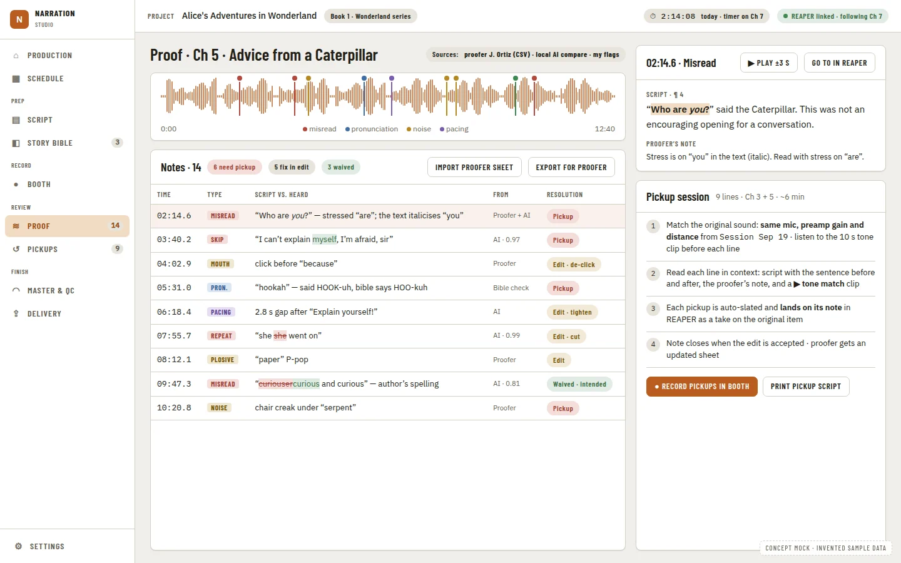

# Closed-Loop Proofing: Transcript Compare Without REAPER Running, One Merged Note List, and Pickups That Close Their Own Notes

**Source:** [Audiobook studio benchmark](../research/audiobook-studio-benchmark.md) recommendation 3 ("close the proofing loop") and its [Proofing and pickups](../research/audiobook-studio-benchmark.md#proofing-and-pickups) requirements table, and the benchmark train plan ([agent train](../operations/agent-train.md), wave 0). **Depends on:** [DAW Port and Capabilities](daw-port-and-capabilities.prd.md) (`review`, and its offline `project_read` role, which this PRD needs extended — see Evidence) and [Studio UI Primitives](studio-ui-primitives.prd.md) (`Timeline`, `TimelineLane`, `StatusBadge`, `CapabilityGate`). **Fills:** the note-at-playhead and pickups placeholder sections [Booth Mode and Companion Panel](booth-mode-and-companion-panel.prd.md) reserved for this PRD, and composes the booth actions enablement PRD's Punch-from-here control for the pickup session flow. **Decision record:** ADR 0402 (Proposed, this PRD).

## Problem Statement

The pieces of a proofing pass exist, but they do not talk to each other, and one of them cannot run without REAPER open:

- **Transcript Compare needs a live REAPER session.** `internal/transcript/service.go` holds `bridge dawadapter.Review` and refuses to start without it: `"Select a track in REAPER, then start a comparison"` and `"save the REAPER project and import a manuscript first"` are both live-bridge preconditions (`service.go:130,177`). `PrepareReview` asks REAPER to render and export before the comparison ever runs. Meanwhile `internal/coverage` (the recording check) already proves the alternative: it resolves the saved `.rpp` itself, parses it with `tracks.Parse`, and reads the chapter's recorded audio directly, with REAPER closed (`coverage/service.go:218-237`, `coverage/read.go:37`). The benchmark's own scorecard confirms the gap: "Recording check (coverage) from the saved `.rpp` | Shipped" beside "Transcript against manuscript... | Needs REAPER running."
- **Three note sources, three surfaces, no shared list.** The findings store already has room for this: `findings.Category` includes `CategoryTranscriptDiscrepancy` (AI, from Transcript Compare), `CategoryPickup` (self, written by `internal/repeats`' duplicate/restart detection and `internal/liveflags`' live teleprompter flags), and the dashboard (`ReviewPage.tsx`/`FindingsList.tsx`) already merges every analyzer's findings into one list with `unreviewed`/`accepted`/`dismissed`/`deferred` states (Milestone 1, shipped). But the **proofer's own CSV import never reaches this store**: `internal/pickups/service.go`'s `import_pickups` writes REAPER markers only (`bridge.Send("import_pickups", ...)`, `narration_pickups.lua`), read and worked through in a separate screen, `PickupsDialog.tsx`. A proofer's note and an AI-found discrepancy on the same line show up nowhere near each other.
- **Pickup session assembly and closing the loop are both missing outright.** The scorecard lists "Pickup session assembly: script in context, a tone-match clip, auto-slate" and "Pronunciation consistency across chapters" as Missing, and "A two-way link: resolving a note in the DAW updates the proof list, and the reverse. No competitor found does this" as the benchmark's own differentiator claim for this app, not yet built for pickups specifically (findings already close this loop for entity review, per `guide/findings_adapter.go`'s "resolved upstream... the finding's id simply being absent from the fresh list").

## Evidence

- `apps/desktop/internal/transcript/service.go:33,62-63,130,177,197,201`: the service is constructed over `*bridge.Client`/`dawadapter.Review` and every entry point checks a live bridge.
- `apps/desktop/internal/coverage/{service.go,read.go,chapter.go}`: the working offline pattern — resolve the saved `.rpp` path, parse it once with `tracks.Parse`, read chapter items directly. No REAPER process required.
- `apps/desktop/internal/findings/findings.go:26-39,59-65`: `Category` already lists `transcript_discrepancy`, `pronunciation`, `pickup`, `duplicate_read`, and four `Status` values (`unreviewed`, `accepted`, `dismissed`, `deferred`). Findings are partitioned by an `analyzerName` (`guide/findings_adapter.go`'s comment: "the Store partition this adapter's findings are saved under"), and a finding disappearing from an analyzer's next list is how the dashboard already treats it as resolved upstream — the exact "closing the loop" mechanic this PRD needs for pickups, already proven for Story Bible entities.
- `apps/desktop/internal/repeats/adapter.go:176-182`, `internal/liveflags/liveflags.go:75`: today's only two producers of `CategoryPickup` findings are duplicate/restart detection and live teleprompter flags — never the proofer's CSV import.
- `apps/desktop/internal/pickups/service.go:17-25,85-152`: a thin client over `bridge.Client` sending `import_pickups`/`export_pickups`/`next_pickup`/`resolve_pickup`/`count_pickups` to `narration_pickups.lua`. No `findings.Store` reference anywhere in the package.
- `apps/ui/src/components/{review/{ReviewPage.tsx,FindingsList.tsx},tracks/PickupsDialog.tsx}`: two separate screens today. The benchmark's own concept mock ([`04-proof-pickups.webp`](mockups/closed-loop-proofing/04-proof-pickups-concept.webp)) draws them as one.
- [Studio UI Primitives](studio-ui-primitives.prd.md)'s own Visual Spec for this mock already allocates the parts: "`Timeline` with a waveform backdrop... and a `TimelineLane` of markers in four categories (misread, pronunciation, noise, pacing)... The notes list is the existing `Table`... `CapabilityGate` on 'Go to in REAPER' and 'Record pickups in booth'." This PRD builds the page those primitives were reserved for.
- [DAW Port and Capabilities](daw-port-and-capabilities.prd.md) P5d migrates `internal/transcript` onto the `ReviewSession` role and gives `ProjectReader` (its offline `.rpp`-parsing role) to `tracks.go`, `chapterlinks.go`, `recordedlengths.go`, and `internal/{editing,coverage,character}` — **`internal/transcript` is not in that list**, so Transcript Compare's offline path (this PRD's Phase 1) needs `ProjectReader` extended to cover it too. That is a one-line addition to another lane's PRD (lane K owns `internal/dawport`), so this PRD requests it as a coordination note on [#509](https://github.com/countrymanprime/narration-utils/issues/509) rather than editing that PRD directly.
- **Pronunciation consistency**: the Story Bible already stores a confirmed pronunciation per entity (`internal/guide`), and Transcript Compare's ASR hypothesis already carries the recognized text per word. Nothing compares the two. True phonetic drift detection (comparing recorded audio to a reference clip) is [Character Continuity Review](character-continuity-review.prd.md)'s milestone-3 territory ("measured drift evidence against the anchor... shown as evidence for the narrator to judge, not a verdict"); this PRD scopes a text-level heuristic only (Open Question 5).

## Proposed Solution

1. **Offline Transcript Compare.** A new mode reads the chapter's linked track directly from the saved `.rpp` (via the extended `ProjectReader` role), locates the recorded audio the same way `internal/coverage` does, and runs the existing batch ASR comparison against it — no `bridge.PrepareReview`, no live REAPER required. The live-REAPER mode is kept for narrators who want to compare against what is currently open, unsaved changes included; the choice is per-run (Open Question 1).
2. **Proofer notes become findings.** `import_pickups`' parsed CSV rows are also written to `findings.Store` under a new analyzer partition (`proofer-import`), each finding carrying the CSV's original category, line and note text, alongside the existing REAPER-marker write (both happen; neither replaces the other, since the markers are still how the narrator jumps to the spot in REAPER). Once in the store, the dashboard's existing merge already shows them beside AI and self notes with no further plumbing.
3. **One merged proof view**, per mock 04: a `Timeline`/`TimelineLane` overview of a chapter's notes by category (misread, pronunciation, noise, pacing, proofer), the existing `Table`-based `FindingsList` for the actual note rows, each showing a **source** badge (Proofer, AI, Self) derived from its analyzer partition, and a resolution of **Pickup**, **Fix in edit**, or **Waived** (Open Question 2 maps these onto the existing `Status` values).
4. **Pickup session assembly.** A "Plan pickup session" action collects every note resolved **Pickup** for a chapter into an ordered list, each with the script line in context and, where a prior take exists for that line, a tone-match reference clip. This is the content that fills [Booth Mode and Companion Panel](booth-mode-and-companion-panel.prd.md)'s reserved companion placeholder.
5. **Closing the loop.** When a pickup take is created for a note (through the booth actions enablement PRD's already-wired `take_create` role, from the pickup session view or the companion panel), the note's finding is marked resolved the same way Story Bible entities already resolve: it drops out of the analyzer's next list. The reverse direction (resolving in REAPER already updates the proof list) is what "drops out" already means, since the list is read from the store, not cached.
6. **Pronunciation consistency (heuristic).** For each Story Bible entity with a confirmed pronunciation, Transcript Compare's own ASR hypothesis text is checked, chapter by chapter, for a spelling that diverges from what the confirmed pronunciation implies (reusing the existing number/word-form normalization the comparison already does, so "forty" is not flagged against "40" the way the benchmark's differentiator table describes). A divergence becomes a `CategoryPronunciation` finding naming both chapters. This is explicitly a text-level proxy, not audio analysis (Open Question 5).

## Key Hypothesis

We believe that writing proofer notes into the same store the AI and self notes already use, rather than building a second merge layer, will make "one list" nearly free, and that reusing `internal/coverage`'s offline `.rpp` pattern will let Transcript Compare run without REAPER the same way the recording check already does. We will know it holds when a chapter's Review page shows a proofer's CSV note, an AI-found misread and a live-session flag in one list with one set of actions, and when the owner runs a full comparison with REAperto closed.

## What We're NOT Building

| Item | Why |
| --- | --- |
| A new ASR engine, a new comparison algorithm, or any change to how `compare()` scores a discrepancy | This PRD changes what feeds the comparison (offline audio access) and what happens to its output (findings), not the comparison itself |
| Audio-based phonetic drift detection ("does this recording sound like the reference clip") | [Character Continuity Review](character-continuity-review.prd.md) milestone 3. This PRD's pronunciation check is text-level only |
| The booth screen, the companion panel's layout, `FocusShell`/`CompactShell` themselves | [Booth Mode and Companion Panel](booth-mode-and-companion-panel.prd.md). This PRD fills that PRD's reserved placeholder with real data, it does not build the shell |
| Punch-from-here's behaviour, the record-with-reading toggle | The booth actions enablement PRD. This PRD composes `take_create`/`punch` the same way that PRD's controls already do |
| Retiring `PickupsDialog.tsx` or the REAPER-marker pickups workflow | It stays, for a narrator working straight from REAPER without the merged view open; this PRD adds a second, merged surface, it does not remove the first |
| `Timeline`, `TimelineLane`, `StatusBadge`, `CapabilityGate` themselves | [Studio UI Primitives](studio-ui-primitives.prd.md). This PRD is the consumer that PRD's Visual Spec already names |
| A tone-match audio comparison algorithm (measuring how close a pickup's read is to the surrounding take) | Out of scope; the pickup session shows the reference clip for the narrator's own ear, it does not score the match |
| Delivery findings on the Review page (book-wide QC results) | Benchmark recommendation 4 ([Delivery Platform Profiles](delivery-platform-profiles.prd.md)), a separate wave-0 stream (N-D2) |

## Success Metrics

| Metric | Target | How measured |
| --- | --- | --- |
| Transcript Compare without REAPER | A comparison completes with REAPER closed, reading the saved `.rpp` and its recorded audio | A Go integration test with a fixture `.rpp` and synthetic audio, no bridge; owner-pending real-chapter check |
| Proofer notes in the merged list | A CSV import produces both a REAPER marker (existing) and a `findings.Store` entry (new), visible on the Review page | Go test on `import_pickups`'s handler; a Vitest on `FindingsList` showing a `proofer-import` finding |
| One list, one set of actions | The Review page shows AI, self and proofer notes together, each with a source badge and a Pickup/Fix in edit/Waived resolution | Visual suite states; a test that filters and counts findings by analyzer partition |
| Pickup session assembly | Every note resolved Pickup for a chapter appears in session order with its script line and, where one exists, a reference clip | Unit test building a session from fixture findings and takes |
| Loop closes | Creating a take for a pickup note's line resolves that note, without a manual dismiss | Integration test: `take_create` for a note's GUID, then the note is absent from the next findings read |
| Pronunciation heuristic | Every entity with a confirmed pronunciation and a text divergence in a chapter's transcript produces one `pronunciation` finding naming both chapters | Unit test over fixture ASR hypotheses and Story Bible entries; a documented false-positive rate on a sample chapter (owner-pending judgement, since this is a heuristic, not a verdict) |
| Gate | `pnpm check`; the Lua harness unaffected (no new command); the visual suite for the merged proof view and the pickup session, every viewport; `pnpm --dir apps/ui run aria` for the new page | `full-verification-gate` |

## Open Questions

Every question is answered with a recommendation, adopted if the owner does not say otherwise (D22 of the [implementation plan](implementation-plan.md)).

1. **Does offline Transcript Compare replace the live mode, or sit beside it?** *Recommendation:* beside it. A per-run choice ("Compare against the saved project" vs. "Compare against REAPER now"), defaulting to offline when REAPER is not reachable (read from the DAW port's `heartbeat`) and to live otherwise, matching what the narrator already has open.
2. **How do the benchmark's three resolutions (Pickup, Fix in edit, Waived) map onto the existing `Status` enum** (`unreviewed`, `accepted`, `dismissed`, `deferred`)? *Recommendation:* `accepted` means "queued for a pickup" (the default accept action for a `pickup`/`transcript_discrepancy`/`proofer-import` finding), a new UI-only "Fix in edit" action sets `accepted` **and** a note-level flag (not a schema change: a tag in the finding's existing free-form `Note`/metadata field, per `findings-contract.md`'s allowance) so the pickup session can exclude it, and `dismissed` means Waived. `deferred` is unchanged (its existing "look at this later" meaning). No new `Status` value, so the wire contract and every existing consumer of `Status` stay unchanged.
3. **Does the proofer-import analyzer need its own settings or category, or does it reuse `CategoryPickup`?** *Recommendation:* a new `CategoryProoferNote` (schema addition, additive per `findings-contract.md`'s versioning rule) rather than overloading `CategoryPickup`, since a proofer's note and a detected duplicate/restart need different narrator-facing icons and the pickup-readiness signal (`internal/proofing`) already keys off specific categories and must not silently start counting proofer notes as "pickups" without a decision.
4. **Where does the pickup session live?** Options: (A) its own page, reached from the Review page's "Plan pickup session" action; (B) only inside the companion panel. *Recommendation:* A, with the companion panel (Booth Mode and Companion Panel PRD) showing a compact view of the same session data, so a narrator without the companion panel open still gets the feature.
5. **Is the pronunciation heuristic worth shipping given its false-positive risk?** *Recommendation:* yes, but labelled clearly as a heuristic ("Possible pronunciation drift — check this yourself") and off by default behind a setting, since it is text-level and cannot hear the actual audio; the owner reviews a sample chapter's output before it defaults on.
6. **`ProjectReader` for `internal/transcript`: coordinate now, or block Phase 1 on it?** *Recommendation:* comment on [#509](https://github.com/countrymanprime/narration-utils/issues/509) now, requesting lane K add `internal/transcript` to the DAW port PRD's P5d caller list; Phase 1 here can start against `internal/tracks.Parse` directly (as `coverage` does today, pre-port) and migrate onto `dawport.ProjectReader` once P5d lands, so this PRD is not blocked waiting for another lane's PRD edit.

## Users & Context

- **The proofer** (often not the narrator) delivers a CSV of notes today; they should not need to know whether a given line was also flagged by the AI or the narrator's own live session.
- **The narrator working alone**, reading their own live flags and the AI's discrepancies together with any proofer notes, deciding pickup, fix-in-edit or waive from one screen.
- **The narrator recording pickups**, who wants the line in context and a clip to match tone against, and expects the note to close itself once the pickup is recorded.
- **A narrator without REAPER open**, checking yesterday's chapter's proof results before deciding whether to launch REAPER at all.

## Solution Detail

### Core capabilities (MoSCoW)

| Priority | Capability |
| --- | --- |
| Must | Offline Transcript Compare over the saved `.rpp` and its recorded audio |
| Must | Proofer CSV import also writes `findings.Store` entries (`CategoryProoferNote`, `proofer-import` partition) |
| Must | Merged proof view: `Timeline`/`TimelineLane` overview plus the existing `Table` list, source badges, the three-way resolution mapping |
| Should | Pickup session assembly (script in context, reference clip where one exists) |
| Should | Closing the loop: a pickup take created for a note resolves it |
| Could | Pronunciation consistency heuristic, off by default |
| Won't | Audio-based drift detection, a tone-match scoring algorithm, retiring `PickupsDialog.tsx` |

### MVP scope

Phases 1 to 4 (offline compare, proofer notes as findings, the merged view). Phases 5 and 6 (pickup session assembly and closing the loop, the pronunciation heuristic) complete the benchmark's recommendation and depend on the booth actions enablement PRD's `take_create`/`punch` wiring being live.

### User flow

1. A narrator without REAPER open checks yesterday's Chapter 4: they run "Compare against the saved project." The comparison completes in the background, no REAPER window ever opens.
2. On the Review page, Chapter 4 shows one list: a proofer's "MISREAD, para 3" note (badge: Proofer), an AI-found skip (badge: AI), and one live flag from the session (badge: Self). They mark the proofer note **Pickup** and the AI one **Fix in edit**.
3. They open "Plan pickup session" for the chapter: one note is queued, with its script line and a clip from the take beside it for tone reference.
4. They record the pickup (through the booth's Punch-from-here and the existing take-create flow). The note disappears from the open list on its own.
5. Later, a Story Bible entity's pronunciation heuristic (opted in) flags one chapter where "Worcestershire" reads differently than a chapter three books back; the narrator checks it themselves rather than trusting a verdict.

## Technical Approach

**Feasibility: high** for offline compare and the findings integration (both reuse existing, working patterns). **Medium** for the pronunciation heuristic, whose usefulness is unproven until real chapters are checked.

**Architecture:**

- **Offline compare (Phase 1).** A new code path in `internal/transcript` (or a sibling package, `internal/transcript/offline.go`, decided in the phase) resolves the saved `.rpp` the way `coverage.savedProject` does, reads the chapter's linked track's items, and calls the same batch ASR comparison `compare()` already runs, bypassing `PrepareReview`. The live path is untouched; a `Source` field (`live` | `saved`) on the run's state distinguishes them for the UI and any wire contract that reads run state.
- **Proofer notes (Phase 2).** `internal/pickups`' `ImportPickups` handler, after writing the REAPER markers as it does today, also builds one `findings.Finding` per row (category `CategoryProoferNote`, analyzer partition `proofer-import`) and calls `findings.Store.SaveAnalyzerFindings("proofer-import", ...)`. The CSV's line text and category are carried into the finding's existing free-form fields per `findings-contract.md`; no new binding, since the import already goes through `ImportPickups`.
- **Category addition.** `CategoryProoferNote` is an additive change to `findings.Category` and the wire schema per `findings-contract.md`'s versioning rule (new values are backward compatible; a consumer that does not know the value treats it as an unrecognized category, never a crash — the existing pattern for every category added since the contract shipped).
- **Merged view (Phase 3).** A new `components/review/ProofTimeline.tsx` using `Timeline`/`TimelineLane` for the chapter overview (one lane, markers coloured by category, per studio-ui-primitives' own allocation for this mock), rendered above the existing `FindingsList` (unchanged row rendering, plus a new source-badge column derived client-side from each finding's analyzer partition, which the wire payload already carries). The three resolution actions call the existing accept/dismiss/defer bindings; "Fix in edit" is a UI-only variant of accept that also sets the note-level tag from Open Question 2.
- **Pickup session (Phase 4).** A new binding, `PlanPickupSession(chapterId)`, collects `accepted` findings tagged "pickup" for the chapter, orders them by script position, and for each resolves whether a prior take's audio for that line exists (via the existing take-review data) to attach as a reference clip path. `hostAPIVersion` bump; wire contract, golden, mock. The UI's `PickupSessionView.tsx` is what the companion panel's placeholder (Booth Mode and Companion Panel PRD) renders a compact version of.
- **Closing the loop (Phase 5).** The existing `take_create` role (booth actions enablement) gains an optional `resolvesFinding` parameter; when a pickup take is created from the pickup session view or the companion panel with a note's id attached, the host calls the existing dismiss-by-resolution path (the same mechanism `guide/findings_adapter.go` already relies on: the finding stops being produced by its analyzer's next read). No REAPER-side change.
- **Pronunciation heuristic (Phase 6).** A new analyzer, `internal/pronunciationcheck`, reads Story Bible entities with a confirmed pronunciation and Transcript Compare's stored ASR hypotheses per chapter (already persisted for the comparison), applies the same number/word-form normalization `compare()` uses, and flags a text divergence as `CategoryPronunciation` under a `pronunciation-check` partition. Off by default (a new setting, append-only in `config/defaults.json`).

**Risks:**

| Risk | Likelihood | Mitigation |
| --- | --- | --- |
| Offline compare's audio-location logic diverges from `coverage`'s and the two disagree about which file is "the" recording | Medium | Phase 1 extracts the shared item-resolution logic into `internal/tracks` (or reuses `coverage`'s helper directly) rather than re-implementing it |
| A proofer's CSV format varies enough that its rows do not map cleanly to a finding's required fields | Medium | Reuse the exact parser `import_pickups` already validates against; a malformed row is skipped the same way the marker import already skips it, with the same per-row error report |
| The pronunciation heuristic produces enough false positives to be ignored | High | Off by default (Open Question 5); the owner reviews a sample chapter before recommending it on generally |
| `internal/transcript` is a hot file other PRDs also touch (Recording Check Model Cascade, Proofing Vocabulary Hints) | Medium | Phase 1 adds a new code path beside the existing one; it does not restructure `compare()` or its callers |
| `ProjectReader`'s caller list lands in DAW port P5d without `internal/transcript` | Medium | Phase 1 does not block on it (Open Question 6); it calls `tracks.Parse` directly until the port catches up |

## Implementation Phases

| # | Phase | Description | Status | Parallel | Depends | Ports used | PRP Plan |
| --- | --- | --- | --- | --- | --- | --- | --- |
| 1 | Offline Transcript Compare | New saved-project code path in `internal/transcript`; `Source` field on run state; UI choice of saved vs. live | pending | with 2 | Coordination note on #509 (DAW port `ProjectReader` caller list); otherwise none | DAW port: `project_read` (once extended), else direct `tracks.Parse` | - |
| 2 | Proofer notes as findings | `ImportPickups` also writes `findings.Store` under `CategoryProoferNote`/`proofer-import`; schema addition to `findings-contract.md` | pending | with 1 | none | none | - |
| 3 | Merged proof view | `ProofTimeline.tsx` (`Timeline`/`TimelineLane`), source badges on `FindingsList`, the three-way resolution mapping; visual states, aria | pending | no | 1, 2, studio-ui-primitives P7 (Timeline), P3 (StatusBadge) | UI: `Timeline`, `TimelineLane`, `StatusBadge` | - |
| 4 | Pickup session assembly | `PlanPickupSession` binding; `PickupSessionView.tsx`; wire contract, golden, mock | pending | with 5 | 2, 3 | DAW port: `take_create` (read-only lookups) | - |
| 5 | Closing the loop | `take_create`'s `resolvesFinding` parameter; the dismiss-by-resolution path | pending | with 4 | 2, booth actions enablement P2 (Record-in-REAPER) or P3 (Punch) for the recording step | DAW port: `take_create`, `punch` (via composed controls) | - |
| 6 | Pronunciation consistency heuristic | `internal/pronunciationcheck`; `CategoryPronunciation` findings under `pronunciation-check`; setting, off by default | pending | with 4, 5 | 1 (needs stored ASR hypotheses) | none | - |
| 7 | Companion panel integration | The companion panel's reserved placeholder (Booth Mode and Companion Panel PRD) renders a compact `PickupSessionView` | pending | no | 4, Booth Mode and Companion Panel PRD Phase 7 | UI: `CompactShell` (from that PRD) | - |
| 8 | Steady state | `docs/utilities/{proofing,pickups}.md` or extend existing utility docs; `findings-contract.md` version bump note; threat-model row (proofer CSV content now also stored as findings data, no new external surface); ADR 0402 to Accepted; delete this PRD | pending | no | 1-7 | none | - |

### Phase details

- **P1 (lane B, Sonnet).** Change-impact scan first: every consumer of `internal/transcript`'s run state (`bindings_*` files reading it, `ReadAlongView` if any, the Review page) is checked for a hard assumption that a run is always live.
- **P2 (lane B, Sonnet).** File-disjoint from P1 (`internal/pickups` vs. `internal/transcript`); can run in parallel.
- **P3 (lane C, Sonnet).** Depends on Studio UI Primitives' `Timeline` phase landing; if it has not, this phase can stub the overview and land the source badges and resolution mapping first, then add `Timeline` in a small follow-up.
- **P4, P5 (lane A/C pair, Sonnet).** P4 is the binding and its view; P5 is the closing-the-loop wiring inside `take_create`. File-disjoint (a new binding file vs. an existing one's parameter), can run in parallel.
- **P6 (lane B, Sonnet).** Entirely new package; no collision with P1-P5's files.
- **P7 (lane C, Sonnet).** Waits for the companion panel's own layout phase to exist, even as a stub, so this phase has somewhere to render into.
- **P8 (lane D, Haiku or Sonnet).** Last.

### Parallelism notes

- P1 and P2 run at once (disjoint packages).
- P3 depends on both; P4 and P5 depend on P2/P3 and run at once; P6 depends only on P1 (needs stored hypotheses) and can run alongside P3-P5.
- P7 is the one phase that depends on another PRD's phase (Booth Mode and Companion Panel's companion layout); it is last among the feature phases for that reason.
- P8 is last overall.

### Parallel-session compatibility

| Phase | Files it touches | Collides with |
| --- | --- | --- |
| 1 | `apps/desktop/internal/transcript/**` | [Recording Check Model Cascade](recording-check-model-cascade.prd.md), [Proofing Vocabulary Hints](proofing-vocabulary-hints.prd.md) (both touch the same package; sequence via #509) |
| 2 | `apps/desktop/internal/pickups/**`, `apps/desktop/internal/findings/**` (additive category), `docs/architecture/findings-contract.md` | Any PRD adding a `findings.Category` value (additive; the coordinator merges) |
| 3 | New `components/review/ProofTimeline.tsx`, `components/review/FindingsList.tsx`, `tests/visual/**`, `tests/aria/**` | Any other Review-page PRD |
| 4 | New `apps/desktop/bindings_pickupsession.go`, `components/review/PickupSessionView.tsx`, `hostAPIVersion` files | Any PRD bumping `hostAPIVersion` |
| 5 | `internal/takereview/createtake.go` (the `take_create` role's implementation), `apps/desktop/internal/findings/**` | Booth actions enablement (shares `take_create`'s caller; coordinate) |
| 6 | New `apps/desktop/internal/pronunciationcheck/**`, `config/defaults.json` (append-only) | None |
| 7 | Booth Mode and Companion Panel's `CompanionShell.tsx` (filling its placeholder, not restructuring it) | That PRD's own remaining phases on the same file |
| 8 | `docs/architecture/findings-contract.md`, `docs/architecture/threat-model.md`, `docs/adr/0402-*`, this PRD (deleted) | None |

## Decisions Log

| # | Decision | Date |
| --- | --- | --- |
| D1 | Transcript Compare gains an offline mode beside its live one; the live mode is never removed | 2026-09-26 |
| D2 | Proofer CSV notes are written to `findings.Store` in addition to REAPER markers, under a new `CategoryProoferNote`/`proofer-import` partition, rather than replacing the marker-only workflow | 2026-09-26 |
| D3 | The three benchmark resolutions (Pickup, Fix in edit, Waived) map onto the existing `Status` enum plus one UI-level tag, with no schema change to `Status` itself (Open Question 2) | 2026-09-26 |
| D4 | The pronunciation consistency check is a text-level heuristic, off by default, explicitly not audio-based drift detection (Open Question 5) | 2026-09-26 |

## Research Summary

- **In the code (2026-09-26, `48a882d`):** `internal/transcript` requires a live bridge at every entry point; `internal/coverage` proves the offline pattern works; `findings.Category` already has room for a merged list but the proofer's CSV import never uses it; `CategoryPickup` today comes only from duplicate/restart detection and live flags.
- **In the sibling PRDs:** Studio UI Primitives' Visual Spec for mock 04 already names the exact primitives this PRD's merged view needs; Booth Mode and Companion Panel explicitly reserves its companion placeholder for this PRD to fill; DAW port's P5d needs one addition (`internal/transcript` in the `ProjectReader` caller list) that this PRD flags for lane K rather than editing directly.
- **In the benchmark:** "A two-way link: resolving a note in the DAW updates the proof list, and the reverse. No competitor found does this" is named as this app's strongest differentiator; this PRD is where that claim becomes true for pickups specifically, using the same closing-the-loop mechanic the Story Bible findings adapter already proved.

## Visual Spec

The image below is the benchmark's **concept mock, not an owner-approved spec**, copied here from `docs/research/mockups/audiobook-studio-benchmark/`. A UI pull request for this PRD's phases compares its capture against this concept mock and says so in its Mockup check table, until the owner approves it on [#510](https://github.com/countrymanprime/narration-utils/issues/510).

### Proof and pickups

- `Timeline` with a waveform backdrop and a `TimelineLane` of markers in four categories (misread, pronunciation, noise, pacing) — Phase 3.
- `StatusBadge`: note types (MISREAD, SKIP, MOUTH, PRON.), the source badges this PRD adds (Proofer, AI, Self), resolutions (Pickup, Fix in edit, Waived) and summary counts ("6 need pickup") — Phase 3.
- `CapabilityGate` on "Go to in REAPER" and "Record pickups in booth," composed unchanged from the booth actions enablement PRD and [DAW Port and Capabilities](daw-port-and-capabilities.prd.md).
- The notes list is the existing `Table` (`FindingsList.tsx`); the source strip and the pickup-session steps are this PRD's feature layout (Phases 3 and 4).
