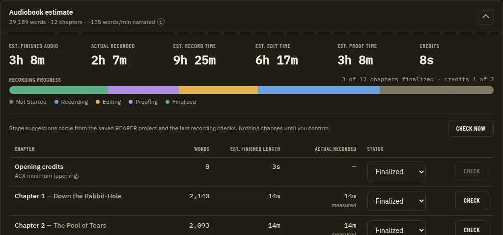
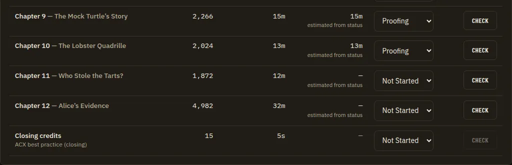
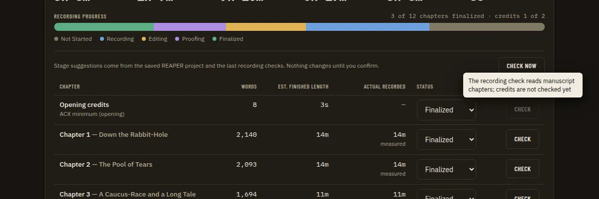
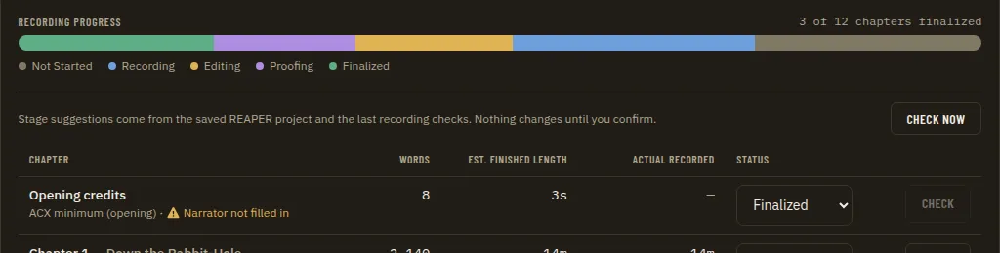
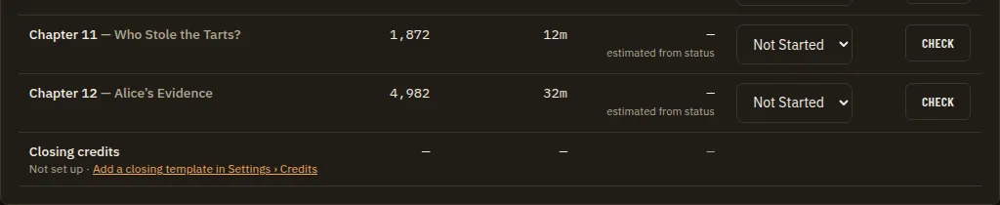

# Credits in the Chapter Table

**Source:** owner report of 2026-09-24 on the Home page's per-chapter breakdown (columns Chapter, Words, Est. finished length, Actual recorded, Status, with a status select and a Check button per row): "Every audiobook has opening and closing credits. I know they appear in the manuscript page but they are not here. They should be, as they are something that would be recorded." The owner drew an arrow above the first row ("A Message from the Author"): Opening credits come first, Closing credits last. Citations are `file:line` at `7a20a9e`. Builds on the delivered parts of [Audiobook Credits Templates](audiobook-credits-templates.prd.md) (templates, renderer, the Credits stat, the Manuscript entries, the teleprompter) and touches the same table as [Chapter Stage Recommendations](chapter-stage-recommendations.prd.md). Not covered here: the stage check line and "Check now" above the table (a separate PRD).

**Status (2026-09-26):** Phases 1 and 2 complete; open questions CT1 to CT9 resolved per their recommendations. Phase 4's host half is built (CT8); its dialog and the scripted REAPER check remain. Phase 3 (CT4 option (c)) is partial: the track link is built (ADR 0214); the coverage basis needs a sidecar change outside this stream's lane.

## Problem Statement

The chapter table on Home is where a narrator tracks what has been recorded, but it lists only manuscript chapters. Opening and closing credits are recorded too, usually as their own files, yet they have no row: no length, no status, no recorded time, no check. The narrator has to track the two files somewhere else, and the table's "everything recorded" moment is false while the credits are still unread.

## Evidence

- **The table is built from manuscript chapters only.** `AudiobookEstimatePanel` loads `api.manuscriptChapters()` (`apps/ui/src/components/home/AudiobookEstimatePanel.tsx:100`), keeps narration chapters (`:110`) and renders one row per chapter (`:206-298`). `ManuscriptChapters` (`apps/desktop/bindings.go:467-469`) returns one payload per chapter of `manuscript.json` (`apps/desktop/internal/manuscript/reader.go:69-82`). Nothing in that path knows about credits.
- **Credits are deliberately not chapters.** They are rendered from the narrator's template library (`apps/desktop/internal/credits`, `apps/ui/src/api/contracts/credits.ts:51-72`) with the project's values on the project manifest (`apps/desktop/internal/project/manifest.go:34-39`). The Manuscript page shows them as pseudo-entries held in local state, "never chapters ... nothing ChapterNav or search iterates over" (`apps/ui/src/components/manuscript/Manuscript.tsx:101-108`), rendered before and after the chapter list (`:496-503`, `:595-600`), labelled "Opening credits" and "Closing credits" (`CreditsEntry.tsx:6`, `:8-15`). ADR 0150 records the same rule for the teleprompter ("The credits are not manuscript chapters and must never become one"), and the teleprompter picker already offers them "first and last around the chapters" (`TeleprompterPage.tsx:15-40`). This is why the Manuscript page has them and Home does not: the credits PRD put them on the estimate as a single number and on the reading surfaces, and never on the table (its Solution Detail, `audiobook-credits-templates.prd.md:97-108`, has no table row).
- **Credits reach Home only as one stat.** `useCreditsSeconds` times the first opening and first closing template (ADR 0093) with room tone, plus every chapter announcement (ADR 0151) (`apps/ui/src/components/home/useCreditsSeconds.ts:24-48`); the panel shows it as a separate "Credits" stat and never folds it into the narration total (`AudiobookEstimatePanel.tsx:123-125`), which was a success metric of that PRD ("the narration total is unchanged", `audiobook-credits-templates.prd.md:54`). Seconds under a minute are shown as seconds (`:31-35`).
- **Every per-row action is keyed to a manuscript chapter id.**
  - Status: `ManuscriptSetChapterStatus` (`bindings.go:479-481`) refuses an id not in `manuscript.json` ("unknown manuscript chapter", `reader.go:158-181`) and stores `chapterStatus[id]` in `narration-utils/manuscript-notes.json`, which `resetDerived` deletes on Replace manuscript and Clear (`apps/desktop/internal/manuscript/service.go:527-536`). Credits values and templates survive both (credits PRD, Survival metric), so a credits status stored beside chapter statuses would not.
  - Actual recorded: a measured `recordedFraction` or a guess from the status (`AudiobookEstimatePanel.tsx:37`, `:208-247`).
  - Check (recording coverage): the basis is the chapter's manuscript paragraphs, and a missing chapter or a non-narration kind is "unknown" (`apps/desktop/internal/coverage/chapter.go:38-75`); the track is the one narrator-confirmed link for that chapter id (`coverage/manifest.go:174-195`, `evidence/mapping.go:56`); link suggestions match track names against chapter titles only (`evidence/mapping.go:241-305`).
  - Stage suggestions: assessed for narration chapters only (`apps/desktop/internal/stages/assess.go:32`, `:45-47`; `stages/service.go:102-114`).
- **No ADR excludes credits from the table.** ADR 0004 keeps `contentKind: "opening"` for Front Matter and rejected "Opening Credits" as a name *for Front Matter* (`docs/adr/0004-front-matter-naming.md:8-10`), so these rows must not reuse that kind. ADR 0005 and ADR 0090 concern reference material in navigation and the reader. ADR 0093 (first template of each kind) and ADR 0150 (credits are never chapters) constrain the approach; nothing is superseded.
- **Downstream consumers.** REAPER chapter regions (`create_chapter_regions`, `integrations/reaper/narration_line_identity.lua:187-221`, harness `integrations/reaper/tests/line_identity_test.lua:209`) exist but have no Go caller; [REAPER Automation Follow-Through](reaper-automation-follow-through.prd.md) Phase 7 ("chapter regions from matched tracks") is partial. Per-region render names files after regions (`narration_render.lua:1-40`, `$region`). The delivery report lists files by name and does not match them to chapters (`apps/desktop/internal/deliveryreport/model.go:13-14`). The visual suite has `home/chapter-table-expanded` and the stage states (`apps/ui/tests/visual/state-catalog.ts:45-51`, `:164-214`); the mock seeds three built-in templates (`apps/ui/src/api/mockApi.ts:520-544`), so the demo book would show both rows.
- **Where the owner saw it.** The demo manuscript's first narration row is "A Message from the Author", then "PROLOGUE — The Last Good Applause"; the Manuscript page shows the Opening credits entry above it. The mismatch between the two pages is the report.

## Proposed Solution

Two credits rows in the chapter table, Opening credits first and Closing credits last, each showing the rendered words, the estimated length (as the Credits stat times it), a status the narrator can set and that survives Replace manuscript, and the actual recorded time from that status. The rows are not manuscript chapters: they come from the same first-of-kind template the Manuscript page and the teleprompter use (ADR 0093), and their status lives on the project manifest beside the credits values. The Check button on a credits row is present but disabled with a reason until a later phase lets the recording check read a credits file against the rendered text.

## Key Hypothesis

We believe showing the credits as the first and last rows of the chapter table, with a status of their own, will let narrators track the whole recording in one place. We'll know we're right when the owner can mark Opening credits "Finalized" on Home, replace the manuscript, and still see it finalized, first in the table.

## What We're NOT Building

- Making credits manuscript chapters or adding them to `manuscript.json`, `ChapterNav`, search or `contentKind` (ADR 0004, ADR 0150).
- Per-project template selection (ADR 0093's open follow-up); the rows show what the Manuscript page and teleprompter already show.
- Editing credits text in the table; the row links to where it is read (Manuscript) and edited (Settings > Credits).
- Chapter announcements as rows; they are read inside each chapter file (ADR 0151).
- Stage suggestions for credits (the stage engine's evidence is per manuscript chapter).
- Rendering or exporting credits audio, retailer metadata, or matching delivery report files to rows.
- The stage check line and "Check now" above the table (separate PRD).

## Success Metrics

| Metric | Target | How Measured |
| --- | --- | --- |
| Placement | Opening credits is the first row and Closing credits the last, whatever the chapter order; each appears only when its template exists | Vitest on `AudiobookEstimatePanel`; visual state |
| Same numbers | A row's words equal `creditsPreview(...).words` for the same template the Manuscript entry and teleprompter use; its length uses `WORDS_PER_FINISHED_HOUR` plus room tone, as the Credits stat does | Vitest; a test that the two rows plus announcements equal the Credits stat |
| Status persists | A credits status survives reload, Replace manuscript and Clear derived data | Go tests on the manifest store |
| Narration totals | Header words and chapter count, Est. finished audio and the narration progress unchanged unless CT1 says otherwise | Existing Vitest cases unchanged; a new case with credits rows |
| No chapter leakage | `manuscriptChapters`, `ChapterNav`, search, stages and coverage never see a credits id | Go and Vitest tests |
| Contracts | New payloads pass a Zod schema, a golden written by a Go test and a `wireContracts.test.ts` row; the mock passes the schema | `pnpm check` |
| UI gate | New states pass the visual suite at every viewport with axe clean; PNGs reviewed | Playwright `app.spec.ts` |

## Open Questions

- [ ] **CT1. Do credits count in the book totals?** The header ("N words · M chapters"), Est. finished audio, Actual recorded, the progress bar and "x of N chapters finalized" are narration-only today, and the credits PRD made "the narration total is unchanged" a metric. Recommendation: keep every narration total as it is (the Credits stat already holds the credits time) and add the credits to the progress text only, for example "12 of 20 chapters finalized · credits 1 of 2".
- [ ] **CT2. Which statuses do credits have?** The same five (Not started, Recording, Editing, Proofing, Finalized) or a shorter set? Recommendation: the same five, so the select and the colours match.
- [ ] **CT3. Where does a credits status live?** Recommendation: on the project manifest beside `Credits` and `RetailSample` (`manifest.go:34-42`), so it survives Replace manuscript like the credits text does; the alternative, `manuscript-notes.json`, is wiped by `resetDerived`.
- [ ] **CT4. Check on a credits row.** Options: (a) disabled with the reason "The recording check reads manuscript chapters; credits are not checked yet", (b) hidden, (c) built now. Recommendation: (a) in Phase 2, then Phase 3 builds it if the owner wants measured credits.
- [ ] **CT5. A missing template.** When the library has no opening (or closing) template, omit the row as the Manuscript page and teleprompter do, or show a row "Not set up" linking to Settings > Credits? Recommendation: show the row with the link. The owner's point is that the credits are always recorded, and defaults are seeded, so a missing one is worth pointing out.
- [ ] **CT6. Row labels.** "Opening credits"/"Closing credits" (as on the Manuscript page, `CreditsEntry.tsx:6`) or the template's name? Recommendation: the fixed labels, with the template name as the muted subtitle, and a warning marker when the text has unresolved tokens (C6 of the credits PRD: warn, never block).
- [ ] **CT7. Where the row link goes.** Recommendation: the Manuscript page's credits entry, opened and scrolled to (`/manuscript#credits-opening`), matching how chapter titles link to `/manuscript#c<id>` (`AudiobookEstimatePanel.tsx:217-225`).
- [x] **CT8. REAPER regions and file names.** When chapter regions are built (REAPER automation Phase 7), should the credits get regions of their own so the `$region` render writes separate files (ACX: "Opening and closing credits should be separate files", credits PRD Evidence)? What names: the row labels, or numbered for sorting ("00 Opening Credits", "99 Closing Credits")? Do other distributors (Findaway, publishers) need different names? Recommendation: own regions named like the row labels; numbering is the narrator's call in the render dialog. **Adopted (D22, D39):** the credits get their own regions named "Opening credits" and "Closing credits", listed first and last (Phase 4, [ADR 0245](../adr/0245-chapter-and-credits-regions-are-planned-by-the-host-from-confirmed-links-and-the-saved-project.md)). Other distributors' naming is still not verified.
- [ ] **CT9. Room tone in a row's length.** Recommendation: include the room tone setting per credits file, as the Credits stat does (ADR 0151), so the two rows add up to the Credits stat minus the chapter announcements.

## Users & Context

**Primary User**: an independent narrator or producer tracking a whole audiobook recording on Home, Windows first.
**Current behavior**: tracks chapters in the table and the credits in their head or elsewhere; the Manuscript page shows the credits, Home does not.
**Trigger**: recording or finishing the opening and closing credits files.
**Success state**: the table shows Opening credits first and Closing credits last with their own status, and the narrator can see at a glance that the whole book, credits included, is recorded.
**Job to Be Done**: When I work through a book, I want every file I have to record in one list, so nothing is forgotten at delivery.
**Non-Users**: narrators whose producer adds credits in post (they can leave the rows at Not started or delete the templates).

## Solution Detail

| Priority | Capability | Phase |
| --- | --- | --- |
| Must | Credits status on the project manifest, with host bindings to read and set it | 1 |
| Must | Opening credits row first and Closing credits row last: label, template name, words, est. length, actual recorded from status, status select | 2 |
| Must | Narration totals unchanged (per CT1) and credits rows never passed to stages or coverage | 2 |
| Should | Row link to the Manuscript credits entry; unresolved-token warning; "Not set up" row (per CT5) | 2 |
| Should | Credits progress in the progress text (per CT1) | 2 |
| Could | Recording check for credits: a basis from the rendered text, a track link for a credits id, track-name suggestions for "Opening credits"/"Closing credits" | 3 |
| Could | Credits regions in the REAPER chapter-regions flow (per CT8) | 4 |
| Won't | Credits as manuscript chapters; stage suggestions for credits; per-project template choice | - |

**User flow**: Home > Audiobook estimate > Show per-chapter breakdown. The first row is "Opening credits" (template "ACX minimum (opening)", 8 words, about 3s, Not started), then the chapters, then "Closing credits". The narrator records the opening credits in REAPER, sets the row to Finalized, and the progress line reads "0 of 20 chapters finalized · credits 1 of 2". Replacing the manuscript later keeps that status.

## Technical Approach

**Feasibility**: HIGH for Phases 1 and 2 (existing bindings plus one small store); MEDIUM for Phase 3 (coverage and mapping assume manuscript ids); Phase 4 depends on another PRD's unbuilt phase.

**Architecture notes**
- **Identity.** Credits rows use the ids `credits-opening` and `credits-closing`, matching the teleprompter's `--script-id credits-<kind>` (ADR 0150). They never enter the `manuscriptChapters` array; the panel renders them outside `narrationChapters.map`, as the Manuscript page does, so stages, `rollupChapterStatuses` and every count stay narration-only by construction and not by a filter.
- **Status store (Phase 1).** `project.Manifest` gains an additive `CreditsStatus` map (`opening`/`closing` to a chapter status), validated with the existing `validChapterStatus` rule. Bindings: `CreditsStatuses()` and `CreditsSetStatus(kind, status)` on the host accessor (`h.services()`, a `stressReaders` row in `hostrace_test.go`), a `hostAPIVersion` bump (47 in `apps/desktop/app.go:52` and `apps/ui/src/hostApi.ts:2`, re-checked at merge), regenerated `Host.{js,d.ts}`. Per `CLAUDE.md` wire contracts: a Zod schema in `apps/ui/src/api/schemas/credits.ts`, goldens `tests/fixtures/contracts/credits-status*.json` written by a Go test (`UPDATE_CONTRACTS=1`), rows in `wireContracts.test.ts`, a mock that passes the schema.
- **Row data (Phase 2).** The panel reads the templates and previews once (a small hook next to `useCreditsSeconds`, sharing its first-of-kind lookup so the two cannot disagree), plus the statuses. Length uses `estimateCreditsSeconds` and the room tone setting; `fmtCreditsSeconds` formats it. Actual recorded shows only measured time, never a status guess: a plain "—" until the recorded seconds of [Actual Recorded](actual-recorded-column.prd.md) reach credits rows (the owner rejected estimates in this column).
- **Recording check (Phase 3).** `coverage` gains a basis for a credits id: the rendered text (hash of the text, not of manuscript paragraphs), so a changed template makes a result stale. The track link reuses `evidence.MappingStore` with the credits id; `suggestByMatch` adds the two credits titles as candidates. `RecordingCheck.tsx` takes a credits source. Needs a golden for any changed coverage payload and an ADR (the coverage basis is no longer only manuscript chapters).
- **REAPER (Phase 4).** No Lua change is expected: `create_chapter_regions` takes a row payload, so the Go caller built by REAPER automation Phase 7 adds credits rows with bounds from their linked tracks. If the payload shape changes, a harness test comes first (ADR 0066), and REAPER's own behaviour is checked scripted on a copy of a project with an isolated `-cfgfile`.
- **ADR.** One new ADR (next free number at merge, after 0170): credits rows in the chapter table are not chapters, use `credits-<kind>` ids, and keep their status on the project manifest. It builds on ADR 0093 and ADR 0150 and supersedes neither.

**Technical Risks**

| Risk | Likelihood | Mitigation |
| --- | --- | --- |
| A credits id leaks into a chapter consumer (stages, coverage, `SetChapterStatus`) and errors | Medium | Separate bindings and ids; rows rendered outside the chapter array; tests that consumers never receive them |
| Rows and the Credits stat disagree | Medium | One shared lookup and timing function; a test that rows plus announcements equal the stat |
| The table and the Manuscript page show different templates once per-project selection lands | Low | Both read the same first-of-kind lookup; ADR 0093's follow-up changes one place |
| Status lost on Replace manuscript | Certain if stored in `manuscript-notes.json` | Manifest store (CT3), Go survival test |
| Narration totals shift and break the credits PRD's metric | Medium | CT1; existing Vitest cases kept unchanged |
| Collisions on `AudiobookEstimatePanel.tsx` with the stage check line PRD | High | Small hunks; rebase whichever lands second |

## Implementation Phases

| # | Phase | Description | Status | Parallel | Depends | PRP Plan |
| --- | --- | --- | --- | --- | --- | --- |
| 1 | Credits status store and bindings | `Manifest.CreditsStatus`, `CreditsStatuses`/`CreditsSetStatus`, Zod schema, goldens, wireContracts row, mock, `hostAPIVersion` bump, ADR | complete | - | CT2, CT3 | - |
| 2 | Credits rows in the table | First and last rows with words, length, actual recorded, status select, disabled Check, link, warnings; progress text; visual states | complete | - | 1; CT1, CT4 to CT7, CT9 | - |
| 3 | Recording check for credits | Coverage basis from rendered text, credits track links and suggestions, measured actual recorded, ADR | partial: the track link is built (`chapterTitle` resolves `credits-opening`/`credits-closing` to their fixed row labels, so the existing `ChapterTrackMapConfirm`, `ChapterTrackSet` and `ChapterTrackUnlink` bindings accept a credits id with no new binding or wire-contract change; [ADR 0214](../adr/0214-credits-track-links-reuse-the-chapter-track-link-bindings-through-a-fixed-row-title.md)). Not built: the coverage basis from rendered text (needs a Transcript Compare sidecar mode that reads a reference text instead of a manuscript chapter id - `sidecars/**` is lane B's file ownership under the delivery train's lane split, D41) and track-name suggestions for the two credits titles (nothing yet consumes them). The Check button (CT4) stays disabled with Phase 2's reason until the coverage basis exists | 4 | 2; CT4 (c) | - |
| 4 | Credits in REAPER chapter regions | Credits rows in the chapter-regions payload; harness test if the payload changes; scripted REAPER check | partial (host plan and bindings built, [ADR 0245](../adr/0245-chapter-and-credits-regions-are-planned-by-the-host-from-confirmed-links-and-the-saved-project.md); the dialog is a UI-lane follow-up; the scripted REAPER check waits for the verification pass, #510) | 3 | 2; REAPER automation Phase 7; CT8 | - |

**Phase 1.** Goal: a credits status that persists. Success: Go tests set, read and reject an unknown kind or status; the status survives Replace manuscript and Clear; goldens and `wireContracts.test.ts` pass; `pnpm check`.

**Phase 2.** Goal: the owner's report. Success: Vitest covers first/last placement, a missing template (CT5), unresolved tokens, the disabled Check, narration totals unchanged, rows plus announcements equal the Credits stat, and a status change calling `creditsSetStatus` and never `manuscriptSetChapterStatus` or the stage refresh. Visual: `home/chapter-table-expanded` changes (both rows), new `home/chapter-table-credits-unresolved` and `home/chapter-table-credits-missing` rows in `state-catalog.ts` with drivers in `app.drivers.ts`; the stage states gain the rows too. PNGs at desktop, small-desktop and tablet reviewed; axe clean with no new `axe-debt.ts` entries; `doc-screenshot-sync` for the Home screenshots; a Home guide paragraph (`docs/guides/using-the-app/`).

**Phase 3.** Goal: a measured credits row. Success: a credits check on a fixture recording reports coverage; a changed template marks the result stale; a manuscript chapter check is unchanged; the Check button enabled with the same dialog.

**Phase 4.** Goal: separate credits files from the region render. Success: the chapter-regions preview lists the credits regions first and last; `pnpm check` runs the harness; the REAPER check recorded, owner items marked pending.

**Phase 4 status: partial.** Delivered with the follow-through PRD's Phase 7 host half (`apps/desktop/chapterregions.go`, [ADR 0245](../adr/0245-chapter-and-credits-regions-are-planned-by-the-host-from-confirmed-links-and-the-saved-project.md)): `ChapterRegionsPreview(openingTrackGUID, closingTrackGUID)` puts an "Opening credits" row first and a "Closing credits" row last, each spanning the track passed for it, and says why an entry gets no region. `ChapterRegionsCreate` sends the same plan through the one `create_regions` command (ADR 0235). The payload did not change (`start|end|title`), so no harness test was added, as the scope allowed. Credits have no stored track link yet (Phase 3), so the caller passes the credits tracks per call. Remaining: the dialog on the Tracks page (UI lane), and the scripted REAPER check, which needs the owner's verification pass of `create_regions` (#510 item 2; `docs/operations/reaper-verification-pass.md` row A9).

**Parallelism Notes**: Phases 1 and 2 are sequential. Phases 3 and 4 are independent after 2; Phase 4 waits for REAPER automation Phase 7.

**Parallel-session compatibility**

| Phase | Files and areas touched | Collision risk |
| --- | --- | --- |
| 1 | `apps/desktop/internal/project/manifest.go`, `apps/desktop/creditsbindings.go`, `apps/desktop/{app.go,app_test.go,hostrace_test.go}`, `apps/ui/src/hostApi.ts`, `Host.*`, `apps/ui/src/api/{contracts/credits.ts,schemas/credits.ts,mockApi.ts,wailsClient.ts,wireContracts.test.ts}`, `tests/fixtures/contracts/credits-status*.json`, `docs/adr/` | Every binding phase (`hostAPIVersion`); anything adding a manifest field (retail sample, project workspace); ADR numbering |
| 2 | `apps/ui/src/components/home/{AudiobookEstimatePanel.tsx,useCreditsSeconds.ts}` and tests, `apps/ui/src/components/manuscript/{Manuscript.tsx,CreditsEntry.tsx}` (anchor), `apps/ui/tests/visual/{state-catalog.ts,app.drivers.ts}`, `docs/images/ui/`, `docs/guides/using-the-app/` | The stage check line PRD (same panel, same visual states); Chapter Stage Recommendations phases 6 to 9 (`StageSuggestion` cell); reader PRDs (`Manuscript.tsx`) |
| 3 | `apps/desktop/internal/{coverage,evidence}`, `apps/ui/src/components/home/RecordingCheck.tsx`, coverage goldens | Recording Check Model Cascade PRD (coverage), Analysis Evidence Ledger (mapping) |
| 4 | the Go caller of `create_chapter_regions`, possibly `integrations/reaper/narration_line_identity.lua` and its harness test | REAPER Automation Follow-Through Phase 7 (owns the flow) |

Cross-cutting: each phase follows `CLAUDE.md`: plan, `change-impact-scan`, TDD, `full-verification-gate` (`pnpm check`, the visual suite for `apps/ui`), `design-spec-guard` only if a primitive or `styles.css` changes (not expected), `feature-cleanup`. The threat model is unaffected unless Phase 4 changes the bridge payload (then re-read the REAPER bridge row of `docs/architecture/threat-model.md`).

## Decisions Log

| Decision | Choice | Alternatives | Rationale |
| --- | --- | --- | --- |
| Credits are not chapters (prior, ADR 0150) | Rows rendered outside the chapter array with `credits-<kind>` ids | A `contentKind: "credits"` section in `manuscript.json` | Keeps ADR 0004 and ADR 0150; credits are not manuscript text and survive Replace |
| Which template a row shows (prior, ADR 0093) | The first opening and first closing template, as the Manuscript page, the teleprompter and the Credits stat use | A per-project choice now | One answer across four surfaces; the follow-up changes one place |
| Status store (proposed, CT3) | Project manifest | `manuscript-notes.json` `chapterStatus` | That file is wiped by `resetDerived`; credits text is not |
| Totals (proposed, CT1) | Narration totals unchanged; credits in the progress text | Fold credits into every total | Keeps the credits PRD's metric and the Credits stat meaningful |
| Credits regions (CT8, Phase 4, ADR 0245) | Own regions named like the row labels, first and last; the credits track is passed per call until Phase 3 stores a link | Numbered names ("00 Opening Credits"); a pseudo-chapter link in the evidence mapping store | The chapter table and the render files use the same names; numbering stays the narrator's choice in the render dialog; credits are never chapters (ADR 0150) |
| Check (proposed, CT4) | Disabled with a reason, built in Phase 3 | Hidden; built now | The table stays consistent; coverage needs a new basis first |
| Credits track link (2026-09-26, Phase 3, ADR 0214) | `chapterTitle` resolves `credits-opening`/`credits-closing` to their fixed row labels, so the existing chapter-track-link bindings accept a credits id directly | A dedicated `CreditsTrackSet`/`CreditsTrackUnlink` binding pair | `evidence.MappingStore` is already generic over any chapter id; only the title lookup gated it, so no new binding or wire contract was needed |
| Open questions (owner, 2026-09-24) | Every open question takes this PRD's recommended answer, as shown in its approved Visual Spec mockups, except where a row below says otherwise | Answer each question separately | The owner approved the mockups that depict the recommendations; see D39 in the [implementation plan](implementation-plan.md#6-owner-decisions-2026-09-24) |
| Unbuilt data in the real app (owner, 2026-09-24, D24) | Visible UI is built in full; in mock mode it runs on sample data, and in the real app a surface whose data is not built yet shows an honest "not available yet" state. Controls that would act on REAPER stay disabled with the reason | Hide unbuilt UI until its data exists | The owner can use and judge every screen now; each backend phase switches on a screen that already exists |
| REAPER commands before the owner's verification pass (owner, 2026-09-24, D38) | Built in full with harness tests, their ReaScript calls documented from the API reference, and behind an "Experimental REAPER actions" Settings switch (off) until the owner and Claude verify them on a copy of a test project; commands that write to REAPER stay off until then | Wait to build them until the owner can test | Nothing waits on hardware, and nothing touches a real project before it is verified |

## Research Summary

**Technical Context**: verified in code at `7a20a9e`: how the table is built and filtered, how credits reach the Manuscript page, teleprompter and Credits stat, where chapter statuses are stored and wiped, how coverage, mapping and stages key off manuscript chapter ids, the unwired chapter-regions command, the delivery report's scope and the visual catalog.
**Not verified**: distributor naming conventions for credits files beyond ACX's "separate files" (CT8); whether narrators commonly track credits with the same five statuses (CT2).

---

*Generated: 2026-09-24*
*Status: DRAFT - open questions CT1 to CT9 wait for the owner*

## Visual Spec

Mockups approved by the owner on 2026-09-24. They were rendered from the real app (dark theme, the app's own fonts and components) with throwaway edits and invented sample data, so names, numbers and body text are placeholders; the layout, controls, states and wording are the spec. Each shows the recommended answer to the open questions unless its caption says it is an alternative. Where a mockup and the text above disagree, raise it before building rather than silently following either.

*Before* (`00-before.webp`)

*Opening credits first row* (`01-opening-credits-first-row.webp`)

*Closing credits last row* (`02-closing-credits-last-row.webp`)

*Disabled check reason* (`03-disabled-check-reason.webp`)

*Unresolved token warning* (`04-unresolved-token-warning.webp`)

*Closing not set up* (`05-closing-not-set-up.webp`)

### Together with the related PRDs

The same screen with every PRD that changes it applied at once.

*Before* (`00-before.webp`)

*Home after* (`01-home-after.webp`)

*Home after summary open* (`02-home-after-summary-open.webp`)
