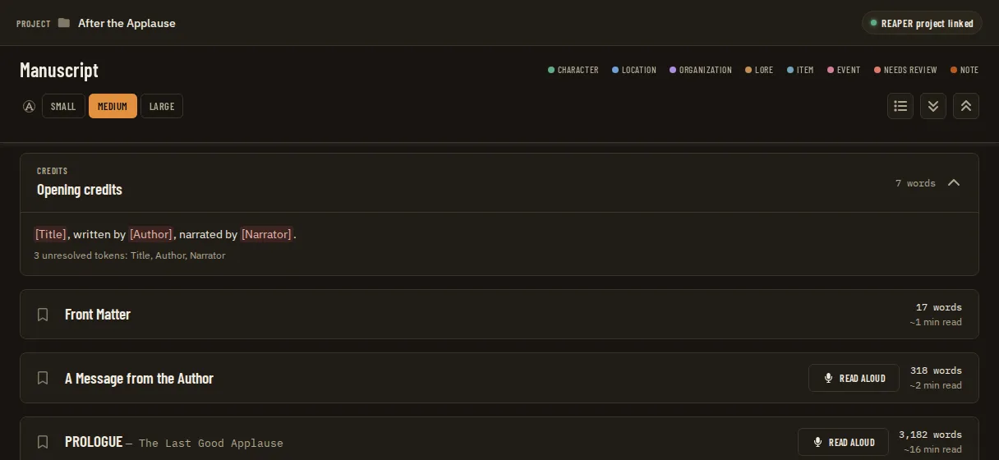
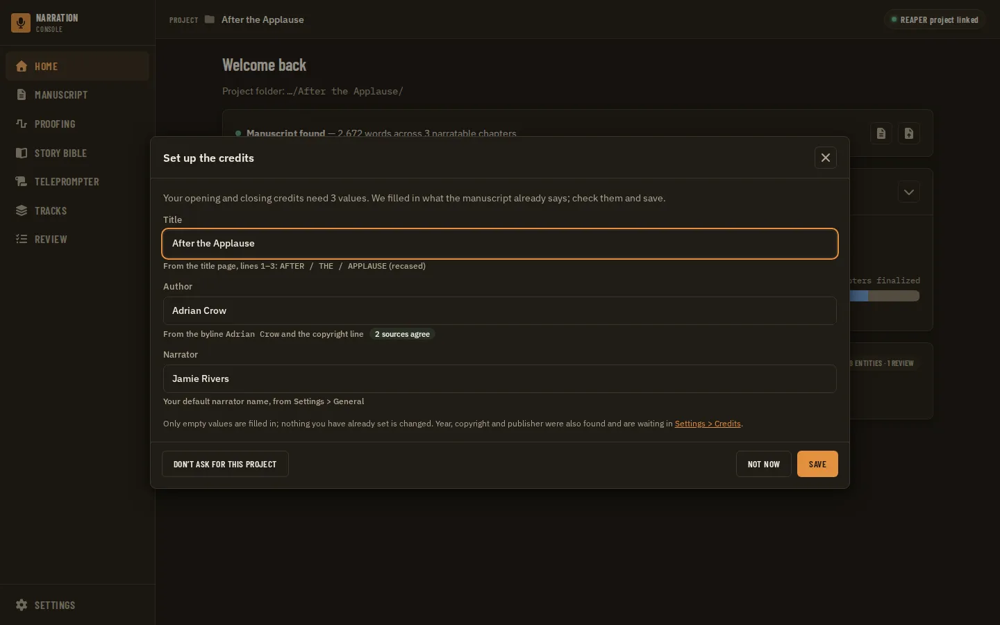
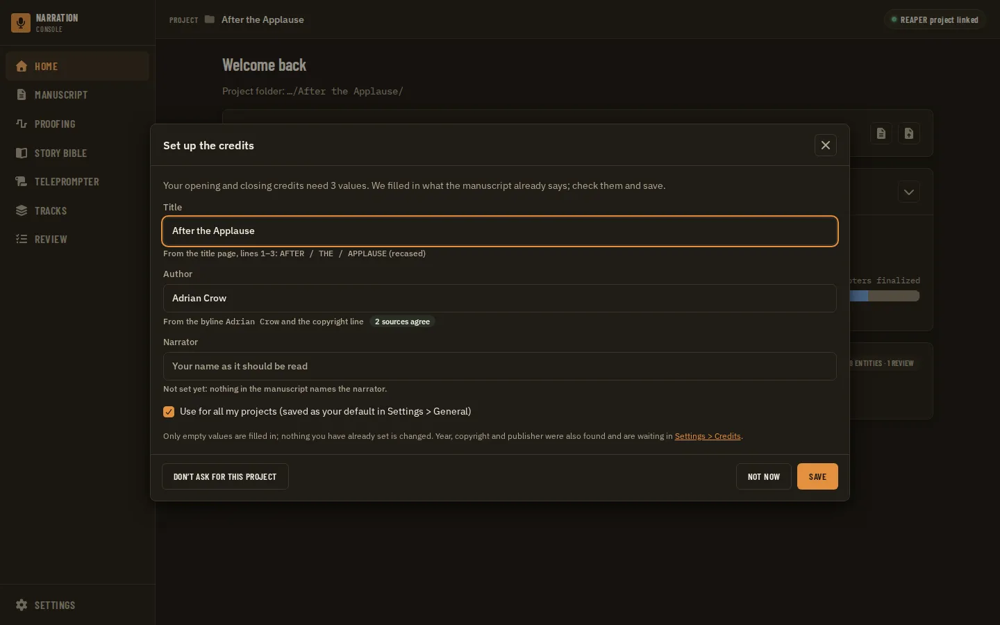
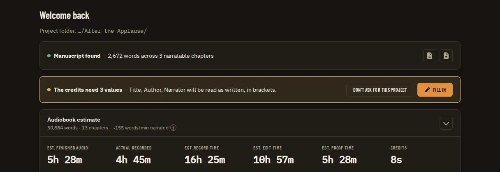
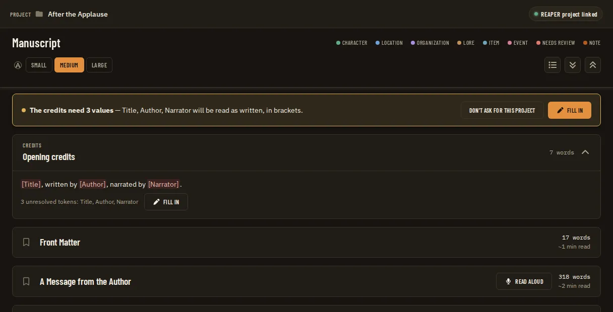

# Credits Token Setup and Front Matter Detection

**Source:** owner report of 2026-09-24 on the Manuscript page. The "Opening credits" card showed `[Title], written by [Author], narrated by [Narrator].` with "3 unresolved tokens: Title, Author, Narrator", directly above a Front Matter section whose paragraphs were `AFTER` / `THE` / `APPLAUSE` (the title, one word per paragraph), `A Novel`, `Adrian Crow`, `Copyright © 2026 Adrian Crow`, `All rights reserved.` The owner wrote: (1) "I was not prompted to enter any of the values for the opening credits upon opening the project for the first time, or even after upgrading from an older version that didn't have those. There should be launch detection of manuscript + project tokens"; (2) "the title and author could have been pulled from the front matter. There are probably common front matter formats that can be parsed to get 2 of those tokens, and we should try." Citations are `file:line` at `f234869`.

**Builds on:** [Audiobook Credits Templates](audiobook-credits-templates.prd.md). Its C3 ("Seeding") is delivered as `internal/credits/suggestions.go`, and this PRD extends that code rather than adding a second one. Its C2 (token ownership) and C6 (warn, never block) stand. When this PRD is delivered it amends C3's "cover lines and `docProps/core.xml`" design. It does not reopen the credits PRD's phases, but that PRD's steady-state docs must describe the prompt once it ships. **Sibling:** [Credits in the Chapter Table](credits-in-chapter-table.prd.md) also adds a field to `project.Manifest` (its CT3). It does not cover setting token values. **Precedent:** [ADR 0019](../adr/0019-detected-manuscript-is-offered-not-imported.md): something detected at open is offered and never applied on its own.

**Status (2026-09-24):** draft. Open questions CS1 to CS10 are waiting for the owner. There is no tracking issue yet: open one before Phase 1 (`docs/operations/github-workflow.md`).

## Problem Statement

A narrator who opens a project with an imported manuscript is never asked for the credits values. The Manuscript page, Home's Credits stat and the teleprompter all show unresolved `[Title]`, `[Author]` and `[Narrator]` until the narrator finds Settings > Credits (project scope) on their own. The seeding that should have offered Title and Author offered nothing for this book, for two reasons:

- It only reads a front matter section the importer labelled "Cover", and it only accepts a `by NAME` byline.
- Its second source, the Word document's properties, is read from the wrong path, so it has never worked on a real import.

Nothing ever suggests the narrator's own name, so `[Narrator]` stays empty until they fill in a General setting they may not know exists.

## Evidence

- **Nothing prompts, on open or after an update.**
  - `Bootstrap` (`apps/desktop/app.go:963-1003`) reports the project, the manuscript summary, the offered manuscript candidate (ADR 0019) and DAW facts. It reports nothing about credits.
  - `ProjectSwitch` (`apps/desktop/bindings.go:242-257`) attaches the project and emits `system:attached`. Nothing else happens.
  - The repository has no first-run, "what's new" or per-version hook for projects. A search for `whats new|firstRun|lastSeenVersion|onboarding` finds only the teleprompter's one-time device migration (`useTeleprompterSession.ts:36-40`).
  - The project manifest has no schema version (`apps/desktop/internal/project/manifest.go:29-43`). `Credits` is simply nil on a project that has never saved values (`:34-39`).
  - The in-app update records only that the new executable started (`update_install.go:126-135`). Nothing remembers which features a project has already seen.
  - So an old project opened in the new version looks exactly like a new project with no credits values. **Detection therefore has to key on state, not on version.**
- **Where "unresolved" is computed, and why the card shows it.**
  - `credits.Render` returns `unresolved` (`apps/desktop/internal/credits/renderer.go:23-44`).
  - `creditTokens` resolves the project's values over the global narrator default (`apps/desktop/creditsbindings.go:111-125`, `credits/values.go:27-44`).
  - The Manuscript page renders the first opening and first closing template (ADR 0093, `apps/ui/src/components/manuscript/Manuscript.tsx:124-125`, `:236-239`, `:496-503`) and lists the unresolved tokens as plain text with no action (`CreditsEntry.tsx:79-83`).
  - The teleprompter's warning links to "Fill them in Settings" (`TeleprompterPage.tsx:72`). The Manuscript card has no such link.
  - The Credits category exists only in the project scope (`Settings.tsx:40`).
- **The token set.** `credits.Values` holds Title, Subtitle, Author, Series, Book Number, Copyright, Year, Copyright Holder, Publisher and a per-project Narrator override (`credits/values.go:7-20`). `[Chapter]` and `[Chapter Title]` are computed per chapter (ADR 0151). They are saved with the ten-argument `CreditsSaveProjectValues` (`creditsbindings.go:77-98`).
- **Narrator.**
  - The global default `General.narrator_name` exists as a `text` setting (`apps/desktop/app.go:1093-1098`). It has no built-in default (`internal/settings/store.go:58` sets only `log_verbosity`, `notifications` and `credits_room_tone_seconds`), so it is empty until the narrator fills it in.
  - The Credits panel says "not set (see Settings > General)" (`CreditsPanel.tsx:299-301`), but only there.
  - In the owner's project `[Narrator]` was unresolved, so the global default was empty.
- **What the existing seeding does.**
  - `CreditsProjectValues` returns `suggestions: credits.SuggestFromManuscript(projectFolder)` (`creditsbindings.go:53-73`). The Settings panel shows "Suggested from the manuscript" with "Use suggestion" only for Title and Author, and only when the field is empty (`CreditsPanel.tsx:28-39`, `:303-316`). No other surface shows suggestions.
  - `suggestFromCoverLines` (`credits/suggestions.go:87-116`) needs a section titled exactly "Cover" in an `opening` chapter. It takes line 1 as the Title, and line 2 as the Author only if it starts with "by ".
- **Why this book got no Title or Author.**
  - The importer's `classifyPreHeading` (`apps/desktop/internal/importer/model.go:73-91`) labels the first 1 to 3 short lines "Cover" only in these cases:
    - there are at most 3 pre-heading lines;
    - line 2 starts with "by ", or contains "copyright" or "author";
    - line 1 starts with "title:".
  - For `AFTER` / `THE` / `APPLAUSE` / ..., line 2 is `THE`, so every line was labelled "Front Matter" and the suggestion found no Cover section.
  - Had the rule fired, the Title would have been `AFTER` (one line), and `Adrian Crow` (a bare byline with no "by") would never have been read as the Author.
  - The copyright line, which names the author, is never read.
- **Defect: the Word document properties are read from the wrong path.**
  - `commit` stores the source at `<project>/narration-utils/manuscript/sources/<id>/<name>` and writes `storedPath` relative to the **project folder** (`apps/desktop/internal/manuscript/service.go:428`, `:446-453`). For example: `narration-utils/manuscript/sources/<id>/book.docx`. The sidecar fixtures use the same form (`sidecars/manuscript-guide/tests/test_manuscript_guide.py:47`).
  - `SuggestFromManuscript` joins `storedPath` under `narration-utils/manuscript` a second time (`credits/suggestions.go:43-45`), so `ReadCoreProps` opens a path that does not exist and quietly returns nothing.
  - The test passes because it writes a made-up `storedPath` of `book.docx` (`suggestions_test.go:98-115`).
  - Whatever the owner's file format was, the docProps source has never fired on a real import.
- **What the importers already read, and what they drop.**
  - DOCX: `ReadCoreProps` reads `dc:title` and `dc:creator` from `docProps/core.xml` (`importer/coreprops.go:9-42`), and docProps wins over the cover lines (`suggestions.go:43-53`). Word's `creator` is the account that made the file, which is often an editor, a typesetter or "Microsoft Office User". The code does not check it against the manuscript.
  - DOCX styles: a paragraph in the `Title` style becomes a heading at level 0 (`docx.go:38`, `:339`). Styles are not written to `manuscript.json`, so a detector that runs after import sees text only.
  - EPUB: the OPF parse (`importer/epub.go:53-69`) reads only `manifest` and `spine`. The `<metadata>` block (`dc:title`, `dc:creator` with its role, `dc:publisher`, `dc:rights`, `dc:date`, `belongs-to-collection` / `calibre:series`) is ignored. Tests build OPFs that contain `dc:title` (`epub_test.go:54-55`), and nothing reads it.
  - Markdown and TXT: a pre-heading `title:` line only makes that block a "Cover" (`model.go:81`). Nothing reads YAML front matter.
  - Every importer sends its pre-heading lines through the same `classifyPreHeading` (`docx.go:398`, `epub.go:472`, `markdown.go:130`, `txt.go:123`, `pdf.go:89`).
- **Where a prompt could hook in.**
  - Home already offers a detected manuscript from `Bootstrap` (`Home.tsx:85-86`, ADR 0019).
  - Home refreshes the bootstrap once an import commits (`Home.tsx:103-105`).
  - The project picker listens for `system:attached` (`ProjectPicker.tsx:38`).
- **Wire and test surfaces that exist today.**
  - The credits schemas are in `apps/ui/src/api/schemas/credits.ts`, and `suggestions` is typed `Record<string,string>` (`credits.test.ts:44-58`).
  - The goldens are in `tests/fixtures/contracts/credits-*.json` (`credits-project-values-empty.json` among them).
  - The mock suggests Alice/Lewis Carroll (`mockApi.ts:1894-1897`).
  - The visual states are `settings/project-credits*` and `manuscript/credits-entries` (`apps/ui/tests/visual/state-catalog.ts:277`, `:1243-1267`).
  - The dialog role trees are pinned by `apps/ui/tests/aria/dialogs.spec.ts` (ADR 0065).
  - `hostAPIVersion` is 47 (`apps/desktop/app.go:52`). The next free ADR is 0171 at this commit (the highest is 0170); check again at merge.
- **Trust boundary.** Reading the stored DOCX or EPUB again is "a file the app opens" (threat model §6, rows 6a and 6d, `docs/architecture/threat-model.md:114-121`). Entries are read with `zip.OpenReader` and no size cap (#239). A new front matter parser and an OPF metadata reader take hostile text as input.

## Proposed Solution

1. **Detect** (host, read-only). A `credits.Detect(projectFolder)` replaces the Title/Author-only seeding. It returns one candidate per token, each with a value, a source, a confidence and the lines it came from. It uses:
   - a **front matter parser** over the imported manuscript's `opening` chapters (split title lines, descriptor lines, bylines, copyright, series and publisher lines);
   - **file metadata**, read from the project's own stored copy of the source: EPUB OPF `<metadata>`, and DOCX core properties with obviously bad values filtered out;
   - the **global narrator default** for `[Narrator]`.

   The path defect is fixed first.
2. **Decide when to ask** (host). A `CreditsSetupState` answers whether this project needs setup. That is the case when all of these hold:
   - a manuscript is imported;
   - the credits the app will actually read have unresolved tokens (the first opening and closing templates per ADR 0093, plus chapter announcements if CS4 says so);
   - the narrator has not said "not now" or "don't ask" for this project, or for this imported manuscript.

   Because the check keys on state, it covers the first open, the first open after an update to a version with credits, a fresh import and a Replace manuscript. No version tracking is needed.
3. **Ask** (UI). The first time Home loads for such a project, and right after an import commits, a "Set up the credits" prompt appears (a dialog or a banner, CS1). It lists only the tokens the templates use that have no value. Each field is prefilled with the detected value and its source ("From the title page, lines 1–3"). Save writes only what the narrator confirms, and never changes a value that is already set. Narrator is prefilled from the global default. If that is empty, the narrator can type a name and choose to keep it as the default for every project.
4. **Keep a way back.** The Manuscript credits card and Settings > Credits get the same "Fill in" action, and Settings shows the source for every detected token, not just Title and Author.

## Key Hypothesis

We believe that asking for the credits values once, when a project with a manuscript is opened or imported, with Title and Author already filled from the front matter or the file's metadata and Narrator from the narrator's own default, will stop unresolved credits from reaching the Manuscript page, the estimate and the teleprompter. We'll know we're right when the owner's book opens to a prompt that already reads "After the Applause" / "Adrian Crow", needs only a narrator name the first time, and after one Save the Manuscript card shows no unresolved tokens.

## What We're NOT Building

- Saving detected values without the narrator. Detection only offers; nothing is written until Save (ADR 0019's "offered, not imported", and C3's "never written back").
- Overwriting a value the narrator entered, or deleting one. The prompt and the detector only fill empty fields.
- Changing the manuscript: no reclassification of sections, no rejoining of the split title paragraphs in `manuscript.json`, and no new `contentKind` (ADR 0004).
- A general-purpose metadata editor, or reading retailer metadata (ISBN, ASIN, BISAC). The ISBN is ignored.
- Per-project template selection (ADR 0093's open follow-up). The prompt asks for the tokens of the templates that are read today.
- Credits rows on Home ([Credits in the Chapter Table](credits-in-chapter-table.prd.md)).
- Guessing the narrator from the operating system's account name or from the manuscript (see CS7).
- An app-wide "what's new" or onboarding tour. Only the credits setup keys on project state.
- A network lookup (Open Library, Google Books). The app stays offline (threat model, "What the app sends off the machine").

## Success Metrics

| Metric | Target | How Measured |
| --- | --- | --- |
| Owner's book | The front matter `AFTER`/`THE`/`APPLAUSE`/`A Novel`/`Adrian Crow`/`Copyright © 2026 Adrian Crow`/`All rights reserved.` gives Title "After the Applause" (or the CS3 casing) and Author "Adrian Crow" at high confidence; Year "2026" and Copyright Holder "Adrian Crow"; no Subtitle "A Novel" (CS5) | Go table test with exactly these lines |
| Pattern coverage | Parser table tests pass for the patterns in Solution Detail, and for layouts that must produce no candidate (dedication, epigraph, "This is a work of fiction", a lone ISBN) | `go test ./internal/credits/...` |
| No false fills | Nothing is written to `project.json` without a Save; a set value is never changed by the prompt or by Detect; a candidate equal to the saved value is not offered | Go tests on the binding; Vitest on the prompt |
| Stored-source defect | Detect reads the stored DOCX and EPUB at the real `storedPath`; the test uses a `storedPath` written by `commit` itself, not a made-up one | Go test through `manuscript` import then `credits.Detect` |
| When it asks | Asks on first Home load for a project with a manuscript and unresolved tokens, after an import commits, and after Replace manuscript (new `documentId`); does not ask again after "Not now" in the same session or after "Don't ask" for the project (CS2) | Go tests on `CreditsSetupState`; Vitest on Home |
| Upgrade path | A project whose `project.json` predates credits (no `credits`, no setup marker) is treated as needing setup | Go test over a pre-credits manifest fixture |
| Robustness | The parser and the OPF metadata reader never panic and stay linear on hostile input | Fuzz tests (ADR 0044) in the gate |
| Contracts | New payloads have a Zod schema, a golden written by a Go test, a `wireContracts.test.ts` row, and a mock that passes | `pnpm check` |
| UI gate | New prompt states pass the visual suite at every viewport, axe-clean; the dialog's role tree is pinned | Playwright `app.spec.ts`, `pnpm --dir apps/ui run aria` |

## Open Questions

- [ ] **CS1. Dialog or banner?**
  - (A) A modal dialog on Home the first time the project needs setup. It is hard to miss, but it interrupts.
  - (B) A banner or card at the top of Home and above the Manuscript credits card, with "Fill in", like the ADR 0019 manuscript offer. It never blocks, but it is easier to ignore.
  - (C) Both: a dialog once per project, then the banner until the tokens are resolved or the narrator says "don't ask".

  Recommendation: (C). The owner asked to be *prompted*, and the banner keeps it discoverable without a second interruption. The dialog is a `Dialog` primitive (ADR 0048), not an alert.
- [ ] **CS2. How often does it ask again?** Options:
  - every launch until resolved;
  - once per project, with "Not now" meaning this session only and "Don't ask for this project" stored;
  - once per imported manuscript (ask again after Replace manuscript).

  Recommendation: ask once per project on first load. "Not now" lasts for the session, like the ADR 0019 decline. "Don't ask again for this project" is stored on the manifest with the manuscript's `documentId`, so a Replace manuscript asks again, because the new file may have a different title. The banner (CS1 C) stays while tokens are unresolved, unless the narrator chose "Don't ask".
- [ ] **CS3. Title casing.** The owner's title page is all capitals.
  - (A) Convert an all-capitals title to title case with the usual small words kept lower case ("After the Applause"). Mixed-case titles stay as they are.
  - (B) Keep the capitals ("AFTER THE APPLAUSE").
  - (C) Offer both.

  Recommendation: (A), prefilled and editable. ACX wants the credits to match the title's metadata, which is rarely all capitals, and the narrator reads the text aloud anyway. Proper nouns and acronyms inside an all-capitals title ("NASA", "McCOY") cannot be recovered, so the source caption shows the original lines.
- [ ] **CS4. Which tokens does the prompt ask for?**
  - (A) Only the unresolved tokens used by the first opening and closing templates (for the default templates: Title, Author, Narrator).
  - (B) Those, plus any token in the first chapter announcement template.
  - (C) Every token in `credits.Values`, with the unused ones collapsed.

  Recommendation: (A) in the dialog, with a "More fields" link to Settings > Credits. Detected values for tokens the templates do not use (Year, Copyright Holder, Series, Publisher) appear as suggestions in Settings, not in the dialog.
- [ ] **CS5. "A Novel" and other descriptor lines.** Is "A Novel" (or "A Memoir", "Stories", "A Thriller") a `[Subtitle]`? Recommendation: no. Treat it as a genre descriptor and skip it, because ACX opening credits rarely say "A Novel". A real subtitle ("Book One of the Ember Trilogy", or a line after a colon) is offered as Subtitle or Series.
- [ ] **CS6. Precedence when sources disagree.** Current code: docProps beats the cover lines (`suggestions.go:43-53`). Recommendation:
  - EPUB OPF metadata beats the front matter (publishers fill it in on purpose).
  - The front matter beats DOCX core properties.
  - DOCX properties are used only when the front matter found nothing, and never when the value looks like a machine default ("Microsoft Office User", "Author", "Title", a file name).
  - When two sources agree, confidence is high. When they disagree, the prompt prefills the winner and shows the other as a one-click alternative.
- [ ] **CS7. Where does Narrator come from?**
  - (A) `General.narrator_name` only.
  - (B) As (A); when that is empty the prompt asks for it and, with a checked "Use for all my projects", saves it to the global setting rather than to the project override.
  - (C) Also suggest the operating system's display name.

  Recommendation: (B). (C) reads personal data the narrator did not give the app, and is often a login name or an employer's naming.
- [ ] **CS8. Copyright tokens.** From `Copyright © 2026 Adrian Crow`, fill `[Year]` = 2026 and `[Copyright Holder]` = Adrian Crow. What goes in the free-form `[Copyright]` (C4)? "2026 Adrian Crow", "© 2026 Adrian Crow", or nothing? The contractual template reads "Copyright by [Copyright]." Recommendation: `[Copyright]` = "2026 by Adrian Crow", so the shipped with-copyright template reads naturally. Offer it only as a Settings suggestion (CS4 A), since the default templates do not use it.
- [ ] **CS9. The upgrade case beyond credits.** Should the state-based "needs setup" check become a general pattern (a small per-project list of feature setups a project has seen), or stay credits-only? Recommendation: credits-only now, and record the pattern in the ADR so a later feature can reuse the manifest marker's shape.
- [ ] **CS10. Improve the importer's own Cover heuristic too?** Detect runs over every `opening` chapter's lines, so the "Cover" label no longer matters to credits. Should `classifyPreHeading` also learn split title lines and bare bylines, so the import review shows a Cover section for this book? Recommendation: no, not in this PRD. It changes section grouping for every importer and moves ADR 0004's sites and the import-structure goldens, for no credits gain.

## Users & Context

**Primary User**: an independent narrator opening a new book, or an existing project after an update, Windows first.
**Current behavior**: sees `[Title]`, `[Author]` and `[Narrator]` unresolved on the Manuscript card, the estimate and the teleprompter. To fix it they have to find Settings > Credits (project scope) and Settings > General themselves and retype what is on the title page.
**Trigger**: opening a project with a manuscript whose credits have unresolved tokens; finishing an import; replacing the manuscript.
**Success state**: one short prompt, mostly prefilled, and one Save; the credits read correctly everywhere.
**Job to Be Done**: When I open a book, I want the app to fill in what the manuscript already says and ask me only for what it cannot know, so my credits are right before I record them.
**Non-Users**: narrators who never record credits. They choose "Don't ask" once, or delete their templates, in which case nothing is unresolved and nothing asks.

## Solution Detail

| Priority | Capability | Phase |
| --- | --- | --- |
| Must | Fix the `storedPath` double join so DOCX properties are read from the real stored copy | 1 |
| Must | Front matter parser over the `opening` chapters' lines, returning candidates with source, lines and confidence | 1 |
| Must | `CreditsSetupState`: needs setup, unresolved tokens of the read templates, candidates, global narrator; setup marker on the manifest | 2 |
| Must | The prompt, prefilled and source-captioned, saving only confirmed empty fields; the narrator default option (CS7) | 2 |
| Must | Asks on first Home load, after an import commits and after Replace manuscript (CS2) | 2 |
| Should | EPUB OPF `<metadata>` reader (title, creators with role, publisher, rights, date, series) | 1 |
| Should | DOCX core properties filtered for machine defaults, and ranked below the front matter (CS6) | 1 |
| Should | "Fill in" action on the Manuscript credits card and a banner (CS1 C); source captions for every token in Settings > Credits | 3 |
| Could | Markdown YAML front matter (`title:`, `author:`, `series:`) and the DOCX `Title`/`Subtitle` paragraph styles captured at import into a small `sourceMetadata` block | 4 |
| Won't | Automatic save, overwriting set values, network lookups, OS account name | - |

**Front matter patterns (Phase 1 parser).** The parser reads the paragraphs of every `contentKind: "opening"` chapter in order, stopping at the first 60 lines or 2,000 characters. It trims each line and folds Unicode spaces. Patterns, in order:

1. **Lines to ignore:**
   - `All rights reserved`, ISBN lines, "First edition" / "First published", "Printed in", "Cover design by", web addresses;
   - "This is a work of fiction ..." (a line over 120 characters ends the title block anyway);
   - dedications ("For ...", "To ..." on their own);
   - quotation-mark epigraphs;
   - `Contents` (ADR 0004: reference, not front matter).
2. **Title block.** The first run of 1 to 6 consecutive short lines (each 40 characters or fewer and 1 to 6 words, with no sentence-ending period) before a descriptor, byline, copyright or ignored line.
   - Lines are joined with single spaces (`AFTER` + `THE` + `APPLAUSE` → `AFTER THE APPLAUSE`). A line ending in `:` or followed by a line starting with a lower-case word counts as a continuation.
   - A block where every line is all capitals is cased per CS3.
   - A `Title:` prefix is stripped.
   - A title followed by `: Subtitle` on the same line splits at the colon (Subtitle at medium confidence).
3. **Descriptor lines.** `A Novel`, `A Novella`, `A Memoir`, `Stories`, `A Thriller`, `A Mystery`, `A [Word] Novel`. They are skipped (CS5). `A Wonderland Novel` also yields a low-confidence Series "Wonderland".
4. **Series lines.**
   - `Book One of the X`, `Book 2 of X`, `X, Book 3`, `X Series #2`, `Volume II` → Series and Book Number. Book Number is kept as written ("One", "2", "II").
   - `The X Trilogy` / `The X Saga` on its own line under the title → Series.
5. **Byline.**
   - `by NAME`, `BY NAME`, `Written by NAME`, `A novel by NAME` → Author, high confidence.
   - A bare line of 2 to 5 name-shaped words (capitalised or all capitals, may contain initials, `de`/`van`/`O'`, hyphens; no digits) after the title block → Author, medium confidence.
   - Multiple authors joined by `and` / `&` / `,` are kept as written.
6. **Copyright line.**
   - Forms: `Copyright © YEAR NAME`, `© YEAR NAME`, `Copyright (c) YEAR by NAME`, `Copyright YEAR NAME`, `Text copyright © NAME YEAR`, `© NAME, YEAR`.
   - These yield Year (the last 4-digit year, 1800 to next year) and Copyright Holder. The Holder has a trailing `. All rights reserved` removed, and `by` is stripped.
   - Illustration, cover and translation copyrights (`Illustrations copyright`, `Cover art ©`) are ignored.
7. **Publisher.** `Published by NAME`, or a line ending in `Press`, `Books`, `Publishing` or `Publishers` → Publisher, low confidence.

**Confidence.**

| Confidence | When |
| --- | --- |
| High | Two sources agree: the byline or a bare name equals the Copyright Holder (the owner's case), or front matter equals metadata; or an explicit marker (`by`, `Title:`, OPF `dc:creator` with role `aut`) |
| Medium | One pattern with a positional cue: a bare name after the title block; a split-title join |
| Low | Descriptor-derived Series, Publisher by suffix, or DOCX properties used alone |

All three are prefilled in the prompt. Low confidence is marked "check this", and every field shows its source caption and can be edited before Save.

**Metadata sources.**
- EPUB `<metadata>`:
  - `dc:title` (the first, or the one refined as `title-type main`), with a `subtitle` refinement if present;
  - `dc:creator` with `opf:role="aut"` or a `role` refinement of `aut`; creators with `nrt` (narrator) are ignored, see CS7;
  - `dc:publisher`, `dc:rights`, `dc:date` (the year);
  - `belongs-to-collection` with `group-position`, or `calibre:series` and `calibre:series_index`.
- DOCX: `dc:title`, `dc:creator`.

**User flow (owner's book, CS1 C, CS3 A, CS7 B).**
1. The owner opens the project. Home shows a dialog headed "Set up the credits", with the line "Your opening and closing credits need 3 values."
2. The fields are:
   - Title "After the Applause", captioned "From the title page: AFTER / THE / APPLAUSE";
   - Author "Adrian Crow", captioned "From the byline and the copyright line";
   - Narrator empty, with "Use for all my projects" checked.
3. The owner types a name and presses Save.
4. The Manuscript card now reads "After the Applause, written by Adrian Crow, narrated by …" with no unresolved tokens. The Credits stat and the teleprompter use the same values.
5. Pressing "Not now" instead leaves a banner on Home and above the Manuscript card for this session. "Don't ask for this project" clears both until a Replace manuscript.

## Technical Approach

**Feasibility**: HIGH. This is pure Go over text the host already has, one small OPF read, one new binding and one prompt, and it reuses the save binding.

**Architecture notes**
- **Detector.**
  - `internal/credits/detect.go` holds `Detect(projectFolder, globalNarrator) []Candidate{Token, Value, Source, Confidence, Lines}`.
  - `internal/credits/frontmatter.go` is the parser, a pure function over `[]string` so it can be table- and fuzz-tested.
  - `SuggestFromManuscript` becomes a thin wrapper over them, so `CreditsProjectValues.suggestions` stays compatible. A new `detected` array carries the source and confidence (additive to the existing schema).
  - The `storedPath` join becomes `filepath.Join(projectFolder, filepath.FromSlash(storedPath))`. It refuses a path that escapes `<project>/narration-utils/manuscript/sources/` (the manifest is narrator data, but a hand-edited or hostile `manuscript.json` must not steer a file read).
- **Metadata readers.**
  - `importer.ReadEPUBMetadata(path)` sits beside `ReadCoreProps` and reuses the container and OPF location code in `epub.go`. It reads only `META-INF/container.xml` and the OPF entry, with a size cap on each (the same class of problem as #239).
  - The stored file type is taken from `manuscript.json`'s `importer.format`, not from the extension.
- **Setup state.**
  - The `CreditsSetupState()` binding returns:
    - `needed`;
    - `unresolved[]`: the union across the first opening and closing templates, rendered with `creditTokens()`;
    - `candidates[]`, with candidates for tokens that already have values removed;
    - `narratorGlobal`;
    - `documentId`;
    - `dismissed`.
  - `CreditsSetupDismiss(scope)` stores `project.Manifest.CreditsSetup{DismissedFor: documentId, DismissedAt}`. The field is additive with `omitempty`, like `Credits` (`manifest.go:34-43`).
  - Save reuses `CreditsSaveProjectValues`, merging over the loaded values so empty prompt fields never clear a set value. The global narrator is saved through the existing settings save binding.
  - With no manuscript, `needed` is false (nothing to detect from, and the Settings panel already covers that case).
- **UI.**
  - A `CreditsSetupDialog` under `components/credits/` is built from `Dialog`, `Field`/`TextField` and `Checkbox`.
  - Home runs it off the bootstrap after load and after an import commits (`Home.tsx:103-105`), in the same place as the ADR 0019 offer, so the two never stack: the manuscript offer comes first and the credits prompt follows the import.
  - A `CreditsSetupBanner` appears on Home and above `CreditsEntry` in `Manuscript.tsx`. The "Fill in" on `CreditsEntry` opens the same dialog.
  - Settings > Credits shows `detected` captions for every field.
- **Wire contracts** (CLAUDE.md):
  - a Zod schema `creditsSetupStateSchema` in `apps/ui/src/api/schemas/credits.ts`, and the added `detected` on `creditsProjectValuesResultSchema`;
  - goldens `credits-setup-state-needed.json`, `credits-setup-state-dismissed.json` and an updated `credits-project-values-*.json`, written by Go tests with `UPDATE_CONTRACTS=1`;
  - `wireContracts.test.ts` rows;
  - a mock (`?mockCredits=setup`) that passes the schema;
  - no `as` cast.
- **API version.** Two new bindings bump `hostAPIVersion` (47 at `f234869`; check again at merge) and regenerate `Host.{js,d.ts}`. They are written on `h.services()` with `stressReaders` rows (`hostrace_test.go`).
- **ADR** (next free number, 0171 at `f234869`): "Credit values detected from the manuscript are offered in a once-per-project prompt keyed on project state, never saved without the narrator". It amends the seeding half of C3 and records the CS6 precedence and CS2 re-ask rule.
- **Tests.**
  - Go: parser table (every pattern in Solution Detail and the no-candidate layouts), fuzz (`FuzzFrontMatter`, `FuzzReadEPUBMetadata`), `Detect` over a real `commit` import of DOCX and EPUB fixtures, the pre-credits manifest fixture, merge-not-overwrite on save.
  - Vitest: dialog, banner, Home sequencing with the ADR 0019 offer.
  - Visual states: `home/credits-setup-dialog`, `home/credits-setup-dialog-narrator-default`, `home/credits-setup-banner`, `manuscript/credits-entries-fill-in`, `settings/project-credits-detected`.
  - The aria snapshot for the new dialog.

**Technical Risks**

| Risk | Likelihood | Mitigation |
| --- | --- | --- |
| A wrong Title or Author prefilled and saved without being read | Medium | Source caption with the original lines; low confidence marked "check this"; nothing saved without Save; set values never touched |
| Prompt fatigue on projects that never record credits | Medium | "Don't ask for this project"; nothing asks when no template has unresolved tokens |
| The prompt stacks with the manuscript offer or the import dialogs | Medium | One sequencing point on Home; the prompt waits for the import job to finish (Vitest) |
| Hostile `manuscript.json` or source file steers a read or exhausts memory | Low | Path confined to `sources/`; entry size caps; fuzz tests; threat model 6a and 6d updated |
| Title casing mangles proper nouns | Medium | Only an all-capitals block is re-cased (CS3); original shown; editable |
| DOCX `creator` is an editor or typesetter | High | Ranked below the front matter; machine-default filter; low confidence alone (CS6) |
| Manifest field collides with Credits in the Chapter Table (CT3) | Medium | Both additive `omitempty` fields; rebase on whichever lands first |
| An older app version re-saves `project.json` and drops `creditsSetup` | Low | The worst case is one extra prompt; documented in the ADR |

## Implementation Phases

| # | Phase | Description | Status | Parallel | Depends | PRP Plan |
| --- | --- | --- | --- | --- | --- | --- |
| 1 | Detection | Fix the `storedPath` join; the front matter parser; EPUB OPF metadata; DOCX property filtering and CS6 precedence; `detected` in `CreditsProjectValues` with source captions in Settings > Credits | pending | - | CS3, CS5, CS6, CS8 | - |
| 2 | Setup prompt | `CreditsSetupState` and `CreditsSetupDismiss`, the manifest marker, the dialog on Home after load and after import, the narrator default option, the ADR | pending | - | 1; CS1, CS2, CS4, CS7 | - |
| 3 | Entry points | Banner on Home and above the Manuscript credits card, "Fill in" on `CreditsEntry`, ask again after Replace manuscript; steady-state docs and the credits PRD amendment | pending | - | 2 | - |
| 4 | Import-time metadata (Could) | Markdown YAML front matter and DOCX `Title`/`Subtitle` styles kept as `sourceMetadata` at import, fed into Detect | pending | 3 | 1; CS10 | - |

**Phase 1.** Goal: the right values are detected and visible where suggestions already appear. Success:
- the owner's lines give "After the Applause" and "Adrian Crow" (high), Year 2026 and Holder Adrian Crow;
- a real DOCX import's properties are read;
- an EPUB's `dc:title` and `dc:creator` are read;
- fuzz tests are in the gate;
- `settings/project-credits-detected` is reviewed at every viewport, plus `reflow.png` (ADR 0061);
- threat model rows 6a and 6d name the new reads.

**Phase 2.** Goal: the narrator is asked. Success:
- opening the owner's project (pre-credits manifest) shows the dialog prefilled;
- Save resolves the Manuscript card;
- "Not now" and "Don't ask" behave per CS2;
- an import followed by the prompt never stacks dialogs;
- aria snapshot, visual states and axe are clean.

**Phase 3.** Goal: the prompt is never the only way in. Success:
- the banner and "Fill in" appear only while tokens are unresolved and setup is not dismissed;
- Replace manuscript asks again;
- `docs/guides/using-the-app/manuscript.md` and the credits steady-state doc describe it;
- this PRD is deleted if Phase 4 is dropped.

**Phase 4.** Goal: use structure the text-only pass cannot see. Success: a Markdown file with `title:`/`author:` front matter and a DOCX with a `Title`-styled paragraph are detected at high confidence. `manuscript.json` changes only additively; if it does, `narration_common/manuscript.py` `validate` accepts it.

**Parallelism Notes**: phases run in order 1 → 2 → 3. Phase 4 can run beside Phase 3 once Phase 1 is in. Phase 1 has no UI prompt, so it can land while the owner is still answering CS1, CS2 and CS7.

**Parallel-session compatibility**

| Phase | Files and areas touched | Collides with |
| --- | --- | --- |
| 1 | `apps/desktop/internal/credits/{suggestions,detect,frontmatter}.go` and tests; `internal/importer/{coreprops,epub}.go` (new `ReadEPUBMetadata`); `apps/desktop/creditsbindings.go`; `apps/ui/src/api/schemas/credits.ts`, `wireContracts.test.ts`, `mockApi.ts`; `tests/fixtures/contracts/credits-project-values-*.json`; `CreditsPanel.tsx`; `state-catalog.ts`; `docs/architecture/threat-model.md`, `SECURITY.md` | [Import Structure](import-structure-toc-and-characters.prd.md) (`epub.go`); the credits PRD's closing steady-state docs PR (it describes `suggestions.go`); [Credits in the Chapter Table](credits-in-chapter-table.prd.md) (credits schemas, mock) |
| 2 | `creditsbindings.go`, `apps/desktop/{app.go,app_test.go,hostrace_test.go}` (`hostAPIVersion`), `Host.*`, `apps/ui/src/hostApi.ts`; `internal/project/manifest.go`; new `apps/ui/src/components/credits/CreditsSetupDialog.tsx`; `Home.tsx`; `apps/ui/tests/aria/`; visual catalog and drivers; new ADR | Every binding phase (API version); Credits in the Chapter Table Phase 1 (`manifest.go`, CT3); [Chapter Track Link Control](chapter-track-link-control.prd.md) and [DAW Chapter-Track Auto-Sync](daw-chapter-track-auto-sync.prd.md) (`Home.tsx` if they add dialogs there); [Project Workspace](project-workspace-and-daw-link.prd.md) (open and create flow) |
| 3 | `Home.tsx`, `Manuscript.tsx`, `CreditsEntry.tsx`, the visual catalog, `docs/guides/using-the-app/manuscript.md`, `docs/prds/audiobook-credits-templates.prd.md` (a note under C3) | Reader PRDs (`Manuscript.tsx`); Credits in the Chapter Table (Home credits rows); the credits PRD's own closing PR |
| 4 | `internal/importer/{markdown,docx,model}.go`, `internal/manuscript/service.go` (`canonicalize`), `libs/python/narration_common/manuscript.py`, contract goldens | Import Structure; any importer or canonical-manuscript change (run `change-impact-scan` over `narration_common` consumers) |

Cross-cutting:
- Check `hostAPIVersion` and the ADR number again at merge.
- Each phase follows `CLAUDE.md`: plan, `change-impact-scan`, TDD, `full-verification-gate` (`pnpm check`), the visual suite with a PNG review at every viewport, `pnpm --dir apps/ui run aria` for the dialog, `design-spec-guard` if a primitive changes, and `feature-cleanup`, including the trust-boundary re-read for the file reads.
- No Lua.

## Decisions Log

| Decision | Choice | Alternatives | Rationale |
| --- | --- | --- | --- |
| Detected values are offered, never applied (prior, ADR 0019, credits C3) | Prompt prefilled; saved only on Save; set values untouched | Auto-fill empty values on open | An import or a value the narrator did not see is a real cost; same rule as the manuscript offer |
| Upgrade detection (proposed) | Key on state (manuscript imported, unresolved tokens, no dismissal marker), not on an app or manifest version | Store "last seen app version" per project; add a manifest schema version | The manifest has no version, and an old project with nil `Credits` is indistinguishable from a new one, which is the case to catch; state covers first open, upgrade, import and replace alike |
| Detection runs after import over `manuscript.json` (proposed) | Parser over the `opening` chapters' stored text, plus a re-read of the stored source's metadata | Detect only at import time | Existing projects benefit without a re-import (the owner's case); import-time structure is a later Could (Phase 4) |
| Extend `suggestions.go` (proposed) | One detector behind the existing `suggestions` field plus an additive `detected` | A second, separate suggestion path | One source of truth; the existing Settings UI keeps working |
| The `storedPath` defect (found here) | Join under the project folder and confine to `sources/` | Leave it | The docProps source has never fired on a real import; the test's made-up path hid it |

## Research Summary

**Technical context verified in code at `f234869`:**
- There is no prompt or first-run hook, and the manifest has no version.
- How unresolved tokens are computed and shown, and the token set in `credits.Values`.
- The global narrator setting has no default.
- The seeding's Cover-only and `by`-only rules, and why the owner's front matter fell outside them.
- The `storedPath` double join (checked against `commit` and the sidecar fixtures).
- EPUB OPF metadata is unread; DOCX styles are not kept in `manuscript.json`.
- The Home hook points and the existing wire, visual and aria surfaces.

**Not verified:**
- The owner's source format (DOCX, EPUB or TXT) and its document properties.
- How common each front matter layout is across real manuscripts. The pattern list comes from common trade and indie title and copyright page conventions, and needs a small corpus check in Phase 1.
- Whether ACX metadata casing guidance favours title case (CS3).

---

*Generated: 2026-09-24*
*Status: DRAFT - open questions CS1 to CS10 wait for the owner*

## Visual Spec

Mockups approved by the owner on 2026-09-24. They were rendered from the real app (dark theme, the app's own fonts and components) with throwaway edits and invented sample data, so names, numbers and body text are placeholders; the layout, controls, states and wording are the spec. Each shows the recommended answer to the open questions unless its caption says it is an alternative. Where a mockup and the text above disagree, raise it before building rather than silently following either.

*Before* (`00-before.webp`)

*Setup dialog on open* (`01-setup-dialog-on-open.webp`)

*Alternative (not the recommendation): Setup dialog narrator empty* (`01b-alt-setup-dialog-narrator-empty.webp`)

*Home banner after not now* (`02-home-banner-after-not-now.webp`)

*Manuscript banner and fill in* (`03-manuscript-banner-and-fill-in.webp`)
