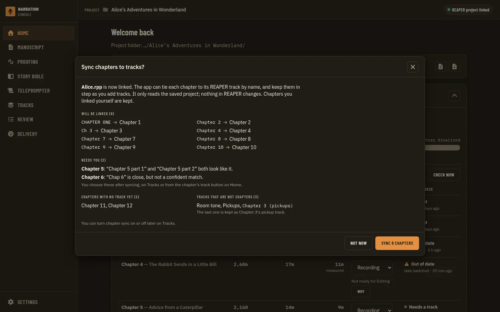
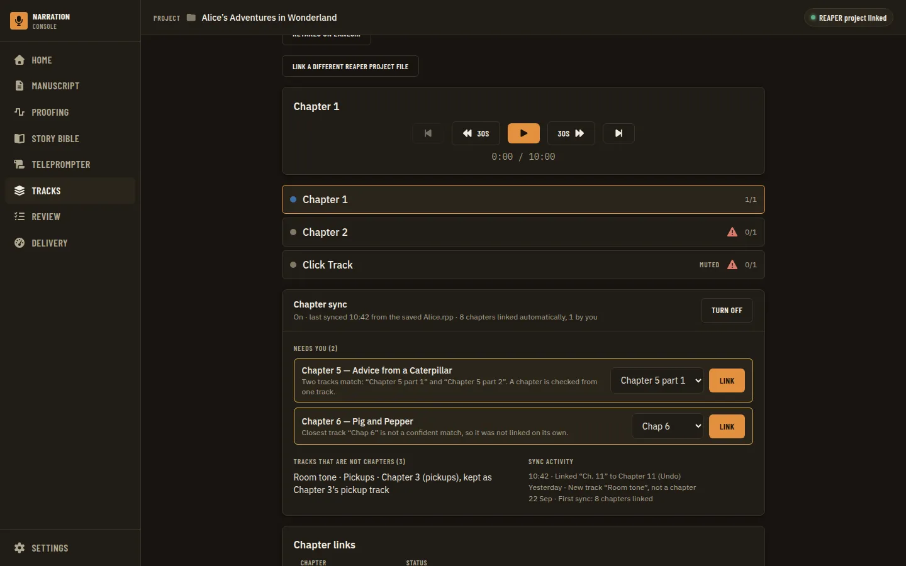
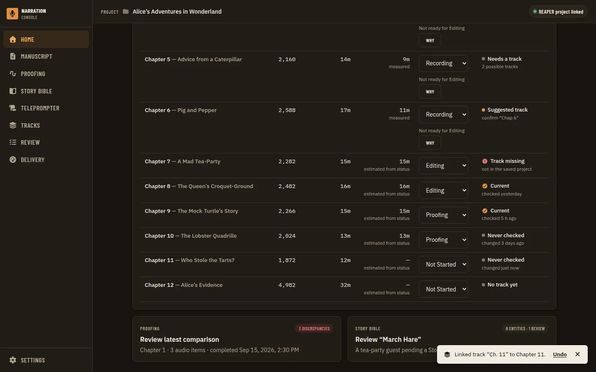
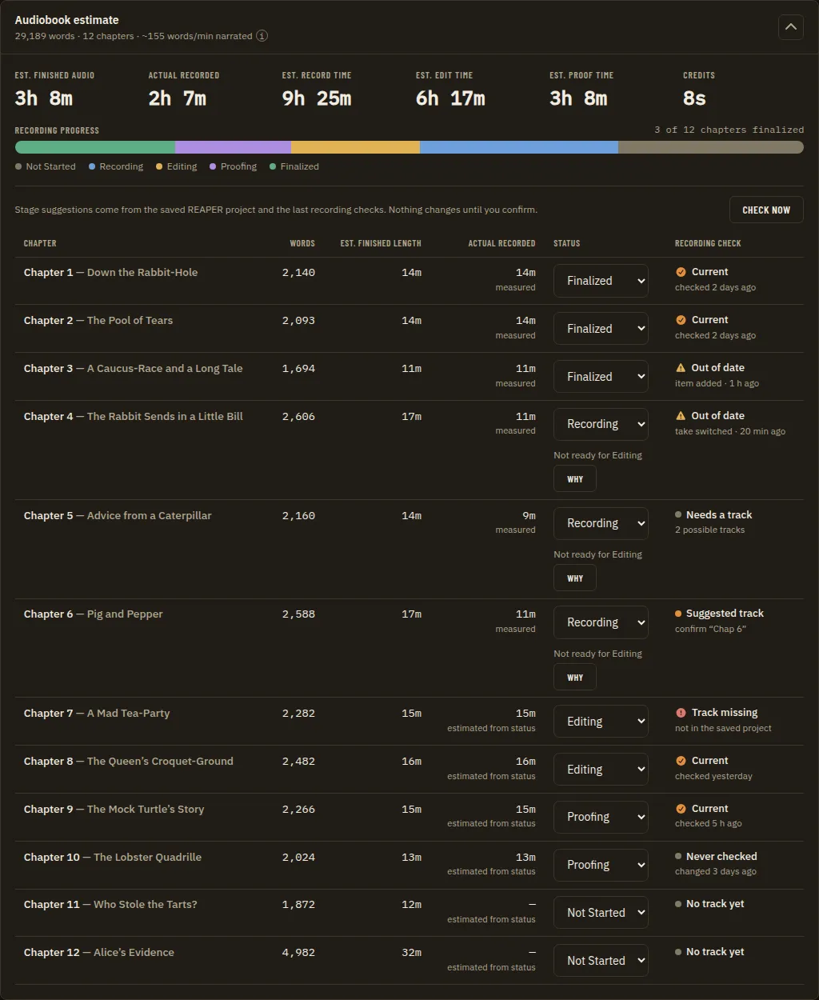

# DAW Chapter-Track Auto-Sync

**Source:** owner request of 2026-09-24: "As soon as I import my manuscript, I should have my chapters. That is happening. What is not happening is that as soon as I hook up my DAW (ex: REAPER), I should be prompted that the app will now sync chapters to tracks. Then it should auto-detect which ones match based on chapter and track titles, normalized in the case that I have 'Chapter 6' in one place and 'CHAPTER SIX' in another. I should never have to click 'Check' to know the status of the tracks. If a new track gets added, we should see if it matches one of our chapters that we don't have synced yet, auto-sync it and notify the user. That might be different if we are running pickup checks here, and if we can do them in the background based on when we last synced and when the track was last edited, if we have that." Context: Home's chapter table has a **Check** button per row that opens the recording check. Citations are `file:line` at `accb3bc`. Nothing here is built yet.

**Builds on / amends:** the confirmed chapter-track map ([ADR 0100](../adr/0100-analysis-evidence-is-two-hash-keys-one-ledger-record-per-run-and-a-narrator-confirmed-track-map.md)), the shared matcher ([ADR 0110](../adr/0110-one-go-chapter-to-track-matcher-ported-from-transcript-compare-with-explicit-confidence-states.md), [ADR 0113](../adr/0113-the-teleprompter-suggests-a-chapter-from-the-saved-armed-track-and-preselects-only-a-confident-match.md)), the reachability heartbeat ([ADR 0092](../adr/0092-reaper-executable-discovery-heartbeat-mechanism-and-script-plus-project-launch-are-resolved.md), [Project Workspace](project-workspace-and-daw-link.prd.md) Phase 7), and the recording check's "runs only on a press" rule ([ADR 0130](../adr/0130-the-home-recording-check-opens-on-the-stored-result-runs-only-on-a-press-and-labels-the-recorded-length-measured-or-estimated.md), Q14 of [the recording check](../utilities/recording-coverage.md)). Phases 2, 7 and 8 need new ADRs that supersede parts of ADR 0100 and ADR 0130 (see Decisions Log).

**Sibling PRDs drafted in parallel on 2026-09-24 (not linked here until they land, so the offline link check stays green):** (a) the **Actual recorded** column showing only real recorded duration; (b) a **per-row track-link button** on Home's chapter table (track info, change which track a chapter is tied to, remove a wrongly imported chapter); (c) the **recording check as a whole-chapter summary**. Already committed: [Home Stage Check Line](home-stage-check-line.prd.md) (removes the idle "Check now") and [Credits in the Chapter Table](credits-in-chapter-table.prd.md). This PRD does not specify those; it supplies the host-side sync and freshness data they display, and says where it collides with them.

**Status (2026-09-24):** draft; open questions S1 to S14 wait for the owner. No tracking issue yet: open one (`docs/operations/github-workflow.md`) before Phase 0.

## Problem Statement

1. **Linking a DAW does nothing for chapters.** Linking a REAPER project (the header pill, Tracks, Settings, or a REAPER launch) records the `.rpp` and nothing more. Every chapter still has to be tied to its track one at a time, by hand, from a dropdown that preselects the first track in the project rather than the track whose name matches.
2. **The app already knows most of the answers and throws them away.** A shared matcher already reads "CHAPTER SIX" as "Chapter 6" and tells a confident match from a guess, but its answer is used only as a hint (the teleprompter's preselect, a stage-evidence flag). It is never offered as the link, and it never runs when tracks change.
3. **Status needs a click.** The only way to learn whether a chapter's track has been recorded, changed or checked is to press **Check** on its row. That opens the stored recording check, and the check itself (minutes of Whisper transcription) starts only on a second press.
4. **Nothing notices a new track.** The app reads the saved `.rpp` when a page asks for it, never on its own, so a track added in REAPER for the next chapter is not seen until the narrator goes looking.
5. **Normalisation has gaps that matter for real track names.** "Ch. 6", "Chapter VI", "Sixth Chapter", "Chapter 06", "06" and "Ch6" do not match "Chapter 6" confidently, and two of them match the **wrong** chapter as a fuzzy guess (measured below).

## Evidence

**How a DAW gets linked today**
- `ProjectLinkDawFile` (`apps/desktop/dawlink.go:20-47`) opens a `*.rpp` dialog and saves `DawProjectFile` on the project manifest (`apps/desktop/internal/project/manifest.go:27-43`). It refuses an `.rpp` outside the project folder (`dawlink.go:62-80`). The UI calls it from the header pill, Tracks and Settings (`AppShell.tsx`, `TracksPage.tsx`, `DawCatalogPanel.tsx`). A REAPER launch passes `--project-file` and `project.FindByDawFile` maps it back to its project (Project Workspace Phase 5, partial). Migration auto-adopts a sole `.rpp` (W3). None of these paths touches chapters or emits anything a chapter surface listens to.
- The manifest has `DawProjectFile`, `Credits` and `RetailSample` (`manifest.go:27-43`). There is no field for a chapter-sync decision.

**How chapter-track links are made today**
- **Store.** `evidence.MappingStore` holds narrator-confirmed `trackGuid -> chapterId` links in `narration-utils/chapter-track-map.json`, keyed by `documentId`, with the chapter title and `confirmedAt` (`apps/desktop/internal/evidence/mapping.go:54-59`, `:68-72`, `:110-125`). "A suggestion ... is never written here until the narrator confirms it" (`:84-90`). ADR 0100 records this: a suggestion "is never treated as a link until the narrator confirms it through `MappingStore.Confirm`". A link has no origin field, so the file cannot tell a hand-made link from any other kind.
- **Bindings.** `ChapterTrackMapList/Confirm/Clear` (`apps/desktop/bindings.go:764-770`, logic `apps/desktop/mapping.go:37-89`). Confirm refuses a chapter id not in the manuscript (`mapping.go:54-71`).
- **UI.** `MappingConfirm` (`apps/ui/src/components/mapping/MappingConfirm.tsx:26-74`) is a track `Select` plus **Confirm**, and it preselects `options[0]`, the first track in project order, not the matched one (`:30`). It appears once per chapter in the Tracks page's **Chapter links** list (`apps/ui/src/components/tracks/ChapterLinksTable.tsx:25-116`, states `linked`/`unlinked`/`missing_track` only, `chapterTrackRows.ts:6`), and inside Home's recording check dialog when the chapter is unmapped (`apps/ui/src/components/home/RecordingCheck.tsx:360-405`). Neither surface shows the matcher's suggestion.
- **Re-import loses every link.** `resetDerived` deletes `chapter-track-map.json` on Replace manuscript and Clear (`apps/desktop/internal/manuscript/service.go:527-537`). `evidence.SuggestFromPrevious` was written to re-suggest links from the stored titles (`mapping.go:324-340`), but nothing in production calls it. Its only callers are `mapping_test.go:238-316`.
- **A separate, throwaway mapping.** The line-identity "Link chapters" dialog keeps its own chapter-to-track map in component state (`apps/ui/src/components/tracks/LinkChaptersDialog.tsx:27-31`, `:116`), described as a stand-in for the matcher.

**The matcher that exists (and its gaps)**
- `apps/desktop/internal/chaptermatch` is a faithful port of Transcript Compare's `find_chapter_by_track_name` (ADR 0110). It tokenises ASCII letters, digits and apostrophes (`normalize.go:28`), lower-cases, folds typographic quotes, homophones and possessives (`:97-111`), and merges spelled cardinals into digits (`numberWords` `:39-45`, `MergeNumberWords` `:117-146`, `NormalizedTokens` `:169-171`). `MatchTitle` (`title.go:46-83`) tries an exact token match (1.0), then a single whole-token prefix or contained run (0.95), then several (0.9, not confident), then a difflib ratio of at least 0.75 (never confident, ADR 0113 decision 6). `ForChapter` and `ForTrack` (`resolve.go:112-145` and `track.go`) give explicit states (`confirmed`, `matched`, `uncertain`, `ambiguous`, `none`, `resolve.go:21-36`). A near-equal margin of 0.05 turns two close candidates into `ambiguous` (`:66`). Region names are a second source (`:169-187`). Parity with the Python matcher is pinned by `tests/fixtures/chapter-track-match/parity-cases.json`.
- **Measured on 2026-09-24** by running `MatchTitle` from a scratch test (added through `go test -overlay`, so no repository file changed) against the chapter titles "A Message from the Author", "PROLOGUE — The Last Good Applause", "Chapter 1" to "Chapter 12", "Chapter 16", "Chapter 21", "Epilogue" and "Acknowledgments":

  | Track name | Result | Confident | Verdict |
  | --- | --- | --- | --- |
  | `CHAPTER SIX`, `chapter six`, `Chapter-6`, `chapter_6` | Chapter 6, 1.0 | yes | right |
  | `Chapter Twenty-One`, `Chapter Sixteen` | Chapter 21 / Chapter 16, 1.0 | yes | right |
  | `Prologue`, `PROLOGUE` | the prologue title, 0.95 | yes | right |
  | `6`, `Six` | Chapter 6, 0.95 | yes | right, but only while no other title contains the token `6` |
  | `Chapter 06` | Chapter 6, 0.947 (fuzzy) | no | right answer, never auto-linkable |
  | `Chapter6` | Chapter 6, 0.941 (fuzzy) | no | same |
  | `Chap 6` | Chapter 6, 0.80 (fuzzy) | no | same |
  | `06 - Chapter 6` | Chapter 6, 0.857 (fuzzy) | no | same |
  | `Ch. 6`, `Ch 6`, `Ch6`, `CH06`, `06`, `Sixth Chapter` | nothing | - | missed |
  | `Opening Credits` | nothing | - | missed (credits are not chapters, ADR 0150) |
  | `Chapter 6 (pickups)`, `Chapter 6 - take 2` | nothing | - | missed (a pickup or take track for chapter 6) |
  | `Chapter VI` | **Chapter 1**, 0.842 (fuzzy) | no | **wrong** |
  | `Chapter 6 v2` | **Chapter 2**, 0.857 (fuzzy) | no | **wrong** |

  Titles spelled in words work in both directions (`Chapter 6` against "Chapter Six" is 1.0), and a subtitle is fine (`Chapter 6 The Storm` against "Chapter 6: The Storm" is 1.0). So the owner's own example already matches. What is missing is prefixes, Roman numerals, ordinals, leading zeros, glued letter-digit names and take/pickup suffixes, and the fuzzy fallback must never be what links.
- **Where the matcher's answer goes today.** `ChapterTrackMatch` (`apps/desktop/chaptermatch.go:43-81`) and `ChapterSuggestion` (`:123-133`, "never follows a running REAPER", `:120-122`) serve the teleprompter. `evidence.MatchSuggester` (`mapping.go:288-322`) feeds only the stage provider's `Unconfirmed` flag (`apps/desktop/internal/coverage/provider.go:70`, `:116-136`). `matchInputs` reads the manuscript, the saved `.rpp` and the map from one snapshot (`chaptermatch.go:86-108`), which is the shape a sync needs.

**What "check" runs today, and what it costs**
- Home's per-row **Check** (`apps/ui/src/components/home/AudiobookEstimatePanel.tsx:284-296`) opens `RecordingCheck` on the chapter's stored result. **Check recording** in that dialog is the only thing that starts a check, and "the Home table never starts one" (ADR 0130; `docs/utilities/recording-coverage.md:16`, `:57-60`; Q14 at `:137`). One check runs at a time (`AudiobookEstimatePanel.tsx:72-95`).
- A check reads the chapter's one confirmed track (`apps/desktop/internal/coverage/manifest.go:171-195`), plans every unmuted item's active take (`:65-101`) and transcribes each played range it has not transcribed before, reusing the evidence cache (`recording-coverage.md`, "It transcribes each item's played range that it has not transcribed before"). Cost is about 10 s of CPU per audio minute with Whisper `small` and about 20 s with `large-v3-turbo` on the machine measured (`recording-coverage.md:110`). A 30-minute chapter checked from scratch is about 5 minutes of CPU. A re-check after a one-item pickup costs only that item.
- **Knowing whether a result is still current is cheap and needs no transcription.** `evidence.EvaluateChapter` (`apps/desktop/internal/evidence/staleness.go:395`) compares the stored run's fingerprint with the saved project's and returns reasons (`item_added`, `item_trimmed`, `take_switched`, `source_changed`, `mapping_changed`, `mapped_track_missing`, ..., `:58-69`). `ComputeChapterFingerprint` also returns the newest active-take source modification time (`:150-158`). Source identity carries `ModTime` (`identity.go:31-39`). This is what "when the track was last edited" can be built from.

**Can the app see REAPER change?**
- **Saved project:** every reader parses the `.rpp` on demand (`apps/desktop/tracks.go:102`) and stamps "as of last save" from its mtime (`savedAt`, `chaptermatch.go:154-160`). Nothing polls or watches it, and there is no file-watch dependency in `apps/desktop/go.mod`. A tracks change is visible only after the narrator saves.
- **Live REAPER:** the bridge's tick loop appends a `PROJECT_STATUS` heartbeat every 1.5 s with the active tab's `.rpp` path and an unsaved flag (`integrations/reaper/narration_ui_bridge.lua:63-96`; wire row `apps/desktop/internal/bridge/wire.go:68-73`). `daw.Reachability` treats it as live for 5 s and compares the path with the linked file (`apps/desktop/internal/daw/reachability.go:48-90`). A separate `project_state` command returns `GetProjectStateChangeCount(0)`, REAPER's project-wide edit counter (`integrations/reaper/narration_project_state.lua:1-30`; host `apps/desktop/internal/projectstate/service.go:1-12`, `:64-77`; wire row `wire.go:65-67`). It is sent only on request ([REAPER Automation Follow-Through](reaper-automation-follow-through.prd.md) Phase 13, partial, "no auto-run").
- **No per-track edit time.** The counter is project-wide, and no per-track or per-item modification timestamp is known in the ReaScript API (not verified; Phase 0 checks). Per-chapter "last edited" has to come from the fingerprint changing between two syncs, plus the newest source-file mtime (a new recording writes a new file).
- **No live track list.** The registered bridge commands (`add_finding_marker`, `close`, `configure_chapter_render`, `count_pickups`, `create_chapter_regions`, `create_take`, `export_compare_markers`, `export_pickups`, `import_pickups`, `inspect_compare_results`, `jump_to_compare_marker`, `launch_cleanup_tool`, `loop_context`, `navigate_item`, `next_pickup`, `pick_retake_lane`, `ping`, `prepare_compare`, `project_state`, `read_line_ids`, `resolve_pickup`, `stamp_item_lines`, `stop_loop`) include no read of track names or GUIDs. [Teleprompter Manuscript Integration](teleprompter-manuscript-integration.prd.md) Phase 11 plans a read-only `chapter_track_state` (`:173`, `:208`, pending).
- **The "ask REAPER only on a click" rule.** [ADR 0122](../adr/0122-the-review-page-asks-reaper-only-on-a-click-and-only-while-it-answers-and-a-refusal-is-an-answer.md) settles, for the Review page, that availability is read from the heartbeat and "no bridge command is sent without an explicit narrator action". Threat model row 5f covers "the app itself moves REAPER when the narrator did not ask". A watcher that sends commands on its own would be the first to break that pattern, so the heartbeat (which REAPER sends unasked) is the natural carrier.
- **Background stage reads are also ruled out today.** [Chapter Stage Recommendations](chapter-stage-recommendations.prd.md) Q5 chose "evaluate on read" over background re-evaluation "because ... the app cannot watch cheaply without REAPER" (`:96`). [Home Stage Check Line](home-stage-check-line.prd.md) Q2 proposes a throttled re-read on window focus as the stop-gap.

**Pickups, and whether they could run in the background**
- "Pickups" means three different things in this app:
  1. **Missing text** found by the recording check: the report lists each missing region, which the narrator then records as a pickup (`recording-coverage.md:16-22`).
  2. **Take review**: a cancellable Whisper scan of the chapter track "plus at most one pickup track or time range" for restarts, pickups and duplicate reads. It is started from the Review page, and the pickup track is a dialog choice or the `TakeReview.pickup_track_name` setting ([take review](../utilities/take-review.md), ADR 0124).
  3. **The pickup marker list**: `PICKUP:`/`PICKUP_DONE:` project markers, counted and navigated by bridge commands (`integrations/reaper/narration_pickups.lua:1-11`).
- (1) and (2) cost Whisper time of the same order as a check. Both reuse the per-source-range cache, so a background run after a small edit is cheap and one after a fresh recording is not. (3) is cheap but is a bridge command. Tracks named "Chapter 6 (pickups)" or "Chapter 6 - take 2" currently match nothing (table above), so the app cannot yet tell that a track is chapter 6's pickup track.

**Wire contracts and events in play:** `ChapterTrackMap*` payloads (`apps/ui/src/api/schemas/chapterTrackMap.ts`), `TracksList`, the coverage payloads, and live events emitted from `apps/desktop/app.go:581-669` (for example `projectstate:state` at `:669`). `hostAPIVersion` is 47 (`apps/desktop/app.go:52`, `apps/ui/src/hostApi.ts:2`). OS notifications go through `SystemNotify` (`apps/desktop/notifications.go`), gated by `General.notifications` and window focus.

## Proposed Solution

A host-side **chapter sync** that keeps `chapter-track-map.json` in step with the linked REAPER project, with the narrator's consent given once per project:

1. **Consent when the DAW is hooked up.** The first time a project has both a manuscript and a linked DAW project (however the link was made, and in either order), the app shows a **Sync chapters to tracks?** dialog with a preview: which chapters match which tracks, which need a choice, and which tracks match no chapter. **Sync** stores the decision on the project manifest and writes the confident links. **Not now** stores that too and does not ask again until the narrator turns sync on (Tracks or project Settings).
2. **Normalised matching, confident only.** The matcher gains a canonicalising pre-pass for chapter labels: `Ch.`/`Chap.`/`Chpt` become "chapter", Roman numerals after a label become digits, ordinals ("sixth", "6th") become digits, leading zeros are dropped, letters and digits are split ("Ch6"), accents are folded, and trailing take or pickup markers ("v2", "take 2", "(pickups)", "comp") are recognised as markers rather than title words. A link is written automatically only when the match is confident **in both directions**: the track's best chapter is this chapter, this chapter's only confident track is this track, and nothing else is within the 0.05 margin. Everything else goes to a short **needs you** list with the best candidate preselected.
3. **Watching.** While a synced project is open the host watches the saved `.rpp`'s modification time (a cheap `stat` every few seconds, standalone-capable). When REAPER is running from this app, it also watches REAPER's own edit counter, which is added to the heartbeat so no command is sent. On a change it re-reads the saved project after a short debounce and re-runs the sync. A new track that confidently matches a chapter with no link is linked, and the narrator gets one toast per batch ("Linked track 'Chapter 7' to Chapter 7", with **Undo**), plus an OS notification when the window is unfocused and notifications are on. A new track that matches nothing is listed quietly. Manual links are never overwritten, and a link is never removed automatically. A missing or renamed track is flagged, as today.
4. **Status without a click.** Each sync also computes, for every linked chapter, whether its recording check is current, stale (with the reasons) or missing, and when its track last changed (the sync at which its fingerprint changed, and the newest source-file time). This is a read, with no transcription. Home's rows get this as data. The per-row **Check** button is retired in favour of a status that is always there. How the row shows it belongs to siblings (b) and (c).
5. **Background checks, owner-gated.** Optionally, the host re-runs the recording check for a chapter whose track changed, once it has been quiet for a set time and REAPER is not recording. It runs one chapter at a time, at low priority, and only when the Whisper model is installed. It is cancellable and reports real progress. The cache means a pickup costs seconds. Take-review pickups scans stay a narrator action, but a chapter whose pickup track changed is marked and offered the scan.

Delivery order: measure (Phase 0), then match (1), then store (2), then consent and sync (3), then watch (4), then optional live tracks (5), then status (6), then background checks (7) and pickups (8).

## Key Hypothesis

We believe that syncing chapters to tracks by normalised names, with one consent per project and automatic linking of confident matches as tracks appear, will remove the per-chapter linking chore and the Check click without ever linking the wrong track. We'll know we're right when the owner links a REAPER project and, without further clicks, sees every conventionally named chapter linked and a status on every row; a new "Chapter 7" track saved in REAPER is linked and announced within seconds; and no automatic link has to be undone because it was wrong.

## What We're NOT Building

- Creating, renaming, reordering or deleting REAPER tracks, regions or items. Sync only reads REAPER and only writes `chapter-track-map.json`.
- Overwriting or removing a narrator-made link, or treating a fuzzy or ambiguous-prefix match as a link (ADR 0110, ADR 0113 decision 6 stand).
- Multi-track chapters or one track holding several chapters as auto-links. Coverage reads one track per chapter (`coverage/manifest.go:171-195`), and a region-sourced match (`resolve.go:169-187`) is offered, never auto-linked (S10).
- The row UI on Home: the track-link button (sibling b), the Actual recorded column (sibling a) and the whole-chapter recording summary (sibling c). This PRD supplies their data and removes the standalone Check button only in coordination with them.
- Credits links. The credits rows and their track links are [Credits in the Chapter Table](credits-in-chapter-table.prd.md) Phase 3. This PRD adds the credits synonyms to the normaliser and syncs credits only once that phase gives them ids the mapping store accepts (S13).
- Downloading a Whisper model in the background, or any background analysis before the owner answers S7.
- Non-REAPER DAWs. Audacity sync waits for the [Audacity Integration](audacity-integration.prd.md) adapters; the design keeps the sync service DAW-neutral (it reads a parsed project, not Lua).

## Success Metrics

| Metric | Target | How measured |
| --- | --- | --- |
| Normalisation | Every row of the Evidence table matches its right chapter confidently or is left unmatched; `Chapter VI` and `Chapter 6 v2` never match Chapter 1 or 2 | Go table tests, new parity cases shared with Python (S9), `go test -fuzz` |
| No wrong auto-link | 0 wrong links on the owner's project and the fixture corpus (precision 100%); recall at least 90% of conventionally named chapter tracks | Corpus test over `.rpp` fixtures plus the owner's track names (Phase 0) |
| Consent | The dialog appears exactly once per project on the first manuscript-plus-DAW state, from every link path (pill, Tracks, Settings, REAPER launch, migration, import after link) | Go tests on the trigger; Vitest; visual and aria states |
| New track picked up | A confidently named new track is linked and announced within 5 s of the narrator saving in REAPER | Go test with a fake clock and a rewritten fixture `.rpp`; scripted REAPER run |
| Never overwrite | A manual link is never replaced or removed by sync; an undone auto-link is not re-made for that pair | Go tests |
| No click for status | Every linked chapter row shows current / stale (why) / never checked and a last-changed time with no button press | Vitest; visual states at desktop, small-desktop, tablet |
| Bridge stays read-only | No command that changes REAPER is sent by sync; heartbeat-only watching sends no command at all | Lua harness tests; `wire_test.go`; threat model rows updated |
| Background check budget (if S7 allows) | Never while REAPER is recording or the narrator's own job runs; never without an installed model; cancellable; one at a time | Go scheduler tests with fakes |
| Gate | `pnpm check`, the visual suite, `pnpm --dir apps/ui run aria` for the new dialog, axe clean | `full-verification-gate` |

## Open Questions

- [ ] **S1. When is the DAW "hooked up", and when does the prompt show?** Options: (A) when the project has a manuscript and a linked `.rpp`, from any link path, whichever came second; (B) only when REAPER is reachable (heartbeat live and matching); (C) only on an explicit link action in the UI. Recommendation: A. It works standalone, and a REAPER launch or a migrated project is the same moment for the narrator. Projects that already have manual links are asked once too, with their links shown as kept.
- [ ] **S2. What does "Not now" mean?** Options: (A) stored; never asked again for this project, turned on later in Tracks or project Settings; (B) asked again next time the project opens; (C) a third button, "Never for this project". Recommendation: A, with the Tracks page showing "Chapter sync is off. Turn on".
- [ ] **S3. Does an automatic link count as a link?** ADR 0100 says a suggestion is never a link until the narrator confirms it. Options: (A) consent is the confirmation: an auto-link counts everywhere (recording check, stage evidence, teleprompter, regions), is labelled **Auto-linked** with its match, and can be undone; (B) auto-links are stored but consumers treat them as unconfirmed until the narrator accepts each (still a click per chapter); (C) auto-links count for display only, not for analyses. Recommendation: A. It is the owner's request, and the confidence rule plus Undo bound the risk. It needs a new ADR superseding that clause of ADR 0100.
- [ ] **S4. How strict is "confident"?** Options: (A) exact after normalisation only; (B) exact or a single whole-token prefix (today's `Confident`), unique in both directions; (C) B plus near-miss fuzzy matches above 0.95. Recommendation: B. C is ruled out by the "Chapter 6 v2" to Chapter 2 case. B still links "Prologue" to "PROLOGUE — The Last Good Applause". A bare "6" should link only when no other title contains that token (the both-directions rule already does this).
- [ ] **S5. How far should normalisation go?** Proposed set: `Ch`/`Ch.`/`Chap`/`Chapt`/`Chpt` to chapter; Roman numerals I to C only right after a chapter/part/book label (so the pronoun "I" in a title is untouched); ordinals as words and as `6th` next to a label ("Sixth Chapter", "Chapter the Sixth"); leading zeros; letter-digit splits; accent folding; a leading track number when a label follows ("06 - Chapter 6"); trailing `v2`, `take N`, `pickups`, `pu`, `comp`, `final`, `edit` recognised as markers (the track is a take or pickup track of that chapter, S11). Front- and back-matter synonyms: `Intro` to Introduction, `Foreword`/`Forward`, `Preface`, `Prologue`, `Epilogue`, `Afterword`, `Acknowledgements`/`Acknowledgments`. Which of these does the owner use, and what other naming habits (for example "Part 2 Ch 3", or book-title prefixes) should be covered?
- [ ] **S6. How is a change noticed?** Options: (A) the saved `.rpp` only: poll its mtime every 2 to 3 s while a synced project is open; the narrator must save; (B) A plus REAPER's edit counter added to the `PROJECT_STATUS` heartbeat, so the host knows something changed before a save and can say "unsaved changes in REAPER"; (C) B plus a read-only `list_tracks` bridge command sent when the counter moves, so an unsaved new track is seen (Phase 5). Recommendation: A and B now, and C only if the owner wants unsaved tracks picked up. C is the first command the app would send without a click (ADR 0122's pattern), so it needs its own ADR and threat model row, and it should share a command with teleprompter Phase 11's `chapter_track_state`.
- [ ] **S7. Background recording checks: off, on idle, or on?** Options: (A) off: status shows current/stale and the narrator starts a check (the dialog's **Check again**); (B) on idle: a changed linked chapter is re-checked once REAPER has been quiet for N minutes (proposed 3) and is not recording, one at a time, low priority, only with the model installed; (C) immediately after every sync. Recommendation: B, behind a project setting that defaults on once the model is installed. It needs a new ADR superseding ADR 0130's "runs only on a press" and recording-coverage Q14. What N? Should a laptop on battery skip it?
- [ ] **S8. What does "pickup checks" mean here?** Options: (1) the recording check's missing text (covered by S7); (2) the take-review scan for restarts and repeated reads; (3) the `PICKUP:` marker list. Recommendation: treat (1) as the background check, keep (2) a narrator action that is offered on the chapter when its pickup track changed (S11), and show (3)'s open count only when REAPER is reachable and the narrator opens the pickups view (unchanged). Please confirm which one was meant.
- [ ] **S9. Keep Go and Python matchers in parity?** ADR 0110 pins the Go matcher to Transcript Compare's. Options: (A) add the canonicalising pre-pass to both, with new shared parity cases; (B) a Go-only pre-pass used by sync and the other Go consumers, so parity covers only the shared core. Recommendation: A, since Transcript Compare's track-name lookup has the same gaps, and the parity fixture already exists.
- [ ] **S10. Ambiguous and one-to-many layouts.** Two tracks for one chapter ("Chapter 6 part 1", "part 2"), one track holding many chapters by regions, or duplicate titles across parts ("Part 1 / Chapter 1" and "Part 2 / Chapter 1"). Recommendation: never auto-link these; list them under **needs you** with the reason, since coverage reads one track per chapter.
- [ ] **S11. Pickup and take tracks.** Should "Chapter 6 (pickups)" become chapter 6's pickup track for take review (a second, typed link), be ignored, or be listed as unmatched? Recommendation: record it as the chapter's pickup track (not its chapter link), use it as the take-review scan's default scope, and have a change to it mark the chapter "pickups changed" (Phase 8).
- [ ] **S12. Notification channel and wording.** Options: (A) an in-app toast per sync batch with Undo, plus an entry in a **Sync activity** list on Tracks; (B) A plus an OS notification when the window is unfocused and `General.notifications` is on; (C) the activity list only. Recommendation: B. Unmatched new tracks go only into the activity list, never a toast.
- [ ] **S13. Credits.** Sync the credits rows' tracks ("Opening Credits", "Intro Credits", "Closing Credits", "End Credits") once [Credits in the Chapter Table](credits-in-chapter-table.prd.md) Phase 3 gives them link ids? Recommendation: yes, as a follow-up inside this PRD's Phase 3 when that phase has landed. Until then a credits-named track is listed as "credits track, not synced yet" rather than unmatched.
- [ ] **S14. Retiring the row's Check.** Options: (A) remove the button once the row shows status (Phase 6); the recording check dialog is opened from the status summary (sibling c) or the track-link button (sibling b); (B) keep a small "Check" as a fallback; (C) keep it only while S7 is A. Recommendation: A, coordinated with siblings b and c so the dialog is never unreachable.

## Users & Context

**Primary user:** an independent narrator recording in REAPER with a track per chapter, Windows first. Track names are whatever they typed while recording: "CHAPTER SIX", "Ch 6", "06", "Chapter 6 pickups".
**Current behaviour:** imports the manuscript and gets chapters; links the `.rpp`; then links each chapter to its track by hand from a dropdown starting at the first track, on Tracks or inside a recording check; presses Check per row to learn anything.
**Trigger:** linking the DAW project for the first time; adding a track for the next chapter; recording or fixing a chapter.
**Success state:** after linking, the chapter table is already tied to the tracks; a new chapter track shows up linked with a toast; every row says whether its recording is checked and current without a click.
**Job to be done:** When I hook my DAW up to a book, I want the app to know which track is which chapter and keep up as I add tracks, so I never do bookkeeping the app could do.
**Non-users:** narrators without a DAW link (nothing changes); a producer who keeps one long track per book (regions, S10: offered, never auto-linked).

## Solution Detail

| Priority | Capability | Phase |
| --- | --- | --- |
| Must | Canonicalising pre-pass: prefixes, Roman numerals, ordinals, leading zeros, letter-digit split, accent fold, take/pickup markers, front/back-matter synonyms; parity with Python (S5, S9) | 1 |
| Must | A pure sync planner: auto-link (confident both ways, unique), needs-you (with the best candidate), unmatched tracks, new/changed/missing tracks since the last sync, never overwriting a manual link | 2 |
| Must | Mapping store v2: `origin` (`manual`/`auto`), the match basis, and a rejected-pairs list so Undo sticks; v1 files read as manual | 2 |
| Must | Re-import re-suggests from stored titles (wire `SuggestFromPrevious`); with sync on, re-links confidently | 2 |
| Must | Consent dialog with preview, stored on the project manifest; triggered from every link path and from import after link (S1, S2) | 3 |
| Must | `MappingConfirm` preselects the matched track, not the first one; Tracks' Chapter links shows Auto-linked, Needs you, and why | 3 |
| Must | Watch the saved `.rpp` mtime while synced; debounce; re-sync; auto-link new confident tracks; toast with Undo; activity list (S6 A, S12) | 4 |
| Should | REAPER's edit counter on the heartbeat ("unsaved changes in REAPER"), harness-tested, additive wire field (S6 B) | 4 |
| Should | Per-chapter freshness on every sync (current / stale with reasons / never; last changed), a `chaptersync:state` event; the Home row's Check button retired (S14) | 6 |
| Should | Stage suggestions and the chapter list re-read on a sync event (replaces the need for Home Stage Check Line Q2's focus read) | 6 |
| Could | Read-only live `list_tracks` for unsaved tracks (S6 C) | 5 |
| Could | Background recording checks on idle (S7) | 7 |
| Could | Pickup-track links and "pickups changed" marking; take-review scope defaults (S8, S11) | 8 |
| Won't | Creating or renaming tracks; auto-linking fuzzy, ambiguous, multi-track or region matches; background model downloads | - |

**MVP:** Phases 1 to 4 (consent, normalised auto-link, new-track pickup on save).

**User flow (recommended answers).** The narrator imports the manuscript (22 chapters), then clicks the header pill and picks `Book.rpp`. The dialog "Sync chapters to tracks?" lists 19 matched ("CHAPTER SIX → Chapter 6", ...), 2 needing a choice ("Chapter 6 part 1" and "part 2" both look like Chapter 6), 1 chapter with no track yet, and 3 tracks that are not chapters ("Room tone", "Pickups", "Chapter 6 (pickups)", the last shown as Chapter 6's pickup track). They press **Sync**. Home's rows now say "Linked · never checked". Later they add a track "Ch. 7", record, and save. Within a few seconds a toast says "Linked track 'Ch. 7' to Chapter 7. Undo", and the row says "Linked · changed 1 min ago · not checked". If S7 is B, a few minutes after they stop recording the row shows "Checking 40%" and then "Measured: 18 of 18 min".

## Technical Approach

**Feasibility:** HIGH for Phases 1 to 4 and 6. The matcher, the store, the saved-project parser, the staleness evaluator and the heartbeat all exist; this is mostly composition plus one host loop. MEDIUM for Phase 7 (scheduling Whisper work fairly around the narrator's own jobs). MEDIUM-LOW for Phase 5 (a Lua command sent without a click; REAPER API behaviour to verify).

**Architecture**
- **`chaptermatch` (Phase 1).** A `CanonicalLabel(text)` pre-pass applied to both titles and names before `tokenize`, plus a `Marker` result (take/pickup/credits) so the planner can tell "Chapter 6 (pickups)" from "Chapter 6". Roman numerals and ordinals are converted only next to a label, so a title like "I Am Legend" is untouched. The fuzzy fallback stays as it is, and it stays non-confident. Python gets the same pre-pass (`sidecars/transcript-compare/core/compare.py`) and `parity-cases.json` gains the Evidence table's rows (S9). Threat model row 6d already covers names from a hostile `.rpp`; the fuzz target (`fuzz_test.go`) gains the pre-pass.
- **`chaptersync` (new Go package, Phase 2).** `Plan(chapters, project, links, previous Snapshot, rejected) -> Plan` is pure: `AutoLink[]`, `NeedsYou[]` (with reason and best candidate), `Unmatched[]`, `PickupTracks[]`, `New[]`, `Changed[]` (track fingerprint changed since `previous`), `Missing[]`. Matching uses `ForChapter`/`ForTrack` and auto-links only when both directions agree on a `matched` status from a track-name source (never region). `Snapshot` is per-track GUID, name and chapter fingerprint, with the sync time, stored in `narration-utils/chapter-sync.json`. `resetDerived` clears that file too, because chapter ids reset on re-import.
- **Mapping store v2 (Phase 2).** `TrackMapping` gains `origin` and `match` (score and kind); `mappingSchemaVersion` becomes 2. A v1 file reads as all `manual`. A newer version still reads as absent (`mapping.go:178-195`). A `rejected` list of (trackGuid, chapterTitle) pairs makes Undo stick across syncs. The re-import path calls `SuggestFromPrevious` on the pre-reset list. The golden for `ChapterTrackMapList` changes, so the Zod schema, the golden (`UPDATE_CONTRACTS=1`), the `wireContracts.test.ts` row and the mock all change with it.
- **Sync service (Phases 3 and 4).** On the host, built per project in `configureLocked` beside the other services, read through `h.services()` (ADR 0041). Every binding gets a `stressReaders` row in `hostrace_test.go`. Triggers: consent granted, project attach, manuscript import or replace, DAW link, `.rpp` mtime change (a 2 s `stat` ticker, only while sync is on and a `.rpp` is linked), and heartbeat counter change. Changes are debounced (for example 1.5 s after the last one) and never run concurrently with a manuscript import. Bindings: `ChapterSyncState()`, `ChapterSyncSetEnabled(on)` (the consent), `ChapterSyncPreview()` (the dialog's plan, nothing written), `ChapterSyncUndo(trackGuid)` (clears and rejects); `ChapterTrackMapConfirm/Clear` stay as they are. Live event: `chaptersync:state` (last sync time, counts, the latest batch for the toast, per-chapter link and freshness from Phase 6). One `hostAPIVersion` bump per binding phase (47 at `accb3bc`; re-check at merge).
- **Consent storage.** `project.Manifest` gains `ChapterSync *{Enabled bool, DecidedAt time}`, additive like `Credits` and `RetailSample`. It lives on the manifest because it is a project decision that survives Replace manuscript.
- **Heartbeat counter (Phase 4).** `PROJECT_STATUS` gains an optional fourth field `changeCount` (`GetProjectStateChangeCount(0)`), appended, never reordered. `wire.go` marks it `optional` so an older script still passes. The harness test comes first (`integrations/reaper/tests/reachability_test.lua`) with a mutation check. `daw.Reachability` keeps the last count, and the sync service subscribes. A counter change while the heartbeat's `.rpp` matches the linked file means "unsaved changes in REAPER"; the saved-file mtime is still what triggers a re-read. REAPER's own behaviour (does adding or renaming a track bump the counter; does an autosave touch the `.rpp` mtime) is checked in Phase 0, scripted on a copy of a project with an isolated `-cfgfile`.
- **Live track list (Phase 5, only if S6 is C).** A new `integrations/reaper/narration_track_list.lua` in `FEATURE_FILES` and `scripts/release/reaper-files.mjs` (ADR 0067), registering a read-only `list_tracks` that emits one `TRACK_LISTED|run|guid|index|name` per track and a closing count. Names are escaped by the bridge core's pipe rules. Harness tests are written first (ADR 0066), plus a `wire.go` row. It is sent only when sync is on, the heartbeat is live and matching, and the counter moved, at most once per debounce window. It needs a new ADR and a new threat model row: a command the host sends without a click that reads but never changes REAPER. Reconcile it with teleprompter Phase 11's `chapter_track_state` so there is one read command.
- **Freshness (Phase 6).** After each sync, for every linked narration chapter, `evidence.EvaluateChapter` against the recording analyzer's latest ledger record gives current, stale with reasons, or never. The last-changed time is the sync at which the chapter's fingerprint changed, bounded by the newest source mtime from `ComputeChapterFingerprint`. These are reads (under 1.5 s for 15 chapters measured by the stage work, `home-stage-check-line.prd.md` Evidence), carried on `chaptersync:state`. The stage suggestions and the chapter list re-read on this event.
- **Background checks (Phase 7).** A scheduler in the coverage service picks the stalest changed chapter, then waits for quiet: no counter change for N minutes (S7), REAPER not recording (heartbeat gains the play-state bit, `GetPlayState() & 4`, same optional-field pattern), no narrator-started job running, and the model installed (never `asset_required`). It starts the same `coverage.Start` path, so progress is real (ADR 0015), it ends with `job:ended` (ADR 0076), and a narrator-started check or Cancel pre-empts it. The row shows "Checking 40% (background)".
- **Pickups (Phase 8).** A `pickup` marker link in `chapter-sync.json` (not in the mapping store, so coverage's one-track rule is untouched), the take-review scan dialog's default scope, and a "pickups changed since last scan" flag from the pickup track's fingerprint.

**UI (each phase that touches `apps/ui`)**: the consent dialog on the `Dialog` primitive (ADR 0048), with an aria snapshot added (`pnpm --dir apps/ui run aria`, ADR 0065); toasts through the existing `notify`; the Tracks page's Chapter links gains Auto-linked/Needs you/Pickup track states and a Sync activity list; `MappingConfirm` preselects the matched track. New visual rows in `state-catalog.ts` with drivers in `app.drivers.ts` (consent preview, needs-you, sync off, new-track toast, stale row, background checking), captured at desktop, small-desktop and tablet with the PNGs looked at. No primitive or `styles.css` change is expected, so `design-spec-guard` and the atlas are not triggered unless one appears. The interaction feedback catalog gets rows for the dialog, Undo and the toggle.

**Technical risks**

| Risk | Likelihood | Mitigation |
| --- | --- | --- |
| A wrong auto-link sends a recording check or stage suggestion to the wrong audio | Medium | Confident-both-ways only; fuzzy never links; Undo with a sticky rejection; ADR 0100's `mapping_changed` staleness already invalidates results on a relink; a corpus test at 100% precision |
| Canonicalisation changes Transcript Compare's behaviour | Medium | Parity cases in both languages (S9); label-anchored rules only |
| mtime polling misses REAPER's save or fires on autosave | Low-Medium | Phase 0 measures it; debounce; the counter as a second signal |
| The heartbeat gets bigger or slower | Low | One integer per 1.5 s; harness-timed |
| Background Whisper runs slow the narrator's machine while recording | Medium | Recording bit, quiet period, one at a time, low priority, off unless S7 says so |
| Sibling PRDs (b, c) and this one each redesign the Check cell | High | The compatibility table: this PRD owns host data and removing the button; b and c own the row UI |
| A second mapping in `LinkChaptersDialog` diverges from the synced map | Medium | Phase 3 prefills it from the synced map (a later cleanup can remove it) |

## Implementation Phases

| # | Phase | Description | Status | Parallel | Depends | PRP Plan |
| --- | --- | --- | --- | --- | --- | --- |
| 0 | Measure REAPER and the owner's names | Scripted isolated REAPER run: does adding, renaming or removing a track bump `GetProjectStateChangeCount`; does an autosave touch the `.rpp` mtime; is there any per-track edit time; `.rpp` parse time on a large project; collect the owner's real track names for the corpus. Docs only | pending | 1 | - | - |
| 1 | Normalised matching | `CanonicalLabel` pre-pass in Go and Python, markers, parity cases, fuzz, table tests from the Evidence table; ADR amending ADR 0110 | complete | 0 | S5, S9 | - |
| 2 | Sync planner and mapping v2 | Pure `chaptersync.Plan`, `chapter-sync.json` snapshot, mapping `origin`/`match`/rejected, v1 migration, `resetDerived`, `SuggestFromPrevious` wired on re-import; goldens, Zod, `wireContracts.test.ts`, mock; ADR superseding ADR 0100's "never a link until confirmed" clause | pending | - | 1; S3, S4, S10 | - |
| 3 | Consent and first sync | Manifest `ChapterSync`, bindings (`State`, `SetEnabled`, `Preview`, `Undo`), triggers on every link path and import, consent dialog with preview, Tracks' Chapter links states, `MappingConfirm` preselect; `chaptersync:state` event with schema and golden; API bump; visual and aria states; guides | pending | - | 2; S1, S2, S12, S13 | - |
| 4 | Watch and auto-sync new tracks | `.rpp` mtime ticker, debounce, re-sync, toast with Undo and OS notification, Sync activity list; `PROJECT_STATUS` optional `changeCount` (harness test first, `wire.go` row, mutation check); threat model REAPER-bridge and `.rpp` rows re-read and updated; `docs/architecture/reaper-bridge.md` | pending | - | 3; S6, S12 | - |
| 5 | Live unsaved tracks (only if S6 is C) | `narration_track_list.lua` `list_tracks`, harness tests, `FEATURE_FILES`, `reaper-files.mjs`, `wire.go`, Go client, send rules; ADR and new threat model row; scripted REAPER check | pending | 6 | 4; S6 | - |
| 6 | Status without a click | Per-chapter freshness and last-changed on each sync; Home rows fed from it; the row's Check button removed (coordinated with siblings b and c); stage and chapter re-read on the event; visual states; guides and `recording-coverage.md` | pending | 5 | 4; S14; siblings b, c | - |
| 7 | Background recording checks (only if S7 is B or C) | Scheduler with quiet period, recording bit on the heartbeat (harness test first), pre-emption, setting, progress and `job:ended`; ADR superseding ADR 0130's press-only rule and Q14 | pending | 8 | 6; S7 | - |
| 8 | Pickups interplay | Pickup-track links, take-review default scope, "pickups changed" flag and offer; visual states; `take-review.md` | pending | 7 | 2, 4; S8, S11 | - |

### Phase Details

**Phase 0 - Measure.** Goal: settle what can be observed before building on it. Scope: a scripted REAPER 7.80 run on a copy of a project with an isolated `-cfgfile` (the Project Workspace spike's pattern): add, rename, delete and record on a track, save and autosave, recording each counter value and the `.rpp` mtime. Search the ReaScript API for a per-track or per-item modification time. Time `tracks.Parse` on the largest fixture. Record the owner's track names (anonymised if needed) as a corpus. Success: a research note under `docs/research/` that answers S6's premises. Anything that needs the owner or audio hardware is marked pending.

**Phase 1 - Normalised matching.** Goal: every Evidence-table name matches correctly or not at all. Scope: `chaptermatch/normalize.go` (a pre-pass before `tokenize`), `title.go` (marker result), Python `compare.py` and its parity test, `parity-cases.json`, the fuzz target. Success: table tests; the parity suite green in both languages; `Chapter VI` gives Chapter 6 confidently and `Chapter 6 v2` gives Chapter 6 with a take marker. Every existing consumer (teleprompter suggest, `ChapterTrackMatch`, the stage provider) keeps its tests green. `change-impact-scan` lists them.

**Phase 2 - Planner and store.** Goal: a tested, pure answer to "what should be linked" and a store that knows where a link came from. Success: planner table tests (one-to-one, duplicates, region-only, pickup marker, manual link kept, rejected pair not re-made, re-import re-link); store migration tests; goldens regenerated; `pnpm check`.

**Phase 3 - Consent and first sync.** Goal: the owner's "prompted that the app will now sync". Success: Go tests on every trigger path (pill, Tracks, Settings, REAPER launch, migration, import after link) showing exactly one prompt per project. Vitest for the dialog, Undo and preselect. Visual rows `tracks/sync-consent`, `tracks/sync-needs-you`, `tracks/sync-off` and a Home variant, PNGs reviewed at every viewport. Aria snapshot for the new dialog. `hostrace_test.go` rows.

**Phase 4 - Watch.** Goal: a new track is linked and announced without a click. Success: a Go test with a fake clock rewrites a fixture `.rpp` with a new "Ch. 7" track and sees a link and one batch event within the debounce. The harness pins `PROJECT_STATUS` with and without `changeCount`, and `wire_test.go` accepts both. A scripted REAPER run adds a track, saves, and sees the toast. The threat model and `SECURITY.md` are updated if a row changes.

**Phase 5 - Live tracks.** Goal: unsaved tracks picked up. Success: harness tests for `list_tracks` (names with pipes, empty names, 0 tracks), mutation checks, Go send-rule tests (never while unreachable, mismatched or with sync off), a scripted REAPER check, the ADR and the threat model row.

**Phase 6 - Status without a click.** Goal: the owner's "never have to click Check". Success: every linked row shows its freshness and last change after a sync; no Check button in the Home table; the recording check dialog is reachable from the sibling-owned status or link control; `home/chapter-table-*` states re-captured; `recording-coverage.md` and the Home guide updated.

**Phase 7 - Background checks.** Goal: stale chapters become measured without a press. Success: scheduler tests (quiet period, recording, a narrator job pre-empts, no model means nothing runs, cancel, one at a time); a desktop run on a copy of a project; the ADR.

**Phase 8 - Pickups.** Goal: the app knows each chapter's pickup track and says when it changed. Success: planner tests for markers; the take-review dialog prefilled; a "pickups changed" visual state.

### Parallelism Notes

Phases 0 and 1 can run together. 2 to 4 are sequential. 5 and 6 can run in parallel after 4. 7 needs 6 (the status the background run updates). 8 needs 2 and 4 and can run beside 5 to 7. Phase 6 must be sequenced with siblings b and c: land the host data first, then whichever row UI PRD is ready, and remove the Check button in the PR that makes the dialog reachable another way.

**Parallel-session compatibility**

| Phase | Files and areas touched | Collision risk |
| --- | --- | --- |
| 0 | `docs/research/`, scratch REAPER scripts out of tree | None |
| 1 | `apps/desktop/internal/chaptermatch/*`, `sidecars/transcript-compare/core/compare.py` and tests, `tests/fixtures/chapter-track-match/parity-cases.json`, `docs/adr/` | Teleprompter PRDs (consumers of `chaptermatch`); [Credits in the Chapter Table](credits-in-chapter-table.prd.md) Phase 3 (adds credits candidates to the suggester); Transcript Compare work; ADR numbering (next free after 0170 at `accb3bc`) |
| 2 | `apps/desktop/internal/evidence/mapping.go` and tests, new `apps/desktop/internal/chaptersync`, `apps/desktop/internal/manuscript/service.go` (`resetDerived`), `apps/ui/src/api/{schemas,contracts}/chapterTrackMap.ts`, `mockApi.ts`, `wireContracts.test.ts`, `tests/fixtures/contracts/` | Sibling (b) track-link button (same bindings and payloads: agree the `origin` field first); [Analysis Evidence Ledger](analysis-evidence-ledger.prd.md) (owns the store); Credits PRD Phase 3 (credits ids in the store); anything touching `resetDerived` |
| 3 | `apps/desktop/internal/project/manifest.go`, new `apps/desktop/chaptersync*.go`, `apps/desktop/{app.go,app_test.go,hostrace_test.go,dawlink.go}`, `apps/ui/src/hostApi.ts`, `Host.*`, `wailsClient.ts`, `components/tracks/{ChapterLinksTable,TracksPage,LinkChaptersDialog}.tsx`, `components/mapping/MappingConfirm.tsx`, `AppShell.tsx` (pill link path), `tests/visual/*`, `tests/aria/*`, guides | Every binding phase (`hostAPIVersion`); Credits PRD Phase 1 (manifest field); [Project Workspace](project-workspace-and-daw-link.prd.md) Phase 5 remainder (link paths); sibling (b) (`MappingConfirm`, the row's link control); `RecordingCheck.tsx`'s `TrackLink` shared with sibling (c) |
| 4 | `integrations/reaper/narration_ui_bridge.lua` (heartbeat), `integrations/reaper/tests/reachability_test.lua` and `mutations.json`, `apps/desktop/internal/bridge/wire.go` and tests, `apps/desktop/internal/daw/reachability.go`, the sync service, `docs/architecture/{reaper-bridge,threat-model}.md`, `SECURITY.md` | [REAPER Automation Follow-Through](reaper-automation-follow-through.prd.md) Phase 13 (`project_state`, the same counter); teleprompter Phase 11 (Lua); every Lua-touching PRD (heartbeat code in the core loop); [Home Stage Check Line](home-stage-check-line.prd.md) Phase 2 (its focus re-read overlaps the sync event: whichever lands second reconciles) |
| 5 | new `integrations/reaper/narration_track_list.lua` and harness test, `narration_ui_bridge.lua` `FEATURE_FILES`, `scripts/release/reaper-files.mjs`, `wire.go`, Go client | Teleprompter Manuscript Integration Phase 11 (`chapter_track_state`: agree one command); `reaper-files.mjs` editors (release readiness) |
| 6 | `apps/ui/src/components/home/{AudiobookEstimatePanel,RecordingCheck}.tsx`, `components/stages/useStageRecommendations.ts`, the sync service, `tests/visual/*`, `docs/utilities/recording-coverage.md`, `docs/guides/using-the-app/home.md` | **High:** sibling (a) Actual recorded column (same panel and `recordedFraction`), sibling (b) per-row track-link button (same row), sibling (c) whole-chapter recording summary (same Check cell and dialog), [Credits in the Chapter Table](credits-in-chapter-table.prd.md) Phase 2 (same table), [Home Stage Check Line](home-stage-check-line.prd.md) Phase 1 (same panel and screenshots), [Chapter Stage Recommendations](chapter-stage-recommendations.prd.md) phases 6 to 9 and its Q5 |
| 7 | `apps/desktop/internal/coverage/{service,run}.go`, heartbeat play-state field (Lua, harness, `wire.go`), settings (`fieldSchemas`, `config/defaults.json`), `docs/adr/` | [Recording Check Model Cascade](recording-check-model-cascade.prd.md) (same service, its fast pass is a natural background first step); sibling (c); every `fieldSchemas` editor |
| 8 | `chaptersync`, `apps/desktop/internal/takereview` scope defaults, `components/review/TakeReviewScanDialog.tsx`, `docs/utilities/take-review.md` | Take review follow-ups; [Diagnostics](diagnostics-delivery-and-cleanup-tools.prd.md) DAW scan (reads the same track names) |

Cross-cutting: each phase follows `CLAUDE.md`. Plan with an issue and `Closes #<n>`. Run `change-impact-scan` on `chaptermatch`, `evidence/mapping.go`, the heartbeat Lua and `AudiobookEstimatePanel.tsx`; for Lua consumers, find the harness tests of every command touched and treat a consumer with none as zero coverage. TDD. Run `full-verification-gate` (`pnpm check` including the Lua harness, the visual suite with PNG review at every viewport for `apps/ui` phases, `aria` for the new dialog). Run `design-spec-guard` only if a primitive or `styles.css` changes. Run `feature-cleanup`, including the threat-model rows for the REAPER bridge (5a to 5i) and hostile project files (6d), and any diagram in `docs/architecture/` that names a moved binding or event. Record REAPER API behaviour from a scripted run on a copy of a project with an isolated `-cfgfile`, and mark owner-only steps pending.

## Decisions Log

| Decision | Choice | Alternatives | Rationale |
| --- | --- | --- | --- |
| One shared matcher (prior, ADR 0110) | Kept; extended by a pre-pass, parity kept (proposed, S9) | A sync-only matcher | One answer across teleprompter, stages, coverage and sync |
| Confidence is the kind of match, not the score (prior, ADR 0113 d6) | Kept; auto-link additionally requires both directions to agree (proposed, S4) | Score threshold | "Chapter 6 v2" to Chapter 2 at 0.857 and "Chapter VI" to Chapter 1 at 0.842 show why |
| A suggestion is never a link until confirmed (prior, ADR 0100) | Superseded in part: consent once per project makes confident matches links, labelled `auto`, undoable (proposed, S3) | Confirm each | The owner's request; new ADR in Phase 2 |
| Links are keyed by track GUID (prior, ADR 0100/0110) | Kept: renames keep links, flagged | Re-match on every rename | Stable identity; a rename never silently moves a link |
| Evaluate on read, no watching (prior, stage PRD Q5) | Superseded for sync: a saved-file mtime poll plus the heartbeat counter (proposed, S6) | Focus re-read only | A `stat` is cheap; the counter needs no command |
| Ask REAPER only on a click (prior, ADR 0122 for the Review page) | Kept for Phases 1 to 4 and 6 (heartbeat only); Phase 5 would be the first exception, with its own ADR | Poll with commands | Threat model 5f |
| Recording check runs only on a press (prior, ADR 0130, Q14) | Kept until S7; Phase 7 supersedes it with an idle-only, pre-emptible background run | Always manual | The owner asked for background checks "if we can" |
| Consent lives on the project manifest (proposed) | `ChapterSync` on `project.json` | `settings.json`; the mapping file | Survives Replace manuscript like credits and the DAW link |
| Pickup tracks are not chapter links (proposed, S11) | A separate typed link in `chapter-sync.json` | Second mapping row | Coverage's one-track-per-chapter rule (D5) stays true |
| Open questions (owner, 2026-09-24) | Every open question takes this PRD's recommended answer, as shown in its approved Visual Spec mockups, except where a row below says otherwise | Answer each question separately | The owner approved the mockups that depict the recommendations; see D39 in the [implementation plan](implementation-plan.md#6-owner-decisions-2026-09-24) |
| Unbuilt data in the real app (owner, 2026-09-24, D24) | Visible UI is built in full; in mock mode it runs on sample data, and in the real app a surface whose data is not built yet shows an honest "not available yet" state. Controls that would act on REAPER stay disabled with the reason | Hide unbuilt UI until its data exists | The owner can use and judge every screen now; each backend phase switches on a screen that already exists |
| REAPER commands before the owner's verification pass (owner, 2026-09-24, D38) | Built in full with harness tests, their ReaScript calls documented from the API reference, and behind an "Experimental REAPER actions" Settings switch (off) until the owner and Claude verify them on a copy of a test project; commands that write to REAPER stay off until then | Wait to build them until the owner can test | Nothing waits on hardware, and nothing touches a real project before it is verified |
| Auto-links (owner, 2026-09-24, S3, D25) | A confident match (the track and the chapter each pick the other) becomes a real link, labelled "Auto-linked", undoable; a fuzzy match never links; links the narrator made by hand are never overwritten | Suggest only; confirm each | The owner should never have to press Check to know the state of the tracks |
| The Check button (owner, 2026-09-24, S14, D26) | Retired: the check-status column replaces it, and the recording check summary opens from the status cell | Keep Check beside the status | Status without a click; built together with the summary panel |
| Background recording checks (owner, 2026-09-24, S7, D27) | Only while REAPER is idle and not recording, and never on battery; until Phase 7 lands a changed chapter shows "Out of date" | Off; always on | Keeps CPU free while recording |
| Tracks per chapter and pickups (owner, 2026-09-24, S10, S8, D32, D33) | One track per chapter; a pickup track is recognised but never becomes the chapter's link | Several tracks per chapter | One-track-per-chapter workflow |

## Research Summary

- **Read:** the committed sibling PRDs ([Home Stage Check Line](home-stage-check-line.prd.md), [Credits in the Chapter Table](credits-in-chapter-table.prd.md)), [Project Workspace](project-workspace-and-daw-link.prd.md), [REAPER Automation Follow-Through](reaper-automation-follow-through.prd.md) (phase table), [Chapter Stage Recommendations](chapter-stage-recommendations.prd.md) (Q5, Q12), [take review](../utilities/take-review.md), [the recording check](../utilities/recording-coverage.md); ADRs 0092, 0100, 0110, 0113, 0122, 0130; `internal/chaptermatch`, `internal/evidence/{mapping,staleness,identity}.go`, `internal/coverage/{manifest,provider}.go`, `internal/project/manifest.go`, `internal/projectstate`, `internal/daw/reachability.go`, `internal/bridge/wire.go`, `apps/desktop/{mapping,chaptermatch,dawlink,notifications}.go`, `manuscript/service.go` (`resetDerived`), the Lua bridge loop, `narration_project_state.lua` and `narration_pickups.lua`; `MappingConfirm`, `ChapterLinksTable`, `LinkChaptersDialog`, `RecordingCheck`, `AudiobookEstimatePanel`.
- **Measured:** the matcher on 28 track-name forms against a realistic chapter list (Evidence table), through a scratch test injected with `go test -overlay` (no repository file changed).
- **Not verified:** whether adding or renaming a track bumps `GetProjectStateChangeCount`; whether REAPER's autosave touches the `.rpp`; whether any per-track edit time exists in ReaScript; `.rpp` parse time on a large book; the owner's real track-naming habits. Phase 0 answers all five.

---

*Generated: 2026-09-24*
*Status: DRAFT - open questions S1 to S14 wait for the owner*

## Visual Spec

Mockups approved by the owner on 2026-09-24. They were rendered from the real app (dark theme, the app's own fonts and components) with throwaway edits and invented sample data, so names, numbers and body text are placeholders; the layout, controls, states and wording are the spec. Each shows the recommended answer to the open questions unless its caption says it is an alternative. Where a mockup and the text above disagree, raise it before building rather than silently following either.

*Before* (`00-before.webp`)

*Sync consent dialog* (`01-sync-consent-dialog.webp`)

*Needs you list tracks page* (`02-needs-you-list-tracks-page.webp`)

*Auto linked toast undo* (`03-auto-linked-toast-undo.webp`)

*Row check status replaces check* (`04-row-check-status-replaces-check.webp`)

### Together with the related PRDs

The same screen with every PRD that changes it applied at once.

*Before* (`00-before.webp`)

*Home after* (`01-home-after.webp`)

*Home after summary open* (`02-home-after-summary-open.webp`)
