# Delivery Platform Profiles: Judge Delivery Against ACX, Not "Your Limits"

**Source:** owner request of 2026-09-24: "The Delivery page shouldn't be based on 'your limits'; it should be based on the platform you are exporting to. Right now, I only want to support ACX. So we would have a profile for them that we can do our measurements against. Maybe we have a section that allows the user to create custom delivery profiles to customize the metrics, but we very much know ACX's and some other big players' requirements."

**Supersedes (when delivered):** [ADR 0025](../adr/0025-delivery-measurements-in-go-profiles-deferred.md) ("no distributor profile ships yet"), decision 5 of [ADR 0155](../adr/0155-settings-gain-a-number-kind-with-a-declared-range-and-delivery-limits-are-the-narrators-own.md) ("delivery limits are the narrator's own", no built-in numbers), and the answers to Open Questions 1 and 9 of [Diagnostics, Delivery Reports and Cleanup Tools](diagnostics-delivery-and-cleanup-tools.prd.md) (DX-1 (A) "limits only, no preset"; DX-9 (a) "one limit set per settings layer"). The line "Add distributor profiles only after their rules are independently specified and validated" in `docs/roadmap.md:46` is kept, not reversed: Phase 0 is how this PRD meets it.

**Builds on:** the delivered measurement job, Delivery page, host judgement and report of the diagnostics PRD (phases 1, 2, 4 to 7; ADR 0156, ADR 0158, ADR 0170), the ACX conventions recorded by [Audiobook Credits Templates](audiobook-credits-templates.prd.md) (credits files, retail sample, ADR 0152) and the ACX numbers in `docs/research/reaper-automation-surface.md:202`.

Citations are `file:line` on HEAD `3afa459` (2026-09-24). "Per docs" marks a claim taken from a document and not checked in code. **To verify** marks a platform requirement not checked against the platform's own page in this session (the ACX help site is blocked from this environment); each carries the URL to check.

## Problem Statement

The Delivery page asks the narrator to invent their own numbers. It is headed **Your limits**, ships no numbers, and until the narrator types some it judges nothing ("No limits set. Every value is reported without being checked"). A narrator delivering to ACX (Audible) does not want to set limits: ACX publishes them, and every narrator already knows them. So today the page either says nothing useful or depends on the narrator copying ACX's numbers by hand into seven number boxes in Settings, with no record of where the numbers came from, and with the requirements ACX states that are not levels (the MP3 format, the file length, room tone at the head and tail, one section per file, credits files, the retail sample) nowhere on the page at all.

The owner wants the page judged against the platform the book is going to: ACX first and only for now, as a built-in, read-only profile whose every rule cites ACX's requirement, with an optional place to make custom profiles for anything else.

## Evidence

Verified in code (HEAD `3afa459`):

- **"Your limits" is the page's only judge, and it ships empty.** `DeliveryLimitsPanel` is titled "Your limits", says "No limits set. Every value is reported without being checked, so nothing here says a file passes" when none is set, and "These are your own limits: no distributor's numbers are built in" when some are (`apps/ui/src/components/delivery/DeliveryLimitsPanel.tsx:24,43,64`). The page reads them from the project-scope effective settings (`DeliveryPage.tsx:47-48`) and counts "values … outside your limits" (`:156`). The user guide's section is headed "Your limits" and says "no distributor's numbers are built in" (`docs/guides/using-the-app/delivery.md`, "Your limits").
- **Where the limits live and who set them.** Seven `number` settings in a `Delivery` section of the layered settings (project over global over default): integrated loudness and RMS lowest and highest, sample peak, true peak and noise floor highest (`apps/desktop/app.go:1126-1134`), with ranges that "only keep a typo out; they are not advice" (`apps/desktop/settings_number.go:25-37`) and a min-not-above-max pair rule (`:49`). The repo default is an empty section (`config/defaults.json:36`). Nobody sets them but the narrator: they came from the D22 default answer to DX-1 and DX-9 (ADR 0155, Proposed, never reviewed by the owner).
- **The host judges, against a profile it builds from those settings.** `deliveryProfile` reads `measure.LimitKeys()` through `store.Effective("Delivery", key)` and builds `measure.ProfileFromLimits("delivery-limits", …)` (`apps/desktop/delivery_report.go:43-55`; the name is `deliveryreport.ProfileName`, `internal/deliveryreport/report.go:30`). `judgeMeasureJob` runs `measure.Evaluate` on every read of the job, so a Settings change re-judges without measuring again (`delivery_report.go:60-72`, ADR 0170). The UI only reads the `delivery_qc` findings (`apps/ui/src/components/delivery/deliveryLimits.ts:65-76`).
- **The profile type can only hold five level bounds.** `measure.Profile` is a name plus `Limit{Min,Max}` on integrated LUFS, RMS, sample peak, true peak and noise floor (`internal/measure/profile.go:27-34`); its comment still says "The package ships no distributor profile" (`:24-26`). `Evaluate` raises an error finding per out-of-range value and an info finding per unmeasurable one, and nothing for a value that passes (`:54-81`), so its output cannot tell "met" from "not checked" (the same gap [Proofing Readiness Signals](proofing-readiness-signals.prd.md) records for its Phase 5).
- **What is measured today, per file (whole-file only, WAV only).** `measure.Report` holds sample rate, channels, duration, integrated LUFS, RMS, sample peak, true peak, noise floor, digital-silent windows, full-scale samples and clip runs (`internal/measure/measure.go:35-65`). RMS is the mean square over every sample of every channel, silences included (`measure.go:146`); the report says it is "not any distributor's own RMS definition" (`internal/deliveryreport/model.go:163`). The noise floor is the RMS of the quietest 0.5 s window that is not digital silence (`measure.go:29,230-235`; `model.go:166`). Bit depth is read (`internal/measure/wav.go:55-60`) but not reported. Only mono or stereo PCM/float WAV is read; anything else, MP3 included, is refused (`wav.go:183-191`). Nothing measures head or tail room tone, although ADR 0158's silence map (50 ms windows below a floor, `internal/measure/silencemap.go`) could.
- **Nothing is per chapter or per book.** The report's scope says "Files are not matched to chapters yet, so each is listed by its file name" (`internal/deliveryreport/model.go:13-14`). No rule spans files (all files the same channel count, credits files present).
- **Thresholds hard-coded vs configurable.** Configurable: the seven limits (above). Hard-coded: the 0.5 s noise window (`measure.go:29`), the 3-sample clip run, and every diagnostics threshold (clip ceiling 0 dBFS, silence floor −50 dBFS, minimum silence 0.3 s, level-shift step 4 LU, room-tone step 6 dB, pauses 0.3 s and 2 s), shown read-only and "not a delivery specification" (ADR 0158 decision 3; `docs/guides/using-the-app/delivery.md`, Diagnostics). Credits room tone is a separate Global setting, 0 to 10 s, that only feeds the Home estimate (`apps/desktop/app.go:1098`, `docs/guides/using-the-app/settings.md:17-20`). The retail sample is capped at 300 s (`internal/credits/sample.go:12-13`, ADR 0152).
- **A finding's ID carries the profile name.** `findings.StableID(analyzerName, report.File, profile.Name, check.name, kind)` (`internal/measure/profile.go:122`). Judging against `acx` instead of `delivery-limits` changes every Delivery finding ID. Delivery's findings are not in the findings store yet (ADR 0170 consequences), so no saved review decision is lost if the ID scheme changes now; it would be later.
- **The report names the narrator's limits.** "Your own limits, from Settings > Delivery" (`internal/deliveryreport/report.go:323-330`), a "Limits" section in the HTML (`report.html.tmpl:37-39`), and a notice that it "does not say that a distributor (ACX or another) will accept these files" (`model.go:9-11`), which stays true under a profile.
- **What the visual suite pins.** Six Delivery measurement states, one with `?mockDeliveryLimits=1` (`apps/ui/tests/visual/state-catalog.ts:968-1002`; driver waits for "No limits set." or "These are your own limits", `app.drivers.ts:233`), and three Settings Delivery states (`state-catalog.ts:1062-1071`, `:1223`) under the 390 px reflow width (ADR 0061). Settings shows a `DeliveryLimitsSummary` with the same "no distributor's numbers" wording (`apps/ui/src/components/settings/Settings.tsx:63-75`).
- **Wire contracts in place.** `measureJobSchema`, `deliveryQcEvidenceSchema` and `deliveryReportExportSchema` (`apps/ui/src/api/schemas/measure.ts`), golden payloads `tests/fixtures/contracts/measure-*.json` and `delivery-report-export.json`, and their rows in `apps/ui/src/api/wireContracts.test.ts:242-248`. `hostAPIVersion` is 47 (`apps/desktop/app.go:52`). The next free ADR number at HEAD is 0171.
- **Precedents for storage.** A user-level library file beside `recent-projects.json` (`creditTemplatesPath`, `apps/desktop/app.go:267-279`, `credit-templates.json`) and per-project additive fields on the project manifest (`project.Manifest.Credits`, `RetailSample`; `internal/project/manifest.go:29-43`). The layered settings keep only string values, so a structured profile cannot live there (per `audiobook-credits-templates.prd.md` Evidence).

Per docs:

- ADR 0025 and the diagnostics PRD deferred a distributor profile because "published guidance disagrees on ACX room-tone lengths" and because `measure`'s RMS "may not match" the distributor's definition (DX-1). Both are real and are what Phase 0 settles.
- `docs/research/reaper-automation-surface.md:202`: "RMS between -23 and -18 dB, peak below -3 dB, noise floor below -60 dB RMS, MP3 at 192 kbps or higher CBR at 44.1 kHz. Room tone: ACX says 1-5 s at head and tail; third-party guides say 0.5-1 s head and 1-5 s tail, so verify before enforcing."
- `audiobook-credits-templates.prd.md` read the official ACX page on 2026-09-20: separate opening and closing credits files; a retail sample of 5 minutes or less; "1 to 5 seconds of room tone at the beginning and end of each file"; "each file no longer than 120 minutes and starting with a section header".
- Current third-party guides (2025-2026, searched 2026-09-24: [narrationbox](https://narrationbox.com/blog/acx-audio-specs-explained-2025-2026), [ChapterPass](https://chapterpass.com/learn/acx-audio-requirements), [Hanna Eng](https://www.hanna-eng.com/guides/acx-audiobook-requirements/)) still state 0.5 to 1 s at the head and 1 to 5 s at the tail. The room-tone rule is therefore **conflicting** between the repo's reading of the official page and secondary sources.

## Proposed Solution

Replace "your limits" with a **delivery profile**: a named, versioned set of rules, each rule citing the platform requirement it enforces. Ship one built-in, read-only profile, **ACX**, dated to the version of ACX's page it was checked against. Each project selects one profile; the Delivery page, the report and every consumer of delivery checks judge against it. Each rule shows as met, not met, not measurable, or **not checked by the app** (for a requirement the app cannot measure yet, such as the MP3 bitrate of a WAV render), never silently skipped and never counted as a pass.

Numeric rules become measurable over time: the five levels now; duration, sample rate and channel count next (already measured); head and tail room tone from the silence map; the MP3 container (bitrate, CBR, sample rate) from its frame headers without decoding. Book-level requirements (credits files, retail sample, one section per file, consistent channels) appear as a checklist fed by the credits and chapter-mapping features.

A narrator who wants different numbers duplicates a built-in into a **custom profile** and edits its values. The existing "your limits" settings migrate into a custom profile when they differ from ACX, so nobody's judgement changes silently.

## Key Hypothesis

We believe a built-in ACX profile, whose rules each cite ACX's requirement and say whether the app can check them, will let a narrator delivering to ACX judge their files without setting a single number. We'll know we're right when a narrator opens Delivery on a new project, measures their chapters and sees each file judged against ACX with no Settings visit, the verdict per rule agrees with Audacity's ACX Check on the fixture set, and no requirement ACX states is missing from the page (either checked or listed as "not checked by the app").

## What We're NOT Building

- **A certification.** The page and report still say they are a measurement, not ACX's approval (`internal/deliveryreport/model.go:9-11` stays). No "ACX approved" badge, no pass/fail for the whole book.
- **Other platforms' built-in profiles in v1.** Findaway Voices (Spotify), Google Play Books, Apple Books, Kobo and Author's Republic are researched below and flagged **not shipped**; each becomes its own change after its rules are verified.
- **Automatic fixing.** No normalising, limiting, room-tone insertion or MP3 encoding. Mastering stays out of scope (diagnostics PRD).
- **MP3 decoding for level measurement.** Levels are still measured on WAV; the MP3 container check (Phase 6) reads frame headers only. Measuring an MP3's levels stays DX-2 of the diagnostics PRD.
- **Subjective requirements.** ACX's "no extraneous sounds", consistent narrator, pronunciation and mouth noise are listed in the profile as "not checked by the app (listen)", never measured.
- **Uploading to ACX, or reading ACX's own check.** Local only.
- **Editable built-ins.** A built-in profile is read-only; changes happen in a copy.
- **Diagnostics thresholds in the profile.** Clipping, level shift and room-tone change stay the diagnostics analyzers' candidate thresholds (ADR 0158; diagnostics Phase 9 brings them to settings). A profile holds delivery requirements only.

## Success Metrics

| Metric | Target | How Measured |
| --- | --- | --- |
| Zero-setup judgement | A new project with no Delivery settings judges measured files against ACX with no Settings visit | Go test on the host judge; visual state "Delivery / ACX, measured" |
| Every ACX requirement accounted for | Each row of the ACX rules table below is a rule in the built-in profile with a status (checked, not checked by the app, listen) | Go table test over the profile against a checked-in rule list |
| Every rule cites its source | 100% of built-in rules carry source URL, section, quoted text, date read and verification status | Go test; the report lists them |
| Agreement with ACX Check | On the fixture set (Phase 0), our verdict per level rule equals Audacity's ACX Check verdict; values within 0.5 dB (proposal) | Recorded comparison in `docs/architecture/delivery-measurement-validation.md` |
| No silent migration change | A project whose effective limits were set before the upgrade judges the same values the same way after it | Go migration test over global-only, project-override and ACX-equal cases |
| Not checked is never a pass | A rule the app cannot measure for a file (MP3 bitrate on a WAV, room tone before Phase 5) shows "not checked by the app", never "met" | Go and UI tests |
| Wire contracts | Every new payload has a Zod schema, golden, `wireContracts.test.ts` row and passing mock | `pnpm check` |

## Open Questions

- [ ] **P1. Profile per project, or one global choice?** (A) Per project, stored on the project manifest, defaulting to the Global default (ACX). (B) One global choice. (C) Per project only, no global default. Recommendation: (A). A narrator may deliver one book to ACX and another wide; the manifest already holds per-book delivery data (credits, retail sample).
- [ ] **P2. Do custom profiles ship in v1?** (A) Yes: duplicate a built-in, edit its numbers, rename, delete (Phase 4). (B) No: ACX only, plus the migrated "your limits" as a single read-only "Custom (from your old limits)" profile until custom editing ships. (C) No custom profiles at all; drop the old limits. Recommendation: (A) for the numeric rules only (a copy can change values and turn a rule off, not add new kinds of rules), because the migration needs somewhere to put an existing narrator's numbers anyway and duplication is a small UI.
- [ ] **P3. Which platforms next?** Candidates: Findaway Voices by Spotify, Author's Republic (both reported to be close to ACX), Google Play Books, Kobo, Apple Books (usually reached through an aggregator). Recommendation: none until asked; when asked, Findaway first (it reaches Spotify, Apple, Google, Kobo and libraries through one upload), each after its own Phase 0-style verification.
- [ ] **P4. How is a "to verify" or conflicting rule shown and judged?** (A) Judged as written, with a "to verify" badge and the conflict in the rule's detail. (B) Not judged (reported only) until verified. (C) Judged against the looser reading, with the stricter shown as advice. Recommendation: (C) for a conflict (room tone: judge a head of 0.5 to 5 s and a tail of 1 to 5 s, show "ACX's page says 1 to 5 s at the head; some guides say 0.5 to 1 s" as advice), and (A) for a rule that is only unverified; and Phase 0 should leave no ACX rule unverified.
- [ ] **P5. Is ACX pinned to a dated version?** (A) Yes: `acx@2026-09` (the date ACX's page was read), shown on the page and in the report; a new reading is a new version, and a project keeps its version until the narrator moves it to the newer one. (B) Always the latest built-in. Recommendation: (A) with an offer: "ACX (September 2026). A newer ACX profile is available: use it", because a report must say exactly which rules judged it, and a silent update could flip yesterday's verdict.
- [ ] **P6. What happens to existing "your limits"?** (A) Migrate: when any layer has a limit, create one custom profile per distinct effective set ("Your limits", "Your limits (<project>)"), select it for the projects that used it; if the set equals ACX's numbers, select ACX instead; then retire the Settings keys (read once, kept in the file, no longer shown). (B) Keep the settings as an "override" layer on top of the selected profile. (C) Drop them. Recommendation: (A). (B) keeps the very model the owner asked to remove.
- [ ] **P7. Default for projects that set no limits.** (A) ACX. (B) "No profile" (report only, today's behaviour) until the narrator picks. Recommendation: (A), as the owner asked ("right now, I only want to support ACX"); the page says which profile judged it and "Change profile" is one click away.
- [ ] **P8. Which peak does ACX's −3 dB mean?** (A) Sample peak (what ACX Check and most DAW meters report; to verify). (B) True peak (stricter). Recommendation: judge sample peak as the ACX rule and show true peak as advice ("true peak above −3 dBTP may clip after MP3 encoding"), unless Phase 0 finds ACX specifies true peak.
- [ ] **P9. Import and export of profile files?** (A) Not in v1. (B) Export a custom profile as JSON and import one (a new file the app reads: threat-model row). Recommendation: (A); revisit when a second person needs to share a profile.
- [ ] **P10. Whose job is the head/tail rule?** [Editing Readiness Analysis](editing-readiness-analysis.prd.md) Q3 proposes narrator-set maximum leading and trailing silence; this PRD proposes ACX's room-tone rule on the rendered file. Recommendation: the delivery rule here (rendered file, the platform's numbers), and editing readiness reads the selected profile's room-tone rule instead of its own settings.

## Users & Context

**Primary user:** a solo author-narrator delivering to ACX (Audible), rendering chapter files from REAPER on Windows. **Current behaviour:** checks the files in Audacity's ACX Check or a web checker, because the Delivery page judges nothing until they type limits. **Trigger:** chapters rendered and about to be uploaded to ACX. **Success state:** opens Delivery, sees "Judged against ACX (September 2026)", measures, and gets per-file results per ACX rule with the requirement quoted, plus what the app could not check.

**Secondary user:** a narrator delivering wide or under contract, with their own numbers, who duplicates ACX into a custom profile.

**Job to be done:** when my chapters are rendered, I want to know whether they meet the requirements of the platform I am uploading to, without re-typing the platform's numbers, so I do not get bounced by the platform's automated check.

**Non-users:** ACX reviewers, mastering engineers, and narrators who want a certification.

## Solution Detail

### Profile model

A **profile** is `{id, name, platform, version, builtIn, basedOn?, rules[]}`. A **rule** is:

| Field | Meaning |
| --- | --- |
| `id` | Stable within a profile, for example `acx.rms`, `acx.peak`, `acx.room_tone_head` |
| `scope` | `file` (each measured file) or `book` (the set of files, or the project) |
| `metric` | A measured value (`rms_dbfs`, `sample_peak_dbfs`, `true_peak_dbtp`, `noise_floor_dbfs`, `integrated_lufs`, `duration_seconds`, `sample_rate`, `channels`, `head_room_tone_seconds`, `tail_room_tone_seconds`, `digital_silent_windows`, `mp3_bitrate_kbps`, `mp3_cbr`, …) or a checklist item (`credits_opening_file`, `retail_sample`, …) |
| `bound` | `min` and/or `max` (inclusive), or `oneOf`, or `sameAcrossFiles` |
| `level` | `required` (a miss is an error finding) or `advice` (a warning) |
| `checkedBy` | `measured` (the app checks it), `not_yet` (the app cannot check it for this input, with why) or `listen` (subjective) |
| `source` | Document title, URL, section, the quoted requirement, date read |
| `verification` | `verified` (read on the platform's own page on the date), `to_verify` (secondary source only) or `conflicting` (with the conflict stated) |

A **custom profile** is a copy of a built-in with `builtIn: false`, `basedOn: "acx@2026-09"`, its own name, a version counter bumped on every save, and the same rules with changed numbers or a rule turned off. It cannot add a rule kind the app does not measure.

### ACX built-in profile (proposed contents)

| Rule | Requirement | Scope | App check today | Verification |
| --- | --- | --- | --- | --- |
| `acx.rms` | RMS between −23 dB and −18 dB | file | `rms_dbfs` min −23, max −18; definition vs ACX Check to confirm (whole file, silences included, all channels) | Number verified by repo reading of ACX page (research doc, credits PRD); **RMS definition to verify** against [ACX](https://help.acx.com/s/article/what-are-the-acx-audio-submission-requirements) and Audacity ACX Check |
| `acx.peak` | Peak values no higher than −3 dB | file | `sample_peak_dbfs` max −3; true peak shown as advice (P8) | Number verified by repo reading; **sample vs true peak to verify** |
| `acx.noise_floor` | Noise floor no higher than −60 dB RMS | file | `noise_floor_dbfs` max −60 (quietest 0.5 s window, digital silence excluded) | Number verified by repo reading; **window definition to verify** against ACX Check |
| `acx.room_tone_head` | Room tone at the beginning of each file | file | Not measured until Phase 5 (leading non-speech from the silence map) | **Conflicting:** ACX page read 2026-09-20 says 1 to 5 s; guides (2025-2026) say 0.5 to 1 s. Verify at [ACX](https://help.acx.com/s/article/what-are-the-acx-audio-submission-requirements) |
| `acx.room_tone_tail` | 1 to 5 s of room tone at the end of each file | file | Not measured until Phase 5 | Verified by repo reading and all guides agree |
| `acx.no_digital_silence` | Room tone, not digital silence (advice) | file | `digital_silent_windows` = 0 as advice | **To verify** (guides say "use room tone, not digital zero"; find ACX's wording) |
| `acx.format` | MP3, constant bit rate, 192 kbps or higher | file | `not_yet` for WAV ("the app measured the WAV render; check the MP3 you upload"); checked from MP3 frame headers after Phase 6 | Verified by repo reading (research doc) |
| `acx.sample_rate` | 44.1 kHz | file | `sample_rate` = 44100 on the WAV render now; on the MP3 after Phase 6 | Verified by repo reading |
| `acx.channels` | Mono or stereo, the same for every file (ACX prefers mono; to verify) | book | `channels` in {1,2} per file; `sameAcrossFiles` | **To verify** (consistency and preference wording) |
| `acx.file_length` | Each file 120 minutes or shorter | file | `duration_seconds` max 7200 | Verified (credits PRD reading) |
| `acx.one_section_per_file` | Each file holds one chapter or section and begins with its section header | book | `listen` now; later the chapter-track mapping and recording check can flag a file with two chapter titles | Verified (credits PRD reading: "starting with a section header") |
| `acx.credits` | Opening and closing credits as separate files; opening states title, author(s), narrator(s); closing indicates finality | book | Checklist from the credits feature (templates exist; files not matched yet) | Verified (credits PRD reading, 2026-09-20) |
| `acx.retail_sample` | A retail sample of 5 minutes or less (a minimum of 1 minute is reported by some guides) | book | From the project's retail sample (ADR 0152: estimated from words, 300 s cap) | 5 min max verified; **1 min minimum to verify** |
| `acx.consistency` | Consistent sound and levels across files; no extraneous sounds | book | `listen`; RMS spread across files shown as information | Verified in spirit; not numeric |
| (none) | Integrated LUFS | file | Reported as information, not a rule: ACX states no LUFS target (to verify) | **To verify** |

### Other platforms (researched, not shipped)

All from general knowledge and secondary sources; **every row is to verify** before a profile is built.

| Platform | What is reported | Check at |
| --- | --- | --- |
| Findaway Voices by Spotify | ACX-like levels (RMS −23 to −18 dB, peak −3 dB, noise floor −60 dB); MP3 192 kbps+ CBR or lossless WAV/FLAC accepted; 44.1 kHz; room tone at head and tail; chapter files; opening/closing credits; retail sample | Findaway Voices help centre, "Audio specifications" ([findawayvoices.com](https://findawayvoices.com)) |
| Author's Republic | Follows ACX's specification (MP3 192 kbps+ CBR, 44.1 kHz, same levels, files under 120 min) | [authorsrepublic.com](https://www.authorsrepublic.com) FAQ, "audio requirements" |
| Google Play Books | Format-focused: accepted file types (MP3, M4A, FLAC, WAV, others), one file per chapter or a ZIP, file size limits; no published RMS range known | Google Play Books Partner Center help, audiobook file requirements ([support.google.com/books/partner](https://support.google.com/books/partner)) |
| Apple Books | Mostly reached through aggregators (Findaway, Author's Republic); direct audiobook specs for providers are format-focused (AAC/M4B, chapter markers) | Apple Books for Authors / provider audiobook specification ([authors.apple.com](https://authors.apple.com)) |
| Kobo Writing Life | MP3 per chapter; levels reported as ACX-like by guides | [kobowritinglife.com](https://www.kobowritinglife.com) audiobook help |

### Core capabilities (MoSCoW)

| Priority | Capability | Phase |
| --- | --- | --- |
| Must | ACX requirements captured with sources, conflicts settled by the owner, measurement definitions validated against ACX Check | 0 |
| Must | Profile model, built-in ACX profile, rule-by-rule evaluation with met / not met / not measurable / not checked by the app | 1 |
| Must | Per-project selected profile (ACX default), migration of "your limits", host judges and the report cites each rule's source | 2 |
| Must | Delivery page judged against the profile: profile panel, per-rule results, "not checked by the app" rows | 3 |
| Should | Custom profiles: duplicate a built-in, edit numbers, turn a rule off, rename, delete; versioned | 4 |
| Should | Head and tail room tone and digital silence measured per file | 5 |
| Should | MP3 container check (bitrate, CBR, sample rate, channels) from frame headers | 6 |
| Could | Book checklist: credits files, retail sample, one section per file, channels the same across files | 7 |
| Won't (v1) | Other built-in platforms, profile import/export, MP3 level measurement, automatic fixing | later |

### MVP scope

Phases 0 to 3: the ACX profile judges the Delivery page and report for every project, "your limits" is migrated, and every ACX requirement the app cannot check yet is listed as such.

### User flow

1. Delivery shows a **Delivery profile** panel in place of **Your limits**: "ACX (September 2026)", "Change profile", and the rules as rows: requirement, how the app checks it, and a "to verify" or "conflicting" badge where applicable.
2. The narrator measures files as today. Each file's row shows its values with the ACX verdict per rule ("RMS −24.1, below ACX's −23 dB minimum"); a rule not checkable for that file reads "Not checked by the app: this is a WAV; check the MP3 you upload".
3. A book-level panel (Phase 7) lists credits files, retail sample and channel consistency.
4. **Change profile** opens Settings > Delivery: the selected profile for this project (and the Global default), the built-ins, and custom profiles with Duplicate, Edit, Delete.
5. **Export report** writes the profile's name, version, every rule with its source and verification status, and each finding against its rule ID.

## Technical Approach

**Feasibility:** HIGH for Phases 1 to 4 (extends `measure.Profile`, the host judge, the manifest and the credit-template store pattern). MEDIUM for Phase 5 (room tone at the file's edges needs a definition of "speech starts" that agrees with ACX Check; the silence map gives candidates). MEDIUM for Phase 6 (MP3 frame-header parsing is small but is untrusted input). LOW-MEDIUM for Phase 0's validation (needs Audacity's ACX Check run by hand on fixtures, and the owner reading ACX's page).

**Architecture:**

- **Package.** New `apps/desktop/internal/deliveryprofile`: the `Profile` and `Rule` types, the built-in ACX profile as Go data (each rule with its source and verification), `Evaluate(report, profile)` returning per-rule results `{ruleId, status: met|not_met|not_measurable|not_checked, value, bound, why}` plus `delivery_qc` findings for `not_met` (error for `required`, warning for `advice`) and `not_measurable`. `measure.Profile`, `ProfileFromLimits` and `measure.Evaluate` stay only as long as the migration needs them, then go (feature-cleanup).
- **Finding IDs.** `StableID("measure", file, profileId, ruleId, kind)`: the profile id (`acx`, or the custom profile's id), not its version, so moving from `acx@2026-09` to a newer ACX keeps a finding's ID when the rule is unchanged. Delivery findings are not stored yet, so changing the scheme now loses no decisions; coordinate with the review dashboard's ingestion.
- **Storage.** Built-ins are compiled in. Custom profiles are a user-level `delivery-profiles.json` beside `credit-templates.json` (the same path helper pattern, `apps/desktop/app.go:267-279`), written through a temporary file and a rename, validated on read (a bad file is reported, not guessed at; the built-ins still work). The project's choice is `project.Manifest.DeliveryProfile {id, version}` (additive, like `Credits`); the Global default is a `choice` setting `Delivery.default_profile` or a field of the user-level file (Phase 2 decides; the settings store holds strings only).
- **Migration (P6).** On the first read after upgrade, for each layer holding `Delivery.*` limits: build the effective set; if it equals ACX's numeric rules, select ACX; otherwise create one custom profile per distinct set (names "Your limits" and "Your limits (<project>)"), based on ACX with the numbers replaced and ACX's other rules kept, and select it for that project. The keys stay in the files, unread, and leave `fieldSchemas`/`numberSpecs` in the same phase; a test proves the old and new judgements match.
- **Host judge.** `judgeMeasureJob` (`delivery_report.go:60`) takes the selected profile; the job payload gains `profile {id, name, version, builtIn}` and per-file `rules[]` results beside `findings`. Book-scope rules are evaluated over the job's files.
- **Bindings.** `DeliveryProfiles()` (built-ins and custom, with the project's selection and the Global default), `DeliverySelectProfile(scope, id, version)`, `DeliverySaveProfile(profile)`, `DeliveryDeleteProfile(id)`. Each goes on `h.services()` with a `stressReaders` row; `hostAPIVersion` bumps once per phase that adds bindings (serialization point).
- **Wire contracts (CLAUDE.md).** New `apps/ui/src/api/schemas/deliveryProfiles.ts` (profile, rule, rule result); `measureJobSchema` gains `profile` and `rules`; goldens `tests/fixtures/contracts/delivery-profiles.json`, `delivery-profile-selected.json`, regenerated `measure-success.json` (and the other `measure-*.json`), written by Go tests with `UPDATE_CONTRACTS=1`; rows in `wireContracts.test.ts`; mocks in `mockApi.ts` that pass the schemas (replacing `?mockDeliveryLimits=1` with `?mockDeliveryProfile=custom`). No `as` cast or bare `JSON.parse`.
- **Report.** `deliveryreport.Limits` becomes `Profile {id, name, version, built_in, based_on, rules[] with source and verification}`; the JSON `schema_version` bumps; goldens `report.golden.{html,json}` regenerate; the notice keeps "not a certification". Each finding names its rule and the requirement text.
- **UI.** `DeliveryLimitsPanel` becomes `DeliveryProfilePanel`; `deliveryLimits.ts` reads rule results rather than inferring from findings; `MeasurementsTable` marks by rule. Settings > Delivery replaces the seven number boxes and `DeliveryLimitsSummary` with the profile picker and the custom-profile editor (existing primitives: `Select`, `Table`, `TextField` number boxes, `Dialog`; no new primitive expected, so no `design-spec-guard` beyond confirming that).
- **Visual suite.** Replace the Delivery `outside-limits` state with profile states (ACX judged, a "not checked by the app" row, a conflicting-rule badge, a custom profile), replace the three Settings Delivery states (all with the 390 px `reflow` capture, ADR 0061), keep axe clean, and regenerate `docs/images/ui/delivery-*.webp` and the guide.
- **Trust boundary.** A new user-level file the app reads back (`delivery-profiles.json`; tampering changes a verdict but writes nothing): add a row to `docs/architecture/threat-model.md` and `SECURITY.md` in Phase 4. The MP3 header parser reads untrusted bytes (bounded reads, no decode, fuzz test): a row in Phase 6. Import/export (P9), if ever, is a third row.
- **ADRs.** Phase 1 or 2: a new ADR "A built-in ACX delivery profile ships, each rule citing ACX's page, and a project judges against its selected profile", superseding ADR 0025 and decision 5 of ADR 0155. Phase 4: custom profiles and their storage. Next free number at HEAD is 0171; re-check at merge.

**Technical risks:**

| Risk | Likelihood | Mitigation |
| --- | --- | --- |
| Our RMS or noise floor differs from ACX's own check, so a file "meets ACX" here and is bounced there | Medium | Phase 0 compares with Audacity's ACX Check on fixtures and real chapters; the report states each definition; a borderline value (within 0.5 dB) is flagged as advice |
| ACX changes its page | Low to medium | Dated profile version (P5); a newer version is offered, not forced |
| The room-tone rule is misread | Medium | Owner reads ACX's page in Phase 0; until then the conflict is shown (P4) |
| The narrator reads "meets ACX" as approval | Medium | Keep the "not a certification" notice; per-rule wording, no book-level pass |
| WAV render judged for rules that apply to the uploaded MP3 | High (today) | `not_checked` rows naming the gap until Phase 6; never a pass |
| Migration changes a verdict | Low | Migration test that old and new judgements match; ACX only where numbers are equal |
| Finding IDs change | Low now | Change the scheme before the review store ingests Delivery findings |
| Collisions with sibling PRDs on the profile, head/tail rule and report | High | See the compatibility table |

## Implementation Phases

| # | Phase | Description | Status | Parallel | Depends | PRP Plan |
| --- | --- | --- | --- | --- | --- | --- |
| 0 | ACX spec and validation | Owner reads ACX's page and settles the conflicts (room tone head, peak type, retail minimum, channels); record the rules with quotes and date in `docs/research/`; compare `measure`'s RMS, peak and noise floor with Audacity's ACX Check on the EBU-free fixtures and two real chapters; record in `delivery-measurement-validation.md` | partial — pending owner: reading ACX's page (the help site is blocked from agent sessions) and the Audacity ACX Check comparison; rules recorded in `docs/research/acx-delivery-requirements.md` | 1 (types only) | - | - |
| 1 | Profile model and ACX built-in | `internal/deliveryprofile`: types, ACX profile with sources, per-rule `Evaluate` (file and book scope, `not_checked`), new finding IDs; duration, sample rate and channel rules; ADR superseding 0025 | complete | 0 | 0 for the final numbers | - |
| 2 | Selection, migration and host judge | Manifest `DeliveryProfile`, Global default, `DeliveryProfiles`/`DeliverySelectProfile` bindings, migration of `Delivery.*`, host judge and report on the profile; wire contracts; `hostAPIVersion` bump | complete | - | 1 | - |
| 3 | Delivery page on the profile | Profile panel, per-rule results, "not checked by the app" and verification badges, "Change profile"; Settings > Delivery picker (no editing); visual states incl. reflow; guide and screenshots | complete | 5 | 2 | - |
| 4 | Custom profiles | Duplicate, edit numbers, turn a rule off, rename, delete, version counter; `delivery-profiles.json` store; `DeliverySaveProfile`/`DeliveryDeleteProfile`; threat-model row; ADR | complete | 5, 6 | 3; P2 | - |
| 5 | Room tone and digital silence | Head and tail room tone per file from the silence map, digital-silence advice; `Report` gains the fields; rules turn from `not_checked` to measured | complete ([ADR 0236](../adr/0236-room-tone-at-a-files-edges-is-timed-against-the-silence-floor-and-a-custom-copy-takes-how-a-rule-is-checked-from-its-built-in.md), Proposed; the Delivery page's component tests and captures that still say room tone is not checked are lane C's, handed over on #509) | 3, 4, 6 | 1; P4 | - |
| 6 | MP3 container check | Pick MP3 files beside WAV; read frame headers for bitrate, CBR, sample rate, channel mode and duration, no decode; levels "not measured on MP3" (DX-2); threat-model row, fuzz test | complete ([ADR 0237](../adr/0237-an-mp3-is-measured-for-its-container-only-from-bounded-frame-headers-and-its-levels-are-not-checked.md), Proposed; threat model row 6j; handed over on #509: the picker's "MP3 audio" filter in `measure_job.go` (lane A; "All files" picks an MP3 until then) and the Delivery page's tests and captures (lane C)) | 4, 5 | 2 | - |
| 7 | Book checklist | Credits files, retail sample, one section per file, same channels across files, from the credits feature and the chapter mapping | UI complete (lane C, stream C7): `BookChecklistPanel` renders every book-scope rule of `job.bookRules` (already host-wired since Phase 1: Channels is measured today, the rest `not_yet`/`listen`) against the selected profile, shown as soon as a profile is chosen; `acx.credits` and `acx.retail_sample` carry a project-read bonus line (credits templates set up, a retail sample picked) beside their own "not checked by the app" status, per this phase's own design ("until then the checklist reads from the project ... and says which files it could not match"). Still pending (lane A): turning `acx.credits`/`acx.retail_sample`/`acx.one_section_per_file` from `not_yet`/`listen` into real per-file, chapter-matched rules once `credits-in-chapter-table.prd.md` Phase 3 lands | - | 3; `actual-recorded-column.prd.md` mapping, `credits-in-chapter-table.prd.md` | - |

### Phase details

- **Phase 0.** Inputs: ACX's page (owner, since the help site is not reachable from agent sessions), Audacity with ACX Check, the `measure` test fixtures plus two real chapters. Output: a table of each ACX requirement with the quoted text and date, the owner's answers to P4, P5 and P8, and per-rule agreement numbers. Done when every ACX rule in the table above is `verified` or deliberately `conflicting` with the chosen reading.
- **Phase 1.** Pure Go, no binding. Tests: the ACX profile's rule list against a checked-in table; `Evaluate` per status (met on the boundary, not met, not measurable, not checked for a WAV-only rule, book-scope same-channels); IDs stable across profile versions.
- **Phase 2.** Tests: migration (global only; project override; equal to ACX; hand-edited non-number, reported not guessed); `judgeMeasureJob` on the selected profile; report goldens; contract goldens with `UPDATE_CONTRACTS=1`; `stressReaders` rows.
- **Phase 3.** UI and docs. Replace "Your limits" wording everywhere it appears (`DeliveryLimitsPanel.tsx`, `DeliveryPage.tsx:98,128,156`, `Settings.tsx:63-75`, the guide, `app.drivers.ts:233`, `state-catalog.ts` rows). Visual suite for Delivery and Settings at every viewport and reflow; `aria` if a dialog is added.
- **Phase 4.** An editor for numbers on existing rules only; a built-in is never written; a deleted custom profile in use by a project falls back to the Global default with a notice.
- **Phase 5.** Define "room tone at the head" as the time from the file start to the first window above the silence floor (and the mirror at the tail), with the floor from the profile or ADR 0158's −50 dBFS; fixtures with 0.3 s, 0.7 s, 1.2 s and 6 s heads.
- **Phase 6.** Parse MPEG-1 Layer III frame headers (and a Xing/Info header for VBR detection); refuse ID3-only or malformed files with a reason; the measurement allowlist (ADR 0156) accepts `.mp3`.
- **Phase 7.** Needs files matched to chapters; until then the checklist reads from the project (credits templates set, retail sample picked) and says which files it could not match.

### Standing gates

Every phase: plan, `change-impact-scan` (the Delivery page, Settings, the report, `measure`, the manifest are shared), TDD, `pnpm check` (full), Playwright visual suite for any `apps/ui` change (Delivery and Settings, all viewports, reflow for Settings), `feature-cleanup` including the threat model where a row is named, and `Closes #<n>` on the tracking issue.

### Parallelism notes

Phase 0 needs the owner and can run beside Phase 1's types (numbers are data). Phases 5 and 6 are independent measurement additions and can run in parallel with 3 and 4. Phase 7 waits on the chapter mapping.

### Parallel-session compatibility

| Phase | Files touched | Collides with |
| --- | --- | --- |
| 0 | `docs/research/` (new note), `docs/architecture/delivery-measurement-validation.md` | Diagnostics PRD Phase 3 (same validation note; its EBU run is pending) |
| 1 | new `apps/desktop/internal/deliveryprofile/*`, `internal/measure/profile.go` | [Proofing Readiness Signals](proofing-readiness-signals.prd.md) Phase 5 (builds delivery checks from `measure.Profile` and a "selected profile", its Q7): it should consume `deliveryprofile` rule results instead; [Editing Readiness Analysis](editing-readiness-analysis.prd.md) Q3 (head/tail rule, P10) |
| 2 | `apps/desktop/{delivery_report.go,app.go,settings_number.go,bindings*.go,app_test.go,hostrace_test.go}`, `internal/project/manifest.go`, `internal/deliveryreport/*` (+ goldens), `config/defaults.json`, `apps/ui/src/{hostApi.ts,api/schemas/*,api/wireContracts.test.ts,api/mockApi.ts}`, `tests/fixtures/contracts/measure-*.json`, `apps/ui/wailsjs/go/main/Host.*` | Every binding-adding PRD (`hostAPIVersion`); [Chapter Title Display Consistency](chapter-title-display-consistency.prd.md) Phase 4 (`deliveryreport/report.html.tmpl`); credits PRDs on `manifest.go` ([Credits Token Setup](credits-token-setup-and-front-matter-detection.prd.md), [Credits in the Chapter Table](credits-in-chapter-table.prd.md)); diagnostics Phase 9 (analyzer thresholds into the same `Delivery`-adjacent settings, `fieldSchemas`, `numberSpecs`) |
| 3 | `apps/ui/src/components/delivery/*`, `components/settings/Settings.tsx`, `main.tsx` mock flags, `tests/visual/{state-catalog.ts,app.drivers.ts,doc-screenshots.json}`, `docs/images/ui/delivery-*`, `settings-delivery*`, `docs/guides/using-the-app/{delivery,settings}.md` | Sibling in flight **`app-shell-vertical-overflow.prd.md`** (the shell layout regenerates every page screenshot, Delivery's included: land one, rebase the other); sibling in flight **`edit-and-proof-workspace.prd.md`** if it reuses delivery checks on a proofing surface; any Settings PRD (Credits category, teleprompter settings) on `Settings.tsx` |
| 4 | new store file in `apps/desktop`, bindings, `Settings.tsx` editor, `docs/architecture/threat-model.md`, `SECURITY.md` | Any PRD adding a threat-model row (row numbering) |
| 5 | `internal/measure/{measure.go,silencemap.go}` and tests, `measure-*.json` goldens | Diagnostics Phase 9 (silence cleanup reuses the silence map; keep one owner of `silencemap.go`) |
| 6 | new `internal/measure/mp3header.go`, the measurement allowlist and picker filter (`measure_job.go`, ADR 0156) | Diagnostics Open Question 2 (MP3 measurement): this phase answers only the container half |
| 7 | the Delivery page, credits and chapter-mapping reads | [Actual Recorded](actual-recorded-column.prd.md) (the chapter-track mapping), [DAW Chapter-Track Auto-Sync](daw-chapter-track-auto-sync.prd.md), [Credits in the Chapter Table](credits-in-chapter-table.prd.md) |

Also: the diagnostics PRD's "What We're NOT Building" ("A distributor (ACX or other) profile") and its Won't row become stale when this PRD lands; update them in Phase 1's pull request. `docs/workflows/technical-qc-and-handoff.md` says "a selected generic audiobook measurement profile"; update in Phase 3.

## Decisions Log

| Decision | Choice | Alternatives | Rationale |
| --- | --- | --- | --- |
| What judges Delivery (owner, 2026-09-24) | The platform's profile, ACX only built in | The narrator's own limits (ADR 0155) | Owner request; ACX's numbers are published and known |
| Reconciling with ADR 0025 and the roadmap (proposed) | Ship ACX with every rule citing ACX's page, dated, validated in Phase 0; a new ADR supersedes 0025 | Keep deferring | The roadmap's condition ("independently specified and validated") is met by Phase 0 rather than dropped |
| Where a profile lives (proposed) | Built-ins in Go; custom in a user-level JSON file; selection on the project manifest | Layered settings | Settings store strings only; the credits templates and manifest are the precedents |
| Rule model (proposed) | Rules with scope, bound, level, `checkedBy`, source and verification | Five level bounds (`measure.Profile`) | ACX's requirements are not all levels; a rule the app cannot check must still show |
| Finding ID (proposed) | Profile id plus rule id, not version | Profile name (today) | Stable across ACX versions; changed before the review store ingests them |
| Unverifiable requirement (proposed) | "Not checked by the app" with why, never a pass | Omit it | A missing rule reads as a pass |
| Levels on MP3 (proposed) | Out of scope; container check only | Decode MP3 | DX-2 owns decoding; header parsing is enough for bitrate, CBR and sample rate |
| Open questions (owner, 2026-09-24) | Every open question takes this PRD's recommended answer, as shown in its approved Visual Spec mockups, except where a row below says otherwise | Answer each question separately | The owner approved the mockups that depict the recommendations; see D39 in the [implementation plan](implementation-plan.md#6-owner-decisions-2026-09-24) |
| Unbuilt data in the real app (owner, 2026-09-24, D24) | Visible UI is built in full; in mock mode it runs on sample data, and in the real app a surface whose data is not built yet shows an honest "not available yet" state. Controls that would act on REAPER stay disabled with the reason | Hide unbuilt UI until its data exists | The owner can use and judge every screen now; each backend phase switches on a screen that already exists |
| Room tone at the edges (Phase 5, ADR 0236, Proposed) | Head and tail timed to the first and last 50 ms window at or above −50 dBFS (ADR 0158's floor), in the measurement's own read pass; exact-zero windows in an edge are advice ("digital silence, not room tone"); no reading above the floor is not measurable; a custom copy takes `checkedBy`, the not-checked reason and advice from its built-in on every read | A narrator-set floor; the silence map's minimum-duration regions; a new ACX version | The floor separates room tone from reading and is not a delivery limit; one pass keeps the job's cost; ACX's requirements did not change, only whether the app checks them, so `acx@2026-09` stays |
| MP3 container (Phase 6, ADR 0237, Proposed) | Chosen by the file's first bytes; ID3v2 skipped; Layer III headers walked with bounded reads and a confirmed resync; CBR when every audio frame shares one bitrate and no Xing/VBRI tag; `acx.format` measured as the bitrate with a 192 kbps minimum and `not_cbr`; levels and room tone "not checked" on an MP3 | Choose by extension; decode MP3 for levels; keep `acx.format` as text only | The bytes, not the name, say what a file is; DX-2 owns decoding; a numeric minimum lets a custom copy change it like any other bound |
| Peak and platforms (owner, 2026-09-24, P8, P3, D36) | ACX's −3 dB is judged on sample peak, with true peak shown as advice; ACX is the only built-in profile for now | True peak; ship other platforms | Matches common ACX checkers; the owner only delivers to ACX now |

## Research Summary

**In the repo:** ACX's numbers (`docs/research/reaper-automation-surface.md:202`), ACX's credits, retail-sample, file-length and section-header requirements read from the official page on 2026-09-20 (`audiobook-credits-templates.prd.md` Evidence), the retail sample cap (ADR 0152), credits as separate files (ADR 0093, ADR 0151), the measurement definitions (`internal/deliveryreport/model.go:160-169`) and the validation note (`docs/architecture/delivery-measurement-validation.md`).

**Checked in this session:** the official ACX page ([help.acx.com](https://help.acx.com/s/article/what-are-the-acx-audio-submission-requirements)) could not be fetched (blocked by the environment's egress proxy). Three current secondary guides agree on RMS −23 to −18 dB, peak −3 dB, noise floor −60 dB, MP3 192 kbps+ CBR at 44.1 kHz, files under 120 minutes and room tone 0.5 to 1 s at the head and 1 to 5 s at the tail ([narrationbox](https://narrationbox.com/blog/acx-audio-specs-explained-2025-2026), [ChapterPass](https://chapterpass.com/learn/acx-audio-requirements), [Hanna Eng](https://www.hanna-eng.com/guides/acx-audiobook-requirements/)). The head room tone disagrees with the repo's 2026-09-20 reading of the official page (1 to 5 s at each end); Phase 0 settles it.

**To verify:** ACX's RMS and noise-floor definitions and whether "peak" is sample or true peak (compare with Audacity's ACX Check, which ACX recommends per the guides); whether ACX states a retail-sample minimum and a mono preference; ACX's wording on digital silence; every other platform's requirements (table above).

---

*Generated: 2026-09-24*
*Status: DRAFT - open questions P1 to P10 need the owner*

## Visual Spec

Mockups approved by the owner on 2026-09-24. They were rendered from the real app (dark theme, the app's own fonts and components) with throwaway edits and invented sample data, so names, numbers and body text are placeholders; the layout, controls, states and wording are the spec. Each shows the recommended answer to the open questions unless its caption says it is an alternative. Where a mockup and the text above disagree, raise it before building rather than silently following either.

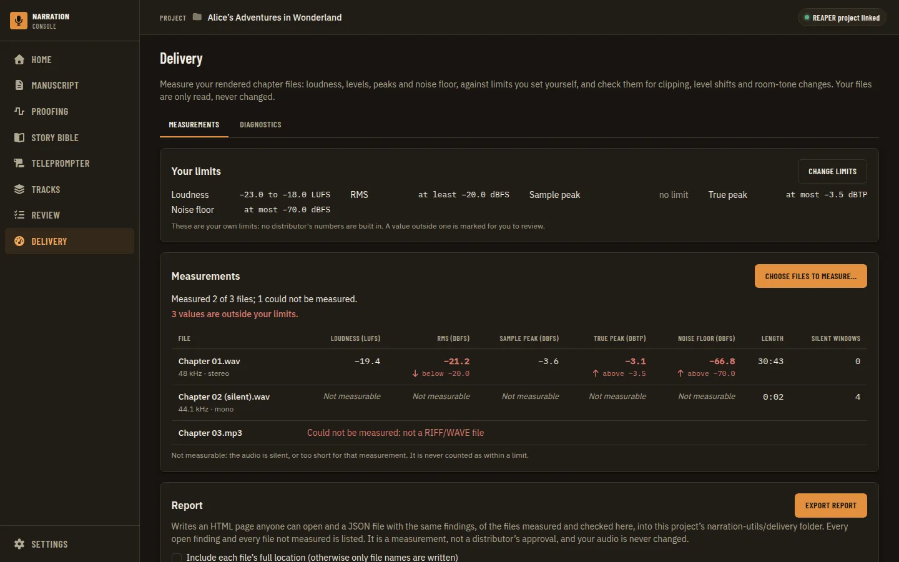

*Before* (`00-before.webp`)

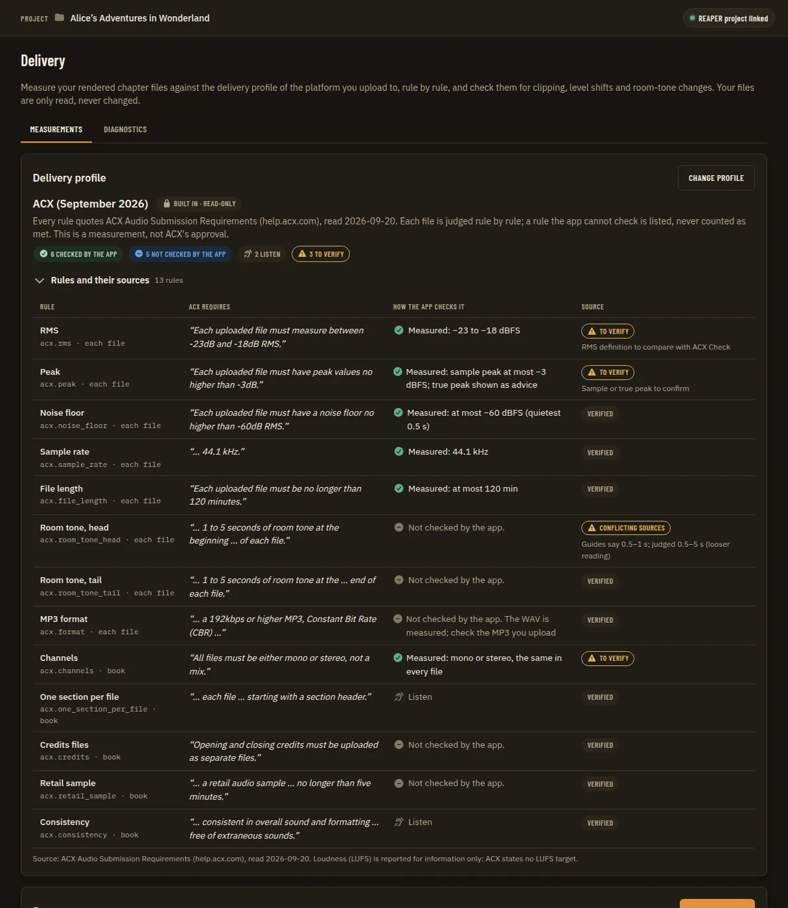

*Profile panel acx rules and sources* (`01-profile-panel-acx-rules-and-sources.webp`)

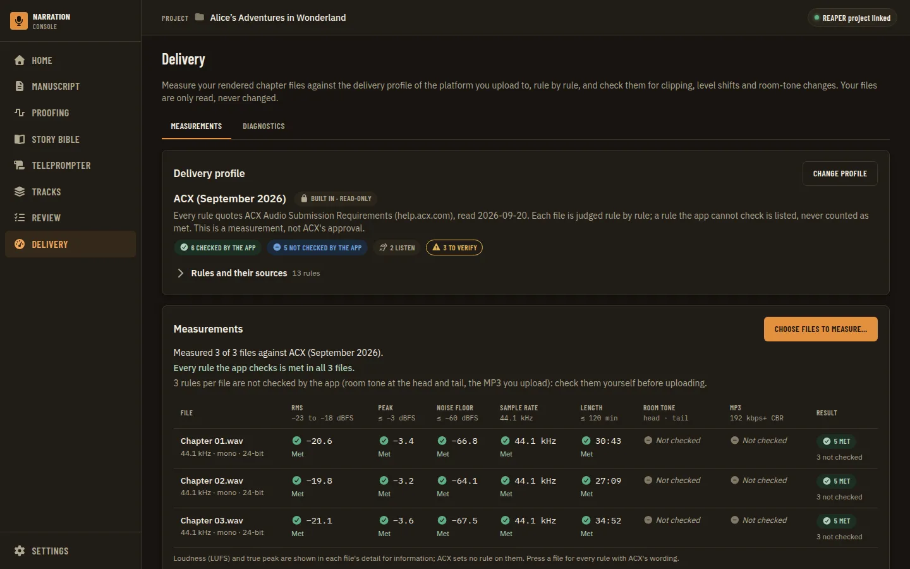

*Measured pass acx* (`02-measured-pass-acx.webp`)

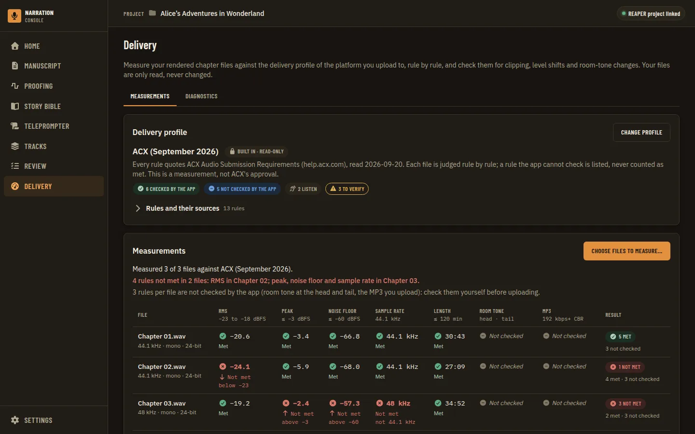

*Measured failing acx* (`03-measured-failing-acx.webp`)

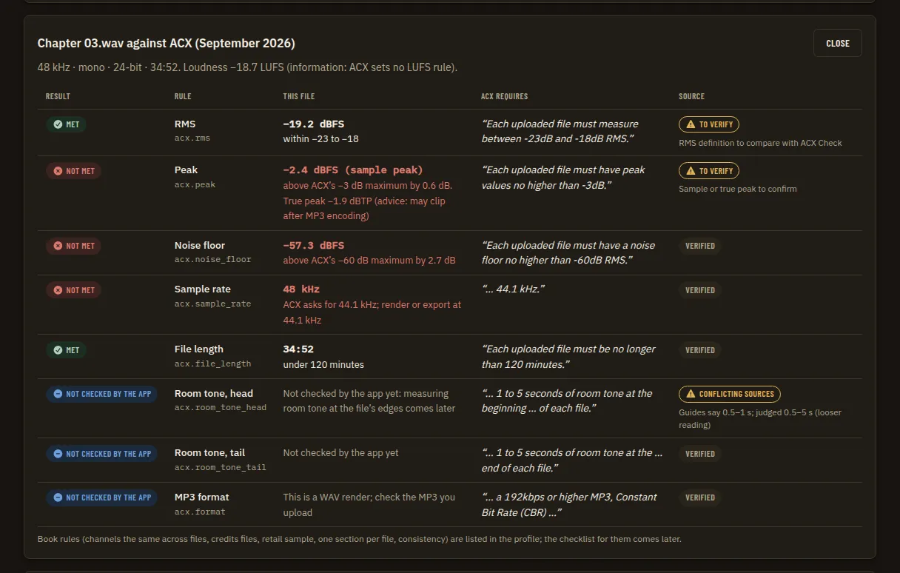

*Failing file rule by rule with source* (`04-failing-file-rule-by-rule-with-source.webp`)

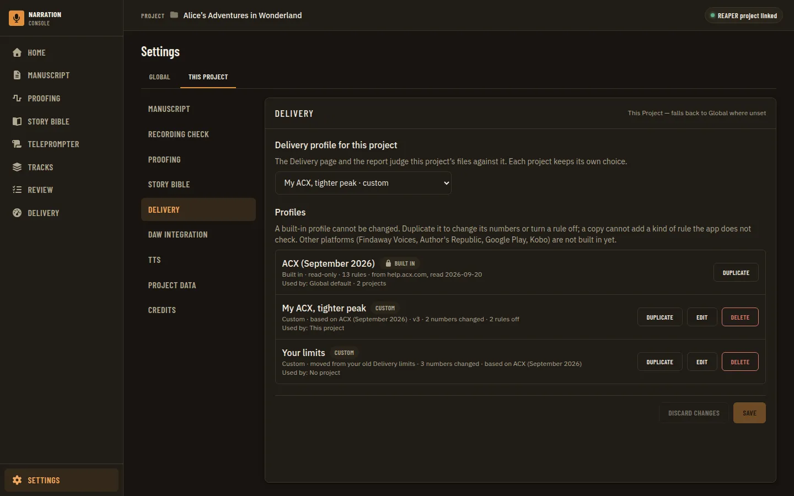

*Settings project profile picker* (`05-settings-project-profile-picker.webp`)

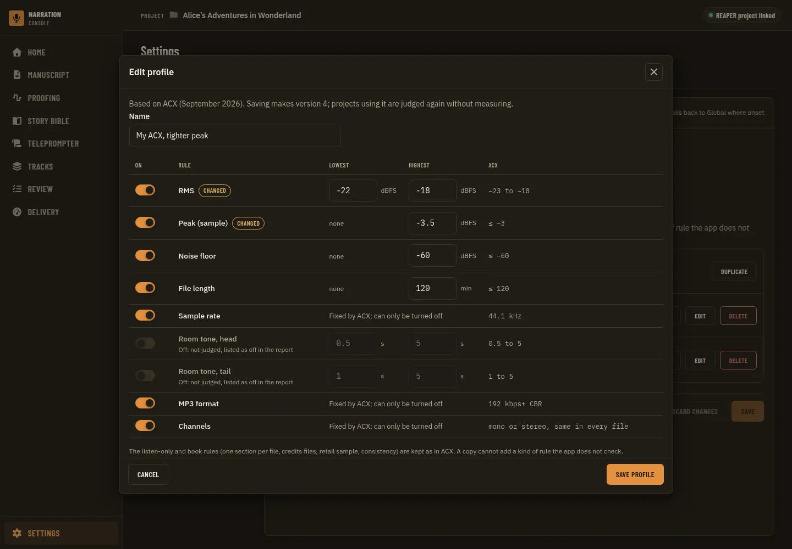

*Custom profile editor* (`06-custom-profile-editor.webp`)

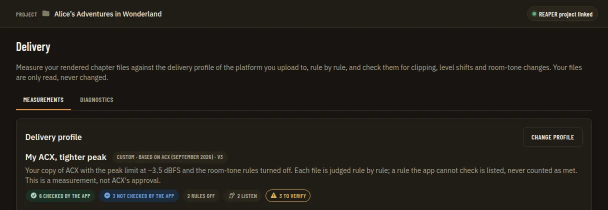

*Page judged by custom profile* (`07-page-judged-by-custom-profile.webp`)

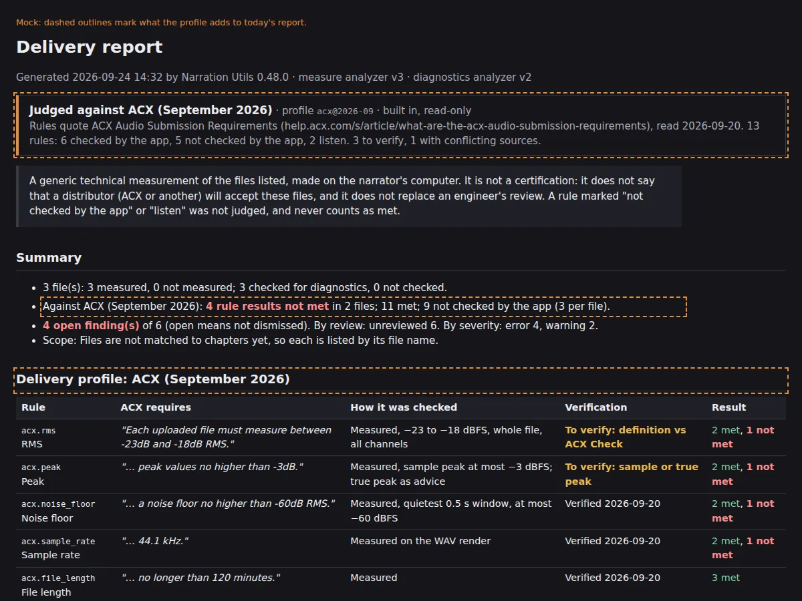

*Report header names profile* (`08-report-header-names-profile.webp`)

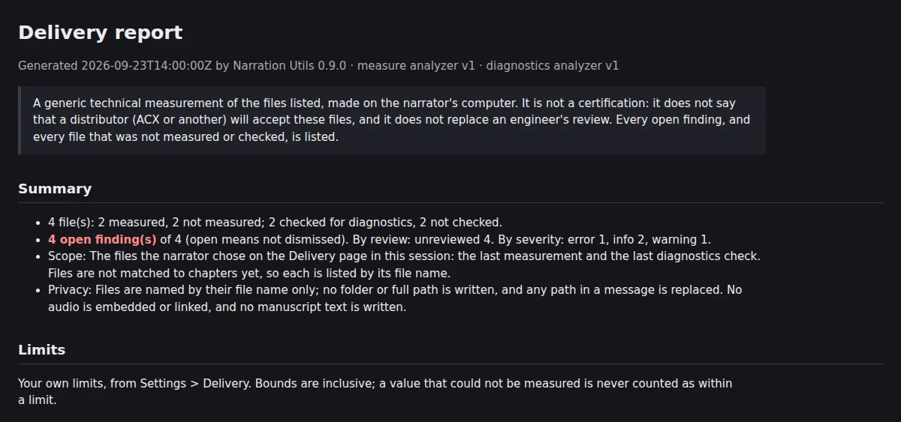

*Report header before* (`08a-report-header-before.webp`)

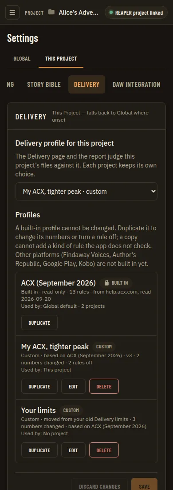

*Settings picker reflow 390* (`09-settings-picker-reflow-390.webp`)

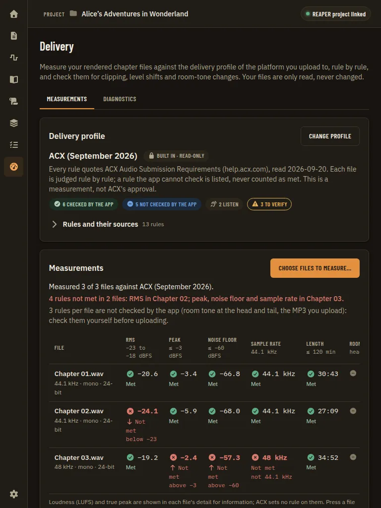

*Measured failing tablet 768* (`10-measured-failing-tablet-768.webp`)
