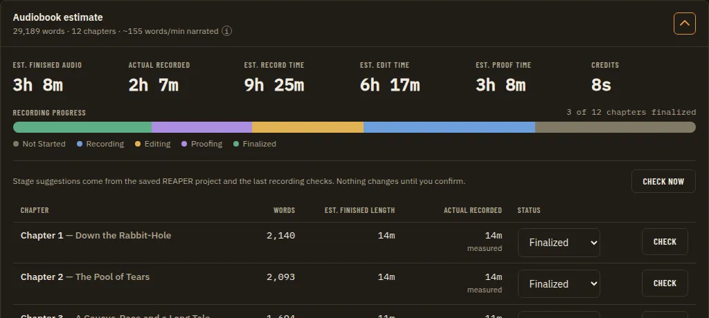
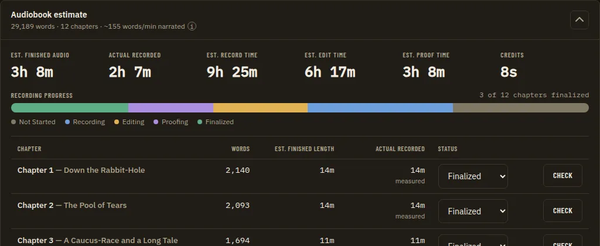
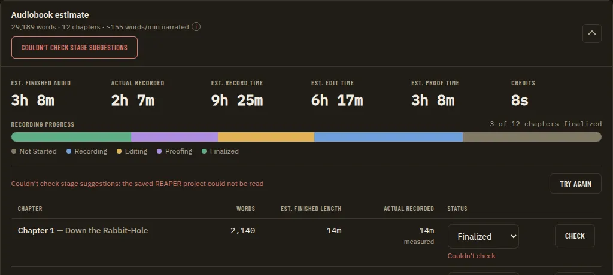

# Home Stage Check Line: Remove the Explainer and Rethink Check Now

**Source:** owner report of 2026-09-24 on the Home per-chapter breakdown (the table under the Not Started / Recording / Editing / Proofing / Finalized legend): "I don't really like this message. We should probably remove it. Especially since the 'Check now' button next to it doesn't seem to do anything." The message is "Stage suggestions come from the saved REAPER project and the last recording checks. Nothing changes until you confirm." Citations are `file:line` at `7a20a9e`. The line was added by Phase 5 of [Chapter Stage Recommendations](chapter-stage-recommendations.prd.md) (the Home surface, still `partial` there); this PRD amends that phase's "Check now" line and nothing else of it. Nothing here is built yet.

## Problem Statement

- Above the breakdown table sits a muted sentence explaining where stage suggestions come from, with a **Check now** button on the right. The owner finds the sentence unwanted: it is permanent chrome that explains a mechanism instead of showing a result, and it shows even when no chapter can have a suggestion.
- **Check now looks dead.** Pressing it gives no visible outcome in the common case. It is working as coded, but the code gives the narrator nothing to see, so to the narrator it is a broken button.

## Evidence

- **Where it is.** `StageCheckLine` (`apps/ui/src/components/stages/StageSummary.tsx:45-63`) renders the sentence (`:54-56`) or, on a failed read, the error in a `role="alert"` paragraph (`:49-52`), and always the Check now ghost button (`:58-60`) with `pending` while a read runs. It is mounted at the top of the collapsible breakdown in `AudiobookEstimatePanel.tsx:193` with `onCheckNow={() => void stages.refresh()}`, so it is only seen when the breakdown is open.
- **What the button calls.** `refresh` in `useStageRecommendations.ts:49-60` sets `phase: 'loading'`, calls `api.stageRecommendations()` and replaces the rows. That is the Wails binding `Host.StageRecommendations` (`apps/desktop/bindings_stages.go:45-56`), which only reads: it evaluates every narration chapter from stored evidence and never stores a verdict or starts an analysis (`:15-18`; D1, Q5 and Q12 of the parent PRD, `chapter-stage-recommendations.prd.md:96,103`). No REAPER bridge call and no Python sidecar are involved; the evidence is the saved `.rpp` and the stored recording check results.
- **Why it seems to do nothing (diagnosis, from reading the code; not run in the desktop app):**
  1. **The same read already runs on its own.** `useStageRecommendations` reads on mount and whenever `refreshKey` changes (`useStageRecommendations.ts:62-64`); the panel keys it on a manuscript import and on a recording check that completed (`AudiobookEstimatePanel.tsx:82-86`, `:92-96`), and a Confirm, Dismiss, Revert or refusal refreshes too (`useStageRecommendations.ts:78-86`). Evidence changes only when the saved REAPER project or a recording check result changes, so a press after any of those events returns exactly what is on screen.
  2. **Most chapters can never show anything.** Only a chapter in **Recording** is evaluated: `nextStage` maps Recording, Editing and Proofing (`apps/desktop/internal/stages/types.go:34-38`), but the one provider declares signals for Recording only (`apps/desktop/internal/coverage/provider.go:37-40`), so Editing and Proofing get `none` / `no_required_signals` and Not Started and Finalized get `none` / `stage_not_evaluated` (`apps/desktop/internal/stages/engine.go:85-94`). A `none` verdict renders nothing in the row (`stageText.ts:53-54`, `StageSuggestion.tsx:64-66`). A book whose chapters are mostly Not Started, as early in a project, has no row that a re-read could change.
  3. **The read is silent on success.** The loading state deliberately keeps the previous rows on screen (`useStageRecommendations.ts:12-13`, `:51`), rows say "Checking…" only before the first read answers (`StageSuggestion.tsx:33-36`), and nothing says the read finished: no toast, no "checked just now", no count of what changed. The only acknowledgement is the button's spinner (`Button.tsx:21-32`) for the length of the read, measured at about 0.35 s with one linked chapter and 1.1 to 1.5 s with fifteen on a real project (`chapter-stage-recommendations.prd.md:96`), and faster still with no track linked. That meets tier 2 of the interaction feedback standard (acknowledge, no double fire) but gives no completion signal (`docs/architecture/interaction-feedback.md`, "The standard"); the catalog row records only the mount read and "Check now is busy meanwhile" (`apps/ui/src/interactionFeedback.catalog.ts:102-103`).
  4. **It refreshes less than it appears to.** Check now re-reads the suggestions only. The chapter list itself (the Actual recorded column, the progress bar, the legend counts) is fetched separately, on `refreshKey` and `measuredRun` only (`AudiobookEstimatePanel.tsx:98-108`), so nothing else in the table moves either.
  5. **It never starts a check** (Q12, `useStageRecommendations.ts:29-31`, `docs/guides/using-the-app/home.md:104-105`), which a narrator reading "Check now" next to "the last recording checks" may well expect.
- **The only case where the button does something visible** is recovery: after a failed read, every row says "Couldn’t check" and Check now tries again (`StagePanel.test.tsx:121-139`), and the case where the narrator saved the project in REAPER while Home stayed open and a Recording chapter's verdict moves.
- **The copy is said elsewhere already.** "Nothing changes until you confirm" is the tail of the evidence view's verdict sentence (`stageText.ts:64`) and the guide says where suggestions come from (`home.md:65-72`). The evidence view has its own Check now with "Reads the evidence again; it starts no check." (`StageEvidence.tsx:116-121`), and a `provider_error` cause offers one (`stageText.ts:27`, `StageEvidence.tsx:189-194`); this PRD does not touch those.
- **What records it.** No ADR names the line or the button (grep of `docs/adr` for "Check now" finds nothing; ADRs 0160 and 0161 cover the engine and the decision store). The line is described in `docs/architecture/stage-recommendations.md:202,207-208`, `docs/guides/using-the-app/home.md:103-105`, the parent PRD (`chapter-stage-recommendations.prd.md:137,152,218,248,302`), the interaction feedback catalog (`interactionFeedback.catalog.ts:102-103`), and the `home/stage-error` state description ("the reason above the table with Check now", `apps/ui/tests/visual/state-catalog.ts:187-191`). The `home/stage-suggestions` state (`state-catalog.ts:172-178`) also feeds the guide screenshot `home-stage-suggestions` (`apps/ui/tests/visual/doc-screenshots.json:109-111`), which shows the line today. The aria snapshot names Check now only in the evidence slide-over (`apps/ui/tests/aria/dialogs.spec.ts:43`), which stays.

## Proposed Solution

Remove the explanatory sentence. Stop showing a standing Check now above the table: in the normal state the space above the table is empty (or the line goes entirely), because the suggestions are already read whenever their evidence can have changed inside the app. On a failed read, keep the error where it is today with a retry button beside it, so recovery is not lost. Close the one real gap the button covered (the project saved in REAPER while Home is open) in a way that needs no button, if the owner wants it (Q2). The evidence view's Check now, and the `provider_error` action, stay as they are.

## Key Hypothesis

We believe removing the sentence and the idle Check now, and keeping a retry only where a read failed, will make the breakdown quieter without losing anything the narrator relies on. We'll know we're right when the owner no longer sees a button that does nothing, the error state still recovers in one click, and no suggestion goes stale in a way the narrator notices (Q2).

## What We're NOT Building

- No change to the engine, the bindings, the evidence rules or any wire contract; `hostAPIVersion` is unchanged.
- No "Check now" that starts recording checks (Q12 of the parent PRD stands: reads never start analyses).
- No change to the evidence slide-over (`StageEvidence.tsx`), its Check now, its aria snapshot, or the summary chips (`StageSummaryChips`).
- No new suggestions for Not Started, Editing or Proofing chapters; those are phases 7 and 8 of the parent PRD.
- No background file watching of the `.rpp` (Q5 of the parent PRD); at most a re-read when the window regains focus (Q2).

## Success Metrics

| Metric | Target | How measured |
| --- | --- | --- |
| The sentence is gone | No "Stage suggestions come from…" text anywhere in `apps/ui/src` | grep; `home/stage-suggestions` PNGs |
| No idle button above the table | With a successful read, no Check now above the table | `StagePanel.test.tsx`; `home/stage-suggestions` PNGs at every viewport |
| Recovery kept | A failed read shows its reason and a retry that re-reads and fills the rows | `StagePanel.test.tsx` (the test at `:121-139`, renamed); `home/stage-error` PNGs |
| No stale verdict after saving in REAPER (only if Q2 is A) | Returning to the app after a save re-reads once | a unit test of the focus trigger; a scripted desktop run |
| Gate | `pnpm check` and the visual suite green, axe clean | `full-verification-gate` |

## Open Questions

- [ ] **Q1. What stays above the table in the normal state?** Options: (A) nothing: the line is removed and the table starts directly under the legend; (B) a short, useful status instead of the explainer, for example "Checked 2 minutes ago" or "1 chapter has a suggestion", with no button; (C) keep Check now alone, with no sentence, and give it a completion signal (an info toast "Stage suggestions are up to date" or "1 new suggestion"). Recommendation: A, because every re-read the narrator needs already happens by itself, B duplicates the summary chips on the collapsed card (`StageSummary.tsx:13-43`), and C keeps a control whose answer is almost always "nothing changed".
- [ ] **Q2. Re-read when the app regains focus?** The only change the automatic reads miss is the narrator saving the project in REAPER (or a recording check result changing outside this window) while Home stays open. Options: (A) re-read the suggestions, and the chapter list, when the window regains focus or the page becomes visible, throttled (say once per 30 s) and silent unless something changed; (B) no automatic re-read: the narrator leaves and returns to Home, or uses the evidence view's Check now; (C) keep the idle Check now (Q1 C) for this case. Recommendation: A, since a read costs 0.35 to 1.5 s measured and keeps the rows on screen while it runs; it amends the "on read only" list of the parent PRD's Q5, so the delivering PR records it (see Decisions Log). Needs the owner because it adds reads the narrator did not ask for.
- [ ] **Q3. The retry's label in the error state.** Options: (A) "Try again", matching what it does; (B) keep "Check now", matching the evidence view and the `provider_error` action text "Check now to read it again." (`stageText.ts:27`). Recommendation: A for the table's error line only; the evidence view keeps "Check now".
- [ ] **Q4. Is any of the sentence's meaning worth keeping?** "Nothing changes until you confirm" is the reassurance that suggestions never move a status on their own. Options: (A) drop it here; it stays in the evidence view's verdict sentence (`stageText.ts:64`) and the guide (`home.md:65-72`); (B) move it into the Why/evidence view header or a tooltip on the Status column header. Recommendation: A.

## Users & Context

The narrator on Home with the per-chapter breakdown open, usually between sessions in REAPER, reading where each chapter stands. Early in a book most chapters are Not Started, where no suggestion can appear, so the line and its button are the only stage-suggestion UI they see and neither does anything visible.

## Solution Detail

| Priority | Capability | Phase |
| --- | --- | --- |
| Must | Remove the explanatory sentence | 1 |
| Must | No idle Check now above the table (per Q1) | 1 |
| Must | A failed read still shows its reason and a one-click retry above the table | 1 |
| Should | Re-read suggestions and chapters on window focus, throttled (Q2 A) | 2 |
| Could | A quiet "checked" status (Q1 B) | 1 (only if chosen) |
| Won't | Check now starting recording checks; file watching | - |

**MVP scope:** Phase 1.

**User flow (Q1 A, Q2 A, Q3 A):** the narrator opens the breakdown; the table starts under the legend with no sentence and no button. They save the project in REAPER and switch back; the rows read again in the background and a Recording chapter now reads "Suggested: Editing". If a read fails, the line above the table reads "Couldn’t check stage suggestions: <reason>" with **Try again**, and every row says "Couldn’t check" as today.

## Technical Approach

- **Feasibility:** UI only. `StageCheckLine` (`StageSummary.tsx:45-63`) renders only in the error phase (or is folded into the panel), and `AudiobookEstimatePanel.tsx:193` passes the same `stages.refresh`. No Go, Python or Lua change; no Zod schema, golden or `wireContracts.test.ts` row changes.
- **Phase 2:** a small hook (for example `useRefreshOnFocus`, next to `useStageRecommendations`) listening to `visibilitychange` and `focus`, throttled, calling `stages.refresh()` and re-fetching `api.manuscriptChapters()`. A focus read must not stack on one in flight: `refresh` already drops stale answers by request number (`useStageRecommendations.ts:50-57`). It must not interrupt a pending Confirm, Dismiss or Revert (`busy`, `:98-99`); skip the read while busy. Record the interaction catalog row as a `focus`/timer-driven read with inline output.
- **Tests and states:** update `StagePanel.test.tsx` (the Check now retry test at `:121-139`; add "no Check now above the table after a successful read"); update the `home/stage-error` description (`state-catalog.ts:187-191`) and, if its button label changes, its driver (`app.drivers.ts:691-694` waits on the error text only, so it likely needs no change); re-capture `home/stage-suggestions`, `stage-dismissed` and `stage-error` at every viewport and regenerate the `home-stage-suggestions` guide screenshot. No primitive or `styles.css` change, so `design-spec-guard` and the atlas are not triggered; no dialog, slide-over or navigation change, so the aria snapshots are unaffected.
- **Risks:** (1) a narrator who relied on Check now after saving in REAPER loses it if Q2 is B; mitigated by Q2 A or by the evidence view's button. (2) Removing the line moves the table up and changes screenshots that other in-flight PRDs may also re-capture (see compatibility table). (3) Focus reads on a very large book cost up to about 1.5 s of host time; the throttle bounds it.

## Implementation Phases

| # | Phase | Description | Status | Parallel | Depends | PRP Plan |
| --- | --- | --- | --- | --- | --- | --- |
| 1 | Remove the explainer and the idle Check now | Drop the sentence; show the line above the table only on a failed read, with its reason and a retry (Q1, Q3, Q4); tests, interaction catalog row, state descriptions, guide and architecture doc, doc screenshot | pending | 2 | - | - |
| 2 | Re-read on focus | Throttled re-read of suggestions and chapters when the window regains focus (only if Q2 is A); tests, catalog row, docs | pending | 1 | Q2 | - |

### Phase Details

**Phase 1 - Remove the explainer and the idle Check now**
- **Scope:** `StageSummary.tsx` (`StageCheckLine` renders nothing unless `state.phase === 'error'`, then the alert and the retry); `AudiobookEstimatePanel.tsx:193` if the mount changes; `StagePanel.test.tsx`; `interactionFeedback.catalog.ts:102-103` (drop "and Check now" from the table read; keep it for the error retry); `state-catalog.ts` `stage-error` description; `docs/guides/using-the-app/home.md:103-105` ("and when you press Check now (above the table and in the evidence view)" becomes the evidence view only, plus the retry on a failure); `docs/architecture/stage-recommendations.md:202,207-208`; `doc-screenshots.json` output re-generated (`home-stage-suggestions`).
- **Success signal:** the metrics rows 1 to 3; the visual suite's `home/stage-*` states green at every viewport with the PNGs looked at.
- **Verification:** TDD in `StagePanel.test.tsx` first; `pnpm check`; `npx playwright test tests/visual/app.spec.ts -g "home.*stage"` and open every PNG under `apps/ui/screenshots/app/home/stage-*/`.

**Phase 2 - Re-read on focus (only if Q2 is A)**
- **Scope:** a focus/visibility hook with a throttle, wired in `AudiobookEstimatePanel.tsx`; unit tests with fake timers (focus twice inside the throttle reads once; no read while a decision is pending; a changed answer updates a row); a new catalog row; `home.md` and `stage-recommendations.md` list focus among the triggers; a scripted desktop run on a copy of a project (save in REAPER, switch back, the row changes), marked pending if it needs the owner.
- **Success signal:** metrics row 4.

### Parallelism Notes

The phases touch different lines of `AudiobookEstimatePanel.tsx` and can run in parallel, but Phase 2 is only worth planning once Q2 is answered. Neither changes a binding or a wire contract.

**Parallel-session compatibility**

| Phase | Files and areas touched | Collision risk |
| --- | --- | --- |
| 1 | `apps/ui/src/components/stages/StageSummary.tsx`, `StagePanel.test.tsx`, `apps/ui/src/components/home/AudiobookEstimatePanel.tsx` (one line), `apps/ui/src/interactionFeedback.catalog.ts`, `apps/ui/tests/visual/state-catalog.ts`, `docs/guides/using-the-app/home.md`, `docs/architecture/stage-recommendations.md`, the `home-stage-suggestions` doc screenshot | [Chapter Stage Recommendations](chapter-stage-recommendations.prd.md) phases 6 to 9 (the same `stages/` components, `home.md` and `stage-recommendations.md`); any PRD re-capturing Home screenshots or editing `AudiobookEstimatePanel.tsx` (the recording check, credits and estimate work) |
| 2 | `AudiobookEstimatePanel.tsx`, a new hook in `apps/ui/src/components/stages/` (or `apps/ui/src/hooks/`) and its test, `interactionFeedback.catalog.ts`, `home.md`, `stage-recommendations.md` | The same as phase 1, plus [Recording Check Model Cascade](recording-check-model-cascade.prd.md) if it changes when the panel re-reads chapters |

Cross-cutting: each phase follows `CLAUDE.md`: plan with an issue and `Closes #<n>`, `change-impact-scan` (the consumers of `StageSummary.tsx` and `useStageRecommendations`), TDD, `full-verification-gate` with the visual suite and PNG review at every viewport, `feature-cleanup`. `hostAPIVersion` unchanged.

## Decisions Log

| Decision | Choice | Alternatives | Rationale |
| --- | --- | --- | --- |
| Check now never starts an analysis (prior, parent PRD Q12) | Kept | Start missing recording checks | ADR 0015; reads stay cheap and read-only |
| Evaluate on read (prior, parent PRD Q5) | Kept; the read triggers may gain window focus (proposed, Q2) | Background file watching; a cache | No stored truth (D1); a focus read is cheap and needs no watcher |
| The table's line shows only on a failed read (proposed, Q1 A) | Error with retry, otherwise nothing | A "checked" status; Check now with a toast | Every other re-read is automatic; the summary chips already count suggestions |
| No ADR expected | The delivering PR notes the change in the parent PRD's Phase 5 and Decisions Log | A new ADR | No ADR records the line or the button; if Q2 A amends the Q5 trigger list, `adr-author` decides at merge whether that is a recorded decision |

## Research Summary

- Read: `StageSummary.tsx`, `useStageRecommendations.ts`, `StageSuggestion.tsx`, `StageEvidence.tsx`, `stageText.ts`, `AudiobookEstimatePanel.tsx`, `Button.tsx`, `stagesMock.ts`, `StagePanel.test.tsx`; `apps/desktop/bindings_stages.go`, `internal/stages/engine.go` and `types.go`, `internal/coverage/provider.go`; `state-catalog.ts`, `app.drivers.ts`, `doc-screenshots.json`, `tests/aria/dialogs.spec.ts`; `docs/guides/using-the-app/home.md`, `docs/architecture/stage-recommendations.md`, `docs/architecture/interaction-feedback.md`, `interactionFeedback.catalog.ts`; the parent PRD.
- Not done: the button was not pressed in the desktop app against a real project, so the diagnosis is from the code. What would confirm it: on the owner's project, the chapters' statuses (how many are in Recording) and whether any Recording chapter has a linked track and a recording check result; if none does, no read can change a row.

## Visual Spec

Mockups approved by the owner on 2026-09-24. They were rendered from the real app (dark theme, the app's own fonts and components) with throwaway edits and invented sample data, so names, numbers and body text are placeholders; the layout, controls, states and wording are the spec. Each shows the recommended answer to the open questions unless its caption says it is an alternative. Where a mockup and the text above disagree, raise it before building rather than silently following either.

*Before* (`00-before.webp`)

*After normal no line* (`01-after-normal-no-line.webp`)

*After error try again* (`02-after-error-try-again.webp`)

### Together with the related PRDs

The same screen with every PRD that changes it applied at once.

*Before* (`00-before.webp`)

*Home after* (`01-home-after.webp`)

*Home after summary open* (`02-home-after-summary-open.webp`)
