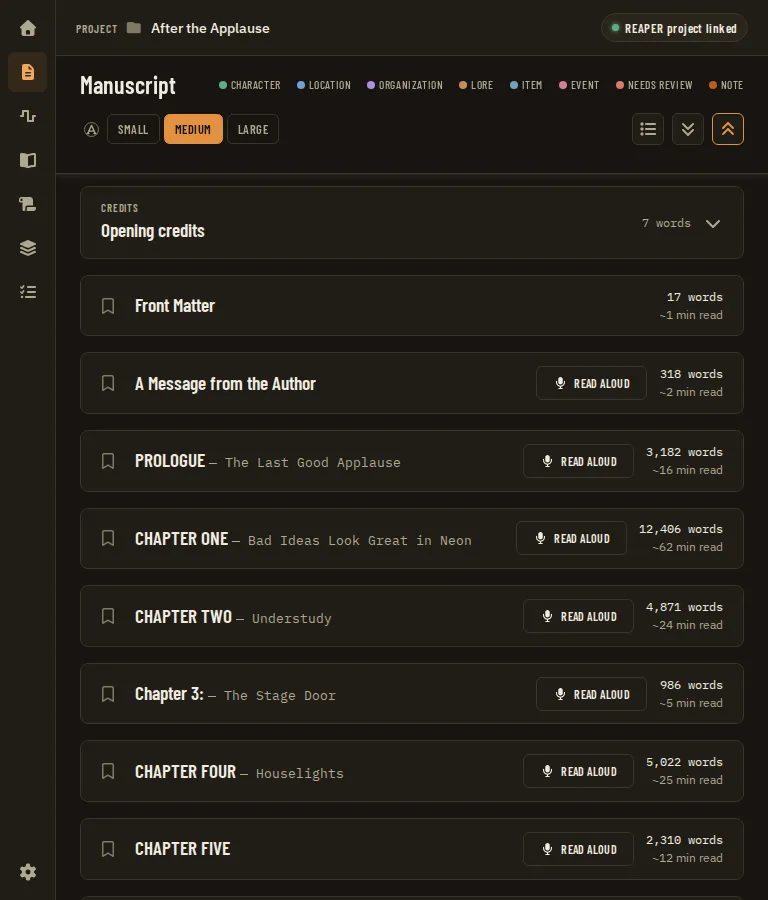
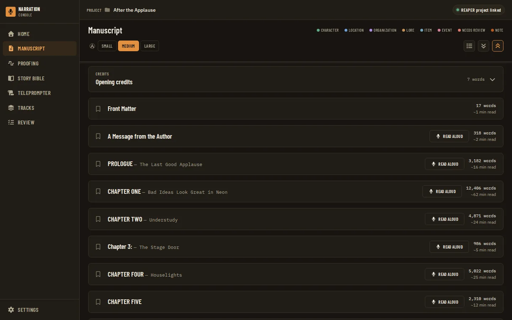
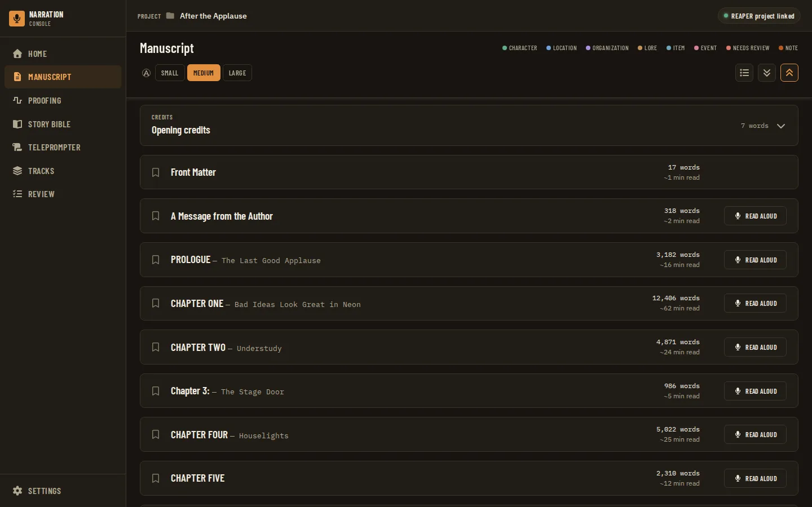
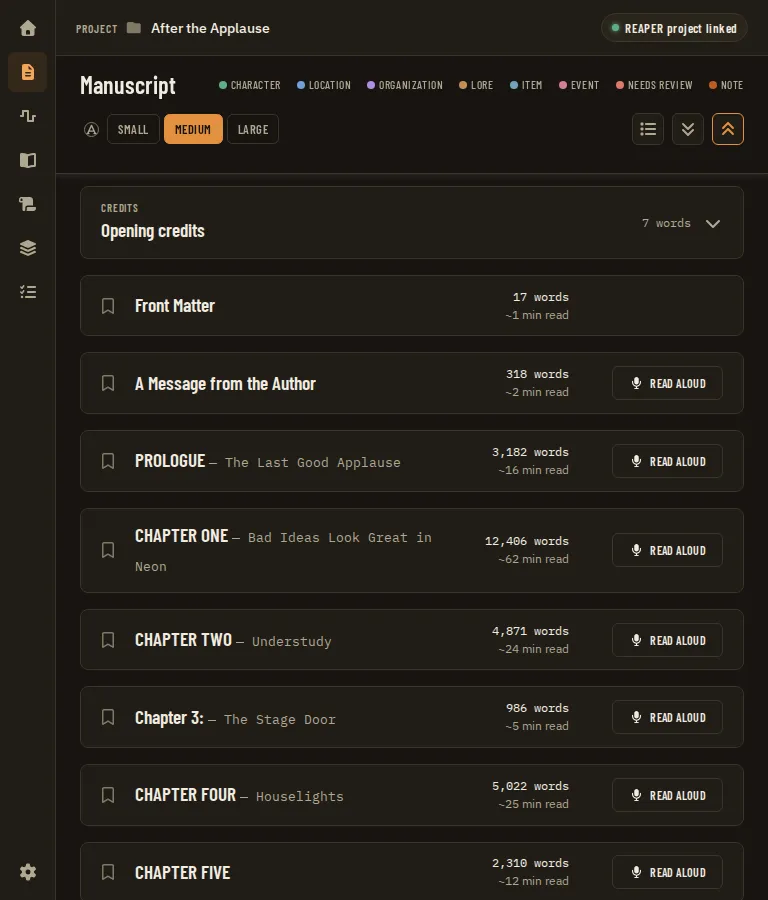
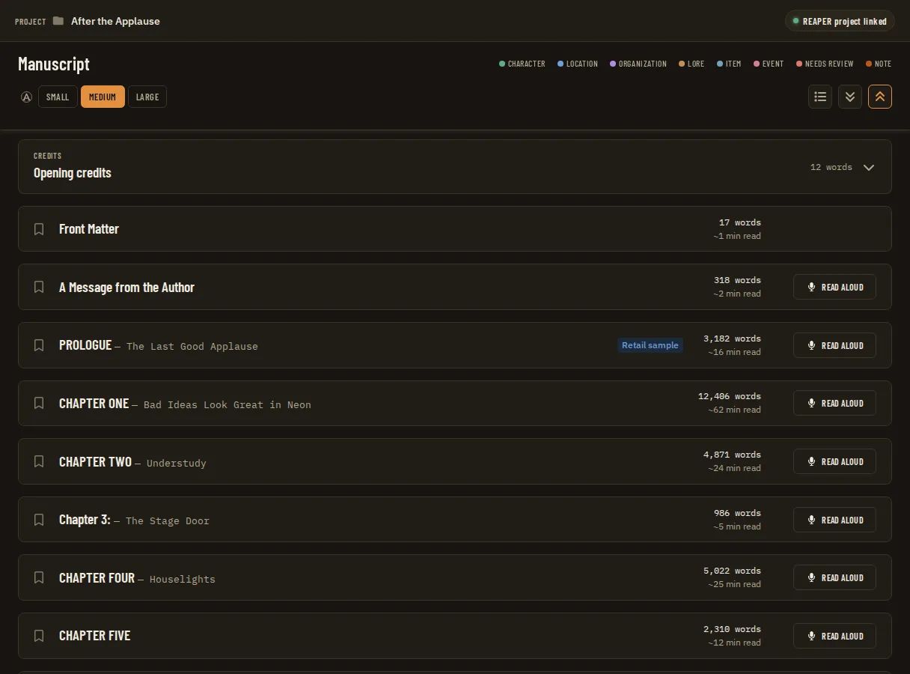

# Manuscript Chapter Header Alignment: Stats Before the Action, in Fixed Columns

**Source:** owner report of 2026-09-24 on the Manuscript page chapter cards: "We should swap the action button and the 'x words' and '~n min read' sections. That way the buttons are always in line and the text is too (right aligned with each other row)."

## Problem Statement

- Each chapter card header reads, left to right: bookmark icon, chapter title (for example "PROLOGUE — The Last Good Applause"), a **Read aloud** button, then a two-line stat block ("3,182 words" over "~16 min read").
- The stat block's width depends on the number ("318 words" is narrower than "3,182 words"), and it sits at the far right, so the Read aloud button to its left starts at a different x on every row. Down a list of chapters the buttons zigzag.
- A row with no Read aloud button (Front Matter, or any chapter that is not narration) has only the stat block, so it looks different from its neighbours and nothing in it lines up with the button column.
- The owner wants two columns: the stat text right-aligned in one, the action button in the other, pinned at the far right, so both line up from row to row.

## Evidence

- **Where it is.** The header is inline in `Manuscript.tsx`, inside `recordedChapters.map` (`apps/ui/src/components/manuscript/Manuscript.tsx:504-561`); there is no shared chapter-header component or primitive.
- **The grid.** The header is its own CSS grid per card: `grid-cols-[1.75rem_minmax(0,1fr)]` below `md` and `md:grid-cols-[1.4rem_minmax(0,1fr)_auto]` from `md` (48rem) up (`Manuscript.tsx:515`). Because every `<article>` has its own grid, the `auto` third column is sized per row from that row's content; nothing ties it to the rows above or below.
- **The right-hand cluster.** One flex row, `flex items-center gap-3 justify-self-end text-right`, and below `md` `max-md:col-start-2 max-md:justify-self-start` (`Manuscript.tsx:541`). DOM order inside it: the optional "Retail sample" tag (`:542-546`), the Read aloud button (`:547-553`), then the stat block (`:554-559`).
- **Why the buttons zigzag.** The cluster is pinned to the right edge (`justify-self-end`), so the stat block's right edge already lines up across rows at `md` and up; the button's position is that edge minus the stat block's own width minus the gap. A 3-digit count gives a narrower block and the button moves right.
- **Why rows without the button differ.** The button renders only when `isNarrationChapter(chapter)` (`Manuscript.tsx:547`, the predicate at `:45`: `contentKind` is `narration` or unset). A chapter with `contentKind: 'opening'` (a Word or EPUB file's front matter, the owner's "Front Matter") is still listed, since `isListableChapter` hides only `reference` (`apps/ui/src/state.ts:8`), so it gets a header with the stat block and no button, and no placeholder keeps the button's space.
- **The stat block.** "N words" is IBM Plex Mono `text-xs` (`Manuscript.tsx:555`), so its digits are fixed-width already; "~N min read" is the body font, IBM Plex Sans (`apps/ui/src/styles.css:144`), `text-xs`, muted (`:556-558`). The block's `text-right` is inherited from the cluster, so the two lines are right-aligned with each other inside the block. No `tabular-nums` is used anywhere under `apps/ui/src/components` (grep finds none).
- **Below `md`.** The cluster drops to a second grid row under the title and starts at the left (`max-md:justify-self-start`), so there the button is first and the stat block follows it; neither column lines up across rows there either. The capture matrix never reaches this layout: the narrowest viewport is `tablet` at 768 px (`apps/ui/tests/visual/viewports.ts:12-16`), which is exactly `md` and so gets the three-column layout, and the manuscript states do not opt into the 390 px `reflow` width (only Settings does, ADR 0061). The desktop shell's minimum window is 960 px, so below `md` is reachable by zoom only.
- **The credits cards are a different header.** `CreditsEntry` (`apps/ui/src/components/manuscript/CreditsEntry.tsx:36-58`) is a flex `justify-between` header with the title button on the left and, on the right, "N words" (mono, muted, `:52-55`) and a chevron (`:57`). It has no read time and no Read aloud; rendered before and after the chapter list (`Manuscript.tsx:497`, `:595`), its right edge today does not match the chapter rows' columns either.
- **The visual suite cannot show the bug today.** The mock manuscript is the twelve chapters of *Alice's Adventures in Wonderland* (`apps/ui/src/api/aliceManuscript.ts`), all narration, with word counts from 1,694 to 5,022 (all four digits; counted from `api/fixtures/alice-in-wonderland.txt` with the same split). Every mock row has a button and the same stat-block width, so no captured state shows the zigzag or a buttonless row. No unit test asserts the header's order or that an `opening` chapter has no button; the Read aloud tests find the button by name (`Manuscript.test.tsx:594-614`).
- **Nothing recorded the order.** No ADR mentions the chapter header layout or Read aloud placement (grep of `docs/adr` for "read aloud" finds only ADR 0150, about the credits script). The teleprompter PRD placed the button "on a chapter header" without an order (`docs/prds/teleprompter-manuscript-integration.prd.md:153`). `docs/design/design-system.md` ("Manuscript reader") records only that sticky chapter headers are opaque (`:105`). The guide says "Each narration chapter's header has a **Read aloud** button" (`docs/guides/using-the-app/manuscript.md:56`), which stays true.
- **A precedent for a reserved slot.** The Local assets rows keep "the one action slot" in place as its content changes, so focus and layout do not jump (`docs/design/design-system.md`, "Local assets").

## Proposed Solution

Reorder the header's right-hand cluster to **[Retail sample tag] [stat block] [action slot]** in the DOM, so the visual order and the reading order agree, and give the last two fixed widths:

- The **stat block** gets a minimum width that fits "99,999 words" and is right-aligned, so its right edge (and both of its lines) line up down the page.
- The **action slot** is a fixed-width box at the far right. It holds Read aloud on a narration chapter and stays empty on a chapter with no action (Front Matter), so that row's stat block still lines up with the others (Q1).
- The optional Retail sample tag stays to the left of the stat block, where its presence only narrows the title column.

The change is in `Manuscript.tsx` (and in `CreditsEntry.tsx` if the credits rows join the columns, Q3). No primitive and no `styles.css` change is needed.

## Key Hypothesis

We believe putting the stat block before the action and giving both fixed widths will make the chapter list scan as two clean columns. We'll know we're right when, on the owner's project, every Read aloud button has the same left edge and every stat block the same right edge at every captured viewport, including next to Front Matter.

## What We're NOT Building

- No change to what the header shows: the same title, bookmark, Retail sample tag, stats and Read aloud label, name (`Read <title> aloud`) and tooltip.
- No Read aloud for non-narration chapters (the teleprompter reads narration only, `Manuscript.tsx:43-45`), and no Read aloud on the credits cards: that is the sibling PRD [Manuscript Credits Card Parity](manuscript-credits-card-parity.prd.md).
- No change to the reading-time estimate (200 words a minute, `Manuscript.tsx:557`) or to the number format.
- No change to the Home chapter table, the Chapters & Search overlay or the teleprompter.
- No page-wide column grid shared by every card (`subgrid`); considered in Q2.

## Success Metrics

| Metric | Target | How measured |
| --- | --- | --- |
| Buttons line up | Every Read aloud in view has the same left x (within 1 px) at desktop, small-desktop and tablet | An assertion in the new visual state's driver, plus looking at the PNGs |
| Stats line up | Every stat block has the same right x, including Front Matter's | The same driver assertion; PNGs |
| Order | Stat block before the action slot in the DOM; the tab order is still bookmark, title, Read aloud | `Manuscript.test.tsx` |
| No regressions | Visual suite green (no sideways overflow, no collapsed control, axe clean), aria snapshots unchanged | `full-verification-gate` |

## Open Questions

- [ ] **Q1. What fills the action slot on a row with no action?** (A) An empty box of the button's width (recommended: the stats line up and nothing new is said). (B) Nothing: the stats slide to the right edge on those rows (the stats then do not line up with the rest). (C) A muted note such as "Not narrated" in the slot. Recommendation: A.
- [ ] **Q2. Fixed widths or one shared column grid?** (A) Fixed widths on the stat block (a `min-width` sized for "99,999 words") and on the action slot (sized to the Read aloud button), per card as today; simple, and a row with a longer number grows instead of overflowing. (B) Make `.reader-chapters` a grid and each card and header a `subgrid`, so the columns size to the widest row on the page without magic numbers; more moving parts, and the sticky header, the credits cards and the expanded body would all have to join it. Recommendation: A.
- [ ] **Q3. Do the Opening and Closing credits cards join the same columns?** Today they show "N words" and a chevron at the right (`CreditsEntry.tsx:51-58`). [Manuscript Credits Card Parity](manuscript-credits-card-parity.prd.md) gives them Read aloud, a word count and a read time and moves both kinds of card into one shared `ReaderCard` component (its Phase 1, MC7). Recommendation: yes; once `ReaderCard` exists, this PRD's column rule is applied there once and both kinds of card get it.
- [ ] **Q6. Where does the chevron go?** The parity PRD recommends a chevron on every card (its MC7 a) and its user flow lists the credits header as "Read aloud", "7 words", "~2 s read", then the chevron, which is today's action-before-stats order. If the chevron comes, the right side becomes **[Retail sample tag] [stat block] [action slot] [chevron]**, the chevron a fixed-width last column, so the action column still lines up. Options: (A) that order (recommended); (B) the chevron at the left of the title, beside the bookmark. Either way the two PRDs must agree one order; this PRD's order is the owner's explicit request.
- [ ] **Q4. Below `md` (zoom only), keep the cluster under the title on the left, or move it to the right?** With fixed widths the columns line up in either case, since every row's cluster starts at the same grid line. (A) Keep left (`max-md:justify-self-start`, today's behaviour, recommended). (B) Right-align it to match the wide layout.
- [ ] **Q5. `tabular-nums` on the read-time line?** "~9 min read" and "~13 min read" are in IBM Plex Sans; right-aligned, their digits line up only if the figures are tabular. Adding `tabular-nums` is harmless if they already are. Recommendation: add it (the word-count line is monospace already).

## Users & Context

The narrator on the Manuscript page, scanning the chapter list to pick the next chapter to read aloud or to check its length before a session. Books routinely mix short front matter and interludes (3-digit counts) with long chapters (4 or 5 digits), which is when the zigzag shows.

## Solution Detail

| Priority | Capability | Phase |
| --- | --- | --- |
| Must | Stat block before the action in DOM and visual order | 1 |
| Must | Stat block with a fixed minimum width, right-aligned | 1 |
| Must | Fixed-width action slot at the far right; empty on a row with no action (Q1) | 1 |
| Must | A visual state that shows mixed rows (a buttonless Front Matter, a 3-digit and a 5-digit count), with a driver assertion that the columns line up | 1 |
| Should | `tabular-nums` on the read-time line (Q5) | 1 |
| Should | The credits cards use the same stat block and action slot (Q3) | 1, or the credits parity PRD |
| Won't | A page-wide `subgrid` (Q2 B) | - |

**MVP scope:** Phase 1.

**User flow:** the narrator opens the Manuscript page; Front Matter (318 words) sits above Prologue (3,182 words) and Chapter 1 (12,406 words). The three stat blocks end at the same x, both Read aloud buttons start at the same x, and Front Matter's action slot is empty space of the same width. Tabbing through a header still goes bookmark, title, Read aloud.

## Technical Approach

- **Feasibility:** UI only, one component. In `Manuscript.tsx:541-560`, move the stat block `div` above the `isNarrationChapter` branch and wrap the branch in a fixed-width slot (for example a `div` with a width sized to the button and `flex justify-end`, rendered for every row). Give the stat block a `min-width` (in `ch` of the mono font or `rem`, measured in the implementation) and keep `text-right`. The empty slot is a plain `div` with no role or text, so axe and the accessibility tree see nothing new. No Go, Python or Lua change; no binding, Zod schema, golden or `wireContracts.test.ts` row; `hostAPIVersion` unchanged.
- **Shared markup:** the credits parity PRD's `ReaderCard` (a new component in `apps/ui/src/components/manuscript/`) renders both kinds of header; if it exists when this phase starts, the stat block and action slot are written there once (Q3). If it does not, keep them in `Manuscript.tsx` and the parity PRD carries them over. It is not a primitive, so `design-spec-guard` and the component atlas are not triggered; if it were placed in `primitives/` it would need a story, the atlas and `design-spec-guard`.
- **Focus and reading order:** the only focusable things in a header are the bookmark, the title button and Read aloud; the stat block is text. Reordering the DOM (not CSS `order`) keeps the tab order the same and makes a screen reader read the stats before the button, matching what is seen. The Read aloud accessible name is unchanged, so the `read-aloud-*` drivers, which open the dialog by name, keep working.
- **Mock and tests:** a new mock flag (next to the others in `apps/ui/src/main.tsx:43-65`), for example `?mockManuscript=mixed`, that adds a Front Matter chapter with `contentKind: 'opening'` and a 3-digit count before the Alice chapters (Chapter XII's 5,022 words and the rest give 4 digits; a 5-digit count can be made by raising one chapter's `wordCount`). Keep it behind a flag so the default mock, and every existing screenshot, does not gain a chapter. Unit tests in `Manuscript.test.tsx` (TDD first): the stat block precedes Read aloud within a header; an `opening` chapter renders the stat block and an empty action slot and no button.
- **Visual suite:** a new catalog row, for example `manuscript/chapter-header-columns` ("Manuscript, mixed chapter rows: a Front Matter row with no Read aloud and 3-, 4- and 5-digit word counts, the stats and the buttons in two aligned columns"), whose driver loads `?mockManuscript=mixed`, collapses all chapters, and asserts from bounding boxes that the Read aloud buttons share a left edge and the stat blocks a right edge. Re-capture and look at every viewport's PNG of the states that show chapter headers: `reader-text-small`, `reader-text-medium`, `reader-text-large`, `chapter-collapsed`, `chapter-bookmarked`, `sticky-header-scrolled`, `reader-dark`, `retail-sample` (the tag beside the stats), `credits-entries` (credits rows next to chapter rows), `go-to-line-highlight`, `formatted-text-and-line-breaks`, and `detail-sidebar-note` / `detail-sidebar-entity` (the slide-over narrows the reader, the tightest title column). Run with `npx playwright test tests/visual/app.spec.ts -g "manuscript"` from `apps/ui`.
- **Aria snapshots:** none covers a chapter card header (`apps/ui/tests/aria/snapshots/` holds the read-aloud resume dialog, the chapters slide-over and the navigation), so no snapshot is expected to change; `pnpm --dir apps/ui run aria` should stay green, and a change there would be a surprise to read, not to accept.
- **Docs:** add one bullet to "Manuscript reader" in `docs/design/design-system.md` (the header's right side is the stat block then a fixed action slot, empty when a chapter has no action); refresh the doc screenshots that show chapter headers through `apps/ui/tests/visual/doc-screenshots.json` (`manuscript-reader`, `manuscript-reader-large`, and the others whose PNGs show a header, such as `manuscript-reader-dark`, `manuscript-bookmark`, `manuscript-retail-sample`). The guide text stays true.
- **Risks:** (1) Fixed slots take width from the title at tablet and with the slide-over open; the title column is `minmax(0,1fr)` and wraps, and the suite's sideways-overflow gate catches a regression. (2) A count above 99,999 words widens only that row's stat block (min-width, not width): it no longer lines up but does not overflow. (3) The sibling PRD edits the same lines (see the compatibility table).

## Implementation Phases

| # | Phase | Description | Status | Parallel | Depends | PRP Plan |
| --- | --- | --- | --- | --- | --- | --- |
| 1 | Stats then action, in fixed columns | Reorder the chapter header cluster, fixed-width stat block and action slot (empty on rows with no action), `tabular-nums`, the mixed-rows mock flag and visual state with an alignment assertion, unit tests, design-system bullet, doc screenshots; the credits cards too if Q3 lands here | complete | - | Q1-Q6; after the `ReaderCard` move of the credits parity PRD if that lands first | - |

### Phase Details

**Phase 1 - Stats then action, in fixed columns**
- **Scope:** `apps/ui/src/components/manuscript/Manuscript.tsx:541-560` (or `ReaderCard.tsx` once the credits parity PRD has created it, which gives the credits cards the same columns); `Manuscript.test.tsx`; `apps/ui/src/main.tsx` and `apps/ui/src/api/mockApi.ts` (the mock flag); `apps/ui/tests/visual/state-catalog.ts` and `app.drivers.ts` (the new state); `docs/design/design-system.md`; the doc screenshots listed above.
- **Success signal:** the Success Metrics rows; the new state's driver assertion passes at desktop, small-desktop and tablet.
- **Verification:** TDD in `Manuscript.test.tsx` first; `pnpm check` (the full gate); the manuscript visual states above at every viewport, opening each PNG under `apps/ui/screenshots/app/manuscript/<state>/`; `pnpm --dir apps/ui run aria`. Not needed unless the change moves into `primitives/` or `styles.css`: `design-spec-guard` and `pnpm --dir apps/ui atlas`.

### Parallelism Notes

One phase. It collides with [Manuscript Credits Card Parity](manuscript-credits-card-parity.prd.md). Preferred sequence: that PRD's first commit (the no-visual-change move of the chapter card into `ReaderCard.tsx`) lands first, then this phase changes the columns inside `ReaderCard.tsx` so chapters and credits get them together. If this phase is ready first, it lands on `Manuscript.tsx` and the parity PRD carries the order and slot widths into `ReaderCard` (and must not reintroduce action-before-stats, as its current user flow describes).

**Parallel-session compatibility**

| Phase | Files and areas touched | Collision risk |
| --- | --- | --- |
| 1 | `Manuscript.tsx` (the chapter header, `:514-561`), `CreditsEntry.tsx` (if Q3), `Manuscript.test.tsx`, `CreditsEntry.test.tsx` (if Q3), `main.tsx`, `mockApi.ts`, `state-catalog.ts`, `app.drivers.ts`, `design-system.md`, manuscript doc screenshots | **High** with [Manuscript Credits Card Parity](manuscript-credits-card-parity.prd.md) (written concurrently): it makes the Opening and Closing credits cards behave like chapter cards (whole-header toggle, Read aloud to the teleprompter, word count and read time), moves the chapter header out of `Manuscript.tsx` into a new `ReaderCard.tsx`, adds a chevron to every card (MC7) and re-captures every `manuscript/*` PNG. Same lines, same screenshots: agree the order (Q6) and serialize the two PRs (see Parallelism Notes). Medium with [Teleprompter Manuscript Integration](teleprompter-manuscript-integration.prd.md) remaining phases if they touch the Read aloud button, and with [Audiobook Credits Templates](audiobook-credits-templates.prd.md) / [Credits in the Chapter Table](credits-in-chapter-table.prd.md) if they change the Retail sample tag or the credits entries. `state-catalog.ts` and `app.drivers.ts` are appended to by many PRDs (merge-time conflicts only). |

Cross-cutting: follows `CLAUDE.md`: an issue with `Closes #<n>`, `change-impact-scan` (the consumers of the header are only `Manuscript.tsx`, and of `CreditsEntry` only `Manuscript.tsx`), TDD, `full-verification-gate` with the visual suite and PNG review at every viewport, `feature-cleanup`. `hostAPIVersion` unchanged.

## Decisions Log

| Decision | Choice | Alternatives | Rationale |
| --- | --- | --- | --- |
| Order of the header's right side (proposed) | Retail sample tag, stat block, action slot | Keep action before stats | The owner's request; the variable-width item goes inside, the fixed-width action at the edge |
| Reorder in the DOM (proposed) | Move the elements | CSS `order` | DOM order equals visual order, so reading and tab order match what is seen |
| Alignment method (proposed, Q2 A) | Fixed widths per card | A page-wide `subgrid` | One file, no cross-card coupling, cannot overflow |
| No ADR expected | A bullet in `design-system.md` | A new ADR | No ADR recorded the old order; `adr-author` decides at merge if the reserved-slot rule reads as a recorded decision |
| Open questions (owner, 2026-09-24) | Every open question takes this PRD's recommended answer, as shown in its approved Visual Spec mockups, except where a row below says otherwise | Answer each question separately | The owner approved the mockups that depict the recommendations; see D39 in the [implementation plan](implementation-plan.md#6-owner-decisions-2026-09-24) |

## Research Summary

- Read: `Manuscript.tsx` (the header, `isNarrationChapter`), `CreditsEntry.tsx`, `Button.tsx`, `state.ts` (`isListableChapter`), `aliceManuscript.ts` and its fixture (word counts), `main.tsx` (mock flags), `mockApi.ts`, `Manuscript.test.tsx`, `tests/visual/viewports.ts`, `state-catalog.ts`, `app.drivers.ts`, `doc-screenshots.json`, `tests/aria/snapshots/`, `styles.css` (fonts), `docs/design/design-system.md`, `docs/guides/using-the-app/manuscript.md`, `teleprompter-manuscript-integration.prd.md`; grep of `docs/adr`.
- Not done: the owner's project was not opened and no screenshot was captured; the diagnosis is from the code (per-card `auto` column, variable-width stat block to the right of the button). The mock cannot reproduce it until the mixed-rows flag exists.

## Visual Spec

Mockups approved by the owner on 2026-09-24. They were rendered from the real app (dark theme, the app's own fonts and components) with throwaway edits and invented sample data, so names, numbers and body text are placeholders; the layout, controls, states and wording are the spec. Each shows the recommended answer to the open questions unless its caption says it is an alternative. Where a mockup and the text above disagree, raise it before building rather than silently following either.

*Before tablet* (`00-before-tablet.webp`)

*Before* (`00-before.webp`)

*After* (`01-after.webp`)

*After tablet* (`02-after-tablet.webp`)

*After with retail sample* (`03-after-with-retail-sample.webp`)

### Together with the related PRDs

The same screen with every PRD that changes it applied at once.

*Manuscript after* (`01-manuscript-after.webp`)
