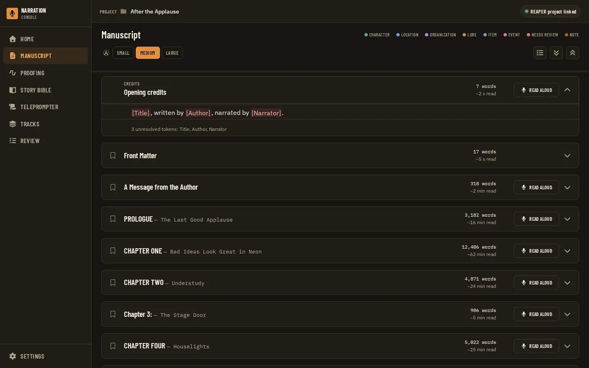
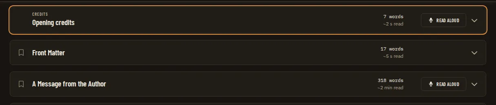
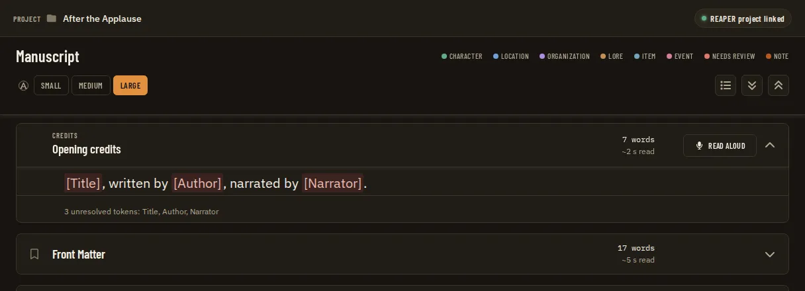
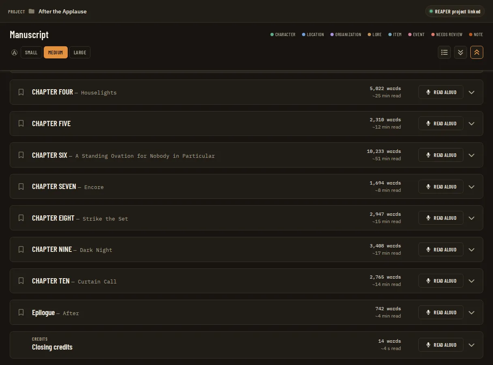
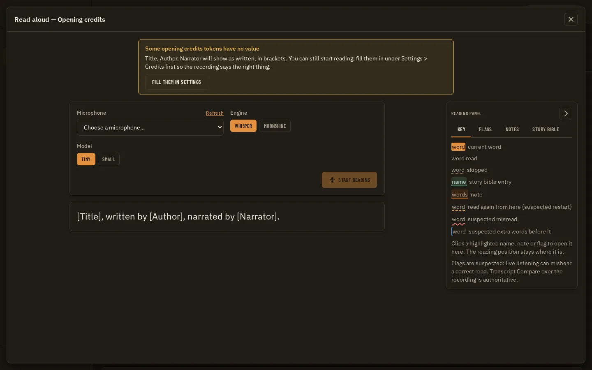

# Manuscript Credits Card Parity: Credits Open, Close and Read Aloud Like a Chapter

**Source:** owner report of 2026-09-24 on the Manuscript page. The page shows an "Opening credits" card (a small "CREDITS" eyebrow, the title "Opening credits", "7 words" and a chevron on the right, the rendered template text in the body) above the chapter cards ("Front Matter", "A Message from the Author", each with a bookmark icon, a READ ALOUD button, a word count and "~N min read"). The owner: "The opening credits can't be expanded or collapsed the same way as a normal chapter. You can only do it with the title. That shouldn't be the case. The opening credits panel is the same as any chapter in that I need it to work the same for consistency, and I need to be able to use the teleprompter for it because I have to read it." The same applies to Closing credits. Citations are `file:line` at `f234869`. Builds on [Audiobook Credits Templates](audiobook-credits-templates.prd.md) (Phase 3 built the credits entries, Phase 4 the teleprompter reading, ADR 0150) and sits beside [Credits in the Chapter Table](credits-in-chapter-table.prd.md) (credits rows on Home). Not covered here: asking for unresolved credit tokens when a project opens, and reading title and author from the front matter ([Credits Token Setup and Front Matter Detection](credits-token-setup-and-front-matter-detection.prd.md)).

**Status (2026-09-24):** draft; open questions MC1 to MC10 wait for the owner. No tracking issue yet: open one (`docs/operations/github-workflow.md`) before Phase 1.

## Problem Statement

On the Manuscript page the credits cards look like chapter cards but do not behave like them. Only the words "Credits / Opening credits" open and close a credits card. Pressing the empty part of its header, the word count or the chevron does nothing. The card has no Read aloud button, so the narrator has to leave the page, open the standalone Teleprompter page and find the credits in its picker to read them. Credits cards also ignore the page's text size, Expand all and Collapse all, and are always closed again on the next visit. The narrator records the credits like any chapter, so these differences are friction and look like a bug. The one path to the teleprompter for credits is also due to go away, because the standalone Teleprompter page is set to be retired.

## Evidence

- **Two headers written separately.** The chapter card is inline JSX in `Manuscript.tsx` (`apps/ui/src/components/manuscript/Manuscript.tsx:504-593`), not a component. The credits card is a separate component, `CreditsEntry` (`apps/ui/src/components/manuscript/CreditsEntry.tsx:17-92`). Phase 3 of the credits PRD wrote it as a "read-only pseudo-entry" (`CreditsEntry.tsx:8-16`). It copies the chapter card's frame (the same border, radius and margins, `:32` vs `Manuscript.tsx:510`) but none of its header behaviour. Because there was no chapter-card component to reuse, the two drifted apart.
- **What toggles, chapter card.** The header is a grid: `[bookmark] [title] [actions]` on desktop and two columns below `md` (`Manuscript.tsx:514-516`). The toggle is a native `<button className="text-left">` in the `minmax(0,1fr)` column (`:533-540`). Grid items stretch by default, so the button fills the whole middle column: any point between the bookmark and the right-hand cluster toggles the card. The bookmark (`:517-532`), Read aloud (`:547-553`) and the word count and read time (`:554-559`) are outside the button. The header's own padding and the word-count block do not toggle. The button has **no `aria-expanded`** and no `aria-controls` (`:533`), so a screen reader hears a plain button called by the chapter title, with no open or closed state.
- **What toggles, credits card.** The header is `flex justify-between` (`CreditsEntry.tsx:37`). The button wraps only the eyebrow and the title (`:39-50`) and is sized to that text, so it covers roughly the first 130 px. The word count and the chevron are in a separate `div` (`:51-58`), and the chevron is a decorative icon, not a control (`:57`). This is the owner's "you can only do it with the title". The button does have `aria-expanded` (`:39`), and its test presses it by name (`CreditsEntry.test.tsx:31-36`).
- **Header affordances missing on credits.** No bookmark slot. No Read aloud (chapters show it for narration chapters, `Manuscript.tsx:45`, `:547-553`). A word count but no read time (chapters show `~max(1, round(words/200)) min read`, `:555-557`; credits show only `preview.words`, `CreditsEntry.tsx:52-56`). The chapter header is sticky under the control band (`Manuscript.tsx:515`, `sticky top-[var(--band-h,4rem)]`); the credits header is not (`CreditsEntry.tsx:36-37`). Chapter cards have no chevron; credits cards do.
- **Body.** Chapter bodies are `ParagraphView` with the page's text size, line padding, row shading, source line numbers and marks (`Manuscript.tsx:562-590`, `READER_TEXT_CLASSES[textSize]` at `:575`). The credits body is one fixed `text-sm` paragraph (`CreditsEntry.tsx:61-64`), so the Text size control does not reach it. It keeps the unresolved-token chips and count (`:65-83`), which C6 requires.
- **Open state.** A chapter's open state is saved in the reader state (`toggleManualChapter`, `Manuscript.tsx:337-342`). Expand all and Collapse all act on `recordedChapters` only (`:478-490`), and the guide says chapters open fully by default (`docs/guides/using-the-app/manuscript.md:36-37`). Credits open state is local component state, closed by default and forgotten on every visit (`Manuscript.tsx:108`, `:496-503`, `:594-601`), and Expand all and Collapse all never reach it. Credits ids cannot simply go into `expandedChapters`. The load filters that list to manuscript chapters (`:191-194`), and every id in it triggers `manuscriptParagraphs(id)` (`:245-262`), which would fail for `credits-<kind>`.
- **The teleprompter can already read credits, but only from its own page.** ADR 0150 has the UI send only `credits: "opening" | "closing"` and lets the host render and pass the text to the sidecar as a `--script` file with spans (`docs/adr/0150-the-teleprompter-reads-credits-as-a-host-rendered-script-file-not-a-chapter.md`). The shared session hook already takes a `credits` source (`apps/ui/src/components/teleprompter/useTeleprompterSession.ts:93-100`, `:235-250`) and says "Done - the end of the credits" (`:85-88`). The standalone page lists the credits first and last in its picker (`TeleprompterPage.tsx:129-134`). It skips a credits preview with no words (`:44`) and shows the C6 warning with "Fill them in Settings" (`:54-77`, `:146-148`; App routes it to `/settings#credits`, `App.tsx:319-320`).
- **Why the card has no Read aloud.** The Manuscript page's Read aloud opens `ReadAloudDialog`, typed to one `ManuscriptChapter` (`Manuscript.tsx:88`, `:718-720`; `ReadAloudDialog.tsx:23-30`). The dialog keeps its flags as findings **per chapter id** (`useKeptFlags(chapter.id, ...)`, `ReadAloudDialog.tsx:71`, `:171-203`; ADR 0117). It shows a resume card that looks up the chapter's REAPER track (`:120-124`; `useResumeLocate(chapterId, ...)`, `useResumeLocate.ts:16`, `:36`; ADR 0112). ADR 0150 decided: "The read-aloud dialog (opened from a Manuscript chapter) is not given the credits here: its flags are kept as findings per chapter (ADR 0117), which credits are not", and "Offering the credits in the read-aloud dialog would need its flags kept somewhere other than a chapter's findings, and a new ADR." The gap was deliberate, and closing it needs that new ADR.
- **The only credits reading path is scheduled to go.** [Teleprompter Manuscript Integration](teleprompter-manuscript-integration.prd.md) Phase 13 retires the standalone page (`teleprompter-manuscript-integration.prd.md:210`). After that, credits could not be read at all unless the dialog can read them.
- **Disclosure patterns already recorded.** ADR 0052 added `Collapsible` (an icon-button trigger apart from its panel). `Disclosure` is the other shape: "the whole title row is the button ... `aside` sits beside the button, never inside it, because a control inside a button is not valid" (`apps/ui/src/components/primitives/Disclosure.tsx:39-45`). Neither is used by the Manuscript cards. App code may not import Base UI (ADR 0047), and raw `<button>`s outside the primitives are capped per file (`apps/ui/src/rawNatives.test.ts:27-29`: `CreditsEntry.tsx` 1, `Manuscript.tsx` 2).
- **ADRs on the reader.** ADR 0005 and ADR 0090 keep reference chapters out of navigation and the page-flip reader; `isListableChapter` enforces this (`Manuscript.tsx:113-116`). They say nothing about card headers. No ADR records either card's header or disclosure behaviour; the chapter card's shape comes from the delivered reader PRDs and the visual states `manuscript/chapter-collapsed`, `chapter-bookmarked` and `sticky-header-scrolled` (`apps/ui/tests/visual/state-catalog.ts:268-272`). ADR 0150 ("credits are never chapters") and ADR 0093 (first template of each kind) constrain this work.
- **Tests and states that pin today's behaviour.** `CreditsEntry.test.tsx:10-41`. `Manuscript.test.tsx:501-546` (placement, expand, not in Chapters & Search, absent without a template). The visual state `manuscript/credits-entries` (`state-catalog.ts:275-280`), whose driver presses the button named "Opening credits" (`apps/ui/tests/visual/app.drivers.ts:994-1004`). The aria snapshot `dialog-read-aloud-resume.aria.yml` (`apps/ui/tests/aria/dialogs.spec.ts:23-25`). The Manuscript guide's credits paragraph (`docs/guides/using-the-app/manuscript.md:39-46`).

## Proposed Solution

Chapters and credits share one Manuscript card component. The whole header opens and closes the card, as a real disclosure that announces its state and works from the keyboard, with a chevron on every card. The credits header gets what a chapter header has: Read aloud, a word count and a read time. It also gets a sticky header, follows the Text size setting and responds to Expand all and Collapse all. Read aloud on a credits card opens the same full-screen read-aloud dialog a chapter opens, pointed at the credits. The dialog reads through the path ADR 0150 already built (the host renders the text, and a `--script` file with spans goes to the sidecar). It shows the C6 warning for unresolved tokens, has no resume card and does not keep the credits' flags as findings. The data does not change: credits are still not chapters. They have no id in `manuscript.json` and no row in ChapterNav or search, their open state is not stored in `expandedChapters`, and there are no chapter bookmarks or chapter findings for them.

## Key Hypothesis

We believe that giving the credits the same card as a chapter (whole-header toggle, Read aloud, word count and read time) will let the narrator read and record the credits without leaving the Manuscript page, and without noticing that the credits are a different kind of thing. We'll know we're right when the owner can open Opening credits by clicking anywhere on its header, press Read aloud, read the credits with the highlight following and close the dialog, with no stop at the Teleprompter page.

## What We're NOT Building

- Credits as manuscript chapters: no `contentKind`, no `manuscript.json` entry, no ChapterNav or search row, no `readerBookmarkCreate({ kind: 'chapter' })` for a credits id (ADR 0004, ADR 0150).
- Editing credits text on the Manuscript page. Templates and values stay in Settings > Credits.
- Choosing a template per project (ADR 0093's follow-up). The card and the dialog show the first opening and first closing template, as today.
- A resume card for credits (it needs a REAPER track for the credits; see MC9 and the credits track links in Phase 3 of [Credits in the Chapter Table](credits-in-chapter-table.prd.md)).
- Keeping read-aloud flags on the credits as findings (MC8). A store for them would be a new findings anchor and belongs with a recording check for credits.
- Prompting for unresolved tokens or reading them from the front matter ([Credits Token Setup and Front Matter Detection](credits-token-setup-and-front-matter-detection.prd.md)).
- Retiring the standalone Teleprompter page (Teleprompter Manuscript Integration Phase 13). This PRD only makes sure that retiring it does not strand the credits.
- A new primitive, unless MC10 chooses one.

## Success Metrics

| Metric | Target | How Measured |
| --- | --- | --- |
| Whole-header toggle | A press anywhere on a chapter or credits header outside its bookmark and Read aloud buttons toggles the card; Enter and Space on the focused toggle do the same | Vitest (press on the word count, the chevron and the header padding for both kinds); a Playwright driver presses the header's word count |
| Disclosure semantics | Every card's toggle reports `aria-expanded` and `aria-controls` names the body, for chapters and credits alike | Vitest by role; axe clean in the visual suite |
| Header parity | A credits header shows the same slots as a narration chapter header: Read aloud, words and a read time (per MC6), a chevron, sticky under the band | Vitest; visual states at desktop, small-desktop and tablet |
| Body parity | Credits text follows Text size; unresolved chips and count unchanged (C6) | Vitest; `manuscript/credits-entries` at each text size |
| Expand and Collapse all | Both include the credits cards (per MC5) and never send a credits id to `readerStateSave` or `manuscriptParagraphs` | Vitest spies on the API |
| Read aloud on credits | Pressing it opens the read-aloud dialog titled "Read aloud — Opening credits", starts with `teleprompterStart({ credits: 'opening' })`, never calls `teleprompterSaveFlags` or `teleprompterLocate` | Vitest on `ReadAloudDialog` and `Manuscript`; mock session in the visual suite |
| No leakage | `manuscriptChapters`, ChapterNav, search, bookmarks and `expandedChapters` never see a credits id | Existing tests (`Manuscript.test.tsx:532-540`) kept; new API-spy cases |
| Contracts | No payload changes, so no Zod schema, golden, `hostAPIVersion` bump or `wireContracts.test.ts` row | `pnpm check` |
| UI gates | Visual suite green with no new `axe-debt.ts`, `sameAs` or `narrowControls` entries; aria snapshot for the credits dialog added and read | `app.spec.ts`, `pnpm --dir apps/ui run aria` |

## Open Questions

- [ ] **MC1. Bookmarks on credits.** Chapter bookmarks are reader-state entries of kind `chapter` keyed by a manuscript chapter id and listed in ChapterNav (`Manuscript.tsx:343-357`, `ChapterNav.tsx:73`). Options: (a) no bookmark on credits, with the bookmark column left empty so titles line up; (b) a credits bookmark kind that ChapterNav lists above and below the chapters. Recommendation: (a). A bookmark finds a place in a long chapter, and the credits are a few lines at the ends of the page; (b) would put credits into ChapterNav, which ADR 0150 and the credits PRD keep out.
- [ ] **MC2. Read aloud while tokens are unresolved.** Options: (a) Read aloud stays enabled, and the dialog shows the C6 warning naming the tokens with "Fill them in Settings", as the Teleprompter page does; (b) disabled with the reason; (c) enabled with no warning. Recommendation: (a). It is the owner's C6 decision ("warn, Start is still allowed") and keeps the same answer on both surfaces. "Fill them in Settings" while a session is listening asks "Stop reading?" first, like closing does. The concurrent token-setup PRD may make this rare, but it does not remove the need.
- [ ] **MC3. Line numbering in the credits body.** Chapter bodies show manuscript source line numbers, which "Go to line" and search use. Credits have none. Options: (a) plain lines as now, but with the reader's text size and row shading, one row per line as the teleprompter splits them (`creditsParagraphs`, `readerModel.ts:95-98`); (b) numbered 1..n like a chapter; (c) keep the current single paragraph. Recommendation: (a). The rows match what the teleprompter shows, and numbers would suggest the lines are manuscript lines that "Go to line" can reach.
- [ ] **MC4. Where Closing credits sits.** Today it comes after the last listable chapter (`Manuscript.tsx:594-601`), so after any narrated back matter and above nothing (reference chapters are hidden, ADR 0090). Recommendation: keep it last, and keep Opening credits first, before Front Matter, matching the Teleprompter picker and the Home rows of the chapter-table PRD.
- [ ] **MC5. Open state of credits cards.** Chapters open by default and are remembered per project. Credits are closed by default and forgotten. Options: (a) Expand all and Collapse all include the credits, and a credits card opens by default like a chapter, but its state is not remembered; (b) as (a), and remembered in browser storage per project (a per-viewer convenience, wrapped in try/catch); (c) as (a), and remembered in the host reader state under a new `expandedCredits` field (a Go change and a contract). Recommendation: (b). It gives consistency without a host change, and it never puts a credits id into `expandedChapters`.
- [ ] **MC6. Read time for short text.** The chapter formula, `~max(1, round(words/200)) min read` (`Manuscript.tsx:557`), shows "~1 min read" for 7 words. Options: (a) the same formula on credits, for consistency; (b) credits show seconds under a minute ("~3 s read", like the Credits stat's `fmtCreditsSeconds`), chapters unchanged; (c) one helper for both that shows seconds under a minute, which would also change very short chapters. Recommendation: (c). One rule on every card, and a narrator reading a 40-word dedication gets an honest number. The numbers stay reading time at 200 words a minute, not finished-audio time (no room tone), so they will not match the Home Credits stat exactly.
- [ ] **MC7. The chevron.** Credits cards have one and chapter cards do not. Options: (a) a chevron on every card, turning with the state; (b) none anywhere. Recommendation: (a). It shows that the header opens and closes, which is the point of the report. It changes every Manuscript screenshot once.
- [ ] **MC8. Read-aloud flags on credits.** The dialog marks skipped words and restarts as the narrator reads, and keeps them as chapter findings (ADR 0117). Options: (a) show the flags during the session but do not keep them, with the Flags tab saying "Flags on the credits are not kept"; (b) hide flags for credits; (c) keep them under a credits anchor. Recommendation: (a). The narrator still sees a skipped word as they read it, and (c) waits for a credits recording check.
- [ ] **MC9. The resume card for credits.** Options: (a) not shown for credits; (b) shown once credits have a linked track (chapter-table PRD Phase 3). Recommendation: (a) now, and revisit with (b) when that phase lands.
- [ ] **MC10. Where the shared card lives.** Options: (a) a Manuscript-local `ReaderCard` component in `apps/ui/src/components/manuscript/`, holding the one header toggle; (b) a new header variant of the `Disclosure` primitive. Recommendation: (a). It is used only here, and it avoids a primitive change, `design-spec-guard` and a Storybook entry. Revisit (b) if a second page needs a sticky card header.

## Users & Context

**Primary User**: an independent narrator recording an audiobook, reading from the Manuscript page with REAPER open, Windows first.
**Current behavior**: opens chapters by clicking anywhere across the header and reads them with Read aloud. For the credits, they have to aim at the title text to open the card, then go to the Teleprompter page and pick "Opening credits" there.
**Trigger**: recording the opening or closing credits, usually first and last in a session.
**Success state**: the credits card works exactly like a chapter card, and Read aloud on it opens the same reading dialog.
**Job to Be Done**: When I record a book, I want the credits to read like every other section, so I do not have to remember a different way for two small files.
**Non-Users**: narrators whose producer records or adds the credits (they can ignore the cards, or delete the templates and the cards disappear, as today).

## Solution Detail

| Priority | Capability | Phase |
| --- | --- | --- |
| Must | One Manuscript card component for chapters and credits; the whole header toggles, with `aria-expanded` and `aria-controls` on both kinds | 1 |
| Must | Credits header: word count, read time (MC6), chevron (MC7), sticky; no bookmark (MC1) | 1 |
| Must | Credits body follows Text size, one row per line (MC3), C6 chips and count kept | 1 |
| Must | Expand all and Collapse all include credits, and credits open by default (MC5) | 1 |
| Must | Read aloud on a credits card opens `ReadAloudDialog` on the credits, C6 warning in the dialog (MC2), no resume card (MC9), flags not kept (MC8) | 2 |
| Must | An ADR that supersedes the read-aloud clause of ADR 0150 | 2 |
| Should | Credits open state remembered per project in browser storage (MC5 b) | 1 |
| Should | The shared unresolved-credits warning used by both the dialog and the standalone page until Phase 13 retires the page | 2 |
| Could | Deep link `/manuscript#credits-<kind>` that opens and scrolls to the card (CT7 of the chapter-table PRD) | 3 |
| Won't | Credits as chapters, credits bookmarks in ChapterNav, kept credits flags, credits resume card | - |

**User flow**: Manuscript. The first card reads "CREDITS · Opening credits" with a chevron, then "7 words" and "~2 s read" (MC6), then "Read aloud" in the action column (stats before the action, per [Manuscript Chapter Header Alignment](manuscript-chapter-header-alignment.prd.md)). The narrator clicks the empty middle of the header and the card opens. They press Read aloud and a full-screen dialog "Read aloud — Opening credits" opens, with a warning that "Narrator" has no value and a "Fill them in Settings" button. The narrator presses Start reading and reads while the highlight follows. At the end the status says "Done - the end of the credits; stopping in a few seconds unless you read on". They close the dialog and scroll on to the first chapter. Collapse all closes the credits cards too.

## Technical Approach

**Feasibility**: HIGH. No host, sidecar or contract change. The session hook, host rendering and sidecar spans for credits already exist (ADR 0150). The work is one UI refactor and one change to the dialog's props.

**Architecture notes**

- **The shared card (Phase 1).** Move the chapter card's `<article>`/header/body frame out of `Manuscript.tsx:508-591` into a Manuscript-local `ReaderCard` (MC10 a) with slots: `leading` (bookmark or empty), `eyebrow` ("Credits", `aria-hidden` as today, `CreditsEntry.tsx:40-48`), `title`, `subtitle`, `badges` (Retail sample), `actions` (Read aloud), `words`, `readTime`, `expanded`, `onToggle`, `bodyId`, and `children` (the body). Both chapters and `CreditsEntry` render through it; `CreditsEntry` keeps its credits-only parts (preview parts, chips, the unresolved line) as the body. Data attributes stay as they are: `data-chapter-id` only on chapters (`showChapter` scrolls by it, `Manuscript.tsx:277`), and `data-credits-entry` only on credits.
- **Whole-header toggle without nesting controls.** A control inside a button is not valid HTML (the rule `Disclosure.tsx:44-45` records). The header keeps one native toggle `button` (the title, `aria-expanded`, `aria-controls={bodyId}`), and its `::after` pseudo-element is stretched over the whole header (`absolute inset-0`). The bookmark and Read aloud sit above it (`relative z-[1]`), so they keep their own presses and focus. The chevron and the word count are inside the stretched area and toggle the card. The card keeps one tab stop for the toggle, the accessible name stays the title ("Opening credits", so exact-name lookups and the `credits-entries` driver keep working), and the focus ring is drawn on the header with `:has(:focus-visible)`. The raw-button ceilings in `rawNatives.test.ts` move with the code: `CreditsEntry.tsx` 1 becomes 0, and `ReaderCard.tsx` gets 1 (the toggle), with a comment giving the reason. `Manuscript.tsx` keeps its bookmark button (2 becomes 1). This also gives chapter cards the `aria-expanded` they lack today.
- **Expand all, Collapse all and open state (Phase 1).** Credits open state stays apart from `readerState` (see Evidence: the load filter and the paragraph fetch). Expand all and Collapse all set it together with `expandedChapters`. Under MC5 (b) it is read from and written to `localStorage` under a key per project, each call wrapped in try/catch, with "open" as the default when nothing is stored.
- **Read time (Phase 1).** One `readTimeLabel(words)` helper beside `chapterLineNumbers` in `state.ts`, used by both kinds (MC6), with unit tests at 0, 7, 99, 100 and 201 words.
- **Read aloud for credits (Phase 2).** `ReadAloudDialog` takes a `source: { kind: 'chapter'; chapter } | { kind: 'credits'; credits: CreditsKind; preview: CreditsRenderResult }` in place of `chapter`. In credits mode it calls `useTeleprompterSession({ chapterId: '', chapter: undefined, credits: { kind, text: preview.text }, migrateLegacyDevice: false })`, the same call the Teleprompter page makes (`TeleprompterPage.tsx:118-122`). It titles itself `Read aloud — ${CREDITS_LABEL[kind]}`, shows no `ResumeCard`, passes no story or note marks, and does not call `useKeptFlags`. The Flags tab shows the session's flags with the "not kept" line (MC8 a). `UnresolvedCreditsWarning` moves out of `TeleprompterPage.tsx:54-77` into its own file, used by both the page and the dialog; the dialog's "Fill them in Settings" goes through `useNavigate('/settings#credits')` after the same "Stop reading?" confirm as closing. `Manuscript.tsx` holds `readAloud: source | undefined` in place of `readAloudChapter` (`:88`), and the credits card shows Read aloud only when `preview.words > 0`, as the picker does (`TeleprompterPage.tsx:44`). The dialog's notes memo (`Manuscript.tsx:127-131`) applies to chapters only.
- **ADR (Phase 2).** A new ADR (next free number at merge, after 0170): "The read-aloud dialog reads the credits too, and keeps no findings for them". It supersedes the clause of ADR 0150 that keeps the credits out of the dialog, and keeps the rest of ADR 0150 (host rendering, script file, spans, C6). It records MC8 and MC9. Phase 1 needs an ADR only if the owner wants the whole-header card recorded as a rule ("a Manuscript card's whole header is its disclosure button"); `adr-author` decides with the owner.
- **Verification.** Per `CLAUDE.md`: `pnpm check`. The visual suite for `manuscript/*`, with `credits-entries` redriven by a header press away from the title, and new rows `manuscript/credits-collapsed-all`, `manuscript/credits-text-large` and `manuscript/read-aloud-credits` (plus `read-aloud-credits-unresolved`) in `state-catalog.ts` with drivers in `app.drivers.ts`. Every chapter-header state changes if MC7 (a), so read the PNGs at desktop, small-desktop and tablet. axe stays clean with no new `axe-debt.ts` entry. The read-aloud dialog is a dialog, so `pnpm --dir apps/ui run aria` gets a new snapshot, `dialog-read-aloud-credits.aria.yml` (no resume region, the warning as a status); read its diff. `doc-screenshot-sync` for `docs/images/ui/manuscript-*`. The Manuscript guide's credits and Read aloud paragraphs (`manuscript.md:39-46`, `:56-59`) and the Teleprompter guide are updated. `design-spec-guard` and the atlas apply only if MC10 (b) is chosen. The threat model is unaffected (no new file, argument or bridge path: the credits `--script` file already exists, ADR 0150).

**Technical Risks**

| Risk | Likelihood | Mitigation |
| --- | --- | --- |
| The stretched toggle swallows presses meant for the bookmark or Read aloud | Medium | Those controls sit above the overlay; Vitest and a Playwright press on each; axe for target size |
| Changing the header regresses the sticky header, the Retail sample tag or the mobile two-row layout | Medium | Move the markup unchanged first (a refactor commit with identical screenshots), then change behaviour |
| A credits id reaches `expandedChapters`, `manuscriptParagraphs`, bookmarks or `teleprompterSaveFlags` | Medium | Separate state; API-spy tests for each |
| Every Manuscript screenshot changes at once (chevron, header focus ring) | High if MC7 (a) | One reviewed pass over every `manuscript/*` PNG; `doc-screenshot-sync` |
| Phase 13 of the teleprompter PRD removes the page before Phase 2 lands, leaving credits unreadable | Low | Phase 2 before Teleprompter Manuscript Integration Phase 13; noted in both compatibility tables |
| The dialog's credits mode forks a lot of chapter-only code | Low | A `source` union with chapter-only parts behind one check; tests for both kinds |

## Implementation Phases

| # | Phase | Description | Status | Parallel | Depends | PRP Plan |
| --- | --- | --- | --- | --- | --- | --- |
| 1 | One Manuscript card | `ReaderCard` for chapters and credits; whole-header toggle with `aria-expanded`/`aria-controls`; credits read time, chevron, sticky header, text size, rows; Expand and Collapse all; remembered open state; visual states; guide | complete | - | MC1, MC3 to MC7, MC10 | - |
| 2 | Read aloud on credits | `ReadAloudDialog` source union, credits mode (no resume card, flags not kept), shared unresolved warning, Read aloud on the credits card, ADR, visual and aria states, guides | pending | - | 1; MC2, MC8, MC9 | - |
| 3 | Deep link to a credits card | `/manuscript#credits-<kind>` opens and scrolls to the card, for the chapter-table PRD's CT7 link | pending — UI only (the hash handler in `Manuscript.tsx`); the lane-B pass of 2026-09-25 (stream B2) found no host, audio or sidecar slice: the card, its id and the credits text already exist, so the whole phase stays with lane C | 2 | 1; CT7 answered | - |

**Phase 1.** Goal: the owner's first complaint. Start with a refactor commit that moves the chapter card into `ReaderCard` with no visual change (every `manuscript/*` PNG identical), then change behaviour. Success: Vitest covers a press on the header padding, word count and chevron for both kinds; Enter and Space; `aria-expanded` and `aria-controls`; bookmark and Read aloud presses that do not toggle; credits in Expand and Collapse all; no credits id in `readerStateSave` or `manuscriptParagraphs`; read-time cases. The visual suite and axe are green and every viewport's PNG has been read; the guide is updated.

**Phase 2.** Goal: the owner's second complaint. Success: Read aloud on each credits card opens the dialog, starts with `{ credits: kind }`, shows the warning with unresolved tokens, never calls `teleprompterLocate` or `teleprompterSaveFlags`, and asks "Stop reading?" when closed while listening. The chapter dialog tests are unchanged. A new aria snapshot has been read, the visual states are reviewed, the ADR is written, and the guides are updated. A live microphone read of the credits from the dialog on the owner's machine stays **pending** (the same manual check as credits PRD Phase 4).

**Phase 3.** Goal: one link target for Home. Success: a hash link opens and scrolls to the card, and `#c<id>` behaviour is unchanged. Small; it may fold into Phase 2 of the chapter-table PRD instead.

**Parallelism Notes**: Phases 1 and 2 run one after the other (Phase 2 puts the Read aloud button in the card from Phase 1). Phase 3 can run beside Phase 2.

**Parallel-session compatibility**

| Phase | Files and areas touched | Collision risk |
| --- | --- | --- |
| 1 | `apps/ui/src/components/manuscript/{Manuscript.tsx,CreditsEntry.tsx,ReaderCard.tsx}` and their tests, `apps/ui/src/state.ts` (read time), `apps/ui/src/rawNatives.test.ts`, `apps/ui/tests/visual/{state-catalog.ts,app.drivers.ts}`, `docs/images/ui/manuscript-*`, `docs/guides/using-the-app/manuscript.md` | **Credits in the Chapter Table** Phase 2 (`Manuscript.tsx`/`CreditsEntry.tsx` anchor for CT7); **[Credits Token Setup and Front Matter Detection](credits-token-setup-and-front-matter-detection.prd.md)** (adds a "Fill in" action to `CreditsEntry` and edits its Manuscript loading: move it into the shared card body, whichever lands second rebases); any reader or retail-sample change to the chapter header (`Manuscript.tsx:541-560`); [Import Structure](import-structure-toc-and-characters.prd.md) if it changes chapter titles or subtitles |
| 2 | `apps/ui/src/components/teleprompter/{ReadAloudDialog.tsx,TeleprompterPage.tsx,UnresolvedCreditsWarning.tsx}` and tests, `apps/ui/src/components/manuscript/Manuscript.tsx`, `apps/ui/tests/aria/{dialogs.spec.ts,snapshots/}`, visual catalog and drivers, `apps/ui/src/api/mockApi.ts` (credits session mock if needed), `docs/adr/`, `docs/guides/using-the-app/{manuscript.md,teleprompter.md}` | **Teleprompter Manuscript Integration** Phases 11 and 12 (`ReadAloudDialog.tsx`, the resume card) and **Phase 13** (retires `TeleprompterPage.tsx`: land this phase first so the credits keep a reading path, and Phase 13 then deletes only the page's use of the shared warning); [Teleprompter Engines and Input Devices](teleprompter-engines-and-input-devices.prd.md) Phase 12 if it touches `ReadAlongView`; **[Credits Token Setup and Front Matter Detection](credits-token-setup-and-front-matter-detection.prd.md)** if it changes the C6 warning's wording or target; ADR numbering |
| 3 | `apps/ui/src/components/manuscript/Manuscript.tsx` (hash handler, `:309-336`) | **Credits in the Chapter Table** Phase 2 (the Home link it points to) |

Cross-cutting: each phase follows `CLAUDE.md`: plan, `change-impact-scan` (`ReadAloudDialog` and `useTeleprompterSession` are shared with the Teleprompter page), TDD, `full-verification-gate` (`pnpm check`, the visual suite, the aria snapshots for Phase 2), `design-spec-guard` and the atlas only under MC10 (b), and `feature-cleanup` (the Phase 3 note in `CreditsEntry.tsx:8-16` and the comment at `Manuscript.tsx:101-108` say "read-only pseudo-entry"; update them).

## Decisions Log

| Decision | Choice | Alternatives | Rationale |
| --- | --- | --- | --- |
| Credits are not chapters (prior, ADR 0150) | Shared card component, separate data: no `manuscript.json` id, no `expandedChapters`, bookmarks or chapter findings | A `contentKind: "credits"` chapter | Keeps ADR 0004 and ADR 0150; the card is a view, not data |
| Reuse over a parallel component (proposed) | One `ReaderCard` for both kinds | Patch `CreditsEntry` to copy the chapter header again | The drift came from two copies; a third patch would drift again |
| Whole-header toggle (proposed) | One toggle button stretched over the header, other controls above it | Header `onClick` on a non-button; the `Disclosure` primitive; nested buttons | Keeps valid HTML, one tab stop and the title as the name; no primitive change |
| Credits in the read-aloud dialog (proposed, supersedes a clause of ADR 0150) | Dialog in credits mode through the existing `credits` session source; flags shown, not kept; no resume card | Link to the Teleprompter page preselected on the credits; keep credits page-only | The owner wants to read from the card; the page is set to be retired (Phase 13); the host path already exists |
| Unresolved tokens (prior, C6) | Warn and allow Start in the dialog too | Block | The owner's decision on the Teleprompter page; one rule on both surfaces |
| Open questions (owner, 2026-09-24) | Every open question takes this PRD's recommended answer, as shown in its approved Visual Spec mockups, except where a row below says otherwise | Answer each question separately | The owner approved the mockups that depict the recommendations; see D39 in the [implementation plan](implementation-plan.md#6-owner-decisions-2026-09-24) |
| Unbuilt data in the real app (owner, 2026-09-24, D24) | Visible UI is built in full; in mock mode it runs on sample data, and in the real app a surface whose data is not built yet shows an honest "not available yet" state. Controls that would act on REAPER stay disabled with the reason | Hide unbuilt UI until its data exists | The owner can use and judge every screen now; each backend phase switches on a screen that already exists |

## Research Summary

**Technical Context**: verified in code at `f234869`: both card headers (markup, toggle target, ARIA, slots), the credits body and its test, open state and Expand and Collapse all, the reader-state load filter and paragraph fetch, the credits path in `useTeleprompterSession` and `TeleprompterPage`, why `ReadAloudDialog` is chapter-only (ADR 0117 flags, ADR 0112 resume, ADR 0150's clause), the retirement of the page in Phase 13, the `Collapsible` and `Disclosure` primitives (ADR 0052) and the raw-button ceilings, the visual and aria coverage, and the guide text.
**Not verified**: that the chapter toggle button spans the full middle grid column in the shipped WebView2 build. It follows from the grid's default stretch, and Phase 1's first refactor commit checks it with a Playwright press. The owner's screenshot itself was not seen, only the description.

---

*Generated: 2026-09-24*
*Status: DRAFT - open questions MC1 to MC10 wait for the owner*

## Visual Spec

Mockups approved by the owner on 2026-09-24. They were rendered from the real app (dark theme, the app's own fonts and components) with throwaway edits and invented sample data, so names, numbers and body text are placeholders; the layout, controls, states and wording are the spec. Each shows the recommended answer to the open questions unless its caption says it is an alternative. Where a mockup and the text above disagree, raise it before building rather than silently following either.

*Before* (`00-before.webp`)

*Credits open by default* (`01-credits-open-by-default.webp`)

*Whole header toggle focus* (`02-whole-header-toggle-focus.webp`)

*Credits text size large* (`03-credits-text-size-large.webp`)

*Collapse all closing credits last* (`04-collapse-all-closing-credits-last.webp`)

*Read aloud dialog opening credits* (`05-read-aloud-dialog-opening-credits.webp`)

### Together with the related PRDs

The same screen with every PRD that changes it applied at once.

*Manuscript after* (`01-manuscript-after.webp`)
