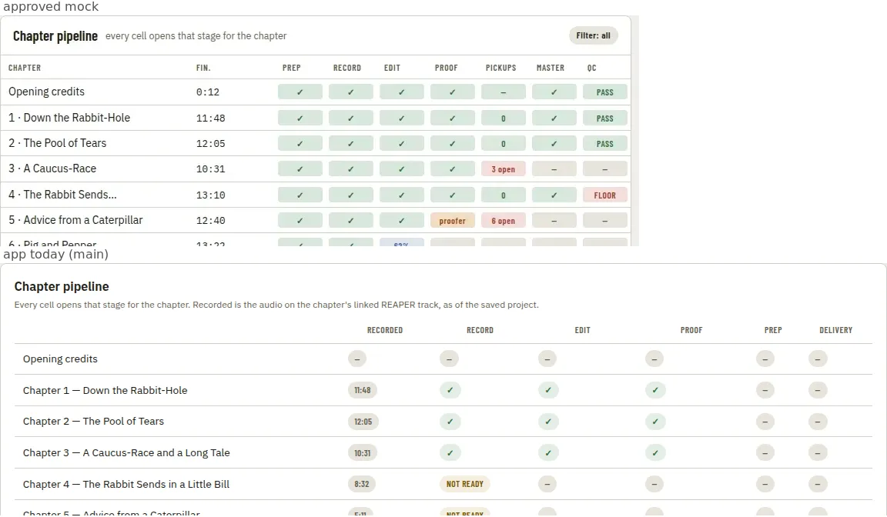
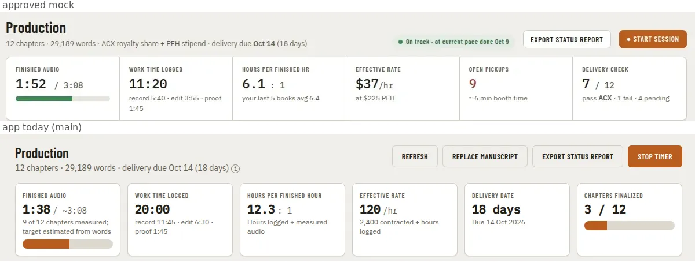
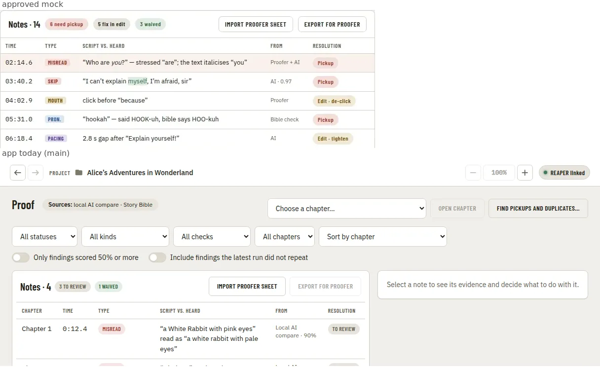
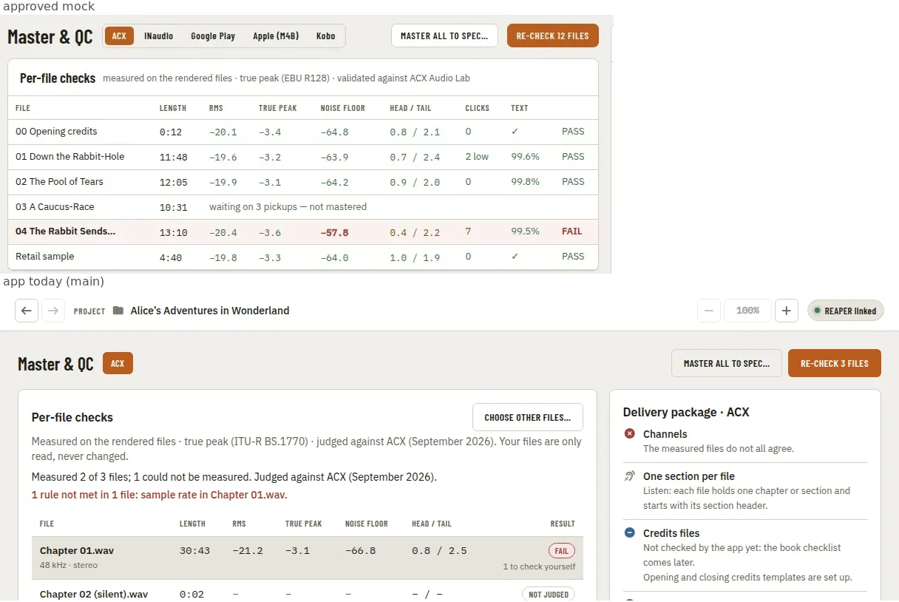
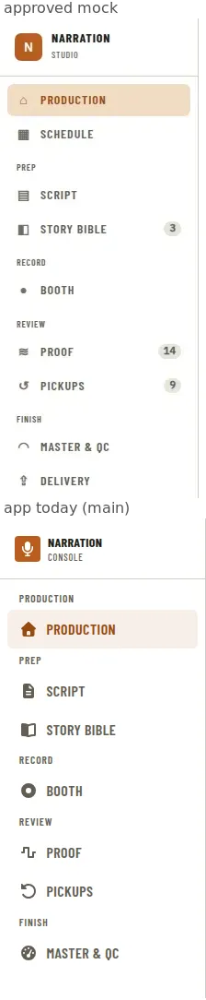

# Mock Fidelity: Primitives and Components Match the Approved Mocks

**Source:** owner decision D91 on [#509](https://github.com/countrymanprime/narration-utils/issues/509) (2026-09-28, 12:35) and its refinement (12:43): "the mocks win, measured, with a 90% bar", and "the fidelity problem is stylistic, and the audit produces a PRD". It builds on the [visual mockup divergence audit](../research/visual-mockup-divergence-audit.md), which was qualitative. Tracking issue: [#883](https://github.com/countrymanprime/narration-utils/issues/883).
**Supersedes:** nothing yet. Phases that change a recorded design decision supersede the ADR concerned (see [ADR impact](#adr-impact)).

## Problem Statement

The pages merged since the benchmark mocks were approved (D69) and the per-PRD sets were approved (2026-09-24) don't look like those mocks. The owner's diagnosis is that the difference is mostly style, not layout:

- the buttons are wrong;
- the tables don't look like the mocks' tables;
- the Production page has the pills it should, but they aren't uniform.

The cause is in the process. Each worker compared its page with the mock, kept the existing primitive's look because it was "close enough", and patched what it had to locally. So every page drifted a little, in a different direction. The fix therefore can't be a page patch either. It has to be a spec **per primitive and per component**, measured from the mocks, and implemented in the primitive so that every consumer inherits it.

## Evidence

### The approved set

Only approved mocks are the spec. `apps/ui/tests/visual/mock-match/mocks.ts` lists every one:

- **The seven benchmark mocks.** These are in [`mockups/stage-navigation-and-page-replacement/`](mockups/stage-navigation-and-page-replacement/). The owner approved them as the build spec (D69, 2026-09-27) and later ruled that "the approved mocks win" (D85). They are light, except the Booth (03) and the companion (07).
- **The per-PRD sets.** The owner approved these on 2026-09-24 (input commands and pedals on 2026-09-27). They were drawn from the app in the dark theme before stage navigation. The spec excludes their `before` pictures (what was there), their `alt` pictures (the option not chosen) and their copies of the benchmark mocks.
- **Concept pictures.** These are listed in `NOT_THE_SPEC` in the same file and never set the spec: the six copies of benchmark mocks in other PRDs' folders, and `edit-and-proof-workspace/08-long-run-page-consolidation.webp`.

That gives **130 approved mocks**:

- **81 are scored** against a visual-suite state.
- **49 are listed with the reason they are not scored:**
  - 28 draw a page that was replaced (D79): the Home page by Production, the Manuscript page by Script, and the read-aloud dialog and the Teleprompter by the Booth. The benchmark mock of the replacing page is their spec now.
  - 8 are screens not built yet, such as the series voice bible, the takes A/B panel and the FX menu.
  - 6 are crops whose position on the page the mock doesn't record.
  - 5 are states with no catalog row, such as zoom at 200%, the 390 px header and the resume check in flight.
  - 2 aren't app screens a browser can capture: WebView2's own zoom, and the exported HTML report.

**Where two approved mocks disagree, the benchmark mock wins.** The benchmark set is the newer build spec (D69, D85), and the dark sets were drawn from the app as it was, so they carry its old sizes. The clearest case is button height: 32 px in every benchmark mock, and 38 px in the dark sets. This is [Q1](#open-questions).

### The measuring tool (Phase 0a, built)

`pnpm --dir apps/ui mock-match` is the measure behind every number in this PRD ([ADR 0585](../adr/0585-mock-fidelity-is-a-pixel-match-at-the-mocks-own-size-and-theme-scored-by-a-tool-that-reports-and-does-not-gate.md), Proposed). For each scored mock, it:

1. loads the mock-backend build at the mock's own pixel size, in the mock's theme;
2. drives the app to the target state with the visual suite's own driver (`tests/visual/app.drivers.ts`);
3. photographs the viewport;
4. compares the photo with the mock (`tests/visual/mock-match/compare.ts`).

The comparison follows pixelmatch:

- **Threshold.** A pixel matches when its YIQ colour difference is at most **0.1** of the maximum (pixelmatch's default threshold).
- **Anti-aliasing.** A differing pixel that is anti-aliasing in either image is forgiven.
- **Match %** is matching pixels ÷ all pixels.
- **Ink match %** is the same measure over only the pixels that are not page background. It is reported beside match % because a sparse screen scores well on background alone.

The tool writes a diff PNG per state and a `scores.md` table to the gitignored `apps/ui/screenshots/mock-match/`. Where a mock draws the app's shell, the nav rail and the header are also scored on their own (**Rail %**, **Header %**, [ADR 0636](../adr/0636-the-mock-match-tool-scores-the-nav-rail-and-header-apart-from-the-page.md)), in the mock's own geometry; the benchmark mocks are the chrome's spec. `MOCK_MATCH_BASELINE=<an earlier run's scores.json>` adds each score's change since that run, which is the before-and-after a phase reports. It reports and does not fail; `MOCK_MATCH_ENFORCE=1` fails any state under 90%. `src/mockMatch.test.ts` is its unit test: 18 cases covering the threshold, the anti-aliasing rule, ink match, fitting, the approved list and the concept pictures kept out of it.

### Baseline scores

These were run on `main` at `6677fec` in this container's Chromium (1194), on 2026-09-28.

- **81 states scored; 44 are under the 90% bar.**
- The median is **88.55%**. The worst is **83.24%** (Production against mock 01) and the best is 97.14%.
- **Only one benchmark mock comes near the bar:** Proof, at 89.55%, and that is the lenient case the ink-match column exists for (mock 04's table is drawn differently).
- **The dark sets score higher,** because a dark screen is mostly one colour.
- **Ink match is between 7% and 40% everywhere.** Every state loses points on text, and sample data explains part of that. The mocks' names and numbers are invented, and the app's mock backend draws other chapters, so no state reaches 90% on style alone unless its data matches too ([Q5](#open-questions)).

| Mock | Page/state | Viewport | Theme | Match % | Ink % | Main differences | Primitive/component at fault |
| --- | --- | --- | --- | --- | --- | --- | --- |
| `stage-navigation-and-page-replacement/01-production-home-concept.webp` | production/on-pace | 1440×900 | light | **83.24** (under 90) | 17.21 | Board cells are round chips of varying width (mock: flat 58×20 tinted cells, radius 3); six separate KPI cards (mock: one card, six tiles with dividers); card titles in Plex Sans 16 (mock: Barlow Condensed 19 with an inline subtitle and a header divider); table rows 40.6 px (mock 34); buttons 38.4 px (mock 32); Next up above the board (mock: beside it) | StageGrid cell, StatTile, Panel, Table, Button; Production page layout |
| `stage-navigation-and-page-replacement/07-daw-companion-concept.webp` | booth/companion-default | 420×900 | dark | **84.57** (under 90) | 23.12 | Companion buttons 38 px (mock 28), local Section cards (mock: full-bleed sections split by rules), key caps 17 px ui-monospace (mock 18 px Plex Mono with a 2 px bottom edge) | Button size, Kbd, Booth companion |
| `read-aloud-control-bar/10-finished-still-recording-1024.webp` | booth/finished-still-recording | 1024×768 | dark | **84.91** (under 90) | 16.28 | The read-aloud dialog became the full-screen Booth (D79): the mock's dialog frame, 36 px bar and 56 px footer are drawn differently; score is the frame, not the controls | Booth transport (P13); Button size |
| `stage-navigation-and-page-replacement/05-master-delivery-concept.webp` | master/measured | 1440×900 | light | **84.92** (under 90) | 24.67 | Platform switch is separate Pills (mock: one segmented control); per-file table rows 58.5 px (mock 34) and verdict badges (mock: PASS/FAIL words); card titles Plex 16 (mock Barlow 19) | ToggleGroup/segmented, Table, Master per-file checks, Panel |
| `read-aloud-control-bar/07-reaper-recording-1024.webp` | booth/reaper-rec | 1024×768 | dark | **84.93** (under 90) | 18.24 | As read-aloud-control-bar/10 | Booth transport (P13); Button size |
| `edit-and-proof-workspace/02-flag-detail-open-1024.webp` | proof-chapter/flag-finding-open | 1024×768 | dark | **84.98** (under 90) | 14.21 | Proof's chapter view follows mock 04 (ADR 0470), not this set's layout; transport bar controls mix heights | Toolbar/transport (P10), Proof chapter view |
| `read-aloud-control-bar/02-reading-scrolled-1024.webp` | booth/listening | 1024×768 | dark | **85.10** (under 90) | 15.83 | As read-aloud-control-bar/10 | Booth transport (P13); Button size |
| `edit-and-proof-workspace/06-reaper-offline-1024.webp` | proof-chapter/standalone | 1024×768 | dark | **85.76** (under 90) | 11.78 | As edit-and-proof-workspace/02 | Toolbar/transport (P10), Proof chapter view |
| `read-aloud-resume-from-daw/04-after-play-prompt-gone-1024.webp` | booth/resume-after-reaper-plays | 1024×768 | dark | **85.92** (under 90) | 14.00 | The resume card now sits in the Booth, not in the dialog | Booth transport (P13) |
| `read-aloud-control-bar/04-gear-popover-1024.webp` | booth/settings-popover | 1024×768 | dark | **85.93** (under 90) | 13.47 | As read-aloud-control-bar/10 | Booth transport (P13); Button size |
| `stage-navigation-and-page-replacement/02-prep-script-concept.webp` | script/prep-rail-characters | 1440×900 | light | **86.05** (under 90) | 20.83 | Rail tabs selected in --text (mock --accent-strong); pronunciation status pills and speaker tags in other shapes (mock: 16 px tags radius 3); chapter list selection and panel headers differ | Tabs, StatusBadge/SpeakerTag, Panel, Script rail |
| `read-aloud-control-bar/03-mic-popover-1024.webp` | booth/mic-popover | 1024×768 | dark | **86.07** (under 90) | 14.42 | As read-aloud-control-bar/10 | Booth transport (P13); Button size |
| `read-aloud-control-bar/09-paused-1024.webp` | booth/paused | 1024×768 | dark | **86.09** (under 90) | 17.43 | As read-aloud-control-bar/10 | Booth transport (P13); Button size |
| `read-aloud-control-bar/07-reaper-recording.webp` | booth/reaper-rec | 1440×900 | dark | **86.10** (under 90) | 18.27 | As read-aloud-control-bar/10 | Booth transport (P13); Button size |
| `edit-and-proof-workspace/07-unsaved-changes-in-reaper-1024.webp` | proof-chapter/stale | 1024×768 | dark | **86.22** (under 90) | 10.97 | As edit-and-proof-workspace/02 | Toolbar/transport (P10), Proof chapter view |
| `read-aloud-control-bar/06-reaper-armed-1024.webp` | booth/reaper-recording | 1024×768 | dark | **86.36** (under 90) | 14.08 | As read-aloud-control-bar/10 | Booth transport (P13); Button size |
| `read-aloud-control-bar/08-reaper-not-armed-1024.webp` | booth/reaper-not-armed | 1024×768 | dark | **86.37** (under 90) | 14.20 | As read-aloud-control-bar/10 | Booth transport (P13); Button size |
| `read-aloud-control-bar/01-idle-1024.webp` | booth/setup | 1024×768 | dark | **86.40** (under 90) | 14.19 | As read-aloud-control-bar/10 | Booth transport (P13); Button size |
| `read-aloud-control-bar/09-paused.webp` | booth/paused | 1440×900 | dark | **86.44** (under 90) | 24.74 | As read-aloud-control-bar/10 | Booth transport (P13); Button size |
| `edit-and-proof-workspace/01-playing-follow-1024.webp` | proof-chapter/playing | 1024×768 | dark | **86.45** (under 90) | 13.62 | As edit-and-proof-workspace/02 | Toolbar/transport (P10), Proof chapter view |
| `read-aloud-resume-from-daw/01-agree-1024.webp` | booth/resume-agree | 1024×768 | dark | **86.86** (under 90) | 13.38 | As read-aloud-resume-from-daw/04 | Booth transport (P13) |
| `edit-and-proof-workspace/07-unsaved-changes-in-reaper.webp` | proof-chapter/stale | 1440×900 | dark | **86.92** (under 90) | 13.36 | As edit-and-proof-workspace/02 | Toolbar/transport (P10), Proof chapter view |
| `read-aloud-control-bar/02-reading-scrolled.webp` | booth/listening | 1440×900 | dark | **87.14** (under 90) | 25.65 | As read-aloud-control-bar/10 | Booth transport (P13); Button size |
| `read-aloud-control-bar/10-finished-still-recording.webp` | booth/finished-still-recording | 1440×900 | dark | **87.21** (under 90) | 18.54 | As read-aloud-control-bar/10 | Booth transport (P13); Button size |
| `edit-and-proof-workspace/03-click-word-to-seek-1024.webp` | proof-chapter/note-selected | 1024×768 | dark | **87.28** (under 90) | 7.01 | As edit-and-proof-workspace/02 | Toolbar/transport (P10), Proof chapter view |
| `read-aloud-control-bar/03-mic-popover.webp` | booth/mic-popover | 1440×900 | dark | **87.33** (under 90) | 14.77 | As read-aloud-control-bar/10 | Booth transport (P13); Button size |
| `read-aloud-resume-from-daw/06-last-reading-only-1024.webp` | booth/resume-prompter-only | 1024×768 | dark | **87.38** (under 90) | 15.74 | As read-aloud-resume-from-daw/04 | Booth transport (P13) |
| `read-aloud-resume-from-daw/03-recorded-to-end-1024.webp` | booth/resume-complete | 1024×768 | dark | **87.53** (under 90) | 16.77 | As read-aloud-resume-from-daw/04 | Booth transport (P13) |
| `edit-and-proof-workspace/02-flag-detail-open.webp` | proof-chapter/flag-finding-open | 1440×900 | dark | **87.56** (under 90) | 14.76 | As edit-and-proof-workspace/02 | Toolbar/transport (P10), Proof chapter view |
| `read-aloud-control-bar/04-gear-popover.webp` | booth/settings-popover | 1440×900 | dark | **87.58** (under 90) | 14.71 | As read-aloud-control-bar/10 | Booth transport (P13); Button size |
| `read-aloud-resume-from-daw/04-after-play-prompt-gone.webp` | booth/resume-after-reaper-plays | 1440×900 | dark | **87.67** (under 90) | 17.55 | As read-aloud-resume-from-daw/04 | Booth transport (P13) |
| `read-aloud-resume-from-daw/02-disagree-1024.webp` | booth/resume-disagree | 1024×768 | dark | **87.98** (under 90) | 16.11 | As read-aloud-resume-from-daw/04 | Booth transport (P13) |
| `read-aloud-control-bar/08-reaper-not-armed.webp` | booth/reaper-not-armed | 1440×900 | dark | **88.03** (under 90) | 16.21 | As read-aloud-control-bar/10 | Booth transport (P13); Button size |
| `read-aloud-control-bar/06-reaper-armed.webp` | booth/reaper-recording | 1440×900 | dark | **88.07** (under 90) | 16.23 | As read-aloud-control-bar/10 | Booth transport (P13); Button size |
| `read-aloud-control-bar/01-idle.webp` | booth/setup | 1440×900 | dark | **88.11** (under 90) | 16.31 | As read-aloud-control-bar/10 | Booth transport (P13); Button size |
| `read-aloud-resume-from-daw/01-agree.webp` | booth/resume-agree | 1440×900 | dark | **88.15** (under 90) | 17.61 | As read-aloud-resume-from-daw/04 | Booth transport (P13) |
| `read-aloud-resume-from-daw/03-recorded-to-end.webp` | booth/resume-complete | 1440×900 | dark | **88.33** (under 90) | 16.38 | As read-aloud-resume-from-daw/04 | Booth transport (P13) |
| `edit-and-proof-workspace/06-reaper-offline.webp` | proof-chapter/standalone | 1440×900 | dark | **88.34** (under 90) | 12.87 | As edit-and-proof-workspace/02 | Toolbar/transport (P10), Proof chapter view |
| `read-aloud-resume-from-daw/02-disagree.webp` | booth/resume-disagree | 1440×900 | dark | **88.37** (under 90) | 17.59 | As read-aloud-resume-from-daw/04 | Booth transport (P13) |
| `stage-navigation-and-page-replacement/03-booth-concept.webp` | booth/speaker-tags | 1440×900 | dark | **88.48** (under 90) | 32.97 | Booth reading text 17.6 px (mock 26 px on a 48 px line) on --bg (mock: a darker reading surface); speaker tags 12 px tall (mock 26); top bar and command bar layout and key caps (mock: key cap + label per action, 23 px caps) | Booth transport and reading surface, Kbd, Toolbar, SpeakerTag |
| `edit-and-proof-workspace/01-playing-follow.webp` | proof-chapter/playing | 1440×900 | dark | **88.55** (under 90) | 13.43 | As edit-and-proof-workspace/02 | Toolbar/transport (P10), Proof chapter view |
| `read-aloud-resume-from-daw/06-last-reading-only.webp` | booth/resume-prompter-only | 1440×900 | dark | **88.63** (under 90) | 15.80 | As read-aloud-resume-from-daw/04 | Booth transport (P13) |
| `edit-and-proof-workspace/03-click-word-to-seek.webp` | proof-chapter/note-selected | 1440×900 | dark | **88.79** (under 90) | 11.09 | As edit-and-proof-workspace/02 | Toolbar/transport (P10), Proof chapter view |
| `stage-navigation-and-page-replacement/04-proof-pickups-concept.webp` | proof/default | 1440×900 | light | **89.55** (under 90) | 18.84 | Filter row of selects above the notes (mock: none); notes table inset in a padded card (mock: flush) with 40 px rows (mock 38); type badges round (mock 16 px tags radius 3); no waveform header card | Proof findings list, Table, StatusBadge, Panel |
| `delivery-platform-profiles/10-measured-failing-tablet-768.webp` | master/file-rules | 768×1024 | dark | 90.06 | 11.88 | Delivery became Master & QC (benchmark 05 wins where they disagree); badge fills and heights differ | Master per-file checks, StatusBadge |
| `delivery-platform-profiles/02-measured-pass-acx.webp` | master/measured | 1440×900 | dark | 90.46 | 15.85 | As delivery-platform-profiles/10 | Master per-file checks, StatusBadge |
| `delivery-platform-profiles/09-settings-picker-reflow-390.webp` | settings/project-delivery | 390×1100 | dark | 90.46 | 19.44 | As delivery-platform-profiles/10 | Master per-file checks, StatusBadge |
| `app-navigation-and-zoom-controls/06-tablet-768-both-enabled-zoom-150.webp` | shell / history-forward | 768×420 | dark | 90.78 | 15.43 | Rail 224 px and 41.6 px items (spec 216 / 34); header 56 px (spec 52); chips 28 px (spec 21) | Nav rail and header (P8) |
| `delivery-platform-profiles/01-profile-panel-acx-rules-and-sources.webp` | master/profile-rules | 1216×1400 | dark | 91.19 | 14.40 | As delivery-platform-profiles/10 | Master per-file checks, StatusBadge |
| `home-combined/02-home-after-summary-open.webp` | production/recording-check-complete | 1440×900 | dark | 91.55 | 18.68 | Recording check slide-over over today's Production | SlideOver (P7) |
| `delivery-platform-profiles/03-measured-failing-acx.webp` | master/file-rules | 1440×900 | dark | 91.78 | 15.49 | As delivery-platform-profiles/10 | Master per-file checks, StatusBadge |
| `manuscript-combined/01-manuscript-after.webp` | script/reader-text-medium | 1440×900 | dark | 91.91 | 24.95 | Manuscript page became Prep › Script (mock 02 wins); card header close | Script page (P15), Panel |
| `edit-and-proof-workspace/01a-entry-open-workspace-from-tracks-1024.webp` | engine/default | 1024×768 | dark | 91.92 | 17.55 | As edit-and-proof-workspace/02 | Toolbar/transport (P10), Proof chapter view |
| `manuscript-chapter-header-alignment/03-after-with-retail-sample.webp` | script/retail-sample | 1216×900 | dark | 91.98 | 25.49 | As manuscript-combined/01 | Script page (P15), Panel |
| `input-commands-and-pedals/05-settings-global-keyboard-reflow-390.webp` | settings/global-keyboard | 390×844 | dark | 92.08 | 19.71 | Settings list close; key caps in ui-monospace (mock Plex Mono) | Kbd (P10) |
| `read-aloud-control-bar/05-reaper-first-confirm-1024.webp` | booth/reaper-confirm | 1024×768 | dark | 92.30 | 28.96 | As read-aloud-control-bar/10 | Booth transport (P13); Button size |
| `app-navigation-and-zoom-controls/01-desktop-default-first-page-100.webp` | production/on-pace | 1440×900 | dark | 92.32 | 27.41 | As app-navigation-and-zoom-controls/06 | Nav rail and header (P8) |
| `read-aloud-control-bar/05-reaper-first-confirm.webp` | booth/reaper-confirm | 1440×900 | dark | 92.33 | 26.94 | As read-aloud-control-bar/10 | Booth transport (P13); Button size |
| `app-shell-vertical-overflow/01-after.webp` | production/on-pace | 1024×768 | dark | 92.66 | 16.97 | Shell rail and header as above; page body is today's Production | Nav rail and header (P8) |
| `chapter-track-link-control/05-slideover-track-missing.webp` | production/chapter-track-panel-missing | 1440×900 | dark | 92.73 | 18.35 | Slide-over draws a backdrop (mock: none) and 38 px buttons; dl rows | SlideOver (P7), Button |
| `chapter-track-link-control/03-slideover-ambiguous.webp` | production/chapter-track-panel-ambiguous | 1440×900 | dark | 92.76 | 16.90 | As chapter-track-link-control/05 | SlideOver (P7), Button |
| `edit-and-proof-workspace/01a-entry-open-workspace-from-tracks.webp` | engine/default | 1440×900 | dark | 92.76 | 19.71 | As edit-and-proof-workspace/02 | Toolbar/transport (P10), Proof chapter view |
| `app-navigation-and-zoom-controls/02-desktop-back-enabled-zoom-125.webp` | shell / zoom-level | 1440×900 | dark | 92.83 | 28.18 | As app-navigation-and-zoom-controls/06 | Nav rail and header (P8) |
| `chapter-track-link-control/02-slideover-linked.webp` | production/chapter-track-panel-linked | 1440×900 | dark | 92.90 | 18.26 | As chapter-track-link-control/05 | SlideOver (P7), Button |
| `app-navigation-and-zoom-controls/01a-header-crop-default.webp` | production/on-pace | 1440×110 | dark | 92.95 | 33.55 | As app-navigation-and-zoom-controls/06 | Nav rail and header (P8) |
| `daw-chapter-track-auto-sync/02-needs-you-list-tracks-page.webp` | engine/sync-activity | 1440×900 | dark | 93.34 | 21.94 | Dialog body colour and action grouping; toast drawn on --surface (mock: inverted, --text fill) | Dialog, Toast (P7) |
| `manuscript-chapter-header-alignment/02-after-tablet.webp` | script/chapter-header-columns | 768×900 | dark | 93.34 | 19.84 | As manuscript-combined/01 | Script page (P15), Panel |
| `daw-chapter-track-auto-sync/03-auto-linked-toast-undo.webp` | production/chapter-sync-toast-undo | 1440×900 | dark | 93.42 | 25.18 | As daw-chapter-track-auto-sync/02 | Dialog, Toast (P7) |
| `manuscript-credits-card-parity/01-credits-open-by-default.webp` | script/credits-entries | 1440×900 | dark | 93.79 | 20.45 | As manuscript-combined/01 | Script page (P15), Panel |
| `daw-chapter-track-auto-sync/01-sync-consent-dialog.webp` | production/chapter-sync-consent | 1440×900 | dark | 93.81 | 25.15 | As daw-chapter-track-auto-sync/02 | Dialog, Toast (P7) |
| `manuscript-chapter-header-alignment/01-after.webp` | script/chapter-header-columns | 1440×900 | dark | 93.87 | 19.79 | As manuscript-combined/01 | Script page (P15), Panel |
| `chapter-track-link-control/06-remove-from-recording-confirm.webp` | production/chapter-remove-confirm | 1440×900 | dark | 94.06 | 27.42 | As chapter-track-link-control/05 | SlideOver (P7), Button |
| `manuscript-credits-card-parity/05-read-aloud-dialog-opening-credits.webp` | booth/credits-opening | 1440×900 | dark | 94.19 | 16.16 | As manuscript-combined/01 | Script page (P15), Panel |
| `app-navigation-and-zoom-controls/02a-header-crop-back-enabled-zoom-125.webp` | shell / zoom-level | 1440×110 | dark | 94.69 | 40.00 | As app-navigation-and-zoom-controls/06 | Nav rail and header (P8) |
| `credits-token-setup-and-front-matter-detection/01-setup-dialog-on-open.webp` | production/credits-setup-dialog | 1440×900 | dark | 95.59 | 20.90 | Dialog frame close to the mock; chip and button heights | Dialog (P7), StatusBadge |
| `input-commands-and-pedals/03-settings-global-keyboard-conflict.webp` | settings/global-keyboard-conflict | 1440×900 | dark | 95.86 | 25.85 | As input-commands-and-pedals/05 | Kbd (P10) |
| `input-commands-and-pedals/04-shortcut-sheet.webp` | global/shortcut-sheet | 1440×900 | dark | 95.86 | 19.54 | As input-commands-and-pedals/05 | Kbd (P10) |
| `delivery-platform-profiles/06-custom-profile-editor.webp` | settings/delivery-profile-editor | 1440×1000 | dark | 95.96 | 26.57 | As delivery-platform-profiles/10 | Master per-file checks, StatusBadge |
| `input-commands-and-pedals/02-settings-global-keyboard-recording.webp` | settings/global-keyboard-recording | 1440×900 | dark | 95.98 | 25.90 | As input-commands-and-pedals/05 | Kbd (P10) |
| `input-commands-and-pedals/01-settings-global-keyboard.webp` | settings/global-keyboard | 1440×900 | dark | 96.22 | 29.07 | As input-commands-and-pedals/05 | Kbd (P10) |
| `delivery-platform-profiles/05-settings-project-profile-picker.webp` | settings/project-delivery | 1440×900 | dark | 97.14 | 35.68 | As delivery-platform-profiles/10 | Master per-file checks, StatusBadge |

The side-by-side crops below are in [`docs/research/mock-fidelity/`](../research/mock-fidelity/). In each one the approved mock is on top and the app on `main` is underneath.

### How the spec and the current rendering were measured

- **The mock specs.** Mock pixels were scanned with sharp for box edges, and fills were sampled and matched to the nearest token. Type size comes from cap height, and letter-spacing from fitting ink widths against the fonts' own glyph advances. Sizes are good to ±1 px; radii and type are estimates to about ±1 px. The mocks are lossy WebP, so a flat fill is within about ±3 to ±8 per channel of its token.
- **The current rendering.** This is `getComputedStyle` and the bounding box of every primitive instance on the target states, taken at 1440×900 from the same mock-backend build.
- **The consumer inventory.** Every JSX use and every hand-drawn copy across the 192 production `.tsx` files was grepped and then read by hand.

The spec tables in [Solution Detail](#solution-detail) are the result: one per primitive and component.

## Proposed Solution

1. **Phase 0 builds the measuring stick and the tokens.**
   - **0a:** the pixel-match tool. It is built in this PRD's own pull request.
   - **0b:** one token batch holding every colour, radius, size and type token the mocks need that `styles.css` lacks, checked by `paletteContrast.test.ts`.
2. **One phase per shared primitive.** Each phase:
   - changes the primitive and its `<Name>.stories.tsx`, so every consumer inherits the fix;
   - adds the variants and sizes the mocks draw (a `size` on Button, a `tag` shape on StatusBadge, a `segmented` ToggleGroup);
   - **migrates every hand-drawn copy of that primitive onto it** (make a pill uniform by making every pill THE pill), except inside the five page-specific components, which their own phases migrate;
   - deletes the call-site overrides the new sizes make unnecessary.
3. **One phase per page-specific component** that has no shared primitive: the Production board, the Proof findings list, the Booth transport and reading surface, the Master per-file checks and the Script prep rail. Each composes the fixed primitives and brings its page's approved-mock states to 90%.
4. **A close-out phase** re-runs the whole baseline and records the scores. It writes the steady-state docs and deletes this PRD.

A phase is done when:

- the atlas story matches the measured spec in light and dark, at the atlas's wide and narrow widths;
- every approved-mock state of every consumer page it owns reaches **at least 90%** with `MOCK_MATCH_ENFORCE=1`, or carries a reason the owner accepts on [#510](https://github.com/countrymanprime/narration-utils/issues/510) (D91). A tooling limit is not a reason.

## Key Hypothesis

Most of the gap to 90% is shared style: button height and type, table row height, the pill and cell shapes and fills, the panel header, and the nav rail. We believe fixing it once per primitive will lift every consumer page. We'll know we're right when a primitive phase alone moves several states of different pages by a measurable amount. For example, Button plus Table should lift Production, Proof and Master together. When the primitive phases are done, the benchmark mocks should be within reach of 90% once the page components and matching sample data land.

## What We're NOT Building

- **Layout redesigns the mocks don't draw.** Where a page's structure differs from its mock (Proof's filter row, Production's Next up above the board), the page-specific phase changes the structure to the mock's. It adds nothing the mock doesn't show.
- **Features the mocks show that have no data behind them.** Examples are the pace pill, open pickups per chapter, Schedule, and the series chip. These stay with their own PRDs (the visual audit's category b). Their absence is a reason the owner has already seen, and it goes in the Mockup check.
- **A per-page theme.** D69 stands: the dark benchmark mocks (03, 07) are the one global dark theme, never a forced surface. A token the booth needs is declared in both themes.
- **A CI gate on the score.** The tool reports (ADR 0585). Rasterisers differ between machines, and pixel baselines wait for #153.
- **A rewrite of the mocks.** The approved mocks are the spec. A mock that is wrong is a question for the owner on #510, not an edit.

## Success Metrics

| Metric | Target | How measured |
| --- | --- | --- |
| Approved-mock states at or above 90% | All scored states, apart from reasons the owner accepts on #510 | `pnpm --dir apps/ui mock-match` in the close-out phase |
| Benchmark mocks 01–05 and 07 | Each at least 90% | The same run |
| Hand-drawn copies of a primitive | 0 outside the page-specific components after each primitive phase, and 0 overall after the last page phase | A per-primitive check extending `src/rawNatives.test.ts`'s pattern (for example no `rounded-full` chip outside `StatusBadge`) |
| Button call sites passing a size through `className` | 0 (there are about 30 today, in 7 recipes) | grep; the Button phase's test |
| Atlas | Every changed primitive's story matches its spec table, light and dark | `pnpm --dir apps/ui atlas` |

## Open Questions

Each question has a recommendation, taken per D22 and put to the owner on #510.

1. **Which mock wins when two approved mocks disagree?** The benchmark mocks draw 32 px buttons, 22 px pills and 34 px table rows. The 2026-09-24 dark sets draw 38 px buttons, pills of 18–26 px and settings rows of 63 px. **Recommendation: the benchmark mocks win** (D69, D85), and the dark sets are scored as they are. Where a dark set draws something the benchmark set doesn't draw at all, such as a dialog, the slide-over, the toast or a text field, the dark set is the spec.
2. **Button sizes.**
   - **Recommendation:** `md` 32 px is the default; `sm` 28 px is for the companion and dense rows; `lg` is none, because no mock draws one.
   - **Dark sets:** their 38 px buttons move to 32 px.
   - **`--control-height`:** it stays 40.8 px for text fields and selects, which both sets draw at 40–42 px.
   - **Mixed rows:** a button and a text field in one row no longer share a height. The benchmark mocks never put them side by side.
3. **Badge fills.** The mocks fill status pills and board cells with the `-soft` tokens (`--character-soft`, `--review-soft`, `--place-soft`, `--accent-soft`). The app uses ADR 0362's 14% tints. **Recommendation:** StatusBadge fills move to a `--<tone>-soft` family: `--ok-soft`, `--warn-soft`, `--info-soft` and `--danger-soft`, aliased where an entity `-soft` already has the value. Each is checked against its `-text` colour by `paletteContrast.test.ts`. Phase 0b does this, and it supersedes ADR 0362's badge-fill clause.
4. **The slide-over backdrop.** The dark-set mocks draw no dimming behind the slide-over. ADR 0051 makes it a modal drawer with a backdrop. **Recommendation:** keep it modal (ADR 0051's focus trap, Escape and outside click) and draw the backdrop transparent, so it looks like the mock and behaves as recorded. Phase 7 records this in an ADR that supersedes 0051's visual clause only.
5. **Sample data.** The mocks' names and numbers are invented, and the mock backend draws others. So no state reaches 90% on style alone, because every line of text is shifted. **Recommendation:** each page-specific phase adds a `?mockFidelity=<mock>` fixture to the mock backend. It reproduces the mock's rows (chapter names, counts, times) through the existing mock host, D67. That phase's catalog row is the one the tool scores. The fixture draws only fields that exist in the app's data; a field with no data is a D91 reason on #510.
6. **The Booth reading surface.** Mock 03's surface is `#0e0d09`, darker than dark `--bg`, and its script is 26 px on a 48 px line. The app's script is `--font-size-booth-script`, 17.6 px. **Recommendation:** add a `--reading-bg` token in both themes (light: `--surface`; dark: `#0e0d09`) and move `--font-size-booth-script` to 1.625rem with a `--line-height-booth-script` of 1.85. Phase 0b adds them and Phase 13 uses them. This stays within D69: the token has a value in each theme, and no surface is forced.
7. **An ink-match floor.** **Recommendation:** none for now. Ink match is reported to help read a score; the bar stays D91's match % (ADR 0585).

## Users & Context

- **The narrator.** The narrator uses the app daily beside a DAW. The owner reviews hourly visual samples and judges the app against the approved mocks.
- **Phase workers.** Each is launched by the coordinator from this PRD's phase table (agent train). Each needs the spec for its primitive, the files it owns and the files it must not touch.
- **Every later UI stream.** Each one inherits the primitives this PRD fixes, and its Mockup check carries the match % column (D91, [agent train](../operations/agent-train.md)).

## Solution Detail

### Core capabilities (MoSCoW)

| Priority | Capability |
| --- | --- |
| Must | The pixel-match tool (P0a), the token batch (P0b), Button, StatusBadge/Pill uniformity, Table, and Panel with Heading |
| Must | The Production board (mock 01), the Proof findings list (mock 04) and the Master per-file checks (mock 05): the benchmark pages the owner named |
| Should | Tabs and the segmented control, the nav rail and header, overlays, StatTile and meters, Kbd and Toolbar, the Booth transport and reading surface, the Script prep rail |
| Could | Inputs (already close to the dark sets: 40–42 px, radius 7) |
| Won't | Scoring the replaced pages' mocks (Home, the Manuscript page, the read-aloud dialog): their benchmark successors are the spec |

### MVP scope

Phases 0a, 0b, 1, 2, 3, 4, 11, 12 and 14. These fix the buttons, tables and pills the owner named, and bring the Production, Proof and Master benchmark states up.

### User flow

This is a worker's flow for one phase:

1. Open the phase's spec table below and the mocks it names.
2. Change the primitive and its story to the spec.
3. Migrate the listed copies onto the primitive.
4. Run `pnpm --dir apps/ui mock-match` with `MOCK_MATCH_ENFORCE=1 -g "<mocks>"` for the states the phase owns, and look at each diff PNG.
5. Put the scores in the PR's Mockup check: mock | capture | match % | remaining differences.

### Spec per primitive

The tables give the mock's measured spec against what the app renders today. "B" marks a value measured on the benchmark mocks; "D" marks one measured on the dark sets. Tokens are named where the mock's value is one; "new" marks a token that Phase 0b adds.

#### Button (Phase 1)

| Property | Mock spec | App today (`Button.tsx:29`) |
| --- | --- | --- |
| Height | **32 px** including the 1 px border (B, 14 instances, no variance); `sm` **28 px** (companion, B07); the companion header button is 26 px | 38.4 px, because the primitive sets no line-height or min-height and inherits one; 34, 26.8 or 23.6 px through call-site overrides |
| Padding | 0 12 px plus the 1 px border, centred vertically | 8 px × 16 px |
| Radius | ≈6 px | 6 px (`rounded-md`) |
| Label | Barlow Condensed ≈13 px (`--font-size-sm`, 0.8125rem), 600, uppercase, tracking ≈0.06 em | Barlow Condensed 13.6 px, 600, uppercase, tracking 0.03 em |
| Primary | fill `--accent`, no visible border, text `--accent-contrast` | same |
| Secondary | fill **`--surface`**, 1 px `--border`, text `--text` | `ghost`: fill **transparent**, 1 px `--border`, text `--text` (so it shows `--bg` behind it on the page) |
| Danger | outline 1 px `--danger`, text `--danger-text` (D) | same |
| Disabled | primary drawn at ≈55% opacity (B: `#d5a384`); D: 40% | `opacity-40` |
| Leading glyph | a 6–7 px glyph (▶ ●) with a 5–6 px gap | icon at the font size, 6 px gap |
| Gap between buttons | 6–12 px (B), 8 px (D) | caller's choice |
| Toggle (`aria-pressed`) | not drawn in the mocks; the segmented control covers it | none: callers override the look |

- **Changes:**
  - Add `size: 'md' | 'sm'`.
  - Rename `ghost` to `secondary` with a `--surface` fill, keeping `ghost` as a transparent variant for the rare on-surface use.
  - Set an explicit height and `leading-none`.
  - Set tracking to 0.06 em.
  - Set disabled to 55%.
  - Add a `link` variant for the six underline text-link buttons (there is no primitive for them today).
- **Migrate:**
  - The 7 "small" recipes (about 30 sites: `text-xs`, `px-3 py-1`, `px-2.5 py-1 text-xs`, `SMALL`, `px-2! py-1!` and the rest).
  - `project/ProjectPicker.tsx:178` and `:161`, which are clones of Button.
  - `proof/TransportBar.tsx:48` and `booth/BuiltinRecorder.tsx:264`, which are icon-only Buttons and become IconButton.
  - The `stages/StageSummary.tsx` chip buttons, which move to StatusBadge in Phase 2.
- **Consumers:** 294 uses in 99 files, across every page.

#### StatusBadge, Pill, SpeakerTag: every pill is THE pill (Phase 2)

| Shape | Mock spec | App today |
| --- | --- | --- |
| Status pill (resolution, summary, rail status, "On track", chips) | **22 px** tall, fully rounded, 10 px side padding, Barlow ≈11–11.5 px 600, tracking ≈0.06 em, **in the label's own case** (B; "Pickup", "6 need pickup", "Query sent": Phase 2 measured it, ADR 0600) | `StatusBadge chip`: 22 px, fully rounded, 8.8 px padding, 11.52 px, tracking 0.03 em. The **shape matches; the fills don't** |
| Tag (the Proof type badge, the Script speaker tag, the dark sets' "Retail sample"-style tags) | **15–16 px** tall, radius **≈3 px**, 6 px side padding, Barlow ≈11 px 600 uppercase (B04, B02) | none: a StatusBadge chip (22 px, round) or `SpeakerTag` (17.4 px light, 11.9 px dark, radius 3.2) |
| Booth speaker tag | ≈26 px, radius ≈4 (B03) | `SpeakerTag` 11.9 px (line-height 1) |
| Nav count badge | ≈16 px pill, `--surface-2`, `--text-muted` (`--accent-strong` on the selected item) | none (not built, visual audit SH5) |
| Dot | 7–8 px circle in the tone colour (D) | `StatusBadge dot` 8 px, unused on the measured pages; 9 hand-drawn dots |

The fills per tone (B), against StatusBadge today:

| Tone | Mock fill / text | App fill / text |
| --- | --- | --- |
| success | `--character-soft` (≈`#d7e9dc`) / `--ok-text` | `--badge-ok-fill` (14%) / `--ok-text` |
| danger | `--review-soft` / `--danger-text` | `--badge-danger-fill` / `--danger-text` |
| warning | ≈`#f0e8cf`–`#f3ebd7`, **no token** (new `--warn-soft`) / `--warn-text` | `--badge-warn-fill` / `--warn-text` |
| info / progress-percent | `--place-soft` / `--info-text` | `--badge-info-fill` / `--info-text` |
| accent (proofer, queries, Author ✓) | `--accent-soft` / `--accent-strong` | `progress` tone: the same |
| neutral | `--surface-2` / `--text-muted` | the same |
| org (PACING) | `--org-soft` / `--org-text` | none |

The dark sets show pill heights of 18, 21, 23, 24, 25 and 26 px, with the OK fill as `--character-soft` in one mock and `--badge-ok-fill` in another. That is the non-uniformity the owner saw, and Q1 settles it on 22 px.

- **Changes:**
  - Add `shape: 'pill' | 'tag'`.
  - Move the fills to the new `-soft` family (Q3).
  - Add an `accent` and an `org` tone.
  - Add an `outline` look for the dark sets' warn-outline "TO VERIFY" and "CHANGED" badges.
  - `SpeakerTag` becomes a `tag` with the speaker colour, with a `size="booth"` of 26 px.
- **Migrate:**
  - `manuscript/EntitySummary.tsx:20` `BADGE_CLASS`, a copy of `CHIP_CLASS` also used by `storybible/GuideDetail.tsx:370`.
  - `settings/KeyboardPanel.tsx:96` `ChangedBadge`.
  - `stages/StageSuggestion.tsx:54,83` tags.
  - `manuscript/ReaderCard.tsx:153`, the retail tag.
  - `proof/ScriptView.tsx:60`, the extra-word chip.
  - `stages/StageSummary.tsx:18,28,38`, which are Buttons coloured through `style`.
  - The hand-drawn dots in `settings/Settings.tsx:273,303`, `settings/DawCatalogPanel.tsx:84`, `manuscript/ChapterNav.tsx:97`, `credits/CreditsSetupBanner.tsx:46` and `EntitySummary.tsx:34` `CAT_DOT_CLASS`, which `booth/ReaderRail`, `storybible/GuideDetail` and `storybible/Guide` also use.
  - The page-component copies are migrated by their own phases: `master/RuleBadges.tsx` (P14), `proof/NotesHeader.tsx` `SourcesLine` and `FindingsList` `NoteChip` (P12), `master/MasteringChain.tsx` (P14), the `booth/ReadingControlBar.tsx:248` chip (P13), and the header chips (P8).
- **Consumers:** 25 StatusBadge uses in 17 files, Pill through ToggleGroup, SpeakerTag in `booth/ReaderText` and `manuscript/ParagraphView`.

#### Table and StageGrid (Phase 3)

| Property | Mock spec (B01, B04, B05) | App today (`Table.tsx:108`, `:149`; `StageGrid.tsx:94`, `:122`) |
| --- | --- | --- |
| Header row | **31 px** (30 + 1 px `--border` rule), no fill | 33.8 px |
| Header text | Barlow ≈11 px 600 uppercase, tracking ≈0.1 em (1.0–1.3 px), `--text-muted` | 11.52 px, tracking 0.05 em |
| Body row | **34 px** (33 + 1 px divider) in 01 and 05; 38 px in 04, whose rows hold pills | 40.6 px (Proof 40.6 / 50.6 / 80.5; Master 58.5) |
| Cell padding | 10–11 px left, content centred vertically | 11.2 px, top-aligned (`TableCell`) |
| Body text | Plex Sans **14 px** `--text` | 13.76 px (0.86rem) |
| Numeric cells | Plex Mono ≈13 px (the 04 time column ≈14) | by call-site `MONO` constants (redefined in 9 files) |
| Secondary cell text | 12 px `--non-text` (04 FROM column) | 12 px `--text-muted`, set by the caller |
| Selected or highlighted row | **`#faf1ed`**, no token (new `--row-selected` ≈ `--accent-soft` 40% over `--surface`); no stripe | `--surface-2` |
| Bold row (01 row 7, the current chapter) | weight 600, no fill | none |
| Table in a card | **flush to the card's edges**, under the card header's divider | inside `Panel`'s 17.6 px padding |
| Dark sets (D) | rules and measured tables: 57–64 px rows for 2 lines; no header fill; 1 px `--border` dividers | same shape |

- **Changes:**
  - Set the header and body sizes above.
  - Add `TableCell numeric` (mono, right-aligned; it replaces 21 `MONO` overrides) and `muted`.
  - Add `TableRow emphasis="current"`.
  - Use the `--row-selected` fill.
  - Default `TableCell` to middle-aligned, with `align="top"` for multi-line cells (this amends ADR 0056's "top-aligned").
  - Add a `flush` prop that pairs with `Panel`'s new body slot.
  - `StageGrid` shares the header and row styles.
- **Migrate:**
  - The `ul divide-y` lists holding tabular data: `master/BookChecklist.tsx:79`, `settings/DeliveryProfilesPanel.tsx:186`, `storybible/PronunciationQueries.tsx:191` and `production/PlanPanel.tsx:133`.
  - The call-site `MONO`, `text-sm` and `align-top` overrides in `engine/*`, `master/DiagnosticsTables`, `FileRulesPanel`, `DeliveryProfilePanel`, `MasterToSpecPanel`, `production/RecordingCheckReport`, `proof/PreviewPanel`, `TakeComparisonView`, `settings/DeliveryProfileEditor` and `storybible/{Guide,GuideDetail,PropertiesSection}`.
- **Consumers:** 21 tables in 18 files, plus StageGrid on Production.

#### Panel, Heading and the eyebrow label (Phase 4)

| Property | Mock spec | App today (`Panel.tsx:14`, `:18`; `Heading.tsx:9`, `:12`) |
| --- | --- | --- |
| Card frame | 1 px `--border`, radius ≈8, `--shadow`, `--surface` on `--bg` | the same (8 px, `--shadow`) |
| Card header | **≈50 px** (54 px with buttons), then a **1 px `--border` divider** | none: the title sits inside the padding |
| Card title | **Barlow Condensed ≈19 px** 600, sentence case, `--text`, 16–17 px from the edge (B); dark settings panels: Barlow ≈17 px uppercase with wide tracking | IBM Plex Sans 16 px 600 |
| Card subtitle | Plex Sans 12.5–13 px `--text-muted`, **inline, 10 px after the title** | none |
| Body padding | ≈16 px (B); ≈18 px (D) | 17.6 px |
| Gap between cards | 16 px; page padding 24 px | per page |
| Page title | **Barlow Condensed ≈26 px** 600 | Barlow Condensed 24 px |
| Page subtitle | Plex Sans 12.5–13 px `--text-muted` | 14 px |
| Eyebrow label (section labels, KPI labels, nav groups) | Barlow ≈11 px 600 uppercase, tracking ≈0.1 em, `--text-muted` | written out 15 times (`SECTION_LABEL`, `EYEBROW`, ...) plus the global `.section-label`: 11.52 px, tracking 0.08 em |
| Inset card | 1 px `--border`, radius ≈5–6, 12 px inset (D) | about 25 hand-drawn `rounded-md border px-3 py-2` copies |

- **Changes:**
  - Panel draws a header bar: a title in the card-title type, an optional inline `subtitle`, `actions` at the right and a divider. It adds a `flush` body for a table.
  - Heading takes the page-title and subtitle sizes.
  - A new `SectionLabel` primitive replaces the eyebrow copies and `.section-label`.
  - A new `InsetCard` primitive replaces the inset-card copies.
- **Migrate:**
  - The hand-drawn cards: `proof/ScriptView.tsx:138`, `proof/CompareRun.tsx:292`, `storybible/GuideDetail.tsx:150,362`, `storybible/Guide.tsx:228`, `settings/Settings.tsx:256`, `booth/ReaderRail.tsx:66`, `booth/ResumePrompt.tsx:553`, `project/ProjectPicker.tsx:114`, `layout/StartupScreen.tsx:40`, `credits/CreditsSetupBanner.tsx:42` and `manuscript/ReaderCard.tsx:84`.
  - The eyebrow copies outside the page components.
  - The raw page `h1`s (`layout/StartupScreen.tsx:41`, `project/ProjectPicker.tsx:115`) and the raw panel `h2`s.
- **Consumers:** 42 Panels in 31 files; one Heading per page.

#### Tabs and the segmented control (Phase 5)

| Property | Mock spec | App today (`Tabs.tsx:12`, `:14`, `:17`; `Pill.tsx:25`) |
| --- | --- | --- |
| Underline tab | Barlow ≈13 px 600 uppercase, tracking ≈0.08–0.1 em. **Selected text `--accent-strong`** (B02); the dark sets draw it muted or `--text`, and B wins. 2 px `--accent` underline spanning the label plus 10 px each side, over a 1 px `--border` rule. ≈25 px between labels | 13.6 px, tracking 0.03 em, selected text `--text`, 2 px underline, padding 14.4 px |
| Sidebar tab (Settings categories) | fill ≈`--accent-soft` (D: `#342818`), text `--accent-strong`, 208×42 | fill `color-mix(--accent 10%, --surface)`, **no token**; 208×41.6 |
| Segmented control (Master platforms, B05) | one container **33 px**, 1 px `--border`, fill `--bg`, radius ≈6; the selected segment is inset 3–4 px, `--accent` fill, `--accent-contrast` text, radius 4–5; the others have no fill and `--text`; Barlow ≈13 px, **title case** | a row of separate `Pill`s: 30.3 px each, radius 5.6, uppercase, with gaps |
| Toggle chips (D, eap/01 flag filter) | 32 px, active `--accent` fill, inactive 1 px `--border` with `--text-muted` text | `Pill`: 30.3 px, 12.48 px type |

- **Changes:**
  - Tabs take the spec above.
  - The sidebar tab uses `--accent-soft`.
  - ToggleGroup gains `look="segmented"`, a single container.
  - Pill takes 32 px and the Button type.
- **Migrate:**
  - `proof/CompareRun.tsx:297`, the hand-drawn step strip.
  - `manuscript/SelectionMenu.tsx:58`, Buttons with `rounded-none` pretending to be a segmented group.
  - The Master platform switch is Phase 14's.
- **Consumers:** Tabs in `booth/ReaderRail`, `script/ScriptRail`, `settings/Settings` and `storybible/Guide`; ToggleGroup in 7 files.

#### Inputs (Phase 6)

| Property | Mock spec (D: credits/01, dpp/05, dpp/06, eap/01) | App today (`TextField.tsx:7`, `Select.tsx:25`) |
| --- | --- | --- |
| Height | 40–42 px | TextField 40.8 px (`--control-height`); Select 41.2 px (its `leading-[1.35]` computes `normal`) |
| Border, fill, radius | 1 px `--border`, `--surface`, ≈7 px | the same (`--control-radius` 7.2 px) |
| Text | Plex Sans 14 px `--text`; numeric fields Plex Mono ≈15 px | 14.08 px; no mono numeric field |
| Padding | 12 px left; select chevron 10×6, 4 px from the right | 12 px |
| Focus | 2 px `--accent` ring with a 1 px gap | per the primitive |
| Disabled | 40% | 40% |
| Field label | Plex Sans 500 ≈14 px `--text-muted`, 8 px above the control; helper text 12 px muted, 4 px below | per `Field` |
| Switch | track ≈37×20, `--accent` on, `--surface-3` off, 14 px thumb; `--danger` track when recording | Switch today |
| Radio | 13 px; selected `--accent`; unselected fill `#3d3b37`, **no token** | RadioGroup |

- **Changes:**
  - Fix the Select line-height, so both controls are 40.8 px.
  - Add a `mono` numeric TextField.
  - Match the focus ring.
  - Draw the unselected radio with an existing token (`--surface-3` with a `--border` rim), to be confirmed with the owner as a D91 reason if the pixel difference matters.
- **Migrate:**
  - The raw `<label>`s beside Selects: `booth/BoothPage.tsx:149`, `booth/MicrophoneField.tsx:85`, `production/ImportReview.tsx:196`, `proof/TakeReviewReads.tsx:246,259` and `proof/TakeReviewScanDialog.tsx:26`.
  - The `LABEL_CLASS` spans: `booth/BuiltinRecorder.tsx:22` and `manuscript/WordLookup.tsx:21`. The one in `ReadingControlBar` is Phase 13's.
  - The fake read-only fields at `storybible/GuideDetail.tsx:474,547`.
- **Consumers:** TextField, Field, Select, SearchField, Checkbox, Switch and RadioGroup across 40-odd files.

#### Overlays: Dialog, ConfirmDialog, SlideOver, Popover, Toast, Menu (Phase 7)

| Property | Mock spec (D) | App today |
| --- | --- | --- |
| Dialog frame | 1008 px wide at 1440 (70vw), centred, 1 px `--border`, radius ≈8, `--shadow-lg`, `--backdrop` | 70vw (ADR 0001), the same frame |
| Dialog header | **59 px** plus a 1 px divider; title Plex Sans 600 ≈16 px, 19 px inset; close 32×32, 13 px from the right | per `Dialog.tsx` |
| Dialog body | 18 px side padding; **body copy `--text-muted`** (ctl/06, credits/01) or `--text` (daw/01) | per call site |
| Dialog footer | a divider, then 66 px: 12 px top, 16 px bottom, 16 px sides; buttons 8 px apart | ADR 0002: `between` by default, `end` for one action |
| Action order | two conventions: Cancel alone at the left (ctl/06, dpp/06), or the secondary grouped with the primary at the right (daw/01, credits/01) | ADR 0002 |
| Slide-over | **320 px**, left border and `--shadow-lg`, **no visible backdrop**; 59 px header with a divider; 18 px padding; dl rows at a 33 px pitch with `--border` dividers | modal Base UI drawer with a dimming backdrop (ADR 0051) |
| Toast | **364×45**, bottom-right 20 px, **inverted**: fill ≈`--text`, text ≈`--surface`; radius ≈5–6; icon, message, underlined Undo, ✕ | `ToastRegion` on `--surface` |
| Popover | 352 px wide, 16 px padding, radius ≈8, `--shadow-lg`; right edge aligned to the trigger, 12 px above it; selected row `--surface-2` with an `--accent` ✓ | `Popover.tsx` |

- **Changes:**
  - Settle the dialog header, footer and body type to the spec.
  - Make body copy `--text-muted` by default.
  - Keep ADR 0002's placement: the mocks follow it except in daw/01 and credits/01. Record which convention wins as a Q for the owner, recommending ADR 0002's rule.
  - The slide-over draws a transparent backdrop (Q4).
  - Invert the toast (`--toast-bg`/`--toast-text`, aliases of `--text`/`--bg` from Phase 0b: the dark set draws the toast text in `--bg`, ADR 0590).
  - Match the popover padding and offset.
- **Migrate:**
  - `storybible/GuideDetail.tsx:633`, a hand-drawn listbox that becomes a Popover.
  - `manuscript/SelectionMenu.tsx:58`, a hand-positioned floating toolbar that becomes Popover plus Toolbar (shared with Phase 10: Phase 10 owns it).
- **Consumers:** 19 Dialogs, 24 ConfirmDialogs, 9 WorkDialogs, 12 SlideOvers, 2 Popovers, 2 Menus, and the Toast region.

#### Nav rail and header (Phase 8)

| Property | Mock spec (B) | App today (`AppShell.tsx`, `NavButton.tsx:24`, `EngineChip.tsx`, `TimerChip.tsx`) |
| --- | --- | --- |
| Rail | **216 px** (215 plus a 1 px border), `--surface` | 224 px (`w-56`) |
| Brand block | 62 px plus a divider; logo 30×30 `--accent`, radius 5–6; the name in Barlow 13 bold, the tagline ≈10 px muted | per `AppShell.tsx:133` |
| Nav item | **37 px pitch**; selected **≈198×34**, 8 px inset, `--accent-soft`, radius ≈7, label `--accent-strong`; label Barlow ≈13 px 600, tracking **≈0.11 em**; icon **12 px** at x 20, label at x 44 | 41.6 px, Barlow 16 px, tracking 0.03 em, icon 20×16, selected fill `color-mix(--accent 10%, --surface)` (no token) |
| Group heading | ≈10–11 px uppercase `--text-muted`, x 18 | 11.52 px, tracking 0.08 em, padding 12.8 |
| Count badge | ≈16 px pill (Phase 2's shape) | none (visual audit SH5; the count needs data) |
| Top bar | **52 px** (51 plus a 1 px border) | 56 px (`h-14`) |
| PROJECT label and name | label Barlow ≈11 px uppercase muted; name Plex Sans 14 px **500**; left-aligned after the rail | centred (visual audit SH10) |
| Header chips | **≈21 px** pills, 12 px apart, ending 20 px from the edge; REAPER chip `--badge-ok-fill` (→ `--ok-soft`) with an `--ok` dot and `--ok-text`; timer and series chips `--surface-2`; timer digits Plex Mono 13 px 500 | 28.4 px, `--surface-2`, 1 px `--border`, not uppercase; the chip class exists in 4 copies |

- **Changes:**
  - Set the rail, item, header and chip sizes above.
  - A new `HeaderChip` primitive (with a `dot` slot) replaces the 4 chip copies: `EngineChip.tsx:36,57`, `TimerChip.tsx:43` and `booth/BuiltinRecorder.tsx:73`. The last is migrated here, by agreement with Phase 13.
  - Add a nav count slot on `NavButton` (empty until data exists).
- **Serial point:** a change to `AppShell.tsx`'s navigation or header regenerates every doc screenshot (PRD README, "Adding a nav item"). This phase runs alone against `AppShell.tsx`.
- **Consumers:** every page.

#### StatTile and meters (Phase 9)

| Property | Mock spec (B01, B03, B05) | App today (`StatTile.tsx`, `ProgressBar.tsx`, `LevelMeter.tsx`, `MeterBar.tsx`) |
| --- | --- | --- |
| KPI strip | **one card**, six tiles ≈195 px wide with 1 px `--border` dividers, 16–17 px padding | six separate cards (`production/ProductionPage.tsx:68`), 12 px padding |
| Tile label | Barlow ≈11 px 600 uppercase, tracking ≈0.1 em, `--text-muted` | 11.52 px, tracking 0.08 em |
| Tile value | **Plex Mono 22 px 500**; a danger value in `--danger-text` | Plex Mono 20 px 600 |
| Unit | Plex Mono 14 px `--text-muted` | the same |
| Hint | Plex Sans 12 px `--text-muted`/`--non-text` | 12 px |
| Progress under a tile | **≈8 px**, fully rounded, **`--ok`** on a **`--surface-2`** track | 16 px, `--accent` on `--surface-3` |
| "This week" bars | 306 × 6–8 px, rounded, `--accent` or `--warn` on `--surface-2`; values Plex Mono 13 | none (not built) |
| Booth input meter | 231 × 10 px, segmented ok/warn/danger, a 2 px peak tick, readout Plex Mono 13 | `LevelMeter compact` 64×6 or `regular` 597×10, one fill colour |
| Popover level meter (D) | 10×18 px segments, a 1–2 px gap, lit ≈`--character` | `LevelMeter` |

- **Changes:**
  - A `StatStrip` (a new primitive, or `StatTile group`) draws the one-card strip.
  - StatTile takes the spec sizes.
  - `ProgressBar` gains `size="thin"` (8 px) and a `tone`.
  - `LevelMeter` gains a segmented look.
- **Migrate:**
  - `proof/CompareRun.tsx:444`, a hand-copied progress bar with no role.
  - `proof/RecordingCheckCard.tsx:53`, a StatTile copy.
  - Remove MeterBar's dead `.progress-segment` rule (`styles.css:245`) if MeterBar stays unused. That is a `design-spec-guard` item, since ADR 0050 names MeterBar.

#### Kbd and Toolbar (Phase 10)

| Property | Mock spec | App today (`Kbd.tsx:12`, `Toolbar.tsx:33`) |
| --- | --- | --- |
| Key cap | **IBM Plex Mono** ≈12 px, `--surface-2`, 1 px `--border`, radius 3–4, ≈6 px side padding; **23 px** in the booth and **18 px** in the companion, with a **2 px bottom border** (B); 17–18 px with a flat border (D) | 17.2 px, **`ui-monospace`** (Tailwind `font-mono`), 1 px flat border, radius 4 |
| Key + action | a cap, then 10 px, then the label in Plex Sans 13 px muted (B03 bottom bar) | none |
| Toolbar | roving focus (APG); a transport of 32/38/41 px controls in one bar (D, eap/01) | the primitive; the Booth and Proof transports are hand-rolled |

- **Changes:**
  - Kbd uses Plex Mono, gains `size: 'md' | 'sm'` (23 and 18 px) and draws a 2 px bottom edge.
  - A `KeyHint` (a cap plus a label) is added.
  - Toolbar items get Button's `sm`/`md` sizes.
- **Migrate:**
  - `proof/TransportBar.tsx:43`, which is not a toolbar today.
  - `manuscript/SelectionMenu.tsx:59`, a raw `role="toolbar"` (see Phase 7).
  - The plain-text shortcuts in `engine/RenderConfigDialog.tsx:75`.
  - The Booth command bar is Phase 13's.

### Spec per page-specific component

#### Production board and KPI strip (Phase 11, mock 01)

| Part | Mock spec | App today (`production/ChapterBoard.tsx`, `productionFormat.ts`, `ProductionPage.tsx`) |
| --- | --- | --- |
| Board cell | **58×20**, radius 3–4, 8 px gap, a 66 px column pitch, centred in 34 px rows; glyphs ✓, –, "3 open", "proofer", "62%", "● 41%", "PASS", "FLOOR", "2 queries" | a round StatusBadge chip, 22 px, width by label ("NOT READY", "11:48") |
| Cell fills | ✓/PASS/0 `--ok-soft`; – `--surface-2`; open/FLOOR `--danger-soft`; proofer/queries `--accent-soft`; % `--info-soft` | per `STATUS_TONE` |
| Columns | CHAPTER, FIN., then one per stage | Recorded, Record, Edit, Proof, Prep, Delivery; no header for the chapter or FIN. column (the columns themselves are visual audit PR9, an owner decision) |
| Current chapter row | bold, no fill | none |
| Layout | the board and Next up side by side at 1440 | Next up above the board below 1600 px (visual audit PR12, an owner decision) |
| KPI strip | Phase 9's StatStrip | six cards |
| Header | the title, the subtitle and the right-aligned buttons Export status report and Start session (32 px) | Refresh, Replace manuscript, Export status report and Stop timer (38 px) |

- **Changes:**
  - A `cell` look on StageGrid's badge: `StatusBadge shape="cell"` with a fixed width.
  - The board's labels move to the mock's glyphs (visual audit PR10).
  - The chapter and FIN. column headers.
  - The current row bold.
  - A `?mockFidelity=01` fixture (Q5).
- **Owner decisions still open from the audit:** PR3 (the pace pill), PR9 (column order) and PR12 (side by side). The phase follows the mock where the owner has answered, and otherwise lists them in its Mockup check.

#### Proof findings list (Phase 12, mock 04)

| Part | Mock spec | App today (`proof/FindingsList.tsx`, `NotesHeader.tsx`, `NotesStrip.tsx`, `FindingDetail.tsx`, `ProofPage.tsx`) |
| --- | --- | --- |
| Page header | the title and a "Sources:" chip (≈22 px, `--surface-2`) on one line | the title, the chip, a chapter select, Open chapter and Find pickups |
| Filters | none drawn | a row of five selects and two switches (ReviewFilters) |
| Waveform card | 760×109 above the notes; 2 px bars on a 3 px pitch, accent at ≈55–60% (**no token**, new `--waveform`); 8 px markers by note type; 7 px legend dots; axis Plex 12–13 `--non-text` | `NotesStrip`: the Timeline primitive, chapter view only |
| Notes card header | "Notes · 14" Barlow 19; summary pills (22 px); Import/Export buttons (32 px) | a raw `h2` Barlow `text-xl`, StatusBadges, 38 px buttons |
| Notes table | flush; 31 px header, **38 px** rows; TIME mono 14; a TYPE **tag** (16 px, radius 3); FROM 12 px `--non-text`; RESOLUTION pill 22 px; the selected row `--row-selected` | inset in a padded card; 40.6 px or more; round type badges; `NoteChip` wraps the badge on a `--surface` backing |
| Detail panel | 54 px header, title Barlow 18, "Play ±3 s" and "Go to in REAPER" 32 px; quote Plex 15 on a 24 px line with the phrase bold on `--accent-soft`; pickup steps with 20 px number circles | `FindingDetail` |

- **Changes:**
  - Compose Table `flush`, StatusBadge `tag` and `pill`, and Panel's header.
  - Move the filters behind a control (the mock draws none; audit PF-rows).
  - Add the waveform header on the book view if data exists. Otherwise it is a D91 reason.
  - A `?mockFidelity=04` fixture.

#### Booth transport and reading surface (Phase 13, mocks 03 and 07)

| Part | Mock spec | App today (`booth/BoothView.tsx`, `ReadingControlBar.tsx`, `ReaderText.tsx`, `CompanionShell.tsx`, `FocusShell.tsx`) |
| --- | --- | --- |
| Top bar | **57 px**; a REC pill ≈101×28 (fill ≈`#5e1d16`, text `#f9b8af`, **no token**: new `--rec-fill`/`--rec-text`), Barlow 13 bold, tracking 0.13 em; the chapter title Barlow 18–19; progress text Plex 12.5 muted; the INPUT meter (Phase 9); status chips 22–24 px; EXIT BOOTH 32 px with an ESC cap | `BoothStatus`: a StatusBadge and 38 px or less Buttons with `px-2.5 py-1 text-xs` overrides |
| Reading surface | `--reading-bg` (Q6); Plex Sans **26 px on a 47–48 px line**; past paragraphs dimmed (≈`#6c685d`); the current word on `--accent-soft`, 42 px tall, radius 4, with a 2 px accent caret; a speaker-tag gutter (tags at x 22, text at x 154) | 17.6 px script on `--bg` |
| Command bar | **≈64 px**; per action a key cap (23 px, Phase 10) and a label in Plex 13 muted, 10 px apart; chips at the right (23 px, `--surface-2`) | `ReadingControlBar`: a hand-rolled `role="toolbar"` of 38 px Buttons and Popovers |
| Right rail | `--surface`, 37 px rows, 13 px text, ≈11 px section headings; voice tags 22 px | `ReaderRail` tabs |
| Companion (07) | a 45 px header; sections full-bleed on `--bg`, split by 1 px rules; 28 px buttons (26 px Full app); reading text Plex 16 on 27; pickups list Plex Mono 13, 29 px rows; key caps 18 px | `CompactShell` plus local `Section` cards and Toolbar buttons with `TOOLBAR_BUTTON_CLASS` |

- **Changes:**
  - Compose Phases 1, 2, 9 and 10.
  - Replace the hand-rolled toolbar with the Toolbar primitive, with the command bar's key hints.
  - Add the reading-surface tokens.
  - The companion sections become full-bleed.
  - A `?mockFidelity=03` fixture.
- **ADR 0365 and D69 apply:** the booth follows the app theme. The light theme draws the same layout with the light values of the new tokens.

#### Master per-file checks (Phase 14, mock 05)

| Part | Mock spec | App today (`master/MasterQcPage.tsx`, `PerFileChecks.tsx`, `RuleBadges.tsx`, `BookConsistency.tsx`, `MasteringChain.tsx`, `DeliveryPackagePanel.tsx`) |
| --- | --- | --- |
| Platform switch | Phase 5's segmented control: ACX, iNaudio, Google Play, Apple (M4B), Kobo | separate Pills |
| Per-file table | flush, **34 px** rows; mono numbers 13 px; a verdict **word** (PASS in `--ok-text`, FAIL in `--danger-text` bold), right-aligned; the FAIL row `--row-selected`; "waiting on 3 pickups — not mastered" spans the measure columns | 58.5 px rows; `Mark` badges (a local 5-tone badge system); a selected row `--surface-2` |
| Why it fails | a card with Quietest 5 s and Open in REAPER (32 px); a book-consistency band 371×26, `--surface-2`, radius 3–4, target zone `#c8d4c2` (**no token**: new `--ok-zone`) with dashed edges, 3×18 `--accent` ticks | `BookConsistency`: a hand-drawn meter |
| Delivery package | a checklist with 16 px round ✓ / ✕ / … icons, 34 px rows; an OUTPUTS eyebrow; Build packages (disabled primary) and Preview naming | `BookChecklist`/`DeliveryPackagePanel` `ul` lists; no Outputs (visual audit MQ6) |
| Mastering chain | 22–24 px `--surface-2` chips joined by → arrows; the last chip `--accent-soft` | `MasteringChain`: `li` chips |

- **Changes:**
  - `RuleBadges` `Mark` becomes StatusBadge (it is used by `settings/DeliveryProfilesPanel` and `DeliveryProfileEditor` too, which need no edit).
  - PerFileChecks uses Table `flush` and `numeric`.
  - The band and the chain compose the new primitives.
  - A `?mockFidelity=05` fixture.

#### Script prep rail and chapter list (Phase 15, mock 02)

| Part | Mock spec | App today (`script/ScriptRail.tsx`, `ScriptChapterList.tsx`, `ScriptPage.tsx`) |
| --- | --- | --- |
| Chapter list | a card with a CHAPTERS · PREP eyebrow; 31 px items; selected `--accent-soft`, radius 6, with a right-aligned "80%" in `--accent-strong`; ✓ marks `--non-text` | raw buttons with a local active style; a "N to confirm" StatusBadge |
| Markup layer | a legend below the list: a speaker tag, then word stress (dotted underline), breath and pause slashes, pronunciation (dotted), author query (`--accent-soft` fill) | `MarksKey` (visual audit SC rows) |
| Reader header | "Ch 8 · Croquet-Ground" Barlow 18; stats Plex 13 muted; a "2 queries open" pill; Attribute speakers 32 px | the sticky band with a Heading and IconButtons |
| Paragraphs | a 3 px left bar in the speaker's colour; a speaker tag (16 px, radius 3) before the text | an inline chip |
| Prep rail | Phase 5 tabs (PRONUNCIATIONS · 12 / CHARACTERS · 9 / QUERIES · 2); a table with 31 px header and 51/67 px rows; the SAY IT column mono; status pills (22 px); a 22 px round ▶; a LOOK UP footer with 32 px buttons | Tabs with `--text` selection, a Table with a `NAME_BUTTON`, `ul divide-y` lists for Characters and Queries |

- **Changes:**
  - Compose Phases 2, 3, 4 and 5.
  - The Characters and Queries lists become tables.
  - A `?mockFidelity=02` fixture.
  - ADR 0393's 1440 px three-column breakpoint stands.

## Technical Approach

**Feasibility.** Every change is in `apps/ui`. There is no host, binding or wire-contract change, apart from mock-backend fixtures (D67), which cross no wire. The tokens are CSS custom properties in `styles.css`, guarded by `paletteContrast.test.ts` ([ADR 0059](../adr/0059-text-colours-meet-wcag-aa-with-two-text-levels-a-non-text-token-and-derived-on-tint-text.md)).

**Architecture.**

- A primitive owns its look. A page composes it, passes variants and sizes, and never restyles it. The `className` escape stays for layout only: margin, width, flex.
- Each primitive phase adds a guard in `src/` in the pattern of `rawNatives.test.ts`, failing a reintroduced copy. Examples: a `rounded-full` chip outside `StatusBadge`; `Button` given a padding or text size through `className`; an eyebrow class string outside `SectionLabel`.
- The ceilings start at the count left after the phase and may only go down.

**Measuring.** The tool is `apps/ui/tests/visual/mock-match/` (Phase 0a):

- A phase adds its `?mockFidelity=` catalog row and points the mock's `target` at it in `mocks.ts`.
- The phase's PR runs the tool with `MOCK_MATCH_ENFORCE=1 -g` for its mocks.
- The PR states the machine and browser the scores came from (ADR 0585).

**Risks.**

| Risk | Mitigation |
| --- | --- |
| Button's new 32 px default breaks a layout that relied on 38.4 px (a Button beside a 40.8 px select) | The Button phase runs the full visual suite and names each changed state; a row that must align asks for `size="md"` and the select's height, measured in the atlas |
| Moving the badge fills to `-soft` fails contrast in dark | P0b checks every pair in `paletteContrast.test.ts` before any primitive uses it; a failing tone gets its own percentage, as ADR 0362 did |
| Primitive phases collide in shared page files | Primitive phases don't edit the page-specific components' files, and the waves below keep overlapping phases apart; each worker merges `main` on conflict (D82) |
| Score changes come from the rasteriser, not the change | Every PR states where it was scored; the close-out re-runs everything on one machine |
| The doc screenshots under `docs/images/ui/` go stale | Only the close-out phase regenerates them (Phase 8 regenerates for the shell, as the nav serial point requires) |

## Implementation Phases

<!--
  STATUS: pending | in-progress | complete
  PARALLEL: phases that can run concurrently once their Depends are complete
  DEPENDS: phases that must be complete first
-->

| # | Phase | Description | Status | Parallel | Depends | PRP Plan |
| --- | --- | --- | --- | --- | --- | --- |
| 0a | Pixel-match tool | `pnpm --dir apps/ui mock-match`, its unit test, the approved list, the baseline ([ADR 0585](../adr/0585-mock-fidelity-is-a-pixel-match-at-the-mocks-own-size-and-theme-scored-by-a-tool-that-reports-and-does-not-gate.md)) | complete (this PRD's PR) | - | - | - |
| 0b | Token batch | Every token the mocks need: `-soft` badge fills (Q3), `--row-selected`, `--reading-bg` and the booth script size (Q6), `--rec-fill`/`--rec-text`, `--toast-bg`/`--toast-text`, `--waveform`, `--ok-zone`; radius tokens (`--radius-button` 6, `--radius-card` 8, `--radius-tag` 3); sizes (`--button-height` 32, `--button-height-sm` 28, `--row-height` 34, `--header-row-height` 31); type (`--font-size-page-title` 26, `--font-size-card-title` 19, `--font-size-label` 11, `--tracking-label` 0.1em, `--tracking-button` 0.06em); every pair checked in both themes | complete (#888, ADR 0590) | - | 0a | - |
| 1 | Button and IconButton | `size`, a `secondary` fill, `link`, height, tracking, disabled; migrate the 7 small recipes and the clones | complete (#894, ADR 0595) | 3, 9, 10 | 0b | - |
| 2 | StatusBadge, Pill, SpeakerTag | `shape` pill/tag, the `-soft` fills, accent/org tones, outline, booth tag size; migrate every chip copy outside the page components | complete (#892, ADR 0600) | 6, 7 | 0b | - |
| 3 | Table and StageGrid | row and header sizes, `numeric`/`muted` cells, `--row-selected`, the current row, middle alignment, `flush`; migrate tabular `ul`s and `MONO` overrides | complete (#893, ADR 0605) | 1, 9, 10 | 0b | - |
| 4 | Panel, Heading, SectionLabel, InsetCard | card header bar and title type, inline subtitle, flush body; page title; the eyebrow and inset-card primitives; migrate hand-drawn cards | in review (#905, ADR 0640) | 5, 8 | 0b, 3 | - |
| 5 | Tabs, ToggleGroup, Pill | underline spec, sidebar fill, the `segmented` look; migrate the step strip and the segmented Buttons | complete (#895, ADR 0625) | 4, 8 | 0b, 2 | - |
| 6 | Inputs | Select line-height, the mono numeric field, the focus ring, the radio; migrate raw labels and fake fields | pending | 2, 7 | 0b | - |
| 7 | Overlays | dialog header, footer and body copy; the slide-over's transparent backdrop (Q4); the inverted toast; the popover; migrate the hand-drawn listbox | complete (#898, ADR 0630) | 2, 6 | 0b, 1 | - |
| 8 | Nav rail and header | rail and item sizes, the header height, the `HeaderChip` primitive and its 4 copies, the nav count slot; **serial on `AppShell.tsx`** | in review (#902, stream F-P8b; ADR 0635, 0636) | 4, 5 | 0b, 2 | - |
| 9 | StatTile and meters | `StatStrip`, tile sizes, thin toned `ProgressBar`, segmented `LevelMeter`; migrate the progress and StatTile copies | complete | 1, 3, 10 | 0b | - |
| 10 | Kbd, KeyHint, Toolbar | Plex Mono caps with sizes and a bottom edge, `KeyHint`, toolbar item sizes; migrate TransportBar and SelectionMenu | in review (#889) | 1, 3, 9 | 0b | - |
| 11 | Production board and KPI strip | the cell look, labels, column headers, current row, StatStrip, header buttons, `?mockFidelity=01`; mock 01 at 90% | in review (#904, ADR 0645; mock 01 at 81.95%, the gap is Phase 8's shell and the features with no data, on #510) | 12, 13, 14, 15 | 1, 2, 3, 4, 9 | - |
| 12 | Proof findings list | flush table, tags and pills, the notes header, filters behind a control, the waveform card, the detail panel, `?mockFidelity=04`; mock 04 at 90% | pending | 11, 13, 14, 15 | 1, 2, 3, 4 | - |
| 13 | Booth transport and reading surface | top bar, REC pill, reading surface, command bar with key hints, companion sections, `?mockFidelity=03`/`07`; mocks 03 and 07 at 90% | pending | 11, 12, 14, 15 | 1, 2, 9, 10 | - |
| 14 | Master per-file checks | segmented platforms, flush table with verdict words, `Mark` to StatusBadge, the band, the checklist, the chain, `?mockFidelity=05`; mock 05 at 90% | pending | 11, 12, 13, 15 | 1, 2, 3, 4, 5 | - |
| 15 | Script prep rail and chapter list | chapter list, markup legend, reader header, paragraph bars and tags, rail tables, `?mockFidelity=02`; mock 02 at 90% | in review (#903, ADR 0670; 85.71%, under 90%, reason on #510) | 11, 12, 13, 14 | 2, 3, 4, 5 | - |
| 16 | Re-score and close-out | the whole baseline re-run on one machine; every state at 90% or its accepted reason; `design-system.md` and `colour-and-contrast.md` updated; doc screenshots regenerated once; this PRD deleted | pending | - | 1–15 | - |

### Phase details

- **Phase 0a (complete).** Built in the pull request that added this PRD. Tests: `src/mockMatch.test.ts`.
- **Phase 0b.**
  - **Scope:** `styles.css` `:root` and `:root[data-theme='dark']` only; no primitive uses the tokens yet.
  - **Tests:** every new text/fill pair is a row in `paletteContrast.test.ts`, at 4.5:1 for text and 3:1 for marks, in both themes.
  - **ADR:** one that supersedes ADR 0362's badge-fill clause (Q3) and records the new families. Run `design-spec-guard`.
  - **Docs:** `colour-and-contrast.md` gets the new pairs.
- **Phases 1–10 (primitives).** Each phase:
  1. changes the primitive, its `<Name>.stories.tsx` (one story per variant and size, light and dark through the atlas) and its `<Name>.test.tsx`;
  2. migrates the copies listed in its spec section and adds its guard test (see [Technical Approach](#technical-approach));
  3. runs `pnpm --dir apps/ui atlas`, the full visual suite (every state changes when a shared primitive does), `pnpm --dir apps/ui run aria` for Phase 7 and Phase 8, and `mock-match` over every scored mock, which is fast at about two minutes;
  4. puts the before-and-after scores of every state that moved into the PR.
  - **The bar:** a primitive phase alone does not have to bring a state to 90%. Its bar is that the atlas story matches the spec table, and that no state's score goes down.
  - **ADRs:** a phase that changes a recorded decision writes the ADR (see [ADR impact](#adr-impact)).
- **Phases 11–15 (page components).** Each phase:
  - adds its `?mockFidelity=<mock>` mock-backend fixture, its catalog row and driver, and repoints the mock's `target` in `mocks.ts`;
  - composes the fixed primitives;
  - changes the page structure to the mock's where the owner has answered, or lists the open audit decision in its Mockup check.
  - **The bar:** the page's approved-mock states at **90%** with `MOCK_MATCH_ENFORCE=1`, or a reason on #510. This covers the benchmark mock and the page's dark-set mocks in the baseline table.
- **Phase 16.** Re-runs the baseline and replaces the table in this PRD's Evidence with the final one in the PR body. It writes the steady state (`design-system.md`: the spec per primitive becomes its row; `colour-and-contrast.md`), regenerates `docs/images/ui/` and `docs/ui/` once, and deletes the PRD (ADR 0028).

### Parallelism notes

**Launch in waves.** The coordinator can start workers from each wave as soon as the previous wave's `Depends` are complete:

1. **Wave 1:** 0b, alone. It is serial on `styles.css`, and every other phase reads its tokens.
2. **Wave 2:** 1, 3, 9 and 10, in parallel.
   - They share a few page files, with a line or two each: `proof/CompareRun.tsx` (1 and 9), `proof/TransportBar.tsx` (1 and 10), and `engine/ChapterLinksTable.tsx`, `production/RecordingCheckReport.tsx` and `storybible/GuideDetail.tsx` (1 and 3).
   - The later PR merges `main` (D82).
   - 2, 6 and 7 can also start alongside them if the lane count allows (7 waits for 1).
3. **Wave 3:** 2, 6 and 7. They share `storybible/GuideDetail.tsx` and `booth/MicrophoneField.tsx`, each touching different lines.
4. **Wave 4:** 4, 5 and 8. Phase 8 is serial on `AppShell.tsx` and must be the only stream touching the shell's navigation or header at the time.
5. **Wave 5:** 11, 12, 13, 14 and 15, in parallel. Each owns its page folder files; they share no files.
6. **Wave 6:** 16.

**Ownership rule.** The files of the five page-specific components are owned by phases 11–15. A primitive phase does not edit them, even to remove a copy of its primitive; it lists the copy for the page phase instead.

The page-specific files:

- **Production:** `production/ChapterBoard.tsx`, `ProductionPage.tsx`, `productionFormat.ts`
- **Proof:** `proof/FindingsList.tsx`, `NotesHeader.tsx`, `NotesStrip.tsx`, `FindingDetail.tsx`, `ProofPage.tsx`, `ReviewFilters.tsx`
- **Booth:** `booth/BoothView.tsx`, `ReadingControlBar.tsx`, `ReaderText.tsx`, `CompanionShell.tsx`, `ReaderRail.tsx`
- **Master:** `master/MasterQcPage.tsx`, `PerFileChecks.tsx`, `RuleBadges.tsx`, `BookConsistency.tsx`, `MasteringChain.tsx`, `DeliveryPackagePanel.tsx`, `BookChecklist.tsx`
- **Script:** `script/ScriptRail.tsx`, `ScriptChapterList.tsx`, `ScriptPage.tsx`

Two exceptions:

- Phase 8 migrates `booth/BuiltinRecorder.tsx`'s copy of the chip, because the chip is the shell's.
- The copies listed under Phases 2 and 4 in `booth/ReaderRail.tsx` belong to Phase 13.

**Hot shared files.** The visual suite's `tests/visual/state-catalog.ts`, `app.drivers.ts` and `catalog/*`/`drivers/*` are hot files (agent train). Page phases add catalog rows in their own page's `catalog/<page>.ts` and `drivers/<page>.ts`, and `mock-match/mocks.ts` rows in their own section. Phase 0b is the only phase that edits `styles.css`; later phases that need a token ask for a follow-up batch, as ADR 0360 requires, rather than adding one in a feature PR.

### Parallel-session compatibility

Paths are under `apps/ui/src/` unless they start with `apps/`, `docs/` or `tests/`.

| Phase | Files touched | Collides with |
| --- | --- | --- |
| 0a | `apps/ui/tests/visual/mock-match/*`, `apps/ui/playwright.mock-match.config.ts`, `apps/ui/playwright.config.ts` (one `testIgnore`), `apps/ui/package.json` (one script), `mockMatch.test.ts`, `docs/adr/0585-*`, `docs/operations/agent-train.md` | Any stream editing `playwright.config.ts` or `agent-train.md` |
| 0b | `styles.css` (the two token blocks), `paletteContrast.test.ts`, `docs/design/colour-and-contrast.md`, a new ADR | Every stream that edits `styles.css`: none may run beside it |
| 1 | `components/primitives/{Button,IconButton}.{tsx,stories.tsx,test.tsx}`; one-line `className` removals in `assets/LocalAssets`, `manuscript/{ReaderCard,SelectionMenu,CreditsEntry,MarkupDialog,MarkupMark}`, `production/{ImportReview,RecordingCheckReport}`, `proof/{CompareRun,FlagsPanel,ScriptView,TransportBar}`, `settings/{KeyboardPanel,Settings,UpdatesPanel,CreditsPanel}`, `storybible/{GuideDetail,VoiceDataPanel,VoiceReferencesSection}`, `editing/EditingCandidateRow`, `stages/{StageEvidence,StageSuggestion}`, `booth/{ChapterSuggestionHint,MicrophoneField,BuiltinRecorder}`, `engine/ChapterLinksTable`, `project/ProjectPicker`; a new guard test | 3 (`engine/ChapterLinksTable`, `production/RecordingCheckReport`, `storybible/GuideDetail`), 9 (`proof/CompareRun`), 10 (`proof/TransportBar`), 6 (`booth/MicrophoneField`); any feature stream editing these files |
| 2 | `components/primitives/{StatusBadge,Pill,SpeakerTag,speakerColor}.*`; `manuscript/{EntitySummary,ReaderCard,ChapterNav,ParagraphView}`, `settings/{KeyboardPanel,Settings,DawCatalogPanel}`, `stages/{StageSuggestion,StageSummary}`, `proof/ScriptView`, `credits/CreditsSetupBanner`, `storybible/{GuideDetail,Guide}`; `chapterStatus.ts`; a guard test | 1 (`manuscript/ReaderCard`, `stages/StageSuggestion`, `settings/*`), 4, 5 (Pill), 6 and 7 (`storybible/GuideDetail`) |
| 3 | `components/primitives/{Table,StageGrid}.*`; `engine/{ChapterLinksTable,CreateChapterRegionsDialog,EnginePanel,LinkChaptersDialog}`, `master/{DiagnosticsTables,FileRulesPanel,DeliveryProfilePanel,MasterToSpecPanel,BookChecklist}`, `production/{RecordingCheckReport,PlanPanel}`, `proof/{PreviewPanel,TakeComparisonView}`, `settings/{DeliveryProfileEditor,DeliveryProfilesPanel}`, `storybible/{Guide,GuideDetail,PropertiesSection,PronunciationQueries}` | 1 (see above); 14 owns `master/BookChecklist`: **Phase 3 leaves it to 14** |
| 4 | `components/primitives/{Panel,Heading}.*`, new `SectionLabel.*` and `InsetCard.*`; `styles/components.css` (`.section-label`); `proof/{ScriptView,CompareRun,RecordingCheckCard}`, `storybible/{GuideDetail,Guide}`, `settings/{Settings,KeyboardPanel,OnlineDictionaryPanel}`, `booth/ResumePrompt`, `project/ProjectPicker`, `layout/StartupScreen`, `credits/CreditsSetupBanner`, `manuscript/{ReaderCard,MarkupDialog}`, `production/{ChapterTrackPanel,ImportReview,RecordingCheckReport,RecordingCheck,RemovedFromRecordingList}`, `editing/*`, `stages/StageEvidence`, `engine/ChapterSyncPanel` | 1, 2, 3, 5 (`settings/Settings`), 7 (`storybible/GuideDetail`) |
| 5 | `components/primitives/{Tabs,ToggleGroup,Pill}.*`; `proof/CompareRun`, `manuscript/SelectionMenu`, `settings/Settings` | 2 (Pill), 4 (`settings/Settings`), 10 (`manuscript/SelectionMenu`: **5 takes the segmented group, 10 the toolbar; 10 goes first**) |
| 6 | `components/primitives/{TextField,Select,SearchField,Field,Checkbox,Switch,RadioGroup}.*`; `booth/{BoothPage,MicrophoneField,BuiltinRecorder}`, `production/ImportReview`, `proof/{TakeReviewReads,TakeReviewScanDialog}`, `manuscript/WordLookup`, `storybible/GuideDetail` | 1, 2, 7 (`storybible/GuideDetail`), 8 (`booth/BuiltinRecorder`) |
| 7 | `components/primitives/{Dialog,ConfirmDialog,WorkDialog,SlideOver,Popover,Toast,Menu,Tooltip}.*`; `App.tsx` (`ToastRegion` mount only if needed); `storybible/GuideDetail`; `tests/aria/snapshots/*` | 2, 6 (`storybible/GuideDetail`); any stream editing `App.tsx` (a hot file) |
| 8 | `components/primitives/{NavButton,NavDrawer}.*`, new `HeaderChip.*`; `layout/{AppShell,EngineChip,TimerChip}`, `booth/BuiltinRecorder` (the chip only), `styles/components.css` (the nav group heading); `docs/images/ui/*`; `tests/aria/snapshots/*` | **Every** stream that touches `AppShell.tsx` (serial); 4 (`components.css`), 6 (`booth/BuiltinRecorder`) |
| 9 | `components/primitives/{StatTile,ProgressBar,LevelMeter,MeterBar}.*`, `levelMeter.ts`, new `StatStrip.*`; `proof/{CompareRun,RecordingCheckCard}` | 1 (`proof/CompareRun`), 4 (`proof/RecordingCheckCard`), 11 (uses StatStrip) |
| 10 | `components/primitives/{Kbd,Toolbar}.*`, new `KeyHint.*`; `proof/TransportBar`, `manuscript/SelectionMenu`, `engine/RenderConfigDialog`, `help/ShortcutSheet` | 1 (`proof/TransportBar`), 5 (`manuscript/SelectionMenu`) |
| 11 | `production/{ChapterBoard,ProductionPage,productionFormat}` and its test, `api/mockHost/*` (a `mockFidelity` fixture), `tests/visual/{catalog,drivers}/production.ts`, `tests/visual/mock-match/mocks.ts` (the production rows) | Any feature stream on the Production page; 12–15 only on `api/mockHost/state.ts` (add in separate places) |
| 12 | `proof/{FindingsList,NotesHeader,NotesStrip,FindingDetail,ProofPage,ReviewFilters}`, `api/mockHost/proofing.ts`, `tests/visual/{catalog,drivers}/proof.ts`, `mock-match/mocks.ts` (the proof rows) | Proof feature streams (findings list N-B47 on #509) |
| 13 | `booth/{BoothView,ReadingControlBar,ReaderText,CompanionShell,ReaderRail}`, `components/primitives/FocusShell.*` (layout slots only), `api/mockHost/*`, `tests/visual/{catalog,drivers}/booth.ts`, `mock-match/mocks.ts` (the booth rows) | Booth feature streams; 8 (`booth/BuiltinRecorder` is 8's) |
| 14 | `master/{MasterQcPage,PerFileChecks,RuleBadges,BookConsistency,MasteringChain,DeliveryPackagePanel,BookChecklist}`, `api/mockHost/*`, `tests/visual/{catalog,drivers}/master.ts`, `mock-match/mocks.ts` (the master rows) | Master feature streams (render-encode-master) |
| 15 | `script/{ScriptRail,ScriptChapterList,ScriptPage}`, `manuscript/ParagraphView` (the bar only), `api/mockHost/manuscript.ts`, `tests/visual/{catalog,drivers}/script.ts`, `mock-match/mocks.ts` (the script rows) | Script and prep-depth streams; 2 (`manuscript/ParagraphView`) |
| 16 | `docs/prds/*` (deletes this PRD, updates the README index), `docs/design/*`, `docs/images/ui/*`, `docs/ui/*` | Every stream that regenerates doc screenshots |

### ADR impact

`design-spec-guard` applies to every phase that touches `primitives/` or `styles.css`. That is every phase except 0a and 16, and 11–15 where they touch only page files.

| ADR | What happens to it |
| --- | --- |
| [0362](../adr/0362-studio-token-batch-aliases-meter-and-badge-colours-and-a-minimal-booth-override.md) (badge fills at 14%) | Phase 0b supersedes the badge-fill clause (Q3) in [ADR 0590](../adr/0590-the-mock-fidelity-token-batch-fills-badges-with-opaque-soft-tokens-and-names-the-mocks-sizes-and-type.md); its meter aliases stand |
| [0360](../adr/0360-studio-primitives-land-as-flat-leaf-files-after-one-token-batch-and-capability-gating-is-a-primitive.md) (one token batch before the studio primitives) | Kept: Phase 0b is that batch for this PRD, and a later token need is a follow-up batch, not a feature PR's edit |
| [0365](../adr/0365-the-theme-is-one-global-setting-and-the-booth-and-companion-follow-it.md) (one global theme) | Kept; Phase 13's reading-surface tokens have a value in each theme |
| [0003](../adr/0003-tailwind-tokenized-primitives.md), [0009](../adr/0009-complete-tailwind-migration.md), [0017](../adr/0017-no-legacy-css-shadowing-tailwind.md) (tokens, Tailwind, no legacy CSS) | Kept. Phase 4 redraws `.section-label` from `SectionLabel`'s tokens rather than removing it, because the files that still use it belong to Phases 8, 14 and 15 ([ADR 0640](../adr/0640-panel-draws-the-mocks-card-header-with-a-divider-and-a-padded-or-flush-body-and-the-eyebrow-and-inset-card-are-primitives.md)); the last of those phases removes it |
| [0050](../adr/0050-the-segmented-meter-is-an-image-named-by-its-segments-and-field-wires-its-hint-and-error.md) (MeterBar, Field) | Phase 9 supersedes the MeterBar clause in [ADR 0619](../adr/0619-meterbar-is-removed-its-one-consumer-is-gone.md) (it had no consumer); the Field clause stands. Phase 9 also records StatStrip ([0615](../adr/0615-statstrip-is-a-new-primitive-drawing-the-benchmarks-one-card-kpi-row.md)), StatTile's sizes ([0616](../adr/0616-stattile-takes-the-benchmarks-measured-label-and-value-sizes.md)), ProgressBar's thin/toned variant ([0617](../adr/0617-progressbar-gains-a-thin-toned-variant-for-the-benchmarks-under-tile-and-weekly-bars.md)) and LevelMeter's segmented look ([0618](../adr/0618-levelmeter-is-a-position-graded-led-ladder-not-one-flat-colour-for-the-current-reading.md)) |
| [0051](../adr/0051-the-slide-over-and-the-navigation-drawer-are-modal-base-ui-drawers.md) (modal slide-over with a backdrop) | Phase 7 supersedes the visible-backdrop clause only (Q4); modality stands |
| [0001](../adr/0001-import-dialog-max-width-and-overflow.md), [0002](../adr/0002-dialog-action-button-placement.md), [0048](../adr/0048-every-dialog-is-one-modal-shell-and-confirms-are-alert-dialogs.md) (dialog width, action placement, one modal shell) | Kept; Phase 7 asks the owner where daw/01 and credits/01 disagree with ADR 0002 |
| [0053](../adr/0053-icon-buttons-text-fields-and-selects-wrap-the-native-controls.md) (IconButton 32 px, native fields) | Kept (the mocks draw 32 px icon buttons); Phase 1 records Button's sizes in a new ADR |
| [0054](../adr/0054-tabs-and-toggle-groups-name-and-link-what-the-hand-built-strips-left-anonymous.md) (tabs and toggle groups) | Phase 5 adds the segmented look in [ADR 0625](../adr/0625-the-underline-tab-the-sidebar-tab-and-the-segmented-toggle-group-are-measured-and-one-container.md); behaviour is unchanged |
| [0056](../adr/0056-a-presentational-table-primitive-replaces-the-dtable-class-and-rows-take-the-keyboard.md) (Table, top-aligned cells) | Phase 3 supersedes "TableCell is top-aligned" (middle by default, `align="top"` for multi-line) |
| [0058](../adr/0058-heading-has-a-level-and-panel-names-its-region-with-a-level-2-title.md) (Heading and Panel semantics) | Kept: Phase 4 changes the look, and the level-2 title still names the region |
| [0059](../adr/0059-text-colours-meet-wcag-aa-with-two-text-levels-a-non-text-token-and-derived-on-tint-text.md) (contrast) | Every new pair in Phase 0b holds it |
| [0393](../adr/0393-the-script-pages-three-columns-show-from-1440px-and-the-reader-card-header-keys-off-its-own-width.md), [0399](../adr/0399-a-production-board-cell-opens-its-stage-for-the-chapter-and-the-current-stage-cell-carries-the-status.md), [0470](../adr/0470-proof-follows-mock-04-pickup-edit-waived-are-words-over-the-stored-status-and-the-chapter-view-leads-with-its-notes.md) (page decisions from D85) | Kept; Phases 11, 12 and 15 draw them to the mock without changing what they decided |
| [0440](../adr/0440-master-and-qcs-platform-tabs-are-the-projects-delivery-profile-and-the-page-draws-only-what-the-host-measures.md) (page decisions from D85; the Master platform switch) | Phase 5 measured the switch against mock 05 directly and found it needs a real container, superseding point 2's "no primitive changes" ([ADR 0625](../adr/0625-the-underline-tab-the-sidebar-tab-and-the-segmented-toggle-group-are-measured-and-one-container.md)); points 1, 3–6 stand, and Phase 14 composes `ToggleGroup look="segmented"` |
| [0023](../adr/0023-visual-suite-capture-contract-and-storybook.md) (no pixel baselines), [0585](../adr/0585-mock-fidelity-is-a-pixel-match-at-the-mocks-own-size-and-theme-scored-by-a-tool-that-reports-and-does-not-gate.md) (the score) | Kept: the score is against a fixed mock, reported, not a regression gate |

**ADR numbers.** This PRD's block is 0585–0589:

- 0585 is taken by Phase 0a.
- Phase 0b took 0590 from its stream's block (0590–0594), so 0586 is spare.
- Phase 1 took 0595 and Phase 3 took 0605 from their streams' blocks, so 0587 and 0588 are spare. Phase 4 took 0640 from its stream's block (0640–0644).
- 0589 is spare for the next phase that needs one.

Later phases take their numbers from the block the coordinator gives their stream. Check `docs/adr/` at write time.

## Decisions Log

| Date | Decision | Source |
| --- | --- | --- |
| 2026-09-28 | Every approved-mock state reaches at least 90% pixel match; primitives and tokens are in scope; the Mockup check carries a match % | Owner, D91 on #509 |
| 2026-09-28 | The work is a PRD per primitive and per component, primitives first | Owner, D91 refinement on #509 |
| 2026-09-28 | The score is pixelmatch's measure at the mock's size and theme; reported, not gated; ink match reported beside it | This PRD, [ADR 0585](../adr/0585-mock-fidelity-is-a-pixel-match-at-the-mocks-own-size-and-theme-scored-by-a-tool-that-reports-and-does-not-gate.md) (Proposed) |
| 2026-09-28 | Benchmark mocks win over the dark sets where they disagree (Q1, recommended) | This PRD, D22 |

## Research Summary

- **[Visual mockup divergence audit](../research/visual-mockup-divergence-audit.md)** (2026-09-28). It counts 80 differences against the benchmark mocks and 88 against the dark sets, most of them wording. Its categories b (not built) and d (old page still live) are not this PRD's; its unrecorded style differences are.
- **[Audiobook studio benchmark](../research/audiobook-studio-benchmark.md) §3.** The benchmark mocks were drawn with the app's own tokens and fonts, so a colour or font difference is never a token limit on its own. Where the app looks different, a primitive chose to.
- **The mock-side measurements.** Sharp pixel scans of benchmark mocks 01–05 and 07, and of 16 dark-set mocks. They agree with each other within each set, and differ between the sets where Q1 says.
- **The app-side measurements.** Computed styles at 1440×900 on production/on-pace, proof/default, master/measured, script/prep-rail-characters, booth/speaker-tags and settings/global-keyboard. Findings:
  - Button inherits its line-height, so it is 38.4 px.
  - Kbd uses the system `ui-monospace` stack rather than Plex Mono.
  - The selected nav item and the selected sidebar tab use an untokenised `color-mix`.
  - MeterBar has no consumer.
- **The consumer inventory.** Per primitive, its consumers and every hand-drawn copy:
  - Button: 294 uses, 78 with `className`, 7 "small" recipes.
  - Two local badge systems.
  - About 20 hand-drawn cards.
  - The eyebrow style written out 15 times plus a global class.
  - About 25 inset cards.
  - 4 copies of the header chip.

  Its file lists fill the tables above.

## Visual Spec

The spec is the approved mocks already in [`mockups/`](mockups/), listed with their target states in `apps/ui/tests/visual/mock-match/mocks.ts`. This PRD adds no mockups of its own. The side-by-side evidence crops are in [`docs/research/mock-fidelity/`](../research/mock-fidelity/), and are kept when this PRD is deleted.
