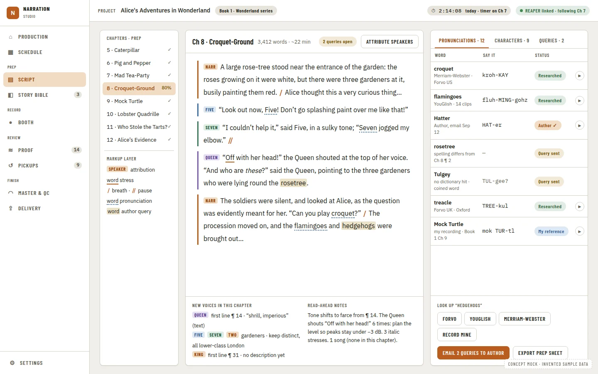

# Prep Depth: Speaker Attribution, Script Markup, Pronunciation Sources and Author Queries

**Source:** [Audiobook studio benchmark](../research/audiobook-studio-benchmark.md) recommendation 6 ("Prep depth: Speaker attribution and a markup layer. Web lookups that open in the browser, so the app stays local-only. A narrator-edited pronunciation store with its sources. Author query export.") and §1 "Prep" (must-haves: "Hard words and character names pulled out... automatically" [L9][W20]; "A pronunciation list: the word, the chosen pronunciation, the source, a recorded snippet, and whether the author confirmed it" [W19b][W20]; "One-click lookups in Forvo, YouGlish, Merriam-Webster and Howjsay" [W19b][W20]; "Script markup (stress, pauses, character tags) that carries through to the booth view" [W24]; differentiator "Speaker attribution for each line of dialogue" and "A questionnaire of queries for the author or rights holder, exported and tracked until it is answered"). Part of the benchmark train wave 3/4 ([agent train](../operations/agent-train.md)).

**Shares ground with:** [Character Continuity Review](character-continuity-review.prd.md) Phase 2 ("Stable characters, dialogue cues, appearance maps"), which already specifies the rules-based dialogue-cue extraction this PRD's speaker attribution reads rather than re-specifying — see Evidence and Open Question Q1. **Sibling:** [Provider Ports](../architecture/provider-ports.md) Open Question Q5 declares a `BrowserLookup` role on `PronunciationSource` with no implementation; this PRD implements it.

Citations are `file:line` on `main` at `48a882d` for anything checked in code; "per docs" marks a claim taken from another PRD and not independently re-verified in this session.

## Problem Statement

Prep in this app stops at what the importer and Manuscript Guide already produce: a character list with evidence-backed notes, and a pronunciation the narrator can preview but that carries no source, no confirmation state and no way to ask the author about it. The benchmark's own scorecard marks "Narrator-edited pronunciation store; lookups in Forvo, YouGlish and Merriam-Webster; author queries" as **Planned / Missing** ("Only an offline WordNet lookup is shipped. There are no web-source lookups and no author-query export") and "Speaker attribution for each line of dialogue; script markup for stress and pauses" as **Missing** outright ("Reader notes and bookmarks only"). A narrator prepping a multi-character book today has to keep a separate spreadsheet or sticky notes for who is speaking each line, how a word should be stressed, and which pronunciations still need the author's sign-off — exactly the kind of bookkeeping the benchmark found narrators doing by hand [L53]-adjacent, and exactly the gap a two-way, in-app prep surface is meant to close.

## Evidence

Verified in code (`48a882d`):

- **Pronunciation already carries a source and a chosen flag, but no status or note.** `GuidePronunciation = { ipa: string; source: string; confidence: string; chosen?: boolean }` (`apps/ui/src/api/contracts/storyBible.ts:7`), one per entity name and per alias (`:11,19`). `pronounce_source(name, espeak_library, source)` (`sidecars/manuscript-guide/core/manuscript_guide.py:452-490`) only ever returns `cmu` or `espeak` (`PRONUNCIATION_SOURCES = {"cmu", "espeak"}`, `:449`); there is no `user` source, so a narrator's own edited pronunciation cannot be distinguished from a dictionary lookup, and nothing records "the author confirmed it" (the benchmark's must-have).
- **Only one offline lookup exists.** The scorecard's own line: "Only an offline WordNet lookup is shipped" (per docs, story-bible-and-import-ux-briefs PRD dictionary/thesaurus integration). A search of `sidecars/manuscript-guide` and `apps/desktop` for `forvo`, `youglish`, `merriam` and `howjsay` (case-insensitive) finds nothing.
- **Entities already carry evidence-backed personality notes and relationships, the precedent for a queries list.** `personality_notes` is a list of `{text, evidence: {chapter, excerpt}}` (`manuscript_guide.py:618`, `:903` for a user-authored note with `"User edit"`/`"User-authored note."` in place of a chapter/excerpt); `relationships` is a similar evidence-carrying list (`:620`, merge logic at `:1106-1116`). An author-query list is the same shape: a question, its evidence (the word or line in context), and a status, kept alongside the entity or the pronunciation entry it is about.
- **No dialogue, speaker or quote extraction exists today.** A search of `manuscript_guide.py` for `speaker`, `dialogue` and `quote` (case-insensitive) finds nothing (confirmed again in this session). [Character Continuity Review](character-continuity-review.prd.md) Phase 2 already specifies exactly this work — "rules-based cue extraction... (quote spans, adjacent 'said Name' and alias patterns, per-scene continuation) with `unknown` when unclear and a narrator correction path" (per docs, that PRD's Open Question Q4) — for its own purpose (locating dialogue audio to compare against a character's approved voice reference). That PRD's own Phase 2 status note (2026-09-26, stream A8, per docs) records it was **not delivered**, flagged on `#509` as lane B's (`sidecars/manuscript-guide/core/manuscript_guide.py`) rather than lane A's, and recommends it land either in lane B or as a short lane-A/C follow-up once the sidecar JSON shape is real.
- **No markup layer (stress, pauses, character tags) exists.** A search for `markup`, `stress mark` and `pause mark` in `apps/ui/src` and `sidecars/manuscript-guide` finds nothing beyond generic Markdown/inline-formatting spans (`docs/adr/0014-inline-formatting-as-offset-spans.md`, per docs — an existing precedent for *how* a span-based layer would be represented, offsets into the manuscript text, not a new text format).
- **A span-highlighting primitive and precedent already exist for rendering an overlay on script text.** `Highlight` primitive (per docs, `docs/adr/0016-highlight-primitive.md`) and the proofing diff's own word-level marks (`docs/adr/0063-the-proofing-diff-marks-its-own-words-and-adr-0016-covers-entry-highlights.md`, per docs) are the established pattern for drawing marks over manuscript text without a new rendering engine; a markup layer's stress/pause/character-tag spans are one more consumer of that pattern, not a new one.
- **The provider ports PRD already reserves the seam this PRD needs.** `provider-ports.prd.md` Open Question Q5: "Is 'web lookup opens in the browser' a `PronunciationSource`? Recommendation: yes, as a separate role (`BrowserLookup`, returns a URL the host opens, never fetched by the app). The role is declared here with no implementation; the source itself belongs to benchmark recommendation 6's PRD" — this PRD.
- **The host already opens URLs and files in the narrator's own applications, so opening a browser tab is not a new trust boundary.** Per docs (existing "open in default application" bindings used elsewhere in the app, for example opening an exported report); this PRD's web lookups reuse that same "open, never fetch" shape.

Per docs (not independently re-verified in this session): the four look-up sites' exact URL-query shapes (Forvo, YouGlish, Merriam-Webster, Howjsay) are cited by the benchmark [W19b][W20] as differentiators professionals use, but their precise URL formats are not read from each site in this session (Phase 0 verifies before shipping, mirroring how the delivery-platform-profiles PRD's own Phase 0 verified ACX's numbers before building against them).

**D72 (2026-09-27, owner decision, #509/#510): pronunciation stays local-first, with one narrator-initiated online source.** The owner decided pronunciation gets a full offline precedence chain before it ever reaches the network, plus exactly one optional online dictionary (Merriam-Webster), on the narrator's own API key. This changes two things this PRD's own Success Metrics and [provider-ports](../architecture/provider-ports.md) Open Question Q5 stated as absolute ("no network call from the app for a lookup"; "never fetched by the app"): [ADR 0405](../adr/0405-pronunciation-stays-local-first-behind-cmu-wiktextract-and-espeak-with-merriam-webster-as-the-one-narrator-keyed-online-source.md) records the scoped exception, the sources and their licences, the key-storage decision and the privacy rule; Phases 8 to 10 below implement it. Evidence for that ADR:

- **The pronunciation source registry already orders itself by registration, and the narrator's own entry already sits outside it.** `SourceRegistry.fallback_order()` returns registration order (`libs/python/narration_common/ports/pronunciation.py:88-93`); `sidecars/manuscript-guide/core/providers.py` registers `CmuSource` before `EspeakSource` "so it stays the default the build-time fallback tries first" (`:1-4`, D13). Prep depth Phase 1 (#745, open) found that `user` is "a provenance label, not a registered source" (that PR's own description): the narrator's own entry wins through `GuidePronunciation.chosen`/`alternate`, never through the registry. D72's "precedence order" is therefore two mechanisms already in the codebase, not one new one: a registry order (`cmu` → a new `wiktextract` row → `espeak`) the build-time fallback tries only when there is no narrator override, and the existing `chosen`/`alternate` override that always wins regardless of which registry row answered.
- **eSpeak NG is already a shipped, already-cleared GPL-3 dependency, not a new one.** `EspeakSource` (`providers.py`) already runs the frozen Story Bible sidecar's letter-to-sound fallback (confidence `"low"`) through `phonemizer`/eSpeak NG. [Local dependency evaluation](../research/local-dependency-evaluation.md#license-classes) already accepts it: "Narration Utils is itself AGPL-3.0-or-later ... and already ships GPL-family code in the frozen Story Bible sidecar (Piper, phonemizer, eSpeak NG data), so a GPL-3.0-or-later component is compatible." D72's "letter-to-sound guess" is a labelling and precedence change to this existing source (Q9), not a new licence decision, and not the permissive-alternative search the train prompt raised as a fallback question.
- **CMU (`pronouncing`/`cmudict`) is likewise already an accepted dependency** (per docs, `local-dependency-evaluation.md:214` lists `cmudict` among the already-evaluated packages the base release ships); this PRD reuses it as-is.
- **Wiktionary/Wiktextract is the one genuinely new licence this feature needs.** The same research doc already looked at it once, for the reader's dictionary lookup, and deferred it: "Wiktionary-derived extracts | Share-alike terms (CC BY-SA), not one of the four classes in License classes | Actively maintained upstream, but no single reviewed extract artifact | Deferred: share-alike is not yet a reviewed class in this policy; would need its own policy decision before adoption, not folded into this one" (`local-dependency-evaluation.md`, the Open English WordNet candidates table). ADR 0405 is that policy decision, scoped to this feature's displayed IPA only. **Per upstream docs, not verified here:** the egress proxy in this session refused `kaikki.org`, `en.wiktionary.org` and `dictionaryapi.com` (checked 2026-09-27, `EGRESS_BLOCKED`). Per public documentation of those projects, Wiktionary's own text is dual-licensed CC BY-SA (4.0 for new contributions) / GFDL, and kaikki.org's Wiktextract project republishes structured JSON extracts of Wiktionary under the same share-alike terms as the source text with attribution to Wiktionary and its contributors; Phase 8's own Phase 0 re-reads the exact wording and the exact dated release file once a session can reach either host.
- **The asset-catalog pattern this PRD reuses for Wiktextract is precedented twice already.** The Open English WordNet dictionary (`config/dictionary-assets.json`, cited above) and the FFmpeg encoder build ([docs/research/ffmpeg-encoder-build.md](../research/ffmpeg-encoder-build.md), render-encode-master Phase 0/1) both catalog a pinned third-party download (immutable URL, SHA-256, size, licence, provenance link) that a narrator confirms before it downloads, and both keep only a derived, install-time-built artifact rather than the raw upstream archive ([ADR 0136](../adr/0136-an-asset-may-keep-only-a-file-built-at-install-from-its-verified-archive.md)); the FFmpeg note also shows the working pattern for "the egress proxy in this session could not reach the canonical source, so a reachable mirror (PyPI) was pinned instead and the choice was flagged to the owner" (#510), which Phase 8's own Phase 0 can reuse if `kaikki.org` stays unreachable when that phase starts.
- **No credential store exists in this app yet.** `apps/desktop/internal/settings/store.go` keeps every setting in plain per-user/per-project JSON; a search of `apps/desktop` for "keyring", "credential" and "DPAPI" finds nothing. Merriam-Webster's API key (Phase 9) is the first secret this app stores at rest, so ADR 0405 records where it goes (Q10).

## Proposed Solution

Deepen prep in three additive layers that never require a second import or re-extraction the narrator did not ask for:

1. **Pronunciation depth.** Extend the pronunciation entry with a `status` (`researched`, `author_confirmed`, `query_sent`) and an optional note, add a `user` source for a narrator-typed override (never silently replacing the dictionary's own answer — both stay, one `chosen`), and a **query list** derived from every pronunciation whose status is not `author_confirmed`, exportable as a plain file the narrator can send to an author or rights holder and re-import (or hand-mark) once answered.
2. **Web lookups.** A `PronunciationSource.BrowserLookup` implementation per site (Forvo, YouGlish, Merriam-Webster, Howjsay): one host call that opens the narrator's default browser to that site's search for the word, never fetched or scraped by the app.
3. **Speaker attribution and script markup.** Read the dialogue cues [Character Continuity Review](character-continuity-review.prd.md) Phase 2 already specifies (built wherever it lands, lane B or a short follow-up — Q1), and render them in the reader as speaker tags on dialogue lines. Add an independent, additive **markup layer**: narrator-placed spans over the manuscript text for stress, pause and a character tag override, stored the same offset-span way inline formatting already is (ADR 0014, per docs), rendered with the existing `Highlight` primitive (ADR 0016, per docs). The markup layer is designed to **carry through to the booth view** (the benchmark's own phrase) by being a plain, versioned, chapter-scoped data file any later booth-mode PRD can read — this PRD does not build the booth view itself.
4. **Local-first pronunciation sources, and one online source (D72, Phases 8-10).** Deepen the pronunciation answer itself, not just its bookkeeping: an offline precedence chain (the narrator's own entry, then the CMU dictionary, then Wiktionary IPA through Wiktextract, then a clearly labelled letter-to-sound guess) answers every lookup with no network call, and one optional, narrator-keyed online source (Merriam-Webster) answers when the narrator chooses to reach further, on their own account and API key, one word at a time, cached locally. Wikimedia Commons audio links surfaced from the same Wiktextract data are opened or played on request, never fetched by the app. [ADR 0405](../adr/0405-pronunciation-stays-local-first-behind-cmu-wiktextract-and-espeak-with-merriam-webster-as-the-one-narrator-keyed-online-source.md) records the scope, the sources' licences, the key storage and the privacy rule.

## Key Hypothesis

We believe that a narrator-owned pronunciation status and query export, web lookups that never leave the local-only boundary, and a markup layer that reuses the existing dialogue-cue and highlight machinery will let a narrator finish prep for a multi-character book inside the app, without a side spreadsheet. We'll know we're right when: every pronunciation not yet author-confirmed appears on one exportable query list; a lookup opens the correct external site with no network call from the app itself; and a markup span placed during prep is still there, unchanged, when the same chapter is read in any later view that reads the same file.

## What We're NOT Building

| Item | Why |
| --- | --- |
| A second dialogue-cue extractor | [Character Continuity Review](character-continuity-review.prd.md) Phase 2 already specifies rules-based cue extraction; this PRD is a consumer of that output, not a second producer (Q1) |
| Fetching, scraping or caching any lookup site's content | `BrowserLookup` only opens a URL in the narrator's own browser (provider-ports Q5); the app stays local-only (roadmap product boundary) |
| The booth view itself | The booth-mode-and-companion-panel PRD (stream N-D1 of this train, per docs) builds the reading surface; this PRD only makes the markup layer a plain file that view can read |
| AI-generated pronunciations, or auto-answering an author query | Precision-first, evidence-based prep only (mirrors ADR 0020's precision-over-recall stance, per docs); a query is answered by the author or the narrator, never guessed |
| A structured questionnaire builder, ticketing or reminders for the author | The query list is an export the narrator sends by whatever means they already use (email, a shared doc); no in-app messaging |
| Tracking an author's answer automatically | The narrator marks a query `author_confirmed` by hand after hearing back; no email parsing or webhook |
| Full character-bible relationship review or export | Already out of scope in [Character Continuity Review](character-continuity-review.prd.md)'s own "What We're NOT Building" (`manuscript-guide.md` "later work"); this PRD does not reopen it |
| A pronunciation confidence score change from the existing CMU/eSpeak pipeline | Confidence stays whatever the dictionary source reports (`GuidePronunciation.confidence`); this PRD adds status and source, not a new confidence model |

## Success Metrics

| Metric | Target | How Measured |
| --- | --- | --- |
| Query list completeness | Every pronunciation entry not `author_confirmed` appears exactly once on the export | Go/Python table test |
| No network call from the app for a lookup | `BrowserLookup` opens a URL through the host's existing "open externally" path and makes zero HTTP requests itself. Unchanged for the four Phase 2 browser lookups; Merriam-Webster (Phase 9) is the one narrator-initiated exception [ADR 0405](../adr/0405-pronunciation-stays-local-first-behind-cmu-wiktextract-and-espeak-with-merriam-webster-as-the-one-narrator-keyed-online-source.md) scopes and records, covered by the row below | Test asserting no client is constructed for `BrowserLookup`/`Commons`; code review |
| Merriam-Webster calls are single-word, narrator-scoped and cached (D72) | A lookup's request carries the looked-up word and nothing else — never a passage, a file name or a project id; a second lookup of the same word makes no second request; a batch needs one confirmation naming the word count; nothing is logged (Q11) | Go test asserting the built request's body/query and headers; a test asserting the local cache is read before any request is built; a test grepping the host log and run log for the raw key and the looked-up word after a lookup |
| Markup survives independent of extraction | A markup span placed by the narrator is unchanged after a Manuscript Guide rebuild that does not touch that chapter's text | Go/Python test: rebuild with unchanged text preserves markup exactly |
| Attribution accuracy (borrowed from Character Continuity Review's own Q4 gate) | Labeled-quote evaluation reported once that PRD's Phase 2 lands; this PRD's speaker tags never show a guess where the extractor said `unknown` | Shared fixture set; `unknown` renders as unattributed, never a fabricated name |
| Wire contracts | Every new payload has a Zod schema, a golden, a `wireContracts.test.ts` row and a passing mock | `pnpm check` |
| Gate | `pnpm check` (full) green; visual suite for the reader's new markup/attribution states and the pronunciation panel at every viewport | CI and PNG review |

## Open Questions

Every question takes its recommendation by default (D22, per the [implementation plan](implementation-plan.md)); anything genuinely needing the owner is filed as a Proposed ADR and a comment on #510.

- [ ] **Q1. Who builds the dialogue-cue extractor this PRD's speaker attribution reads?** (A) Wait for [Character Continuity Review](character-continuity-review.prd.md) Phase 2 to land (lane B, per its own status note) and consume its output as-is. (B) This PRD's own Phase 2 builds a minimal, separate cue extractor in lane B scope, coordinated on #509 to avoid duplicating that PRD's Phase 2. (C) Build attribution UI now against a fixture, wire the real extractor in when either lands. **Recommendation: (C).** The two PRDs need the exact same extractor; building it twice would diverge. This PRD's Phase 2 builds the reader-side attribution UI and the markup layer against a recorded fixture shape, and swaps to the real sidecar output in a follow-up phase once either PRD's cue work lands — recorded here as a Proposed ADR if the owner wants a single shared phase instead.
- [ ] **Q2. Does a narrator-typed pronunciation override replace the dictionary's answer, or sit beside it?** (A) Beside it: both `cmu`/`espeak` and `user` entries exist per name/alias, one `chosen`, so switching back never re-runs the dictionary. (B) Replace: editing overwrites the dictionary entry. **Recommendation: (A).** `GuidePronunciation.chosen` already models "one of several is picked" (Evidence); reusing it for a `user` source needs no new concept, and a narrator who mistypes an override can revert to the dictionary's answer without re-triggering a lookup.
- [ ] **Q3. Query export format?** (A) Plain text/Markdown (one line per query: word, chapter, excerpt, current pronunciation, status). (B) CSV, mirroring the proofer's own CSV import/export shape (`docs/prds/review-dashboard-and-findings-adoption.prd.md`, per docs). **Recommendation: (B)**, so the same "email or hand a file to someone outside the app" pattern the proofer CSV already established is reused rather than inventing a second export shape.
- [ ] **Q4. Which four lookup sites ship, and are more addable later?** (A) Exactly Forvo, YouGlish, Merriam-Webster and Howjsay (the benchmark's own list [W19b][W20]), each a fixed URL template verified in Phase 0. (B) A configurable list the narrator can edit. **Recommendation: (A)** for v1 (matches the benchmark's differentiator list exactly); a configurable list is a small Could if a narrator asks for a fifth site.
- [x] **Q5. Where does markup live?** *(Phase 5: A, [ADR 0382](../adr/0382-script-markup-is-a-chapter-keyed-sidecar-of-line-offsets-checked-on-read-and-drawn-without-changing-the-text.md); offsets are per line, not per chapter.)* (A) A new project-scoped, chapter-keyed sidecar (`<project>/narration-utils/prep/markup.json`), spans as `{start, end, kind: stress|pause|character_tag, value?}` offsets into the chapter's own text, mirroring the inline-formatting offset-span precedent (ADR 0014, per docs). (B) Inline in the manuscript JSON itself. **Recommendation: (A).** Keeping markup in its own sidecar (like `character/references.json`) means a manuscript rebuild that only touches derived data never risks corrupting narrator-placed spans, and a later booth-mode PRD reads one small, clearly-owned file.
- [x] **Q6. Does the markup layer validate spans against the current chapter text on read?** *(Phase 5: A, [ADR 0382](../adr/0382-script-markup-is-a-chapter-keyed-sidecar-of-line-offsets-checked-on-read-and-drawn-without-changing-the-text.md).)* (A) Yes: an offset outside the current text length, or one whose underlying substring no longer matches what was recorded at placement time, is reported as "stale" rather than silently applied at the wrong position. (B) No validation; trust the offsets. **Recommendation: (A)**, mirroring [Character Continuity Review](character-continuity-review.prd.md)'s own "changed since approval" detection for regions (Q2/Q3 of that PRD, per docs) — the same discipline applied to text offsets instead of audio ranges.

D72 adds:

- [ ] **Q7. Exact registry order for the three offline dictionary sources?** (A) `cmu` → `wiktextract` → `espeak`, registered in that order in `providers.py`, so `SourceRegistry.fallback_order()` (registration order, Evidence) tries the better dictionary before the letter-to-sound guess, with the narrator's own `chosen` entry (Phase 1) always winning regardless of registry order. (B) Make the order a setting. **Recommendation: (A).** A narrator who wants a different answer always has the override (Phase 1); a per-source setting is a small Could if ever asked for.
- [ ] **Q8. Does Wiktextract ship the full kaikki.org English dump, or a filtered pronunciation-only extract?** (A) Phase 0 finds or builds a pronunciation-only subset (word → IPA, word → Commons audio filename) at catalog-build time, keeping only that derived file at install (mirrors the WordNet Derive step, ADR 0136), never the multi-gigabyte raw dump. (B) Ship the raw dump and derive locally at install, as WordNet's own archive does but at a much larger download size. **Recommendation: (A).** The full Wiktextract English JSONL release runs to several gigabytes; a narrator's first-use download should be sized like WordNet's (tens of MB, Evidence), not an order of magnitude larger, and Phase 0 is exactly where the FFmpeg encoder build's own Phase 0 already proved "verify size and shape before committing a catalog row."
- [ ] **Q9. Letter-to-sound label?** (A) The existing `EspeakSource` answer's label becomes "Letter-to-sound guess (eSpeak NG)" (or the "Say it" column's row gets a `kind: guess` flag rendered as a distinct badge), so a narrator never mistakes a guess for a dictionary hit. (B) Leave the existing "eSpeak NG" label and rely on its already-lower confidence alone. **Recommendation: (A)**, matching D72's own words ("a clearly labelled letter-to-sound guess") and the "Say it" column of the prep-script mock, which names a source per row (D69, #754).
- [ ] **Q10. Where does the Merriam-Webster key live?** (A) Windows: encrypted at rest with `CryptProtectData` (DPAPI, current-user scope; no new dependency, since a Windows syscall wrapper is already reachable from the Wails toolchain), stored as an opaque blob in the per-user settings file, decrypted only in memory for the length of one lookup request and never logged (matches `hostlog`'s existing "never the data" policy, Evidence). macOS/Linux (preview builds, no installer yet, per [first-use provisioning](../architecture/first-use-dependency-provisioning.md)'s "Windows first" section): stored in the same per-user file in the clear, with a Settings-page note that the platform store is not implemented yet. (B) A cross-platform Go keyring library. **Recommendation: (A).** Windows-first mirrors every other "Windows first, previews elsewhere" split already in this repository; a bundled keyring dependency (and, on Linux, a `libsecret`/D-Bus runtime requirement) is exactly the kind of added trust surface [provider ports](../architecture/provider-ports.md) already avoids for Python plugins ("plugins would widen the trust boundary").
- [ ] **Q11. What counts as the "single word" the app may send, and how is a batch opt-in shown?** (A) The exact string the narrator is looking up (the entity name or alias, never a sentence or surrounding text); a batch (looking up every un-confirmed pronunciation query at once, Phase 3) needs one confirmation dialog naming the word count and the API before it starts, and a single Look-up press needs no dialog. (B) Always ask, even for one word. **Recommendation: (A)**, mirroring how Phase 2's own browser lookups already need no confirmation dialog for a single click; a batch is the one case D72's privacy rule asks to gate.
- [ ] **Q12. Are Wikimedia Commons audio links played in-app or opened externally?** (A) Opened externally, the same "open in default application" pattern `BrowserLookup` already uses: the app never fetches or streams the file, so a Commons file's own (per-file) licence is the narrator's own listening choice, not a redistribution the app makes. (B) Fetched and played through the app's own audio element. **Recommendation: (A).** Fetching audio from Commons on every request is a network call D72's privacy rule does not authorize (D72 opens exactly one exception, Merriam-Webster, and only for text); "played" in D72's own phrasing is satisfied by handing the link to the narrator's default browser or media player, exactly like every other browser lookup this PRD already ships.

## Users & Context

**Primary user:** a solo author-narrator prepping a multi-character manuscript, who wants to know who is speaking each line, how to stress and pace tricky words, and which pronunciations still need the author's sign-off before recording begins.

**Current behavior:** keeps a separate document or sticky notes for pronunciation questions to send the author, re-derives who is speaking by re-reading the surrounding paragraph each time, and marks up a printed or separately-annotated script for stress and pauses.

**Trigger:** starting prep on a new chapter or book; realizing a pronunciation needs the author's confirmation before recording; wanting the booth view to show who is speaking without re-reading ahead.

**Job to be done:** when I am prepping a chapter, I want speaker attribution, my own stress/pause markup, and a clear list of what pronunciation questions are still open, so that recording day has nothing left to figure out on the fly.

**Non-users:** readers of a single-narrator, single-voice book with no attribution need; anyone wanting the app itself to message the author.

## Solution Detail

### Core capabilities (MoSCoW)

| Priority | Capability | Phase |
| --- | --- | --- |
| Must | Pronunciation status, `user` source, query list data model | 1 |
| Must | `BrowserLookup` implementations for the four sites, Phase 0 URL verification | 2 |
| Must | Query export (Q3) and a "mark answered" action | 3 |
| Must | Speaker attribution reader UI against the shared cue output (real once available, fixture until then — Q1) | 4 |
| Must | Markup layer: data model, placement UI, staleness detection (Q6) | 5 |
| Should | Query re-import (the author's answers marked back onto the list) | 6 |
| Could | A per-chapter "prep completeness" summary read by the production board (this train's Production Tracking PRD) | 7 |
| Must | Wiktionary/Wiktextract offline `PronunciationSource`, registry precedence and letter-to-sound labelling (D72, Q7-Q9) | 8 |
| Should | Merriam-Webster online `PronunciationSource`: narrator's own key, single-word fetch, local cache, privacy rule (D72, Q10-Q11) | 9 |
| Could | Wikimedia Commons audio links from Wiktextract, opened on request (D72, Q12) | 10 |
| Won't | A second cue extractor, fetching lookup sites (beyond Merriam-Webster's own text lookup, D72), the booth view itself, in-app author messaging | See table above |

### MVP scope

Phases 1 to 5: pronunciation depth, web lookups, the query export, and speaker attribution plus markup in the reader.

### User flow

1. In the Story Bible / pronunciation view, each entry shows its dictionary pronunciation, an optional narrator override, a status, and **Look up** buttons for the four sites — pressing one opens the narrator's browser.
2. Entries not yet `author_confirmed` collect on a **Pronunciation queries** panel; **Export** writes the CSV (Q3).
3. Once the author replies, the narrator marks each answered query `author_confirmed` (typed in, or matched against a re-imported file per Q6/Should).
4. In the reader, dialogue lines show a speaker tag (from the shared cue output, `unknown` shown as unattributed, never guessed); the narrator places stress, pause and character-tag markup spans directly on the script, rendered with the existing highlight styling.
5. A stale markup span (Q6) shows a small "text changed here" notice rather than silently landing on the wrong words.

## Technical Approach

**Feasibility: HIGH** for Phases 1, 2, 3 and 6 (additive data model, small Go/Python changes, a host "open externally" call already exists as a pattern). **MEDIUM** for Phase 4 (depends on Q1's fixture-then-real sequencing) and Phase 5 (offset-based staleness detection over manuscript text is a new but bounded algorithm, analogous to region "changed since approval"). **HIGH** for Phase 8 (one more registry row and catalog entry, same shape as WordNet/FFmpeg) and Phase 10 (an "open externally" consumer of Phase 8's own data). **MEDIUM** for Phase 9 (the first credential-at-rest and the first real outbound HTTP call this app's pronunciation code makes, so it needs its own depguard exception and key-storage code, Q10).

**Architecture:**

- **Pronunciation depth.** `pronounce_source` gains a `user` branch (`sidecars/manuscript-guide/core/manuscript_guide.py`) that never calls CMU/eSpeak; `GuidePronunciation` gains `status: 'researched' | 'author_confirmed' | 'query_sent'` and `note?: string` (TS contract, `apps/ui/src/api/contracts/storyBible.ts`), additive so existing entries default to `researched`. `Service.Pronounce` (`apps/desktop/internal/guide/service.go:299`) gains the `user` source path and a status-setting call.
- **Query list.** A pure function over entities' pronunciation entries (no new store — derived, like `VocabularyCandidates` derives from entities, `service.go:385`), returning every non-`author_confirmed` entry with its evidence (chapter, excerpt) reusing the `personality_notes`-shaped evidence object already in the entity schema (Evidence). Export writes CSV (Q3), mirroring the proofer CSV shape (per docs).
- **Web lookups.** New `apps/desktop/internal/pronunciationlookup` (or a `PronunciationSource` adapter under the provider ports' registry once that PRD's Phase 3+ lands, per docs) with one URL template per site, verified in Phase 0 against each site's own search-URL shape (mirrors delivery-platform-profiles PRD's own Phase 0 verification discipline); a binding `PronunciationLookupOpen(source, word)` that calls the host's existing "open externally" path — no HTTP client is constructed in this package (Success Metrics: zero network calls, enforced by a test that fails if `net/http` is imported).
- **Speaker attribution.** Reads whichever dialogue-cue output exists at the time Phase 4 starts (Q1); until then, a recorded fixture shape (agreed with [Character Continuity Review](character-continuity-review.prd.md)'s own cue contract so the swap is a data-source change, not a UI rewrite). Rendered in the reader as a small speaker-tag chip beside each attributed line; `unknown` lines render with no tag, never a placeholder name.
- **Markup layer.** New `apps/desktop/internal/prepmarkup` (or Python-side under `manuscript-guide` if co-located with the manuscript text it annotates — decided at Phase 5 planning): `Span{Start, End, Kind: stress|pause|character_tag, Value?}` per chapter, stored in `<project>/narration-utils/prep/markup.json` (Q5), atomic temp-then-rename like every other sidecar. On read, each span's underlying substring is re-checked against the current chapter text (Q6); a mismatch marks the span `stale` rather than repositioning it. Rendered with the existing `Highlight` primitive (ADR 0016, per docs), the same pattern the proofing diff already uses for its own word marks (ADR 0063, per docs).
- **Bindings.** `PronunciationSetStatus`, `PronunciationSetUserOverride`, `PronunciationQueries`, `PronunciationExportQueries`, `PronunciationLookupOpen`, `PrepMarkupList`/`PrepMarkupSave`/`PrepMarkupDelete`. Each on `h.services()` with a `stressReaders` row; `hostAPIVersion` bumps once per phase adding bindings.
- **Wire contracts (CLAUDE.md).** `apps/ui/src/api/schemas/prepDepth.ts` (pronunciation status/source, query row, markup span); goldens `tests/fixtures/contracts/prep-*.json` written by Go/Python tests with `UPDATE_CONTRACTS=1`; rows in `wireContracts.test.ts`; mocks in `mockApi.ts`. No `as` cast or bare `JSON.parse`.
- **UI.** Extends the existing Story Bible pronunciation view (no new primitive expected beyond composing existing ones — `Table`, `Select`, `TextField`, `Pill`/`StatusBadge` for status); the reader's speaker tag and markup rendering reuse `Highlight`. Visual suite: pronunciation queries panel, a lookup button row, reader states with attribution and markup, all viewports; axe clean.
- **Trust boundary.** `prep/markup.json` and the query export file are narrator-editable-on-disk files the app reads back; rows in `docs/architecture/threat-model.md` and `SECURITY.md` (tampering only corrupts the narrator's own prep annotations, never audio). Opening a browser to an external URL is a new outbound-trust row: the app never sends the manuscript's own text to the site beyond what the narrator sees in the URL (the word itself), and never reads the site's response. Phase 9's Merriam-Webster call is a second, narrower new row (the one place this app's pronunciation code makes a real HTTP request): a threat-model row and a `SECURITY.md` bullet are scope items of Phase 9 itself, not of the phase that specifies it here (Phase 9's own PR adds them, per D72's own instruction).
- **Offline precedence (D72).** `providers.py` registers a new `WiktextractSource` between `CmuSource` and `EspeakSource` (Phase 8); `SourceRegistry.fallback_order()` needs no code change beyond that registration (Evidence). The install-time derived index and its catalog row (`config/wiktextract-assets.json`) follow the WordNet/FFmpeg pattern exactly: a pinned, hashed, licensed download, unpacked and reduced to one small lookup file at install (`internal/assets`, [ADR 0136](../adr/0136-an-asset-may-keep-only-a-file-built-at-install-from-its-verified-archive.md)'s Derive step), never the raw multi-gigabyte dump kept on disk (Q8). Every displayed Wiktextract answer carries its CC BY-SA attribution the same way the reader's WordNet lookup already does ([ADR 0097](../adr/0097-the-manuscript-reader-word-lookup-uses-the-open-english-wordnet-as-a-downloadable-asset.md)) and is listed in `THIRD-PARTY-NOTICES.txt`. The existing `EspeakSource` answer is relabelled a letter-to-sound guess (Q9); nothing about eSpeak NG's own licence changes (Evidence).
- **Online lookup (D72).** A new Go package the Phase 9 threat-model row names explicitly (never the existing `pronunciationlookup` browser-only package, so the "zero HTTP requests" test `BrowserLookup` already has stays true for it); the binding takes only the looked-up word, builds the request itself from a fixed host and path (never a UI-supplied URL or query string), reads the narrator's key from the Q10 store, and caches the parsed answer beside the existing pronunciation entry (Phase 1's store) so a repeat lookup, or an offline narrator, is served from cache and makes no request. `.golangci.yml`'s `depguard` rule gains one narrowly scoped allow row for this package alone, alongside the three it already lists (`internal/assets`, `internal/update`, `media.go`) in the threat model's "What the app sends off the machine" table.
- **Key capture (D72).** A `PronunciationApiKeySet`/`PronunciationApiKeyStatus` pair of bindings (the second reports only present/absent, never the key); the first-use prompt's "open the sign-up page" action reuses the same "open externally" host call as Phase 2's browser lookups and every other outbound URL open in the app. The key is stored per Q10 (Windows: DPAPI-encrypted in the per-user settings file; other platforms: the same file, in the clear, with a Settings-page note); it is never included in the host log, the run log, or any diagnostics export.
- **Commons audio (D72).** Read from the same Wiktextract-derived index (Phase 8) keyed by word; opened, never fetched (Q12), through the same "open externally" path as Phase 2 and the Q10 sign-up prompt. Phase 10 builds against a recorded fixture shape until Phase 8 lands (mock-first behind the port, D67), the same fixture-then-real pattern this PRD's own Phase 4 already uses for Q1.
- **ADRs.** One ADR at Phase 1 or 2 (pronunciation status/source model, mirroring how [Actual Recorded](actual-recorded-column.prd.md) and the delivery profiles PRD each got an ADR for a "what does this number/status actually mean" decision) and, if Q1 resolves to a shared phase with Character Continuity Review, a coordinating note in that PRD's own Decisions Log rather than a second ADR. **D72 (Phases 8-10) gets its own ADR**, [0405](../adr/0405-pronunciation-stays-local-first-behind-cmu-wiktextract-and-espeak-with-merriam-webster-as-the-one-narrator-keyed-online-source.md), since it supersedes, for dictionary data only, this PRD's own "no network call from the app for a lookup" boundary and [provider-ports](../architecture/provider-ports.md) Q5's "never fetched by the app" wording — a decision reversal, which this PRD's own rules (ADRs are immutable) require a new ADR to record rather than an edit to either document. Next free number in lane D's block (0400-0409): 0404 is claimed by an open PR (#760, production-tracking Phase 4) at the time this was written, so this PRD uses 0405, checked at write time and again before the last push (D52 on #509).

**Technical risks:**

| Risk | Likelihood | Mitigation |
| --- | --- | --- |
| Lookup site URL formats change or were never verified against the live site | Medium | Phase 0 verification step, same discipline as delivery-platform-profiles Phase 0 |
| Speaker attribution ships against a fixture that diverges from the real extractor's eventual output shape | Medium | Q1's shared-contract coordination with Character Continuity Review before Phase 4 starts |
| Two PRDs (this one and Character Continuity Review) both try to own `manuscript_guide.py`'s cue extraction | Medium-High | Coordinated on #509 per Q1; only one phase, in either PRD, actually implements the extractor |
| Markup staleness detection false-positives on trivial text changes (whitespace) | Low-Medium | Normalize whitespace before the substring comparison; test fixtures for common edit shapes |
| Query export drifts from the proofer CSV's own column conventions, confusing a narrator who uses both | Low | Phase 3 reviews the proofer CSV's existing columns before finalizing this export's shape |

## Implementation Phases

| # | Phase | Description | Status | Parallel | Depends | Ports used | PRP Plan |
| --- | --- | --- | --- | --- | --- | --- | --- |
| 1 | Pronunciation status and user source | `user` pronunciation source, `status`/`note` fields, bindings, ADR | complete: ADR 0346; `status`/`note`/`alternate` on each pronunciation, `pronounce-user`/`pronunciation-use-alternate`/`pronunciation-status`, three bindings (`hostAPIVersion` 69), the Story Bible controls and `storybible/entry-pronunciation-work` | 2 | - | none | - |
| 2 | Web lookups (Phase 0 + implementation) | URL verification note, `BrowserLookup` adapters for the four sites, "open externally" binding | complete | 1 | - | `PronunciationSource.BrowserLookup` (`provider-ports.prd.md` Q5) | - |
| 3 | Query export | Derived query list, CSV export (Q3), "mark answered" action | complete: ADR 0347; `guide.Service.PronunciationQueries` (derived, reading order), `QueriesCSV` with a formula guard and `ParseQueriesCSV` (read-back proven, applying it is Phase 6), `GuidePronunciationQueries`/`GuidePronunciationQueriesCSV` (`hostAPIVersion` 70), the Story Bible's Pronunciation queries slide-over (Export CSV, Mark sent, Mark answered), `storybible/pronunciation-queries` and its aria snapshot | - | 1 | none | - |
| 4 | Speaker attribution (reader) | Reader UI against a fixture cue shape (Q1), swapped to the real extractor once available | pending | 5 | Character Continuity Review Phase 2 (soft — fixture until then) | none | - |
| 5 | Markup layer | Data model, sidecar store, placement UI, staleness detection (Q6) | complete: `internal/prepmarkup` store and `PrepMarkupList`/`Save`/`Delete` (`hostAPIVersion` 68), per-line UTF-16 offsets checked on read (stale, never moved; whitespace edits ignored), the reader's Mark up dialog, marks and stale notices, `manuscript/script-markup` and `manuscript/markup-dialog` visual states ([ADR 0382](../adr/0382-script-markup-is-a-chapter-keyed-sidecar-of-line-offsets-checked-on-read-and-drawn-without-changing-the-text.md), Proposed: drawn by a feature-level mark, not `Highlight`) | 4 | - | UI primitive `Highlight` (ADR 0016, per docs) | - |
| 6 | Query re-import (Should) | Match a re-imported answered-queries file back onto entries | pending | - | 3 | none | - |
| 7 | Prep completeness summary (Could) | A per-chapter rollup (open queries, unresolved markup staleness) for the Production page | pending | - | 3, 5 | none | - |
| 8 | Wiktionary/Wiktextract offline source (D72) | Phase 0 dataset/licence verification note; `WiktextractSource` (`PronunciationSource`, `pronounce`), catalog asset, registry reorder (`cmu` → `wiktextract` → `espeak`), letter-to-sound relabel (Q7-Q9) | pending | 9, 10 | 1 | `PronunciationSource` (new `wiktextract` row) | - |
| 9 | Merriam-Webster online source (D72, Should) | Sign-up-page prompt, pasted-key capture, key storage (Q10), single-word fetch binding, local cache, privacy-rule tests (Q11) | pending | 8, 10 | 1 | `PronunciationSource` (new narrator-keyed online role) | - |
| 10 | Commons audio links (D72, Could) | Read Wiktextract's own Commons audio filename/URL per word (fixture until Phase 8 lands, D67 mock-first); "open externally" binding (Q12) | pending | 8, 9 | 1 | Reads Phase 8's data; the same "open externally" host path as `PronunciationSource.BrowserLookup` | - |

### Phase details

- **Phase 1.** Tests: a `user` override never triggers a CMU/eSpeak call; switching `chosen` back to the dictionary entry is lossless (the user entry is kept, not deleted); status defaults to `researched` for every existing entry (migration-free, additive).
- **Phase 2.** Phase 0 output is a dated note in `docs/research/` naming each site's exact search-URL template, read by hand against the live site (per the delivery-profiles PRD's own precedent for a "must verify before building" phase). Tests: the URL is built correctly for a word with spaces/punctuation (URL-encoded); no `net/http` (or Python `requests`/`httpx`) import in the lookup package.
- **Phase 3.** Tests: CSV round-trip (export then a fixture human-edited file is at least readable back by Phase 6); every non-`author_confirmed` entry appears exactly once, sorted by chapter order.
- **Phase 4.** Component tests seed `unknown`, single-speaker and ambiguous-cue fixtures; a visual state for each. Swapping to the real extractor is a data-source change behind the same component props, verified by a contract test that both shapes satisfy the same schema.
- **Phase 5.** Tests: a span surviving an unrelated chapter's edit; a span over an edited region reported `stale`; whitespace-only edits do not spuriously flag staleness; deleting a stale span works without needing the original text back.
- **Phase 6.** Tests: matching an author's answered-file rows back onto entries by word/chapter identity; an unmatched row is reported, not silently dropped.
- **Phase 7.** Reads Phases 3 and 5's own data; adds no new store.
- **Phase 8.** Phase 0 output is a dated note in `docs/research/` (mirrors Phase 2's own Phase 0 and the FFmpeg encoder build note) naming kaikki.org's exact release file, size, hash and the exact licence wording it and Wiktionary state (Q8; "per upstream docs, not verified here" if the egress proxy still blocks `kaikki.org` and `en.wiktionary.org` when this phase starts, per the FFmpeg note's own precedent for an unreachable source). Tests: `WiktextractSource` registers between `cmu` and `espeak` so `SourceRegistry.fallback_order()` returns them in that order; a miss raises the same `ValueError` shape the other two already do; the install keeps only the derived lookup file, never the raw dump (Q8); the espeak answer's label reads as a guess, not a dictionary hit (Q9); every displayed Wiktextract answer carries its CC BY-SA attribution and is listed in `THIRD-PARTY-NOTICES.txt` (mirrors ADR 0097's WordNet precedent).
- **Phase 9.** Tests: the first-use prompt opens exactly `dictionaryapi.com`'s sign-up page, built from a fixed constant never assembled from UI text; a pasted key is stored only through the Q10 path and never appears in the host log or the run log after a lookup (a test greps both for the literal key); a single lookup's request carries the looked-up word and nothing else (no passage text, file name or project id) — this PRD's own "no network call" Success Metric, extended with one exception row for this one host; a batch confirms once per batch, never once per word (Q11); every answer is cached in the same local store Phase 1's pronunciation entries already use, so a second lookup of the same word makes no second request; no code outside this phase's own package imports the credential-store call or builds an HTTP request to this host (a guard test, mirroring the provider guards `provider-ports.md` already runs).
- **Phase 10.** Tests: the Commons audio action is refused with a clear reason when Phase 8's source has no audio filename for the word (fixture until Phase 8 lands, matching Q1's own fixture-then-real precedent in this PRD); the binding never fetches the file itself (a test asserting no HTTP client is constructed, the same shape Phase 2's Success Metric already checks for `BrowserLookup`); the opened URL is checked against a Commons host before the host opens it.

### Standing gates

Every phase: plan, `change-impact-scan` (Manuscript Guide, the reader and the Story Bible pronunciation view are shared surfaces), TDD, `pnpm check` (full), Playwright visual suite for `apps/ui` changes (all viewports), `feature-cleanup` including the threat-model rows (Phase 9 adds its own new row, per the Technical Approach above), `Closes #<n>` on the tracking issue.

### Parallelism notes

Phases 1, 2 and 3 are independent of every other benchmark stream and of each other's UI (data-model first). Phase 4 is soft-gated on Q1's resolution but can proceed against a fixture immediately. Phase 5 is independent of Phase 4. Phases 6 and 7 are Should/Could and can slip to filler if the train's usage band tightens. Phases 8, 9 and 10 (D72) depend only on Phase 1 and are mutually parallel streams, one per lookup mechanism (offline dictionary row, online key/fetch, Commons link); Phase 10 builds against a recorded fixture of Phase 8's data shape until Phase 8 lands (D67 mock-first), the same pattern Phase 4 already uses for Q1.

### Parallel-session compatibility

| Phase | Files touched | Collides with |
| --- | --- | --- |
| 1 | `sidecars/manuscript-guide/core/manuscript_guide.py`, `apps/desktop/internal/guide/service.go`, `apps/ui/src/api/contracts/storyBible.ts` | Any other Story Bible / Manuscript Guide phase in flight; [Character Continuity Review](character-continuity-review.prd.md) Phase 2 (same file, coordinate on #509) |
| 2 | new `apps/desktop/internal/pronunciationlookup/*`, `docs/research/` (Phase 0 note) | None expected |
| 3 | new query-list function alongside `VocabularyCandidates` in `apps/desktop/internal/guide/service.go` | Phase 1 (same file, sequence within this PRD) |
| 4 | new `apps/ui/src/components/manuscript/*` (speaker tags), reader components | [Character Continuity Review](character-continuity-review.prd.md) Phase 2 and its own lane-B cue work (Q1); teleprompter phase 5 (per docs) reuses entity summaries in the same area |
| 5 | new `apps/desktop/internal/prepmarkup/*` (or sidecar-side, TBD at planning), reader components, `apps/ui/src/components/primitives/Highlight` (consumer, not editor) | Any other reader-overlay work in flight |
| 6 | Phase 3's export/import code | None expected |
| 7 | reads Phases 3, 5 | Production Tracking PRD's own board (a consumer, not a collision) |
| 8 | new `sidecars/manuscript-guide/core/wiktextract_adapter.py` (or a row in `providers.py`), new `config/wiktextract-assets.json`, `docs/research/` (Phase 0 note), `libs/python/narration_common/ports/pronunciation.py` (registry order only, additive) | Phase 1 and Phase 3's own areas (same `providers.py`/`pronunciation.py`/`service.go` files as any other pronunciation-source phase in flight; sequence with #745/#753 if still open) |
| 9 | new `apps/desktop/internal/pronunciationlookup` sibling package (or a new package entirely, kept apart from the existing browser-only one), new `apps/desktop/internal/credentialstore` (Q10), `.golangci.yml` (one new `depguard` allow row) | None expected |
| 10 | new binding beside Phase 9's "open externally" path, reader/Story Bible pronunciation view (consumer only) | Phase 5's markup/reader work (reads the same view area; coordinate on #509) |

## Decisions Log

| Decision | Choice | Alternatives | Rationale |
| --- | --- | --- | --- |
| Dialogue-cue extraction ownership (proposed, Q1) | Build attribution UI against a fixture now; swap to whichever PRD lands the real extractor | Duplicate the extractor here; block on Character Continuity Review Phase 2 | Avoids building the same cue logic twice; unblocks this PRD's UI work immediately |
| Narrator override model (proposed, Q2) | Beside the dictionary entry, one `chosen` | Overwrite the dictionary's answer | Reuses the existing `chosen` concept; reversible without a re-lookup |
| Query export format (proposed, Q3) | CSV, matching the proofer's own shape | Plain text/Markdown | One export convention across the app for "send this outside" data |
| Markup storage (proposed, Q5) | A new project-scoped sidecar, offset spans | Inline in the manuscript JSON | Keeps narrator-placed annotations safe from a manuscript rebuild's derived-data churn |
| Markup staleness (proposed, Q6) | Validate on read; report stale rather than reposition | Trust offsets blindly | Mirrors Character Continuity Review's own "changed since approval" discipline for a different data shape |
| Offline registry order (proposed, Q7) | `cmu` → `wiktextract` → `espeak`, registration order; narrator's `chosen` always wins | A per-source setting | Reuses the existing registry and override mechanisms with no new concept |
| Wiktextract dataset scope (proposed, Q8) | A derived pronunciation-only index at install, never the raw dump | Ship and derive the full raw dump | Keeps the first-use download WordNet-sized, not gigabytes |
| Letter-to-sound label (proposed, Q9) | Relabel the existing eSpeak answer as a guess | Leave the current "eSpeak NG" label | Matches D72's own words and the mock's "Say it" column |
| API key storage (proposed, Q10) | Windows: DPAPI-encrypted in the per-user settings file; other platforms: the same file in the clear with a note | A cross-platform keyring dependency | Windows-first matches this repo's existing provisioning split; avoids a new dependency and trust surface |
| Single-word scope and batch opt-in (proposed, Q11) | The looked-up word only; one confirmation per batch, none for a single press | Confirm every lookup | Matches D72's privacy rule and Phase 2's existing no-dialog single click |
| Commons audio playback (proposed, Q12) | Opened externally, never fetched | Fetched and played in-app | Keeps the local-only boundary; D72 opens exactly one text-only exception (Merriam-Webster), not an audio one |

## Research Summary

**In the repo:** the existing pronunciation contract and its source/confidence/chosen shape (`apps/ui/src/api/contracts/storyBible.ts`), the entity evidence pattern (`personality_notes`, `relationships` in `manuscript_guide.py`), the inline-formatting offset-span precedent (ADR 0014, per docs) and the `Highlight` primitive (ADR 0016, per docs) as the rendering pattern for a markup overlay, and [Character Continuity Review](character-continuity-review.prd.md)'s own dialogue-cue specification and its Phase 2 status note recording the work as undelivered and lane-ambiguous.

**From the benchmark:** recommendation 6 and its cited must-haves and differentiators ([L9], [W19b], [W20], [W24]), and the scorecard's own "Missing"/"Planned" rows for speaker attribution, markup, web lookups and author queries.

**Not verified in this session:** the four lookup sites' exact current search-URL formats (Phase 0's job, cited as a `TBD - needs verification` the same way the delivery-platform-profiles PRD flagged ACX's own numbers); whether Character Continuity Review's Phase 2 or this PRD's Phase 4 actually lands the shared cue extractor (an #509 coordination question, not a technical one); **added 2026-09-27 (D72):** `kaikki.org`, `en.wiktionary.org` and `dictionaryapi.com` all answered `EGRESS_BLOCKED` this session, so Wiktextract's exact release file/size/hash and Merriam-Webster's exact sign-up and rate-limit terms are per-upstream-docs claims, re-verified by Phase 8's and Phase 9's own Phase 0 steps once a session can reach either host.

---

*Generated: 2026-09-26*
*Phases 8-10 (D72: local-first pronunciation sources, Merriam-Webster as the one online source) added 2026-09-27; see [ADR 0405](../adr/0405-pronunciation-stays-local-first-behind-cmu-wiktextract-and-espeak-with-merriam-webster-as-the-one-narrator-keyed-online-source.md).*
*Status: DRAFT - open questions Q1 to Q12 take their recommendation per D22 until the owner says otherwise*

## Visual Spec

Concept mock copied from [the audiobook studio benchmark](../research/audiobook-studio-benchmark.md#3-what-the-ideal-looks-like-concept-mocks), **owner-approved as the build spec (D69, 2026-09-27)** — kept under `mockups/prep-depth/` marked **concept**. Dark mode is a single app-wide theme (D69): a dark mock shows the dark theme, not a per-page look. Names and numbers are placeholders.

*Prep: script, speakers and pronunciations (concept)* (`02-prep-script-concept.webp`) — the speaker-attributed dialogue, the stress/pause/character-tag markup layer, and the pronunciation list's **Say it** column, which names each answer's source per row: this PRD's Phases 1 to 5 build the row itself, and Phases 8 to 10 (D72) add the sources it can name (Wiktextract, a labelled letter-to-sound guess, Merriam-Webster) and the Commons audio link. A Mockup check table is added by whichever phase's PR builds against it.
