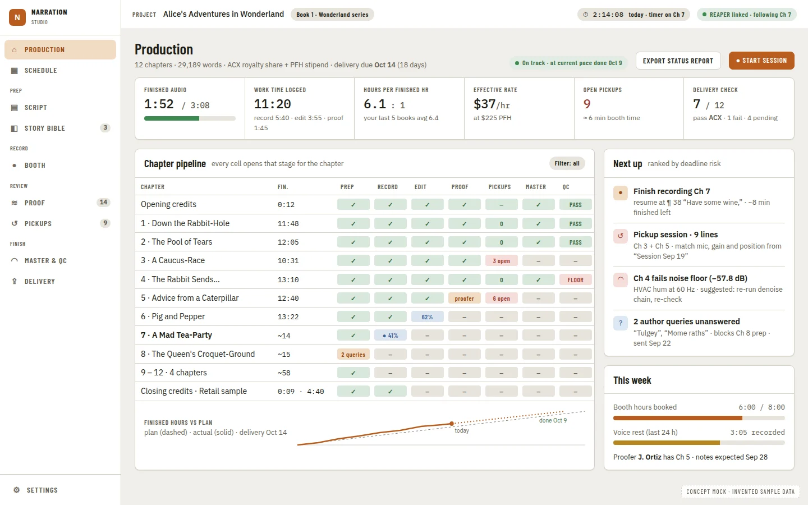

# Production Tracking: Time, Pace and Deadlines by Stage

**Source:** [Audiobook studio benchmark](../research/audiobook-studio-benchmark.md) recommendation 5 ("Production tracking") and §1 "Production and business" ("Time tracked per stage, giving hours per finished hour and an effective hourly rate... Deadlines and milestones... A chapter-by-stage status board, which narrators keep in spreadsheets today [L53]"), and the [production home concept mock](#visual-spec). Part of the benchmark train wave 3 ([agent train](../operations/agent-train.md)).

Citations are `file:line` on `main` at `48a882d` for anything checked in code; "per docs" marks a claim taken from another PRD or doc and not independently re-verified in this session.

## Problem Statement

A narrator producing an audiobook keeps three things in their head or in a spreadsheet that this app does not track at all: how many hours they have actually spent on each stage of each chapter, whether that pace will hit the delivery deadline, and what an hour of that work is actually worth against what the book pays. The benchmark's landscape research found narrators keep this in spreadsheets today [L53], and the app's own scorecard lists "Time tracking, PFH, deadlines, invoices" as **Missing** outright. Home already shows a chapter-by-status table and an estimate of finished runtime from word count, but nothing on that page, or anywhere else in the app, answers "am I on pace" or "what is this book actually costing me in hours."

## Evidence

Verified in code (`48a882d`):

- **Chapter stage is a five-value status, not a stage-tracking system.** `apps/desktop/internal/stages/types.go:24-29` defines exactly `not_started`, `recording`, `editing`, `proofing`, `finalized` as `Stage`, which "are exactly the stored `ChapterStatus` strings" (`:19-21`) — the status *is* the stage (a prior decision, D3 of the chapter-stage-recommendations PRD, per docs), and a new value is not to be added (Q3 of that PRD, per docs). Production tracking must not add a sixth status; any finer-grained view (prep readiness, QC passing) has to come from data alongside the status, not a new status value.
- **A real per-chapter recorded time already exists, unestimated.** `Track.RecordedSeconds()` (`apps/desktop/internal/tracks/recorded_seconds.go:5-11`) is "how much audio the track holds as of the `.rpp`'s last save": the union of the confirmed chapter track's played item intervals. This was delivered by [Actual Recorded](actual-recorded-column.prd.md) (complete), which explicitly rejected inventing any number the app did not measure (ADR 0015, "real progress only"). Production tracking's "hours per finished hour" denominator (time logged) still needs its own new timer data — `RecordedSeconds` gives the numerator (finished runtime), not hours worked.
- **An estimated finished length from word count already exists and is shown on Home.** `estimateFinishedHours(wordCount)` at a fixed 9,300 words per finished hour (`apps/ui/src/components/home/AudiobookEstimatePanel.tsx:207`, cited by the Actual Recorded PRD's own Evidence). The benchmark's own PFH range (6 hours per finished hour for experienced narrators, about 10 for newcomers [W25]; 6.2 [W19a]; 5-6 [W20c]) is a work-hours-per-output-hour ratio, the reverse direction and a different unit from the words-per-hour estimate; the two must not be confused in the UI or in this PRD's math.
- **No timer, session log, deadline or rate concept exists anywhere in the host.** A repository-wide search for `PFH`, `finished hour rate`, `deadline`, `milestone` and `session timer` outside this PRD, the benchmark doc and generic Go stdlib/time-of-day matches finds nothing. `internal/project/manifest.go` (Evidence, additive fields `Credits`, `RetailSample`, `CreditsStatus`, `CreditsSetup`) is the established pattern for adding narrator-entered, project-scoped data that must survive a manuscript replace, but holds nothing about time.
- **A precedent for a derived report export exists.** `internal/deliveryreport` builds an HTML/JSON report from a job's results with a `schema_version` and golden fixtures (per docs, delivery-platform-profiles PRD Evidence); a production status export follows the same shape (a summary the narrator can keep, not data the app reads back to make decisions).
- **The DAW port's `heartbeat` capability already reports REAPER reachability and project match** (`daw-port-and-capabilities.prd.md`, capability table: `heartbeat` → `Heartbeat` role, Supported today via `daw.Reachability`), which this PRD can read to *suggest* a stage timer is still running, without itself talking to the bridge.
- **A book-wide, not-yet-built precedent for a spread chart exists in the benchmark's own concept mocks.** Mock 05 ("Master, QC and delivery") shows "a book-wide spread of loudness"; mock 01 (this PRD's own mock) shows a burndown of finished hours against the plan. Both are charts, explicitly out of `studio-ui-primitives.prd.md`'s scope ("Charts... waveform drawing | Feature-local or a later PRD").

Per docs (not independently re-verified in this session):

- Chapter stage recommendations (`chapter-stage-recommendations.prd.md`), editing readiness (`editing-readiness-analysis.prd.md`) and proofing readiness (`proofing-readiness-signals.prd.md`) already compute tri-state readiness signals per chapter for their own stages (per the `stages` package's `SignalState` contract, `apps/desktop/internal/stages/types.go:51-58`). Production tracking's extended board (Solution Detail) reads these signals rather than recomputing them.
- The delivery platform profiles PRD's book checklist (Phase 7, per docs) and this PRD's extension (recommendation 4) put a per-file and book-wide delivery verdict on the Review page and, per this PRD, also as one more read-only column on the production board.

## Proposed Solution

Add a **production tracking** layer that sits beside the existing chapter table rather than replacing any of it: a stage timer the narrator starts and stops by hand (with an optional REAPER-heartbeat-based reminder if a timer is left running while REAPER goes quiet), a book-level PFH and effective-rate calculation from logged hours against the existing measured recorded time, a small set of dated milestones (a generic list, with one built-in template for ACX's 15-minute checkpoint), and a **Production** home view that extends the existing chapter-by-status table into a chapter-by-stage-readiness board (reading existing readiness signals, never inventing a new status), a KPI row, a "Next up" list ranked by deadline risk, and an exportable status report. Nothing here changes what a chapter's `status` field means or how it is set.

## Key Hypothesis

We believe giving narrators a stage timer, a real (not estimated) PFH and effective rate, and a deadline-aware "next up" list will replace the spreadsheet narrators already keep [L53], without adding a second source of truth for chapter status. We'll know we're right when: a narrator can start and stop a stage timer in one action from the chapter they are working on; the PFH and rate shown use only measured recorded seconds and logged hours, never an estimate presented as a fact; and the "next up" list changes order correctly when a deadline or a stage's readiness changes.

## What We're NOT Building

| Item | Why |
| --- | --- |
| A sixth chapter status, or any change to what sets `not_started`/`recording`/`editing`/`proofing`/`finalized` | `stages` package: "the status is the stage" (D3, per docs); this PRD reads readiness signals as extra board columns, never a new status |
| Automatic timers that start themselves from REAPER activity | No command exists to detect "the narrator started working" reliably, and a silently-running timer produces numbers the narrator did not agree to (mirrors ADR 0015's "real progress only" for time, not just recorded length); Q1 covers what assistance *is* offered |
| Invoicing, line-item billing, tax or currency handling | Out of the benchmark's differentiator list beyond "invoices built from finished runtime × PFH rate"; this PRD builds the rate and hours, not a billing document (Q7) |
| Cloud sync of time logs across machines | The app is local-only (roadmap product boundary); a session log is a project-scoped file like every other derived artifact |
| Cross-project or cross-series rollups (a producer dashboard over many books) | One project's board and KPIs only; a shared, cross-book view is the series voice bible extension of [Character Continuity Review](character-continuity-review.prd.md) (this train's own recommendation 8), and would be its own PRD if ever built (Q6) |
| A burndown chart or any chart rendering | `studio-ui-primitives.prd.md` explicitly leaves charts feature-local or later; this PRD's Phase 6 (Could) ships the KPI numbers a burndown needs, not the chart itself |
| Voice-rest indicators, booth-hours-booked-against-planned | Listed only as a "differentiator" idea in the benchmark's Booth UX notes, not this recommendation; would be booth-mode's PRD if ever prioritized |
| Changing the word-count-based finished-length estimate already on Home | `AudiobookEstimatePanel`'s estimate stays exactly as [Actual Recorded](actual-recorded-column.prd.md) left it; this PRD adds hours-logged and rate alongside it, not a replacement |

## Success Metrics

| Metric | Target | How Measured |
| --- | --- | --- |
| Timer honesty | A logged hour exists only where the narrator started and stopped a timer, or manually entered one | Go tests: no code path writes a session entry other than the two bindings |
| PFH correctness | `PFH = hours logged for a chapter's stages / RecordedSeconds(chapter) converted to hours`, using only measured recorded time | Go table test with known fixtures |
| Effective rate correctness | `rate = book-level contracted amount / hours logged across the book`, undefined (shown as "—", never $0 or a guess) with no contracted amount set | Go test for the zero/undefined case |
| Board never invents a status | The extended board's readiness columns render from existing signal contracts (`stages.SignalState`) and never write `ChapterStatus` | Go/TS test asserting no write path from the new board components |
| Milestone risk | "Next up" order matches a recorded expected order (nearest at-risk deadline first) on a fixture set of chapters, milestones and logged hours | Go table test |
| Wire contracts | Every new payload has a Zod schema, a golden, a `wireContracts.test.ts` row and a passing mock | `pnpm check` |
| Gate | `pnpm check` (full) green; visual suite for the Production page at every viewport | CI and PNG review |

## Open Questions

Every question takes its recommendation by default (D22, per the [implementation plan](implementation-plan.md), per docs); anything genuinely needing the owner's judgment is filed as a Proposed ADR and a comment on #510 rather than blocking a phase.

- [ ] **Q1. What starts and stops a stage timer?** (A) A manual "Start timer" / "Stop timer" action on the chapter's stage, from Home or a chapter's own view; if REAPER's heartbeat (`daw-port-and-capabilities.prd.md`'s `heartbeat` capability) reports the project unreachable for longer than a narrator-configurable idle window while a timer runs, show a non-blocking "Still working on Chapter 4?" prompt rather than auto-stopping. (B) Fully automatic, inferred from REAPER activity. (C) Manual only, no assistance. **Recommendation: (A).** Fully automatic (B) cannot distinguish "stepped away" from "reading silently," and would write hours the narrator never agreed to (against ADR 0015's spirit); manual-only (C) leaves a timer running for hours after a narrator forgets, which corrupts the PFH the narrator is trying to trust.
- [ ] **Q2. Where does the time log live?** (A) A new project-scoped sidecar, `<project>/narration-utils/production/sessions.json`, one entry per `{chapterId, stage, startedAt, endedAt, source: manual}`, following the `character/references.json` and `credit-templates.json` precedent (atomic temp-then-rename, read-tolerant of a bad file). (B) On the project manifest, like `Credits`. **Recommendation: (A).** A time log can grow to hundreds of entries over a long book; the manifest is meant for small, mostly-static narrator choices (Credits, RetailSample), not an append-heavy log.
- [ ] **Q3. Where does the deadline / contracted-rate data live?** (A) Additive fields on `project.Manifest` (`Deadline *time.Time`, `ContractedAmount *float64`, `Milestones []Milestone`), mirroring `Credits`/`RetailSample`. (B) In the same sessions sidecar as Q2. **Recommendation: (A).** These are narrator-entered, low-churn, and should survive exactly like Credits does (kept on manuscript replace, since the deadline is a business fact about the book, not the imported text).
- [ ] **Q4. Is "finished runtime" per chapter the measured `RecordedSeconds`, or the word-count estimate, for PFH?** (A) Measured `RecordedSeconds` only; a chapter with none yet contributes 0 to the numerator and is excluded from a per-chapter PFH (book-level PFH still divides total hours by total recorded seconds so far). (B) Falls back to the word-count estimate when unmeasured. **Recommendation: (A).** Falling back to an estimate for a "real" metric repeats exactly the mistake [Actual Recorded](actual-recorded-column.prd.md) just fixed; a metric with no honest input is "—," never a guess.
- [ ] **Q5. What is the ACX 15-minute checkpoint milestone, concretely?** (A) A generic `Milestone{name, dueDate, note}` list with one pre-filled row the narrator can add ("ACX 15-minute checkpoint") and edit or remove like any other; the app does not enforce ACX's own rule (per [W5], "the ACX 15-minute checkpoint... approve") beyond naming it as a template. (B) A first-class, hard-coded milestone type with its own UI. **Recommendation: (A).** One generic list is simpler and matches how the benchmark itself frames it (a milestone, not a distinct object); ACX's own rule (a sample the rights holder must approve within a fixed window) is a business process the app cannot verify anyway.
- [ ] **Q6. Cross-project rollup in v1?** (A) None; this PRD is one project's board and KPIs (see What We're NOT Building). (B) A lightweight summary reading the recents list. **Recommendation: (A)**, revisited only if the series voice bible extension (recommendation 8) or a narrator request for a producer view makes it worth its own PRD.
- [ ] **Q7. Invoicing in v1?** (A) None: the effective rate and PFH are shown, not turned into an invoice document. (B) A simple "hours × rate" export line. **Recommendation: (A)**, per What We're NOT Building; the status report (Phase 5) already exports the numbers a narrator would put on their own invoice.
- [ ] **Q8. Board readiness columns: read live, or cached?** (A) Read the existing readiness signal contracts live when the Production page opens (same cost model as the existing chapter table's own refresh triggers). (B) A separate cache, refreshed on a schedule. **Recommendation: (A).** The signals are already computed by their own analyzers; caching them a second time here risks staleness the narrator cannot see, and the existing chapter table already accepts a "read on mount / after import / after a completed check" refresh cadence (Actual Recorded PRD Evidence).

## Users & Context

**Primary user:** a solo author-narrator tracking their own time and pace against a delivery deadline, recording in REAPER on Windows.

**Current behavior:** keeps a spreadsheet of hours per chapter per stage, computes PFH and effective rate by hand, and tracks the ACX checkpoint and delivery date in a calendar or the same spreadsheet [L53].

**Trigger:** starting a work session on a chapter; checking in on whether the book is on pace for its deadline; needing a status report to send a publisher or collaborator.

**Job to be done:** when I sit down to work, I want to log the hours against the right chapter and stage with one action, so that at any point I can see my real pace, my real PFH, and whether I will hit my deadline, without maintaining a separate spreadsheet.

**Non-users:** collaborators who need an invoice document, producers tracking many narrators' books at once (Q6), anyone wanting the app to enforce ACX's own checkpoint process.

## Solution Detail

### Core capabilities (MoSCoW)

| Priority | Capability | Phase |
| --- | --- | --- |
| Must | Session timer data model and start/stop bindings, project-scoped sidecar (Q2) | 1 |
| Must | Book- and chapter-level PFH and effective rate, computed only from logged hours and measured recorded seconds (Q4) | 2 |
| Must | Deadlines and milestones on the project manifest (Q3, Q5) | 3 |
| Must | Production page: extended chapter × stage-readiness board (`StageGrid`), KPI row (`StatTile`), "Next up" list | 4 |
| Should | Exportable status report (HTML/JSON, following the delivery report pattern) | 5 |
| Could | Burndown data (finished hours logged over time, no chart rendering) for a future chart primitive | 6 |
| Won't | Invoicing, cross-project rollup, automatic timers, chart rendering | See table above |

### MVP scope

Phases 1 to 4: a narrator can log time, see a real PFH and rate, set a deadline and milestones, and see all of it on one Production page.

### User flow

1. From Home or a chapter's own view, the narrator presses **Start timer** on a chapter's current stage. A small, always-visible indicator shows the running timer and its chapter.
2. They work; if REAPER goes quiet past the idle window while the timer runs, a dismissible prompt asks whether they are still on it (Q1).
3. They press **Stop timer**; the session is logged.
4. On the **Production** page: a KPI row (finished runtime vs. target, hours logged, PFH, effective rate, open pickups, files passing the delivery profile), the extended board (existing status colour plus prep/QC/delivery readiness cells per chapter), and a "Next up" list ranked by which chapter most threatens the deadline.
5. **Export status report** writes a dated summary: hours by stage, PFH, rate, deadline and milestone status, book-wide readiness counts.

## Technical Approach

**Feasibility: HIGH** for Phases 1 to 3 (new Go package, additive manifest fields, arithmetic over existing measured data — no new transport, no REAPER command). **MEDIUM** for Phase 4 (a new page composing existing and new primitives, reading several other features' signal contracts) and **MEDIUM** for Phase 5 (a new report format, following the delivery report's own precedent).

**Architecture:**

- **Package.** New `apps/desktop/internal/production`: `Session{ChapterID, Stage, StartedAt, EndedAt}`, a store over `<project>/narration-utils/production/sessions.json` (atomic temp-then-rename, tolerant of a missing or malformed file — reported, not guessed at, matching every other sidecar in the repo), `Start(chapterID, stage)`, `Stop()` (idempotent: stopping with nothing running is a no-op, not an error), `Sessions()`, and `PFH(chapterID string) (float64, ok bool)` / `BookPFH() (float64, ok bool)` reading `tracks.RecordedSeconds` through the existing coverage/manifest plumbing (Q4).
- **Manifest.** `project.Manifest` gains `Deadline *time.Time`, `ContractedAmount *float64` (in the narrator's own currency, stored as a bare number — no currency conversion, no formatting decision made in Go), and `Milestones []Milestone{Name, DueDate, Note}` (additive, like `Credits`), so they survive a manuscript replace exactly as Credits does (`internal/project/manifest.go` Evidence).
- **Bindings.** `ProductionStartTimer(chapterId, stage)`, `ProductionStopTimer()`, `ProductionSessions()`, `ProductionSetDeadline(...)`, `ProductionMilestones()`/`ProductionSaveMilestones(...)`, `ProductionStatusReport()`. Each goes on `h.services()` with a `stressReaders` row; `hostAPIVersion` bumps once per phase that adds bindings (serialization point, per CLAUDE.md).
- **Board readiness.** The Production page's `StageGrid` reads the existing tri-state signal contracts from chapter-stage-recommendations, editing-readiness-analysis and proofing-readiness-signals (per docs; a phase-4 dependency on whichever of those has landed by then — see Parallel-session compatibility) plus this train's delivery-platform-profiles book checklist, and renders each as a `StatusBadge` cell; it never writes a `ChapterStatus`.
- **Wire contracts (CLAUDE.md).** New `apps/ui/src/api/schemas/production.ts` (`session`, `milestone`, `productionSummary`); goldens `tests/fixtures/contracts/production-*.json` written by Go tests with `UPDATE_CONTRACTS=1`; rows in `wireContracts.test.ts`; a mock in `mockApi.ts` (`?mockProduction=on-pace|at-risk`). No `as` cast or bare `JSON.parse`.
- **Report.** `internal/productionreport`, mirroring `internal/deliveryreport`'s shape (`schema_version`, an HTML template, a JSON export), with hours by stage, PFH, rate, deadline/milestone status and board-wide readiness counts; goldens regenerate with `UPDATE_CONTRACTS=1`.
- **UI.** New `Production.tsx` page and nav entry (serialization point — land alone, per `docs/prds/README.md`'s "Adding a nav item" rule); `StageGrid`, `StatTile`, `Toolbar` from `studio-ui-primitives.prd.md`; a chapter's own view gets a small **Start/Stop timer** control (reusing existing button primitives; no new primitive expected). Visual suite: a handful of Production states at every viewport, tablet included; axe clean; `docs/images/ui/production-*.webp` and a new guide page.
- **Trust boundary.** `production/sessions.json` is a user-editable-on-disk file the app reads back (tampering only corrupts the narrator's own time log, never audio or manuscript data); a row in `docs/architecture/threat-model.md` and `SECURITY.md`, per CLAUDE.md's cleanup gate.
- **ADR.** One ADR at Phase 2 or 3 recording the PFH/rate definition and the "measured only, never estimated" rule (mirrors ADR 0015's reasoning for a second metric); next free number in lane D's block (0400-0409) checked at write time and again before the last push, per D52 on #509.

**Risks:**

| Risk | Likelihood | Mitigation |
| --- | --- | --- |
| A narrator reads an undefined PFH/rate ("—") as a bug | Low-Medium | Clear labelling ("not enough measured time yet"), consistent with the delivery profile's own "not checked by the app" language |
| The idle-timer prompt (Q1) is itself intrusive | Medium | Non-blocking, dismissible, configurable idle window, default generous (for example 20 minutes) |
| Board readiness columns lag behind their own feature's phase status (not all readiness PRDs may have landed) | Medium | Phase 4 reads whichever signal contracts exist at merge time; a column with no producer yet renders "not available" rather than blocking the page |
| Manifest growth (deadline, milestones) collides with other PRDs' additive fields | Low | Purely additive `omitempty` fields, same pattern as `Credits`/`RetailSample`/`CreditsStatus` |
| Session log file grows unbounded over a very long project | Low | Out of scope for v1; flag as a later "Could" (archiving/compaction) if a real narrator hits it |

## Implementation Phases

| # | Phase | Description | Status | Parallel | Depends | Ports used | PRP Plan |
| --- | --- | --- | --- | --- | --- | --- | --- |
| 1 | Session timer core | `internal/production` package: `Session`, store, `Start`/`Stop`, tests | pending | 2 (types only) | - | none | - |
| 2 | PFH and rate | `PFH`/`BookPFH`/rate arithmetic over `tracks.RecordedSeconds` and logged sessions; ADR | pending | - | 1 | `project_read` (reads `tracks.RecordedSeconds` via the existing coverage/manifest path) | - |
| 3 | Deadlines and milestones | Manifest fields, bindings, migration-free (additive) | pending | 1, 2 | - | none | - |
| 4 | Production page | Bindings for the board and KPIs, `Production.tsx`, nav entry, wire contracts, visual suite | pending | - | 1, 2, 3; readiness signal contracts from sibling PRDs (per docs) | `heartbeat` (Q1 idle-prompt assist, optional); UI primitives `StageGrid`, `StatTile`, `Toolbar`, `StatusBadge` (`studio-ui-primitives.prd.md`) | - |
| 5 | Status report export | `internal/productionreport`, HTML/JSON, goldens | pending | 6 | 4 | none | - |
| 6 | Burndown data (Could) | Time-series of logged hours vs. target, no chart rendering | pending | 5 | 2 | none | - |

### Phase details

- **Phase 1.** Tests: start while one is already running is refused with a clear error (never silently switches); stop with nothing running is a no-op; a malformed sidecar file is reported, not guessed at (matching `character/references.json`'s own read-tolerance).
- **Phase 2.** Tests: a chapter with zero measured recorded seconds contributes 0 and is excluded from its own PFH but included in the book-level denominator once any chapter has measured time (Q4); book PFH with zero total recorded seconds is undefined, not a division error surfaced to the UI.
- **Phase 3.** Tests: deadline/milestones survive a manuscript replace (mirrors the existing `Credits` survival test); no milestone type validation beyond name/date/note (Q5 A).
- **Phase 4.** A readiness column reads whichever of the sibling readiness contracts exist; component tests seed each state (on-pace, at-risk, no data yet); visual suite at desktop, small-desktop and tablet.
- **Phase 5.** Report goldens regenerate with `UPDATE_CONTRACTS=1`; the report states plainly that the rate and PFH are computed only from measured time, mirroring the delivery report's own "not a certification" framing.
- **Phase 6.** Data only; a future chart primitive (out of this PRD's scope) would consume it.

### Standing gates

Every phase: plan, `change-impact-scan` (the Production page composes several other features' signal contracts and the manifest is shared), TDD, `pnpm check` (full), Playwright visual suite for `apps/ui` changes (all viewports, tablet included), `feature-cleanup` including the threat-model row, `Closes #<n>` on the tracking issue.

### Parallelism notes

Phases 1 to 3 touch only the new `internal/production` package and the manifest, and can proceed independently of every other benchmark stream. Phase 4 is the integration point and should land after (or be rebased onto) whichever of chapter-stage-recommendations, editing-readiness-analysis, proofing-readiness-signals and delivery-platform-profiles Phase 7 have merged, so its readiness columns have real producers; it degrades gracefully ("not available") for any that have not.

### Parallel-session compatibility

| Phase | Files touched | Collides with |
| --- | --- | --- |
| 1 | new `apps/desktop/internal/production/*` | None expected |
| 2 | `internal/production/*`, reads `apps/desktop/internal/tracks/recorded_seconds.go` (read-only) | None expected |
| 3 | `apps/desktop/internal/project/manifest.go`, `apps/desktop/{app.go,bindings.go,app_test.go,hostrace_test.go}` | Every PRD adding a manifest field or a binding (`hostAPIVersion`) |
| 4 | new `apps/ui/src/components/production/*`, `Production.tsx`, `layout/AppShell.tsx` (nav entry — land alone per the cross-PRD nav-item rule), `apps/ui/src/{hostApi.ts,api/schemas/*,api/wireContracts.test.ts,api/mockApi.ts}`, `tests/visual/{state-catalog.ts,app.drivers.ts}`, `docs/images/ui/production-*`, `docs/guides/using-the-app/production.md` | Every binding-adding PRD (`hostAPIVersion`); any other PRD adding a nav item in the same window |
| 5 | new `apps/desktop/internal/productionreport/*` (+ goldens) | None expected |
| 6 | `internal/production/*` (read path only) | None expected |

## Decisions Log

| Decision | Choice | Alternatives | Rationale |
| --- | --- | --- | --- |
| Chapter status stays a five-value enum | No new status; readiness is shown alongside status, never replacing it | A sixth "in QC" or "delivered" status | `stages` package's own documented invariant (D3, per docs); avoids reopening ADR 0160 |
| Timer semantics (proposed, Q1) | Manual start/stop with an optional idle-based reminder from the DAW port's `heartbeat` | Fully automatic; fully manual with no assist | Automatic risks logging hours the narrator did not do; a reminder keeps the log honest without being silent |
| PFH input (proposed, Q4) | Measured `RecordedSeconds` only, never the word-count estimate | Falling back to the estimate | Repeating the mistake [Actual Recorded](actual-recorded-column.prd.md) just fixed for a second metric would undermine trust in both |
| Where deadline/rate data lives (proposed, Q3) | Additive `project.Manifest` fields | A new sidecar | Matches `Credits`' survival semantics; low churn, not log-shaped |
| Cross-project rollup (proposed, Q6) | Out of scope for v1 | A lightweight recents-based summary | Keeps this PRD to one project; a real cross-book need is better served by its own PRD once asked for |

## Research Summary

**In the repo:** the five-value `Stage`/`ChapterStatus` contract (`apps/desktop/internal/stages/types.go`), the delivered measured recorded seconds (`apps/desktop/internal/tracks/recorded_seconds.go`, [Actual Recorded](actual-recorded-column.prd.md)), the word-count finished-length estimate (`AudiobookEstimatePanel.tsx`), the additive-manifest-field pattern (`internal/project/manifest.go`), the delivery report's export shape (per docs), and the DAW port's `heartbeat` capability (per docs, `daw-port-and-capabilities.prd.md`).

**From the benchmark:** recommendation 5 and its cited PFH figures ([W25], [W19a], [W20c]), the "narrators keep this in spreadsheets today" finding [L53], and the production-home concept mock's KPI row, extended stage board and "Next up" list.

**Not verified in this session:** whether editing-readiness-analysis and proofing-readiness-signals have landed enough of their own phases by the time this PRD's Phase 4 starts (checked at that phase's own planning time, per the Parallelism notes above); ACX's exact 15-minute-checkpoint process beyond the benchmark's own citation [W5].

---

*Generated: 2026-09-26*
*Status: DRAFT - open questions Q1 to Q8 take their recommendation per D22 until the owner says otherwise*

## Visual Spec

Concept mock copied from [the audiobook studio benchmark](../research/audiobook-studio-benchmark.md#3-what-the-ideal-looks-like-concept-mocks), **not yet owner-approved as a build spec** — it illustrates the recommendation the benchmark itself made, kept under `mockups/production-tracking/` marked **concept** until the owner approves it on [#510](https://github.com/countrymanprime/narration-utils/issues/510), per the agent-train wave-0 rule. Names and numbers are placeholders.

*Production home (concept)* (`01-production-home-concept.webp`) — the KPI row (finished runtime vs. target, logged hours, PFH, effective rate, open pickups, files passing delivery), the extended chapter × stage board, and the "Next up" list this PRD's Phase 4 builds toward. A Mockup check table will be added once the owner approves it and building against it begins.
