# Read Aloud Resume from the DAW: Where REAPER Is, Where the Prompter Was, and a Prompt That Goes Away

**Source:** owner report of 2026-09-24 on the Read aloud dialog's "Where you stopped" card. The card read: "Where you stopped" / "Author Message track, linked to this chapter · as of the project's last save, Sep 23, 2026, 9:04 PM" / "The track linked to this chapter has been renamed since it was linked." / "Resume at word 323 of 323 (79% sure), where your recording ends:" / the quote "-Adrian Crow-" / RESUME FROM HERE, START FROM THE TOP, PICK A WORD, ANOTHER TRACK. Word 323 of 323 is the chapter's last word: the chapter looks fully recorded, yet the card offers to resume there. The owner said:

> "It seems we have a persistent prompt at the top to pick up where you left off in the prompter, which should go away if we start playing, choose to start from the top, etc. It should never just sit there forever."

> "That wasn't the intent of the pickup where you left off. That was supposed to be DAW integration where you find where the track was, and find out where you were in the script, and if they match, you keep going from there. If they don't, then you have to figure out where they should be, or let them choose. Maybe that is still planned but the interface here is not great."

**Builds on / amends:** [Teleprompter Manuscript Integration](teleprompter-manuscript-integration.prd.md) Phases 9 and 10 (delivered: [ADR 0111](../adr/0111-the-resume-point-comes-from-transcribing-the-recorded-tail-and-placing-it-with-the-tracker.md), tail-audio locate; [ADR 0112](../adr/0112-the-resume-card-looks-up-where-the-recording-ends-on-open-and-a-choice-only-sets-where-start-begins.md), the resume card) and its unbuilt Phase 11 (live REAPER state, `chapter_track_state`). When delivered it supersedes points 5 and 6 of ADR 0112 and adds a second resume source beside ADR 0111's tail (it does not reverse ADR 0111 point 1; see Decisions Log).

**Not covered here:** the dialog's control bar, its layout, and aligning the resume area to the text column: those are in the sibling PRD `read-aloud-control-bar.prd.md` (in progress when this was written, same day). The renamed-track warning, the track picker and relinking: [Chapter Track Link Control](chapter-track-link-control.prd.md). Credits have no resume ([Manuscript Credits Card Parity](manuscript-credits-card-parity.prd.md) MC9). Punch-and-roll, which moves the REAPER cursor to a word, stays Phase 12 of the teleprompter PRD.

**Status (2026-09-25):** in delivery (lane train, [implementation plan](implementation-plan.md) section 8). The open questions take the recommended answers (D39; Decisions Log). Phases 1 through 3 are built (stream C5 delivered Phase 3's UI half); Phases 4 and 5 (live DAW state) are pending. See the phase table.

Citations are `file:line` at `a62fcd6`.

## Problem Statement

The Read aloud dialog opens with a large "Where you stopped" card above the text. It is built from one source only: the end of the recorded audio on the chapter's track in the saved `.rpp`, transcribed and placed in the script. Four things are wrong with it for the narrator:

1. **It sits there.** After a choice the card does not go away. It turns into a summary with a Change button. It goes away only while a session runs. When the session stops, including the automatic stop at the end of the chapter, it comes back, runs the lookup again and asks again.
2. **It ignores what the narrator can see in REAPER.** It never reads REAPER's live state: not the edit cursor, not the play position, not a take that was recorded but not saved. It never compares the recording with where the prompter itself last was. The owner expected a DAW integration that checks both and only asks when they disagree.
3. **It offers to resume a finished chapter.** A recording that ends on the last word gives "Resume at word 323 of 323". Resuming there reads nothing.
4. **It carries problems that belong elsewhere.** The renamed-track warning and "Another track" appear on every open. They are track-link problems and do not help the narrator start reading.

The cost is friction and doubt at the start of every recording session, the moment the feature was meant to make quicker. The narrator has to read a card, decide whether "79% sure" is sure enough, and clear it each time. A finished chapter gets a wrong offer.

## Evidence

Verified in code at `a62fcd6`:

- **What it computes.** `TeleprompterLocate` matches the chapter to a track, takes that track's recorded end from the saved `.rpp` (`chaptermatch.RecordedEnd`, `apps/desktop/teleprompterlocate.go:79`), transcribes the last 30 s before that end with Whisper, and places the words in the chapter with the tracker (`teleprompterlocate.go:93-104`; ADR 0111 decisions 2 and 3). The doc comment says so: "where its audio ends as of the .rpp's last save" (`teleprompterlocate.go:50-55`). The "as of" time is the `.rpp` file's modification time (`apps/desktop/chaptermatch.go:152-154`), shown by `savedLabel` (`apps/ui/src/components/teleprompter/ResumeOffer.tsx:67`, `:119`).
- **Where "79% sure" comes from.** It is `located.confidence` as a percentage (`ResumeOffer.tsx:126`). ADR 0111 decision 4 defines it as fit times distinctness: the share of heard words that belong to the placed passage, times one minus the runner-up alignment's share. It is not a probability. `confident` needs 0.5 and at least 6 matched words.
- **No live REAPER state.** The lookup reads only the saved project. No bridge command reads the edit cursor for the teleprompter: the only `GetCursorPosition` call in the bridge is the pickups navigator's (`integrations/reaper/narration_pickups.lua:171`), and play state is read only inside navigation (`narration_navigation.lua:105-111`). `chapter_track_state` (teleprompter PRD Phase 11) is not built; the phase is `pending`. The heartbeat carries only the `.rpp` path and whether the project is unsaved (`PROJECT_STATUS`, `apps/desktop/internal/bridge/wire.go:73`); reachability is known (`apps/desktop/internal/daw/reachability.go:63-65`).
- **No stored prompter position.** The host keeps the last `position` event only in memory, for a view that opens mid-session (`apps/desktop/internal/teleprompter/service.go:81`, `:128`, `:442-444`), and clears it when the next session begins (`service.go:334`). Nothing is written per chapter. ADR 0111 decision 1 chose not to use "anchors from past sessions" (word-to-time pairs) to place the resume point. A stored last reading position is a different, smaller thing: one word index. It was never proposed.
- **Why the card persists.** `ReadAloudDialog` renders `ResumeCard` whenever no session is active (`ReadAloudDialog.tsx:120-124`; active means `starting`, `running` or `stopping`, `useTeleprompterSession.ts:46`, `:146`). A choice only replaces the offer with a `ChoiceSummary` and a Change button (`ResumeCard.tsx:32-35`, `:54-63`). Every remount clears the start word (`ResumeCard.tsx:30`) and runs the lookup again (`useResumeLocate.ts:43-48`), which is ADR 0112 decision 5 ("when it comes back it asks again"). A session stops by itself five seconds after the tracker reports done ([ADR 0106](../adr/0106-a-teleprompter-session-stops-itself-five-seconds-after-the-tracker-reports-done.md), `internal/teleprompter/autostop.go:20`), so reading a chapter to the end brings the card straight back. Nothing in the dialog knows about REAPER's transport, so starting playback or recording in REAPER does not dismiss it.
- **Why a finished chapter is offered.** The sidecar's `word` is "the next script word to read" (`sidecars/manuscript-teleprompter/core/locate.py:26-28`), and it is the token count when the tail ends on the last word (`locate.py:106-107`). The host accepts `word == tokens` (`apps/desktop/internal/teleprompter/locate.go:174`). The UI has no "complete" branch: any placed word is offered as "Resume at word N of T" (`ResumeOffer.tsx:148`). Word 323 of 323 is past the last word. The index is also zero-based, so "word N" is one less than a narrator would count.
- **What the other buttons do.** "Resume from here" sets `startWord`, which Start reading sends to `TeleprompterStart` (`useTeleprompterSession.ts:126-129`, `:251`). "Start from the top" clears it. "Pick a word" only shows a sentence telling the narrator to start reading and click a word (`ResumeCard.tsx:79`), because before the script arrives the reader's words are not tracker positions (ADR 0112 decision 3). "Another track" opens a picker of every project track and reads the chosen one without saving it as the link (`ResumeOffer.tsx:104-114`, `:211`; ADR 0112 decision 4). The renamed warning comes from the matcher (`ResumeOffer.tsx:35`).
- **Tests and states that pin today's card.** `ResumeCard.test.tsx` (233 lines). Eleven visual states `manuscript/read-aloud-resume-*` (`apps/ui/tests/visual/state-catalog.ts:302-362`), driven by `?mockResume=` (`apps/ui/src/main.tsx:53-56`, `resumeMockSeed.ts`). The aria snapshot `apps/ui/tests/aria/snapshots/dialog-read-aloud-resume.aria.yml`. No `ReadAloudDialog` test checks that the card hides during a session or what happens when the session ends.

**What was intended versus shipped.** The teleprompter PRD's plan ("Resume pipeline" and "Live REAPER state" under Technical Approach) was: prefer live bridge state (track, item ends, play state, edit cursor), fall back to the saved `.rpp` labelled "as of last save", run the tracker over the tail, and have the narrator confirm. Phases 8 to 10 shipped the fallback path only and labelled it. Phase 11, the live half, is still pending. Nothing in any PRD or ADR planned the comparison with the prompter's own last position that the owner describes, or an "agree, so just continue" path. ADR 0112 made the card a confirm-every-time step ("never starts anything by itself"). That was a reasonable reading of the PRD's "always show the matched sentence and require confirmation" risk mitigation. The owner is now saying that confirmation should be the exception, used only when the sources disagree.

## Proposed Solution

Resume becomes a reconciliation of two sources, with a small UI that disappears.

- **DAW position.** Where the chapter's track is in REAPER. When the bridge is reachable, this is the live edit cursor on the linked track's recorded audio, or the live end of that audio if the cursor is outside it (RD2). When REAPER is not reachable, it is the end of recorded audio in the saved `.rpp`, as today. The time is turned into a script word by the same tail-locate (ADR 0111), over the 30 s that end at that time.
- **Prompter position.** Where the prompter last was in this chapter. This is the last word the tracker read in the last session, which the host now keeps per chapter in the project sidecar when a session ends.

Then:

- **They agree** (within the tolerance, RD1): Start reading is set to the DAW word. A one-line notice above the text says "Continuing at '…the door opened' — REAPER and your last reading agree", with Change and Start from the top as small links.
- **They disagree**, or the DAW word is a low-confidence guess: a compact choice shows the two places side by side (REAPER / Last reading), each with its sentence, plus Start from the top and Pick a word. The narrator picks one.
- **The chapter is recorded to the end**: no resume offer. The line says "This chapter is recorded to the end", and Start reading begins at the top.
- **Only one source** (no track, no recording, or no stored position): that source's word is offered in the same compact form. With neither, nothing is shown.

The notice or choice goes away when reading starts, when the narrator makes any choice, and (with live state) when REAPER starts playing or recording. It does not come back when a session ends in the same dialog. The next open of the dialog asks again. Failures, the missing-model gate and "looking…" become one muted line, not a card. Track problems link to the track control of Chapter Track Link Control instead of being shown in the resume area.

## Key Hypothesis

We believe that reading both where REAPER is and where the prompter last was, and asking only when they disagree, will let the narrator open a partly recorded chapter and start at the right word with at most one click and no card to clear. We'll know we're right when, on the owner's own chapters, an opened chapter needs no resume click in most sessions (the sources agree), a finished chapter never offers to resume, and the owner reports the prompt no longer "sits there".

## What We're NOT Building

- The dialog's control bar, device pickers, record-on-play sync and layout: `read-aloud-control-bar.prd.md`.
- Track linking, relinking, the renamed or missing track warnings and a track picker: Chapter Track Link Control. The resume area shows only a link to it.
- Moving the REAPER cursor to a word (punch-and-roll, word-to-time anchors): teleprompter PRD Phase 12. RD5 asks whether "continue" should also move REAPER's cursor. If yes, it rides on Phase 12's word-to-time; it is not built separately here.
- Starting the microphone by itself. Agreement presets where Start begins; it does not start listening (RD4 asks).
- Live anchors or word-to-time pairs from past sessions (ADR 0111 decision 1 stands). The stored prompter position is one word index per chapter.
- A resume for credits (MC9).
- The microphone device read and preselect: teleprompter PRD Phase 11 keeps it.
- Any write to REAPER from this feature. All new bridge use is read-only.

## Success Metrics

| Metric | Target | How measured |
| --- | --- | --- |
| The prompt never lingers | Gone after Start reading, after any choice, and after a session ends; never re-shown in the same dialog open; with live state, gone when REAPER plays or records | Vitest on `ReadAloudDialog` (each trigger); a visual state after a session ends shows no resume UI |
| Finished chapter | A DAW word at or after the last script word never offers Resume; shows "recorded to the end" and starts at the top | Go and Vitest tests with `word == tokens`; a visual state |
| Agreement needs no click | With sources within tolerance, Start reading begins at the DAW word with no choice shown | Go reconciliation table tests; Vitest |
| Disagreement is one compact choice | Two places with sentences, Top, Pick a word; at most one line high on the narrowest viewport plus the sentences | Visual suite at desktop, small-desktop, tablet |
| Live beats saved | With REAPER reachable, an unsaved take and the edit cursor are used; with it unreachable, the saved `.rpp` is used and labelled | Harness tests for the new command; Go tests with a fake bridge; scripted REAPER check (owner sign-off pending) |
| Resume accuracy unchanged | ADR 0111's target still holds (within 2 words on the recorded tails) for a range ending at the cursor | `test_locate.py` plus new mid-recording tail fixtures |
| Owner's acceptance | Owner confirms on real chapters that the prompt no longer sits there and that agreement is right | Owner-run check, pending |

## Open Questions

- [x] **RD1. What counts as "match"?** Options: (a) within N script words (N = 10); (b) in the same sentence; (c) (a) or (b); (d) exact. Recommendation: (c). Locate is accurate to about 2 words (ADR 0111), the tracker's last `read` lags speech by roughly one confirmed-word delay, and a narrator often reads a few words past the point where recording stopped. A sentence is the unit a narrator restarts from anyway.
- [x] **RD2. Which DAW position is "where the track was"?** Options: (a) the live edit cursor when it lies on the linked track's recorded audio, else the live end of that audio; (b) always the end of recorded audio, live when reachable; (c) the edit cursor only. Recommendation: (a). The cursor is what the narrator deliberately set in REAPER ("go back to here"); the end of audio is the right answer when the cursor is parked elsewhere (at 0, or after the end). With REAPER unreachable, both fall back to the saved `.rpp`'s recorded end.
- [x] **RD3. When they agree, which word?** Options: (a) the DAW word, the recording being the truth; (b) the prompter word; (c) the earlier of the two. Recommendation: (a). The prompter may be ahead because the narrator read on without recording.
- [x] **RD4. Does agreement start listening?** Options: (a) no: Start reading is preset and the notice says so; (b) yes: the session starts at the word when the dialog opens. Recommendation: (a). Opening a microphone by itself is a privacy surprise (the teleprompter PRD's reason for stopping on close). The control bar's record-on-play sync, if built, is the place for "start when REAPER records".
- [x] **RD5. Should the prompter move REAPER's cursor?** Options: (a) never in this PRD; (b) on agreement or on a chosen place, move REAPER's edit cursor there (needs word-to-time, Phase 12); (c) only on a button "Put REAPER here too". Recommendation: (a) now, (c) after Phase 12 lands. That phase owns the one cursor mutation and its pre-roll.
- [x] **RD6. Should moving the REAPER cursor while the dialog is open re-sync the prompter?** Options: (a) no: sources are read once on open (and on Try again); (b) yes while idle: poll the live state about once a second, and when the cursor moves onto the track, re-run the locate and update the start word with a notice; (c) during a session too, seeking the tracker. Recommendation: (b), debounced (the locate costs a Whisper run of a second or more), and never during a session (the narrator is reading; a click on a word already seeks).
- [x] **RD7. Does REAPER starting playback or recording dismiss the prompt?** Options: (a) yes, when live state is available; (b) no. Recommendation: (a). This is the owner's "go away if we start playing". Without live state only Start reading and a choice dismiss it.
- [x] **RD8. Only the prompter position (no track or no recording).** Options: (a) offer it as a compact one-line choice ("Last reading stopped at '…'. Continue there?"); (b) continue there silently with the agreement notice; (c) ignore it. Recommendation: (a). Reading is not recording, so it should not be taken silently.
- [x] **RD9. Where does the chosen start point show once the prompt is gone?** Options: (a) in the control bar of `read-aloud-control-bar.prd.md` (for example "Start reading · at '…the door opened'" with a clear button); (b) a small caret mark on the word in the text; (c) both. Recommendation: (c) if the control bar has a slot, otherwise (b). Agree the slot with that PRD before Phase 1.

## Users & Context

**Primary user.** A solo author-narrator recording chapter by chapter in REAPER on Windows, with the app's Read aloud dialog beside REAPER.

**Current behavior.** Opens Read aloud, reads a card about the saved project, decides whether a percentage is good enough, presses a button, and sees the same card again after every stop, including on finished chapters.

**Trigger.** Opening a chapter to record: a new session on a partly recorded chapter, a return after a break, or a check of a chapter they think is finished.

**Success state.** They open the chapter and see "Continuing at '…the door opened'" and the text scrolled there. They press record in REAPER (or Start reading) and the line is gone. If REAPER and the prompter disagree, they pick one of two quoted places. A finished chapter just says so.

**Job to be done.** When I come back to a chapter, I want the prompter to be where my recording is, and to ask me only when it cannot tell, so I can start reading without doing any bookkeeping.

**Non-users.** Narrators without REAPER: the prompter-only source still works (RD8), and nothing else changes for them. Credits readers (no resume).

## Solution Detail

### Core capabilities (MoSCoW)

| Priority | Capability | Phase |
| --- | --- | --- |
| Must | The prompt never lingers: dismissed on Start, on any choice, not re-shown after a session ends in the same open; loading, errors and the model gate as one muted line | 1 |
| Must | A finished chapter says so and offers no resume | 1 |
| Must | Track warnings and "Another track" leave the resume area for a link to the track control | 1 |
| Must | The prompter's last position kept per chapter when a session ends, read back with a schema | 2 |
| Must | Reconciliation of DAW and prompter positions (agree, disagree, complete, one source, none) in one tested function; agreement notice and compact choice | 3 |
| Should | Live DAW state: edit cursor, play state and the linked track's items (including unsaved takes) from a read-only bridge command, preferred over the saved `.rpp` | 4 |
| Should | REAPER play or record dismisses the prompt (RD7) | 5 |
| Could | Re-sync when the REAPER cursor moves while idle (RD6) | 5 |
| Could | Use the prompter word to break a tie when the tail fits a repeated passage (the runner-up placement) | later |
| Won't | Moving REAPER's cursor from here (Phase 12 of the teleprompter PRD); auto-start listening; credits resume | - |

### MVP scope

Phases 1 to 3 answer the owner's report without REAPER running: the prompt goes away, a finished chapter is recognised, and the saved-project DAW position is compared with the prompter's last position. Phases 4 and 5 add live REAPER state.

### User flow

1. The narrator presses Read aloud. While the sources are read, one muted line under the control bar says "Checking where REAPER and your last reading are…". Start reading works at once, from the top.
2. **Agree:** the line becomes "Continuing at '…the door opened' — REAPER and your last reading agree · Change · Start from the top". The text scrolls to the word, and the start point is shown per RD9.
3. **Disagree:** a compact choice: "REAPER: '…the door opened' (word 812)" and "Last reading: '…down the hall' (word 871)", each a button, plus Start from the top and Pick a word. The saved-project source is labelled "as of the project's last save, 9:04 PM"; the live source is labelled "in REAPER now".
4. **Recorded to the end:** "This chapter is recorded to the end · Read from the top · Pick a word". No resume button.
5. Pressing Start reading, choosing anything, or (live) REAPER starting to play or record removes the line or choice. After Stop, the dialog shows no resume UI. Closing and reopening asks again.
6. A track problem shows as one link, "Track: Author Message (renamed) — check the link", which opens the track control of Chapter Track Link Control. It is not repeated on every open when the link is confirmed and only renamed (TL questions there).

## Technical Approach

**Feasibility:** HIGH for Phases 1 to 3 (UI, one host store, one pure function, existing locate). MEDIUM for Phases 4 and 5: a new read-only bridge command (harness-testable under ADR 0066), mapping a project time on an unsaved item to its source file, and REAPER API behaviour that only a scripted REAPER run can prove.

- **Phase 1 (UI only).** `ResumeCard` becomes `ResumePrompt`: a one-line notice or a compact choice, not a `Panel`. `ReadAloudDialog` keeps a `resumeSettled` flag for the dialog open: it is set by a choice, by Start reading, or by a session ending, and while it is set the prompt is not rendered. It replaces the `!session.active` remount (`ReadAloudDialog.tsx:120`), so the lookup runs once per open. The start word keeps living in `useTeleprompterSession.startWord`. A session end no longer clears it silently; after a session the next Start begins at the top, as ADR 0112 intended, and the prompt does not return. A placed word with no script words after it (`word >= tokens`, or only punctuation tokens left) is `complete`. Words are shown one-based and by their sentence, not "N of T". "Another track", the `TrackPicker` and `WARNING_TEXT` leave the resume area. Until Chapter Track Link Control Phase 2 lands, a `no_track` answer links to the Tracks page's chapter links.
- **Phase 2 (prompter position store).** When a chapter session ends (`Service.stop` or the watcher), the host writes `<project>/narration-utils/teleprompter/<chapterId>.reading.json`: `{version, chapterId, read, tokens, scriptHash, status, endedAt}`, from the last `position` event (`read`, the same index space as locate's `word`). It is written through a temp file and a rename. The chapter id must be a chapter of the imported manuscript before it names a file, and the file name is built by the host (a hash of the id if the id's characters are not already a safe file name), never taken as a path from the UI. `scriptHash` is a hash of `script_words()`, so an edited chapter's position is dropped rather than misplaced. The file sits beside the anchors file planned by teleprompter PRD Phase 12. The host reads this file back from disk, so it is a wire contract: a Zod schema in `apps/ui/src/api/schemas/`, a golden payload written by a Go test (`tests/fixtures/contracts/teleprompter-reading-*.json`, `UPDATE_CONTRACTS=1`), a `wireContracts.test.ts` row and a mock. Credits sessions write nothing (MC8/MC9).
- **Phase 3 (reconciliation).** A pure Go function `teleprompter.Reconcile(daw *Located, prompter *Reading, tokens int, tolerance) Verdict`, table-tested, returns `agree | disagree | complete | daw_only | prompter_only | none` with the chosen word and both places. It runs in the host so the dialog and any later surface agree. `TeleprompterLocate` gains `lastReading` and `verdict` fields; no new binding is needed, since the locate already runs once per open. This is a result shape change: bump `hostAPIVersion` (47 at `a62fcd6`, `apps/desktop/app.go:52`), regenerate the goldens and update the schema. A low-confidence DAW word never `agree`s by itself. If the prompter word falls within tolerance of it, the verdict is `agree` with `confirmedBy: "prompter"`: the prompter settles the ambiguity the confidence reports. The UI renders the verdict and does no arithmetic.
- **Phase 4 (live DAW state).** A read-only bridge command, **`chapter_track_state`**, the name teleprompter PRD Phase 11 already reserves, minus that phase's device read. Arguments: the track GUID. Answers: `TRACK_STATE|run|guid|playState|editCursor|playPosition|rpp|unsaved` and one `TRACK_ITEM|run|guid|position|length|sourceFile|sourceOffset|playrate|active` per item on the track (the active take's source, SOFFS and playrate, as `tracks` resolves them from the `.rpp`), then a closing count. It lives in a new `integrations/reaper/narration_track_state.lua` listed in `FEATURE_FILES` and `scripts/release/reaper-files.mjs` (ADR 0067). Its harness tests come first ([ADR 0066](../adr/0066-the-lua-bridge-is-tested-by-a-harness-under-lua-5-4-and-reaper-api-behaviour-is-checked-in-reaper.md)): no track, an unknown GUID, an empty track, several items, a trimmed item, a playrate, a take source with a pipe in its path, and recording in progress. Mutation checks go in `mutations.json`, and the events go in the `wire.go` table. The Go side sends it only while `Reachability.Reachable()` holds and the reported `rpp` is the selected project. It times out to "uncertain" and falls back to the saved `.rpp`, never guessing (research doc 4.6). The host maps the cursor (RD2) to a source file and time, and runs the same `Locate` over `[max(itemSourceStart, t - 30), t]`. While REAPER reports recording, the DAW source is "recording now" and no locate runs, because the file is still growing.
- **Phase 5 (follow REAPER while idle).** While the prompt is shown and no session runs, the host polls `chapter_track_state` about once a second, and only then. Play or record dismisses the prompt (RD7). A cursor move onto the track, debounced by one second, re-runs the locate (RD6). The poll stops when the prompt goes away. It is not the heartbeat: DAW Chapter-Track Auto-Sync Phase 4 is changing `PROJECT_STATUS`, and a per-dialog poll keeps the two apart.

**Risks**

| Risk | Likelihood | Mitigation |
| --- | --- | --- |
| "Agree" continues at a wrong word when both sources are wrong in the same way (a repeated passage the narrator re-read) | Low | Agreement only presets Start; the sentence is shown in the notice; Change is one click |
| The stored position goes stale after a manuscript edit | Medium | `scriptHash`; a mismatch drops the stored position |
| Unsaved live item source is still being written | Medium | No locate while recording; the scripted REAPER check measures when a stopped take's file is readable |
| Poll cost (about 50 to 100 ms per bridge call, per the teleprompter PRD) | Low | Only while the prompt is shown and idle; stops on dismiss |
| `chapter_track_state` built twice (here and teleprompter Phase 11), or clashing with auto-sync's `list_tracks` | Medium | One command, defined here and extended by Phase 11 with the device read; agree field names with auto-sync Phase 5 |
| Removing the card's track picker before the track control exists leaves no way to read another track | Medium | Phase 1 links to the Tracks page's chapter links until Chapter Track Link Control Phase 2 lands |

## Implementation Phases

| # | Phase | Description | Status | Parallel | Depends | PRP Plan |
| --- | --- | --- | --- | --- | --- | --- |
| 1 | The prompt goes away | `ResumePrompt` (one line or compact choice), dismissed per open, finished-chapter state, one-based words, track problems as a link; visual and aria states; supersedes ADR 0112 points 4 and 5 ([ADR 0187](../adr/0187-the-resume-prompt-is-a-compact-notice-that-settles-once-per-dialog-open.md)) | complete | 2 | RD9; sequence with `read-aloud-control-bar.prd.md` | - |
| 2 | Prompter position store | `<chapter>.reading.json` written at session end, read back; schema, golden, `wireContracts` row, mock; threat model row | complete: `teleprompter.WriteReading`/`LoadReading` and the write at session end (`Service.recordReading`), golden `teleprompter-reading.json`, `teleprompterReadingSchema`, `mockLastReading`, threat model row 6k ([ADR 0205](../adr/0205-the-prompter-remembers-its-last-word-per-chapter-in-a-host-named-file-dropped-when-the-text-changes.md)). No binding reads it yet: Phase 3 adds `lastReading` to the locate result | 1 | - | - |
| 3 | Reconcile two sources | `teleprompter.Reconcile`, `TeleprompterLocate` gains `lastReading` and `verdict`, `hostAPIVersion` bump, agreement notice and compact choice; ADR | complete: host - `teleprompter.Reconcile` and the Go port of the chapter script and sentence bounds (`script.go`), `lastReading` and `verdict` on every locate answer but `asset_required`, `hostAPIVersion` 50, goldens `teleprompter-locate-{agree,disagree,complete,prompter-only}.json`, `teleprompterResumeVerdictSchema`, mock seeds `?mockResume=agree\|disagree\|prompter_only` ([ADR 0206](../adr/0206-resume-reconciles-the-recording-with-the-prompters-last-word-in-the-host-and-asks-only-when-they-disagree.md)). UI (stream C5) - `ResumePrompt.tsx` renders `verdict.kind`: `agree` presets Start without settling (Change reveals the two-way choice), `disagree` a two-way card choice, `prompter_only` a one-line RD8 offer, `daw_only`/`complete` keep Phase 1's existing rendering (now verdict-gated); new visual rows `read-aloud-resume-{agree,disagree,prompter-only}`, all viewports including reflow | - | 1, 2; RD1, RD3, RD8 | - |
| 4 | Live DAW state | `chapter_track_state` in `narration_track_state.lua` (harness tests first), `wire.go`, Go client with fallback, cursor-to-source mapping, "in REAPER now" label; threat model; scripted REAPER check (owner sign-off pending) | pending | - | 3; RD2 | - |
| 5 | Follow REAPER while idle | Bounded poll while the prompt shows; play or record dismisses; optional cursor re-sync | pending | - | 4; RD6, RD7 | - |

### Phase details

**Phase 1 - The prompt goes away.** Goal: nothing sits there. Scope: `ResumeCard.tsx` and `ResumeOffer.tsx` become `ResumePrompt.tsx`, and `ReadAloudDialog.tsx` gets the `resumeSettled` flag. `complete` from `word >= tokens` is computed in the UI for this phase; Phase 3 moves it to the host verdict. Loading, `failed` and `asset_required` become a muted line (the model gate keeps its "Download model…" link). Rewrite the eleven `read-aloud-resume-*` visual states into: offer, low-confidence, complete, not-found, no-track, model-required, error, after-choice (no prompt) and after-session (no prompt), with `sameAs` only where two truly render the same. Update the aria snapshot `dialog-read-aloud-resume.aria.yml`. Success: Vitest shows the prompt is gone after each dismiss trigger and not re-rendered after a session ends; the visual suite passes at every viewport and the PNGs are looked at; `pnpm check` passes. An ADR supersedes ADR 0112 decisions 5 and 6.

**Phase 2 - Prompter position store.** Goal: the prompter remembers where it was. Scope: `apps/desktop/internal/teleprompter` (the store and the write on stop, with tests for stop, auto-stop, a failed session that never positioned, and a credits session), a small read function, the contract files. Success: a Go test writes the golden, a schema test parses it, and a stale `scriptHash` reads as absent.

**Phase 3 - Reconcile two sources.** Goal: ask only when they disagree. Scope: `Reconcile` with a table of cases (agree within N, agree within the sentence, disagree, complete, low-confidence confirmed by the prompter, low-confidence alone, prompter only, DAW only, none), the locate binding's result, goldens (`teleprompter-locate-*.json`), schema, mock seeds (`resumeMockSeed.ts`), the agreement notice and the choice. Success: every verdict has a Go case, a Vitest case and a visual state; ADR recorded ("resume reconciles the DAW with the prompter's last position and asks only on disagreement").

**Phase 4 - Live DAW state.** Goal: REAPER now, not the last save. Scope: harness tests, then the Lua; `wire.go` rows; a Go client with a fake bridge (reachable, unreachable, mismatched project, timeout, recording); cursor-to-source mapping tests (cursor inside an item, between items, before the first, after the last, on a trimmed item, with playrate); threat model rows for the new command (the REAPER bridge rows 5x) and for the locate's new range source (row 4a: the audio path now also comes from REAPER's live answer, checked the same way as the `.rpp`'s); `docs/architecture/reaper-bridge.md` command list. Manual: a scripted run in REAPER on a copy of a project with an isolated `-cfgfile` (record a take without saving, move the cursor, check the answer), recorded; the owner's sign-off is pending. Success: harness and mutation checks pass in `pnpm check`; Go tests pass; the scripted run is recorded.

**Phase 5 - Follow REAPER while idle.** Goal: the owner's "go away if we start playing". Scope: the poll lifecycle in the host or the dialog (host preferred: one poll per open dialog, cancelled on dismiss), a live event for "REAPER started playing" and "cursor moved" with its schema, golden and `wire.go` row, and Vitest for dismissal. Success: tests prove the poll runs only while the prompt shows and never during a session; the scripted REAPER run shows play dismissing the prompt.

### Parallelism notes

Phases 1 and 2 touch disjoint code (UI only; host store only) and can run at the same time. Phase 3 needs both. Phases 4 and 5 are a chain after 3. Phase 1 must be sequenced with `read-aloud-control-bar.prd.md`, which moves and re-lays-out the same area of `ReadAloudDialog.tsx`: land the control bar first, or agree the prompt's slot (RD9) and rebase.

### Parallel-session compatibility

| Phase | Files and areas touched | Collision risk |
| --- | --- | --- |
| 1 | `apps/ui/src/components/teleprompter/{ResumeCard,ResumeOffer,ReadAloudDialog}.tsx` and tests, new `ResumePrompt.tsx`, `useResumeLocate.ts`, `resumeMockSeed.ts`, `main.tsx`, `apps/ui/tests/visual/{state-catalog.ts,app.drivers.ts}`, `apps/ui/tests/aria/snapshots/dialog-read-aloud-resume.aria.yml`, `docs/guides/using-the-app/manuscript.md`, `docs/adr/` | `read-aloud-control-bar.prd.md` (same dialog, the resume card's placement and alignment); [Manuscript Credits Card Parity](manuscript-credits-card-parity.prd.md) Phase 2 (`ReadAloudDialog` source union, no resume for credits); [Chapter Track Link Control](chapter-track-link-control.prd.md) Phase 2 (where the track link goes) |
| 2 | `apps/desktop/internal/teleprompter/{service.go,reading.go}` and tests, `tests/fixtures/contracts/`, `apps/ui/src/api/schemas/`, `wireContracts.test.ts`, `docs/architecture/threat-model.md` | Teleprompter PRD Phase 12 (anchors file in the same folder; `service.go` session lifecycle) |
| 3 | `apps/desktop/teleprompterlocate.go`, new `internal/teleprompter/reconcile.go`, `apps/desktop/{app.go,app_test.go}`, `apps/ui/src/hostApi.ts`, `Host.{js,d.ts}`, locate goldens and schema, `mockApi.ts`, `ResumePrompt.tsx`, visual states | Every phase that bumps `hostAPIVersion`; [DAW Chapter-Track Auto-Sync](daw-chapter-track-auto-sync.prd.md) (changes what `ChapterTrackMatch` returns inside the locate result) |
| 4 | new `integrations/reaper/narration_track_state.lua` and `tests/track_state_test.lua`, `narration_ui_bridge.lua` `FEATURE_FILES`, `integrations/reaper/tests/mutations.json`, `scripts/release/reaper-files.mjs`, `apps/desktop/internal/bridge/wire.go`, a Go client, `teleprompterlocate.go`, `docs/architecture/{reaper-bridge.md,threat-model.md}`, `SECURITY.md` if a row changes | Teleprompter PRD Phase 11 (owns `chapter_track_state` in its plan: this phase builds it and Phase 11 adds the device read); DAW Chapter-Track Auto-Sync Phase 5 (`list_tracks`: agree one shape); `reaper-files.mjs` editors (release readiness) |
| 5 | Go poll, a new live event (`wire.go`, schema, golden), `ReadAloudDialog.tsx` | DAW Chapter-Track Auto-Sync Phase 4 (heartbeat; kept separate on purpose); `read-aloud-control-bar.prd.md` (record-on-play sync reads REAPER's transport too: share one live-state reader) |

Cross-cutting: each phase follows `CLAUDE.md`: plan, `change-impact-scan` (`ReadAloudDialog`, `useTeleprompterSession` and the teleprompter service are shared with the standalone Teleprompter page; the bridge is shared with Transcript Compare and the Review page), TDD, `full-verification-gate` (`pnpm check`, the visual suite for `apps/ui`, `pnpm --dir apps/ui run aria` for the dialog), `feature-cleanup`. Check the next free ADR number at merge time (0171 at `a62fcd6`).

## Decisions Log

| Decision | Choice | Alternatives | Rationale |
| --- | --- | --- | --- |
| Two sources, not one | DAW position and the prompter's last position, reconciled | The recorded tail alone (shipped) | Owner's stated intent (2026-09-24): "find where the track was, and find out where you were in the script, and if they match, you keep going" |
| Stored prompter position versus ADR 0111 decision 1 | One word index per chapter, compared with the DAW, never used to place the tail | Anchors from past sessions | ADR 0111 rejected word-to-time anchors as a placement source; a last position is a check, not a placement, and needs no store kept in step with take edits (a stale one is dropped by `scriptHash`) |
| Confirm only on disagreement (proposed) | Agreement presets Start with a notice | Confirm every time (ADR 0112) | Owner report; the confirmation was a mitigation for a single unverified source, and a second source is a better check |
| The prompt is per dialog open (proposed) | Not re-shown after a session in the same open | Re-ask after every session (ADR 0112 decision 5) | "It should never just sit there forever"; ADR 0112's worry (a stale start word silently reused) is met by starting at the top after a session |
| One live command (proposed) | `chapter_track_state`, built here, extended by teleprompter Phase 11 | A second command for resume only | One read of the track per open; the name the teleprompter PRD already reserved |
| Reconcile in the host (proposed) | Go `Reconcile`, verdict in the locate result | UI arithmetic | One answer for every surface; table-tested in Go; the UI only renders |
| Open questions (owner, 2026-09-24) | Every open question takes this PRD's recommended answer, as shown in its approved Visual Spec mockups, except where a row below says otherwise | Answer each question separately | The owner approved the mockups that depict the recommendations; see D39 in the [implementation plan](implementation-plan.md#6-owner-decisions-2026-09-24) |
| Unbuilt data in the real app (owner, 2026-09-24, D24) | Visible UI is built in full; in mock mode it runs on sample data, and in the real app a surface whose data is not built yet shows an honest "not available yet" state. Controls that would act on REAPER stay disabled with the reason | Hide unbuilt UI until its data exists | The owner can use and judge every screen now; each backend phase switches on a screen that already exists |
| REAPER commands before the owner's verification pass (owner, 2026-09-24, D38) | Built in full with harness tests, their ReaScript calls documented from the API reference, and behind an "Experimental REAPER actions" Settings switch (off) until the owner and Claude verify them on a copy of a test project; commands that write to REAPER stay off until then | Wait to build them until the owner can test | Nothing waits on hardware, and nothing touches a real project before it is verified |
| Reconcile in the host (2026-09-25, Phase 3, ADR 0206) | RD1 (c): agree within 10 words or in the same sentence; RD3 (a): the DAW word wins; RD8 (a): a reading alone is offered. A low-confidence DAW word agrees only when the prompter confirms it; a DAW word with no readable words after it is `complete` unless it is a low-confidence guess the prompter contradicts; a reading at the last word is not offered; the host quotes both sentences from its own port of the sidecar's tokenising | UI arithmetic; the prompter word on agreement | One tested answer; the recording is the truth and the prompter may have read on without recording |
| Prompter position store (2026-09-25, Phase 2, ADR 0205) | Written before the session reports `stopped`, for stop, auto-stop and a crash after positions; nothing for credits, no position or `read` 0; `scriptHash` covers the document id so a re-import drops it; the file is host-named | Store every session; hash only the text | A reading must never point into a different text; the id never names a path |

## Research Summary

- Resume today is the tail locate over the saved project (ADR 0111) shown by the Phase 10 card (ADR 0112). Its confidence (fit times distinctness) reaches 0.63 to 0.89 on the synthetic recorded tails, and 0 on a repeated passage.
- The teleprompter PRD always planned live REAPER state first and the saved `.rpp` as the fallback (its Technical Approach and risk table); Phase 11 carries it and is pending. This PRD builds the resume half of that phase and leaves the microphone half.
- No stored prompter position exists anywhere (host memory only, cleared per session).
- Existing bridge reads to reuse: play state arithmetic (`narration_navigation.lua:105-111`), `GetCursorPosition` (`narration_pickups.lua:171`), the heartbeat and reachability (`wire.go:73`, `reachability.go`). The file protocol and harness make a new read-only command routine (`docs/architecture/reaper-bridge.md`).
- Open REAPER questions for the scripted run: when an unsaved, just-stopped take's source file is complete enough to decode; whether `GetPlayPosition` or the edit cursor is the better "where the narrator is" while paused (teleprompter PRD spike 1 covers the play-position half).

## Visual Spec

Mockups approved by the owner on 2026-09-24. They were rendered from the real app (dark theme, the app's own fonts and components) with throwaway edits and invented sample data, so names, numbers and body text are placeholders; the layout, controls, states and wording are the spec. Each shows the recommended answer to the open questions unless its caption says it is an alternative. Where a mockup and the text above disagree, raise it before building rather than silently following either.

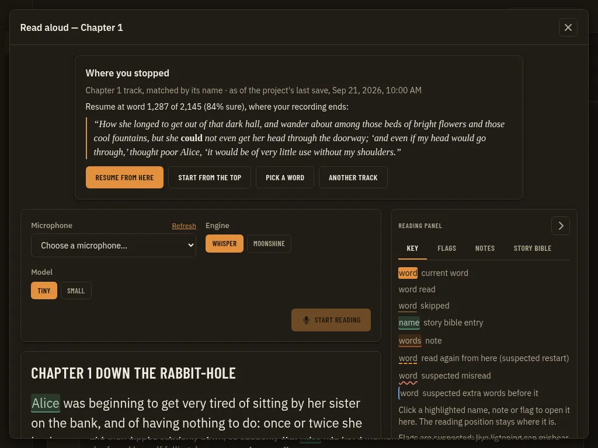

*Before 1024* (`00-before-1024.webp`)

*Before* (`00-before.webp`)

*Agree 1024* (`01-agree-1024.webp`)

*Agree* (`01-agree.webp`)

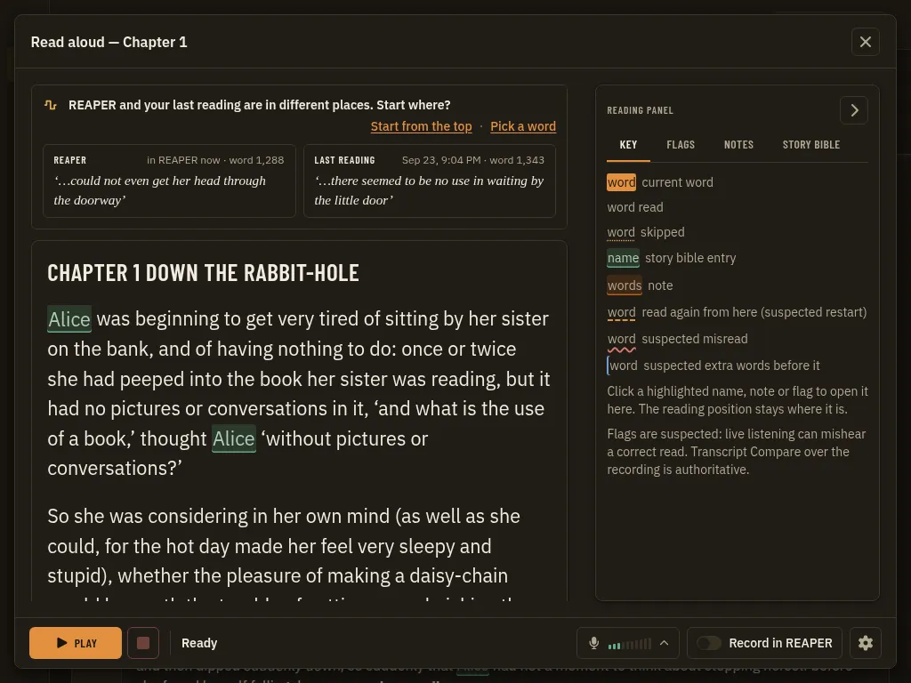

*Disagree 1024* (`02-disagree-1024.webp`)

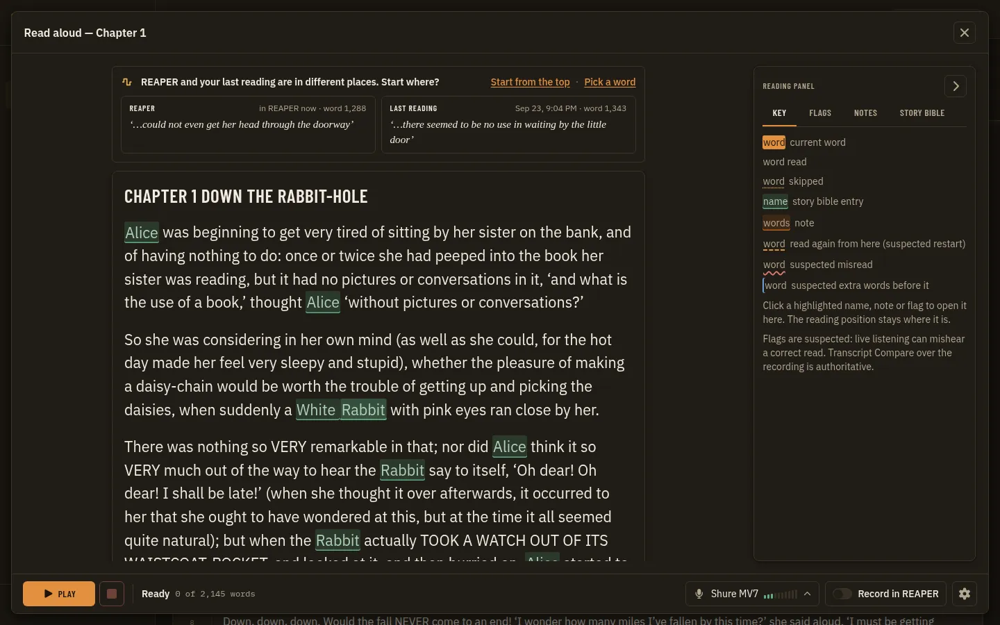

*Disagree* (`02-disagree.webp`)

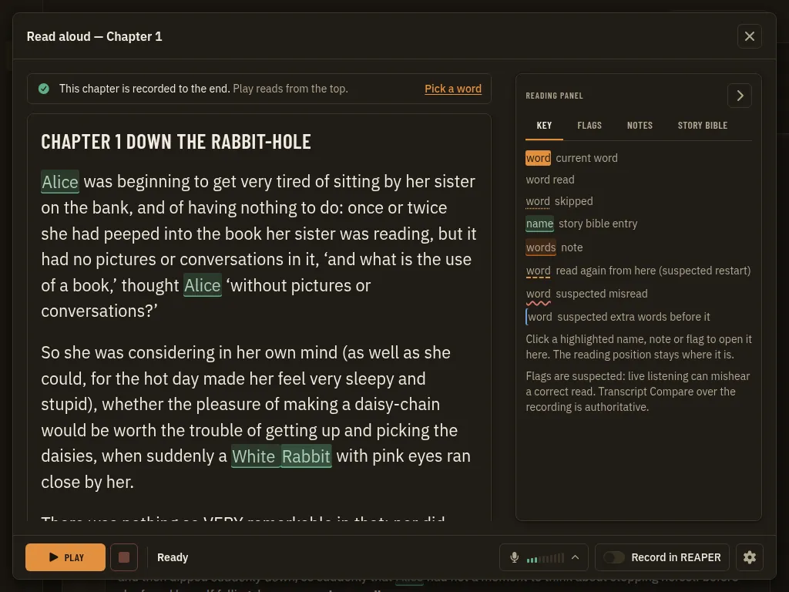

*Recorded to end 1024* (`03-recorded-to-end-1024.webp`)

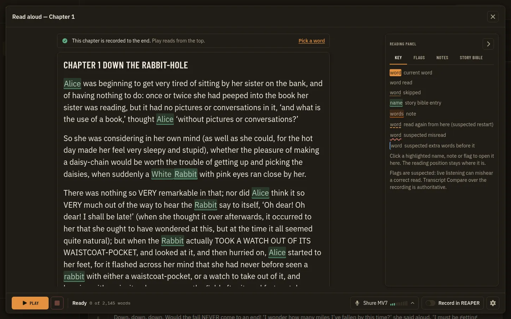

*Recorded to end* (`03-recorded-to-end.webp`)

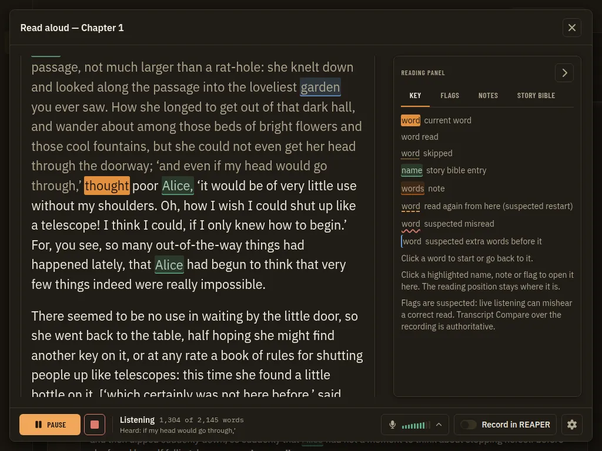

*After play prompt gone 1024* (`04-after-play-prompt-gone-1024.webp`)

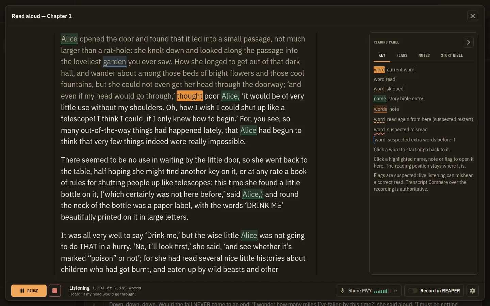

*After play prompt gone* (`04-after-play-prompt-gone.webp`)

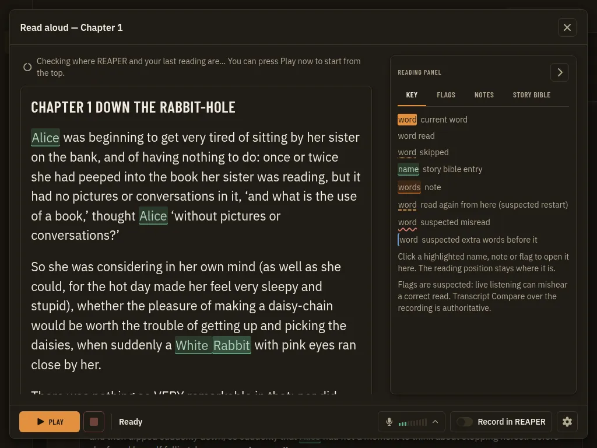

*Checking 1024* (`05-checking-1024.webp`)

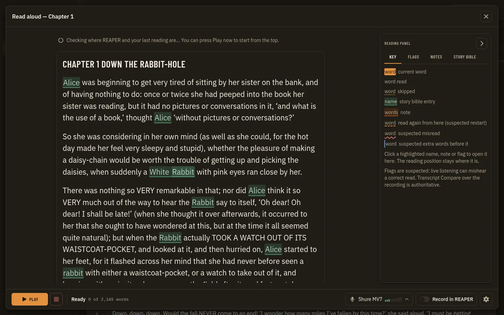

*Checking* (`05-checking.webp`)

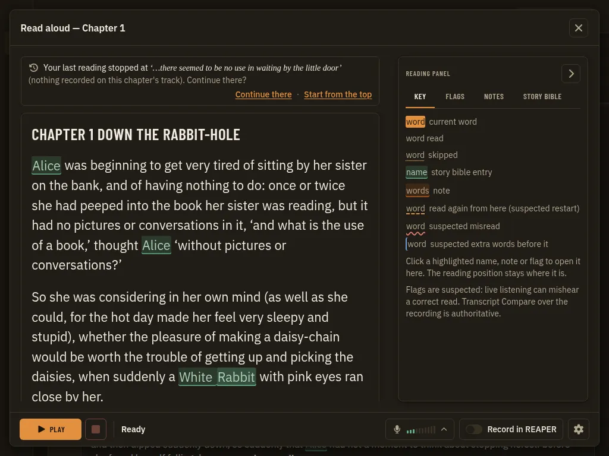

*Last reading only 1024* (`06-last-reading-only-1024.webp`)

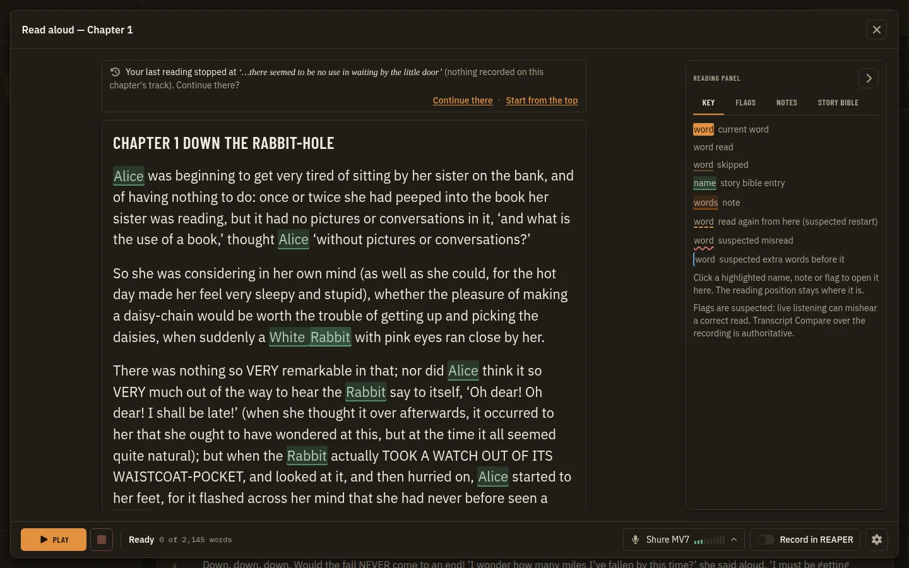

*Last reading only* (`06-last-reading-only.webp`)
