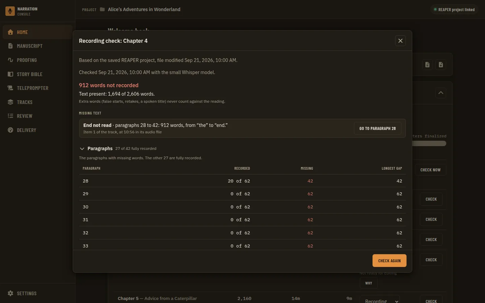
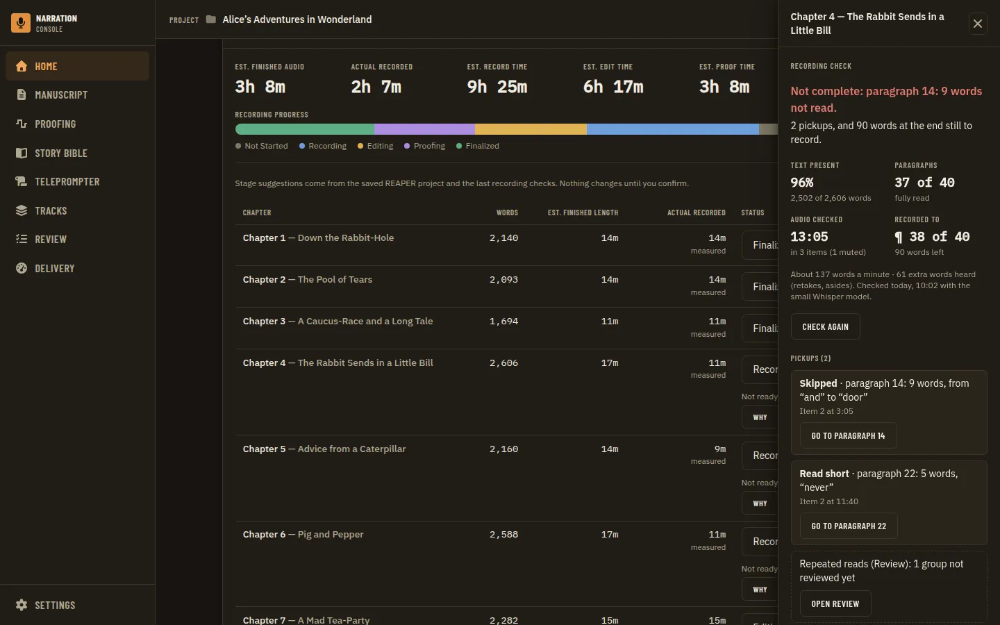
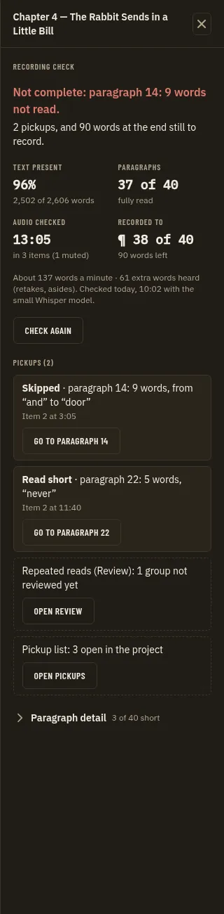
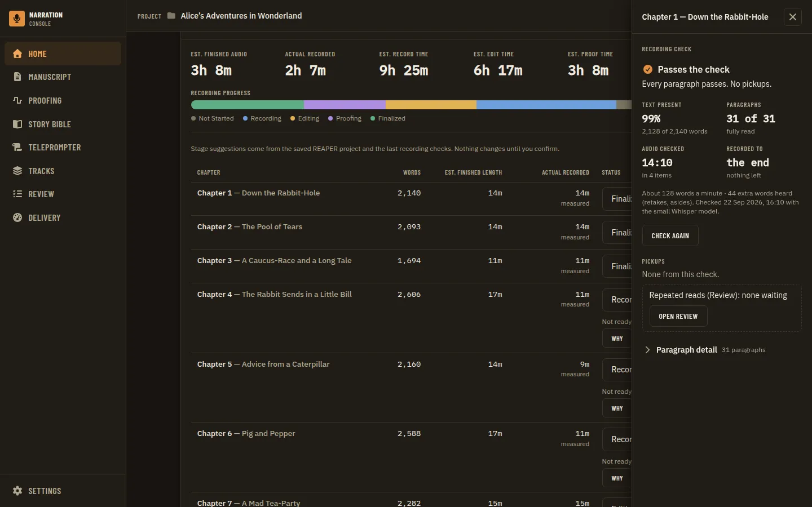
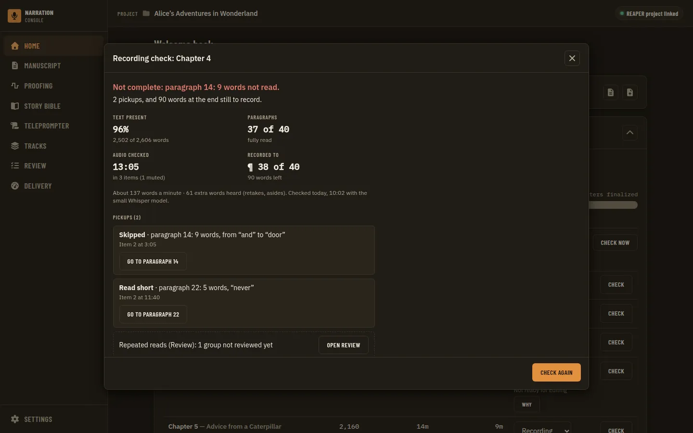
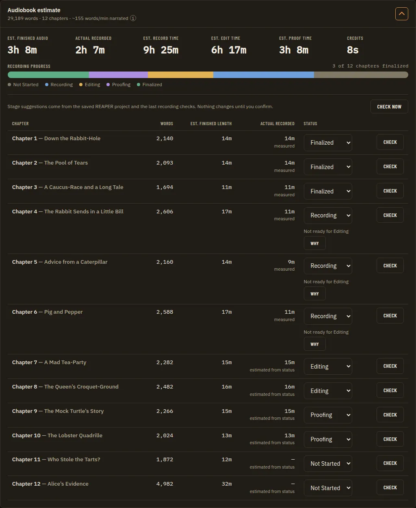
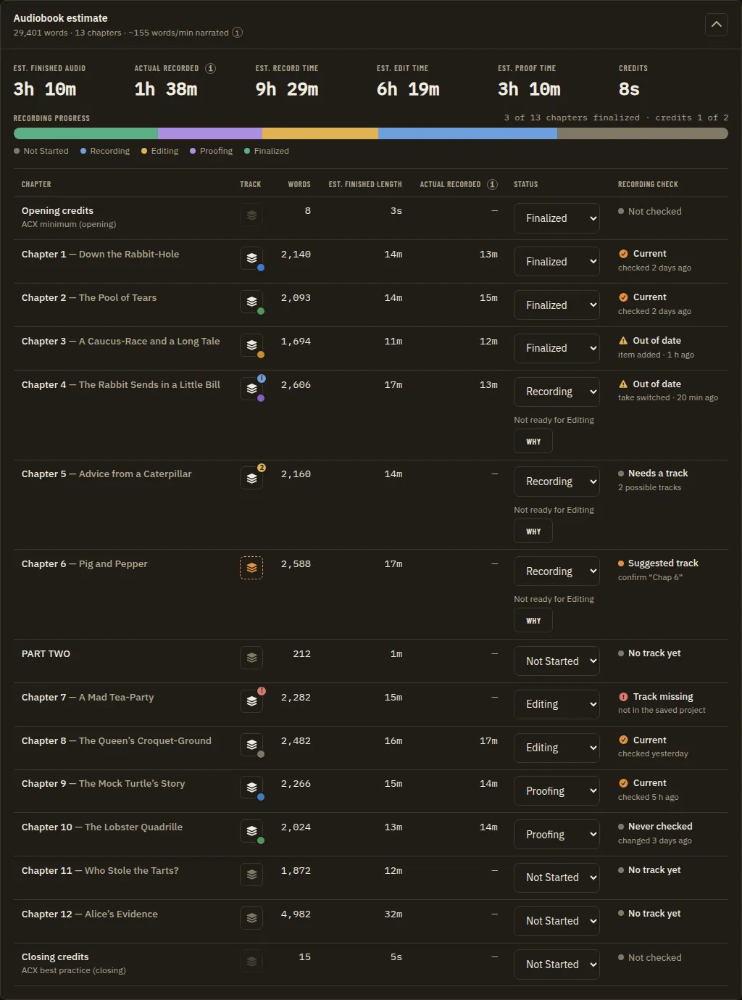
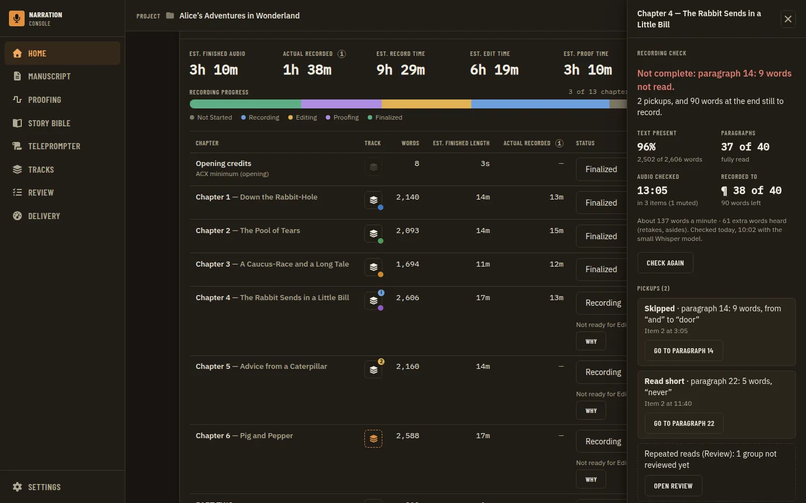

# Recording Check Summary: a Chapter Summary First, Pickups Listed

**Source:** owner request of 2026-09-24 on the Home recording check (the dialog behind each chapter row's **Check** button): "I think the 'recording check' should be more of a full summary than a paragraph breakdown, with the exception of the pickups. If we are checking here, then we could show that here too." Citations are `file:line` at `accb3bc`. Builds on the delivered recording check ([steady state](../utilities/recording-coverage.md), ADRs [0129](../adr/0129-the-coverage-bindings-answer-refusals-as-results-end-with-one-job-event-and-fill-recordedfraction-only-from-a-current-check.md) to [0131](../adr/0131-the-recording-signal-is-read-from-stored-checks-with-thresholds-applied-on-read-and-alignment-from-settings.md)) and on [take review](../utilities/take-review.md). Three sibling PRDs drafted the same day touch the same row and are not covered here: the Actual recorded column showing only real recorded duration (`actual-recorded-column.prd.md`), DAW chapter-track auto-sync, which runs checks in the background and retires the per-row Check button (`daw-chapter-track-auto-sync.prd.md`), and a per-row track-link control for track info, relink and remove (`chapter-track-link-control.prd.md`). Nothing here is built yet.

**Status (2026-09-24):** draft; open questions RS1 to RS8 wait for the owner. No tracking issue yet: open one (`docs/operations/github-workflow.md`) before Phase 1.

## Problem Statement

The recording check answers a chapter-level question: is this chapter recorded, and if not, what still has to be read? Its result reads as a list of paragraphs. After a one-line count, the dialog shows the missing regions described by paragraph numbers, then a paragraph table that opens by itself whenever anything is missing and lists every short paragraph. The narrator has to add it up themselves: whether the chapter passes, how much audio was checked, how much is left, and which few places need a pickup. The places that need action are the one thing worth listing one by one, and they are mixed in with the paragraph bookkeeping. The check also knows nothing about the pickups the app finds or tracks elsewhere (take review's repeated reads and the proofer's pickup list), so the narrator has to open two more surfaces to see all the pickups for one chapter.

## Evidence

**What the check computes and returns.**
- The sidecar measures and the host judges (`docs/utilities/recording-coverage.md`, "How it works"). The stored report has a chapter summary (`BodyTokens`, `PresentTokens`, `MissingTokens`, `ExtraTokens`, `LongestMissingRun`, items analyzed, muted, transcribed and reused, `PlayedSeconds`, `apps/desktop/internal/coverage/report.go:26-44`), per-item lines (`:55-64`), per-paragraph lines (`:67-72`) and missing regions with kind, paragraphs, word count, first and last words and an audio position (`:84-98`).
- The binding `CoverageResult` (`apps/desktop/bindings_coverage.go:100-111`) sends `ResultView` (`coverage/view.go:24-67`): state (current, stale, never), reasons, basis, record, the report and `recordedFraction`. The UI schema mirrors it (`apps/ui/src/api/schemas/coverage.ts:95-118`).
- **The verdict exists but does not reach the dialog.** The host applies the two thresholds only in the stage signal: `measuredSignal` (`coverage/signal.go:171-182`) calls `Report.TextComplete` (`report.go:225-240`), and `largestGap` (`signal.go:187-216`) names what fails first. `measuredEvidence` (`signal.go:224-258`) already writes a chapter summary: "N of M present, K missing (longest run R), E extra; P of Q passing", the regions largest first, the failing paragraphs, "N items analyzed, M muted and skipped, mm:ss played", and the model and settings. That text reaches the UI only through the stage suggestion's evidence view (`apps/ui/src/components/stages/StageEvidence.tsx:36`, `:165`), and only for a chapter in Recording. ADR 0130 chose this: "The report states counts, not a verdict ... Thresholds belong to the Phase 7 signal", and "when the signal lands, its met or not met can sit beside these counts" (`docs/adr/0130-...md`, Decision and Consequences). That follow-up was never built.

**How the result is shown today.**
- The row's **Check** button (`apps/ui/src/components/home/AudiobookEstimatePanel.tsx:284-296`) opens `RecordingCheck` (`:304-317`). The same dialog opens from the stage evidence view's "Open recording check" (`:333-337`).
- `RecordingCheck.tsx:202-235` is a modal `Dialog` titled "Recording check: <chapter>" with one action (Check recording or Check again). `ResultBody` (`:238-302`) shows the basis line, the never, stale or current note, then `RecordingCheckReport`.
- `RecordingCheckReport.tsx` shows:
  1. a headline that states counts only: "All the text is recorded" or "N words not recorded" (`verdict`, `recordingCheckText.ts:75-82`), then "Text present: N of M words." and a note about extra words (`RecordingCheckReport.tsx:40-49`);
  2. **Missing text**: one card per region with its kind label, "paragraphs 38 to 40: 14 words, from "x" to "y"", the item and source time, and **Go to paragraph** (`:50-85`; wording from `describeRegion` and `describePosition`, `recordingCheckText.ts:106-115`);
  3. **Paragraphs**: a disclosure over a table (Paragraph, Recorded, Missing, Longest gap). It is **open by default whenever text is missing** and then lists only the short paragraphs (`:34-37`, `:86-129`).
- The demo shows the effect. The mock's incomplete chapters are missing their last third as one `tail` region (`apps/ui/src/api/coverageMock.ts:75-109`), so the dialog shows one very large "End not read" card and then a long open table, one row per unread paragraph. This is the `home/recording-check-incomplete` state (`apps/ui/tests/visual/state-catalog.ts:143-148`), the guide screenshot `home-recording-check` (`doc-screenshots.json:102-104`) and the aria snapshot `dialog-recording-check.aria.yml`, which pins the heading, the "Missing text" region, the expanded Paragraphs disclosure and the table (`apps/ui/tests/aria/dialogs.spec.ts:34-35`).

**Chapter figures that are available or cheap to derive** (all from the `ResultView` the dialog already reads, with no new binding unless noted):

| Figure | Source | Cost |
| --- | --- | --- |
| Share of text present (%) | `presentTokens / bodyTokens` | UI arithmetic |
| Words missing, and in how many places | `missingTokens`, `regions.length` | UI |
| Paragraphs fully read, X of Y | `paragraphs[].present == tokens` (already computed, `RecordingCheckReport.tsx:31-33`) | UI |
| Passes the check or not, and why | `TextComplete` and `largestGap` (`signal.go:171-216`) | Host: an additive field on `ResultView` (Phase 2) |
| Audio checked (mm:ss), items, muted items | `playedSeconds`, `items[].status` | UI |
| Words heard that are not in the text (retakes, false starts, asides) | `extraTokens` | UI |
| Speaking pace (words a minute) | `presentTokens / playedSeconds × 60` | UI. Raw, because played time includes pauses and retakes (RS3) |
| Recorded up to where | the `tail` region's first paragraph | UI |
| Checked when, with which model, stale reasons | `record`, `result.model`, `reasons` | Already shown |
| Pickups found by take review (repeated reads awaiting comping) | `findingsList({ category: 'pickup', chapterId })`: findings carry `manuscript.chapter_id` (`apps/desktop/internal/repeats/adapter.go:58-67`; query shape `apps/ui/src/api/contracts/findings.ts:116-128`) | UI, existing binding |
| The proofer's pickup list (`PICKUP:` markers) for this chapter | Markers are project-wide timeline positions (`integrations/reaper/narration_pickups.lua:6-11`) and are read live over the bridge (`apps/ui/src/api/contracts/pickups.ts:52-65`). The `.rpp` parser skips plain markers (`apps/desktop/internal/tracks/parse.go:47-60`) | Host: new parsing plus attribution by the chapter track's item span. Ambiguous when chapter tracks overlap in time (RS5) |
| Noise, levels, clipping | Not produced by the check. Diagnostics findings are per audio file, not per chapter (`apps/desktop/internal/measure/diagnosticfindings.go:21-35`) | Out of scope |

**Pickups: what the word means in this app.** Three things are called pickups, and the check produces only the first:
1. **Text the check found missing** (`skip`, `short_read`, `different_text`, `head`, `tail` regions), shown today as "Missing text". The steady-state doc notes that "a paragraph read only out of place, like a pickup recorded at the end, is missing where it belongs" and that moving it back "is take review's job" (`recording-coverage.md`, "What counts as read"; "Non-goals").
2. **Take review `pickup` findings**: repeated reads (restart, pickup, exact copy) grouped on the Review page (`docs/utilities/take-review.md`, Workflow). A separate scan, not the check.
3. **The proofer's pickup list**: `PICKUP:` markers in REAPER, managed in `PickupsDialog` on Tracks (`apps/ui/src/components/tracks/PickupsDialog.tsx:38-40`, `TracksPage.tsx:240`). Project-wide, with no chapter.

A large `head` or `tail` region is not really a pickup: it means the chapter is not finished. Treating "End not read, 1,120 words" as a pickup is what makes the incomplete demo state read badly (RS2).

**What records the current design.** ADR 0130 (the dialog, "counts, not a verdict", only the short paragraphs listed); the steady-state doc's Workflow and "Three readers"; the Home guide, "Checking a chapter's recording" (`docs/guides/using-the-app/home.md:31-60`); the seven `home/recording-check-*` visual states (`state-catalog.ts:123-163`) and their drivers (`app.drivers.ts:656`); the aria snapshot above; `RecordingCheck.test.tsx`.

## Proposed Solution

Make the recording check result a **chapter summary**. First the verdict (passes the check, or the one thing that fails it first), then a short set of chapter figures. Under that, a **Pickups** list with each actionable place on its own line, and the paragraph detail folded away by default. The pickups list is the one per-item part. It holds the check's interior missing regions: skips, short reads and different text. Unfinished recording (an unread start or end) is stated in the summary as "recorded up to paragraph N" and is not listed as a pickup. If the owner wants it (RS4, RS5), the list also shows the chapter's other pickups: take review's repeated reads and the proofer's pickup markers, each marked with where it came from. The summary is one component, so it can move, with no change to its content, to wherever the auto-sync and track-link PRDs leave the entry point (RS7).

Sketch (current check, text missing):

```
Recording check: Chapter 6
Not complete: paragraph 14: 9 words not read.                       [Check again]
Text present  96%  (3,301 of 3,440 words)   Paragraphs  37 of 40 fully read
Recorded up to paragraph 38 of 40 (112 words left)
Audio checked  24:10 in 3 items (1 muted)   Pace  ~137 words/min   Extra speech  61 words
Checked 24 Sep 2026, 10:02 with the small Whisper model.

Pickups (2)
  Skipped · paragraph 14: 9 words, from "and" to "door"   Item 2, 3:05     [Go to paragraph 14]
  Read short · paragraph 22: 5 words, "never"              Item 2, 11:40    [Go to paragraph 22]
  Take review: 1 group of repeated reads not reviewed yet                   [Open Review]   (RS4)

> Paragraph detail (40 paragraphs)   (folded; RS6)
```

## Key Hypothesis

We believe a result that opens on the chapter's verdict and figures and lists only the pickups will let the narrator decide what to do next about a chapter (move on, record the rest, or record N pickups) without reading paragraph rows. We'll know we're right when the owner can say from the first screen, without scrolling or opening anything, whether a checked chapter passes and how many pickups it needs, at every viewport.

## What We're NOT Building

- No change to what the check measures, its alignment, the thresholds or settings, the sidecar, or the stored report format.
- No running of checks in the background and no retiring of the row's Check button. That is `daw-chapter-track-auto-sync.prd.md`. This PRD only makes the summary able to move (RS7).
- No change to the Actual recorded column (`actual-recorded-column.prd.md`) or to track linking in the row (`chapter-track-link-control.prd.md`). The in-dialog `TrackLink` for an `unmapped` refusal (`RecordingCheck.tsx:360-405`) stays until the track-link PRD decides its future.
- No resolving, comping or moving of pickups from the summary. Pickups link to where they are handled: the manuscript paragraph, Review, and REAPER through the existing Go to.
- No noise, level or clipping figures (not per chapter today).
- No change to the stage suggestion evidence view (`StageEvidence.tsx`), which keeps its own copy of the evidence.

## Success Metrics

| Metric | Target | How measured |
| --- | --- | --- |
| Summary first | With a current or stale result, the verdict and the chapter figures fill the first screen of the result, with no scrolling, at desktop, small-desktop and tablet | `home/recording-check-*` PNGs at every viewport, looked at |
| Pickups listed | Every interior region (`skip`, `short_read`, `different_text`) is one pickup line with Go to paragraph. `head` and `tail` appear in the summary line, not as pickups (per RS2) | Vitest on the report component; `home/recording-check-incomplete` |
| Paragraph detail demoted | The paragraph table is closed by default in every state (or gone, per RS6) | Vitest; aria snapshot |
| Same verdict everywhere | The dialog's pass or fail and reason equal the stage signal's for the same stored result and settings | Go test over `coverage` fixtures: `View` judgement equals `measuredSignal` |
| Contracts | Any new field has a Zod schema, a golden written by a Go test, a `wireContracts.test.ts` row and a mock that passes | `pnpm check` |
| Gate | `pnpm check`, the visual suite with axe clean and no new `axe-debt.ts` entry, `pnpm --dir apps/ui run aria` with the snapshot diff read | `full-verification-gate` |

## Open Questions

- [ ] **RS1. What leads the summary?** Options: (A) the host's verdict (passes or fails the check, with `largestGap`'s reason), then text present %; (B) text present % alone, keeping ADR 0130's "counts, not a verdict"; (C) the pickup count ("2 pickups, 112 words left to record"). Recommendation: A, and add the pickup count to the verdict line when it fails. The stage engine already says met or not met from the same numbers, so a dialog that will not say it is the gap the owner is describing. A needs Phase 2 and a new ADR that supersedes ADR 0130's "counts, not a verdict" clause.
- [ ] **RS2. Is an unread start or end a pickup?** Options: (A) no: state it in the summary ("Recorded up to paragraph 38 of 40, 112 words left" or "Start not read: paragraphs 1 to 2") and list only interior regions as pickups; (B) list every region as a pickup, as today's "Missing text" does; (C) A, but list a head or tail under a threshold (say, under one paragraph) as a pickup. Recommendation: A. A tail of a third of the chapter is unfinished recording, not a pickup, and the demo's one huge "End not read" card is most of what looks wrong today.
- [ ] **RS3. Which figures make the summary?** Candidates: text present %; words missing in N places; paragraphs fully read; audio checked and items (muted); extra speech; pace in words a minute; checked when and with which model. Recommendation: the first four plus "checked when" always, with pace and extra speech shown small. Pace is raw (played time includes pauses and retakes), so label it "about" or leave it out (owner's call). The Actual recorded duration stays the column's job (sibling PRD) and is not repeated here unless the owner wants it.
- [ ] **RS4. Show take review's pickups here?** "If we are checking here, then we could show that here too" can mean the check's own gaps (already here) or the app's other pickups. Options: (A) a count line for the chapter's unreviewed take-review `pickup` findings, with Open Review (existing `findingsList`, no new binding; Review has no URL filter today, so the link lands unfiltered unless a small filter parameter is added); (B) list them one per line like the gaps; (C) no. Recommendation: A. They are a different kind of pickup (already recorded, needing comping), so a count and a link are enough.
- [ ] **RS5. Show the proofer's pickup list here?** The `PICKUP:` markers are project-wide. A chapter's share could be taken from the markers inside its linked track's item span in the saved `.rpp`, which needs marker parsing (`tracks/parse.go:47-60` skips plain markers) and an additive field. That is wrong when chapters sit on separate tracks over the same stretch of the timeline. Options: (A) yes, only when the chapter's span overlaps no other linked chapter, otherwise "N pickups in the project" with Open pickups; (B) the project-wide open count only; (C) no. Recommendation: B for now, and A only if the owner records chapters one after another on the timeline. Needs the owner's project layout.
- [ ] **RS6. Does paragraph detail survive?** Options: (A) a closed disclosure listing only short paragraphs; (B) a closed disclosure with every paragraph; (C) remove it, because each pickup already names its paragraphs and links to them. Recommendation: A. It costs nothing to keep folded, and a narrator chasing a failing `min_paragraph_present` paragraph with no region (a thin read spread out) needs it: `largestGap`'s third case (`signal.go:209-214`) names such a paragraph.
- [ ] **RS7. Where does the summary live if the per-row Check button is retired** (auto-sync PRD)? Options: (A) a chapter slide-over opened from the row (the chapter's status or recorded cell), with the summary on top and the chapter's other facts later, using the `SlideOver` primitive like `StageEvidence.tsx:36`; (B) inside the track-link control's panel (`chapter-track-link-control.prd.md`), since the check is about the linked track; (C) an expandable row under the chapter in the table; (D) keep this dialog, opened from a pickup count or a pass or fail badge in the row. Recommendation: A. The summary is chapter-level, not track-level, and a slide-over leaves the table visible. Phase 1 keeps today's dialog so it does not wait on the sibling PRDs.
- [ ] **RS8. Naming.** Options: (A) "Pickups" for the check's gaps, as the owner calls them, with take review's and the proofer's shown as "Repeated reads (Review)" and "Pickup list"; (B) keep "Missing text" for the gaps and use "Pickups" only for the other two; (C) "To pick up". Recommendation: A, because it matches the owner's word for the gaps. The label in the guide and in `REGION_LABEL` stays per kind.

## Users & Context

**Primary user:** the narrator between recording sessions, going down the Home chapter table to decide which chapter to move to editing, which needs more recording, and which needs a few pickups.
**Current behavior:** opens Check, reads "N words not recorded", scrolls past a region card and an open table of short paragraphs, and works out the rest.
**Trigger:** a finished check (today on a press; in the background once auto-sync lands).
**Success state:** one glance says "passes" or "2 pickups and 112 words left", and each pickup is a click away from its paragraph.
**Job to be done:** When I finish a session, I want to know per chapter whether I'm done, and exactly what to pick up, so I can plan the next session.

## Solution Detail

| Priority | Capability | Phase |
| --- | --- | --- |
| Must | Summary block: verdict or count headline, text present %, words missing in N places, paragraphs fully read, recorded-up-to line, audio checked, checked when and model | 1 |
| Must | Pickups list: interior regions one per line with kind, paragraphs, words, position, Go to paragraph (RS2) | 1 |
| Must | Paragraph detail closed by default, or removed (RS6) | 1 |
| Must | The stale and never states keep their reasons and basis. A stale summary is labelled "from the last check" as today | 1 |
| Should | The host's pass or fail and reason on `ResultView`, shown as the headline (RS1 A) | 2 |
| Should | Take review pickups for the chapter: a count and Open Review (RS4 A) | 3 |
| Could | The proofer's pickup list count, project-wide or for the chapter (RS5) | 3 |
| Could | Pace and extra speech (RS3) | 1 |
| Could | The summary hosted in the surface the sibling PRDs settle on (RS7) | 4 |
| Won't | Resolving or comping pickups here; noise and level figures; changing the check | - |

**MVP scope:** Phase 1 (UI only), then Phase 2.

**User flow (RS1 A, RS2 A, RS6 A):** Home, then a chapter row's Check. The dialog opens on "Not complete: paragraph 14: 9 words not read." with the figures under it, then "Pickups (2)". The narrator presses Go to paragraph 14 and the manuscript opens there. For a chapter that passes: "Passes the check: text present 99% (3,412 of 3,440 words), every paragraph passes", "No pickups", and the paragraph detail folded.

## Technical Approach

**Feasibility:** HIGH. Phase 1 is a re-layout of `RecordingCheckReport.tsx` over data the dialog already has. Phase 2 adds one field to a payload the host already computes. Phase 3's take-review count reuses a binding. Only RS5 A needs new parsing.

**Architecture notes**
- **Phase 1 (UI).** Split `RecordingCheckReport.tsx` into a summary (pure derivations in `recordingCheckText.ts` next to `verdict`, unit-tested), a pickups list (today's region cards, filtered per RS2) and the paragraph disclosure (closed by default: drop `useState(!complete)` at `:37`). Name the new component something like `RecordingCheckOverview.tsx` or keep it inside the report file. `RecordingCheckSummary` is taken by the Settings page (`apps/ui/src/components/settings/RecordingCheckSummary.tsx`). The summary uses existing layout and no new primitive, so `design-spec-guard` and the atlas are not triggered unless a stat-tile primitive is added (then they are).
- **Phase 2 (host judgement).** `ResultView` gains an additive `judgement` (`state: "met" | "not_met"`, `reason`, and the thresholds used) for a result with a report, computed by the same code as `measuredSignal` (`signal.go:171-182`). Factor `TextComplete` and `largestGap` into one function both call, so the dialog and the stage engine cannot disagree. `CoverageResult` already reads the settings (`bindings_coverage.go:106`). The binding's signature is unchanged, so `hostAPIVersion` (47, `apps/desktop/app.go:52`) is expected not to move. Re-check that at merge against the README's rule. Per `CLAUDE.md` wire contracts: the Zod field in `schemas/coverage.ts`, the `coverage-result*` goldens regenerated with `UPDATE_CONTRACTS=1` by the Go contract test (`coverage/contract_test.go`), the `wireContracts.test.ts` row, and `coverageMock.ts` producing it. A stale result shows its judgement "as of the last check". A `partial` or `failed` record has none.
- **Phase 3 (other pickups).** RS4 A: `api.findingsList({ category: 'pickup', chapterId, status: 'unreviewed' })` from the summary, with "Open Review". A filter parameter on the Review route is a small addition if wanted. RS5 B: the pickup count comes from `pickupsCount` / `pickupsState` over the bridge. That needs REAPER running, so the line reads "Pickup list: open REAPER to count" otherwise. RS5 A needs `tracks` to parse plain markers (Go tests over `.rpp` fixtures), a chapter-span attribution rule and an additive field with its contract checks.
- **Phase 4 (relocation).** Mount the summary in the surface RS7 picks, once the auto-sync and track-link PRDs settle the row. If it becomes a slide-over, `pnpm --dir apps/ui run aria` gets a new snapshot (ADR 0065), and the `home/recording-check-*` states move with it.
- **ADR.** Phase 2 (RS1 A) supersedes ADR 0130's "The report states counts, not a verdict" clause: a new ADR at the next free number checked at merge (0170 is the highest today, and the sibling PRDs may take numbers first). RS2 A (head and tail are not pickups) is recorded in the same ADR. Phase 4 may need one if the dialog becomes a slide-over.

**Technical risks**

| Risk | Likelihood | Mitigation |
| --- | --- | --- |
| The dialog's verdict and the stage suggestion disagree | Medium without a shared function | One function in `coverage`; a Go test that both agree over the fixture corpus (`corpus_test.go`) |
| "Pickup" means three things and confuses | Medium | RS8; source labels on every non-check line |
| Proofer markers attributed to the wrong chapter | High for overlapping chapter tracks | RS5 B by default; A only with a non-overlap guard |
| Pace read as a finished-audio figure | Medium | Label it raw ("about") or drop it (RS3) |
| Rework when auto-sync moves the entry point | High | The summary is one component with no dialog chrome. Phase 4 only mounts it |
| The model cascade adds "confirmed by the second model" marks to regions | Certain if both ship | The pickups list keeps a per-region slot for the mark. Whichever lands second rebases |

## Implementation Phases

| # | Phase | Description | Status | Parallel | Depends | PRP Plan |
| --- | --- | --- | --- | --- | --- | --- |
| 1 | Summary layout | Summary block, pickups list (RS2), paragraph detail folded (RS6), from the existing `ResultView`; tests, visual states, aria snapshot, guide, doc screenshot | pending | with 2 | RS2, RS3, RS6, RS8 | - |
| 2 | Host judgement | Additive `judgement` on `ResultView` sharing `measuredSignal`'s rule; Zod, golden, `wireContracts` row, mock; headline uses it; ADR | pending | with 1 | RS1 | - |
| 3 | The chapter's other pickups | Take review pickup count and link (RS4); pickup list count (RS5) | pending | - | 1; RS4, RS5 | - |
| 4 | Move the summary | Mount it in the surface RS7 chooses once the per-row Check button is retired | pending | - | 1; `daw-chapter-track-auto-sync.prd.md`, `chapter-track-link-control.prd.md`; RS7 | - |

### Phase Details

**Phase 1: Summary layout.** Scope: `RecordingCheckReport.tsx` (or a new overview component beside it), `recordingCheckText.ts` and its test (derivations: percent, pickups filter, recorded-up-to, pace), `RecordingCheck.test.tsx`; `state-catalog.ts` descriptions for `recording-check-complete`, `-incomplete` and `-stale`; possibly a new `recording-check-pickups` state with interior regions (the mock's only region is a `tail`, so `coverageMock.ts` needs a seed with a `skip` and a `short_read`); `dialog-recording-check.aria.yml` updated (the table leaves the default tree, and the Paragraphs button is no longer `[expanded]`), with the diff read; `docs/guides/using-the-app/home.md:46-52`; `docs/utilities/recording-coverage.md` ("Three readers"); the `home-recording-check` doc screenshot regenerated. Success: metrics rows 1 to 3. Verification: TDD in Vitest; `pnpm check`; `npx playwright test tests/visual/app.spec.ts -g "home.*recording-check"`, then open every PNG under `apps/ui/screenshots/app/home/recording-check-*/` at desktop, small-desktop and tablet; `pnpm --dir apps/ui run aria`.

**Phase 2: Host judgement.** Scope: `apps/desktop/internal/coverage/{view.go,signal.go,report.go}` and tests, `contract_test.go` goldens, `apps/ui/src/api/{schemas/coverage.ts,contracts/coverage.ts,coverageMock.ts,wireContracts.test.ts}`, the headline in `recordingCheckText.ts`, a new ADR, and `recording-coverage.md` (Decisions: the dialog now shows the verdict). Success: metric row 4, and the contract row. Verification: `go test ./...` in `apps/desktop`; `pnpm check`.

**Phase 3: The chapter's other pickups.** Scope: the summary component, `findingsMock.ts` seeding a pickup finding for a demo chapter, optionally a Review route filter; for RS5 A, `apps/desktop/internal/tracks/parse.go` and a coverage or chapter field with its contract checks. Success: the chapter's unreviewed take-review pickups are counted and link to Review; the pickup list line matches `PickupsDialog`'s remaining count. Verification: as Phase 1, plus Go tests for any parsing.

**Phase 4: Move the summary.** Scope decided by RS7 and the sibling PRDs. Expect `AudiobookEstimatePanel.tsx`, the new host surface, the state catalog and drivers, and an aria snapshot for a new slide-over. Success: the summary reads the same in its new place, and no surface is left that opens the old dialog.

### Parallelism Notes

Phases 1 and 2 touch different layers: 1 is UI only, 2 is Go plus the schema, and they meet only at the headline text, so they can run in parallel with a small rebase. Phase 3 needs Phase 1's layout. Phase 4 waits for the auto-sync and track-link PRDs to decide the row.

**Parallel-session compatibility**

| Phase | Files and areas touched | Collision risk |
| --- | --- | --- |
| 1 | `apps/ui/src/components/home/{RecordingCheckReport.tsx,RecordingCheck.tsx,recordingCheckText.ts}` and tests, `apps/ui/src/api/coverageMock.ts`, `apps/ui/tests/visual/{state-catalog.ts,app.drivers.ts}`, `apps/ui/tests/aria/snapshots/dialog-recording-check.aria.yml`, `docs/guides/using-the-app/home.md`, `docs/utilities/recording-coverage.md`, `docs/images/ui/home-recording-check.webp` | **`daw-chapter-track-auto-sync.prd.md`** (retires the Check button and may change when `RecordingCheck` opens, its never/running states and ADR 0130's "runs only on a press"); **`chapter-track-link-control.prd.md`** (the in-dialog `TrackLink`/`MappingConfirm` at `RecordingCheck.tsx:360-405` and the `unmapped` refusal state); [Recording Check Model Cascade](recording-check-model-cascade.prd.md) Phase 5 (same three files; MC5 marks re-checked regions in the region list); [Credits in the Chapter Table](credits-in-chapter-table.prd.md) Phase 3 (`RecordingCheck.tsx` takes a credits source); `home.md` edits by the stage check line PRD |
| 2 | `apps/desktop/internal/coverage/{view.go,signal.go,report.go,contract_test.go}`, `tests/fixtures/contracts/coverage-result*.json`, `apps/ui/src/api/{schemas,contracts}/coverage.ts`, `wireContracts.test.ts`, `docs/adr/` | Model Cascade Phase 2 (`report.go`, `schemas/coverage.ts`, coverage goldens); **`actual-recorded-column.prd.md`** if it changes `recordedFraction` or `ResultView`; [Chapter Stage Recommendations](chapter-stage-recommendations.prd.md) (reads `signal.go`); ADR numbering with every sibling |
| 3 | the summary component, `apps/ui/src/api/findingsMock.ts`, possibly `apps/ui/src/components/review/` (a route filter), possibly `apps/desktop/internal/tracks/parse.go` | [Review Dashboard and Findings Adoption](review-dashboard-and-findings-adoption.prd.md) (Review page); [REAPER Automation Follow-Through](reaper-automation-follow-through.prd.md) (pickup markers, `tracks` regions) |
| 4 | `apps/ui/src/components/home/AudiobookEstimatePanel.tsx`, the chosen host surface, state catalog and drivers, an aria snapshot | **All three sibling PRDs** (the same row and panel); [Credits in the Chapter Table](credits-in-chapter-table.prd.md) Phase 2 and the [stage check line](home-stage-check-line.prd.md) (same panel) |

Cross-cutting: each phase follows `CLAUDE.md`: an issue and `Closes #<n>`, `change-impact-scan` (the consumers of `recordingCheckText.ts`, which `StageEvidence.tsx:6` also imports, and of `coverage.ResultView`), TDD, `full-verification-gate` with the visual suite and PNG review at every viewport and the aria run, `design-spec-guard` only if a primitive or `styles.css` changes, and `feature-cleanup`. No trust boundary changes, except that RS5 A reads more of the saved `.rpp` (re-read row 4e of `docs/architecture/threat-model.md`).

## Decisions Log

| Decision | Choice | Alternatives | Rationale |
| --- | --- | --- | --- |
| The check itself is unchanged (proposed) | Presentation and one derived field only | New measures (pace from word timestamps, noise) | The owner asked for a different reading of the same result |
| Summary first, pickups listed, paragraphs folded (proposed) | As the owner asked | Keep the paragraph table open when incomplete (ADR 0130) | Pickups are the actionable items; paragraphs are bookkeeping |
| The verdict comes from the host (proposed, RS1 A) | An additive field sharing the stage signal's rule | Recompute thresholds in the UI from Settings (`recordingRule`, `settings/RecordingCheckSummary.tsx`) | The host judges (ADR 0131); one rule for the dialog and the stage engine |
| Head and tail are not pickups (proposed, RS2 A) | "Recorded up to ..." in the summary | Every region is a pickup | An unfinished chapter is not a pickup job |
| Phase 1 keeps the dialog (proposed) | Relocate in Phase 4 | Wait for auto-sync | The owner's complaint is the content, and it can ship first |

## Research Summary

- Read: `docs/prds/README.md`, the two committed sibling PRDs, `docs/utilities/recording-coverage.md`, `docs/utilities/take-review.md`, ADR 0130; `RecordingCheck.tsx`, `RecordingCheckReport.tsx`, `recordingCheckText.ts`, `AudiobookEstimatePanel.tsx`, `StageEvidence.tsx`, `coverageMock.ts`, `settings/RecordingCheckSummary.tsx`, `PickupsDialog.tsx`; `schemas/coverage.ts`, `schemas/pickups.ts`, `contracts/pickups.ts`, `contracts/findings.ts`; `internal/coverage/{report.go,view.go,signal.go}`, `bindings_coverage.go`, `internal/repeats/adapter.go`, `internal/measure/diagnosticfindings.go`, `internal/tracks/{parse.go,tracks.go}`, `narration_pickups.lua`; the state catalog, drivers, aria snapshot and doc screenshot list; the model cascade PRD.
- Not done: the dialog was not opened in the desktop app on a real chapter, so how the owner's chapters split into head, tail and interior regions is not known. That decides how much RS2 changes. The owner's timeline layout (chapters one after another, or stacked on separate tracks from zero) decides RS5.

---

*Generated: 2026-09-24*
*Status: DRAFT - open questions RS1 to RS8 wait for the owner*

## Visual Spec

Mockups approved by the owner on 2026-09-24. They were rendered from the real app (dark theme, the app's own fonts and components) with throwaway edits and invented sample data, so names, numbers and body text are placeholders; the layout, controls, states and wording are the spec. Each shows the recommended answer to the open questions unless its caption says it is an alternative. Where a mockup and the text above disagree, raise it before building rather than silently following either.



*Before* (`00-before.webp`)



*Slideover not complete* (`01-slideover-not-complete.webp`)



*Slideover not complete full height* (`01b-slideover-not-complete-full-height.webp`)



*Slideover passes* (`02-slideover-passes.webp`)



*Alternative (not the recommendation): Summary in dialog* (`03b-alt-summary-in-dialog.webp`)

### Together with the related PRDs

The same screen with every PRD that changes it applied at once.



*Before* (`00-before.webp`)



*Home after* (`01-home-after.webp`)



*Home after summary open* (`02-home-after-summary-open.webp`)
