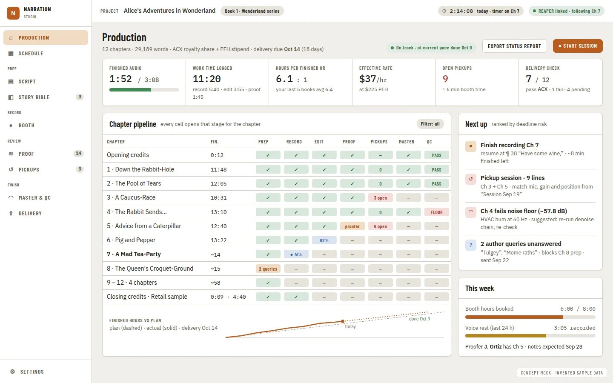
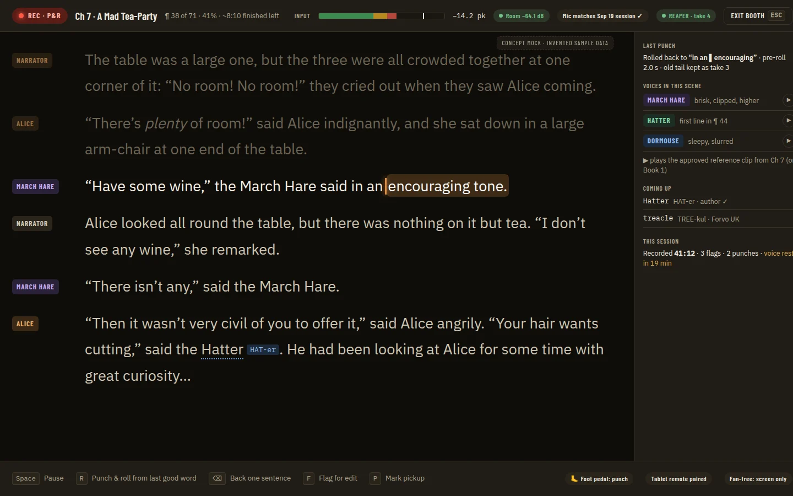
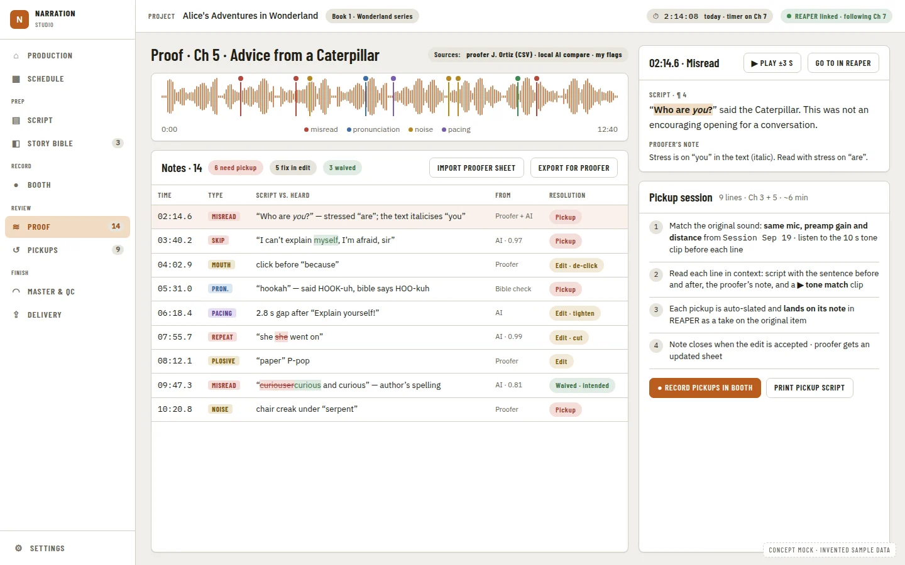
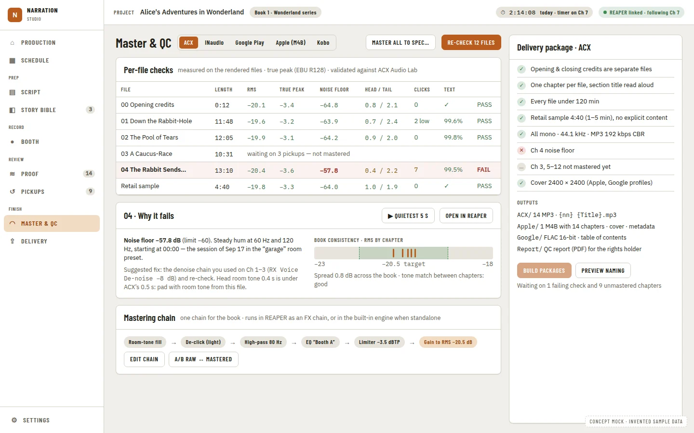
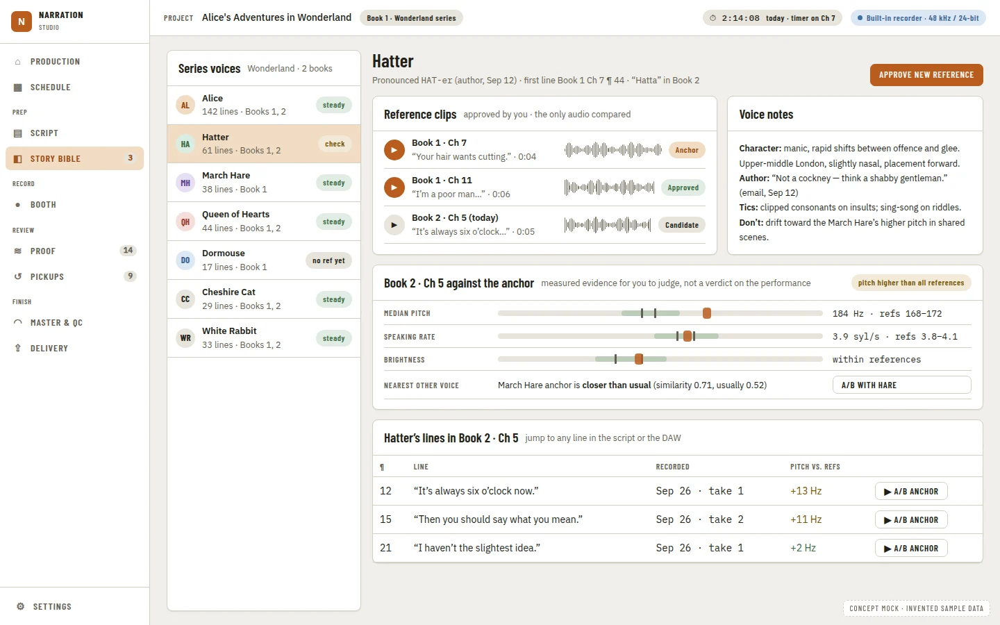
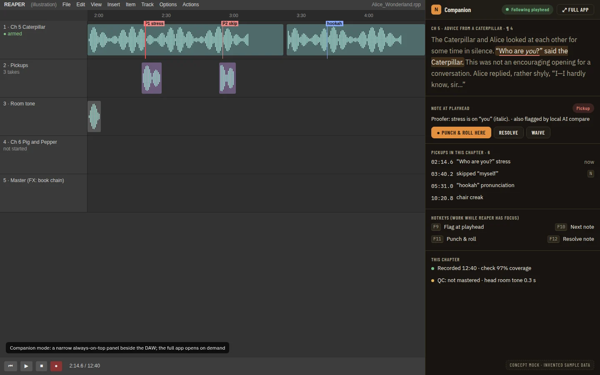

# Stage Navigation and Page Replacement: One Page per Job, Grouped by Production Stage

**Source:** the owner's decision D79 on [#509](https://github.com/countrymanprime/narration-utils/issues/509) (2026-09-27): "the 'booth' page basically replaces the teleprompter page so i don't want to maintain 2 different versions and have dev slowed down by doing so - same with other pages"; D69 (the [audiobook studio benchmark](../research/audiobook-studio-benchmark.md)'s concept mocks are the approved build spec, and dark mode is one global theme); the benchmark's [§3](../research/audiobook-studio-benchmark.md#3-what-the-ideal-looks-like-concept-mocks) ("The navigation is grouped by stage: Production, Prep, Record, Review, Finish. The top bar always shows the audio engine"). **Decision record:** [ADR 0407](../adr/0407-a-new-page-replaces-its-old-counterpart-in-the-same-change-and-the-navigation-is-grouped-by-production-stage.md) (Proposed, this PRD). **Reconciles:** Production Tracking (delivered and deleted; `git log --diff-filter=D -- docs/prds/production-tracking.prd.md` finds it; see [Production](../guides/using-the-app/production.md)), [Booth Mode and Companion Panel](booth-mode-and-companion-panel.prd.md), [Edit and Proof Workspace](edit-and-proof-workspace.prd.md), [Prep Depth](prep-depth.prd.md), [Render, Encode and Master](render-encode-master.prd.md), [Delivery Platform Profiles](delivery-platform-profiles.prd.md), [Character Continuity Review](character-continuity-review.prd.md), [App Navigation and Zoom Controls](app-navigation-and-zoom-controls.prd.md) and fourteen others (see [PRD edits](#prd-edits-made-with-this-prd)).

Citations are `file:line` on `main` at `c23e6b8`.

## Problem Statement

The benchmark PRDs are building the approved mock pages one by one, and each was written to add its page **beside** the page it overlaps: the Production page beside Home, the booth as a third way to read aloud beside the Teleprompter page and the Read aloud dialog, the chapter workspace beside Tracks and Proofing until a late consolidation. Every duplicate carries its own visual rows, aria snapshots, guide page, doc screenshots and fixes, and every later PRD has to decide which of the two to build on. The owner has ruled that out (D79): a new page replaces the old one in the same change. Nothing today says which new page replaces which old one, in what order, or what dies with each, and the navigation is still a flat list of nine items that matches none of the mocks.

## Evidence

- **The navigation today is flat.** `apps/ui/src/components/layout/AppShell.tsx:30-43` lists Home, Manuscript, Proofing, Story Bible, Teleprompter, Tracks, Review and Delivery, with Settings at the foot (`:135-139`). The header holds Back and Forward, the project name and a REAPER link pill with three states (`:96-108`, `:174-212`). Every mock draws Production, Schedule │ Prep: Script, Story Bible │ Record: Booth │ Review: Proof, Pickups │ Finish: Master & QC, Delivery │ Settings, and a top bar with the project and series, a running timer and an engine chip.
- **Three ways to read aloud.** `/teleprompter` is `TeleprompterPage` (`App.tsx:445-448`). The Manuscript opens `ReadAloudDialog` with `readAloudMode` `'read' | 'booth' | 'companion'` from "Read aloud", "Booth" and "Companion" buttons on every chapter card (`components/manuscript/Manuscript.tsx:113`, `:645-732`, `:880`). `BoothView` is a `Dialog size="full"` on `FocusShell`, and `CompanionShell` a `CompactShell` that narrows and pins the one window (ADR 0401). The catalog carries 13 `teleprompter` states and 36 read-aloud, booth and companion states under `manuscript`, several of them the same screen (`listening`, `following-paused`).
- **A second Home is in flight.** PR #760 (production tracking P4) adds `/production` and a nav entry and leaves Home (`/`, 57 visual states, 9 doc screenshots) untouched, per production tracking's own "sits beside the existing chapter table rather than replacing any of it" (`production-tracking.prd.md:30`).
- **Two players and two proof surfaces.** The chapter workspace (`/tracks/chapter/:chapterId`) already plays a chapter on `useChapterPlayback`, and `TracksPage` plays the same tracks on `useTrackPlayback` built on the same playlist (`components/workspace/playlist.ts`, used by `tracks/useTrackPlayback.ts`). Transcript Compare's per-chapter results on `/proofing` are the workspace's misread flags (edit-and-proof-workspace, "Page inventory and consolidation"). That PRD deferred the merge to its Phase 10, "later".
- **Delivery is already turning into Master & QC.** PR #792 (render-encode-master P5) adds `MasterQcPanel` to `DeliveryPage`, and render-encode-master calls the result "the Master & QC page (this train's extended Delivery Platform Profiles page)" (`render-encode-master.prd.md:113`).
- **Phases already written against pages that will go.** Teleprompter manuscript integration P13 ("Retire the standalone page"), proofing readiness signals P6 (a Proofing page section), credits token setup P3 (a banner on Home), manuscript credits card parity P3 (a `/manuscript#…` handler), chapter title display P3 (`ReadAloudDialog` and `TeleprompterPage` titles), character continuity P11 (a new nav entry) and others; see [PRD edits](#prd-edits-made-with-this-prd).
- **The nav is a serial point.** "Adding a nav item" (`docs/prds/README.md`) and [agent train serial points](../operations/agent-train.md#serial-points): the `AppShell.tsx` navigation and header land one at a time, and each change regenerates every doc screenshot under `docs/images/ui/`.

## Proposed Solution

1. **Land the stage-grouped navigation first, over the existing pages** (Phase 1): `NAV` becomes five groups plus Settings, each existing page placed in its stage's group under its current name, and the REAPER pill becomes the engine chip. This is the one serial change that every later phase builds on.
2. **Then replace one page per phase.** Each phase builds the new page from the approved mock, moves every component it keeps, deletes the old page and everything that only served it, and adds a redirect from the old route. The nav item takes the new name and route in the same phase. There is never a toggle or a "classic" view (ADR 0407).
3. **Reconcile the other PRDs now**, in this PR: superseded phases are marked, "new nav entry" phases point at their group, and phases written against a doomed page point at its replacement.

## Key Hypothesis

We believe one page per job, grouped the way a narrator's week runs, will cut the maintenance cost of the UI (one set of visual rows, snapshots, guides and screenshots per job) and make the app easier to find one's way in than a flat list of nine tools. We will know it holds when, after the last phase, no two routes render the same job, the visual catalog has one page key per nav item, and the owner can reach every stage from the grouped nav without the old page names.

## What We're NOT Building

| Item | Why |
| --- | --- |
| A toggle, setting or "classic view" that keeps an old page | D79; ADR 0407 |
| A Schedule page | No mock draws it. The deadlines and milestones stay the Production home's plan panel (production tracking P3/P4) until a PRD gives Schedule its own page (Q2) |
| A separate Delivery page beside Master & QC | Mock 05 puts the delivery package in Master & QC's side panel. One page (Q2) |
| New features on the replacement pages beyond the mocks their owning PRDs already scope | Each page's features stay in its owning PRD (production tracking, prep depth, booth mode, edit-and-proof, closed-loop proofing, render-encode-master, delivery profiles). This PRD moves, renames, merges and deletes |
| Nav count badges (the mocks' "14", "9", "3") | `NavButton` has no count slot; a badge is a primitive change with its own justification (Q12, Could, later) |
| A built-in recorder | [Native Recording Suite](native-recording-suite.prd.md). The engine chip can show "Built-in recorder"; nothing selects it yet |
| A route for companion mode | The companion is the Booth in its narrow, pinned mode (ADR 0401); it is not a page |
| Linux or macOS layouts | D74 ([ADR 0412](../adr/0412-windows-is-the-only-supported-platform-for-now.md)) |
| A per-page theme | D69, [ADR 0365](../adr/0365-the-theme-is-one-global-setting-and-the-booth-and-companion-follow-it.md): dark mode is one app-wide theme; the Booth follows it |

## Success Metrics

| Metric | Target | How measured |
| --- | --- | --- |
| One page per job | After each replacement phase, the old page's component file, route element, nav item and catalog page key no longer exist | Review of the phase's diff; `rg` for the old component name returns only the redirect and the changelog |
| Old links still land | Every retired route redirects with its hash and query | `App.test.tsx` rows, one per redirect |
| The nav matches the mocks | Five groups in mock order, Settings at the foot, every item in its stage | `AppShell.test.tsx`; the four `navigation-*.aria.yml` snapshots; `nav-sidebar-desktop.webp` against mock 01 |
| One header | Back/Forward, project, timer chip, zoom group, engine chip in that order at every viewport, no sideways overflow at the 390 px reflow width | Visual suite `shell` page rows at every viewport; `navigation-header.aria.yml` |
| No duplicate states | No two catalog page keys capture the same screen | The visual suite's duplicate check (it already fails two identical states without `sameAs`) |
| Gate | `pnpm check`, the visual suite at every viewport, `pnpm --dir apps/ui run aria` (the nav changes every phase), the atlas only if a primitive changes | `full-verification-gate` |

## Open Questions

Every question carries a recommendation, adopted unless the owner says otherwise (D22). Q2 goes on [#510](https://github.com/countrymanprime/narration-utils/issues/510) as an owner FYI because it leaves two of the mocks' nav items out; it does not block.

1. **Route names.** (A) Flat: `/`, `/script`, `/story-bible`, `/booth`, `/proof`, `/proof/:chapterId`, `/pickups`, `/master`, `/settings`. (B) Stage-prefixed: `/prep/script`, `/record/booth`, … **Recommendation: A.** The group is a nav concept, not part of the address; flat routes keep deep links short, and moving a page between groups later changes no URL.
2. **The mocks' nav items that have no mock page (Schedule, Delivery).** (A) Show them only once a page exists: Schedule stays the Production home's plan panel and Delivery stays Master & QC's package panel. (B) Add them now as anchors into those pages. **Recommendation: A** (ADR 0407 item 5): a nav item that scrolls a page is a second way to the same place, which is the duplication D79 removes. Owner FYI on #510.
3. **Where do the Tracks page's track list and REAPER tools go?** (A) An **engine panel**: a slide-over opened from the engine chip on any page, holding the linked `.rpp` (link, relink), the track list with chapter links and sync activity, and the REAPER tools (Link chapters, Create regions, Render config, Chapter tags, Cleanup tools, Retakes on lanes). (B) A "REAPER project" nav item (edit-and-proof EP13's proposal). (C) Spread the tools over the stage pages. **Recommendation: A.** They are about the engine, not a stage; the chip is where the mocks show the engine; B adds a nav item no mock has. The Pickups import and export go to the Pickups page (Phase 7), and Retakes on lanes moves on into the Takes panel when edit-and-proof P6 lands.
4. **Where does the Review page's cross-chapter queue go?** (A) It becomes the book level of Proof (`/proof`): every note in one queue, drawn as mock 04's notes table, and a chapter opens its chapter view (`/proof/:chapterId`, the workspace). (B) A separate "Review" item beside Proof. **Recommendation: A.** It keeps edit-and-proof EP13's answer (Review stays the cross-chapter queue with "Open in workspace") inside one nav item, as the mock draws it.
5. **Does Phase 1 rename the existing items to the stage names?** **Recommendation: no.** An item takes its new name (Production, Script, Booth, Proof, Master & QC) in the phase that ships the page behind it; a "Booth" label over the old Teleprompter page would promise a page that is not there.
6. **How are the groups drawn at each width?** **Recommendation:** on the wide rail (≥ 1400 px) a `section-label` heading per group, as the mocks draw it; on the icon-only rail a thin divider; in the drawer the headings again. Each group is a `role="group"` named by its label, so a screen reader hears the stage. No new primitive.
7. **What sets the engine chip to "Built-in recorder"?** **Recommendation:** nothing on the host yet. The chip takes an `engine` value (`'daw' | 'builtin'`) that the UI defaults to `'daw'`; the `builtin` state is reachable from a mock flag (`?mockEngine=builtin`) for the story, the visual row and the demo (D67). The native recording suite adds the host field and its wire contract when it builds a recorder.
8. **Where does `/tracks` redirect?** (A) `/proof`, whose chapter picker is where a narrator now goes to listen to a chapter; (B) `/` with the engine panel open. **Recommendation: A.**
9. **Companion mode's entry.** **Recommendation:** a "Companion" action in the Booth's header; the Manuscript's per-card "Booth" and "Companion" buttons become one "Record in Booth" link (`/booth?chapter=<id>`) in Phase 3 or 4, whichever lands second.
10. **Guide pages.** **Recommendation:** rename and rewrite them with the page (`home.md` → `production.md`, `manuscript.md` → `script.md`, `teleprompter.md` → `booth.md`, `proofing.md` + `review.md` + `workspace.md` → `proof.md`, `tracks.md` → the engine panel section of `navigation.md`, a new `pickups.md`, `delivery.md` → `master-and-qc.md`) and fix every link; no stub files.
11. **Settings' Teleprompter category.** **Recommendation:** rename it "Booth" in Phase 4, anchor `#booth`, with `#teleprompter` kept as an alias in `SETTINGS_ANCHORS` so old links land.
12. **Nav count badges.** **Recommendation:** Could, later. A `count` on `NavButton` is a primitive change (lane U, its own justification against [ADR 0360](../adr/0360-studio-primitives-land-as-flat-leaf-files-after-one-token-batch-and-capability-gating-is-a-primitive.md)); add it when the Proof, Pickups and Story Bible pages have a stable count source.

## Users & Context

- **The narrator** moving through a book's stages: planning on Production, preparing the script, recording in the Booth, proofing and picking up, mastering and delivering.
- **Keyboard and screen-reader users**, who hear the group name before each item and must find every old page's job under its new name.
- **Every train worker**, who needs one page to build on and a nav rule that says where a new item goes.

## Solution Detail

### Core capabilities (MoSCoW)

| Priority | Capability | Phase |
| --- | --- | --- |
| Must | Stage-grouped nav and the one header design, with the engine chip | 1 |
| Must | One replacement phase per page: new page, moved components, old page and its rows, snapshots, guides and screenshots deleted, redirect added | 2-8 |
| Must | Redirects for every retired route, keeping hash and query | 2-8 |
| Must | The other PRDs point at the replacement pages (done in this PR) | - |
| Should | The running-timer chip in the header | 2 |
| Should | The engine panel for the REAPER project and its tools | 6 |
| Could | Nav count badges (Q12) | later |
| Won't | Two versions of any page; a Schedule page; a companion route | - |

### MVP scope

Phase 1 and the replacements whose owning PRDs already have their page work merged or in review: Production home (2), Booth (4), Proof (5) and Master & QC (8). Script (3), Pickups (7) and the engine panel (6) follow.

### The navigation

| Group | Item (final name) | Route | Replaces | Gate (Phase 1 carries `requiresManuscript`/`requiresDaw`) |
| --- | --- | --- | --- | --- |
| Production | Production | `/` | Home; `/production` (PR #760) | none (it hosts the import when there is no manuscript, as Home does) |
| Prep | Script | `/script` | Manuscript `/manuscript` | manuscript |
| Prep | Story Bible | `/story-bible` | (moves into Prep) | manuscript |
| Record | Booth | `/booth` | Teleprompter `/teleprompter`, the Read aloud dialog, the booth dialog | manuscript |
| Review | Proof | `/proof`, `/proof/:chapterId` | Review `/review`, Proofing `/proofing`, the workspace `/tracks/chapter/:chapterId`, the Tracks player | none at `/proof`; manuscript for a chapter view. The Proofing item's `requiresDaw` goes: the compare run inside is gated by `CapabilityGate` |
| Review | Pickups | `/pickups` | The Pickups dialog (Tracks) | none |
| Finish | Master & QC | `/master` | Delivery `/delivery` | none |
| (foot) | Settings | `/settings` | - | none |

In Phase 1 (before any replacement) the groups hold the pages as they are: **Production:** Home; **Prep:** Manuscript, Story Bible; **Record:** Teleprompter; **Review:** Proofing, Review, Tracks; **Finish:** Delivery. The rule for later PRDs (it replaces README's "Adding a nav item"): a new page names its group; a page that does the job of an existing one replaces it (ADR 0407); a section of a page is not a nav item.

### The header (one design, reconciling App Navigation and Zoom Controls)

From left to right, at every width:

1. The drawer button (below `md` only, as today).
2. **Back** and **Forward** (app-navigation P1, delivered).
3. `Project` label, folder icon and project name (truncates first); a **series chip** ("Book 1 · Wonderland series") once [Character Continuity Review](character-continuity-review.prd.md) P9 stores series membership, not before.
4. Right-aligned: the **running-timer chip** ("2:14:08 · today · timer on Ch 7") while a production stage timer runs (Phase 2); hidden otherwise.
5. The **zoom group** `[−] 100% [+]` (app-navigation P2, pending, unchanged: "before the REAPER pill" now reads "before the engine chip").
6. The **engine chip**, replacing the REAPER pill. States: `REAPER linked` (the `--character` dot), `Wrong REAPER project open` (`--warn`), `No REAPER project linked` (`--non-text`), and `Built-in recorder` (accent dot; UI-only until native recording, Q7). A later suffix names what it follows ("· following Ch 7") once edit-and-proof P7 feeds the playhead. Clicking it runs today's link action in Phase 1 and opens the engine panel from Phase 6. Below `md` it shortens to its dot with the full text in its accessible name (app-navigation Q10 A, unchanged).

Primitives only: `IconButton`, `TooltipTarget`, `StatusBadge` for the chip's dot and label, `NavButton` and `NavDrawer`. The chip keeps today's styled button (already inside the `rawNatives.test.ts` ceiling) unless `Button` fits its shape; either way no new primitive.

### Page inventory and replacement map

Counts are from `main` at `c23e6b8`. "Moves" means the file moves to the new page's folder (or stays and is imported) and is not copied; "dies" means it is deleted in the phase. Catalog rows are in `apps/ui/tests/visual/catalog/<page>.ts` with drivers in `tests/visual/drivers/<page>.ts`; `interactionFeedback` rows in `apps/ui/src/interactionFeedback/<area>.ts`; doc screenshots are mapped in `tests/visual/doc-screenshots.json`.

| Current page, dialog or item | Stage group | Replaced by | Kind | Redirect | What dies with it | What moves | Phase |
| --- | --- | --- | --- | --- | --- | --- | --- |
| **Home** `/` (`components/home/`, 20 files, 14 tests) | Production | **Production home** at `/`: production tracking P4's `ProductionPage` (PR #760), mock 01 | Merge | `/production` → `/` | `Home.tsx`, `AudiobookEstimatePanel.tsx`'s chapter table (the stage board replaces it), `Home.test.tsx`, `AudiobookEstimatePanel.test.tsx`; the `home` page key (57 states: those whose screen survives are re-keyed `production/*`, the chapter-table states `chapter-table-{collapsed,expanded,credits-missing}` and `chapter-names` die); `home.md`; the 9 `home-*` images; `interactionFeedback/home.ts` rows for the two dead files | `ImportReview`, `RecordingCheck`, `RecordingCheckReport`, `recordingCheckText` (also used by the workspace, editing, proofing and stages), `ChapterTrackPanel`, `ChapterTrackButton`, `RemoveFromRecordingDialog`, `RemovedFromRecordingList`, `ChapterCheckStatusButton`, `PickupListCount`, `TakeReviewPickups`, the credits hooks and the stage and editing panels, opened from board cells; their slide-overs and 8 aria snapshots keep their names | 2 |
| `/production` (PR #760, unlisted from Phase 1) | Production | the Production home at `/` | Move | `/production` → `/` | the route element | `components/production/*` | 2 |
| **Manuscript** `/manuscript` (`components/manuscript/`, 17 files, 12 tests) | Prep | **Script** `/script`, mock 02: chapter list with prep status, the reader with speaker tags and markup, a rail of Pronunciations, Characters and Queries | Move and restyle | `/manuscript` → `/script` with its hash (`#p<n>`, `#c<id>`, `#credits-<kind>`) | the `manuscript` page key (the 28 reader states re-keyed `script/*`); `manuscript.md` (becomes `script.md`); the 18 `manuscript-*` images (the reader ones regenerated as `script-*`, the read-aloud ones move in Phase 4); the per-card "Read aloud", "Booth" and "Companion" buttons (one "Record in Booth" link, Q9); `goToManuscript` becomes `goToScript`; `AppShell.tsx:214`'s padding exception moves to `/script` | every reader file; `EntitySummary`, `PronunciationWork` and `PronunciationQueries` are imported into the rail, not copied | 3 |
| **Story Bible** `/story-bible` (`components/storybible/`) | Prep | itself, under Prep | Move (nav only) | none | nothing | - | 1 |
| **Series voice bible** (mock 06) | Prep | a **Series tab of Story Bible** (character continuity P11) | New tab, no nav item | none | nothing | - | (character continuity P11) |
| **Teleprompter** `/teleprompter` (`TeleprompterPage.tsx`, 13 states) | Record | **Booth** `/booth`, mock 03, on `FocusShell`: pre-session setup (chapter, microphone, model, resume, credits), then the reading surface with rail and hotkey bar | Merge | `/teleprompter` → `/booth`; Settings `#teleprompter` → `#booth` (Q11) | `TeleprompterPage.tsx`, `ChapterSuggestionHint.tsx`, `TeleprompterPage.test.tsx`; the `teleprompter` page key (13 states: survivors re-keyed `booth/*`); `teleprompter.md`; 3 `teleprompter-*` images; its 6 `interactionFeedback/teleprompter.ts` rows and 4 `SILENT_CATCHES` | `useTeleprompterSession`, `ReadAlongView`, `ReadingControlBar`, `UnresolvedCreditsWarning`, `useFollowCursor`, `readerModel` | 4 |
| **Read aloud dialog** (`ReadAloudDialog.tsx`, opened from the Manuscript) | Record | the Booth | Merge | none (it had no route); a Script card links to `/booth?chapter=<id>` | `ReadAloudDialog.tsx` and its test (its session wiring moves into the Booth page); `manuscript/read-aloud-*` (31 states: survivors re-keyed `booth/*`, duplicates of `teleprompter/*` dropped); the aria snapshots `dialog-read-aloud-{controls,credits}` (the page is not a dialog, ADR 0065); `manuscript-read-aloud-{credits,flag,listening,resume}` images | `ReaderRail`, `ReaderFlagsPanel`, `ReaderKey`, `ReaderText`, `ResumePrompt` (its aria snapshot `dialog-read-aloud-resume` stays if it stays a dialog), `WhisperModelPrompt`, `RecordInReaperConfirm`, `MicrophoneField`, `readerFlags`, `readerPreferences`, `useInputLevel`, `useReadAloudReaperState`, `useRecordInReaper`, `useResumeLocate`, `usePacedCursor` | 4 |
| **Booth dialog** (`BoothView` in `Dialog size="full"`) | Record | the Booth page | Merge | none | the `Dialog` wrapper; `dialog-read-aloud-booth.aria.yml`; `manuscript/booth-{default,dark,listening}` re-keyed `booth/*` | `BoothView`'s `FocusShell` regions become the page, `boothActive`/`useBoothRecording` (App's toast queue) | 4 |
| **DAW companion** (mock 07; `CompanionShell`, ADR 0401) | Record | the Booth's compact mode, entered from the Booth header | Move entry | none | the Manuscript card's "Companion" button; `manuscript/companion-*` re-keyed `booth/companion-*` | `CompanionShell`, `companion-panel.aria.yml`, the 380 px `COMPANION_VIEWPORT`; its placeholder sections are filled by the Pickups page (7) and closed-loop proofing | 4 |
| **Review** `/review` (`components/review/`, 17 files) | Review | **Proof**, book level `/proof`: every note in one queue, drawn as mock 04's notes table (type, script vs heard, from, resolution) | Move and restyle | `/review` → `/proof` with query and hash | `ReviewPage.tsx` (becomes `ProofPage.tsx`); the `review` page key (26 states re-keyed `proof/*`); `review.md`; 15 `review-*` images regenerated as `proof-*` | `FindingDetail`, `FindingsList`, `ReviewFilters`, `ReaperControls`, `TakeReviewScanDialog`, `TakeComparisonDialog`/`View`, `AuditionDialog`, `findingFormat` (shared with delivery, editing, teleprompter), `useReaperStatus` | 5 |
| **Proofing** `/proofing` (`components/proofing/`, 7 files) | Review | **Proof chapter view** `/proof/:chapterId`: the run and results fold in as the chapter's misread flags | Merge | `/proofing` → `/proof` | `Transcript.tsx`, `Results.tsx`, `Transcript.test.tsx`; the `proofing` page key (22 states: the run, results and preview states re-keyed `proof-chapter/*`, `no-daw*` replaced by the gated run); `proofing.md`; 6 `proofing-*` images; the Proofing nav item's `requiresDaw`; App's `transcriptReset` on leaving `/proofing` (it moves to leaving a chapter view with a run) | `InlineDiffRow`, `PreviewPanel`, `ProofingStagePanel`, `hints`, `options` (also used by Settings) | 5 |
| **Chapter workspace** `/tracks/chapter/:chapterId` (`components/workspace/`) | Review | the Proof chapter view (the same page, new address) | Move | `/tracks/chapter/:chapterId` → `/proof/:chapterId` with `?t=` and `?finding=` | the `workspace` page key (6 states re-keyed `proof-chapter/*`); `workspace.md`; 4 `workspace-*` images; the `startsWith('/tracks/chapter/')` guard | every workspace file | 5 |
| **Pickups dialog** (`tracks/PickupsDialog.tsx`) | Review | **Pickups** `/pickups`: the book's pickup list across chapters, proofer CSV import and export, next and resolve (with Punch where supported), and the pickup session slot closed-loop proofing fills (mock 04's right panel) | Merge | none (it had no route) | the dialog shell; `tracks/pickups-*` (6 states re-keyed `pickups/*`); its Tracks-page (or engine-panel) entry | the dialog's content and its 8 `interactionFeedback/tracks.ts` rows; `PickupListCount` links to `/pickups` | 7 |
| **Tracks** `/tracks` (`components/tracks/`, 15 files) | (Review in Phase 1) | the **engine panel** (Q3), a slide-over from the engine chip; the player is already the Proof chapter view's | Merge | `/tracks` → `/proof` (Q8) | `TracksPage.tsx` and its test; the Tracks nav item; `tracks/{default,playing,skipped-forward,last-track-selected,unplayable-track-selected}` (the player states); `tracks.md` (its REAPER tools become a section of `navigation.md`); 6 `tracks-*` images; `useTrackPlayback` if `ChapterTrackPanel` no longer plays (it links to the chapter view instead) | `ChapterLinksTable`, `ChapterSyncPanel`, `ChapterSyncConsentDialog` (app-wide), `LinkChaptersDialog`, `CreateChapterRegionsDialog`, `RenderConfigDialog`, `ChapterTagsDialog`, `CleanupToolsDialog`, `RetakeLanesDialog` (to the Takes panel later), `useRangePlayer` (review, editing); their states re-keyed `engine/*` | 6 |
| **Delivery** `/delivery` (`components/delivery/`, 15 files) | Finish | **Master & QC** `/master`, mock 05: platform tabs, per-file checks, why a file fails, book spread, mastering chain, delivery package | Move and restyle | `/delivery` → `/master` with its hash (`#file=…&rule=…`) | `DeliveryPage.tsx` (becomes `MasterQcPage.tsx`); the `delivery` page key (17 states re-keyed `master/*`); `delivery.md` (becomes `master-and-qc.md`); 8 `delivery-*` images | every delivery file, `MasterQcPanel` (PR #792); `RuleBadges` and `deliveryProfile` stay shared with Settings and review | 8 |
| **Settings** `/settings` | foot | itself | - | none | nothing (its `#teleprompter` anchor aliases to `#booth`, Q11) | - | - |
| Mock items **Schedule** and **Delivery** | Production, Finish | Production's plan panel; Master & QC's package panel | not built as items (Q2) | - | - | - | - |
| App-wide surfaces (`ChapterSyncConsentDialog`, `ShortcutSheet`, `ProjectPicker`, `StartupScreen`, toasts) | - | themselves | unchanged | - | - | - | - |

Also updated where a phase moves what they name: `apps/ui/tests/visual/drivers/shared.ts` (`AppPage`, `PAGE_HEADING`, `goToPage`), `src/docsGuide.test.ts` and `docScreenshots.test.ts` inputs, `App.test.tsx` guards, `src/input/scopes.ts`'s comment on the booth scope, and the diagrams that name pages in `docs/architecture/codebase-map.md` and `manuscript-teleprompter.md` (CLAUDE.md `feature-cleanup`). No aria snapshot of a dialog or slide-over dies except the three read-aloud dialog trees and the booth dialog, which become a page.

### User flow

1. The narrator opens a project and lands on **Production**: the chapter × stage board, the KPI row and "Next up". The left rail reads Production │ Prep: Script, Story Bible │ Record: Booth │ Review: Proof, Pickups │ Finish: Master & QC │ Settings, and the top bar shows the project, a running timer and "REAPER linked".
2. From Chapter 7's Record cell they land in the **Booth** on Chapter 7, record, and press Companion to pin the narrow panel beside REAPER.
3. A proofer's sheet arrives; on **Pickups** they import it, and on **Proof** open Chapter 5's notes, listen and mark each one pickup, edit or waived.
4. On **Master & QC** they check the files on the ACX tab and build the package.
5. An old bookmark to `/teleprompter` or a finding's `/delivery#file=…` link still lands on the Booth and on Master & QC.

## Technical Approach

**Feasibility: high.** Every phase moves existing components onto a new route and restyles to the approved mocks with existing primitives; the new code is the grouped nav, the engine chip and panel, the Booth route (the session already exists) and the Production board (PR #760).

**Architecture:**

- **Nav model.** `NAV` becomes `NAV_GROUPS: { label: 'Production' | 'Prep' | 'Record' | 'Review' | 'Finish'; items: NavItem[] }[]`, each item keeping `requiresManuscript`/`requiresDaw` (project-workspace W16). `isActivePath` gains the one parameterised family (`/proof/…` is active under Proof). Rendered three ways as today (wide rail, icon rail, drawer) with Q6's group treatment.
- **Engine chip.** A small `layout/EngineChip.tsx` fed by `dawFileLinked`, `dawReachable`, `dawProjectMatches` (bootstrap, unchanged) and an `engine` prop (Q7). No new binding or wire contract in Phase 1. Phase 6 changes its click to open the engine panel.
- **Redirects.** One `<Route path="/old" element={<Navigate to="/new" replace />} />` per retired route, with a tiny `RedirectKeepingLocation` that appends `location.search` and `location.hash` (and maps `:chapterId`). The manuscript-required guard in `guardedNavigate` (`App.tsx:390`) lists the new paths. `useAppHistory` needs no change: a redirect replaces, so Back never lands on a redirect.
- **Wire contracts (CLAUDE.md).** No phase adds a binding of its own. Phase 2 uses production tracking's contracts (PR #760); Phase 6 the existing tracks and chapter-sync contracts; Phase 8 delivery's and render-encode-master's. Any binding a phase finds it needs goes back to the owning PRD.
- **Mock-first (D67).** Every page stays drivable from `mockApi.ts` flags; the `?mockEngine=builtin` flag is Phase 1's only new one.
- **Trust boundaries.** Redirects keep a hash and query inside the app's own router; no file, sidecar argument, bridge command or download changes. `feature-cleanup`'s threat-model check has no row to change; the page-naming diagrams above are updated with the page that moves.

**Risks:**

| Risk | Likelihood | Mitigation |
| --- | --- | --- |
| A replacement drops a capability the old page had | Medium | Each phase lists the old page's catalog states and maps every one to a new state or a stated reason it goes; a lost capability is a defect on the new page (ADR 0407) |
| Serial merges slow the train | Medium | Page work is written in parallel and only the merge is serial (see [Parallelism notes](#parallelism-notes)); each phase keeps `AppShell.tsx`/`App.tsx` edits to its own item and routes |
| In-flight PRs land edits on files a phase deletes | High | [In-flight work affected](#in-flight-work-affected) says which to finish first; a replacement phase starts from `main` after them |
| Every phase regenerates every doc screenshot | Certain | Mechanical (`pnpm --dir apps/ui` screenshot sync); it is the known cost of a nav change and is paid once per phase instead of once per added page |
| Old deep links in docs, findings or the host break | Medium | Redirects keep hash and query; `App.test.tsx` has one row per redirect; `pnpm check`'s docs link check finds renamed guides |

## Implementation Phases

| # | Phase | Description | Status | Parallel | Depends | Ports used | PRP Plan |
| --- | --- | --- | --- | --- | --- | --- | --- |
| 1 | Stage nav shell and engine chip | `NAV_GROUPS` over the existing pages (Q5, Q6), the engine chip replacing the REAPER pill with its four states (Q7), the header order; `AppShell.test.tsx`, `navigation-*.aria.yml`, the `shell` page's visual rows and a new `engine-builtin` state, every doc screenshot once, `navigation.md`, README's nav rule | complete | no (serial point, lands alone) | this PRD; PR #760 (merged with its own nav entry before the retarget: Phase 1 removes that entry, leaving `/production` unlisted) | DAW port: none new (the chip reads the bootstrap's link state); UI: `NavButton`, `NavDrawer`, `IconButton`, `TooltipTarget`, `StatusBadge` | - |
| 2 | Production home replaces Home | Production page at `/` with Home's surfaces opened from board cells, the running-timer chip in the header, `/production` redirect; delete Home and its rows, guide and images | in review (N-C34, `feat/stage-navigation-p2-production-home`): `components/production/` (`ChapterBoard`, `ManuscriptImport`, `CreditsRowPanel`), `layout/TimerChip.tsx`, `production/*` visual rows, `production.md` | with 3, 4, 5, 8 (build); merge serially | 1; production tracking P4 (#760), P5 (#783), P6 (#788); #776 | production tracking bindings; DAW port `heartbeat` (the idle prompt, optional), `track_select`/`project_read` (chapter track panel, as today); UI: `StageGrid`, `StatTile`, `Toolbar`, `StatusBadge`, `SlideOver`, `Table` | - |
| 3 | Script replaces Manuscript | `/script` per mock 02: chapter list with prep status, reader, rail tabs; `/manuscript` redirect with hash; "Record in Booth" link; delete the Manuscript page key, guide and images | in review (N-C29, `feat/stage-navigation-p3-script`) | with 2, 4, 5, 8 (build); merge serially | 1; #785, #787 merged | `PronunciationSource.BrowserLookup` (the rail's lookups, as today); UI: `Tabs`, `Highlight`, `Table`, `StatusBadge`, `SlideOver`, `SearchField` | - |
| 4 | Booth replaces the Teleprompter page and the Read aloud dialog | `/booth` on `FocusShell` per mock 03 with pre-session setup and the reading surface; companion mode from its header; `/teleprompter` redirect; Settings "Booth" (Q11); delete `TeleprompterPage`, `ReadAloudDialog`, the booth `Dialog`, their rows, snapshots, guide and images | in review (branch `feat/stage-navigation-p4-booth`; [ADR 0388](../adr/0388-the-booth-is-a-page-keyed-by-its-address-and-only-exit-booth-stops-a-live-session.md) Proposed) | with 2, 3, 5, 8 (build); merge serially | 1; booth mode P1-P7 (complete); read-aloud resume P4, P5 (merged as #800, #808) | DAW port `record`, `punch`, `heartbeat`, `track_state`; input: `booth` scope; UI: `FocusShell`, `CompactShell`, `LevelMeter`, `Toolbar`, `Kbd`, `CapabilityGate`, `StatusBadge` | - |
| 5 | Proof replaces Review and Proofing | `/proof` (the book's notes, mock 04 table) and `/proof/:chapterId` (the workspace with the compare run and results folded in); `/review`, `/proofing`, `/tracks/chapter/:id` redirects; delete `ReviewPage`, `Transcript`, `Results`, their page keys, guides and images | in review: lane C (N-C28), `components/proof/` (`ProofPage`, `ProofChapterPage`, `CompareRun`, `compareFlags`), redirects in `App.tsx` through `RedirectKeepingLocation`, `proof`/`proof-chapter` visual rows, `proof.md` | with 2, 3, 4, 8 (build); merge serially | 1; edit-and-proof P4 (#785) merged | DAW port `navigate`, `markers`, `review`, `takes`; findings store; UI: `Table`, `StatusBadge`, `Timeline`, `Tabs`, `SlideOver`, `CapabilityGate` | - |
| 6 | Engine panel replaces the Tracks page | A `SlideOver` from the engine chip: linked `.rpp`, track list with chapter links and sync activity, REAPER tools; `/tracks` → `/proof`; delete `TracksPage`, the Tracks nav item, player states, `tracks.md` and images | pending | no | 5, 7 | DAW port `project_read`, `track_state`, `track_select`, `regions`, `render_config`, `cleanup_tools`, `retake_lanes`; UI: `SlideOver`, `Table`, `StatusBadge`, `Toolbar` | - |
| 7 | Pickups replaces the Pickups dialog | `/pickups`: the book's pickups, proofer CSV import and export, next and resolve with Punch, the session slot; the companion's pickups section reads it; delete the dialog shell and its rows | in review: lane C (N-C30), `components/pickups/` (`PickupsPage`, `usePickupsState`, `pickupChapters`, `PickupsCompanionSummary`), the Review nav item, `pickups/*` visual rows, `pickups.md` | with 8 (build); merge serially | 1; 5 (a pickup opens its Proof chapter view) | DAW port `pickups`, `markers`, `punch`, `take_create` (read-only, for closed-loop proofing later); UI: `Table`, `Toolbar`, `StatusBadge`, `CapabilityGate` | - |
| 8 | Master & QC replaces Delivery | `/master` per mock 05: platform tabs, per-file checks, why it fails, book spread, mastering chain, delivery package; `/delivery` redirect with hash; delete `DeliveryPage` naming, its page key, guide and images | pending | with 2, 3, 4, 5, 7 (build); merge serially | 1; render-encode-master P5 (#792) merged | Provider ports `Encoder`, `Packager`; DAW port `render_config` (read), `fx_chains` (Could); UI: `Tabs`, `Table`, `StatusBadge`, `Toolbar` | - |
| 9 | Steady state | `docs/guides/using-the-app/navigation.md` final, `docs/architecture/codebase-map.md`, ADR 0407 to Accepted, README index row, delete this PRD | pending | no | 1-8 | none | - |

### Phase details

Every replacement phase (2-8) follows the same checklist, in one pull request:

1. Build the page from its mock with existing primitives (a new primitive needs its own justification against ADR 0360 and runs in lane U first).
2. Move, never copy, each component the page keeps.
3. Map every catalog state of the old page to a new state or a reason it goes, in the PR body; re-key the survivors to the new page key and delete the rest with their drivers.
4. Delete the old page, its route element, its nav item (the new item takes its place in the same group), its tests, its aria snapshots, its guide page and its images; update `doc-screenshots.json` and regenerate every doc screenshot once.
5. Add the redirect and its `App.test.tsx` row; update every inbound link (the lists in the [replacement map](#page-inventory-and-replacement-map)).
6. Run `pnpm check`, the visual suite for the new page at every viewport and the `shell` page rows, `pnpm --dir apps/ui run aria`, and look at the PNGs against the mock (the Mockup check table in the PR). Record anything that needs the owner or REAPER on #510 as pending (D65).

- **Phase 1 (lane C with the serial nav slot; Sonnet).** Lands alone. The engine chip keeps the pill's link action and accessible name pattern (`<state> — <tooltip>`). Delete README's "Adding a nav item" bullet in favour of the rule in [The navigation](#the-navigation) (done in this PR) and make `navigation.md` describe the groups. Visual rows: the existing `shell` page rows and `global/nav-rail-tooltip` recaptured; new `shell` page states `engine-builtin` (mock flag) and `engine-mismatch`.
- **Phase 2 (lane C, Sonnet).** The board's cells open the surfaces Home opened (recording check, stage evidence, editing check, chapter track panel) with the same slide-overs, so their aria snapshots survive by name. The import flow and the manuscript candidate offer are the page's empty state. The timer chip touches `AppShell.tsx`'s header, so this phase holds the serial slot when it merges.
- **Phase 3 (lane C, Sonnet).** Mostly a move and a restyle: the reader keeps every behaviour, `#p`/`#c`/`#credits-` deep links keep working through the redirect, and the rail's tabs import the Story Bible's pronunciation and query components. Mock 02's "read-ahead notes" footer has no data source and is left out rather than drawn empty.
- **Phase 4 (lane C, Opus: a live session with real interaction states).** One mount of `useTeleprompterSession`, on the page (booth mode's risk: never two subscriptions). Escape confirms while listening, as the dialog did. The toast queue (`useBoothRecording`) keys on the Booth route instead of the dialog flag. Read-aloud control bar P7's Record in REAPER and teleprompter P12's Punch are composed as they are.
- **Phase 5 (lane C, Opus: two pages and a run fold into one).** The compare run becomes a chapter-view action gated by `CapabilityGate` on the live DAW; its results render as misread flags with `InlineDiffRow` in the flag detail. The Preview and stage panels move beside it. `transcriptReset` fires on leaving a chapter view with an unfinished run.
- **Phase 6 (lane C, Sonnet).** Every Tracks dialog keeps its component, tests and states (re-keyed `engine/*`); only the entry points move. Chapter-track auto-sync's pending UI (its P3/P4) builds here.
- **Phase 7 (lane C, Sonnet).** The dialog's content becomes the page body; Home's `PickupListCount` and `TakeReviewPickups` link here. The session plan slot shows an honest "not available yet" until closed-loop proofing's session assembly lands (booth mode D3's precedent).
- **Phase 8 (lane C, Sonnet).** The profile `Select` becomes mock 05's platform tabs (one tab per profile, custom profiles included); `MasterQcPanel` (#792) is the mastering chain and package panel; the Diagnostics tab stays a tab.
- **Phase 9 (lane D, Haiku).** Bookkeeping only.

### Parallelism notes

- **Phase 1 lands alone** and first: it is the train-wide `AppShell.tsx` serial point.
- **Phases 2, 3, 4, 5 and 8 are file-disjoint in their page folders** (`home`+`production`, `manuscript`, `teleprompter`, `review`+`proofing`+`workspace`, `delivery`) and can be **built at once** by separate workers. They all touch `AppShell.tsx` (one item each), `App.tsx` (their routes), `tests/visual/{state-catalog.ts,app.drivers.ts,drivers/shared.ts}`, `doc-screenshots.json` and every `docs/images/ui/` screenshot, so they **merge one at a time**; the second and later merge `main` and regenerate screenshots before merging (agent train, hot UI files).
- **Phase 7** can build beside 8; it needs Phase 5 for its "open in Proof" links.
- **Phase 6** comes after 5 (the player's home) and 7 (the Pickups entry's home).
- **Which can start now** (once this PRD merges): **Phase 1**. Then, as each wait clears: **4** at once (read-aloud resume's #800 and #808 have merged); **8** once #792 merges; **5** once #785 merges; **3** once #785 and #787 merge; **2** once #783, #788 and #776 merge; **7** after 5; **6** after 5 and 7.

### Parallel-session compatibility

| Phase | Files it touches | Collides with |
| --- | --- | --- |
| 1 | `apps/ui/src/components/layout/{AppShell.tsx,AppShell.test.tsx}`, new `layout/EngineChip.tsx` and test, `api/mockApi.ts` (one flag), `tests/visual/catalog/{shell,global}.ts`, `tests/visual/drivers/shell.ts`, `tests/aria/snapshots/navigation-*.aria.yml`, `tests/visual/doc-screenshots.json`, every `docs/images/ui/*`, `docs/guides/using-the-app/navigation.md` | **Serial point:** any PR editing `AppShell.tsx` (PR #760's nav entry, app-navigation P2's zoom group, chapter-track auto-sync P3's pill), and every PR that regenerates doc screenshots |
| 2 | `components/home/*` (deleted or moved), `components/production/*`, `App.tsx`, `App.test.tsx`, `AppShell.tsx` (item, timer chip), `interactionFeedback/home.ts`, `tests/visual/catalog/home.ts` → `production.ts`, `drivers/home.ts` → `production.ts`, `drivers/shared.ts`, `state-catalog.ts`, `app.drivers.ts`, `doc-screenshots.json`, `docs/images/ui/*`, `docs/guides/using-the-app/{home,production,getting-started}.md` | Credits token setup P3, chapter-track-link P3, credits-in-chapter-table P3, recording-check cascade P5 (#776), DAW auto-sync P7 (all Home UI): finish first or build on the moved files; Phases 3-8 on the shared files |
| 3 | `components/manuscript/*` (moved), `components/storybible/{PronunciationWork,PronunciationQueries}.tsx` (imported), `App.tsx`, `AppShell.tsx` (item, padding), `tests/visual/catalog/manuscript.ts` → `script.ts`, drivers, shared files, `docs/guides/using-the-app/{manuscript,script}.md`, images | Prep depth P4 (#787), P10; manuscript credits card parity P3; chapter header alignment; edit-and-proof P4 (#785) |
| 4 | `components/teleprompter/*` (moved to `components/booth/`), `components/manuscript/{Manuscript,ReaderCard,CreditsEntry}.tsx` (the card links), `App.tsx`, `AppShell.tsx` (item), `src/input/scopes.ts`, `components/settings/Settings.tsx` (category name, anchor alias), `tests/visual/catalog/{teleprompter,manuscript}.ts` → `booth.ts`, `tests/aria/{dialogs.spec.ts,snapshots/dialog-read-aloud-*}`, shared files, `docs/guides/using-the-app/{teleprompter,booth}.md`, `docs/architecture/manuscript-teleprompter.md`, images | Chapter title display P3, teleprompter engines P8's real-UI A/B (merged as #807; the A/B runs in the Booth), booth mode P8, Phase 3 on the three manuscript files (whichever merges second rebases) |
| 5 | `components/{review,proofing,workspace}/*` (moved to `components/proof/`), `App.tsx` (routes, `transcriptReset`), `AppShell.tsx` (items), `tests/visual/catalog/{review,proofing,workspace}.ts` → `proof.ts`, `proof-chapter.ts`, drivers (the nine `goto('/proofing?…')`), shared files, guides, images | Edit-and-proof P5-P9 (workspace files), proofing readiness P6, proofing preview P8, closed-loop proofing (#633), REAPER automation P13, character continuity P6's filter |
| 6 | `components/tracks/*` (moved to `components/engine/`), `layout/EngineChip.tsx` (click), `App.tsx`, `AppShell.tsx` (removes Tracks), `tests/visual/catalog/tracks.ts` → `engine.ts`, drivers, shared files, `docs/guides/using-the-app/{tracks,navigation}.md`, images | DAW auto-sync P3/P4, REAPER automation P23/P25, credits-in-chapter-table P4, edit-and-proof P6 (Retakes) |
| 7 | `components/tracks/PickupsDialog.tsx` (moved to `components/pickups/`), `components/home/{PickupListCount,TakeReviewPickups}.tsx` (links), `components/teleprompter/CompanionShell.tsx` (its pickups section), `App.tsx`, `AppShell.tsx` (item), catalog and drivers, `docs/guides/using-the-app/pickups.md`, images | Closed-loop proofing P4/P7 (#633); Phase 6 on `TracksPage.tsx` (7 merges first) |
| 8 | `components/delivery/*` (moved to `components/master/`), `components/settings/{DeliveryProfileEditor,DeliveryProfilesPanel}.tsx` (imports), `components/review/deliveryFindingFormat.ts` (imports), `App.tsx` (`goToDelivery`), `AppShell.tsx` (item), `tests/visual/catalog/delivery.ts` → `master.ts`, drivers, shared files, `docs/guides/using-the-app/{delivery,master-and-qc}.md`, images | Render-encode-master P5 (#792) and P6, delivery profiles, diagnostics P9's list |
| 9 | `docs/guides/using-the-app/navigation.md`, `docs/architecture/codebase-map.md`, `docs/adr/0407-*`, `docs/adr/README.md`, `docs/prds/README.md`, this PRD (deleted) | None |

## In-flight work affected

Open pull requests on 2026-09-27 and the running streams on #509, with what the coordinator should do. "Finish as-is" means its work carries into the new page unchanged; merge it before the replacement phase that moves its files.

| PR or stream | What it builds on | Action | Why |
| --- | --- | --- | --- |
| **#760** production tracking P4 (N-Z1) | Adds `/production` and a nav entry beside Home | **Retarget (small):** drop the nav entry (the `AppShell.tsx` lines), keep the page and its route unlisted; Phase 2 moves it to `/` and deletes Home | A nav entry beside Home is the duplicate D79 forbids, and it collides with Phase 1's serial nav change |
| #783, #788 production tracking P5, P6 (N-D26), stacked on #760 | `components/production/*` | Finish as-is (after #760's retarget) | The status report and burndown panels carry into the Production home |
| **#792** render-encode-master P5 (N-U25) | `MasterQcPanel` on `DeliveryPage` | Finish as-is | The panel is Master & QC's; Phase 8 carries it |
| #785 edit-and-proof P4 (N-C24) | Workspace, `ReviewPage`, `FindingDetail`, `Manuscript.tsx`, `ReaderCard`, `RecordingCheckReport` | Finish as-is; merge before Phases 3 and 5 | Findings in the text is the Proof chapter view's feature |
| #787 prep depth P4 (N-C25) | The Manuscript reader | Finish as-is; merge before Phase 3 | Speaker tags are the Script page's feature |
| #800, #808 read-aloud resume P4, P5 (N-B32), #807 teleprompter engines P8 (N-A27), #769 delivery profiles P8 (N-A22) | `ResumePrompt`; the engine A/B protocol; MP3 levels | Merged while this PRD was written; nothing to do | `ResumePrompt` moves into the Booth in Phase 4, and the engine A/B runs there |
| #776 recording-check cascade P5 (N-B24 and fixer) | `home/RecordingCheck`, Settings | Finish as-is; merge before Phase 2 | `RecordingCheck` moves into the Production home |
| #811 prep depth P6 | `storybible/PronunciationQueries` | Finish as-is | Story Bible stays; the Script rail imports the component |
| #809 proofing preview P7 (N-A25) | Host evidence for the Proofing Preview panel | Finish as-is; any further UI in the Proofing page's `PreviewPanel` is fine, but no edit to `Transcript.tsx` | The panel moves into the Proof chapter view in Phase 5 |
| **#633** closed-loop proofing PRD (draft) | Its P3 adds `components/review/ProofTimeline.tsx`, P4 `PickupSessionView` | **Retarget before merging:** P3 builds on the Proof page (Phase 5) and P4 on the Pickups page (Phase 7), depending on those phases; its branch predates the current `main` and needs `main` merged first | Otherwise it would add proof and pickup surfaces beside the ones this PRD builds |
| #804 credits token P4 (N-A23), #782 Wiktextract, #779 character continuity P4, #774, #768 (FLAC, packager), N-B33 prep depth P9, N-A26 editing readiness P1, N-X22 (Windows only) | Host, sidecar or port code | Finish as-is | No page code |
| N-A24 proofing readiness (P3 merged as #793) | Its next UI phase, P6, was a Proofing page section | Next phase retargeted (edited in this PR) | P6 builds in the Proof chapter view after Phase 5 |
| Next-slot queue on #509 | credits-in-chapter-table P3 (Home), manuscript credits card parity P3, chapter title display P3, booth mode P8 | Launch as edited in this PR: chapter title P3 skips `ReadAloudDialog`/`TeleprompterPage`; **hold booth mode P8** until Phase 4 (it would rewrite `teleprompter.md`, which Phase 4 replaces) | Avoid work on files a phase deletes |

## PRD edits made with this PRD

Each edit is one sentence or one cell, citing D79.

| PRD | Edit |
| --- | --- |
| Production Tracking (delivered and deleted; `git log --diff-filter=D -- docs/prds/production-tracking.prd.md` finds it) | P4 adds no nav entry; its page becomes the Production home in Phase 2 (row, UI bullet, collision row) |
| [Booth Mode and Companion Panel](booth-mode-and-companion-panel.prd.md) | Q1 and Q2 superseded (one Booth, a route); P8's guide work moved to Phase 4 |
| [Edit and Proof Workspace](edit-and-proof-workspace.prd.md) | P10 superseded by Phases 5 and 6; EP13 and EP14 amended |
| [Prep Depth](prep-depth.prd.md) | Note: the reader becomes Prep › Script (Phase 3); no page or nav item added |
| [Render, Encode and Master](render-encode-master.prd.md) | P5 carries into Master & QC; P6 depends on Phase 8 |
| [Delivery Platform Profiles](delivery-platform-profiles.prd.md) | P9's go-to link redirects to Master & QC |
| [Character Continuity Review](character-continuity-review.prd.md) | P6's filter on Proof; P11 is a Series tab of Story Bible with no nav entry (row, scope, collision row) |
| [App Navigation and Zoom Controls](app-navigation-and-zoom-controls.prd.md) | P2's zoom group sits before the engine chip; one header design |
| [Teleprompter Manuscript Integration](teleprompter-manuscript-integration.prd.md) | P13 superseded by Phase 4 |
| [Proofing Readiness Signals](proofing-readiness-signals.prd.md) | P6 builds in the Proof chapter view |
| [Proofing Preview Suggestion](proofing-preview-suggestion.prd.md) | P8 pins in the Proof chapter view |
| [Manuscript Credits Card Parity](manuscript-credits-card-parity.prd.md) | P3's hash handler on Script |
| [Credits Token Setup](credits-token-setup-and-front-matter-detection.prd.md) | P3's banner on the Production home and Script |
| [Chapter Title Display Consistency](chapter-title-display-consistency.prd.md) | P3 applies to the Booth, skips the dying files |
| [REAPER Automation Follow-Through](reaper-automation-follow-through.prd.md) | P13's label in the Proof chapter view; P23 and P25 entries move with the Tracks tools |
| [DAW Chapter-Track Auto-Sync](daw-chapter-track-auto-sync.prd.md) | P3 and P4 UI in the engine panel and chip |
| [Chapter Track Link Control](chapter-track-link-control.prd.md) | P3's Removed list moves with Home's table |
| [Credits in the Chapter Table](credits-in-chapter-table.prd.md) | P4's regions dialog entry in the engine panel |
| [Editing Readiness Analysis](editing-readiness-analysis.prd.md) | P8's panel reached from the Proof chapter view |
| [Diagnostics, Delivery Reports and Cleanup Tools](diagnostics-delivery-and-cleanup-tools.prd.md) | P9's list in Master & QC |
| [Audacity Integration](audacity-integration.prd.md) | P9 builds on Proof's findings components |
| [Native Recording Suite](native-recording-suite.prd.md) | P2's recorder is the Booth with the engine chip, no nav item |
| [PRD README](README.md) | "Adding a nav item" replaced by the stage rule; index row |

## Decisions Log

| # | Decision | Date |
| --- | --- | --- |
| D1 | A new page replaces its old counterpart in the same pull request, with a redirect; no toggle (owner D79; ADR 0407) | 2026-09-27 |
| D2 | The nav is grouped Production, Prep, Record, Review, Finish, Settings at the foot, as the approved mocks draw it (D69; ADR 0407) | 2026-09-27 |
| D3 | Phase 1 groups the existing pages under their current names; each item is renamed in the phase that ships its page (Q5) | 2026-09-27 |
| D4 | Flat routes (Q1); the redirects in the [replacement map](#page-inventory-and-replacement-map) | 2026-09-27 |
| D5 | The engine chip replaces the REAPER pill; "Built-in recorder" is a UI-only state until native recording (Q7) | 2026-09-27 |
| D6 | Proof holds both the book's queue and the chapter view; Tracks dissolves into the Proof chapter view and the engine panel (Q3, Q4, Q8) | 2026-09-27 |
| D7 | No Schedule or separate Delivery item until each has a page (Q2; owner FYI on #510) | 2026-09-27 |

## Research Summary

- **In the code (`c23e6b8`):** the `NAV` array and header (`AppShell.tsx:30-43`, `:96-212`); the routes and guards (`App.tsx:388-501`); per page, its component folder, tests, catalog page key, drivers, aria snapshots, guide, images and `interactionFeedback` rows, counted for the [replacement map](#page-inventory-and-replacement-map). The Booth and companion are modes of `ReadAloudDialog`, not routes; no production page is on `main` yet (only its contracts and mock); no story belongs to a page (all 43 are primitives).
- **In the PRDs:** every pending phase that builds on a page this PRD retires or adds a nav item, found by reading every other PRD's phase table (44 on `main`); see [PRD edits](#prd-edits-made-with-this-prd).
- **On GitHub:** the 18 open pull requests and #509's Running, Review-ready and Next-slot lists on 2026-09-27; see [In-flight work affected](#in-flight-work-affected).
- **In the benchmark:** §3's stage grouping and engine chip, and the seven mocks' nav, which adds Schedule, Pickups and Delivery items that have no mock page.

## Visual Spec

The benchmark's seven **concept mocks, owner-approved as the build spec (D69, 2026-09-27)**, copied here from `docs/research/mockups/audiobook-studio-benchmark/`. Dark mode is one app-wide theme (D69): a dark mock shows the dark theme, not a per-page look. Names and numbers are invented. Every mock draws the same left rail and top bar, which Phase 1 builds; each replacement phase's pull request carries the Mockup check table against its page's mock.

### Production home (Phase 2)

The rail (Production, Schedule │ Prep │ Record │ Review │ Finish │ Settings) and the top bar (project, series chip, timer chip, "REAPER linked" engine chip) are Phase 1's spec, except the Schedule and Delivery items (Q2).

### Prep › Script (Phase 3)

### Record › Booth (Phase 4)

### Review › Proof and Pickups (Phases 5 and 7)

The notes table is Proof's book and chapter level; the pickup session panel is the Pickups page's session slot.

### Finish › Master & QC (Phase 8)

### Prep › Story Bible › Series (character continuity P11)

It shows the Series view with Story Bible selected in the rail, and the engine chip's "Built-in recorder" state (Phase 1, Q7).

### The Booth's companion mode (Phase 4)

