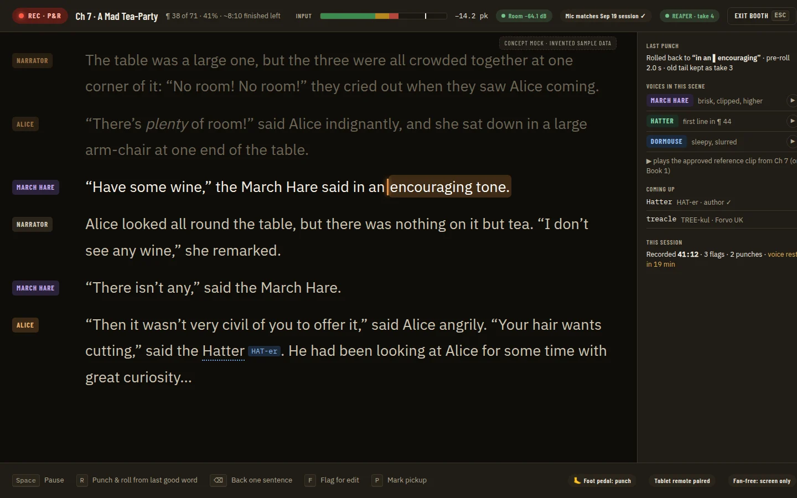
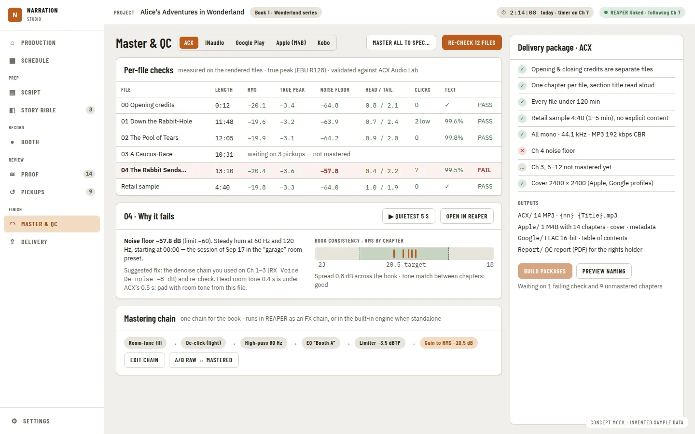

# Studio UI Primitives: Key Caps, Level Meters, Status Badges, Timelines, Stage Grids, Focus and Compact Shells, and Capability Gating

**Source:** [Audiobook studio benchmark](../research/audiobook-studio-benchmark.md) §3 concept mocks and recommendations 2–5, and the benchmark train plan (docs/operations/agent-train.md)

New work; nothing is superseded. It adds primitives under the rules of [ADR 0047](../adr/0047-the-ui-primitives-wrap-base-ui-and-app-code-never-imports-it.md) and the ADRs after it, and records its one cross-cutting decision in [ADR 0360](../adr/0360-studio-primitives-land-as-flat-leaf-files-after-one-token-batch-and-capability-gating-is-a-primitive.md) (Proposed). **Siblings** of the same train: [DAW Port and Capabilities](daw-port-and-capabilities.prd.md) ([ADR 0300](../adr/0300-every-daw-is-reached-through-one-port-of-small-role-interfaces-and-callers-ask-a-resolver-what-it-supports.md)) provides the `DawCapabilities` binding `CapabilityGate` reads and, in its P7, moves the existing gated callers onto this PRD's gate; [Input Commands and Pedals](input-commands-and-pedals.prd.md) ([ADR 0361](../adr/0361-app-commands-go-through-one-registry-and-keyboard-midi-and-hid-are-input-sources-bound-by-a-remappable-keymap.md)) owns the command registry and pedal input, and draws its keys with this PRD's `Kbd`. This PRD is lane U (primitives and input) and uses ADR block 0360–0379.

Citations are `file:line` on `main` at 91bbf98 for anything checked in code (paths under `apps/ui/` unless they start with `docs/`); "TBD - needs <what>" marks an unknown.

## Problem Statement

The benchmark's recommendations 2 to 5 (booth mode, the compact DAW companion, a closed proofing loop, trustworthy QC, production tracking) are all screens the app cannot draw from its primitives today. There is no key cap for a hotkey bar, no audio level meter with safe and unsafe zones, no status badge, no KPI tile, no toolbar with roving focus, no time axis with markers, no chapter × stage grid, no full-screen or narrow layout shell, and no one way to show a control the DAW cannot do yet. Each feature PRD that needs one would build it locally, the way `StatTile`, the input meter and the status dots already were, and five feature teams working in parallel would build five of each. Worse, controls the DAW cannot do yet are hard-coded as disabled with a reason string written in the UI, so when the bridge switches a capability on, someone has to find and edit every one.

## Evidence

Verified in code (main at 91bbf98):

- **33 primitives, each covered.** `src/components/primitives/` holds 33 components; each has a `<Name>.stories.tsx`, and all but `ErrorBoundary` a `<Name>.test.tsx`. `src/atlasCoverage.test.ts:10` keeps `ATLAS_EXEMPT` empty and `:35` keeps the atlas axe debt at 0. The rules a new primitive obeys are in [design-system.md](../design/design-system.md#primitive-components) (one flat file, per-component Base UI import, `src/baseUiBoundary.test.ts`).
- **No key cap.** No `<kbd>` is written anywhere in `src/`. The booth mock (03) and the companion mock (07) are built around a hotkey bar.
- **The input meter is feature-local and zoneless.** `src/components/teleprompter/InputLevelMeter.tsx:41-64` draws RMS as one `--accent` fill from a −60 dBFS floor (`:4-5`), with no peak marker and no zones, even though `useInputLevel.ts:9,29-37` already computes a held peak (1.5 s hold). Its only consumer is `ReadingControlBar.tsx`. `MeterBar` is a segmented progress image ([ADR 0050](../adr/0050-the-segmented-meter-is-an-image-named-by-its-segments-and-field-wires-its-hint-and-error.md)), not an audio meter, and stays as it is.
- **Status colours are drawn by hand.** `src/chapterStatus.ts:6-12` maps the five statuses to tokens; `AudiobookEstimatePanel.tsx:402` and `manuscript/ChapterNav.tsx:82` each draw their own status dot, and `tracks/LinkChaptersDialog.tsx:19` keeps a second `STATUS_COLOR` of its own. `Pill` is a toggle (`Pill.tsx:1-6`), not a badge.
- **A KPI tile exists once, locally.** `home/RecordingCheckReport.tsx:18` defines `StatTile` for its own four figures.
- **No toolbar, timeline or grid.** `workspace/TransportBar.tsx` lays `Button`s in a `Panel` with one tab stop each; `workspace/ScriptView.tsx` is feature-local prior art for a scrolling script. `Table` is row-oriented: `TableRow onActivate` makes a row the control ([ADR 0056](../adr/0056-a-presentational-table-primitive-replaces-the-dtable-class-and-rows-take-the-keyboard.md)); nothing moves focus cell by cell.
- **Full screen means a dialog.** The only full-screen surface is `Dialog size="full"` (`Dialog.tsx:23,109`, [ADR 0094](../adr/0094-dialog-gains-a-full-size-variant-that-fills-the-viewport-with-a-margin.md)).
- **DAW gating is hard-coded.** `teleprompter/ReaderFlagsPanel.tsx:20` holds `PUNCH_PENDING`, and `:109-113` renders "Punch from here" always disabled. `teleprompter/ReadingControlBar.tsx:45-68` renders "Record in REAPER" always disabled. `src/dawAvailability.ts` builds the reason for missing requirements, and `layout/AppShell.tsx:30-41,80` gates nav items on `requiresManuscript`/`requiresDaw`. A disabled child of `TooltipTarget` becomes a `role="group"` wrapper whose name *is* the reason (`Tooltip.tsx:41-48`), so a screen reader hears the reason instead of the control.
- **Tokens and contrast are guarded in two hot files.** Light tokens are the `:root` block at `src/styles.css:21`, dark at `:105`. `src/paletteContrast.test.ts:47` lists `PAIRS`, `:141` keeps `KNOWN_FAILURES` empty, and `:19` checks two themes (`light`, `dark`) parsed by `src/tokenContrast.ts`. `--ok`, `--warn`, `--info`, `--danger` and their `-text` pairs exist; no meter or badge-fill token does.
- **No capability report yet.** Nothing in `apps/ui/src` or `apps/desktop` names `dawCapabilities`; the DAW port PRD adds it.

## Proposed Solution

Add ten presentational primitives in lane U, each one flat file with its story and test, after a single phase that lands every new colour token at once: `Kbd`, `LevelMeter`, `StatusBadge`, `StatTile`, `Toolbar`, `Timeline` (with `TimelineLane`), `StageGrid`, `FocusShell`, `CompactShell` and `CapabilityGate`. `CapabilityGate` is paired with a `useCapability(cap)` hook in `src/` that reads the host's capability report through the API port, so a control the DAW cannot do yet is drawn the same way everywhere, with the host's own narrator-facing message. The DAW port PRD's P7 then moves the two hard-coded REAPER controls and the nav's `requiresDaw` onto it. Feature PRDs compose the booth, production board, proof timeline, master page and companion panel from these parts.

## Key Hypothesis

We believe that landing these primitives, file-disjoint after one token batch, will let the feature PRDs of the benchmark train build their screens in parallel without writing a local widget, a native control or a colour. We'll know we're right when the booth, companion, proof and production feature PRDs ship with no new entry in `rawNatives.test.ts` `CEILING`, no Base UI import outside the primitives, no new token outside Phase 1, and no hard-coded "not built yet" reason in a feature file.

## What We're NOT Building

| Item | Why |
| --- | --- |
| Booth mode, the production board, the proof timeline page, the master page, the companion mode | Feature PRDs (lane C). This PRD gives them parts, not screens |
| A native always-on-top window | A host concern (window flags, focus, global hotkeys); `CompactShell` is only the narrow layout |
| The command registry, hotkey binding, pedal and MIDI input | [Input Commands and Pedals](input-commands-and-pedals.prd.md) (ADR 0361). `Kbd` only draws a key |
| The capability binding, its levels, its schema, golden and mock | [DAW Port and Capabilities](daw-port-and-capabilities.prd.md) P4 (ADR 0300). This PRD consumes it |
| Moving "Punch from here", "Record in REAPER" and the nav's `requiresDaw` onto the gate | DAW port P7, which depends on phases 11 and 12 here; one PRD owns those files, not two |
| A second token system, a new theme picker, new fonts | Tokens stay CSS custom properties in `styles.css` ([ADR 0003](../adr/0003-tailwind-tokenized-primitives.md), [ADR 0017](../adr/0017-no-legacy-css-shadowing-tailwind.md)); the booth variant is a token block, not a theme option |
| Charts (the burndown of mock 01, the book-wide loudness spread of mock 05), waveform drawing | Feature-local or a later PRD; `Timeline` takes a decorative backdrop (Q5) |
| Migrating every status dot in one go | Phase 3 adds the tone map; the dots move with their feature's next change |

## Success Metrics

| Metric | Target | How Measured |
| --- | --- | --- |
| New primitives covered | 10 new primitives, each with a story (light and dark, wide and narrow) and a test | `atlasCoverage.test.ts` with `ATLAS_EXEMPT` still empty; atlas debt still 0 |
| Contrast | Every new token in both themes and the booth block, every new pair in `PAIRS` | `paletteContrast.test.ts` with `KNOWN_FAILURES` still empty |
| Keyboard | Every interactive primitive driven by keyboard in its story's `play()` | `pnpm --dir apps/ui atlas`; `src/stories.test.tsx` |
| Hard-coded DAW gating | 0 once DAW port P7 lands on this gate (`PUNCH_PENDING` and the always-disabled Record button gone) | That phase's unit tests, with the mock reporting each level and `available` state |
| No drift into feature code | Feature PRDs of the train add no native control, no Base UI import, no token | `rawNatives.test.ts` ceilings, `baseUiBoundary.test.ts`, `paletteContrast.test.ts` |
| Bundle | Stays under the 800,000-byte raw budget | `pnpm --dir apps/ui build`, per [design-system.md](../design/design-system.md#primitive-components) |

## Open Questions

For the owner; each has a recommendation.

- [ ] **Q1.** The booth's high-contrast look: a token block scoped to `FocusShell` (`[data-surface='booth']`, checked as a third token map by the palette guard), or a third app theme in the theme picker? **Recommend scoped:** the booth is a place, not a preference, and the picker stays light/dark/system.
- [ ] **Q2.** `LevelMeter` zones: fixed at ACX's −3 dB peak ceiling and −60 dB noise floor, or props with those as defaults? **Recommend props with ACX defaults**, since both values are still "to verify" in [ACX delivery requirements](../research/acx-delivery-requirements.md) and other platforms may differ.
- [ ] **Q3.** A capability at `unsupported`: disabled with the host's message, or hidden? **Recommend disabled with the message** by default, so the narrator learns the feature exists and why it is off; a caller may opt to hide.
- [ ] **Q4.** A capability at `experimental`: enabled with an "Experimental" badge and the host's message as the description? **Recommend yes**, subject to ADR 0300's rule for who may use an experimental command.
- [ ] **Q5.** `Timeline` waveform: may the caller pass a decorative backdrop (a waveform the feature draws) under the markers? **Recommend yes**, `aria-hidden`, drawn by the feature; the primitive draws no audio.
- [ ] **Q6.** `StatusBadge` tones: a closed set of meanings (`neutral`, `info`, `progress`, `success`, `warning`, `danger`, `experimental`) with the stage-to-tone maps in `src/*.ts`, rather than one tone per stage name? **Recommend meanings**; stage names change, meanings do not.

## Users & Context

- **The narrator in the booth:** reads status (armed, recording, level) from across the room, often in low light, sometimes with a screen reader; presses keys or a pedal rather than clicking.
- **The narrator in REAPER:** keeps a narrow companion beside the DAW and needs to see at once which actions REAPER can do today and why others are off.
- **The narrator planning a book:** reads a chapter × stage board and a row of figures (finished hours, pickups, files passing).
- **Agents in lane C** building the feature PRDs: need finished parts with closed APIs so parallel sessions do not each invent a meter or a badge.

## Solution Detail

### Core capabilities (MoSCoW)

| Priority | Capability |
| --- | --- |
| Must | Phase 1 token batch: meter zones, badge fills, the booth block, all in `PAIRS` |
| Must | `LevelMeter` (peak and RMS, zones, peak hold, throttled accessible value), replacing `InputLevelMeter` |
| Must | `StatusBadge`, `Kbd`, `Toolbar` (roving tabindex) |
| Must | `CapabilityGate` + `useCapability`, ready for DAW port P7 to move "Punch from here", "Record in REAPER" and nav gating onto it |
| Must | `FocusShell` (the booth layout) and `StageGrid` (grid keyboard navigation) |
| Should | `Timeline` + `TimelineLane`, `StatTile`, `CompactShell` |
| Could | A `vertical` `LevelMeter`; a dot-only `StatusBadge` for dense lists |
| Won't | Screens, window flags, the command registry, charts, waveform drawing |

### MVP scope

Phases 1, 2, 3, 5, 6, 9, 11 and 12: the tokens, `Kbd`, `StatusBadge`, `LevelMeter`, `Toolbar`, `FocusShell`, `CapabilityGate` and `useCapability`. That is everything the booth mock needs, and it is what DAW port P7 needs to retire the hard-coded REAPER gating.

### User flow

1. A lane C agent building booth mode wraps the page in `FocusShell`, which applies the booth surface.
2. The top bar shows a `StatusBadge` ("REC · P&R", tone `danger`) and a `LevelMeter` fed by `useInputLevel`; the bar's zones turn amber and red above the peak ceiling.
3. The bottom bar is a `Toolbar` of commands, each labelled with a `Kbd` taken from the input PRD's registry.
4. "Punch & roll" is wrapped in `CapabilityGate` with `useCapability('punch')`. While the host reports it `not_yet_available`, or `supported` but not available now (REAPER not running), the control stays focusable, reads as unavailable and describes why in the host's message; when the host reports it available, the same code renders it live with no UI change.

## Technical Approach

**Feasibility:** high. Every part follows a pattern already in the library: `InputLevelMeter` (a `role="meter"` with a throttled value), `Tabs`/`ToggleGroup` (roving focus), `Table` (keyboard rows), `Dialog size="full"` (full-screen layout), `TooltipTarget` (hints). No new dependency.

**Architecture:**

- **Rules every phase obeys.** One flat file per primitive, multi-part primitives in one file (`Timeline` with `TimelineLane`), per-component Base UI imports, closed props, Tailwind utilities on `var(--token)`, the stacking order of ADR 0047, `motion-safe:` on every transition ([ADR 0047](../adr/0047-the-ui-primitives-wrap-base-ui-and-app-code-never-imports-it.md)). No new class in `styles.css` and nothing added to `UNLAYERED_ALLOW_LIST` in `src/legacyCss.test.ts`; state classes mutually exclusive ([ADR 0009](../adr/0009-complete-tailwind-migration.md), [ADR 0017](../adr/0017-no-legacy-css-shadowing-tailwind.md)). Text at least 4.5:1 and marks 3:1 in both themes ([ADR 0059](../adr/0059-text-colours-meet-wcag-aa-with-two-text-levels-a-non-text-token-and-derived-on-tint-text.md)). A primitive imports nothing else under `components/`; shared data sits in `src/*.ts` (`primitives-are-leaves` in `apps/ui/.dependency-cruiser.mjs`, [ADR 0062](../adr/0062-ui-import-rules-are-a-dependency-cruiser-config-and-a-mark-scan-that-name-their-adr.md)). Native elements stay inside primitives, so the `rawNatives.test.ts` ceilings never rise ([ADR 0053](../adr/0053-icon-buttons-text-fields-and-selects-wrap-the-native-controls.md), [ADR 0056](../adr/0056-a-presentational-table-primitive-replaces-the-dtable-class-and-rows-take-the-keyboard.md)). Stories pass the atlas at both viewports (wide 1024, narrow 390) under axe with no new debt ([ADR 0023](../adr/0023-visual-suite-capture-contract-and-storybook.md), [ADR 0037](../adr/0037-visual-suite-captures-no-phone-viewport.md), [ADR 0060](../adr/0060-the-visual-suite-fails-a-collapsed-control-and-a-row-may-declare-one-narrow-on-purpose.md), [ADR 0061](../adr/0061-settings-states-are-also-captured-at-a-390px-reflow-width.md), [ADR 0064](../adr/0064-the-visual-suite-runs-axe-on-every-app-state-and-a-violation-fails-unless-it-is-declared-debt.md), [ADR 0065](../adr/0065-aria-snapshots-pin-the-role-trees-of-the-dialogs-the-slide-over-and-the-navigation.md), [ADR 0243](../adr/0243-the-ui-atlas-kit-is-dissolved-into-apps-ui-which-owns-its-visual-suite-and-atlas-outright.md)). A new host call site gets its row in `src/interactionFeedback.catalog.ts` ([ADR 0075](../adr/0075-every-action-that-leaves-the-interface-acknowledges-within-100-ms-cannot-be-fired-twice-and-tells-the-narrator-when-it-ends.md)).
- **`Kbd`:** `keys: string[]` drawn as `<kbd>` caps joined by "+"; an optional `label` gives a spoken name ("Control plus R") where the glyph is a symbol (⌫). No platform logic; the registry supplies the keys.
- **`LevelMeter`:** `peak` and `rms` in dBFS, `floor` (−60) and `ceiling` (−3) props (Q2), `size` (`compact`, `regular`, `booth`), `decorative`. RMS fill, peak-hold tick, three zones drawn in the Phase 1 meter tokens; `role="meter"` with `aria-valuetext` throttled to once a second, as `InputLevelMeter` does. The dBFS-to-percent map and the peak-hold ballistics move to `src/levelMeter.ts` so `useInputLevel` (which calls the API and stays in `teleprompter/`) and the primitive share them.
- **`StatusBadge`:** `tone` (Q6), `label`, optional `icon`, `variant` (`chip` or `dot`). Fill is a tint of the tone token with the derived `-text` colour on it. The chapter-status-to-tone map is added to `src/chapterStatus.ts`.
- **`StatTile`:** `label`, `value`, optional `hint`, `unit`, `progress` (0–1, drawn with `ProgressBar`) and `tone`. Replaces the local one in `RecordingCheckReport.tsx`.
- **`Toolbar`:** `label` (required), children are the library's buttons; one tab stop, arrows move, Home/End, `orientation`. Built on Base UI's toolbar part if the pinned `@base-ui/react` 1.8 has one, else a hand-written roving tabindex (TBD - needs the phase to check the installed package).
- **`Timeline` + `TimelineLane`:** `duration` (s), optional `playhead`, `backdrop` (Q5); lanes take `markers: { id, at, tone, label }[]` and `onActivate(id)`. Markers are one roving-focus group per lane; Left/Right step markers, Home/End, Enter activates; each marker names its time and label. Positions are percentages, so it has no sideways overflow.
- **`StageGrid`:** `rows` (chapters), `columns` (stages), `cell(row, col)` returning `{ tone, label, onActivate? }` drawn as a `StatusBadge`. `role="grid"` on table elements inside the primitive, one tab stop, arrow keys move by cell, Home/End by row, Ctrl+Home/End to corners, Enter activates, row and column headers name each cell.
- **`FocusShell`:** a full-viewport layout with `status` (top), `rail` (side, collapsible), `commands` (bottom) and the main region, each a landmark; it sets `data-surface="booth"` so the Phase 1 booth tokens apply inside it (Q1). It owns no Escape or exit logic; the feature decides whether it is a route or sits in `Dialog size="full"`.
- **`CompactShell`:** a narrow (320–480 px) stacked layout with a header (`title`, `status`, one `action` such as "Full app") and sections; judged at the atlas's 390 px width. Always-on-top is the host's.
- **`CapabilityGate`:** a presentational primitive that takes one capability entry, `{ level, available, message? }` (the shape of one entry of the DAW port's `DawCapabilities` payload, copied as a local type so the primitive imports nothing from `src/api`), and one control. Available at `supported` renders the control as is; available at `experimental` adds an "Experimental" `StatusBadge` and the message as its description (Q4). Not available, at any level, renders the control `aria-disabled` (still focusable), swallows its press, and gives the host's message as its `aria-describedby` and its tooltip (Q3; `unsupported` may be hidden instead). The gate never words a reason itself.
- **`useCapability(cap)`:** a hook in `src/useCapability.ts` (not in `primitives/`) that reads `DawCapabilities` once and follows the `daw_capabilities_changed` event through `useApi()`, returning the entry for `cap`. The contract, schema, golden, `wireContracts.test.ts` row and the mock in `api/dawMock.ts` are the DAW port's P4 ([wire contracts](../architecture/wire-contracts.md)); this PRD adds none of them. Its call and subscription get their rows in `src/interactionFeedback.catalog.ts`.

**Risks:**

| Risk | Likelihood | Mitigation |
| --- | --- | --- |
| Two phases edit `styles.css` or `PAIRS` and conflict | Medium | Every token lands in Phase 1, which runs alone; later phases may not add one (ADR 0360) |
| The booth block fails contrast in a pair nobody listed | Medium | Phase 1 teaches `tokenContrast.ts` to parse the block and runs every existing pair over it as a third map |
| The capability shape changes before the DAW PRD lands | Medium | The gate takes a plain local entry type; only `useCapability` knows the wire, and it waits for DAW port P4 |
| This PRD and the DAW port PRD both edit the gated call sites | Medium | Only DAW port P7 edits `ReaderFlagsPanel.tsx`, `ReadingControlBar.tsx`, `AppShell.tsx` and `dawAvailability.ts` for gating; this PRD ships the parts |
| `aria-disabled` controls get pressed | Low | The gate swallows the press and a test asserts the handler never runs |
| A grid or timeline traps keyboard users | Low | One tab stop in and out, tested in `play()` and unit tests |
| The shared `design-system.md` table row conflicts across parallel phases | High but trivial | Each phase adds one row; the coordinator resolves it mechanically |
| The bundle crosses 800,000 bytes | Low | Measured in the Phase 13 close-out |

## Implementation Phases

| # | Phase | Description | Status | Parallel | Depends | PRP Plan |
| --- | --- | --- | --- | --- | --- | --- |
| 1 | Token batch | Meter-zone and badge-fill tokens, the scoped booth block (Q1), all in both themes and `PAIRS`; `tokenContrast.ts` reads the booth block | complete | - (runs alone) | - | - |
| 2 | Kbd | Key cap primitive | complete | with 3-10 | 1 | - |
| 3 | StatusBadge | Tone badge (Q6); chapter-status tone map in `src/chapterStatus.ts` | pending | with 2, 4-7, 9, 10 | 1 | - |
| 4 | StatTile | KPI tile; replaces the local one in `RecordingCheckReport.tsx` | complete | with 2, 3, 5-10 | 1 | - |
| 5 | LevelMeter | Peak/RMS meter with zones (Q2); `src/levelMeter.ts`; replaces `InputLevelMeter` | pending | with 2-4, 6-10 | 1 | - |
| 6 | Toolbar | Roving-tabindex toolbar | pending | with 2-5, 7-10 | 1 | - |
| 7 | Timeline | `Timeline` + `TimelineLane`, keyboard-navigable markers (Q5) | pending | with 2-6, 8-10 | 1 | - |
| 8 | StageGrid | Chapter × stage grid with grid keyboard navigation | pending | with 2, 4-7, 9, 10 | 1, 3 | - |
| 9 | FocusShell | Full-screen booth layout on the booth surface | pending | with 2-8, 10 | 1 | - |
| 10 | CompactShell | Narrow companion panel layout | pending | with 2-9 | 1 | - |
| 11 | CapabilityGate | Presentational gate over a capability entry (Q3, Q4); no API | pending | with 4-10 | 3 | - |
| 12 | useCapability | Hook in `src/` over DAW port P4's binding, event and mock; feedback-catalog rows | pending | with 2-11 | DAW port P4 | - |
| 13 | Close-out | Regenerate `docs/ui`, design-system prose, bundle measure, ADR 0360 accepted, steady-state docs, delete this PRD | pending | - | 2-12 | - |

### Phase details

Every phase is one pull request and about two hours of agent work. Each writes its tests first and runs `pnpm --dir apps/ui test`, `pnpm --dir apps/ui architecture` and `pnpm check`. Phases 1 to 11 also run `pnpm --dir apps/ui atlas` for their stories and `design-spec-guard` against ADRs 0003, 0009, 0017, 0047, 0059 and 0062, because they touch `primitives/` or `styles.css`. A phase that changes a page (4, 5) also runs the visual suite for that page's states and looks at every viewport's PNG. Phases 2 to 11 each add exactly one row to the primitive table in `docs/design/design-system.md`; that row is the only shared edit, and the coordinator resolves it mechanically. No phase but 13 runs `docs:atlas`, because `docs/ui/inventory.json` is shared.

**Phase 1 (lane U).** Adds to both theme blocks of `src/styles.css`: meter-zone tokens (floor, body, hot, over), badge fills where a tint of `--ok`/`--warn`/`--info`/`--danger` does not reach 4.5:1 under its `-text` colour, an `experimental` tone, and a `[data-surface='booth']` block (dark, high contrast, larger script size) per Q1. Every one gets a `PAIRS` row; `tokenContrast.ts` learns the booth block and the guard checks every pair over it too. Names are settled in the phase and recorded in [colour and contrast](../design/colour-and-contrast.md). Done when `KNOWN_FAILURES` is still empty and a story shows every new token in light, dark and booth.

**Phase 2 (U).** `Kbd.tsx`, story (single key, chord, symbol key with a spoken label), test. Done when a screen reader name is right for ⌫ and Ctrl+R.

**Phase 3 (U).** `StatusBadge.tsx` with the tones of Q6 and the `dot` variant; `STATUS_TONE` in `src/chapterStatus.ts`. Done when every tone passes in light, dark and booth. The hand-drawn dots move later, with their features.

**Phase 4 (U).** `StatTile.tsx` (with an optional `ProgressBar`); `RecordingCheckReport.tsx` uses it and loses its local copy. Visual suite for the recording check states.

**Phase 5 (U).** `LevelMeter.tsx`, `src/levelMeter.ts` (dBFS map, zones, peak hold, moved from `useInputLevel.ts` and `InputLevelMeter.tsx` with their tests). `ReadingControlBar.tsx` uses `LevelMeter`; `InputLevelMeter.tsx` and its test are deleted. The story drives levels through silence, speech, hot and clipped. Done when the read-aloud states are unchanged apart from the zones and peak tick.

**Phase 6 (U).** `Toolbar.tsx`; the story's `play()` walks it with arrows, Home and End and checks one tab stop. Records whether Base UI's part was used.

**Phase 7 (U).** `Timeline.tsx` with `TimelineLane`; story with a proof-style lane of four categories and a backdrop; `play()` steps markers and activates one.

**Phase 8 (U).** `StageGrid.tsx` on `StatusBadge`; story shaped like mock 01; `play()` covers arrows, Home/End and Ctrl+Home/End; axe clean for the `grid` role.

**Phase 9 (U).** `FocusShell.tsx`; story in the booth surface with all four regions; test that each region is a named landmark and the booth tokens apply only inside it.

**Phase 10 (U).** `CompactShell.tsx`; story at the narrow atlas width with header, status and three sections.

**Phase 11 (U).** `CapabilityGate.tsx`, story and test. The story shows each level, available and not, with a `Button`, an `IconButton` and a `NavButton` inside; `play()` tabs onto a gated control and checks its description. Tests assert the press never reaches the handler, the message is both description and tooltip, and a missing message falls back to the control's own name with no invented text. Needs no API, so it can land before the DAW port binding.

**Phase 12 (U).** `src/useCapability.ts` and its test against DAW port P4's `dawMock`: first read, a `daw_capabilities_changed` update, an unknown capability (treated as `unsupported`, not available), and unsubscribe on unmount. Two rows in `src/interactionFeedback.catalog.ts`. No `hostAPIVersion` bump; the binding is P4's. After it, DAW port P7 moves "Punch from here" (`PUNCH_PENDING`), "Record in REAPER" and the nav's `requiresDaw` onto the gate.

**Phase 13 (U).** Runs `pnpm --dir apps/ui docs:atlas` once for all new stories, updates the prose around the primitive table, measures the bundle, moves ADR 0360 to Accepted with its index row in `docs/adr/README.md`, and deletes this PRD (README index row updated) once the steady-state docs say everything durable here.

### Parallelism notes

Phase 1 is the one serialization point: it runs alone, because `src/styles.css`, `src/paletteContrast.test.ts` and `src/tokenContrast.ts` are conflict hot spots. After it, phases 2 to 10 add only new files (the `.tsx`, `.stories.tsx`, `.test.tsx`, plus `src/levelMeter.ts` in 5) and the one `design-system.md` row, so all nine can run at once. Phase 8 waits for 3 because its cells are `StatusBadge`s; phase 11 waits for 3 for the experimental badge. Phase 12 waits only for DAW port P4 and touches no primitive, so it can run beside any of 2 to 11; its one shared edit is the feedback catalog. DAW port P7 waits for 11 and 12. Phase 13 is last.

### Parallel-session compatibility

| Phase | Files touched | Collides with |
| --- | --- | --- |
| 1 | `src/styles.css`, `src/paletteContrast.test.ts`, `src/tokenContrast.ts`, `docs/design/colour-and-contrast.md` | Any PRD adding a token or a pair; must run alone |
| 2 | `primitives/Kbd*` (new), design-system row | Input PRD (consumes `Kbd`; coordinate the API) |
| 3 | `primitives/StatusBadge*` (new), `src/chapterStatus.ts`, design-system row | Anything editing `chapterStatus.ts` |
| 4 | `primitives/StatTile*` (new), `home/RecordingCheckReport.tsx`, design-system row | Recording-check work |
| 5 | `primitives/LevelMeter*` (new), `src/levelMeter.ts` (new), `teleprompter/InputLevelMeter*` (deleted), `teleprompter/useInputLevel*`, `teleprompter/ReadingControlBar.tsx`, design-system row | Read-aloud control bar, booth mode, DAW port P7 (same bar) |
| 6 | `primitives/Toolbar*` (new), design-system row | None |
| 7 | `primitives/Timeline*` (new), design-system row | None |
| 8 | `primitives/StageGrid*` (new), design-system row | None |
| 9 | `primitives/FocusShell*` (new), design-system row | None |
| 10 | `primitives/CompactShell*` (new), design-system row | None |
| 11 | `primitives/CapabilityGate*` (new), design-system row | None |
| 12 | `src/useCapability.ts`, `src/useCapability.test.ts` (new), `src/interactionFeedback.catalog.ts` | Any phase adding a host call site (the catalog); waits for DAW port P4's `api/contracts/daw.ts`, `api/schemas/daw.ts`, `api/dawMock.ts` |
| 13 | `docs/ui/**`, `docs/design/design-system.md`, `docs/adr/0360-*`, `docs/adr/README.md`, `docs/prds/README.md`, this PRD | Any PRD regenerating `docs/ui` |

## Decisions Log

| Decision | Choice | Alternatives | Rationale |
| --- | --- | --- | --- |
| Token landing | Every new colour token in Phase 1, alone (ADR 0360) | Each primitive adds its own | `styles.css` and `PAIRS` are hot spots; one batch keeps the other phases file-disjoint |
| File shape | One flat leaf file per primitive, one shared table row (ADR 0360, ADR 0047, ADR 0062) | A `studio/` sub-folder | The existing rules and checks already fit; a folder would need new import rules |
| Level meter | A new `LevelMeter`; `MeterBar` stays segmented progress | Extend `MeterBar` | ADR 0050 makes `MeterBar` an image named by its segments; an audio meter is a live `role="meter"` |
| Capability gating | A presentational primitive plus `useCapability` in `src/` (ADR 0360) | Hard-coded disabled buttons; gate inside each feature | One pattern, reasons from the host, and the primitive stays a leaf with no API import |
| Disabled semantics | `aria-disabled`, focusable, reason as description | `disabled` inside a `TooltipTarget` group | The narrator hears the control's name and then why, instead of only the reason |
| `Kbd` vs registry | `Kbd` here; bindings in the input PRD (ADR 0361) | One PRD | Drawing a key and owning a keymap are separate concerns and lanes |
| Who moves the gated call sites | DAW port P7, on this PRD's gate and hook | This PRD's gate phase | One PRD edits `ReaderFlagsPanel.tsx`, `ReadingControlBar.tsx` and `AppShell.tsx` for gating, and the real data only exists after DAW port P4 |
| Shells | Layout only; window flags and Escape belong to the host and the feature | A booth dialog primitive | Feature PRDs still choose route or `Dialog size="full"` (ADR 0094) |

## Research Summary

- **Benchmark:** [section 3](../research/audiobook-studio-benchmark.md#3-what-the-ideal-looks-like-concept-mocks) lists the screens; its [Booth UX](../research/audiobook-studio-benchmark.md#booth-ux) section asks for keyboard-first use, a high-contrast theme to suit the room, screen-reader use throughout, and status readable across the booth, which set the requirements for `Kbd`, `Toolbar`, the booth block and `StatusBadge`.
- **Codebase:** see Evidence. Prior art to promote rather than rewrite: `InputLevelMeter`/`useInputLevel` (meter and ballistics), `RecordingCheckReport`'s `StatTile`, `TooltipTarget`'s disabled handling, `Tabs`/`ToggleGroup` roving focus, `Table`'s keyboard rows, `Dialog size="full"`.
- **Patterns:** the WAI-ARIA toolbar, grid and meter patterns define the keyboard and role contracts of `Toolbar`, `StageGrid` and `LevelMeter`.

## Visual Spec

The images below are the benchmark's **concept mocks, not owner-approved specs**: drawn as standalone HTML with the app's tokens, every name and number invented. They show which primitive each screen needs; they do not fix any primitive's look. Each feature PRD that builds one of these screens copies its owner-approved mockup into `docs/prds/mockups/<prd>/`. This PRD has no mockups folder of its own; each primitive's look is fixed by its atlas story.

### 01 Production home

- **`StatTile`** ×6: finished audio with a progress bar against the target, work time logged, hours per finished hour, effective rate, open pickups, delivery check (7 / 12).
- **`StageGrid`:** chapters down, Prep to QC across; every cell a `StatusBadge` (done, "41%" in progress, "3 open" warning, "FLOOR" danger, "PASS" success) and a link.
- **`StatusBadge`:** "On track", the top bar's "REAPER linked · following Ch 7" and the timer chip.
- Not covered: the burndown chart; the "This week" bars use the existing `ProgressBar`.

### 03 Booth

- **`FocusShell`** on the booth surface: status bar on top, the script in the main region, a rail (last punch, voices in scene, coming up, this session), the command bar at the bottom.
- **`LevelMeter`** (`booth` size): the input bar with green, amber and red zones, a peak tick and "−14.2 pk"; a compact room meter beside it.
- **`StatusBadge`:** "REC · P&R" (danger), "Room −64.1 dB", "Mic matches Sep 19 session", "REAPER · take 4", the pedal and tablet chips.
- **`Toolbar`** of **`Kbd`**-labelled commands: Space, R, ⌫, F, P, and ESC on "Exit booth".
- **`CapabilityGate`** on "Punch & roll from last good word" until the host reports punch as available.
- Speaker tags stay the Story Bible entity colours via `Highlight`; not a new primitive.

### 04 Proof and pickups

- **`Timeline`** with a waveform backdrop (Q5) and a **`TimelineLane`** of markers in four categories (misread, pronunciation, noise, pacing).
- **`StatusBadge`:** note types (MISREAD, SKIP, MOUTH, PRON.), resolutions (Pickup, Edit, Waived) and the summary counts ("6 need pickup").
- **`CapabilityGate`** on "Go to in REAPER" and "Record pickups in booth".
- The notes list is the existing `Table`; the source strip and the steps are feature layout.

### 05 Master, QC and delivery

- **`StatusBadge`:** PASS and FAIL per file, and the delivery checklist's pass, fail and pending marks (`dot` variant or icon).
- **`CapabilityGate`** on "Master all to spec", "Open in REAPER" and "Build packages" (a render or DAW capability the host may not have).
- Platform tabs are the existing `Tabs`, per-file checks the existing `Table`.
- Not covered: the book consistency spread (a chart) and the mastering chain chips (feature layout).

### 07 DAW companion

- **`CompactShell`:** the narrow panel with the "Companion" header, a "Following playhead" `StatusBadge` and a "Full app" action, then stacked sections (script, note at playhead, pickups, hotkeys, this chapter).
- **`Toolbar`** for "Punch & roll here", "Resolve" and "Waive", with **`CapabilityGate`** on the punch.
- **`Kbd`:** F9 to F12 in the hotkeys section (the global hotkeys themselves are the input PRD's and the host's).
- **`StatusBadge`:** "Pickup", and the `dot` variant in "This chapter".
- The always-on-top window beside REAPER is out of scope.
