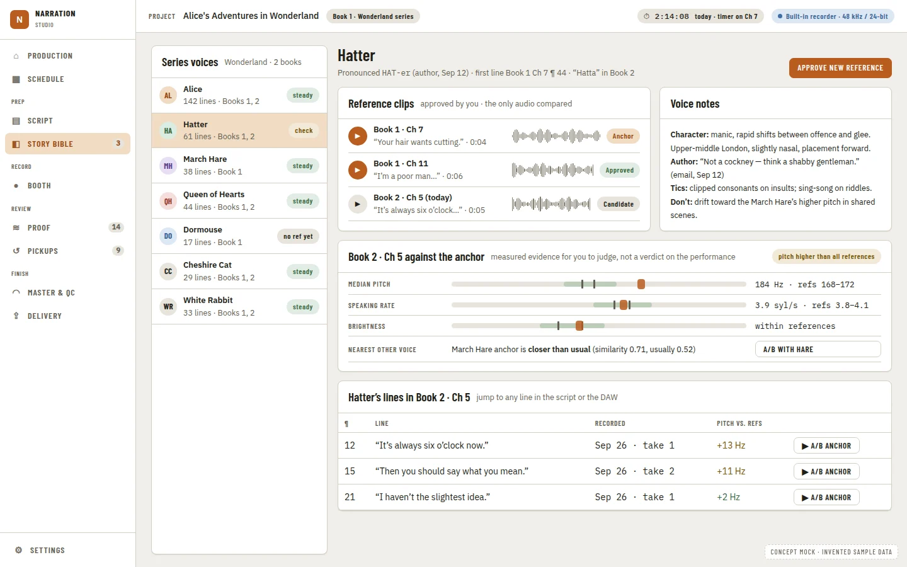

# A Best-in-Class Audiobook Narration Studio, and How Narration Utils Compares

**Status:** research note, 2026-09-26. Nothing here is a decision. Each recommendation needs its own PRD (and an ADR where it
changes a recorded decision) before it is built.

**Question:** what should a best-in-class audiobook narration studio look like and do, when it works either as a companion to a
DAW or standalone, and how does this app compare with that ideal?

**Confidence: medium.** The capability inventory of this app was checked against the code on 2026-09-26. The market and workflow
findings come from web searches. The egress proxy blocked WebFetch for every product and platform domain tried, including acx.com,
help.acx.com, pozotron.com, hindenburg.com and chapterpass.com, so each claim rests on search-engine summaries of the cited pages,
not a read of the page. Prices, version numbers and platform specs must be checked against the page before they are used in a
product decision or a validator. Claims supported by only one source are marked *(single source)*. Where sources disagree, both
readings are given and the claim is marked *(conflict)*.

## Summary

- **The workflow is settled; the tools are not.** Professional narration works the same way everywhere: prep, then
  punch-and-roll recording, a proof listen against the manuscript, a pickup session, editing and mastering to a spec, and
  delivery [W1][W2][L19]. No single product covers every stage well. The general-purpose DAWs (REAPER, Pro Tools, Studio One,
  Audition) need a lot of setup [L26][L28][L31][L16]. The dedicated apps each cover a slice:
  - **Hindenburg Narrator:** recording and ACX export, but no plugins [L1][L4].
  - **Pozotron:** prep and AI proofing, in the cloud, with marker export [L6][L8].
  - **Punch Track:** a browser-only DAW replacement [L32].
  - **ChapterPass, ACX Check:** checks of levels only [L22].
- **The clearest opening is the one this app is already built around:** a **two-way, live link** between the manuscript,
  proofing and pickups on one side and the DAW on the other. Today's competitors either export a marker file once (Pozotron
  [L8]), hand over a finished project (Narrafix [L21]), or replace the DAW (Punch Track [L32]).
- **Keeping the AI local has become a selling point.** Narrators pushed back on Pozotron's data retention [L10], and on voice
  replicas [L42]. A rival advertises "zero-retention" APIs [L34]. This app runs every model on the narrator's machine.
- **Where this app is strong:**
  - manuscript import and the Story Bible;
  - Transcript Compare;
  - the findings/Review dashboard;
  - take review;
  - the teleprompter;
  - measuring against a dated ACX profile;
  - reading a REAPER project without REAPER running.
- **Where it is weakest is the booth:**
  - It cannot record on its own.
  - Punch-and-roll and record/arm are built in the bridge but switched off, with no UI (see [Scorecard](#scorecard-this-app-against-the-ideal)).
  - It has almost no keyboard shortcuts and no pedal support.
  - It does not render or encode, and does no mastering.
  - It measures delivery only on WAV files, against one platform profile.
  - It has no time or per-finished-hour (PFH) tracking, and no voice continuity check across a series.
- **Recommended order of work:**
  1. Finish verifying and switch on what is already built: punch, record, regions, pickups-to-punch.
  2. Build a booth mode on top of the teleprompter.
  3. Make proofing and pickups a closed loop.
  4. Add production tracking.
  5. Only then build standalone recording and rendering. They are large, and the companion mode is the stronger position.

## 1. The ideal, stage by stage

Each stage lists what a professional will expect (**must-have**) and what would set a product apart (**differentiator**). A
product that serves both modes keeps one project model (chapters, script lines, findings, pickups, takes) and puts the audio
engine behind a seam. The engine is either the DAW, through a bridge, or a built-in recorder and renderer. The project model
must not care which one it is talking to.

### Prep

| Must-have | Differentiator |
| --- | --- |
| Import DOCX, EPUB and PDF, with a chapter outline taken from the headings [W1] | Hard words and character names pulled out of the text automatically, as Pozotron does [L9][W20] |
| A character list with notes and a recorded voice reference clip per character [W20][W32] | An AI read-ahead: plot, character traits, accents mentioned in passing (PreRead) [L34] |
| A pronunciation list: the word, the chosen pronunciation, the source, a recorded snippet, and whether the author confirmed it [W19b][W20] | A questionnaire of queries for the author or rights holder, exported and tracked until it is answered |
| One-click lookups in Forvo, YouGlish, Merriam-Webster and Howjsay [W19b][W20] | Speaker attribution for each line of dialogue |
| Script markup (stress, pauses, character tags) that carries through to the booth view [W24] | A tablet reader with silent page turns from a pedal [W24][W34] |

### Recording

| Must-have | Differentiator |
| --- | --- |
| One-key or one-pedal punch-and-roll with pre-roll and crossfade you can set. Publishers expect this method [L19][W18]. Audacity's defaults (5 s pre-roll, 10 ms crossfade) are a sensible baseline [W17] | The script follows the recording position, and a punch starts from a chosen word [L13][L32] |
| Every command on the keyboard, and footswitches (USB, MIDI or HID) can be mapped [W35] | A booth remote on a tablet or second screen, so the computer can stay outside the booth [W27][W36] |
| Non-destructive takes: a punch never loses the audio it replaced | A pre-session check that the mic, gain and room match the last session (Punch Track does a version of this) [W22] |
| Capture room tone at the start of each session, and a live noise-floor meter judged against −60 dB [W1][W3] | A silent machine: no sounds, notifications or animation while recording |
| Input meters judged against a −3 dB peak ceiling | Shows the monitoring latency and advises direct monitoring [W29] *(single source)* |

### Proofing and pickups

| Must-have | Differentiator |
| --- | --- |
| Each proof note is a structured marker: chapter, timestamp, category, the script text against what was heard, and a status [W37][W38] | Local AI compare of transcript against script that knows about numbers and pronunciations, so "forty" and "40" are not flagged [W21] |
| Import and export of the proofer's spreadsheet (CSV/XLSX) [W37] | The pickup session assembled for you: the list, each line with its context, and a clip to match tone against [W37] |
| Jump from a note to the same place in the audio and in the script | Checks that a word is pronounced the same way in every chapter, against the pronunciation list |
| Error types: misread, skip, repeat, mispronunciation, mouth noise, plosive, breath, bad punch, pacing, noise [W38] | A two-way link: resolving a note in the DAW updates the proof list, and the reverse. No competitor found does this [L8][L21][L32] |

### Editing and mastering

| Must-have | Differentiator |
| --- | --- |
| Put pickups in with a ripple edit, and fill gaps with room tone, never digital silence [W19c][W40] | Chapter-to-chapter consistency: the spread of loudness, noise floor and tone across the book [W1][W40] |
| Turn breaths down rather than cut them [W19d][W39] | A one-click "master to spec" with a report you can keep. Hindenburg Narrator's ACX export is the benchmark [W23] |
| A mastering order of EQ, then a limiter, then gain into the RMS window (ACX's own advice) [W3] | Proposes fixes from the measured failure (hum, a short head of room tone) instead of only a pass or fail |

### Quality check and delivery

| Must-have | Differentiator |
| --- | --- |
| Profiles per platform, checked on the rendered files: ACX, Voices by INaudio, Google Play, Apple (M4B), Kobo. See the [spec table](#delivery-specs) | One QC pass that combines level specs, a noise and click scan, and text accuracy. The spec checkers stop at levels [L22] |
| **True-peak** measurement. Audacity's ACX Check reads sample peak, so a file can pass there and still fail by 0.5–1 dB [L22] *(single source, a competing vendor)* | One master exported as several platform packages [W23] |
| Chapter metadata (ID3 CHAP/CTOC, M4B chapters) [W16][W41], file-naming templates, and a retail-sample guard | A pre-flight report that matches ACX's Audio Lab / Audio Analysis before upload [W4] |

### Production and business

| Must-have | Differentiator |
| --- | --- |
| Time tracked per stage, giving hours per finished hour and an effective hourly rate. Benchmarks: about 6 hours per finished hour for experienced narrators, about 10 for newcomers [W25]; 6.2 [W19a]; 5–6 [W20c] | A series bible: characters, pronunciations and voice reference clips shared across the books of a series [W32] |
| Deadlines and milestones: the ACX 15-minute checkpoint, first draft, pickups, delivery [W5] | Invoices built from finished runtime × PFH rate. Typical rates are $100–$250 PFH [W25] *(secondary)* |
| A chapter-by-stage status board, which narrators keep in spreadsheets today [L53] | A voice-rest indicator, and booth hours booked against planned |

### Booth UX

These ideas come mostly from the research agents' synthesis, not from sourced requirements:
- Keyboard-first. Pedals can be remapped. Nothing makes a sound or shows a notification while recording [W36].
- A high-contrast, large-text script with a theme to suit the room's light. Dark mode helps in a dim booth, but it should not be
  the only option [W42][W43].
- Everything works from a screen reader. REAPER with OSARA is how blind producers work today [W26].
- Status (armed, recording, punch point) readable from across the booth.

### Delivery specs

Every value comes from secondary summaries of the official pages. **Check the official page before building a validator to any
of these numbers.** Of the ACX values, [ACX delivery requirements](acx-delivery-requirements.md) already records which ones the
repository has verified.

| Platform | Format | Levels | Room tone (head / tail) | Files | Sources |
| --- | --- | --- | --- | --- | --- |
| ACX / Audible | MP3 ≥192 kbps CBR, 44.1 kHz; all mono or all stereo | RMS −23 to −18 dB; peak ≤ −3 dB; noise floor ≤ −60 dB | 0.5–1 s / 1–5 s, or 1–5 s / 1–5 s *(conflict)* | One section per file, ≤ 120 min; separate opening and closing credits; retail sample 1–5 min | [W1][W2][W4c][W6][W7][L44] |
| Voices by INaudio (formerly Findaway Voices; spun out of Spotify on 2025-08-01) | MP3 192 kbps CBR (VBR rejected), 44.1 kHz; FLAC accepted | Same as ACX | 1 s / 1–5 s, or 0.5–1 s / 1–5 s *(conflict)* | ≤ 120 min per chapter; custom chapter names | [W8][W10][L46][L47] |
| Google Play Books | MP3 or M4A/AAC ≥128 kbps mono / ≥256 kbps stereo; FLAC/WAV 16-bit ≥44.1 kHz | None stated | None stated | 5 min to 100 h in total; name one chapter and you must name them all | [W13][L48] |
| Apple Books | M4A/M4B with chapters, only through preferred partners | No RMS target published | None stated | One file per chapter plus credits and a sample; cover ≥2400 px | [W12][L49] *(secondary)* |
| Kobo Writing Life | MP3 (M4A listed by one source *(conflict)*) | None stated | None stated | 200 MB per file, 2 GB in total | [W14] *(secondary)* |

## 2. The landscape

The competitive landscape by product, with the stages each covers.

| Product | Model | Covers | Where it falls short |
| --- | --- | --- | --- |
| Hindenburg Narrator | Standalone spoken-word editor | EPUB import, recording, punch-and-roll, auto-level, ACX/EPUB/DAISY export [L1][L5] | No VST/AU plugins [L4]; the product line is confusing [L4] |
| TwistedWave (+ speech add-on) | Standalone single-track editor | Punch-and-roll; the script aligned to the audio; live speech recognition while recording (Whisper and others) [L13][L14] | Alignment only: no pickup list from comparing script and audio [L13] |
| Adobe Audition | DAW | Native punch-and-roll with pre-roll and "Punch Again" [L15] | For years narrators needed Travis Baldree's extension [L16][L17] |
| REAPER | DAW, heavily configured by narrators | Everything, after setup; cheap; ReaScripts; a web remote [L19][L27][W27] | "Steep learning curve", and a market of courses and config files just to make it usable [L26][L28] |
| Audacity | Free editor, **our planned second host** | Punch-and-roll (5 s pre-roll, 10 ms crossfade); ACX Check plugin [L23][L24] | **Audacity 4.0.0 shipped on 2026-09-03** with punch-and-roll rebuilt for its new interface [L20] *(single source: a release page returned by search)*. The [Audacity PRD](../prds/audacity-integration.prd.md) targets 3.x only |
| Pozotron | Cloud AI proofing and script prep | Manuscript-to-narration comparison; character and pronunciation prep; **marker export** to 10 DAWs; a pickup recording tool [L6][L8][L9][L12] | False positives [L11]; backlash over data retention [L10]; about $99 a month for 16 finished hours [L7] *(single source)* |
| Narrafix | Cloud automatic first edit | Removes repeats and retakes; outputs a REAPER project or AAF; 40+ languages [L21] | Critics say automatic editing cannot hear intent [L37] |
| Punch Track | Browser DAW replacement | Punch-and-roll, a manuscript viewer, collaborative pickup review, roles [L32][L33] | New, browser-only; most material about it is its own marketing [L32] |
| PreRead / ProofRead / ACX PreCheck | Web tools | AI read-ahead, fast proofing, a free spec check [L34][L35][L36] | Thinly documented |
| ChapterPass, ACX Check, ACX Audio Lab | Spec checkers | Loudness, peak, noise floor, format, padding [L22][L23][L38] | Level checks only: no clicks, pacing or text accuracy [L22] |
| Auphonic, iZotope RX 12 | Processing | Levelling, RMS normalisation for ACX (Jan 2026); de-click, breath control, dialogue isolate [L25][L26b] | A black box (Auphonic); cost (RX Advanced) |

What professionals say is missing [L-synthesis]:
1. Proofing and pickups live apart from the DAW.
2. The general-purpose DAWs need heavy setup.
3. QC stops at level checks.
4. Prep is spread across several tools and never reaches the recording view.
5. The script rarely follows the voice while recording.
6. Production is tracked in spreadsheets.
7. Narrators want to know where their audio goes.
8. Fully automatic editing is not trusted.

## Scorecard: this app against the ideal

Status codes:
- **Shipped:** the code exists and a UI calls it.
- **Partial:** built in the host or bridge but without a UI, behind the experimental switch, or waiting on the owner's checks.
- **Planned:** only in a PRD or the roadmap.
- **Missing:** in neither.

The code, not a PRD's phase table, decides the status. Several phase tables are behind the code. For example,
[tool-run-logging](../prds/tool-run-logging.prd.md) marks P1–P4 and P7 as pending, but commits `31749b7`…`a9c001e` delivered them.

| Capability | Status | Where it stands |
| --- | --- | --- |
| **Prep** | | |
| Import DOCX, EPUB, Markdown, TXT; chapters from the TOC; front and back matter | Shipped | The importer, ADRs 0089, 0095, 0101, 0240 |
| PDF import | Partial | Behind a build tag and refused at runtime (`importer/pdf.go`) |
| Characters, places and organisations with evidence, aliases and lock | Shipped | Story Bible |
| Pronunciation from the CMU dictionary or eSpeak, with a Piper preview | Shipped | `internal/guide` |
| Narrator-edited pronunciation store; lookups in Forvo, YouGlish and Merriam-Webster; author queries | Planned / Missing | Only an offline WordNet lookup is shipped. There are no web-source lookups and no author-query export |
| Speaker attribution for each line of dialogue; script markup for stress and pauses | Missing | Reader notes and bookmarks only |
| A voice reference clip per character | Planned | [Character continuity](../prds/character-continuity-review.prd.md): all 8 phases pending |
| **Recording** | | |
| Recording without a DAW | Planned | [Native recording suite](../prds/native-recording-suite.prd.md): all 6 phases pending |
| Arm, record and stop REAPER | Partial | Lua commands are built but experimental with no binding. "Record in REAPER" is always disabled ([read-aloud control bar](../prds/read-aloud-control-bar.prd.md) P7) |
| Punch-and-roll from a word | Partial | `narration_punch.lua` and `bridge/punch.go` are built but experimental. The UI shows "Punch from here" disabled |
| Script follows the voice while recording | Shipped | Teleprompter: Whisper, or Moonshine on Windows; skip and restart flags; resume from the DAW tail |
| Input meter and device choice | Shipped (Windows) | dshow capture only |
| Keyboard, pedal and remote control | Missing | Alt+←/→ and Space are the only shortcuts. There is no shortcut map and no pedal or MIDI input |
| Room-tone capture, live noise floor, session match | Missing | The noise floor is measured only afterwards, on the Delivery page |
| **Proofing and pickups** | | |
| Transcript against manuscript, typed MISREAD / SKIPPED / EXTRA, with hints | Shipped | Needs REAPER running (`transcript/service.go`) |
| Recording check (coverage) from the saved `.rpp` | Shipped | Thresholds not yet calibrated (ADR 0132) |
| Proofer CSV to REAPER markers; next, resolve, export | Shipped | `narration_pickups.lua`, `PickupsDialog.tsx` |
| One findings list with decisions and go-to / loop / marker in REAPER | Shipped | Milestone 1. Delivery findings are not on it yet |
| Pickup session assembly: script in context, a tone-match clip, auto-slate | Missing | |
| Pronunciation consistency across chapters | Missing | The Story Bible has the data. Nothing compares the audio against it |
| **Editing and mastering** | | |
| Pickup, restart and duplicate detection; add as take; A/B audition | Shipped | Take review, milestone 2 |
| Silence trim and level normalisation | Partial | Built in the bridge, with no binding or UI |
| FX chains, active take | Partial | Experimental Lua ([edit and proof workspace](../prds/edit-and-proof-workspace.prd.md)) |
| Mastering chain or master-to-spec | Missing | The roadmap says the app never changes audio without the narrator's action, so this would be narrator-triggered |
| **QC and delivery** | | |
| Measurement: LUFS, true peak, RMS, noise floor, room-tone head and tail, diagnostics | Shipped (WAV only) | `internal/measure`. MP3 container checks only (ADR 0237). EBU and ACX Check validation pending |
| ACX profile | Shipped | `acx@2026-09`, with rules marked verified, to verify, or conflicting |
| INaudio, Google, Apple and Kobo profiles | Planned | [Delivery platform profiles](../prds/delivery-platform-profiles.prd.md) |
| Per-chapter render | Partial | The render is configured in REAPER, and the narrator presses Render there. Region creation is experimental with no UI |
| ID3 chapter tags | Shipped | Written to a copy of a combined MP3 (ADR 0099) |
| MP3 or M4B encoding, naming templates | Missing | |
| Book-level delivery checklist | Planned | Delivery platform profiles P7 |
| **Production** | | |
| Chapter status, estimate against actual recorded time, stage suggestions | Shipped | Five statuses; one rule (Recording→Editing) |
| Time tracking, PFH, deadlines, invoices | Missing | |
| Series or multi-book shared bible | Missing | One project at a time |
| **Platform** | | |
| All AI runs locally, with explicit downloads | Shipped | A real differentiator [L10][L34] |
| Screen reader and axe coverage, light and dark themes | Shipped | ADRs 0064, 0065 |
| Windows installer and in-app update | Shipped | Unsigned; macOS and Linux have CI previews only |
| Audacity host | Partial | The seam and launcher are built. Every Audacity request answers "not available yet" |
| Standalone without REAPER | Partial | Reads the `.rpp` and plays audio, but proofing and every live action need REAPER ([standalone launch](../architecture/standalone-launch.md)) |

**Where this app is ahead of the field:**
- A two-way bridge addressed by GUID: go to, loop and mark findings, stamp chapters, work through pickups. Competitors export
  marker files.
- Evidence-versioned findings with narrator decisions. Analyzers never change audio (ADR 0032). This fits the distrust of fully
  automatic editing [L37].
- Local AI with downloads the narrator agrees to.
- A REAPER project can be read and played without REAPER running.
- A dated, versioned delivery profile with a verification status on each rule.

## 3. What the ideal looks like: concept mocks

These are concept mocks, not approved specs. They were drawn as standalone HTML with the app's own tokens and fonts, copied from
`apps/ui/src/styles.css`, and rendered at 1440×900. Every name and number is made up. They show the ideal described in section 1.
Each caption lists which parts exist in this app today, and which do not.

The navigation is grouped by stage: Production, Prep, Record, Review, Finish. The top bar always shows the audio engine,
"REAPER linked" or "Built-in recorder", so the same screens serve both modes.

### Production home

A chapter × stage board, from prep through QC. Every cell is a link. Above it are the finished runtime against the target, the
logged work time, hours per finished hour, the effective rate against PFH, open pickups, and how many files pass the delivery
check. A "Next up" list is ranked by risk to the deadline, and a burndown shows finished hours against the plan.

- **Exists today:** chapter statuses, estimate against actual recorded time, stage suggestions.
- **New:** stage columns beyond the five statuses, time and PFH tracking, deadlines, the next-up queue.

### Prep: script, speakers and pronunciations

- Dialogue is attributed to its speaker, and markup for stress, breaths and pauses sits in a layer over the script.
- Pronunciations carry their source and a status (researched, author-confirmed, query sent), with one-click lookups.
- Queries for the author can be exported.
- The chapter footer lists the new voices and read-ahead notes.

- **Exists today:** the reader, Story Bible entities and pronunciations (CMU dictionary / eSpeak / Piper), notes.
- **New:** speaker attribution, the markup layer, web lookups, the author query workflow.

### Booth mode

Full screen and low glare, with nothing else on it:
- a large script that follows the voice;
- the punch point at the last good word;
- speaker tags, and the reference clip for each voice in the scene;
- the pronunciations coming up;
- input and room meters, and a check that the mic matches the last session;
- a hotkey bar that also works from a foot pedal or a tablet.

- **Exists today:** the teleprompter's alignment, resume from the DAW tail, the mic meter, skip and restart flags.
- **Built but switched off:** punch (`punch_to`) and record/arm.
- **New:** the booth layout, hotkeys and pedal input, the live room-tone meter, per-voice reference clips.

### Proof and pickups

- Proofer CSV notes, the local AI compare and the narrator's own flags are merged on one timeline.
- Each note has a category and a resolution: pickup, fix in edit, or waived.
- Each pickup session is prepared: the line in context, a tone-match clip, and the takes land back on their notes in the DAW.

- **Exists today:** Transcript Compare, pickups CSV, the Review dashboard, take review.
- **New:** a single merged timeline, the pickup session plan, pickups closing their notes automatically.

### Master, QC and delivery

- Platform tabs.
- Per-file checks on the rendered files, including clicks and text coverage.
- A failed file explains itself with a suggested fix.
- A book-wide spread of loudness.
- One mastering chain, which runs as a REAPER FX chain or in the built-in engine.
- A package checklist, and outputs for each platform (MP3, M4B, FLAC, a QC report).

- **Exists today:** measurement, the ACX profile, diagnostics, the HTML/JSON report, ID3 chapters.
- **New:** the other profiles, MP3 levels, the mastering chain, encoding, M4B, packages, the book-wide spread on this page.

### Series voice bible

- Characters shared across a series, each with clips the narrator has approved.
- A comparison of today's reads against the anchor clip: pitch, rate, and how close the voice is to another character's. It is
  shown as evidence for the narrator to judge, not as a verdict, which follows the roadmap's own rule for milestone 3.
- This mock shows the built-in recorder chip, to illustrate standalone mode.

- **Planned:** the [character continuity PRD](../prds/character-continuity-review.prd.md).
- **New:** sharing across a series.

### DAW companion panel

A narrow, always-on-top panel beside the DAW. It follows the playhead and shows:
- the script;
- the note at the playhead, with Punch & roll, Resolve and Waive;
- the chapter's pickups;
- global hotkeys that work while the DAW has focus.

It keeps the narrator in the DAW, the way most professionals already work, and the full app opens only when needed.

- **Exists today:** follow-playback in the workspace PRD mocks, go-to and loop by GUID, pickups next and resolve.
- **New:** the compact always-on-top mode, global hotkeys, punch from a note.

## 4. Recommendations

In priority order. Each is a candidate for a PRD, not a decision.

1. **Switch on what is already built.** Finish the owner's verification in REAPER. Then promote from experimental, and give a UI
   to:
   - `punch_to` / `play_position`: "Punch from here" in the teleprompter and on pickups;
   - `arm_only` / `record_start` / `record_stop`: [read-aloud control bar](../prds/read-aloud-control-bar.prd.md) P7;
   - `create_regions`;
   - silence trim and level normalize.

   This is the cheapest large gain, because the harness tests already exist.
2. **Booth mode on top of the teleprompter.** A full-screen reader with punch, meters and speaker tags. Add a remappable
   shortcut map with pedal input (USB HID and MIDI) and a no-sound, no-notification rule while recording. Then add the compact
   companion panel. This closes the widest gap against Hindenburg, Punch Track and TwistedWave, which all show the script while
   recording [L1][L13][L32].
3. **Close the proofing loop.**
   - Let Transcript Compare run from the saved `.rpp`, as the recording check already does, so proofing does not need REAPER
     running.
   - Merge proofer, AI and self notes into one list with resolutions.
   - Plan the pickup session and land pickups back on their notes.
   - Check pronunciation consistency against the Story Bible.
4. **Make QC trustworthy, then broaden it.**
   - Finish the EBU test-set run and the ACX Check comparison, and have the owner read ACX's page. Settle the room-tone head
     conflict.
   - Measure MP3 levels.
   - Add INaudio and Google profiles, then Apple/M4B.
   - Put delivery findings on the Review page.
   - Add a book-level checklist and a book-wide spread.
5. **Production tracking.**
   - Session timers by stage.
   - Hours per finished hour and effective rate.
   - Deadlines, and the ACX checkpoint as a milestone.
   - Export a status report.

   Narrators keep these in spreadsheets today [L53].
6. **Prep depth.**
   - Speaker attribution and a markup layer.
   - Web lookups that open in the browser, so the app stays local-only.
   - A narrator-edited pronunciation store with its sources.
   - Author query export.
7. **Standalone, after the above.**
   - The [native recording suite](../prds/native-recording-suite.prd.md).
   - Built-in render and encode (MP3, M4B).
   - A mastering chain.
   - PDF import.
   - macOS capture, which today uses Windows-only dshow.

   These are large. The companion position is stronger, and REAPER costs a narrator little [L19].
8. **Series and continuity.** Milestone 3 (reference clips, drift evidence), extended across the books of a series.
9. **Audacity:** re-scope the adapter spike for Audacity 4.0, which rebuilt its punch-and-roll [L20]. Check that release first
   *(single source)*.

**Keep the product boundary** in [the roadmap](../roadmap.md): no automatic comping and no verdicts on acting. The research
supports it. Critics say fully automatic editing "cannot hear" intent [L37], and narrators distrust tools that take their audio
off their machine [L10].

## Sources

The numbers match the two research passes: **L** = the tool landscape, **W** = the workflow requirements. Every URL was returned
by a search on 2026-09-26. Its content is known only from search summaries (see Confidence above).

**Landscape**
- [L1] Hindenburg, audiobooks: https://hindenburg.com/products/audio-books/
- [L4] Creator Stack Club, Hindenburg review: https://www.creatorstackclub.com/software/hindenburg
- [L5] Punch Track vs Hindenburg Narrator: https://punchtrack.com/punch-track-vs-hindenburg-narrator
- [L6] Pozotron features: https://www.pozotron.com/features
- [L7] Pozotron Narrator's Plan: https://www.pozotron.com/support/docs/narrator's_plan/
- [L8] Pozotron DAW markers: https://www.pozotron.com/support/docs/daw_markers/
- [L9] Pozotron Script Prep: https://www.pozotron.com/scriptprep
- [L10] VO Heroes, Pozotron responds on data retention: https://voheroes.com/pozotron-responds-to-narrator-concerns-about-data-retention/
- [L11] Pozotron, common misconceptions: https://blog.pozotron.com/common-misconceptions-about-pozotron
- [L12] Pozotron, latest feature releases: https://support.pozotron.com/helpcenter/latest-feature-releases
- [L13] TwistedWave speech recognition: https://twistedwave.com/speech
- [L14] TwistedWave store: https://twistedwave.com/store/order_desktop
- [L15] Adobe Audition, recording audio: https://helpx.adobe.com/audition/desktop/importing-recording-and-playing/recording-audio.html
- [L16] Travis Baldree, Audition punch and roll: https://www.travisbaldree.com/adobe-audition-punch-roll
- [L17] Adobe community, punch and roll: https://community.adobe.com/questions-544/punch-roll-is-essential-to-audiobook-recording-157228
- [L19] C.C. Hogan, punch and roll: https://cchogan.com/audiobook-tips-a-short-guide/punch-and-roll-recording/
- [L20] Audacity 4.0.0 release: https://github.com/audacity/audacity/releases/tag/Audacity-4.0.0
- [L21] Narrafix: https://narrafix.audio/
- [L22] ChapterPass, free audiobook quality checker: https://chapterpass.com/blog/free-audiobook-quality-checker
- [L23] Audacity, audiobook mastering: https://support.audacityteam.org/audio-editing/audiobook-mastering
- [L24] Audacity 4, punch and roll: https://support.audacityteam.org/au4/manual/manual-index/punch-and-roll-recording
- [L25] Auphonic, RMS normalization for ACX: https://auphonic.com/blog/2026/01/15/rms-loudness-normalization-for-audible-acx/
- [L26] Scribecount, self-narrated audiobooks: https://scribecount.com/author-resource/audiobook-creation-guide/self-narrated-audiobooks
- [L26b] Sonicstate, iZotope RX 12: https://sonicstate.com/news/2026/04/29/izotope-releases-rx-12/
- [L27] ACX blog, Don't Fear the REAPER: https://www.acx.com/mp/blog/dont-fear-the-reaper
- [L28] Reaper For Audiobooks: https://reaperforaudiobooks.com/
- [L31] Studio One punch-and-roll tutorials: https://www.youtube.com/playlist?list=PLEkiX1v9vUsrpAgnnDsAmcQPsYMhDKGn5
- [L32] Punch Track: https://punchtrack.com/
- [L33] Punch Track for narrators: https://punchtrack.com/narrators
- [L34] PreRead: https://prereadnow.com/
- [L35] ACX PreCheck: https://precheck.vojumpstart.com/
- [L36] VO Jumpstart: https://vojumpstart.com/about/
- [L37] Travsonic, human editors and proofers: https://www.travsonic.com/human-editors-and-audiobook-proofers/
- [L38] Just Ask Jim VO, ACX Audiolab: https://justaskjimvo.studio/is-acx-audiolab-helping-you/
- [L42] ACX blog, narrator voice replicas beta: https://www.acx.com/mp/blog/now-in-beta-narrator-voice-replicas-on-acx
- [L44] Narration Box, ACX specs 2025–2026: https://narrationbox.com/blog/acx-audio-specs-explained-2025-2026
- [L46] Reedsy, Voices by INaudio review: https://reedsy.com/blog/voices-by-inaudio-review/
- [L47] ChapterPass, Findaway Voices: https://chapterpass.com/for/findaway-voices
- [L48] Google Play Books partner help: https://support.google.com/books/partner/answer/3424254?hl=en
- [L49] Apple Books for Authors, digital narration: https://authors.apple.com/support/4973-get-started-digital-narration
- [L53] Carol Beth Anderson, production spreadsheet: https://carolbethanderson.com/2021/10/22/audiobook-production-spreadsheet-a-tool-for-narrators-producers/
- [L-synthesis] The landscape agent's reading across L1–L53; not a single source.

**Workflow and specs**
- [W1] ACX audio submission requirements: https://help.acx.com/s/article/what-are-the-acx-audio-submission-requirements
- [W2] ACX, all mono or all stereo: https://help.acx.com/s/article/why-should-my-files-be-all-mono-or-all-stereo-is-one-better-than-the-other
- [W3] ACX blog, mastering audiobooks: https://www.acx.com/mp/blog/mastering-audiobooks-with-alex-the-audio-scientist
- [W4] ACX Audio Lab: https://www.acx.com/mp/audiolab
- [W4c] ACX blog, Audio Analysis checks spacing: https://blog.acx.com/2021/12/03/turn-up-the-feedback-acx-audio-analysis-now-checks-spacing
- [W5] ACX, the 15-minute checkpoint: https://help.acx.com/s/article/approve-the-15-minute-checkpoint
- [W6] ACX blog, I Submit (retail sample): https://www.acx.com/mp/blog/i-submit-i-submit
- [W7] HumanizeAudio, ACX credits: https://blog.humanizeaudio.com/acx-opening-and-closing-credits/
- [W8] Voices by INaudio technical requirements: https://voices.inaudio.com/technical-requirements-for-assets
- [W10] Jane Friedman, Findaway returns as INaudio: https://janefriedman.com/what-authors-need-to-know-about-the-return-of-findaway-as-inaudio/
- [W12] Apple Books for Authors, audiobooks: https://authors.apple.com/audiobooks
- [W13] Google Play, audiobook specs: https://support.google.com/books/partner/answer/7504302?hl=en
- [W14] Kobo Writing Life, upload an audiobook: https://kobowritinglife.zendesk.com/hc/en-us/articles/360059385511
- [W16] ID3v2 chapter frame addendum: https://id3.org/id3v2-chapters-1.0
- [W17] Audacity manual, Punch and Roll Record: https://manual.audacityteam.org/man/punch_and_roll_record.html
- [W18] Audiobook Editors, punch and roll: https://www.audiobookeditors.com/post/what-is-punch-and-roll-recording
- [W19a] Narrators Roadmap, workflow: https://www.narratorsroadmap.com/audiobook-production-workflow/
- [W19b] Narrators Roadmap, pronunciation research: https://www.narratorsroadmap.com/how-to-do-pronunciation-research/
- [W19c] Narrators Roadmap, prep: https://www.narratorsroadmap.com/how-to-prep-a-book-for-recording/
- [W19d] Narrators Roadmap, breaths: https://www.narratorsroadmap.com/should-i-remove-breaths-from-my-audiobook/
- [W20] Pozotron, Script Prep guide: https://blog.pozotron.com/beginners-guide-to-pozotrons-script-prep-tools
- [W20c] Pozotron, a realistic production timeline: https://blog.pozotron.com/a-realistic-audiobook-production-timeline
- [W21] ST Mastering, audiobook proofing: https://stmastering.co.uk/audiobook-proofing/
- [W22] Punch Track: https://punchtrack.com/
- [W23] Hindenburg, uploading to ACX: https://arfield22.medium.com/record-an-audiobook-with-hindenburg-part-iv-uploading-to-acx-c99cf5150027
- [W24] Rosie Akerman, a beginner's guide to narrating: https://www.rosieakermanvoiceover.com/2024/07/26/a-beginners-guide-to-narrating-audiobooks/
- [W25] Backstage, PFH rates: https://www.backstage.com/magazine/article/pfh-audiobook-rates-explained-76681/
- [W26] OSARA: https://osara.reaperaccessibility.com/
- [W27] Jason Albert VO, tablet control of REAPER: https://jasonalbertvo.com/blogs/voiceover-podcasts/posts/7512897/using-a-tablet-to-control-reaper-remotely
- [W29] Patchd, monitoring latency: https://patchd.studio/fix/mic-monitoring-latency
- [W32] Jay Myers, consistent character voices: https://www.jaymyersvoiceover.com/blog-ideas/how-audiobook-narrators-make-characters-sound-distinct-believable-and-consistent
- [W34] forScore, page turners: https://forscore.co/page-turners/
- [W35] Nektar PACER footswitch: https://nektartech.com/pacer-midi-daw-footswitch-controller/
- [W36] HomeRecording forum, noisy computer in the booth: https://homerecording.com/bbs/threads/help-with-recording-voice-over-audio-near-noisy-computer-fan.347541/
- [W37] Punch Track glossary, proofer: https://punchtrack.com/glossary/proofer
- [W38] Narrators Roadmap, proof listeners: https://www.narratorsroadmap.com/audiobook-proof-listeners/
- [W39] Such A Voice, editing breaths: https://www.suchavoice.com/blog/2021/06/03/to-breathe-or-not-to-breathe-editing-breaths-101/
- [W40] Tomevox, ACX rejection reasons: https://tomevox.com/blog-acx-rejection-reasons
- [W41] Orso Labs, what is an M4B: https://orsolabs.dev/audiobo/guides/what-is-an-m4b-file/
- [W42] KTC, monitor brightness in a dark room: https://us.ktcplay.com/blogs/support-tips/monitor-too-bright-dark-room-eye-strain
- [W43] PMC, light vs dark mode visual fatigue: https://pmc.ncbi.nlm.nih.gov/articles/PMC12027292/

## Method

Three passes ran in parallel on 2026-09-26:
- **The tool landscape:** about 67 tool calls, 54 URLs.
- **Workflow requirements and delivery specs:** about 65 tool calls, 43 URLs.
- **A code-level inventory of this repository:** routes, bindings, bridge commands, PRD phase tables, and the git log.

Sub-questions:
1. Which products cover which stages?
2. What does each stage require?
3. What do the platforms require for delivery?
4. What do professionals say is missing?
5. What does this app ship today?

**What was not checked:**
- No page was read in full, because WebFetch was blocked.
- Reddit returned nothing relevant.
- Nothing was found from George Whittam for 2024–2026.
- Apple's audio specs sit in its partner asset guide and were not read.
