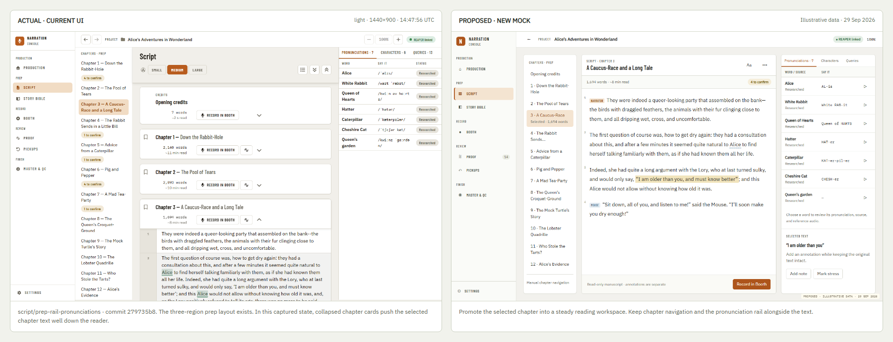
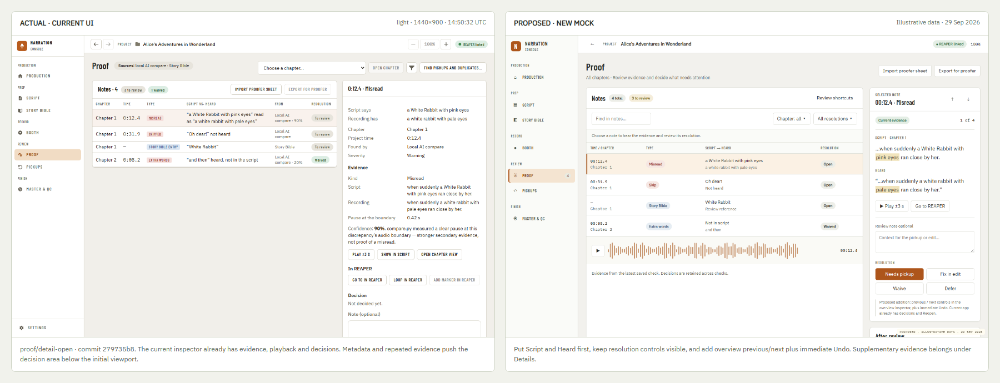

# Fresh UI comparisons and proposed benchmark extensions

**Open [the comparison gallery](index.html).** It contains 12 proposed screens, the seven original benchmark references, and 34 fresh actual screenshots. Images can be opened at full size. Use the left-image selector to compare the proposal with either the current app or the original benchmark.

**Main recommendation:** keep the benchmark's visual identity. Apply its structure consistently, then improve the workflows where the current implementation or the concept leaves important decisions and recovery states awkward or unspecified. [Full research and rationale](research.md).

**Discussion status:** proposals for review, not approved implementation decisions. The draft PR is the discussion record; this research does not authorize application changes or supersede an ADR.

## Review directly on GitHub

GitHub displays the Markdown and images below; the interactive HTML gallery runs locally. Click any image to inspect it at full size.

### Script: current actual and proposed mock



### Proof: current actual and proposed mock



### Supporting workflows

[Settings comparison](comparisons/settings.png) · [Series voices comparison](comparisons/series.png) · [Pickups comparison](comparisons/pickups.png) · [All proposed screens](proposed/) · [Fresh actual captures](actual/)

To open the interactive gallery from a checkout, run this from the repository root, then visit [the local gallery](http://127.0.0.1:48829):

```powershell
node docs/research/professional-ui-review-2026-09-29/serve.cjs
```

## Questions for discussion

1. Keep the benchmark's warm palette and typography as the app-wide baseline, with the proposed clarity adjustments?
2. Should selected-chapter reading be an explicit Script mode alongside the current continuous reader?
3. Should Proof's overview gain previous/next and immediate Undo, with secondary evidence under a disclosure?
4. Which Series and pickup-session capabilities should receive their own requirements before layout implementation?
5. Which Settings, import and recovery patterns should be standardized first?

Please identify the screen and state when commenting. A visual preference, an interaction decision, and a new product capability can be agreed independently.

## What is included

| Comparison | Most useful change |
| --- | --- |
| Production | Clear primary next action; focused action hierarchy; preserve truthful measured facts |
| Script | Bring selected chapter text to the top of a sustained reading workspace |
| Booth | Explicit focused reading mode with quieter chrome and readable dark contrast |
| Proof | Put evidence and decisions in the initial viewport; propose adjacent review and immediate Undo |
| Master & QC | Keep measured evidence, manual checks and package readiness distinct |
| Series voices | Replace nested reference lists with a selected-character workspace |
| Companion | Narrow context without pretending REAPER's illustrated area is actual UI |
| Settings | Bounded forms, visible inheritance and consistent dirty-state actions |
| Import | Outline/preview split, clear review totals and a stable commit footer |
| Pickups | Proposed selectable session queue; current sequential flow remains accurately identified |
| Project picker | Shared visual language at first entry, without unnecessary app chrome |
| Interaction states | Empty, progress, unavailable audio, stale evidence, disconnected DAW and decision feedback |

The interactive prototype demonstrates screen navigation, selecting/advancing Proof findings, searching and clearing an empty result, decision feedback, and Settings save feedback. Audio, imports, saves to project data and DAW actions are simulated or explicitly labeled as demonstrations.

## Screenshot freshness and test evidence

- Current checkout: `279735b88f7a360d3d6d412fd6e478add6e34809`.
- Full visual run started **2026-09-29 14:47:29 UTC / 10:47:29 EDT**.
- **594 tests passed**, zero skipped, failed or flaky; duration **8.1 minutes**.
- **1,213 captures** were examined by the existing visual accessibility gate.
- Main viewport matrix: **1440 × 900**, **1024 × 768**, **768 × 1024**, plus state-specific additional sizes.
- Seven existing benchmark tests also passed as reporting tests, using each benchmark's assigned theme and viewport; the companion comparison is **420 × 900**. They completed at approximately **10:57 EDT**.
- Accessibility gate reported **27 existing declared findings across 15 captures**: 15 `region` instances and 12 `aria-hidden-focus` instances. Passing the existing debt-aware gate is not a claim of complete accessibility.

Sources: [full test log](visual-tests.log), [machine-readable test results](test-results.json), [benchmark log](benchmark-tests.log), [benchmark results](benchmark-results.json), [fresh build log](build.log), [screenshot manifest and SHA-256 hashes](manifest.json).

The screenshots run the **real current UI production bundle with the application's explicit mock API**, as the repository's UI visual tests require. The pictured data are controlled fixtures. This is not a recording of a live narration project or a validation of native Wails/REAPER/audio integration. There is no pre-redesign Home/Teleprompter baseline in this gallery.

Every actual image included in the gallery was copied unchanged from a screenshot generated after this run's start. `build-gallery.cjs` rejects older screenshots before copying them. The selected screen state, source path, capture timestamp and SHA-256 are in the manifest.

## The benchmark scores need context

| Screen | Overall pixel match | Ink match |
| --- | ---: | ---: |
| Production | 82.74% | 25.43% |
| Script | 87.05% | 23.84% |
| Booth | 89.35% | 33.96% |
| Proof | 90.17% | 20.40% |
| Master | 86.32% | 19.43% |
| Series | 88.37% | 15.62% |
| Companion | 85.34% | 22.95% |

These are measurements from the repository's existing reporting tool, **not usability or quality scores**. Large similar background regions contribute to overall match while different fixtures, text and content can lower ink match. Six frames are below the tool's 90% reporting bar, but that bar was not enforced in this run. The seven tests passing means capture/reporting completed; it does not mean all seven visually match their concepts.

## Fair comparison notes

- Both sides use the same viewport dimensions. Booth and companion actuals use the original benchmark's dark theme; the other actuals are light.
- Proof uses `proof/detail-open` so its existing inspector is visible, rather than comparing an unselected current frame against an open proposed inspector. `proof/default` is included as a supplementary actual.
- Script keeps the currently selected chapter in the proposal. Proof keeps the four current finding examples. Other proposals use illustrative benchmark-like content; data differences are called out in the gallery.
- Settings demonstrates the current Global Booth screen versus a proposed project-override layout. These are comparable form patterns, not identical field schemas or states. The real dirty-footer capture is also included.
- Import's actual is the character-review portion of the current dialog; the proposal shows an outline-preview step. It must retain the existing detailed classification and character-selection behaviors.
- The interaction-state board combines six separate studies for discussion; it is not a proposed screen that displays every message simultaneously.
- Newly proposed capabilities are identified separately from already implemented behavior. In particular, existing inspector decisions, Reopen, dirty-state protection, configurable keyboard/pedal input and background work are not presented as missing.

## Implementation priorities

1. **Refine Script and Proof first.** These changes offer the clearest reduction in unnecessary scrolling and repeated visual structure while preserving the established workflow.
2. **Extend the component language into Settings, import, recovery and project entry.** Reuse the same panel, row, message, field and footer rules.
3. **Treat Series and pickup-session redesign as feature work.** Verify data contracts and approval/capability states before translating the concepts into application code.
4. **Validate focused Booth with the real audio workflow.** Confirm readability, microphone/following/recording status and focus-dependent shortcuts in the actual desktop host.

## Reproduction and prototype checks

The full run uses the original `app.spec.ts`, drivers, global setup, validators and viewport matrix. The research config changes process launch and output locations only. The package-manager wrapper initially tried to reinstall dependencies; direct installed binaries avoided that. A missing, already-declared `@wailsio/runtime@3.0.0-beta.25` package was restored into `node_modules`, with SHA-512 checked against `pnpm-lock.yaml`. No manifest, lockfile or production UI source change was needed. The fresh build passed with the existing large-chunk warning.

From `C:\repos\narration-utils\apps\ui`:

```powershell
node node_modules/vite/bin/vite.js build --mode mock --outDir node_modules/.cache/mock-build
node node_modules/@playwright/test/cli.js test --config ../../docs/research/professional-ui-review-2026-09-29/capture.config.ts app.spec.ts
node node_modules/@playwright/test/cli.js test --config ../../docs/research/professional-ui-review-2026-09-29/benchmark-capture.config.ts -g stage-navigation-and-page-replacement
```

From the repository root, render the proposed screens and rebuild the gallery:

```powershell
node docs/research/professional-ui-review-2026-09-29/build-gallery.cjs
```

All 12 proposed frames rendered at their intended sizes without document-level horizontal overflow. Script, Proof and Settings were also rendered at 768 × 1024. The five named interactive behaviors passed checks. [Prototype check record](prototype-checks.json). These checks do not establish complete accessibility or complete responsive interaction behavior. The prototype is intentionally a review artifact, not production-ready components.

All deliverables are inside this existing repository. No new repository or worktree was created. Application implementation was not changed.
