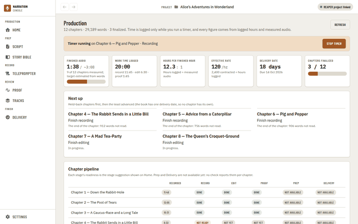
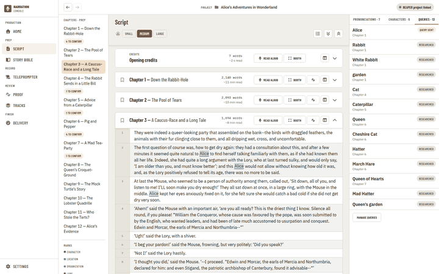
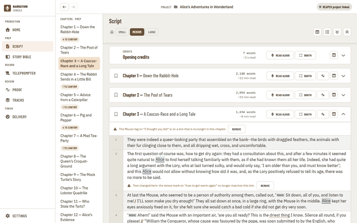
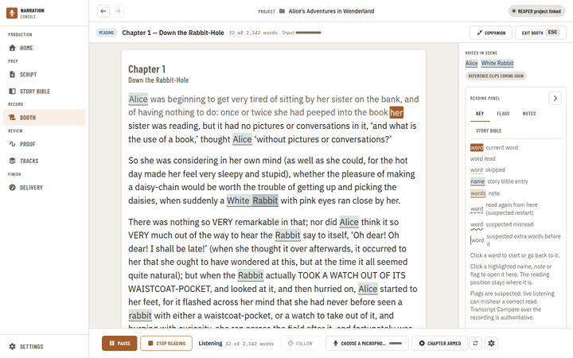
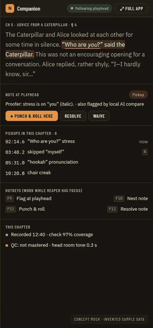
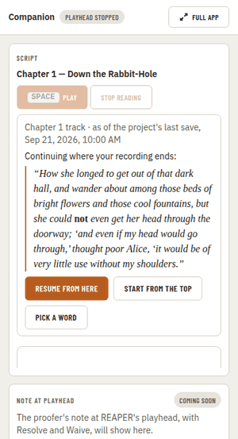
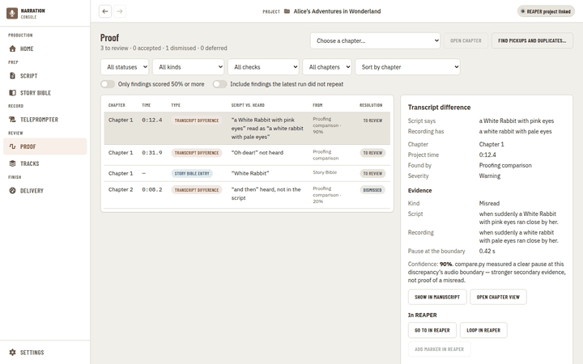
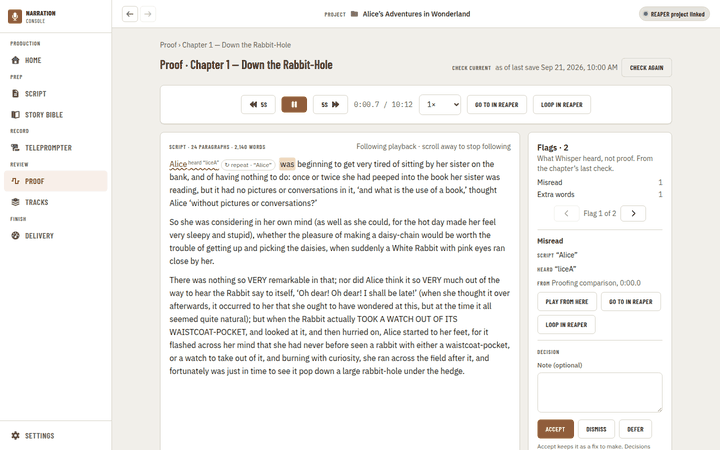
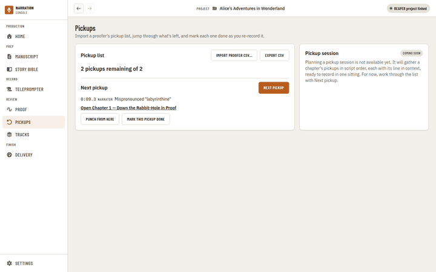
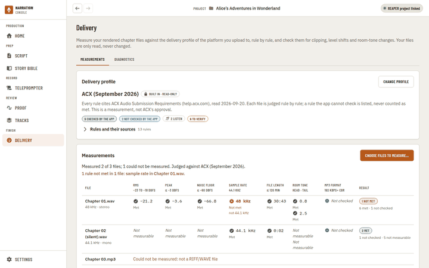

# Visual Mockup Divergence Audit: What Is Left for the Visual Updates, and Why the UI Differs from the Approved Mocks

**Status:** audit, 2026-09-28. Nothing here is a decision: every "fix" below is a recommendation for the phase that carries it, and every "owner decision" is a question for the owner on [#510](https://github.com/countrymanprime/narration-utils/issues/510). Part of [#509](https://github.com/countrymanprime/narration-utils/issues/509).

**Question (owner, 2026-09-28):** "I need an audit of what is left for the visual updates. I checked last visual samples from the artifacts and it looks like some wording and design diverge from the approved mockups and I want to know why."

**Short answer.**

- **The seven benchmark mocks** (the stage-navigation build spec) differ from the current UI in **80 places**:
  - **27** have a recorded reason in a PR's Mockup check or an ADR;
  - **26** are work that has not landed: 22 in pending phases or open PRs, and 4 where the old page is still live;
  - **3** hit a primitive or token limit, and **2** are the one-theme rule;
  - **22 have no recorded reason at all.**
- **The eighteen 2026-09-24 sets** add **88** more (23 recorded, 13 not built yet, 19 on an old page still live, **33 with no recorded reason**).
- **A wording sweep** finds 30 labels that name pages that no longer exist, or name one thing two ways.

The unrecorded differences are mostly wording, and mostly on pages that already replaced their old ones:

- Proof says "Show in manuscript" and "Proofing comparison".
- The engine chip says "REAPER project linked" where the spec says "REAPER linked".
- The chapter track slide-over kept the Tracks page's "Change / Clear".
- The shortcut sheet is still the as-built draft rather than the approved one.

Two Mockup checks explain a dark-versus-light difference for mocks that are light, so the worker cannot have had the mock open.

The biggest unrecorded *design* gap is the Booth. Open PR #822 draws it inside the app shell, in a bordered card; mock 03 is a full-screen, full-bleed reading surface.

## How this was checked

- **Mocks:**
  - the seven benchmark concept mocks in [`docs/prds/mockups/stage-navigation-and-page-replacement/`](../prds/mockups/stage-navigation-and-page-replacement/), which the owner approved as the build spec (D69, 2026-09-27);
  - every other `docs/prds/mockups/**` set, which the owner approved on 2026-09-24 (input commands and pedals: 2026-09-27). Those are covered in [Other approved mockup sets](#other-approved-mockup-sets).
- **Current UI:**
  - the visual suite (`apps/ui/tests/visual/app.spec.ts`), run on `main` at `01500b9` for the states that match each mock;
  - open PR **#822** (Booth) at `b401cab` and open PR **#827** (Pickups) at `20e35e0`;
  - viewports: desktop (1440 × 900, the size the mocks are drawn at), plus small-desktop, tablet, `wide` (1680) for Script and the 380 px companion width.
  - This container's Chromium is older than the pinned Playwright, so the runs used a local, uncommitted config that points at `/opt/pw-browsers/chromium`. Every capture then logged one 404 on a static resource. The same container failure is recorded on #792 ("every capture 404s on `/wails/custom.js`"). It fails the suite's gate here, but the PNGs are written and complete. CI's `ui-visual` shard artifacts come from the same suite and show the same screens.
- **History:**
  - the "Mockup check" table of every UI PR since D46 (quoted from the PR bodies);
  - the stage-navigation PRD and ADR 0407;
  - ADR 0388, ADR 0392, ADR 0404 and ADR 0321;
  - the divergence notes agents posted on #510.
- **Categories:** each divergence has exactly one.
  - **a. DOCUMENTED:** a Mockup check row or ADR gives the reason. It is quoted, and judged still valid or not.
  - **b. NOT BUILT YET:** a pending phase or open PR brings it.
  - **c. PRIMITIVE/TOKEN LIMIT:** a named primitive or token set can't draw it yet.
  - **d. OLD PAGE STILL LIVE:** a pre-D79 page that hasn't been replaced.
  - **e. UNDOCUMENTED DRIFT:** no recorded reason, or a Mockup check row that says "matches" when it doesn't.
  - **f. D69 THEME:** a dark mock shown in the app's one global theme.
- **Sizes:** S is under half a day of one worker, M is a phase-sized change, L is multi-phase.
- The mocks' names and numbers are invented ("Names and numbers are invented", PRD Visual Spec). Different sample data is not counted as a divergence; different labels, structure and data *kinds* are.

## Summary

| Page (mock) | Divergences | a | b | c | d | e | f | Recommended fixes (this audit) |
| --- | --- | --- | --- | --- | --- | --- | --- | --- |
| Shell: rail and top bar (mocks 01–06) | 13 | 2 | 6 | 1 | 0 | 4 | 0 | Engine chip label, project name left-aligned; owner decisions on brand and icons |
| Production (01) | 16 | 6 | 3 | 1 | 1 | 5 | 0 | Subtitle, board cell glyphs, Export as a header button; owner decisions on pace pill, layout and column order |
| Script (02) | 10 | 6 | 1 | 1 | 0 | 2 | 0 | "Marks" key back to the markup layer; owner decisions on the 1440 px rail and per-speaker colours |
| Booth (03, PR #822) | 12 | 5 | 1 | 0 | 1 | 4 | 1 | Full-bleed reading surface and progress wording before #822 merges; owner decision on full screen |
| Booth companion mode (07, PR #822) | 5 | 1 | 3 | 0 | 0 | 0 | 1 | None now (all pending phases) |
| Proof, book and chapter (04) | 11 | 4 | 2 | 0 | 0 | 5 | 0 | Rename stale page names and the type and source labels; add Play ±3 s; owner decision on the chapter view's mock |
| Pickups (04 right panel, PR #827) | 4 | 1 | 1 | 0 | 1 | 1 | 0 | Import and export labels before #827 merges |
| Master & QC (05) | 7 | 2 | 3 | 0 | 1 | 1 | 0 | Mostly Phase 8; #792 records the missing Preview naming and Outputs |
| Series voice bible (06) | 2 | 0 | 2 | 0 | 0 | 0 | 0 | None now (character continuity P11) |
| **Total** | **80** | **27** | **22** | **3** | **4** | **22** | **2** | **16 fixes, 12 owner decisions (10 questions)** (see [Prioritized fix list](#prioritized-fix-list)) |

The benchmark's mocks were drawn "with the app's own tokens and fonts, copied from `apps/ui/src/styles.css`" ([benchmark §3](audiobook-studio-benchmark.md#3-what-the-ideal-looks-like-concept-mocks)). So a colour, font or spacing difference is never a token limit on its own. Where the app looks different, a page chose to.

## Shell: rail and top bar

Every mock draws the same rail and top bar; stage navigation Phase 1 (**#819**, merged) built them. #819's whole Mockup check is one row, compared at desktop only:

> **Matches:** five stage groups in mock order (Production, Prep, Record, Review, Finish) with Settings at the foot; group headings on the wide rail; engine chip in the header's right corner. **Differs (intentionally, per phase scope):** item labels stay their current names (Manuscript, not Script; Teleprompter, not Booth — D3/Q5); no Schedule or Pickups items yet (Q2, no page exists); no series chip or running-timer chip yet (later phases); no zoom group yet (app-navigation P2 still pending).

Mock 01 (top) against `production/on-pace` on `main` (bottom), header strip at full size:

| # | Mock | Current | Cat. | Evidence and whether it holds | Recommendation |
| --- | --- | --- | --- | --- | --- |
| SH1 | Nav items Production, Booth, Master & QC | Home, Teleprompter, Delivery on `main` (Script and Proof already renamed) | b | Stage nav D3/Q5: "each item is renamed in the phase that ships its page". Phases 2, 4 (#822 renames Teleprompter to Booth) and 8 | Fix in P2, P4, P8 |
| SH2 | Review › Pickups item | None on `main` | b | Phase 7, open **#827** | Fix in P7 |
| SH3 | Production › Schedule, Finish › Delivery items | None | a | Stage nav Q2 and ADR 0407 item 5: "A nav item exists only for a page that exists". Holds, and the owner FYI is on #510 with no reply | Keep and document |
| SH4 | No Tracks item | Review › Tracks | b | Phase 6 (the engine panel) dissolves it | Fix in P6 |
| SH5 | Count badges ("3", "14", "9") | None | c | `NavButton` has no count slot (stage nav Q12, ADR 0360 lane U) | Keep until Q12; S in lane U |
| SH6 | Engine chip **"REAPER linked"** | **"REAPER project linked"** (`layout/EngineChip.tsx:43`) | e | The PRD's header spec says the state is `REAPER linked` (stage-navigation PRD, "The header", item 6). #819's check says only "engine chip in the header's right corner" | **Fix, S** |
| SH7 | Chip suffix "· following Ch 7" | None | b | PRD item 6: "once edit-and-proof P7 feeds the playhead" | Fix in edit-and-proof P7 |
| SH8 | Running-timer chip in the header ("2:14:08 today · timer on Ch 7") | None in the header; Production shows a full-width "Timer running" banner in the page instead | b | Stage nav Phase 2 ("the running-timer chip in the header") | Fix in P2 |
| SH9 | Series chip "Book 1 · Wonderland series" | None | b | PRD item 3: "once Character Continuity Review P9 stores series membership, not before" | Fix in character continuity P9 |
| SH10 | "PROJECT" label and name **left-aligned** after the brand column | Project label, folder icon and name **centred** in the header | e | Not in #819's check. The PRD's order is "from left to right", and the mock draws it left | **Fix, S** (serial `AppShell.tsx`: ride with P2) |
| SH11 | Brand "NARRATION / STUDIO" with an "N" tile | "NARRATION / CONSOLE" with a microphone tile | e | No ADR or PRD names the product mark. The mock may have invented it ("names are invented") | **Owner decision**, S |
| SH12 | Small outline glyphs; Booth is a record dot | Font Awesome solid icons; #822 gives Booth the old Teleprompter scroll (`faScroll`) | e | Not in #819's or #822's check | Keep and document (the icon set predates the mocks); S to give Booth a record icon in #822 |
| SH13 | No Back or Forward | Back and Forward at the left of the header | a | App navigation P1 (mockups approved 2026-09-24) and the stage-nav header spec item 2. Holds | Keep |

## Production (mock 01)

The Production page (**#760**, merged; export panel **#783**, merged) is reachable only at `/production`. Home is still `/` until Phase 2. #760's Mockup check is thorough and lists most differences. #783 has no Mockup check.

| # | Mock | Current | Cat. | Evidence and whether it holds | Recommendation |
| --- | --- | --- | --- | --- | --- |
| PR1 | Production is the landing page and the first nav item | Home is `/` and the nav's Production item; `/production` is unlisted | d | Stage nav Phase 2 (pending) | Fix in P2 |
| PR2 | Subtitle: "12 chapters · 29,189 words · ACX royalty share + PFH stipend · delivery due Oct 14 (18 days)" | "12 chapters · 29,189 words · 3 finalized. Time is logged only while you run a timer, and every figure comes from logged hours and measured audio." | e | Not in #760's table | **Fix, S**: the deal and deadline in the subtitle; the explanation to an info tooltip |
| PR3 | "On track · at current pace done Oct 9" pill | None | a | #760: "A pace projection would mix logged hours with an estimated amount of work left (ADR 0015, ADR 0320)". A real reason, but the approved mock shows it | **Owner decision** (asked on #510 by #760's worker, no answer) |
| PR4 | "Start session" button | None; timers start per chapter from Next up | a | #760: "timers start per chapter from Next up". Holds | Keep and document |
| PR5 | "Export status report" button in the page header | A "Status report" panel below the Delivery plan panel | e | #783 has **no Mockup check**, though the mock draws the button (#760's row: "Export is Phase 5") | **Fix, S** in P2: a header button opening the same flow |
| PR6 | No Refresh | "Refresh" button top right | e | Not in #760's table | Keep and document, S |
| PR7 | KPI tiles "Open pickups 9" and "Delivery check 7 / 12" | "Delivery date 18 days" and "Chapters finalized 3 / 12" | a | #760: "Nothing reports open pickups or a delivery verdict per chapter yet". Holds until Pickups (P7) and Master & QC (P8) exist | Fix after P7 and P8, M |
| PR8 | "Effective rate $37/hr at $225 PFH" | "120 /hr · 2,400 contracted ÷ hours logged": no currency, and the basis is the contract total, not PFH | e | #760 says the first four tiles "Match" | **Owner decision** on currency and PFH wording, S |
| PR9 | Board columns FIN., Prep, Record, Edit, Proof, Pickups, Master, QC | Recorded, Record, Edit, Proof, Prep, Delivery | a | #760: "Prep and Delivery have no per-chapter producer, so they say 'Not available' and come last … Pickups, Master and QC are left out". Holds for the missing producers; moving Prep after Proof is a layout choice | **Owner decision** on order, S; add columns after P7 and P8 |
| PR10 | Cells are compact glyphs: ✓, –, "41%", "3 open", "proofer", PASS / FLOOR | Text badges DONE, NOT READY, NOT YET, NOT AVAILABLE | e | #760 does not mention the cells. `StageGrid` takes any `label`, so this is the page's choice, not a primitive limit | **Fix, S** |
| PR11 | "every cell opens that stage for the chapter" | Read-only board | b | #760: "not built (the board is read-only)". Stage nav Phase 2: "The board's cells open the surfaces Home opened" | Fix in P2 |
| PR12 | Next up is a column beside the board | Next up spans the page above the board below 1600 px | a | #760: "Side by side at 1440 it squeezed the board so Delivery scrolled out of view". A real trade, but the mock is drawn at 1440 | **Owner decision** |
| PR13 | Next up mixes pickups, a QC failure and author queries | Next up lists stage work only | b | Needs Pickups (P7), Master & QC (P8) and prep-depth queries as sources | Fix after P7 and P8 |
| PR14 | Burndown "finished hours vs plan" | None | c | #788 (data only): "a future chart primitive, out of this PRD's scope". No chart primitive exists | Keep until a chart primitive; M in lane U |
| PR15 | "This week" panel (booth hours, voice rest, proofer) | None | a | Production tracking's "What we're not building". Holds | Keep and document |
| PR16 | (no Home) | The board subtitle reads "the stage suggestion shown on Home" | b | Home dies in Phase 2 | Fix in P2 (reword) |

## Script (mock 02)

**#824** (merged) carries a nine-row Mockup check against mock 02. One of its rows is wrong about the mock itself: "Dark look | App theme (light by default…) | By design: D69". Mock 02 is a **light** mock (the same file as `prep-depth/02-prep-script-concept.webp`, byte for byte), so there was no theme difference to explain.

| # | Mock | Current | Cat. | Evidence and whether it holds | Recommendation |
| --- | --- | --- | --- | --- | --- |
| SC1 | Three columns at 1440 px: chapter list, reader, rail | At 1440 the rail is a "Prep" slide-over that covers the reader's right edge, the header and the engine chip; three columns only from 1536 px | a | #824: "At 1440 the rail is the Prep panel (the reader card's fixed header columns need the room, ADR 0190/0392)"; asked on #510 (N-C29), no answer | **Owner decision**, M |
| SC2 | Per-chapter ✓ or "80%" | "4 TO CONFIRM" badge (unconfirmed names), nothing when there are none | a | #824 and ADR 0392: "nothing measures a chapter's prep yet". Holds until prep-depth P7 | Keep; fix with prep-depth P7 |
| SC3 | Key "MARKUP LAYER": speaker, word stress, breath, pause, pronunciation, author query | Key "MARKS": Character, Location, Organization, Lore … (Story Bible categories) | e | #824 says "Matches. The key lists the reader's marks (Story Bible categories and notes)". The heading and every entry differ from the mock | **Fix, S**: the markup key the mock draws, with the Story Bible colours after it |
| SC4 | One chapter's text | Every chapter as a stack of cards, each paragraph numbered in a grey gutter | a | #824: "The reader keeps its card stack … so expand/collapse and the credits cards are not lost". Holds | Keep and document |
| SC5 | No per-chapter read buttons | "READ ALOUD" and "BOOTH" on every card | b | Stage nav Q9: one "Record in Booth" link; **#822** makes it | Fix in P4 (#822) |
| SC6 | Chapter header chip "2 queries open" and "ATTRIBUTE SPEAKERS" | Neither | a | #824: "no queries chip in the header (the list and rail carry the count), and no Attribute speakers (character-continuity P6's extractor has no binding yet)". Holds | Keep; Attribute speakers with character continuity P6 |
| SC7 | A speaker tag in the gutter per paragraph, each speaker its own colour, with a matching bar | A small inline chip before the quote, one Character colour for everyone, no bar | c | #751 / N-U1 on #510: "If per-speaker colours are wanted, they need new tokens (a lane-U token batch)". Asked, no answer | **Owner decision**, M (lane U token batch) |
| SC8 | No page heading or reader toolbar | "Script" heading, SMALL / MEDIUM / LARGE text size, and outline / expand / collapse icons | e | Not in #824's table | Keep and document, S |
| SC9 | Rail footer: Look up (Forvo, YouGlish, Merriam-Webster), Record mine, "Email 2 queries to author", "Export prep sheet" | "Manage queries" | a | #824: "per-word lookups stay in the selection's Look up and the Story Bible entry (prep-depth P9/P10); export is the queries panel's CSV". Holds | Keep and document |
| SC10 | "New voices in this chapter" and "Read-ahead notes" footer | None | a | Stage nav Phase 3: "no data source and is left out rather than drawn empty". Holds | Keep |

## Booth (mock 03, open PR #822)

On `main` the job is still split between the Teleprompter page and the Script cards' Read aloud and Booth dialogs. **#822** (open) builds `/booth`. Its six-row check compares at desktop only.

| # | Mock | Current (#822) | Cat. | Evidence and whether it holds | Recommendation |
| --- | --- | --- | --- | --- | --- |
| BO1 | One Booth page | `main`: `/teleprompter` plus the Read aloud and Booth dialogs | d | Stage nav Phase 4, #822 | Merge #822 |
| BO2 | **Full screen**: no nav rail, no app header; the status bar is the top edge | The Booth renders **inside the app shell**: rail, app header and engine chip stay, and the booth's own status line sits under them | e | Not in #822's check. Booth mode's PRD title promises "a Full-Screen Reader for the Booth"; ADR 0388 reasons "On a page inside the app shell, the nav … always reachable" without saying the mock is full screen | **Owner decision**, M: hide the shell on `/booth` (the `FocusShell` edge to edge, Exit booth returns) or keep the shell |
| BO3 | Full-bleed large text; read lines dimmed; the current phrase highlighted with a punch caret | Text inside a bordered white card on the page background, a chapter heading, body type smaller; words highlighted one by one | e | Not in #822's check | **Fix, M** in #822 or right after |
| BO4 | Speaker tag in the gutter per line | Story Bible marks inline, no speaker tags | a | #822: "prep-depth speaker attribution (#787) … isn't wired into the Booth's text yet". Holds, but the data exists on Script | Fix, S–M, right after #822 |
| BO5 | Progress "¶ 38 of 71 · 41% · ~8:10 finished left" | "32 of 2,142 words" | e | #822 marks the top bar "Matches" | **Fix, S** in #822 |
| BO6 | Room meter "Room −64.1 dB" and "Mic matches Sep 19 session ✓" | Input meter only | a | #822: "Room tone and 'Mic matches' are not built (booth-mode Q4 deferred)". Holds | Keep |
| BO7 | "REAPER · take 4" chip in the status bar | REAPER state on the command bar's Record in REAPER toggle | a | #822: "one control, not two". Holds | Keep and document |
| BO8 | Rail: Last punch, Coming up (pronunciations), This session | None of the three | a | #822: "no data source yet (booth-mode D3's precedent: nothing drawn empty)". Only partly holds: the Story Bible's pronunciations (on Script's rail) could feed Coming up | Fix Coming up, S; the rest keep |
| BO9 | No legend | A "Reading panel" with Key / Flags / Notes / Story Bible tabs; the Key tab is a legend of highlight styles | e | Not in #822's check | Keep and document, S |
| BO10 | Hotkey bar: Space Pause, R Punch & roll, ⌫ Back one sentence, F Flag, P Mark pickup; pedal and tablet chips | Buttons: Pause, Stop reading, Follow, microphone, Chapter armed, refresh, settings | b | #822: "not built (booth-actions-enablement, input PRDs)" | Fix with input commands and booth actions |
| BO11 | Dark | Follows the global theme, light by default (`booth/dark` shows dark) | f | D69, ADR 0365. Holds | Keep |
| BO12 | Voices in scene with a description and a reference-clip play button | Names only, "Reference clips coming soon" | a | #822 and booth mode D3; clips come from character continuity. Holds | Keep |

## Booth companion mode (mock 07, PR #822)

 

| # | Mock | Current (#822) | Cat. | Evidence | Recommendation |
| --- | --- | --- | --- | --- | --- |
| CO1 | The paragraph at the playhead with the current sentence highlighted | Play and Stop buttons, the resume card, then the chapter heading | a | #822: "Matches its existing Phase 7 layout" (booth mode P7). Weak: the mock's reading line is not there in this state | Keep and document |
| CO2 | Note at playhead with Punch & roll here, Resolve, Waive | "Coming soon" | b | Closed-loop proofing (#633) | Fix with closed-loop proofing |
| CO3 | Pickups in this chapter (4 lines) | "Coming soon" | b | Stage nav Phase 7 and closed-loop proofing | Fix after P7 |
| CO4 | Hotkeys that work while REAPER has focus: F9 flag, F10 next note, F11 punch, F12 resolve | Space: Play or pause reading | b | Input commands and pedals; `docs/research/global-hotkeys-while-reaper-has-focus.md` | Fix with the input PRD |
| CO5 | Dark | Global theme | f | D69 | Keep |

## Proof (mock 04: book level and chapter view)

**#823** (merged) has an eight-row check. Its notes-table row says "Matches" for the Type column and the detail panel, but both differ in wording.

| # | Mock | Current | Cat. | Evidence and whether it holds | Recommendation |
| --- | --- | --- | --- | --- | --- |
| PF1 | Resolutions Pickup / Edit · de-click / Waived · intended; header "Notes · 14", "6 need pickup", "5 fix in edit", "3 waived" | TO REVIEW / DISMISSED; "3 to review · 0 accepted · 1 dismissed · 0 deferred" | a | #823: "The resolution chips are the findings' own statuses … not the mock's invented Pickup/Edit/Waived: those resolutions need closed-loop proofing". Holds for storage; the words could follow the mock sooner | **Owner decision** on vocabulary, S |
| PF2 | Type chips MISREAD, SKIP, MOUTH, PRON., PACING, REPEAT, PLOSIVE, NOISE | TRANSCRIPT DIFFERENCE, STORY BIBLE ENTRY | e | #823 says the Type chip "Matches". The chapter view already says "Misread" and "Extra words" for the same findings | **Fix, S**: show the evidence kind |
| PF3 | From: "Proofer + AI", "AI · 0.97", "Proofer", "Bible check" | "Proofing comparison · 90%" (`proof/findingFormat.ts:28`) | e | Not in #823's check. "Proofing" is the page #823 deleted | **Fix, S**: "Local AI compare", as the mock's Sources line says |
| PF4 | No filters; a "Sources: proofer (CSV) · local AI compare · my flags" line | Five selects (status, kind, check, chapter, sort), two switches, "Choose a chapter… / Open chapter / Find pickups and duplicates…" | e | Not in #823's check (carried over from Review) | Keep the filters and document them; add the Sources line, S |
| PF6 | "Import proofer sheet" and "Export for proofer" in the notes header | On the Pickups page (#827) | a | #823: "they are the Pickups page (Phase 7)". A placement the mock does not draw | **Owner decision**, S |
| PF7 | No Chapter column (a chapter-level table) | A Chapter column | a | #823: "the book level spans every chapter". Holds | Keep |
| PF8 | Detail buttons "Play ±3 s" and "Go to in REAPER" | Show in manuscript, Open chapter view, Go to in REAPER, Loop in REAPER, Add marker in REAPER; **no Play** | e | #823: "Matches in place". Play is missing at the book level | **Fix, S–M** |
| PF9 | — | "SHOW IN MANUSCRIPT", tooltip "Open this line in the Manuscript" (`proof/FindingDetail.tsx:191`, `proof/FlagsPanel.tsx:134-136`) | e | The Manuscript page became Script in #824 | **Fix, S**: "Show in Script" |
| PF10 | Waveform strip with coloured note pins | None | b | #823: "it is edit-and-proof P5 (pending)" | Fix in edit-and-proof P5 |
| PF11 | Pickup session panel | None on Proof | b | Phase 7 and closed-loop proofing P4 (#633) | Fix there |
| PC1 | Chapter level = the waveform plus the notes table, filtered to one chapter | The chapter view follows edit-and-proof mocks 01/02: transport, the script with flags inline, a Flags panel with decision | a | #823: "Matches as it did before the move". **Two approved mocks disagree** (04, D69; edit-and-proof 01/02, 2026-09-24) | **Owner decision**, M–L |

The chapter view's flag detail repeats PF3 ("FROM Proofing comparison"); it is counted once.

## Pickups (mock 04 right panel, open PR #827)

| # | Mock | Current (#827) | Cat. | Evidence | Recommendation |
| --- | --- | --- | --- | --- | --- |
| PK1 | A Pickups page | `main`: the Pickups dialog on the Tracks page | d | Stage nav Phase 7, #827 | Merge #827 |
| PK2 | "Import proofer sheet", "Export for proofer" | "IMPORT PROOFER CSV…", "EXPORT CSV" | e | #827: "Matches in place. The labels keep the CSV wording the guide and the file format use". The labels differ, so the row is not a match | **Fix, S** in #827 (or owner accepts "CSV") |
| PK3 | A per-note table | "2 pickups remaining of 2" and the next pickup | a | #827: "the pickups contract has no per-row listing … closed-loop proofing P4's `PlanPickupSession` provides". Holds | Keep |
| PK4 | Numbered session plan, "Record pickups in Booth", "Print pickup script" | "Pickup session · Coming soon" | b | Closed-loop proofing P4/P7 (#633) | Fix there |

PR #827's head (`20e35e0`) predates #824, so its rail still reads Manuscript and Teleprompter. That is branch staleness, not a divergence: it goes when `main` is merged in.

## Master & QC (mock 05)

`main` still has the Delivery page. **#792** (open) adds a Master & QC *tab* to it. Its check also calls mock 05 "Dark-mode-only concept art", but mock 05 is a **light** mock.

| # | Mock | Current | Cat. | Evidence and whether it holds | Recommendation |
| --- | --- | --- | --- | --- | --- |
| MQ1 | "Master & QC" page and nav item | "Delivery" page, Measurements and Diagnostics tabs | d | Stage nav Phase 8 (pending) | Fix in P8 |
| MQ2 | Platform tabs ACX, INaudio, Google Play, Apple (M4B), Kobo | A "Delivery profile" card with "Change profile" | b | Phase 8: "The profile `Select` becomes mock 05's platform tabs" | Fix in P8 |
| MQ3 | Per-file columns: Length, RMS, True peak, Noise floor, Head / Tail, Clicks, Text, PASS / FAIL | RMS, Peak, Noise floor, Sample rate, File length, Room tone head · tail, MP3 format, Result | b | Phase 8, plus a clicks and text-coverage source per file | Fix in P8 |
| MQ4 | "04 · Why it fails" with a suggested fix, "Quietest 5 s", "Open in REAPER" | Rule-by-rule detail per file (`delivery/file-rules`) | b | Phase 8 | Fix in P8 |
| MQ5 | Mastering chain as a row of steps, "Edit chain", "A/B raw ↔ mastered" | Not drawn (#792) | a | #792: "Phase 3 shipped the chain fixed and un-editable (ADR 0321) … not a chain graphic". Holds for editing, not for showing it | **Owner decision**: a read-only chain row, S |
| MQ6 | Delivery package: checklist, OUTPUTS list, "Build packages", "Preview naming" | #792: checklist and "files-written summary"; no Outputs list or Preview naming | e | #792: "**Matches** the concept closely", without either | Fix, S (or record the gap in #792) |
| MQ7 | "Master all to spec…", "Re-check 12 files" | `main`: "Choose files to measure…"; #792: "Master & encode" | a | #792: "the mock's copy assumes per-file QC already ran". Holds until P8 joins them | Keep until P8 |

## Series voice bible (mock 06)

| # | Mock | Current | Cat. | Evidence | Recommendation |
| --- | --- | --- | --- | --- | --- |
| SV1 | Story Bible › Series view: voices, reference clips, pitch and rate against the anchor, lines by chapter | Not built | b | Character continuity P11 (stage nav: "a Series tab of Story Bible") | Fix in P11 |
| SV2 | Engine chip "Built-in recorder · 48 kHz / 24-bit" | "Built-in recorder" (the `apps/desktop/engine-builtin` mock flag) | b | Stage nav Q7: UI-only until native recording | Fix with native recording |

## Other approved mockup sets

The owner approved these sets on 2026-09-24 (input commands and pedals on 2026-09-27). They were rendered from the real app, in the dark theme, before stage navigation. This section compares each non-"before" mock with the source on `main` at `01500b9`: every key string was grepped, with its `file:line`. It is not a capture-by-capture comparison, because most of these surfaces are dialogs, slide-overs and states inside the pages above.

- **Counted once, not per set:** every one of these mocks is dark (f, D69, ADR 0365). Every one also draws the old flat nav and the old header, which stage nav Phase 1 replaced (a, ADR 0407).
- **Benchmark concept copies** are audited in the sections above. These are `booth-mode-and-companion-panel/{03,07}`, `character-continuity-review/06`, `prep-depth/02`, `production-tracking/01`, `render-encode-master/05` and `delivery-platform-profiles/11-book-wide-spread-concept`.
- **Where the wording is verbatim:** the actual-recorded tooltips, the stage-check line, the credits rows and setup dialog, the auto-sync dialog, toast and statuses, the delivery profile panel, editor and report, every resume-from-DAW prompt, and the keyboard settings.
- **Where the drift is:** the chapter track slide-over, Proof's chapter view (the former workspace), the Record in REAPER bar and the shortcut sheet.

| Set | PRD phases (status on main) | Div. | a | b | c | d | e |
| --- | --- | --- | --- | --- | --- | --- | --- |
| actual-recorded-column | 1-3 complete | 4 | 2 | 0 | 0 | 1 | 1 |
| app-navigation-and-zoom-controls | 1 complete; 0, 2, 3 pending; 4 deferred | 2 | 0 | 2 | 0 | 0 | 0 |
| app-shell-vertical-overflow | 1, 2 partial (owner WebView2 check) | 2 | 1 | 1 | 0 | 0 | 0 |
| chapter-title-display-consistency | 1, 2 complete; 3 pending (moved to Booth); 4 partial | 4 | 0 | 0 | 0 | 3 | 1 |
| chapter-track-link-control | 1, 2, 4 complete; 3 host complete (UI built, row stale) | 11 | 1 | 0 | 0 | 1 | 9 |
| credits-in-chapter-table | 1, 2 complete; 3 pending; 4 partial | 3 | 0 | 2 | 0 | 0 | 1 |
| credits-token-setup-and-front-matter-detection | 1 complete; 2, 3 rows say pending (UI built); 4 pending | 7 | 2 | 1 | 0 | 1 | 3 |
| daw-chapter-track-auto-sync | 1, 2, 6 complete; 3, 4, 7, 8 host complete; 0, 5 pending | 6 | 0 | 2 | 0 | 1 | 3 |
| delivery-platform-profiles | 1-10 complete; 0 partial (owner) | 6 | 3 | 1 | 0 | 2 | 0 |
| edit-and-proof-workspace | 1-4 complete; 5-9 pending; 10 superseded by stage-nav P5/P6 | 16 | 4 | 4 | 0 | 1 | 7 |
| home-combined | (combination of the Home sets) | 6 | 2 | 0 | 0 | 1 | 3 |
| home-stage-check-line | 1, 2 complete | 2 | 1 | 0 | 0 | 1 | 0 |
| input-commands-and-pedals (09-27) | 1-12 complete | 4 | 1 | 0 | 0 | 2 | 1 |
| manuscript-chapter-header-alignment | 1 complete | 3 | 2 | 0 | 0 | 1 | 0 |
| manuscript-combined | (combination) | 2 | 1 | 0 | 0 | 1 | 0 |
| manuscript-credits-card-parity | 1-3 complete | 2 | 1 | 0 | 0 | 1 | 0 |
| read-aloud-control-bar | 1, 2, 4-6 complete; 3, 7 partial (owner) | 6 | 1 | 0 | 0 | 1 | 4 |
| read-aloud-resume-from-daw | PRD delivered and deleted | 2 | 1 | 0 | 0 | 1 | 0 |
| **Total** | | **88** | **23** | **13** | **0** | **19** | **33** |

### actual-recorded-column

Visual Spec: 01 table, 02 dash tooltip, 03 stat tooltip, 04 column-header tooltip. Surface: Home › Audiobook estimate. Stage-nav Phase 2 deletes this chapter table: "`AudiobookEstimatePanel.tsx`'s chapter table (the stage board replaces it)".

**Verbatim on main:**
- The "Actual recorded" stat and column header, with the ⓘ (`home/AudiobookEstimatePanel.tsx:336`, `:436-438`).
- The dash tooltip "Linked track is not in the saved project" (`:60`).
- The stat tooltip "From N of M chapters with a linked track, as of the saved REAPER project. Nothing here is estimated." (`:333`).
- The header tooltip "The audio on the chapter's linked REAPER track: its unmuted items, overlaps counted once, as of the saved project. A dash means no track is linked." (`:436`).
- "Est. finished audio", "Recording progress", "N of M chapters finalized", "~155 words/min narrated".

| Mock | Element | Mock | Current | Cat. | Evidence | Recommendation |
| --- | --- | --- | --- | --- | --- | --- |
| 01 | Explainer line above the table | "Stage suggestions come from the saved REAPER project and the last recording checks. Nothing changes until you confirm." + CHECK NOW | Gone; a line shows only on a failed read | a | home-stage-check-line P1 (Q1, Q3, Q4) | Keep |
| 01 | Per-row CHECK button | CHECK in the last column | "Recording check" column with a status button (`ChapterCheckStatusButton`) | a | daw-chapter-track-auto-sync P6 (mock 04 of that set) | Keep |
| 01 | The whole table | Chapter table on Home | Still on Home | d | Stage-nav P2: the board replaces the table; the Actual recorded figure has to survive onto the board or the slide-overs | Carry "Actual recorded" and its tooltips into Production P2 (M, within P2) |
| - | Chapter link target | (clicking a chapter opens the reader) | `to="/manuscript#c…"` and `/manuscript#credits-…` (`:458`, `:279`), a route #824 retired (redirected) | e | #824 renamed `goToManuscript` → `goToScript` only in `App.tsx`; these links were missed | Fix: `/script#…` (S) |

### app-navigation-and-zoom-controls

Visual Spec: 01/01a default header, 02/02a Back enabled with zoom at 125%, 03-05 tooltips, 06 tablet, 07/07a reflow option A (07b is the alternative), 08 zoom at 200%, 09 1280 px at 150%.

**Verbatim on main:** the Back and Forward tooltips "Back (Alt+Left)", "Forward (Alt+Right)" and "Back (Alt+Left): no earlier page in this project" (`layout/AppShell.tsx:105-106`). The chip shortens to its dot below `md` (`EngineChip.tsx:66`).

| Mock | Element | Mock | Current | Cat. | Evidence | Recommendation |
| --- | --- | --- | --- | --- | --- | --- |
| 02, 04, 06-09 | Zoom group | `[−] 125% [+]`, tooltip "Reset zoom to 100% (Ctrl+0)", 175% at reflow | Absent | b | PRD Phase 2 pending (needs Phase 0's Windows run); stage-nav header item 5 | Build in P2 (M) |
| - | Remember zoom | Global setting, optional Appearance row | Absent | b | PRD Phase 3 pending | P3 (S) |

Two more points are covered above and not counted again here. The project block is left-aligned in 01a/02a but centred in the code (SH10). The chip text is SH6 / G1.

### app-shell-vertical-overflow

Visual Spec: 01-after (Story Bible at 1024 × 768, the page scrolls inside the shell and never past it). Layout only; there is no wording.

| Mock | Element | Mock | Current | Cat. | Evidence | Recommendation |
| --- | --- | --- | --- | --- | --- | --- |
| 01 | Header | Icon rail and header with no Back/Forward | Stage-grouped rail and Back/Forward | a | app-navigation P1 and stage-nav P1 (#819) came later | Keep |
| 01 | WebView2 gutter at 100/125/150% | No page scrollbar | Built (`html, body { overflow: hidden }`, `SlideOver h-full`), but not verified in WebView2 | b | PRD P1/P2 "partial — pending owner … needs a Windows run (#510)" | Owner run on #510 (S) |

### chapter-title-display-consistency

Visual Spec: 01 manuscript cards, 02 Home table, 03 Chapters & Search, 04-06 Read aloud heading and title, 07 Teleprompter select.

**Verbatim or matching on main:**
- Card headings "PROLOGUE — The Last Good Applause" in source casing with one separator (`ReaderCard` via `chapterName`).
- Home rows (`TitleSubtitle`).
- "Chapters & Search" (`script/ScriptPage.tsx:672`) and "Search manuscript…" (`manuscript/SearchBar.tsx:24`).
- The reading heading: title with a muted subtitle line, no CSS capitals (`teleprompter/ReaderText.tsx:239-246`).
- The dialog title "Read aloud: <name>" (`ReadAloudDialog.tsx:208`).
- The Teleprompter select labels through `chapterName` (`TeleprompterPage.tsx:109`).

| Mock | Element | Mock | Current | Cat. | Evidence | Recommendation |
| --- | --- | --- | --- | --- | --- | --- |
| 01 | Per-card READ ALOUD button | On each card | Still on each Script card, with Booth and Companion (`manuscript/ReaderCard.tsx:174-190`) | d | Stage-nav Q9: one "Record in Booth" link "in Phase 3 or 4, whichever lands second" → Phase 4 (#822) | Fix in P4 |
| 04-06 | Read aloud dialog | Dialog titled "Read aloud: …" | Still the dialog | d | Stage-nav P4 deletes `ReadAloudDialog`; this PRD's P3 row says "apply … to the Booth there" | Carry the title rule into the Booth header (S, in #822) |
| 07 | Teleprompter chapter select | Listbox of chapter names | Still `TeleprompterPage` | d | Stage-nav P4 | Booth setup's chapter picker uses `chapterName` (in #822) |
| - | PRD status | P3 "pending" | Dialog title, heading and select rules are already on main | e | PRD row 3 vs `ReadAloudDialog.tsx:205-208`, `TeleprompterPage.tsx:109` | Update the PRD row (S) |

### chapter-track-link-control

Visual Spec: 01 button states, 02-05 slide-over (linked, ambiguous, suggested + relink warning, track missing), 06 Remove confirm, 07 Removed list, 08 no-project line, 09 tablet. The Decisions Log says the open questions take "the recommended answer, as shown in its approved Visual Spec mockups". The surface is Home, and Stage-nav P2 moves it to Production.

**Verbatim on main:**
- Title "Track: <chapter>" (`home/ChapterTrackPanel.tsx:139`), "As of last save …" (`:148`), "N playable of M" (`:150`), "Span", "Found through", "Linked", "Possible tracks" (`:223`), "Remove from recording…" (`:265`).
- 06 in full: "Remove <chapter> from recording?", body, "What is it?", "Not a chapter", "Front matter", "Remove from recording" (`RemoveFromRecordingDialog.tsx:7-40`).
- 07: "Removed from recording (N)", "… words · removed … as …", "Restore" (`RemovedFromRecordingList.tsx:25-41`).
- 01: the seven button states (not pixel-checked).

| Mock | Element | Mock | Current | Cat. | Evidence | Recommendation |
| --- | --- | --- | --- | --- | --- | --- |
| 02 | Facts | Items, Span, **Recorded length 13m**, Found through, Linked "22 Sep 2026, **by you**" | No "Recorded length"; Linked shows the date only (`:150-167`) | e | Phase 2 complete (#534), no recorded reason | Fix: add Recorded length from `recordedSeconds` and who linked it (S) |
| 02, 05 | Actions | "ANOTHER TRACK…", "UNLINK" | `MappingConfirm` under a "Link" heading: "Change" / "Clear", picker "Confirm" / "Cancel" (`mapping/MappingConfirm.tsx:43-70`) | e | Reused from the Tracks page; the PRD calls for the mock's wording | Fix: relabel in the panel, or give `MappingConfirm` label props (S) |
| 02-05 | Chapter section | Heading "CHAPTER" and "Imported by mistake? Take it out of the table and totals. Its text stays in the manuscript." with a danger-outline button | Heading `sr-only`, no text, ghost button (`:255-266`) | e | - | Fix (S) |
| 03 | Ambiguous | Callout "2 tracks look like this chapter. Link the one it is recorded on."; candidate cards with "Track 5" and "Name matches “Chapter 5” · 3 items · 0:00 to 9:12"; the best one primary | Track name and optional region only; every candidate has a plain "Link" (`:220-243`) | e | - | Fix: add the callout and the match reason with items and span per candidate (M) |
| 04 | Suggested | "Not linked yet. This track looks like the chapter; link it to use it for checks and recorded time." and a "SUGGESTED TRACK" card: "Close to “Chapter 6”, not a confident match · 4 items · 0:00 to 16:40" | No intro; shown under the "Possible tracks" heading | e | - | Fix (S) |
| 04 | Relink warning | Inline before linking: "Track 4 is linked to Chapter 4. Linking it here unlinks Chapter 4." + "LINK AND UNLINK CHAPTER 4" / "CANCEL" | No warning first; a toast afterwards: "Linked. This track was linked to X, which is now unlinked." (`:104`) | e | PRD Phase 2 scope names "the displaced-chapter warning" (TL10) | Fix: warn before the link (M) |
| 05 | Missing track | Subline "Not in the saved project", eyebrow MISSING, danger callout "The linked track “Chapter 7” is not in the saved project. It may have been deleted or the project saved elsewhere. Link another track, or unlink." | Eyebrow "Track missing" (`:284`); `MappingConfirm` shows "Linked track is missing from this project" + Change/Clear | e | - | Fix (S) |
| - | Extra controls | (not drawn) | Play, ±30 s and "Select in REAPER" in the panel | a | PRD Phase 4 (Could, complete) | Keep |
| 08 | No-project line | "Choose the REAPER project on Tracks to see each chapter's track." + button "OPEN TRACKS" | Host text "Choose which REAPER project file to use on the Tracks page." + inline link "Choose it on Tracks to see chapter tracks." (`apps/desktop/chapterlinks.go:224`, `AudiobookEstimatePanel.tsx:414-423`), which says it twice | e | - | Fix to the mock's wording; point it at the engine panel in stage-nav P6 (S) |
| - | PRD status | P3 row: "UI pending: the confirm, the Removed list…" | Both built and wired (`AudiobookEstimatePanel.tsx:215`) | e | PRD row 3 | Update the PRD row (S) |
| all | Surface | Home table and slide-over | Still Home | d | Stage-nav P2 moves `ChapterTrackPanel`, `ChapterTrackButton`, Remove and Removed "opened from board cells" | Carry the fixes above into P2 (in P2) |

### credits-in-chapter-table

Visual Spec: 01 first row, 02 last row, 03 disabled-check reason, 04 unresolved-token warning, 05 closing not set up.

**Verbatim on main:**
- "Opening credits" and "Closing credits" with the template name as subtitle (`AudiobookEstimatePanel.tsx:66`, `:284`).
- "· credits N of 2" (`:387`).
- "Narrator not filled in" (`:73`).
- "Not set up · Add a closing template in Settings › Credits" (`:253-255`).
- The tooltip "The recording check reads manuscript chapters; credits are not checked yet" (`:67`).

| Mock | Element | Mock | Current | Cat. | Evidence | Recommendation |
| --- | --- | --- | --- | --- | --- | --- |
| 03 + home-combined 01 | Credits row, last column | 03: disabled CHECK. Combined mock: "● Not checked" under "RECORDING CHECK" | A disabled "Check" button under the "Recording check" header, beside chapter rows that show status text (`:310-314`) | e | Auto-sync P6 replaced the chapters' Check but left the credits rows | Fix: show "Not checked" with the same tooltip (S) |
| home-combined 01 | Credits track cell | A greyed track button | Empty cell (`:293`) | b | Credits P3 (credits track links, pending) | P3 (M) |
| 01 | Credits Actual recorded | "—" | "—" always | b | Credits P3 "measured actual recorded" | P3 |

### credits-token-setup-and-front-matter-detection

Visual Spec: 01 dialog on open, 01b alternative with the narrator empty, 02 Home banner after Not now, 03 Manuscript banner and Fill in.

**Verbatim on main:**
- 01: "Set up the credits", "Your opening and closing credits need N values. We filled in what the manuscript already says; check them and save.", "Don't ask for this project", "Not now", "Save" (`credits/CreditsSetupDialog.tsx:104-117`).
- The source caption format "From the title page, lines 1–3: … (recased)" (`:34-42`).
- "Not set yet: nothing in the manuscript names the narrator." and "Use for all my projects (saved as your default in Settings > General)" (`:139-145`).
- "Only empty values are filled in; nothing you have already set is changed. … waiting in Settings > Credits." (`:150-160`).
- 02/03 banner: "The credits need N values — Title, Author, Narrator will be read as written, in brackets." + "Don't ask for this project" / "Fill in" (`CreditsSetupBanner.tsx:47-60`).
- The card's "3 unresolved tokens: …" + "Fill in" (`manuscript/CreditsEntry.tsx:88-95`).

| Mock | Element | Mock | Current | Cat. | Evidence | Recommendation |
| --- | --- | --- | --- | --- | --- | --- |
| 01 | Agreement badge | "2 sources agree" pill after the Author caption | Absent | e | - | Fix (S) |
| 01 | Narrator prefilled | "Jamie Rivers" · "Your default narrator name, from Settings > General" | Never shown: Narrator is asked for only while the global default is empty | a | CS7 B comment (`CreditsSetupDialog.tsx:70-71`); ADR 0208 | Keep (01 shows a state the design removed) |
| 01b | Narrator placeholder | "Your name as it should be read" | No placeholder | e | - | Fix (S) |
| 02 | Home banner | On Home | On Home (`Home.tsx:334`) | d | PRD P3 D79 note: "put the banner on those pages, not on `Home.tsx`" → Production P2 | Move in P2 |
| 03 | Manuscript banner | Above the credits card on Manuscript | On Script (`ScriptPage.tsx:712`) | a | PRD P3 D79 note, stage-nav P3 (#824) | Keep |
| - | PRD status | Rows 2 and 3 say "UI pending" / "pending" | Dialog, banners and Fill in are built | e | PRD rows 2-3 | Update the PRD (S) |
| - | Import-time metadata | - | - | b | PRD P4 (Could) pending | P4 |

### daw-chapter-track-auto-sync

Visual Spec: 01 consent dialog, 02 Needs-you list on Tracks, 03 toast with Undo, 04 row status in place of Check.

**Verbatim on main:**
- 01: "Sync chapters to tracks?", the body sentence with the file name, "Will be linked (N)", "Needs you (N)", the reasons ("… both look like it.", "“Chap 6” is close, but not a confident match."), "You choose these after syncing, on Tracks or from the chapter's track button on Home.", "Chapters with no track yet (N)", "The last one is kept as Chapter 3's pickup track.", "You can turn chapter sync on or off later on Tracks.", "Not now", "Sync N chapters" (`tracks/ChapterSyncConsentDialog.tsx:27-95`, `chapterSyncText.ts`).
- 03: "Linked track “Ch. 11” to Chapter 11." + Undo (`home/chapterSyncToastText.ts:15`).
- 04: "Recording check" with Current / Out of date / Needs a track / Suggested track / Track missing / Never checked / No track yet and their detail lines (`home/chapterCheckStatus.ts:96-118`).
- 02: "Chapter sync", "Turn off", "Needs you (N)", Link.

| Mock | Element | Mock | Current | Cat. | Evidence | Recommendation |
| --- | --- | --- | --- | --- | --- | --- |
| 01 | "Tracks that are not chapters" | "(3)" count in the heading | No count (`ChapterSyncConsentDialog.tsx:86`, `ChapterSyncPanel.tsx:133`) | e | - | Fix (S) |
| 02 | Sync summary | "On · last synced 10:42 from the saved Alice.rpp · 8 chapters linked automatically, 1 by you" | "On · last synced <date> · N chapters linked" (`ChapterSyncPanel.tsx:93`) | e | - | Fix: add the file name and the auto/manual split (S) |
| 02 | Needs-you reason on Tracks | "Two tracks match: “…” and “…”. A chapter is checked from one track." / "Closest track “Chap 6” is not a confident match, so it was not linked on its own." | Reuses the dialog's shorter wording (`chapterSyncText.ts:7-23`) | e | Only a code comment says the two share wording; the mock draws them differently | Owner decision: one wording or two (S) |
| 02 | Sync activity | Dated list ("10:42 · Linked “Ch. 11” to Chapter 11 (Undo)", …) | Absent | b | PRD P4 (host complete, UI pending); its D79 note moves the list to the engine panel (stage-nav P6) | Build in P6 (M) |
| - | Pickups interplay | (mark and offer) | Absent | b | PRD P8 UI pending | P8 |
| 02 | Host page | Tracks page | Still Tracks | d | Stage-nav P6 (engine panel) | P6 |

### delivery-platform-profiles

Visual Spec: 01 profile panel, 02/03 measured, 04 per-file rules, 05 Settings picker, 06 editor, 07 custom profile, 08 report header, 09 reflow, 10 tablet, 11 book spread (the Master & QC benchmark concept, audited with the stage-nav mocks).

**Verbatim on main:**
- Intro "Measure your rendered chapter files against the delivery profile…" (`delivery/DeliveryPage.tsx:194`).
- "Delivery profile", "Change profile", "Built in · read-only", "N checked by the app", "N not checked by the app", "N to verify", "Rules and their sources", "How the app checks it", "To verify", "Conflicting sources" (`DeliveryProfilePanel.tsx:65-154`, `RuleBadges.tsx:55`).
- "N rules not met in N files: …" and "… per file are not checked by the app (…): check them yourself before uploading." (`DeliveryPage.tsx:69-84`).
- "Choose files to measure…", "Close", "Loudness … LUFS (information: ACX sets no LUFS rule)" (`FileRulesPanel.tsx:58-67`).
- Settings: "Delivery profile for this project", "A built-in profile cannot be changed…", "Other platforms … are not built in yet.", "Used by:" (`settings/DeliveryProfilesPanel.tsx:158-206`).
- Editor: "Edit profile", "Save profile", "Off: not judged, listed as off in the report", "Fixed by ACX; can only be turned off" (`DeliveryProfileEditor.tsx:97-184`).
- Report: "Judged against …", "Delivery profile: …", "How it was checked", "Verification" (`apps/desktop/internal/deliveryreport/report.html.tmpl:27-43`).

| Mock | Element | Mock | Current | Cat. | Evidence | Recommendation |
| --- | --- | --- | --- | --- | --- | --- |
| 01, 04 | Room tone rows | "Not checked by the app." | Measured | a | P5 complete, ADR 0236 | Keep |
| 04 | Footer | "…the checklist for them comes later." | `BookChecklistPanel` built | a | P7 (UI complete) | Keep |
| 06 | Editor description | "Saving makes **version** 4" | "Saving makes **revision** N" (`DeliveryProfileEditor.tsx:99`) | a | ADR 0180: a custom copy has a revision; "version" is the built-in's dated version | Keep |
| - | ACX numbers | TO VERIFY badges | Same | b | P0 partial: the owner still has to read ACX's page | Owner (#510) |
| 01-03 | Page | "Delivery" heading, nav item, profile `Select` | Same | d | Stage-nav P8: `/master`, and mock 05's platform tabs replace the Select | P8 (M) |
| 05 | Settings copy | "The Delivery page and the report judge this project's files against it." | Same (`DeliveryProfilesPanel.tsx:162`) | d | Names a page P8 renames | Reword in P8 (S) |

### edit-and-proof-workspace

Visual Spec: 01 playing and following, 01a entry from Tracks, 02 flag detail, 03 click to seek, 04 Takes A/B, 05/05c FX menu and confirm, 06 REAPER offline, 07 unsaved changes, 08/08b consolidation (Phase 10, superseded). The surface is now Proof's chapter view `/proof/:chapterId` (stage-nav P5, #823).

**Verbatim on main:**
- "as of last save …", "Check again", "Check current", "Check stale" (`proof/ProofChapterPage.tsx:34-35`, `:292-296`).
- "Following playback · scroll away to stop following" and "Paused · click a word to play from it" (`ScriptView.tsx:140`).
- "Flags · N" and "Flag N of M" (`FlagsPanel.tsx:193`, `:217`).
- "Go to in REAPER" (`ReaperControls.tsx:126`).
- Accept, Dismiss and Defer.

| Mock | Element | Mock | Current | Cat. | Evidence | Recommendation |
| --- | --- | --- | --- | --- | --- | --- |
| 01 | Breadcrumb and title | "Tracks › Chapter workspace", "Chapter I — …" | "Proof › <chapter>", heading "Proof · <chapter>" (`:287-290`) | a | Stage-nav P5 (#823), ADR 0407 | Keep |
| 01 | Header button | "OPEN IN REVIEW" | Absent | a | Review folded into `/proof` (P5) | Keep |
| 01 | Subtitle | "Track “Chapter 1” · 4 items · as of last save 10:02" | Only the check label and "as of last save <date>" | e | - | Fix: add the track name and item count (S) |
| 01 | Check chip | Pill "✓ Check current · 09:58" | Plain `section-label` "Check current", no time (`:292`) | e | `StatusBadge` could draw it | Fix (S) |
| 01, 06 | REAPER state | Chip "REAPER connected" / "REAPER not running", and a banner "REAPER isn't running. Listening, following the text, flags, auditioning takes and your decisions all work from the saved project. Go to, Loop, Use this take and effects need REAPER: open this app from the Narration Utils action in REAPER." | No chip or banner on the page | e | P3 (complete) brought status and refusals to the controls only | Fix (M) |
| 01 | Waveform strip | Items and takes with flag ticks | Absent | b | P5 (canvas pending) | P5 |
| 01 | Transport | "FOLLOW In app / REAPER", "Raw recording · no FX", ±5 s | Play, skip, speed and Go to only | b | P7 (Follow REAPER), P9 (FX) | P7/P9 |
| 01 | Flags panel | Kind legend with counts; filters "ALL / OPEN · 9 / DIM LOW CONFIDENCE"; "From the check of 09:58." | No legend or filters; "From the chapter's last check." (`FlagsPanel.tsx:195`) | e | - | Fix (M) |
| 01 | Recording check card | "Recording check · Recorded 97% · Length 11:48 · summary" | Absent | e | EP13's "check summary shared with Home" lived in P10, which stage-nav P5 superseded without saying where it goes | Owner decision (S-M) |
| 02 | Flag detail sentence | "Decisions show on the Review page too." | "Decisions show in the book's notes on Proof too." (`FlagsPanel.tsx:110`) | a | Stage-nav P5 | Keep |
| 02 | Play button | "PLAY FROM 5:40" | "Play from here" (`FlagsPanel.tsx:254`) | e | - | Fix (S) |
| 04 | Takes panel, A/B, "Use this take" | Drawn | Absent | b | P6 | P6 |
| 05/05c | FX context menu and confirm | Drawn | Absent | b | P9 | P9 |
| 07 | Unsaved changes | Banner "REAPER has changes that aren't saved…" + chip "Check stale for Item 3 · Align again after save" | "Check stale" label only; no banner | e | No phase row names it (auto-sync P4's `unsavedEdits` exists on the host) | Assign a phase; fix (M) |
| 01a | Entry from Tracks | "OPEN CHAPTER WORKSPACE · CHAPTER 1", "OPEN WORKSPACE" | "Open workspace" link in Chapter links (`tracks/ChapterLinksTable.tsx:107`) | d | Tracks → engine panel (P6); "workspace" is now Proof's chapter view (G14) | Rename to "Open in Proof" (S) |
| 08, 08b | Consolidation | "REAPER project" page, nav item "Chapter (workspace)" | Superseded | a | P10 row: "superseded by stage navigation Phases 5 and 6 (D79)" | Keep |

### home-combined

Visual Spec: 01 Home after, 02 recording-check slide-over open (the combination of every Home PRD). The surface is Home, which stage-nav P2 replaces.

**Verbatim on main:**
- The columns Chapter, Track, Words, Est. finished length, Actual recorded, Status and Recording check (`AudiobookEstimatePanel.tsx:429-440`).
- The headline "Not complete: paragraph 14: 9 words not read." (`recordingCheckText.ts:86`).
- The tiles "Text present", "Paragraphs … fully read" and "Audio checked" (`RecordingCheckReport.tsx:120-125`).
- "Check again", "Pickups (N)" and "Go to paragraph N" (`:144`, `:178`).

| Mock | Element | Mock | Current | Cat. | Evidence | Recommendation |
| --- | --- | --- | --- | --- | --- | --- |
| 02 | Fourth tile | "RECORDED TO ¶ 38 of 40 · 90 words left" | A sentence, "Recorded to paragraph 38 of 40 (90 words left).", and a "Pace" tile in its place (`RecordingCheckReport.tsx:112-125`) | e | No PR or ADR found | Owner decision: tile or sentence (S) |
| 02 | Take-review line | "Repeated reads (Review): 1 group not reviewed yet" + "OPEN REVIEW" | Button "Open Proof" | a | Stage-nav P5 (`TakeReviewPickups.tsx:5`) | Keep |
| 02 | Same line's label | "(Review)" | Still "(Review)" (`TakeReviewPickups.tsx:15`) | e | The Review page is gone (#823) | Fix: "Repeated reads (Proof)" or "Repeated reads to comp" (S) |
| 02 | Extra button | (none) | "Open workspace" (`RecordingCheckReport.tsx:138`) | e | Names the retired workspace (G14) | Rename (S) |
| 01, 02 | Nav and header | Old nav | Stage nav | a | #819 | Keep |
| all | Surface | Home | Home | d | Stage-nav P2 | P2 |

Credits-row divergences in 01 are counted under credits-in-chapter-table.

### home-stage-check-line

Visual Spec: 01 no line when normal, 02 error with Try again.

**Verbatim on main:**
- "Couldn't check stage suggestions" in the header (`stages/StageSummary.tsx:19`).
- "Couldn't check stage suggestions: <reason>" + "Try again" (`:58-61`).
- The row's "Couldn't check" (`StageSuggestion.tsx:36`).

| Mock | Element | Mock | Current | Cat. | Evidence | Recommendation |
| --- | --- | --- | --- | --- | --- | --- |
| 01, 02 | Row captions and CHECK | "measured", per-row CHECK | Gone | a | actual-recorded P1 (the captions), auto-sync P6 (CHECK) | Keep |
| all | Surface | Home | Home | d | Stage-nav P2 | Keep the line on the board in P2 |

### input-commands-and-pedals (approved 2026-09-27)

Visual Spec: 01 list, 02 recording, 03 conflict, 04 sheet (the spec), 04a sheet as built (the before image), 05 reflow.

**Verbatim on main:**
- "Keys and pedals", the intro, "Reset all to defaults", "anywhere, except while a dialog is open", "Plays audio", "Changed" (`settings/KeyboardPanel.tsx:22`, `:94-102`, `:268-299`).
- The recorder's "Add as another key", "Unbind", "Reset to default", "… already runs “Next word”" and "Try another key" (`:151-202`).

| Mock | Element | Mock | Current | Cat. | Evidence | Recommendation |
| --- | --- | --- | --- | --- | --- | --- |
| 01, 03 | Page scope hint | "PAGE · the chapter workspace" | "a chapter's Proof view" (`KeyboardPanel.tsx:23`) | a | Stage-nav P5 (#823) | Keep |
| 04 | Shortcut sheet | Only what is active: "ON THIS SCREEN · chapter workspace", then "EVERYWHERE"; note "Read aloud and the Teleprompter have shortcuts of their own…"; link "Show all, and change keys or pedals, in Settings"; "CLOSE" | 04a as built: every command by scope (GLOBAL, PAGE, BOOTH) and a primary "Show all shortcuts" (`help/ShortcutSheet.tsx:48-67`) | e | The PRD's Visual Spec says "Draft 04 is the spec, and 04a is kept as the before image", but Phase 7 stays "complete" and no row reopens it | Fix: rebuild the sheet to 04, with the note naming the Booth (M) |
| 01 | Booth scope hint | (mock: Booth scope) | "read aloud and the Teleprompter" (`KeyboardPanel.tsx:24`) | d | Stage-nav P4 | Change to "the Booth" in #822 (S) |
| 01 | Settings category list | "TELEPROMPTER" category | Same | d | Stage-nav Q11: renamed "Booth" in P4, alias `#teleprompter` | #822 |

### manuscript-chapter-header-alignment

Visual Spec: 01 after, 02 tablet, 03 with Retail sample.

**Verbatim on main:** fixed columns for words and read time, then the action slot, and the "Retail sample" badge (`manuscript/ReaderCard.tsx:161`).

| Mock | Element | Mock | Current | Cat. | Evidence | Recommendation |
| --- | --- | --- | --- | --- | --- | --- |
| all | Page heading | "Manuscript" | "Script" (`ScriptPage.tsx:637`) | a | Stage-nav P3 (#824) | Keep |
| all | Layout | Single column of cards | A chapter-list column from `xl` and a Prep rail from `2xl`; below that, a "Prep rail" button | a | ADR 0392 | Keep |
| all | READ ALOUD action | On each card | Still there (plus Booth and Companion) | d | Stage-nav Q9 → P4 | P4 |

### manuscript-combined

Visual Spec: 01 manuscript after. It matches the card sets above, with the credits card "CREDITS / Opening credits · 7 words ~2 s read" and "3 unresolved tokens" (verbatim).

| Mock | Element | Mock | Current | Cat. | Evidence | Recommendation |
| --- | --- | --- | --- | --- | --- | --- |
| 01 | Heading | "Manuscript" | "Script" | a | #824 | Keep |
| 01 | Read aloud per card | Drawn | Present | d | P4 (Q9) | P4 |

### manuscript-credits-card-parity

Visual Spec: 01-04 credits cards, 05 Read aloud dialog for opening credits.

**Verbatim on main:**
- The whole-header toggle, text size, and Collapse all with Closing credits last (`ReaderCard`, `CreditsEntry`).
- "Some opening credits tokens have no value", the body and "Fill them in Settings" (`teleprompter/UnresolvedCreditsWarning.tsx:10-27`).

| Mock | Element | Mock | Current | Cat. | Evidence | Recommendation |
| --- | --- | --- | --- | --- | --- | --- |
| 05 | Dialog title | "Read aloud — Opening credits" | "Read aloud: Opening credits" | a | chapter-title Q4 (`ReadAloudDialog.tsx:205-208`) | Keep |
| 05 | Surface | Read aloud dialog | Dialog | d | Stage-nav P4 | Carry the warning into Booth setup (#822) |

### read-aloud-control-bar

Visual Spec: 01 idle (01b is the alternative with the bar on top), 02 reading, 03 mic popover, 04 gear popover, 05 first-time confirm, 06 armed, 07 recording, 08 not armed, 09 paused, 10 finished while still recording.

**Verbatim on main:**
- "Ready", "N of M words", "Heard: …" and "Starts at ‘…’" (`ReadingControlBar.tsx:173-192`).
- "Record in REAPER" (`:88-96`).
- "Used everywhere the app listens. More in Settings" (`:263-265`).
- The engine and model captions (`useTeleprompterSession.ts:22-28`).
- "Reading panel" (`ReaderRail.tsx:70`) and "Click a word to start or go back to it." (`ReaderKey.tsx:55`).

| Mock | Element | Mock | Current | Cat. | Evidence | Recommendation |
| --- | --- | --- | --- | --- | --- | --- |
| all | Dialog title | "Read aloud — Chapter 1" | "Read aloud: Chapter 1" | a | chapter-title Q4 | Keep |
| 05 | First-time confirm | Title "Record in REAPER when you press Play?"; body names the track, "…a recording you started in REAPER yourself is never stopped by the app.", "You will be asked this once for this project. You can turn it off from the bar at any time." | Title "Record in REAPER?"; shorter body (`RecordInReaperConfirm.tsx:17-21`) | e | The comment explains only why it names the chapter (the host sends no track name); nothing covers the title or the dropped sentences | Fix: the mock's title, the "never stopped" and "asked once" sentences (S) |
| 06 | Armed status | "● Chapter 1 armed" | "Chapter armed" (`ReadingControlBar.tsx:63`) | e | - | Fix: name the chapter (S) |
| 07 | Recording badge | "● REC 06:42" elapsed on the toggle | Status text only | e | - | Fix, or record why not (S) |
| 10 | Finished while recording | "Reading finished. REAPER is still recording" + "Press Stop when you are done; nothing is cut off until you do." with Stop highlighted | Absent; the status reads "Done - stopping in a few seconds unless you read on" (`useTeleprompterSession.ts:90`) | e | Q8 answered (D28/D39: "Done B … the bar saying 'Reading finished. REAPER is still recording'"); P7's pending list names only the owner's REAPER runs | Fix in the Booth (#822) (S-M) |
| all | Surface | Read aloud dialog | Dialog | d | Stage-nav P4: `ReadingControlBar` composes into the Booth | #822 |

### read-aloud-resume-from-daw

The PRD was delivered and deleted; the mocks stay. Visual Spec: 01 agree, 02 disagree, 03 recorded to the end, 04 after Play, 05 checking, 06 last reading only.

**Verbatim on main:**
- "Continuing at ‘…’ — REAPER and your last reading agree" + "Change · Start from the top" (`teleprompter/ResumePrompt.tsx:169`).
- "REAPER and your last reading are in different places. Start where?", "in REAPER now", "Last reading" and "Pick a word" (`:97`, `:222-226`).
- "This chapter is recorded to the end. Play reads from the top." (`:394`).
- "Checking where REAPER and your last reading are… You can press Play now to start from the top." (`:298`).
- "Your last reading stopped at … (nothing recorded on this chapter's track). Continue there?" + "Continue there" (`:242-249`).

| Mock | Element | Mock | Current | Cat. | Evidence | Recommendation |
| --- | --- | --- | --- | --- | --- | --- |
| 02-06 | Reading heading | "CHAPTER 1 DOWN THE RABBIT-HOLE" in CSS capitals, no separator | Title and a muted subtitle line | a | chapter-title Q9 | Keep |
| all | Surface | Dialog | Dialog; `ResumePrompt` moves to the Booth | d | Stage-nav P4 | #822 |

## Wording that contradicts the PRDs or differs between pages

The stage-navigation PRD is the glossary: Production, Script, Story Bible, Booth, Proof, Pickups, Master & QC, and the engine chip's `REAPER linked`, `Wrong REAPER project open`, `No REAPER project linked`, `Built-in recorder`.

Each row names a page that has been replaced, or is scheduled to be, or labels one thing two ways.

**30 findings:** 14 drift (e; one of them in an atlas story only), 14 scheduled (d; two of those, G10 and G27, also need an owner decision), one owner decision only (G28) and one keep (G30).

- **Drift (e):** the string names a page already replaced (Manuscript by #824; Review, Proofing and the workspace by #823), or sits on a page that already carries its new name.
- **Scheduled (d):** the string is on, or points at, a page a pending phase replaces.

"Drift" (e) means the string names a page that has already been replaced (Manuscript by #824; Review, Proofing and the workspace by #823), or it lives on a page that already carries the new name. "Scheduled" (d) means the string sits on, or points at, a page that a pending phase replaces.

| # | File:line | String | Target | Cat. | Page and phase | Recommendation |
| --- | --- | --- | --- | --- | --- | --- |
| G1 | `components/layout/EngineChip.tsx:43`; also `settings/Settings.tsx:273`, `App.tsx:153` (toast "REAPER project linked."), `docs/guides/using-the-app/navigation.md:25` | "REAPER project linked" | `REAPER linked` (stage-nav header item 6) | e | Shell, P1 done (#819). The guide documents the code's text, not the spec's | Fix the chip (S); owner may prefer the longer text, in which case amend the PRD |
| G2 | `layout/AppShell.tsx:30,33,34,41` | Nav "Home", "Teleprompter", "Tracks", "Delivery" | Production, Booth, (engine panel), Master & QC | d | P2, P4, P6, P8 (Q5: renamed in the phase that ships the page) | In each phase |
| G3 | `manuscript/ReaderCard.tsx:186-187` | Tooltip "Open the chapter workspace: listen, follow the script and see flags", aria "Open workspace for …" | Proof ("Open in Proof") | e | Script (#824 done) → Proof chapter view (#823 done) | Fix (S) |
| G4 | `manuscript/ReaderCard.tsx:174`, `:182`, `:190-196` | "Read aloud", "Booth", "Open companion for …" per card | "Record in Booth" link | d | Script; stage-nav Q9 → P4 (#822) | In #822 |
| G5 | `proof/FlagsPanel.tsx:134` | "Open this line in the Manuscript" | Script | e | Proof (#823) | Fix (S) |
| G6 | `manuscript/EntitySummary.tsx:168-169`, `storybible/GuideDetail.tsx:872-873` | "Go to this line in Manuscript" / "Go to line in Manuscript" | Script | e | Script rail and Story Bible (both live under the new names) | Fix (S) |
| G7 | `proof/ReaperControls.tsx:176` | "…like the markers Proofing exports" | Proof (compare run) | e | Proof | Fix (S) |
| G8 | `proof/findingFormat.ts:28` | Source "Proofing comparison" | "Local AI compare" (mock 04's Sources line) | e | Proof's notes table (see this audit's PF rows) | Fix (S) |
| G9 | `settings/Settings.tsx:276-277` | "Tracks and Proofing read from the linked .rpp file." / "…to unlock Tracks and Proofing." | Proof (the Proofing gate was removed in P5) | e | Settings | Fix now (S); drop "Tracks" in P6 |
| G10 | `settings/Settings.tsx:36`, `:49` | Categories "Proofing" (TranscriptCompare) and "Teleprompter" | "Booth" (Q11); "Proofing" not covered | d / owner | Teleprompter → Booth in P4 (#822). No PRD line renames the "Proofing" category; `ScopedSetting.tsx:50` and `RecordingCheckSummary.tsx:32` ("the Proofing model above") depend on it | P4; owner decision for "Proofing" (S) |
| G11 | `settings/ScopedSetting.tsx:34`, `:36` | "The microphone the Teleprompter listens to… on the Teleprompter page", "during a Teleprompter session" | Booth | d | Settings; P4 | #822 (S) |
| G12 | `settings/ScopedSetting.tsx:30`, `:41`, `:43` | "the Home estimate", "stage suggestion on Home", "before Home suggests" | Production | d | Settings; P2 | P2 (S) |
| G13 | `settings/KeyboardPanel.tsx:24` | Scope hint "read aloud and the Teleprompter" | "the Booth" | d | Settings; P4 | #822 |
| G14 | `home/AudiobookEstimatePanel.tsx:486`, `home/RecordingCheckReport.tsx:138`, `tracks/ChapterLinksTable.tsx:94,107` | "Open workspace" (+ hidden header "Workspace") | Proof's chapter view, which `proof/FindingDetail.tsx:203` calls "Open chapter view" | e | Home (P2) and Tracks (P6), but the target was renamed in #823; three labels for one destination | Fix: one label, e.g. "Open in Proof" (S) |
| G15 | `home/TakeReviewPickups.tsx:15` | "Repeated reads (Review)" | Proof | e | Home slide-over; Review is gone (#823) | Fix (S) |
| G16 | `home/ImportReview.tsx:35-36` | "excluded from audiobook totals and Proofing" | Proof | e | Home import (P2) | Fix (S) |
| G17 | `home/AudiobookEstimatePanel.tsx:279`, `:458` | Links `/manuscript#credits-…`, `/manuscript#c…` (hover URL) | `/script#…` | e | Home (P2) | Fix (S) |
| G18 | `stages/stageText.ts:22,24,39,41,58,59,60`; `home/recordingCheckText.ts:12,18,19,49-51`; `editing/EditingCheckPanel.tsx:24,55,274`; `stages/StageEvidence.tsx:221`; `home/AudiobookEstimatePanel.tsx:420`; `proof/ProofChapterPage.tsx:306`; `tracks/ChapterSyncConsentDialog.tsx:74,95` | "on the Tracks page", "Open Tracks", "Choose it on Tracks", "on Tracks or … on Home" | Engine panel; Production | d | Tracks P6, Home P2. `ProofChapterPage.tsx:306` is on an already-replaced page, but its target is not replaced yet | P6 (one sweep, S-M) |
| G19 | Host: `apps/desktop/readaloudreaper.go:91,94,160`, `bindings_readaloud_record.go:66,69,81`, `chapterlinks.go:224` | "…on the Tracks page." | Engine panel | d | P6 | P6 (S) |
| G20 | Host: `apps/desktop/internal/proofing/pickups.go:178` (stage evidence reason) | "Decide each on the Review page" | Proof | e | Shown in the Proof and Production stage evidence | Fix (S) |
| G21 | Host: `apps/desktop/delivery_findings.go:58` (warning) | "…not saved for the Review page" | Proof | e | Warning text | Fix (S) |
| G22 | Host: `internal/proofing/delivery.go:235-237`, `internal/deliveryreport/model.go:14`; UI: `proof/FindingDetail.tsx:183` "Open the Delivery page on this file, rule by rule", `settings/DeliveryProfilesPanel.tsx:162` | "Delivery page" | Master & QC | d | P8 | P8 (S) |
| G23 | `production/productionFormat.ts:105` | "…confirm it on Home." | Production (the board itself, once it is at `/`) | d | Production page; P2 makes it self-referential | P2 (S) |
| G24 | `home/AudiobookEstimatePanel.tsx:325` | "Select a manuscript from Home…" | Production | d | Home; P2 | P2 |
| G25 | `teleprompter/TeleprompterPage.tsx:116`; `teleprompter/ReadAloudDialog.tsx:208` | "Teleprompter" heading; "Read aloud: …" title | Booth | d | P4 (#822) | #822 |
| G26 | `tracks/TracksPage.tsx:226` | "Tracks" | Engine panel | d | P6 | P6 |
| G27 | `tracks/PickupsDialog.tsx:157`, `:160` | "Import CSV…", "Export CSV" (#827 has "Import proofer CSV…") | Mock 04: "Import proofer sheet", "Export for proofer" | d / owner | Tracks dialog → Pickups P7 (#827); this audit's PK2 | Owner decision on "sheet" vs "CSV" (S) |
| G28 | `manuscript/SearchBar.tsx:21,24`; `script/ScriptPage.tsx:648` | "Search manuscript…"; "The manuscript always uses the full reading width…" | Script? ("manuscript" also means the imported book) | owner | Script | Owner decision; keep if "manuscript" means the text (S) |
| G29 | `primitives/Tooltip.stories.tsx:149,161` | "Open Proofing" | Proof | e (story only) | Atlas | Fix (S) |
| G30 | `chapterStatus.ts:6` ("Proofing" status); `proof/ProofingStagePanel.tsx:67` ("Proofing readiness"); `production/productionFormat.ts:67`, `PlanPanel.tsx:92,109` ("Delivery date", "Delivery plan") | Stage and status names | - | keep | These name production stages and dates, not pages | Keep |

Checked and consistent: `home/Home.tsx:349-351` "Open Proof"; `home/TakeReviewPickups.tsx:17` "Open Proof"; `EngineChip.tsx:34,38` "Built-in recorder", `Wrong REAPER project open` and `No REAPER project linked` (only the linked state differs); nav "Script", "Story Bible" and "Proof".

**The same thing named two ways:**

- **Proof's chapter view** has three labels: "Open workspace" (Home, Tracks), "Open the chapter workspace" (Script card tooltip) and "Open chapter view" (Proof).
- **Master & QC** is also called Delivery: #792 puts a "Master & QC" tab on the "Delivery" page until Phase 8.
- **A finding's kind** is "Transcript difference" on Proof's book level, and "Misread" or "Extra words" on its chapter view and in the mock.
- **"Notes" and "findings"** share one page: Proof's detail panel says "Select a note"; its filters say "Only findings scored 50% or more".
- **Booth and Teleprompter:** on #822's head, Settings' category label is "Booth", but its descriptions still say "Teleprompter" (G11, G13).

## Mockup check compliance (D46)

D46 (`implementation-plan.md` §8, 2026-09-24): a UI PR whose phase has mockups "carries a **Mockup check** table … A UI PR with mockups and no table does not merge." Every UI PR (`area:ui` label) from #516 onward was checked.

**No table although the phase has mockups:**

| PR | Phase | Mock that applied |
| --- | --- | --- |
| #589 | Manuscript credits card parity P2 | `05-read-aloud-dialog-opening-credits` |
| #593 | Chapter title display P3 | mocks 04–07 (it says only "screenshots checked against the PRD's own approved mockups") |
| #600 | Read-aloud control bar P4–P6 | mocks 03, 05–10 |
| #612 | Edit and proof workspace P2 | mocks 01, 01a, 03 |
| #716 | Booth actions P2 | says "None", but read-aloud control bar mocks 05–08 draw the REAPER confirm, armed and recording states |
| #733 | Recording check summary close-out | deletes the PRD and its mockups with no "after" recheck |
| #762 | Edit and proof workspace P3 | cites mock 03 inline only |
| #783 | Production tracking P5 | mock 01's "Export status report" (see PR5) |

**Every row "matches", or a "matches" that isn't one:**

- All rows "Matches": #516 (one row), #556 (two of six rows "Matches by code", not screenshotted), #580, #588 (manual screenshots only), #602, #800.
- A row says "matches" but the capture differs:
  - #819: the engine chip label (SH6) and the centred project name (SH10) are not mentioned.
  - #823: the Type column and the detail panel (PF2, PF8).
  - #824: the "Marks" key (SC3).
  - #822: the progress wording (BO5).
  - #827: "Matches in place" for different labels (PK2) and "Matches in spirit".
  - #792: "Matches the concept closely" without Preview naming or Outputs (MQ6).

**A check that misdescribes the mock:** #824 ("Dark look") and #792 ("Dark-mode-only concept art") both explain a dark-versus-light difference for mocks 02 and 05, which are light. The worker cannot have had the mock open when writing that row.

**Compared against an unapproved concept, never rechecked after D69 approved it:** #723, #743, #745, #750, #751, #753 and #756. #760 edited its body later to say "approved later". #665 said "n/a" against concept mock 04 (pre-D69).

**Compared at one viewport only:** #819 and #822 (desktop only), against CLAUDE.md's "every viewport".

**No owner answer on record:** every divergence question an agent put on #510 (#751's per-speaker colours, #760's pace pill and board, #824's prep status and 1440 px rail) has no reply. The only approval on record is D69's blanket approval, relayed 2026-09-27 17:24Z.

## Prioritized fix list

Grouped by the phase or PR that should carry each fix.

1. **Before the open PRs merge (their workers, S each):**
   - **#822 Booth:**
     - BO5 progress wording; BO3 full-bleed reading surface (M); a record icon for Booth (SH12);
     - the Record in REAPER bar from read-aloud-control-bar mocks 05–10, since `ReadingControlBar` moves into the Booth: the confirm's title "Record in REAPER when you press Play?" and its two dropped sentences, "Chapter 1 armed", "REC 06:42", and "Reading finished. REAPER is still recording" (the owner answered Q8);
     - Settings copy that still says "Teleprompter" (G11, G13);
     - BO2 once the owner answers.
   - **#827 Pickups:** PK2 labels; merge `main` (stale rail).
   - **#792 Master & QC tab:** correct the Mockup check (mock 05 is light; no Preview naming or Outputs), or build MQ6.
2. **A copy-fix PR on merged pages now (lane C, S, touches no serial file):**
   - PF9 "Show in manuscript" → "Show in Script";
   - PF3 "Proofing comparison" → "Local AI compare";
   - PF2 the type column shows the evidence kind;
   - SC3 the markup key;
   - PR2 the Production subtitle;
   - PR10 board cell glyphs;
   - PR16 the "shown on Home" sentence;
   - the 14 drift rows of the wording sweep: G3, G5–G9, G14–G17, G20, G21 (host strings) and G29 (a story);
   - credits rows' disabled "Check" → "Not checked" (credits-in-chapter-table);
   - the stale PRD status rows (chapter-track-link P3, credits-token-setup P2/P3, chapter-title P3), a docs-only edit.
3. **Stage nav Phase 2, Production home (holds the `AppShell.tsx` slot):**
   - SH6 the chip label and SH10 the left-aligned project name, both in `AppShell`/`EngineChip`;
   - SH8 the timer chip, replacing the in-page banner;
   - PR5 Export as a header button, PR6 Refresh, PR11 clickable cells, PR1;
   - PR3, PR9 and PR12 per the owner's answers;
   - chapter-track-link's slide-over before it moves onto the board:
     - the mock's "Another track…" / "Unlink" in place of `MappingConfirm`'s "Change" / "Clear";
     - the ambiguous, suggested and missing callouts;
     - the relink warning *before* linking (TL10);
     - "Recorded length";
     - "Imported by mistake?" (M in all);
   - carry "Actual recorded" and its tooltips onto the board;
   - the Home-named strings G12, G23, G24.
4. **Phase 4 follow-up:** BO4 speaker tags in the Booth; BO8 Coming up from Story Bible pronunciations.
5. **Phase 5 follow-up and edit-and-proof P5:**
   - PF8 Play ±3 s; PF4 the Sources line; PF10 the waveform; PC1 per the owner's answer;
   - from the edit-and-proof mocks: the "REAPER connected / not running" chip and banner (06), the flag legend and filters (01), "Play from 5:40", the check chip with its time, the track and item subtitle, and the unsaved-changes banner (07, which no phase row owns yet).
6. **Phase 7 (#827) and closed-loop proofing (#633):** SH2, PK4, PF11, CO2, CO3, PR7 (open pickups tile), PR13.
7. **Phase 8, Master & QC:** SH1 (item name), MQ1–MQ4, MQ6, MQ7, PR7 (delivery check tile), MQ5 per the owner.
8. **Phase 6, engine panel:**
   - SH4;
   - the "on the Tracks page" strings (G18, G19);
   - auto-sync's Sync activity list and its summary line ("from the saved Alice.rpp · 8 linked automatically, 1 by you").
9. **Later, own phases:**
   - lane U: SH5 nav badges (Q12) and SC7 per-speaker tokens if the owner wants them;
   - a chart primitive for PR14;
   - character continuity P9 and P11 (SH9, SV1);
   - native recording (SV2);
   - input commands (BO10, CO4);
   - edit-and-proof P7 (SH7);
   - input commands: rebuild the shortcut sheet to the approved draft 04 ("On this screen", "Everywhere", the Settings link). The PRD names 04 the spec, but Phase 7 was marked complete on 04a (M).
10. **Process (coordinator, S):** enforce D46 as written:
    - the table compares at every viewport;
    - each row quotes the mock's wording where it differs;
    - "Matches" is used only for an identical label;
    - the PR embeds the mock beside the capture, so a check that describes the wrong mock can't pass review.

## Questions for the owner

1. **Booth full screen (BO2):** should `/booth` hide the nav rail and app header, as mock 03 draws it, with Exit booth as the only way out? Or keep the shell, as #822 does?
2. **Proof's chapter view (PC1):** mock 04's waveform and notes table, or edit-and-proof mocks 01/02's script with flags inline (what ships)? Both are approved.
3. **Script at 1440 px (SC1):** three columns as drawn, with a narrower reader, or the rail as a slide-over below 1536 px, as built?
4. **Production (PR3, PR9, PR12):**
   - Show the "On track · done Oct 9" pace pill?
   - Put Next up beside the board at 1440 px?
   - Put Prep first in the board, as drawn?
5. **Speaker colours (SC7):** one colour per speaker (a token batch), or one Character colour as now?
6. **Proof vocabulary (PF1):** show Pickup / Edit / Waived now, or keep To review / Accepted / Dismissed / Deferred until closed-loop proofing?
7. **Proofer import and export (PF6, PK2):** on Proof's notes header (mock) or on Pickups (built)? And "proofer sheet" or "CSV" in the label?
8. **Brand (SH11):** "Narration Console" (the app today) or "Narration Studio" (the mocks)?
9. **Effective rate (PR8):** show a currency and the PFH basis?
10. **Mastering chain (MQ5):** draw the fixed chain as a read-only row in Master & QC?
11. **The recording-check card on Proof's chapter view** (edit-and-proof mock 01): it lived in edit-and-proof Phase 10, which stage nav superseded without saying where it goes. Build it in the chapter view?
12. **Settings' "Proofing" category** (G10): rename it (it holds the compare-run model) now that the Proofing page is gone? And does "manuscript" stay the word for the imported book (G28: "Search manuscript…")?
13. **Two approved wordings for one thing:**
    - the recording check's "Recorded to ¶ 38 of 40" as a tile (home-combined 02) or as a sentence (built)?
    - the auto-sync "Needs you" reasons: one wording in the dialog and on Tracks (built), or two (mocks)?
