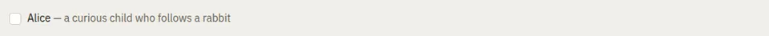

# Checkbox

Storybook title: `Primitives/Checkbox`. Source: `src/components/primitives/Checkbox.tsx`.

## Stories

- Unchecked
- Checked
- Disabled
- Press Toggles
- Space Toggles

## Used by

- `src/components/booth/ReaderFlagsPanel.tsx`
- `src/components/credits/CreditsSetupDialog.tsx`
- `src/components/engine/ChapterTagsDialog.tsx`
- `src/components/engine/CreateChapterRegionsDialog.tsx`
- `src/components/engine/LinkChaptersDialog.tsx`
- `src/components/master/MasterToSpecPanel.tsx`
- `src/components/master/MultiPlatformExportPanel.tsx`
- `src/components/master/ReportExportPanel.tsx`
- `src/components/production/ImportReview.tsx`
- `src/components/production/StatusReportPanel.tsx`
- `src/components/proof/AuditionDialog.tsx`
