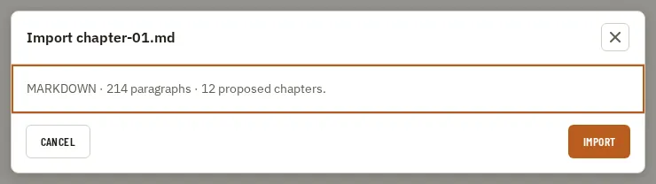

# ConfirmDialog

Storybook title: `Primitives/ConfirmDialog`. Source: `src/components/primitives/ConfirmDialog.tsx`.

## Stories

- Default
- Pending
- Destructive Confirm
- Rich Body
- With Danger Action
- With A Secondary Choice
- With Children
- Long Unbroken Body
- Long Scrolling Children
- Is An Alert Dialog Described By Its Body
- Confirm Invokes Handler
- Cancel And Close Invoke Cancel
- Escape Declines But Backdrop Does Not
- Danger Invokes Only Danger
- Escape Is Ignored While Work Runs

## Used by

- `src/App.tsx`
- `src/components/assets/AssetInstallPrompt.tsx`
- `src/components/assets/LocalAssetRow.tsx`
- `src/components/home/Home.tsx`
- `src/components/settings/Settings.tsx`
- `src/components/settings/UpdatesPanel.tsx`
- `src/components/storybible/GuideDetail.tsx`
